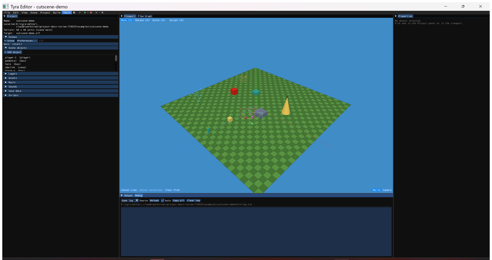

# TyraX documentation

User-facing guides for what TyraX — the engine and its editor — can do, written
for people building games with it. Internals live in code comments, the git log
(commit messages carry what changed and how it was verified) and the
`.claude/skills/` developer guides. What's queued is in [Backlog](backlog.md).

**World & objects**

- [Animated models (.glb / .fbx)](animated-models.md) — authoring in Blender, import,
  clip playback, flow nodes and the script API, the PS2 memory budget.
- [Importing animation from another file](animation-import.md) — borrow clips
  from a second rigged file (a Mixamo download, another export) onto a model you
  already have: name-based bone matching, the translation policy that keeps your
  character's proportions instead of the source's, root-motion retargeting.
- [Static models: the .tmdl pipeline and mesh LOD](model-pipeline.md) — why the
  game reads a binary model instead of your `.obj`, and distance LOD with
  authored or auto-decimated tiers.
- [World scale: units, meters and imports](world-scale.md) — what a unit is
  worth, why imports land several times too small, and the tools that tell you.
- [The terrain, and building without one](terrain.md) — the per-scene ground
  plane is optional; what "no terrain" means in the editor and in the game.
- [Terrain painting](terrain-painting.md) — blending grass/rock/path layers
  with a brush, two-pass GS splatting, stochastic tiling.
- [Terrain distance detail (LOD)](terrain-lod.md) — far tiles built from fewer
  heightmap samples, stitched so no crack shows; what makes a big map drawable.
- [Areas (invisible volumes)](areas.md) — the box that replaces hand-typed
  distances: streaming zones, catch lists for mirrors/portals/feeds, the In
  Area trigger, reverb rooms.
- [Placing objects: surface snapping and deferred paste](object-placement.md) —
  objects that rest on what's below them, `End` to drop, paste that follows the
  cursor.
- [Orthographic and axis views](orthographic-views.md) — the six locked views,
  the axis gizmo, and why a parallel view draws what's behind the camera.
- [PS2 output in the viewport](ps2-viewport.md) — see the scene the way the
  console rasterizes it, field rendering included.
- [TV safe areas](safe-areas.md) — viewport guides for what a real television
  will not crop, plus the one case where PAL shows more than NTSC.
- [Collision boxes](collision-boxes.md) — what actually stops the player, why
  it's nowhere near the object's centre, and how to see it.
- [Prefabs](prefabs.md) — reusable object groups (flow graphs included),
  stamped, scattered or spawned.
- [Asset Browser](asset-browser.md) — a real file manager over `res/` that
  knows who references every asset and moves files with their references.

**Materials & look**

- [Materials: model preview, duplication and texture painting](material-painting.md) —
  the Material Editor's live preview, duplicating with textures, painting
  straight onto the mesh through its UVs.
- [Material map baking (matbake)](material-baking.md) — the UV-space raytraced
  baker (AO, bent normals, thickness, curvature...) and the high-poly cage.
- [Texture atlasing](texture-atlasing.md) — packing small textures into shared
  256x256 pages and what that reclaims in GS VRAM.
- [Emissive materials (glow)](emissive-materials.md) — self-lit materials, the
  white-hot core, bloom threshold and spread, and baked emissive light.
- [Pre-lit models (light baked into the texture)](prelit-models.md) — per-pixel
  static light on a TEXTURED model, the way the PS2 era did it, why the lightmap
  cannot do it, and how a scene's pre-lit objects are tracked, batch-baked and
  reverted.
- [The flashlight](flashlight.md) — the player's torch: the per-vertex cone, the
  projected ground pool, and the gobo texture that decides its shape.
- [Dynamic shadows](shadows.md) — the two runtime shadows an object can cast (a
  blob or a real projected silhouette, chosen per object), and the shadow
  volumes a scene's spot lights can carve — with the reason only one spot casts
  per frame.
- [Reflective materials (sphere-mapped "chrome")](reflective-materials.md) —
  the PS2-era fake for car paint, static or re-rendered from the live sky.
- [Raytraced reflections (VU0, experimental PoC)](raytraced-reflections.md) — a
  Mirror whose reflection is actually ray-traced per pixel, and what it costs.
- [Live texture feeds (CCTV + mirror streams)](texture-feeds.md) — any surface
  showing a live camera render or a mirror's image.
- [Portals](portals.md) — the linkable surface that shows a live through-view
  and teleports whatever walks in, velocity included.
- [Baked ambient occlusion (contact shadows)](ambient-occlusion.md) — soft
  shadows where geometry meets, and the knobs; plus **Model AO**, each `.obj`
  model's own self-occlusion baked automatically into the texture it already
  ships, for no extra VRAM.
- [Baked global illumination + light probes](global-illumination.md) — a
  multi-bounce lightmap plus a probe grid, traced on your desktop so the
  console pays nothing.
- [Day / night cycle](day-night-cycle.md) — the time-of-day slider the whole
  bake follows, sun and moon arcs, the runtime clock.
- [Custom screen effects](custom-screen-effects.md) — your own full-screen post
  effects in `.screenfx` text files, no editor rebuild.
- [The neural upscaler (BLSS)](neural-upscaler.md) — reduce the 3D raster and
  reconstruct it in plain or neural mode; includes the measured break-even and
  training workflow.

**Gameplay & logic**

- [Object scripts (Unity-style components)](object-scripts.md) — C++ scripts on
  objects: lifecycle, ScriptContext reference, globals, performance.
- [Custom flow-graph nodes](custom-flow-nodes.md) — your own action nodes in
  `.flownode` text files: inline C++ or a real function with typed pins.
- [Streaming layers](streaming-layers.md) — GTA3-style interior streaming:
  layers the game loads and unloads at runtime.
- [World Facts](world-facts.md) — named, typed, documented game state in one
  catalog: fact types, four persistence tiers, queries, rules, live watch.
- [Endless scroller](endless-scroller.md) — the conveyor belt that tiles
  authored segments forever; the train-window level generator.
- [Two-player games](multiplayer.md) — shared or split screen, pad-2 hot-join,
  and what the second player costs.
- [NavMesh + NPC AI](navigation-ai.md) — the host-side navigation bake, A* on
  the EE, and the guard-wiring flow nodes.
- [Configurable buttons & keys](input-bindings.md) — named actions, binding
  presets, the in-game rebind menu, the On Action / On Key nodes.
- [Where the player starts](player-start.md) — position, starting height, and
  heading + pitch from the Player object's rotation; how to freeze the camera
  for a repeatable screenshot.
- [Player speeds: walk, run and sprint](player-speeds.md) — the three movement
  tiers of a Player object, how the stick's deflection ramps walk into run while
  the sprint button pins the top flat, and what an unset tier inherits.
- [Text icons (button glyphs in text)](text-icons.md) — `{{cross}}` /
  `{{action:jump}}` placeholders that draw pad glyphs inside any text.
- [Keyboard & mouse](keyboard-mouse.md) — USB keyboard and mouse on the
  console, editor-side preferences and the flow nodes.
- [Sound: voices, priority and who gets cut off](sound.md) — the SPU2's fixed
  voice budget and what happens when it runs out.
- [Reverb (rooms for the sound effects)](reverb.md) — the console's hardware
  reverb wired to an Area: presets, transitions, dry pockets.

**Generators & cinematics**

- [Procedural generation (scatter graphs)](procedural-generation.md) — the node
  graph that fills a region with instances and bakes them to ordinary chunk
  meshes; the PS2 never sees a graph.
- [Runtime procedural generation](procedural-runtime.md) — the same graph
  evaluated on the EE at load, plus Blocks Fill for block worlds.
- [Tree Generator](tree-generator.md) — procedural low-poly trees baked to
  ordinary `.obj` + textures.
- [Drone Generator (ambient music)](drone-generator.md) — the built-in ambient
  generator: signal chain, gliding chords, timeline automation, seamless loops.
- [Camera takes (phone-recorded 6DoF moves)](camera-takes.md) — importing a
  real ARKit camera move into a Cutscene Director track.
- [Phone camera (live viewfinder)](phone-camera.md) — the companion iOS app:
  live viewport stream on the phone, its pose driving the editor camera,
  recorded straight into keyframes.

**The game around the game**

- [Loading screens](loading-screens.md) — named screens with real progress
  bars, per-scene or project-default, and the start scene.
- [Credits rolls](credits.md) — scrolled or card-mode credits from a text file,
  and the VRAM budget that decides how long a roll can be.
- [Menu stylesheets](menu-styles.md) — a menu's look as a CSS-shaped
  `.menustyle` file, baked to sprites on the host.
- [Save Editor](save-editor.md) — memory card saves in one window: browser
  title, real 3D icon, slot sizes, save values, RAM checkpoints.

**Iterating on a running game**

- [The devkit, and its zero-cost promise](devkit.md) — the live channels, crash
  reporting, the VU1 inspector, and the release audit that PROVES a shipped ELF
  carries none of it.
- [Live Link (edit the running game)](live-link.md) — moves, recolors, adds and
  deletes streamed into the running game, no rebuild.
- [Live Logic (edit a flow graph with no rebuild)](live-logic.md) — the
  flow-graph interpreter debug builds carry, and what still needs a build.
- [Live Debugger (step through the running game's logic)](live-debugger.md) —
  breakpoints on flow nodes, pause/step, watches, the execution timeline.
- [The time machine (put the running game back)](time-machine.md) — periodic
  captures of everything the game mutates, pushed back on demand.
- [Remote Pad (hold the running game's controller)](remote-pad.md) — a
  clickable DualShock in the editor and a scriptable `--pad` CLI, no window
  focus needed anywhere.
- [UI scripting (drive the editor without a human)](ui-scripting.md) —
  `--ui-script` clicks widgets by name, with assertions; where every unattended
  editor test starts.
- [The log panels (errors, warnings, verbose)](log-panels.md) — Output and
  Debug classify every line by severity, count them, and let you hide a level.
- [Running and debugging on a real PS2](ps2link-setup.md) — the one-time
  console setup for F6: our patched ps2link, flashing, ports, and a table of
  every failure message.

**Team, AI & housekeeping**

- [Live collaboration sessions](collaboration.md) — multi-user editing over the
  LAN: join codes, what syncs, how conflicts resolve, the trust model.
- [The AI Assistant window](ai-chat.md) — the in-editor chat that answers from
  these very pages and edits the project with tools.
- [AI flow-graph generation](ai-flow-graph.md) — describe game logic in plain
  language, let a backend build the graph.
- [AI-agent CLI tools](ai-tools.md) — the headless commands that let an AI
  assistant inspect and modify a project without the GUI.
- [AI support in projects](ai-support.md) — the assistant guidance files
  installed into generated projects, and their ownership rule.
- [The VS Code extension](vscode-extension.md) — highlighting, snippets and
  validation for `.flownode` / `.screenfx`.
- [The editor's look: themes and the interface font](editor-theme.md) — the
  four themes (three of them PS2 nods), and why the choice is machine-global.
- [Project format versioning & migrations](format-versioning.md) — what happens
  when you open an older or newer project, `--migrate`, and the bump rules.
- [Installing TyraX and keeping it up to date](updates.md) — the Windows
  installer, the Linux tarball/`.deb`/`.rpm` and which of them can update
  itself, the layout they all lay down, the startup update check and how to
  switch it off, and how every push to `main` becomes a release.

Developer design docs (internals, not user guides):

- [Profiling the generated game](profiling.md) — the built-in frame profiler,
  the COP0 deep-dive technique, and the frame-timing rig.
- [The VU framework](vu-framework.md) — describe a microprogram in C++,
  generate both sides, run it in the host simulator with no PS2.
- [Authoring VU programs](vu-authoring.md) — composing VU1 programs and VU0
  kernels out of stages, no assembly.
- [VU1 clipping and the guard band](vu1-clipping.md) — how the static pipeline
  routes geometry between the cull and clip programs, why edge-of-screen
  geometry needs no clipping at all (the GS scissor crops it), and the measured
  cost of getting that decision wrong.
- [GS VRAM residency](gs-vram.md) — where the 4 MB goes, 16-bit frame buffers
  and dithering, what a texture really costs, the texture heap and its eviction
  policy, measured before/after numbers.
- [Frame extrapolation](frame-extrapolation.md) — synthesising an extra frame
  by re-drawing the last one under a newer camera: 25 Hz world, 50 Hz picture.
- [Frame pacing](frame-pacing.md) — the vsync cliff and the triple-buffered
  present that removes it.
- [A binary format for static models (.tmdl) + static mesh LODs](static-model-format-plan.md) —
  the design behind the format; the user guide is [model-pipeline.md](model-pipeline.md).
- [BLSS reconstruction math](blss-reconstruction.md) — the twin contract
  between the upscaler's host trainer and its PS2 runtime, byte for byte.
