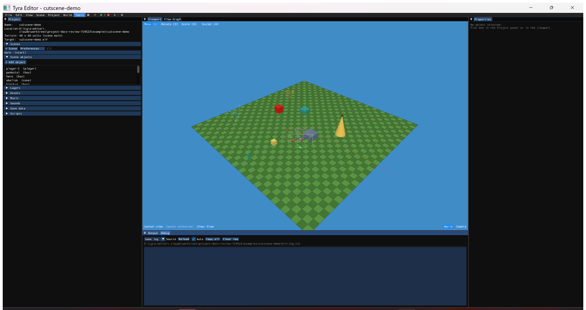

# TyraX documentation

User-facing guides for what TyraX — the engine and its editor — can do, written
for people building games with it. Internals live in code comments, the git log
(commit messages carry what changed and how it was verified) and the
`.claude/skills/` developer guides. What's queued is in [Backlog](backlog.md).

**World & objects**

- [Animated models (.glb / .fbx)](animated-models.md) — authoring in Blender, import,
  clip playback, flow nodes and the script API, the PS2 memory budget.
- [Importing animation from another file](animation-import.md) — borrow clips
  from a second rigged file (a Mixamo download, another export) onto a model you
  already have: name-based bone matching, the translation policy that keeps your
  character's proportions instead of the source's, root-motion retargeting.
- [Static models: the .tmdl pipeline and mesh LOD](model-pipeline.md) — why the
  game reads a binary model instead of your `.obj`, distance LOD with authored
  or auto-decimated tiers, and the triangle strips the build ships beside the
  triangle list so a shared corner costs one VU1 package instead of three.
- [Seeing how static objects batch](static-batching.md) — which objects merged
  into one submission and which did not, with the reason named for every object
  that stayed solo; what a batch costs in VU1 packages against its members
  drawn separately, why the merged box is the number to look at, and the
  per-object opt-out for when one outlying member keeps a whole group drawn.
- [World scale: units, meters and imports](world-scale.md) — what a unit is
  worth, why imports land several times too small, and the tools that tell you.
- [The terrain, and building without one](terrain.md) — the per-scene ground
  plane is optional; what "no terrain" means in the editor and in the game.
- [Terrain painting](terrain-painting.md) — blending grass/rock/path layers
  with a brush, two-pass GS splatting, stochastic tiling.
- [Terrain distance detail (LOD)](terrain-lod.md) — far tiles built from fewer
  heightmap samples, stitched so no crack shows; what makes a big map drawable.
- [Roads](roads.md) — spline streets glued to the terrain: a handful of authored
  points and one texture become a tessellated, terrain-projected ribbon, built
  at scene load by a twin of the editor's own tessellator, shipped as triangle
  strips, and reduced laterally against a published surface and UV budget.
- [Areas (invisible volumes)](areas.md) — the box that replaces hand-typed
  distances: streaming zones, catch lists for mirrors/portals/feeds, the In
  Area trigger, reverb rooms.
- [Comments (editor notes)](comments.md) — a note pinned to a place in the
  scene, drawn as an always-visible message icon; editor-only, any length.
- [Selecting objects](object-selection.md) — visible mesh priority, AABB fallback, full-model selection outlines, and reaching an object inside or behind another (click cycling, the right-click stack menu, the status line).
- [Placing objects: surface snapping and deferred paste](object-placement.md) —
  objects that rest on what's below them, `End` to drop, paste that follows the
  cursor.
- [Orthographic and axis views](orthographic-views.md) — the six locked views,
  the axis gizmo, and why a parallel view draws what's behind the camera.
- [PS2 output in the viewport](ps2-viewport.md) — see the scene the way the
  console rasterizes it, field rendering included.
- [TV safe areas](safe-areas.md) — viewport guides for what a real television
  will not crop, plus the one case where PAL shows more than NTSC.
- [Rigid-body physics](physics.md) — physics bodies as real rigid bodies: a baked
  convex hull per mesh, contact points, impulses with friction and restitution,
  and what it costs on the EE.
- [Particle library](particles.md) — particle effects defined once in the Particle
  Editor and linked from emitters and vehicle tyre smoke, additive fire and
  sparks, and procedural smoke / flame / glow textures.
- [Collision boxes](collision-boxes.md) — what actually stops the player, why
  it's nowhere near the object's centre, how to see it, a model's own smaller
  box (a lamp's post) and what mesh collision costs.
- [Prefabs](prefabs.md) — reusable object groups (flow graphs included),
  stamped, scattered or spawned.
- [Asset Browser](asset-browser.md) — a real file manager over `res/` that
  knows who references every asset and moves files with their references.

**Materials & look**

- [Materials: model preview, duplication and texture painting](material-painting.md) —
  the Material Editor's live preview, duplicating with textures, painting
  straight onto the mesh through its UVs.
- [Material map baking (matbake)](material-baking.md) — the UV-space raytraced
  baker (AO, bent normals, thickness, curvature...) and the high-poly cage.
- [Texture atlasing](texture-atlasing.md) — packing small textures into shared
  256x256 pages and what that reclaims in GS VRAM.
- [Emissive materials (glow)](emissive-materials.md) — self-lit materials, the
  white-hot core, bloom threshold and spread, and baked emissive light.
- [Pre-lit models (light baked into the texture)](prelit-models.md) — per-pixel
  static light on a TEXTURED model, the way the PS2 era did it, why the lightmap
  cannot do it, and how a scene's pre-lit objects are tracked, batch-baked and
  reverted.
- [The flashlight](flashlight.md) — the player's torch: the per-vertex cone, the
  projected ground pool, and the gobo texture that decides its shape.
- [Shadows](shadows.md) — the three shadows an object can cast (a blob, a real
  projected silhouette, or one **baked into a projected decal** — the static
  one that reaches textured walls and imported models, and costs one draw call
  per atlas page however many you have), and the shadow volumes a scene's spot
  lights can carve — with the reason only one spot casts per frame, and how the
  four silhouette slots change hands without blinking.
- [Reflective materials (sphere-mapped "chrome")](reflective-materials.md) —
  the PS2-era fake for car paint, static or re-rendered from the live sky, with
  a reuse budget stated in pixels of the probe's own target.
- [Raytraced reflections (VU0, experimental PoC)](raytraced-reflections.md) — a
  Mirror whose reflection is actually ray-traced per pixel, and what it costs.
- [Live texture feeds (CCTV + mirror streams)](texture-feeds.md) — any surface
  showing a live camera render or a mirror's image.
- [Portals](portals.md) — the linkable surface that shows a live through-view
  and teleports whatever walks in, velocity included.
- [Baked ambient occlusion (contact shadows)](ambient-occlusion.md) — soft
  shadows where geometry meets, and the knobs; plus **Model AO**, each `.obj`
  model's own self-occlusion baked automatically into the texture it already
  ships, for no extra VRAM.
- [Interleaved passes](interleaved-passes.md) - the static batch and road
  draws fed into the object loop so EE and VU1 work overlap; Auto / Always /
  Off, the whole-loop auto tuner, the blend gate and the PS2 numbers.
- [Conservative occlusion culling](occlusion-culling.md) — build-time inner
  proxy boxes, the runtime CPU visibility buffer, safety refusals and per-object
  opt-outs.
- [Baked global illumination + light probes](global-illumination.md) — a
  multi-bounce lightmap plus a probe grid, traced on your desktop so the
  console pays nothing.
- [Day / night cycle](day-night-cycle.md) — the time-of-day slider the whole
  bake follows, sun and moon arcs, the runtime clock.
- [Painted sky](sky-texture.md) — a 360-degree panorama on the sky dome, tinted
  by the day/night cycle and reflected in car paint.
- [Motion blur](motion-blur.md) — the previous frame smeared over this one, for
  one full-screen blend and no VRAM; what the amount means, why it belongs under
  the HUD, and the Set Motion Blur node.
- [Custom screen effects](custom-screen-effects.md) — your own full-screen post
  effects in `.screenfx` text files, no editor rebuild.
- [The neural upscaler (BLSS)](neural-upscaler.md) — reduce the 3D raster and
  reconstruct it in plain or neural mode; includes the measured break-even and
  training workflow.

**Gameplay & logic**

- [Object scripts (Unity-style components)](object-scripts.md) — C++ scripts on
  objects: lifecycle, ScriptContext reference, globals, performance.
- [Custom flow-graph nodes](custom-flow-nodes.md) — your own action nodes in
  `.flownode` text files: inline C++ or a real function with typed pins.
- [Streaming layers](streaming-layers.md) — GTA3-style interior streaming:
  layers the game loads and unloads at runtime.
- [World Facts](world-facts.md) — named, typed, documented game state in one
  catalog: fact types, four persistence tiers, queries, rules, live watch.
- [Endless scroller](endless-scroller.md) — the conveyor belt that tiles
  authored segments forever; the train-window level generator.
- [Two-player games](multiplayer.md) — shared or split screen, pad-2 hot-join,
  and what the second player costs.
- [Vehicles](vehicles.md) — model import, the Vehicle Editor, driving, sounds,
  damage, effects and verification.
- [Bring a vehicle from Blender into TyraX](blender-vehicle-modeling.md) — a
  short visual checklist for adapting an existing model, exporting it, and
  checking the import; the editable Ravager scene is an example.
- [NavMesh + NPC AI](navigation-ai.md) — the host-side navigation bake, A* on
  the EE, and the guard-wiring flow nodes.
- [Configurable buttons & keys](input-bindings.md) — named actions, binding
  presets, the in-game rebind menu, the On Action / On Key nodes.
- [Where the player starts](player-start.md) — position, starting height, and
  heading + pitch from the Player object's rotation; how to freeze the camera
  for a repeatable screenshot.
- [Player speeds: walk, run and sprint](player-speeds.md) — the three movement
  tiers of a Player object, how the stick's deflection ramps walk into run while
  the sprint button pins the top flat, and what an unset tier inherits.
- [Text icons (button glyphs in text)](text-icons.md) — `{{cross}}` /
  `{{action:jump}}` placeholders that draw pad glyphs inside any text.
- [Keyboard & mouse](keyboard-mouse.md) — USB keyboard and mouse on the
  console, editor-side preferences and the flow nodes.
- [Sound: voices, priority and who gets cut off](sound.md) — the SPU2's fixed
  voice budget and what happens when it runs out.
- [Reverb (rooms for the sound effects)](reverb.md) — the console's hardware
  reverb wired to an Area: presets, transitions, dry pockets.

**Generators & cinematics**

- [Procedural generation (scatter graphs)](procedural-generation.md) — the node
  graph that fills a region with instances and bakes them to ordinary chunk
  meshes; the PS2 never sees a graph.
- [Runtime procedural generation](procedural-runtime.md) — the same graph
  evaluated on the EE at load, plus Blocks Fill for block worlds.
- [Distant model impostors](impostors.md) - offline tree captures and distance-based model replacement.
- [Rendering directions](rendering-directions.md) - assessed priorities for a PS2 visual showcase.
- [Tree Generator](tree-generator.md) — procedural low-poly trees baked to
  ordinary `.obj` + textures.
- [Drone Generator (ambient music)](drone-generator.md) — the built-in ambient
  generator: signal chain, gliding chords, timeline automation, seamless loops.
- [Cutscenes](cutscenes.md) — the Cutscene Director's sequence options: hiding
  the HUD (and the USE prompt with it), widescreen bars and fades, and skipping
  — instantly or through an authored confirmation screen.
- [Camera takes (phone-recorded 6DoF moves)](camera-takes.md) — importing a
  real ARKit camera move into a Cutscene Director track.
- [Phone camera (live viewfinder)](phone-camera.md) — the companion iOS app:
  live viewport stream on the phone, its pose driving the editor camera,
  recorded straight into keyframes.

**The game around the game**

- [Animated HUD](hud-animation.md) — live health/stamina/progress bars,
  per-element looped motion, show/hide transitions and one-shot effects.
- [Loading screens](loading-screens.md) — named screens with real progress
  bars, per-scene or project-default, and the start scene.
- [Credits rolls](credits.md) — scrolled or card-mode credits from a text file,
  and the VRAM budget that decides how long a roll can be.
- [Menu stylesheets](menu-styles.md) — a menu's look as a CSS-shaped
  `.menustyle` file, baked to sprites on the host.
- [Save Editor](save-editor.md) — memory card saves in one window: browser
  title, real 3D icon, slot sizes, save values, RAM checkpoints.

**Iterating on a running game**

- [Full-asset PS2 performance recheck](performance-hardware-recheck.md) — corrected
  hardware tests after detecting missing textures and models in agent fixtures.
- [Static submission batching](static-submission-batching.md) — the
  retained-stream ownership contract, safe resident-texture boundaries and the
  physical-PS2 measurements, image checks and eviction/pipeline stress behind
  bounded StaPip DMA submission.
- [Retained static geometry command data](retained-static-commands.md) — a
  wholly visible static bag's VU1 command block and the clipping constants are
  captured once and replayed with a memcpy, so only the MVP, the picked light
  and the visibility classification stay per-frame; why copying finished DMA
  tags is safe, and what invalidates a block.

- [The devkit, and its zero-cost promise](devkit.md) — the live channels, crash
  reporting, the VU1 inspector, and the release audit that PROVES a shipped ELF
  carries none of it.
- [Live Link (edit the running game)](live-link.md) — moves, recolors, adds and
  deletes streamed into the running game, no rebuild.
- [Live Logic (edit a flow graph with no rebuild)](live-logic.md) — the
  flow-graph interpreter debug builds carry, and what still needs a build.
- [Live Debugger (step through the running game's logic)](live-debugger.md) —
  breakpoints on flow nodes, pause/step, watches, the execution timeline.
- [The time machine (put the running game back)](time-machine.md) — periodic
  captures of everything the game mutates, pushed back on demand.
- [Remote Pad (hold the running game's controller)](remote-pad.md) — a
  clickable DualShock in the editor and a scriptable `--pad` CLI, no window
  focus needed anywhere.
- [Input recorder (record a session, perform it again)](input-replay.md) —
  every frame's input written to a small committable file, replayed over the top
  of a real controller; `--replay` exits 0 when the run reproduced exactly.
- [UI scripting (drive the editor without a human)](ui-scripting.md) —
  `--ui-script` clicks widgets by name, with assertions; where every unattended
  editor test starts.
- [The log panels (errors, warnings, verbose)](log-panels.md) — Output and
  Debug classify every line by severity, count them, and let you hide a level.
- [Running and debugging on a real PS2](ps2link-setup.md) — the one-time
  console setup for F6: our patched ps2link, flashing, ports, and a table of
  every failure message.

**Team, AI & housekeeping**

- [Live collaboration sessions](collaboration.md) — multi-user editing over the
  LAN: join codes, what syncs, how conflicts resolve, the trust model.
- [The AI Assistant window](ai-chat.md) — the in-editor chat that answers from
  these very pages and edits the project with tools.
- [AI flow-graph generation](ai-flow-graph.md) — describe game logic in plain
  language, let a backend build the graph.
- [AI-agent CLI tools](ai-tools.md) — the headless commands that let an AI
  assistant inspect and modify a project without the GUI.
- [AI support in projects](ai-support.md) — the assistant guidance files
  installed into generated projects, and their ownership rule.
- [The VS Code extension](vscode-extension.md) — highlighting, snippets and
  validation for `.flownode` / `.screenfx`.
- [The editor's look: themes and the interface font](editor-theme.md) — the
  four themes (three of them PS2 nods), and why the choice is machine-global.
- [Project format versioning & migrations](format-versioning.md) — what happens
  when you open an older or newer project, `--migrate`, and the bump rules.
- [Installing TyraX and keeping it up to date](updates.md) — the Windows
  installer, the Linux tarball/`.deb`/`.rpm` and which of them can update
  itself, the layout they all lay down, the startup update check and how to
  switch it off, and how every push to `main` becomes a release.

Developer design docs (internals, not user guides):

- [Physical PS2 hardware timeline](hardware-profiler.md) — bounded RAM captures, hierarchical elapsed-time accounting, actual render jobs and compile-out/runtime observer controls; legacy editor view, HTML/Perfetto export and [same-ELF startup ring control](hardware-timeline-ring-control-2026-10-02.json).
- [Hardware profiler findings](hardware-profiler-results.md) — seven full-asset physical PS2 controls separating host I/O, framebuffer depth, raster area and additional-pass costs.
- [VU1 arithmetic and DMA cache-flush cost](vu1-and-dma-cache-cost.md) — what a
  VU1 cycle per triangle is worth in frame time on real hardware, why ps2sdk's
  two cache primitives are both wrong for a DMA packet, and why neither answer
  is a reason to fork the SDK.
- [The EE pays 147 cycles per triangle](ee-submission-rearchitecture.md) — the
  plan for the next round: why an immediate-mode static pipeline cannot reach
  60 Hz whatever its constants are, the baked VIF stream that would replace it,
  and what is already measured NOT to be the lever. The two bounding probes
  have now been RUN on hardware and both capped what they were aimed at:
  per-package frustum rejection buys more than it costs so the redesign must
  keep it, coarsening the classification is a net loss, and dropping
  `FlushCache` corrupted the picture even with the packet allocated uncached.
- [A baked VIF stream per mesh](baked-vif-stream.md) — the spike behind that
  plan's central change: the exact quadword layout of a package's pure-VIFcode
  block, why one DMA `REF` may replay it, the three facts that turn out to be
  bake-time (the GIFtag, the Z scale and the `MSCAL`), and the memory it costs
  — about as much again as the vertex arrays it duplicates.
- [The content version](bag-content-version.md) — the contract that unparked
  that spike, and the reason it is a TYPE rather than a rule. The baked
  stream's cache key could not see a caller re-shading per-vertex colours in
  place, because `bboxVersion` is a statement about the bounding box; the
  adversarial arm caught it 1 438 times, only while the camera moved. The
  generated game's arrays are now a `BagArray<T>` whose `data()` is const and
  whose every mutation stamps, so a write that forgets to invalidate does not
  compile — with a negative test that was falsified before it was believed, the
  one engine exception named rather than implied away, and the second caller
  the arm then found (the vehicle paint pass, `const_cast`-ing past the array).
- [The acceptance gate for a restructured static pipeline](baked-stream-acceptance-gate.md)
  — the gate every earlier renderer round used pins `packetFlushes`, and a run
  of packages under one `REF` tag cannot cross a flush boundary, so that gate
  pins the prize. This designs the replacement: a canonical, NOP-normalised hash
  of the word stream VIF1 actually receives, with texture mutations interleaved,
  plus byte-identical pixels over a pose sweep — why the VU1 packet tap is the
  right seam but the wrong shape, and the one hole (DMA lifetime on a frozen
  fixture, which PCSX2 cannot see at all) that no gate on this fixture closes.
- [Does the renderer work generalise?](engine-performance-on-a-second-map.md) —
  the control for six rounds of performance work driven by one scene: a second
  map with no content in common gains 8.9% of its work from the same engine.
- [Attributing render submission](render-submission-attribution.md) — the
  opt-in counters that close the gap between the static pipeline's three
  telemetry brackets and the whole `beginFrame`..`endFrame` block, what the
  unmeasured remainder turned out to be, and what the hooks themselves cost.
  Round two splits `bounds` and the package-creation box the same way: it
  exonerates the bbox cacher, prices a caller's per-frame `bboxVersion` bump at
  0.618 ms, and finds 22% of `bounds` in a per-bag fan-out to thirty-two
  qbuffers that reads as three stores.
- [Not re-baking wheels that did not move](wheel-rebake-skip.md) — the vehicle
  wheel batch keeps the vertices of a rig whose inputs did not change and stops
  bumping `bboxVersion` when its buffer is byte-identical, plus the fixture
  hazard that makes a parked benchmark flatter any skip-when-unchanged change.
- [Profiling the generated game](profiling.md) — the built-in frame profiler,
  the COP0 deep-dive technique, and the frame-timing rig.
- [Emulator captures](emulator-captures.md) — unattended PCSX2 savestates and
  GS dumps from a private emulator instance (no focus, no global input), the
  analysers that read them (GS buffer formats, dithering, fill per target, DMA
  chains left in EE RAM), and a 60 Hz commercial title's measured frame shape
  as a yardstick.
- [The VU framework](vu-framework.md) — describe a microprogram in C++,
  generate both sides, run it in the host simulator with no PS2.
- [Authoring VU programs](vu-authoring.md) — composing VU1 programs and VU0
  kernels out of stages, no assembly.
- [The native PS2 toolchain](native-toolchain.md) — the default Docker-free
  build, first-run setup, caches, vendored sources, licences and Docker fallback.
- [The toolchain image](toolchain-image.md) — where the optional Docker image is
  compiled in comes from, and the long measured account of replacing Sony's
  unlicensed `vcl` with `openvcl` so the image can be published at all:
  seventeen miscompiles, what each one broke, and the VU1 latencies measured on
  a real console rather than assumed.
- [What to send upstream to openvcl](upstream-openvcl.md) — the openvcl defects
  that work found, each with the mechanism and a reproducer that fires on the
  stock commit, plus the density flags, ready to hand over.
- [VU1 clipping and the guard band](vu1-clipping.md) — how the static pipeline
  routes geometry between the cull and clip programs, why edge-of-screen
  geometry needs no clipping at all (the GS scissor crops it), and the measured
  cost of getting that decision wrong.
- [GS VRAM residency](gs-vram.md) — where the 4 MB goes, 16-bit frame buffers
  and dithering, the hybrid mode (draw 32-bit, show a dithered 16-bit copy,
  optionally queued through two display buffers), what a texture really costs, the texture heap and its eviction
  policy, the residency census that names what is resident, the Motor District
  garage inventory, measured before/after numbers.
- [Frame extrapolation](frame-extrapolation.md) — synthesising an extra frame
  by re-drawing the last one under a newer camera: 25 Hz world, 50 Hz picture.
- [Frame pacing](frame-pacing.md) — the vsync cliff and the triple-buffered
  present that removes it.
- [A binary format for static models (.tmdl) + static mesh LODs](static-model-format-plan.md) —
  the design behind the format; the user guide is [model-pipeline.md](model-pipeline.md).
- [BLSS reconstruction math](blss-reconstruction.md) — the twin contract
  between the upscaler's host trainer and its PS2 runtime, byte for byte.

## Object groups

[Object groups](object-groups.md) keep assemblies together for selection, rigid transforms, independent copying, deletion and ungrouping.

## Editor viewport performance

[Editor viewport performance](editor-performance.md) explains conservative offscreen model rejection and how to compare navigation costs without changing visual quality.

## TyraX2 frame pipeline

[Frame pipeline flow nodes](frame-pipeline-flow-nodes.md) expose a deferred setter and a getter for the engine request. Requests apply before the next frame, repeated values skip the engine setter, and compatibility fallback can keep overlap inactive. Both nodes require a game rebuild.

[TyraX2](tyrax2.md) documents the ordered frame recorder, enabled for new
projects since 1.171.0 with explicit legacy preservation and opt-out,
two owned banks for EE/GPU overlap, compatibility and overflow fences, chain
validation, and reproducible physical-console correctness/performance controls.
The [1.171.0 release qualification](tyrax2-release-2026-10-03.json) separates
default/legacy policy, current native and runtime checks, and open physical
performance/TV-latency gates. The [reference-memo record](tyrax2-native-reference-memo-2026-10-03.json)
preserves paired physical diagnostic controls; the [ordinary-clock quiet record](tyrax2-quiet-cadence-2026-10-03.json)
preserves measured night cadence and unresolved observer/adaptive drift.
The [post-Memo quiet record](tyrax2-postmemo-quiet-2026-10-03.json) adds both
fresh physical orders with the current count-reuse/Memo engine, 384 samples
and approximately 29.97 FPS; it does not establish an isolated observer tax,
cross-ELF gain or 60 FPS.
The [physical front/tail record](tyrax2-front-tail-2026-10-03.json) completes
both private pinned-plain Showcase orders, but retains unresolved boundary
observer price and possible existing RemotePad polling interference; it does
not report pure EE/VU/GS time or authored Auto performance.
The [RemotePad-free paired control](tyrax2-front-tail-no-remotepad-2026-10-03.json)
places front means at 0.724–0.744 ms and inclusive non-pacing tail means at
36.376–36.384 ms; changing-sign control deltas leave observer price unresolved.
The [1.169.1 runtime acceptance record](tyrax2-runtime-2026-10-02.json) preserves
final repeated day/night hardware timing, the loading-race correction and
emulator/host coverage; the earlier arena record remains historical evidence.
The [night isolation record](tyrax2-night-isolation-2026-10-02.json) compares
seven physical variants, identifies scene pools/beams and live lighting as
the largest measured groups, and preserves exact windows and reproduction scripts.
The [pool/beam split record](tyrax2-light-split-2026-10-02.json) separates their
physical costs and records diagnostic preparation/submission brackets and cache rebuilds.

[TyraX2 SPR staging](tyrax2-spr-staging.md) separates finalized-prefix staging,
cache publication and CALL/RET. It records the completed host byte-preservation
experiment and the remaining physical DMA/cache/performance gates.

[Private SPR/CALL runtime trials](tyrax2-spr-call-runtime-2026-10-04.md) close the
October 4 physical experiments: direct SPR construction regresses by
0.178–0.389 ms and corrected CALL by 3.332–3.532 ms in their own controls.
The page links the immutable prototype sources and compact evidence record;
neither policy is promoted to production.

[Joint night ablation](tyrax2-night-ablation.md) describes the next private
same-ELF joint removal/add-back experiment, its observer controls and separate
source, emulator and physical acceptance gates. Source/native/emulator gates
and both physical calibration/joint orders passed. The simplified joint cut
  has approximately 16.68 ms engine presentation periods. Eight completed
  physical boots narrow the next subdivision to lighting/receiver extras;
  six further physical V3 boots qualify both orders of pool/beam/glow cuts.
  Individual cuts still show approximately 33.37 ms presentation periods.
  The later pool-cache candidate runs correctly but its mixed small physical
  responses do not qualify a stable gain. Reverse V2 add-backs and production
  full-night performance remain open.

[Private unconventional experiments](tyrax2-wild-experiments.md) preserve an
independent fifteen-idea review and two implemented math trials. The four-plane
VU0 candidate completed both emulator and PS2 orders with positive cold action
but no gain; the cone predicate is unreachable in the selected scene. Source
and raw evidence are retained. The later [Pool2 color representation
experiment](tyrax2-pool2-colors.md) completed both physical orders and twelve
fixed-case emulator captures, with six matching decoded VU payload pairs.
Its timing gain did not repeat; it stays private. Source reconstruction,
native audits, raw physical logs and host-control repairs are preserved.

[Pool2 EE producer continuation](tyrax2-pool2-ee-producer.md) removes actual
expanded-color work and repeated geometry/ST copies. Both same-ELF physical
orders favor the candidate by 0.113–0.171 ms, with presentation still at 30 fps.
Twelve epoch-aware VU captures and six packet pairs qualify the tested inside
cases. The candidate remains private; clipping and stable warm replay are not
accepted by that output diagnostic.

[Pool-lattice experiment](tyrax2-pool-lattice.md) transforms eligible shared
points once while preserving original triangle output and fog. Twelve fog
captures, six matching output pairs and both ordinary emulator orders passed.
Both PS2 orders were slower by 0.112–0.260 ms, still at 30 fps. Exact sources,
reconstruction, rejected no-fog preparation and raw evidence are preserved;
production rendering remains unchanged.

[GS SPRITE corona trial](tyrax2-gs-sprite-coronas.md) remains unpromoted.
Its separate 24-bit follow-up now passes isolated completed SPRITE output,
triangle fallback controls and identical textured GS drawing pixels, within
the full resident budget. Ordinary activation, Hybrid scanout and physical
gain remain unqualified; original negative evidence is retained.
The [24-bit source/evidence checkpoint](tyrax2-corona24-2026-10-05/README.md)
includes exact reconstruction, packet controls and drawing-buffer readback.

[Batch / texture / program scopes](tyrax2-batch-texture-scopes-2026-10-04.md)
qualify the V10 inclusive physical interval at 0.751–0.788 ms, with explicit
observer contrasts and rejected attempts. This interval includes dispatch and
wait seams and cannot be added to earlier overlapping scopes as a pure EE bill.

## TyraX2 EE and VU0 audit

[Scene preparation isolation](tyrax2-scene-isolation.md) describes a private
same-ELF Full/terminal-sink experiment with frozen camera, world and lighting,
common buffered observation and explicit completion guards. Three physical boots
retain stable full controls near 33.33 ms and terminal preparation near 15.48 ms;
the difference includes changed completion/backpressure, not isolated GPU time.
The [owned frame capture](tyrax2-frame-capture-2026-10-03.json) qualifies a
2.37 MB closure and all 1160 REF payloads on PS2 and PCSX2. The
[terminal replay record](tyrax2-frame-replay-2026-10-03.json) qualifies exact
framebuffer pairs and VU-state/completion checks on both. The same-ELF
[validation pricing record](tyrax2-replay-pricing-2026-10-03.json) prices the
inclusive repeated-scanner policy at about 12.60 ms on PS2, with both stage
orders qualified. Sealed replay still includes reset, submission and completion
work; it is not a pure GPU timer or an ordinary FPS result.

[EE preparation and VU0](tyrax2-ee-vu0.md) records physical snapshot/conversion/wait attribution, existing VU0 macro owners and the ranked measurement gates for fewer submission passes or a future math kernel. The [machine record](tyrax2-pipeline-attribution-2026-10-02.json) retains exact diagnostic windows and provenance; no offload or hardware gain is claimed.

The private [direct-producer activation record](tyrax2-direct-producer-activation-2026-10-03.json)
records a diagnosed SDK DMA-padding mismatch and corrected 5400-loop activation
checks in PCSX2 and PS2. Positive commits and zero invalid packets establish
activation only. The [fixed raster and route-cost record](tyrax2-direct-producer-raster-2026-10-03.json)
now qualifies both stage orders and exact GS raster pairs, while rejecting a
speed gain: On adds about 0.83 ms nonpacing on PS2. Lifecycle/native-profile and
ordinary FPS qualification remain open; the candidate stays private.
The [ordinary overlap record](tyrax2-direct-producer-overlap-2026-10-03.json)
also retains both physical orders: common sampler 0, about 0.68–0.78 ms added
nonpacing work, about 29.97 Hz rendered completion. Live state is provenance,
not exact parity; no optimization is promoted.
The [debugger execution map](tyrax2-pcsx2-debugger.md) records automated WSL/Xvfb
control, exact raw-state register/call topology and terrain/road/wheel suspects.
SaveState drains prevent hardware timing or FPS claims. The [selected physical scopes](tyrax2-minimal-scopes.md) qualify six ordinary PS2 boots: terrain2.858–2.866ms, wheels0.304–0.306ms and first terrain core1.103–1.113ms. The [frame/Core follow-up](tyrax2-frame-core-scopes-2026-10-04.json) adds eight physical boots: same-frame Core totals13.905–14.153ms inside Scene17.321–17.445ms, with3.284–3.540ms inclusive residual. Completion ownership qualifies only a tiny inclusive remainder after existing pacing. Common observer work and changing adaptive contexts remain unpriced; no60FPS gain is accepted.

The [inner-work scopes](tyrax2-minimal-scopes.md#selected-inner-work-stripped-packages) and [dated record](tyrax2-inner-work-scopes-2026-10-04.json) qualify V5 stripped-package Work (1.126–1.149 ms) and V6 list-package Work (0.827–0.831 ms), plus the V7 dispatch tail. V7 dispatch-tail Work averages 7.167–7.329 ms; same-frame Scene minus that tail is 10.643–10.698 ms inclusive. Narrow the remaining routes using their own source/caller and dynamic clock controls before selecting an optimization. These are different intervals and apparatus versions: no cross-version gain, pure EE/GPU bill, uniform observer fee or ordinary 60 FPS acceptance.

The [producer partition](tyrax2-producer-origin-census-2026-10-04.json) qualifies
both PS2/emulator orders with unchanged original copied counters, an explicit
UnknownBag bucket and separately priced incremental observer; labels do not
establish immutable lifetime, ordinary FPS or an optimization gain.
The [mutable REF census](tyrax2-mutable-ref-census-2026-10-03.json) qualifies
both physical/emulator orders: 171840 mutable bytes per fixed-scene frame,
23.18% matched Pool and 59.38% Unknown. Its observer costs about 0.84–0.85 ms
in this serialized route. This historical record remains unchanged.
The [retained-hit census](tyrax2-mutable-ref-retained-census-2026-10-03.json)
adds the cached-command observation and qualifies both orders:98.46% of copied
bytes match Pool/Bag, with only2640 Unknown bytes/frame. Its own observer costs
about0.945–0.950 ms. These counts establish neither a gain nor borrowing rights.
The [road-owner census](tyrax2-road-owner-census-2026-10-03.json) qualifies both
physical/emulator orders with66 road chunks and198 recorded ranges, but zero
copied-original-road bytes. Its own observer costs about1.073–1.076 ms; the
common off-span owner guards have unpriced absolute cost. The [selected
static-base census](tyrax2-static-owner-census-2026-10-04.json) also qualifies both
orders: all seven parts admitted, 21 ranges/22176 used bytes, but zero selected
copy traffic in the fixed view. Its own observer adds 0.978–1.044 ms, with
common guard/snapshot cost unpriced. Next attribute actual Bag copies by
producer; no borrowing optimization or universal static conclusion is accepted.

The [one-search immutable-borrow trial](tyrax2-immutable-borrow-2026-10-02.json) preserves the narrow candidate, differential and integrated checks, and one physical baseline/candidate/baseline run. Its small apparent work saving overlaps control variation; the runtime remains unchanged.

The [snapshot/native breakdown record](tyrax2-snapshot-breakdown-2026-10-02.json) divides validated snapshot passes, chain/mutable copying and native sizing/emission, with same-ELF observer-overhead controls and callback/state tests. It retains the next scalar-math census plan; timings are diagnostic, not a production gain.

The [exclusive EE math census](tyrax2-ee-vu0.md#exclusive-ee-math-census-physical-ps2) prices clip-plane work and local light selection/preparation under ordinary batching. Its [machine record](tyrax2-ee-math-2026-10-02.json) retains physical gate-off/on/off controls, cache/guard/candidate counts and observer limitations. The [authoring integration audit](tyrax2.md#authoring-integration-audit-2026-10-02) and [PAL flow validation record](tyrax2-integration-2026-10-02.json) distinguish already supported engine fences, the corrected PAL emitter and optional future authoring controls.

The [same-call clip-plane candidate record](tyrax2-clip-reuse-2026-10-02.json) retains exact host classification controls, native build, quiet emulator phases and a separate moving-camera/scene cycle. Physical timing observes a regression; the candidate remains private and unaccepted.

[TyraX2 automatic interleave attribution](tyrax2-interleave.md) explains the confirmed mixed-label sampling interval under N/N-1, zero discarded picks in the stationary night pose, and two physical pinned-order boots: the repeat indicates 0.358–0.404 ms interleave benefit, with approximately 30 Hz delivery unchanged.

The [inverse/key cost census record](tyrax2-ee-inverse-cost-2026-10-02.json)
retains the private five-block native/emulator trial, strict activation/window
checks and source/ELF/log provenance. Physical costs and any output-cache
candidate remain separate gates; emulator clocks establish no EE speed gain.

The [Core prefix and Core-owned submit record](tyrax2-prefix-submit-scopes-2026-10-04.json) qualifies separate V8/V9 both-order physical pairs and emulator controls. Own On windows, actual dynamic reads, tax/chunks and sparse contexts remain bound to each source/ELF. No cross-version subtraction, optimization gain, pure EE/GPU bill, common cost or ordinary 60 FPS acceptance.

The [ordinary 24-bit corona pricing checkpoint](tyrax2-corona24-pricing-2026-10-05/README.md) records both physical orders and normal console visual feedback, with small favorable elapsed estimates near drift and no robust gain or 60 fps claim.

The [private player-only light receiver experiment](tyrax2-player-light-receivers.md) completes both physical orders: 1.407-1.497 ms saved with scene pools retained, 2.247-2.375 ms with scene pools removed; neither achieves stable 60 fps. Source/evidence and the interrupted host attempt are archived.

The [conservative far-light gate experiment](tyrax2-far-light-gate.md) is rejected after both physical orders regress by 0.239/0.230 ms despite matching cold light-selection pointers. Its source/evidence checkpoint preserves the failed emulator startup separately.

The [EE performance audit](tyrax2-ee-performance-audit-2026-10-05.md) maps fourteen concrete preparation, ownership and inherited-API findings, distinguishes active work from conditional routes, checks linked square-root instructions and proposes bounded VU0/VU1 experiments without invented gains.

The [night producer observer trial](tyrax2-night-producers.md) qualifies both hardware orders: two flashlight scopes are inactive in 960 observed loops, while beam scratch and corona/cone commits total about 0.235 ms. Enabled observer tax is confounded by drift; source and raw evidence are archived without an optimization or 60 fps claim.

The [Core prefix partition](tyrax2-core-prefix-partition.md) separates bounds/package preparation, texture/program/light facts and object-data routing in one native ELF. Both physical clock orders retain disjoint elapsed costs, observation limits and complete source-bound evidence.

The [Core prefix follow-up](tyrax2-core-prefix-partition.md#five-part-bounds-follow-up-kind15) prices five disjoint head/bounds/package regions in both physical clock orders. No one subregion dominates; exact matrix-key and clip-plane specialization candidates require separate physical pricing.

The [Core preparation experiments](tyrax2-core-preparation-experiments.md) reject an unresolved EE quad matrix-key gain and document a clip-plane host/emulator pass that fails actual PS2 bits. Forced coefficient mul.s restores sparse agreement but regresses; row-sharing requires a separate price.

The [sky retint change](tyrax2-sky-retint.md) retains geometry during RGB-only updates, with exact target checks and 0.80/0.85 ms physical savings in both orders.

The [fixed-hour clock](tyrax2-paused-clock.md) separates paused time from effect evaluation and real physics dt; the physical pause contrast saves 0.114/0.161 ms, while Motor District selects its mood once per scene/mood change.

The [night-shift follow-ups](tyrax2-night-shift.md) complete exact cycle reuse, five-way object-data attribution and whole local-light result reuse in both physical orders. The memo gains are small, observer tax is measured, the inactive-output oracle failure is rejected, and no additional production candidate or 60 FPS claim is accepted.

The [Claude proposal trials](tyrax2-claude-trials.md) price original validation at 0.171/0.189 ms in both physical orders, find no active adjacent companion reuse in the stationary emulator census, qualify owned TEX1 register preparation in native/emulator tests, and record hardware-counter overflow/ownership gates. No new production optimization or full-night 60 FPS claim is accepted.
