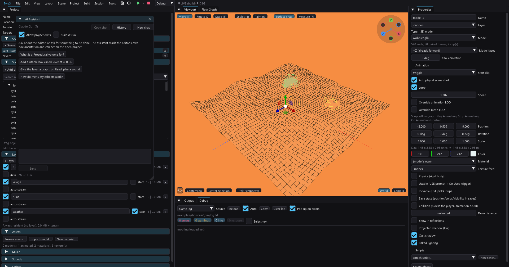

# AI Assistant

The AI Assistant answers questions about TyraX and can edit the open project.
Open **Tools > AI Assistant**.



Configure a backend in **Edit > Preferences > AI assistant**: Claude CLI,
OpenAI Codex CLI, GitHub Copilot CLI or the OpenAI API. CLI backends use their
normal sign-in; the API backend needs a key.

## What it knows

The assistant receives:

- an index of every page under `docs/`, with tools to read or search them;
- scenes, objects, layers, assets and project-wide settings;
- the active scene and current selection;
- results from any tools it calls during the turn.

It does not inherit your backend's normal project instructions or tool access.
The editor's prompt and tools are the whole contract.

## What it can do

Read-only tools cover documentation, project summaries, objects, flow graphs,
procedural graphs, project sections and a running debug game's state, log and
graph activity.

With **Allow project edits** enabled, it can:

- add, duplicate, change and delete objects;
- write flow and procedural graphs;
- add or remove scenes;
- edit menus, ambience, loading screens, HUD, input, saves and other sections;
- create, insert or flatten prefabs;
- bake procedural volumes;
- select objects and open tool windows;
- regenerate sources and save when asked.

Enable **build & run** separately to let it invoke Docker builds, launch the
game and drive the Remote Pad. This switch is separate because builds are slow
and not undone by `Ctrl+Z`.

It cannot import files, sculpt or paint terrain, edit arbitrary source files or
touch anything outside the project model.

## Good requests

Be direct and name the result:

```text
Explain Procedural volumes in three sentences.
Add a usable red lever at 4, 0, -6.
On Used, play the switch sound and hide door-a.
Make a forest volume that avoids the path material, then bake it.
Build, press Cross and tell me which graph nodes fired.
```

“This”, “selected” and “here” use the editor's current selection and scene.

## Safe edits

- Every tool call is one undo step.
- Changes stay in memory until you save.
- Tool rows show the exact input, result or error.
- Wrong object and asset names are rejected with valid alternatives.
- Replacing a project section or procedural graph is a total replacement, not a
  patch. Shrinking a list requires explicit confirmation.
- Writing a procedural graph marks its bake stale; ask the assistant to bake it
  if you want generated geometry now.

Turn **Allow project edits** off when you only want advice.

## Checking its work

The assistant can call **refresh generated** after graph edits. This catches
missing object, scene and asset references without Docker. With **build & run**
enabled it can also wait for the build, read compiler errors, launch a debug
game, press buttons and inspect the game's log and graph counters.

Running-game tools need the matching [devkit](devkit.md) channels in a debug
build. A release build intentionally exposes nothing.

## Conversation controls

- Click an assistant message to copy it.
- **Copy chat** copies the full transcript and tool results.
- **New chat** starts with no conversation memory.
- **History** restores chats saved for this project.
- **Compact** summarizes an oversized transcript and continues from the summary.

Each tool round is another backend request. A turn that reads several pages,
edits a graph and builds the game therefore costs more than a simple answer.
The footer shows available token and cost data; backends that do not report it
are labelled as such rather than estimated.

## History and privacy

Chats are stored locally under the editor's configuration directory, grouped by
project. They are not part of the `.tyra` project and are not committed unless
you copy them into the repository yourself.

The chosen backend receives the prompt, relevant transcript, project summaries
and tool results. It does not receive arbitrary project files unless their
contents are represented by an editor tool.

## Related tools

- [AI flow-graph generation](ai-flow-graph.md) for a focused graph-only dialog.
- [AI support files](ai-support.md) for assistants working in generated source.
- [AI command-line tools](ai-tools.md) for scripted project changes.
