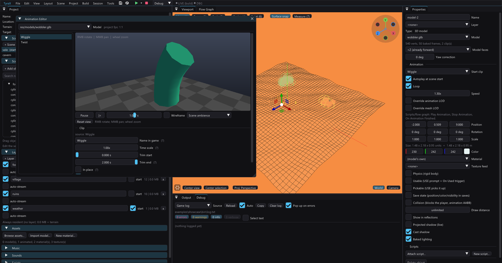
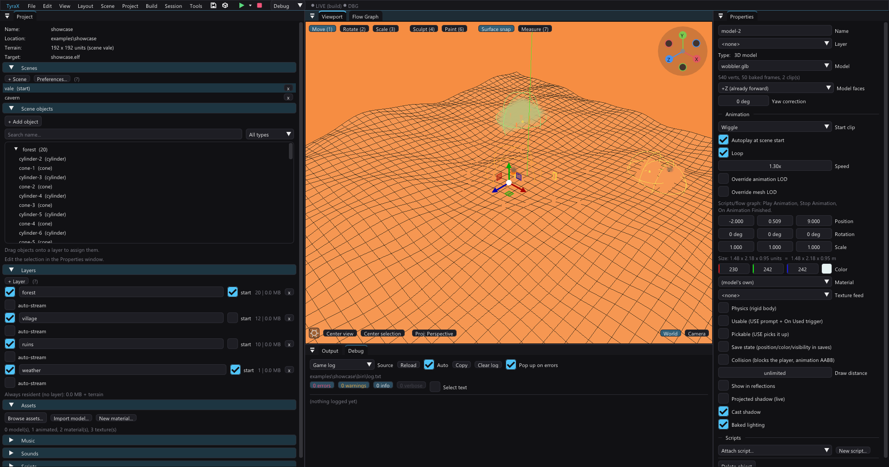
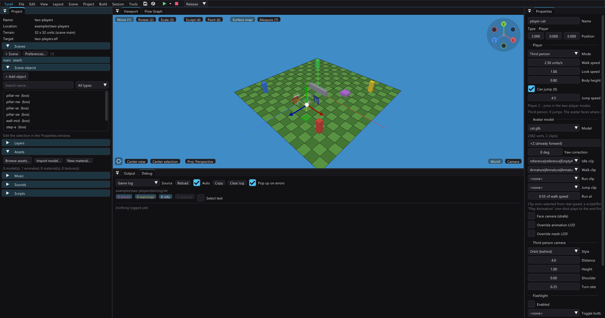

# Animated models

TyraX imports skeletal `.glb` and `.fbx` models, previews their clips and bakes
them into the PS2-native `.tskl` format.



## Authoring

In Blender or another DCC tool:

- keep the rig under 256 bones and rigid mesh nodes;
- apply object scale before export;
- use one armature and triangulated meshes;
- give actions clear, unique names;
- use power-of-two textures;
- export `.glb` when possible because it carries textures with it.

Morph targets and procedural materials are not supported. FBX works, but its
external textures must be available during import.

## Import and place

Use **Project > Import model** or the [Asset Browser](asset-browser.md), then
drag the model into the viewport. The inspector reports vertices, bones, clips
and estimated runtime memory before you build.



**An untextured model's colour is its glTF `baseColorFactor`**, and the
viewport reads it the way the game does. That is worth saying because the two
disagreed until 1.47.0: the viewport carried only a mesh and a texture per
part, so a model with no texture at all — `examples/showcase`'s wobbler is teal
by its base colour and nothing else — was drawn in the scene light alone and
came out orange in the editor while the console drew it green.

Animated model properties include:

- start clip, autoplay, loop and speed;
- facing-axis correction;
- animation and mesh LOD overrides;
- the usual transform, draw distance, material and gameplay flags.

Assigning an `.mtl` overrides the imported materials for the whole model. Use
this for simple recolours or effects; use the embedded materials when different
mesh parts need different textures.

A **clip-only file** — a downloaded move with no useful mesh — is imported the
same way, but you put its animation on a character you already have rather than
placing it. See [animation-import.md](animation-import.md).

## Edit clips

Open **Tools > Animation Editor**. Select a model and clip (the list has a
name filter), then preview, pause, scrub or switch to wireframe.

Clip edits are non-destructive:

- **Name in game** gives a short runtime name.
- **Time scale** fixes one clip that plays too quickly or slowly.
- **Trim start/end** cuts unwanted frames.
- **In place** removes root translation for locomotion.
- **Loop by default** sets the initial object behaviour.

Project Preferences also has a global animation FPS for exports whose authored
rate was interpreted incorrectly. Fix a single clip with Time scale; use the
project setting only when every clip is wrong by the same factor.

The same window's **Imported clips** section borrows clips out of a *different*
rigged file — a Mixamo download, another export from an animator — and puts them
on this model, matching bones by name and keeping this model's own proportions.
An imported clip then behaves as one of this model's clips everywhere, including
every field above. See [animation-import.md](animation-import.md).

## Third-person players

A third-person Player can use any imported animated model as its avatar. Map
Idle and Walk, then optionally Run, Sprint, Jump, Back and strafe clips. The runtime
chooses locomotion from actual movement speed, matches playback speed and
crossfades automatically. **Run at** is the fraction of the player's full-stick
**run speed** at which the Run clip takes over; sprinting is always above it.
See [player-speeds.md](player-speeds.md).

**Face camera** enables directional locomotion. Camera styles include orbit,
top-down, isometric and fixed angle. Distance, height and shoulder offset tune
the rig; a spring arm keeps it outside collision boxes.

A flow graph or script can temporarily play a one-shot clip such as an attack.
Locomotion resumes when it finishes.



## Performance and memory

Animated models cost CPU every visible frame. Keep characters lean and use:

| Setting | Effect |
|---|---|
| Draw distance | Stops drawing the object beyond a distance |
| Animation LOD | Updates distant poses every second or fourth frame |
| Mesh LOD | Builds and selects roughly 50% and 25% vertex variants |

Start with draw distance, then animation LOD. Enable mesh LOD where the reduced
model is already small on screen. Per-object overrides let a hero stay full
quality while crowds use the project defaults.

Approximate skeletal memory:

```text
bytes ~= vertices * 75 + keys * 18 + bones * 72
```

Reported vertices are expanded triangle-list vertices, so the count is higher
than an indexed Blender mesh.

## Flow graph

The **Animation** action plays or stops a clip on its linked object (or self).
Play accepts clip, loop, speed and crossfade time. **On Animation Finished**
fires once at the end of a one-shot and on every wrap of a loop.

```text
On Used -> Animation play "open"
On Animation Finished -> Set Object Visible (hide)
```

Clip names are case-sensitive. An empty name uses the first clip.

## Scripts

`inc/scripts/script.hpp` provides:

```cpp
playAnimation(ctx, objectIndex, "attack", false, 1.5F);
playAnimation(ctx, objectIndex, "idle", true, 1.0F, 0.3F); // crossfade
stopAnimation(ctx, objectIndex);

if (animationFinished(ctx, objectIndex)) {
  // ended or wrapped this frame
}
```

These calls are no-ops for objects without animation.

## Build output

Builds write:

- `res/models/<name>.tskl` — mesh, skeleton, weights and compressed tracks;
- extracted model textures beside it, then quantized like other project images.

Sources are never modified and the output is deterministic.

## Troubleshooting

| Symptom | Fix |
|---|---|
| Import says `unusable` | Re-export; the message names the malformed part |
| Invisible in game | Read `[anim bake]` in Output and check the `.tskl` exists |
| Flat-colour texture | Check extracted PNGs and power-of-two dimensions |
| Clip does not switch | Check the exact, case-sensitive clip name |
| Clip switch pops | Add a 0.2–0.4 s crossfade |
| Walk moves the object away | Enable **In place** on that clip |
| Palette-slot error | Simplify the rig below 256 bones/nodes |
| First assignment pauses | The scene preview now bakes in the background (a box placeholder shows for a moment); the Material Editor's own preview still bakes inline. Several seconds of bake usually means an FBX needs ufbx's slower posing path because it uses parent-scale inheritance or dual-quaternion skinning |

Animated models receive the scene's directional and ambient light. Point-light
bakes and the usable-object highlight rim currently apply only to static meshes.
