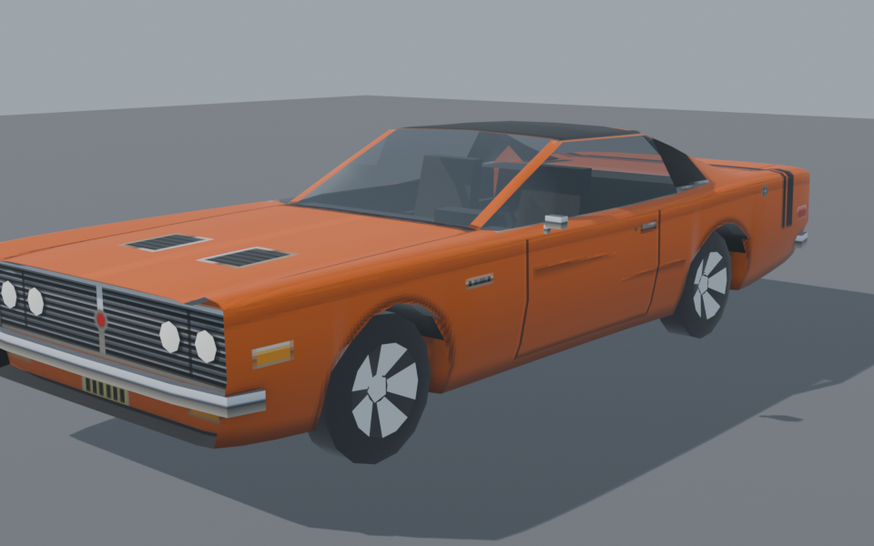
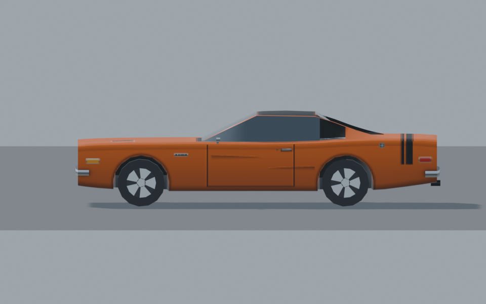
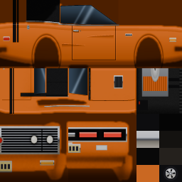

# Bring a vehicle from Blender into TyraX

Already have a car model? Use this checklist to make it driveable in TyraX.
If you are building one from scratch, follow the same rules as you work. The
editable [Ravager `.blend`](../examples/vehicle-playground/authoring/ravager.blend)
is a working example, not a required template.

## 1. Put the car in the right frame

In Blender, use metres and put the nose along **+X**, the car's left along
**+Y**, and up along **+Z**. Centre the body between the axles. Apply rotation
and scale (**Object → Apply → Rotation & Scale**) before export; check that the
body and wheels still line up. If the importer later guesses the nose wrong,
use **Flip front/rear** in the Vehicle Editor.



## 2. Give the importer four wheels to find

The body and **four wheels must be separate mesh objects** in one file. If an
existing model has everything joined, select each wheel's connected geometry
in Edit Mode and use **P → Selection**. Put each wheel object's origin at its
hub; check their positions from above and from the side. Names such as `wheel
front left` help you inspect the scene, but TyraX finds wheels by repeated
shape and position. Matching wheels may share one mesh. Make both faces of a
wheel complete: the game draws one unmirrored wheel mesh on both sides.



If TyraX finds fewer than four wheels, check that they are separate objects,
roughly equal in size, low on the car, and not accidentally included in the
body mesh. Its measured wheelbase, track and radius should match what you see
in Blender.

## 3. Sort materials and textures

Keep the opaque body in as few materials as practical. A small UV atlas saves
texture memory and draw submissions; the example uses **256×256**. Use material
names containing `headlights` and `rear lights` for lamps that the game can
light independently. A material containing `glass` or `window` identifies
glazing; set **Glass opacity** below 1 in TyraX only if the car has an interior
worth seeing. Names containing `rubber` or `trim` mark matte parts. For a
simple untextured car, name the paint material with `paint`.



To change a textured car's paint colour in TyraX, make a **grayscale PNG** at
the atlas's exact size: white on paint, black on windows, lamps, wheels, trim
and decals, and gray only for blended edges. Select it as the definition's
**Paint mask**. The mask affects the bake; it is not drawn by the PS2. It must
match exactly one texture in the model by dimensions. See
[Changing body paint colour](vehicles.md#changing-body-paint-colour).

## 4. Export one file

Select the body and four wheels, then choose **File → Export → glTF 2.0**:
**Format: glTF Binary (`.glb`)**, **Include: Selected Objects**. Keep the
textures embedded, and put the `.glb` in your project's `res/models/`. Keep
your `.blend` as the editable source. The vehicle definition's default body
budget is **2400 triangles**; aim for about **160 per wheel**. TyraX can
reduce an oversized body, but inspect the resulting silhouette. A heavily
shaded atlas may need **8-bit Texture depth** in TyraX rather than 4-bit;
check the project's VRAM budget.

## 5. Import, inspect, drive

Import the `.glb` into the project's assets, then select it in **Tools →
Vehicle Editor → Model**. Check the detected four wheels, front direction,
wheelbase, track, radius, material grouping and transparency. Fix the Blender
source and export again when geometry or UVs are wrong. Build and drive the
game: inspect the car from behind, the side and at distance, and spin the
wheels. If you author a separate far model, build it in the same space and
against the **same atlas** as the full model; otherwise the importer may
discard that far tier. The full import and runtime rules are in
[Vehicles](vehicles.md#importing-a-model).

**Starting from nothing?** Make the silhouette and four symmetric wheel
objects first, at real scale. Then add a compact atlas, separately named
lamps, and an interior only if the windows will be translucent. That order
keeps the import valid while detail is added.

To regenerate the example `.blend` and these reference pictures from the
repository root:

```sh
blender -b --factory-startup --python examples/vehicle-playground/authoring/save-ravager-blend.py -- --preview <output-directory>
```

The Motor District game's Ravager GLB and far model are an older matched pair;
replace both together if you use this source scene in that project.
