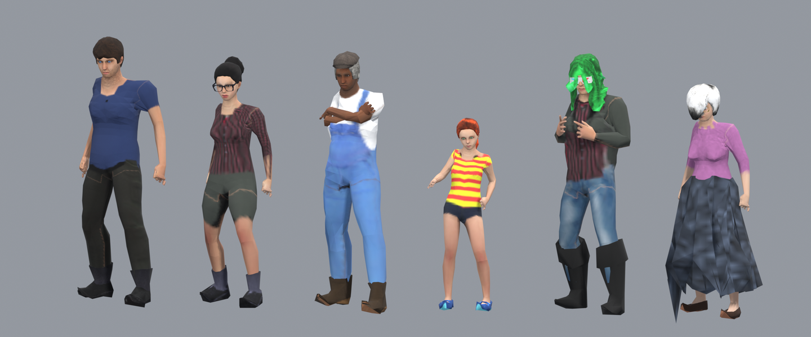
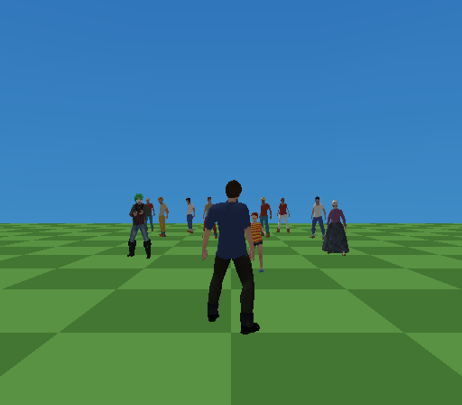
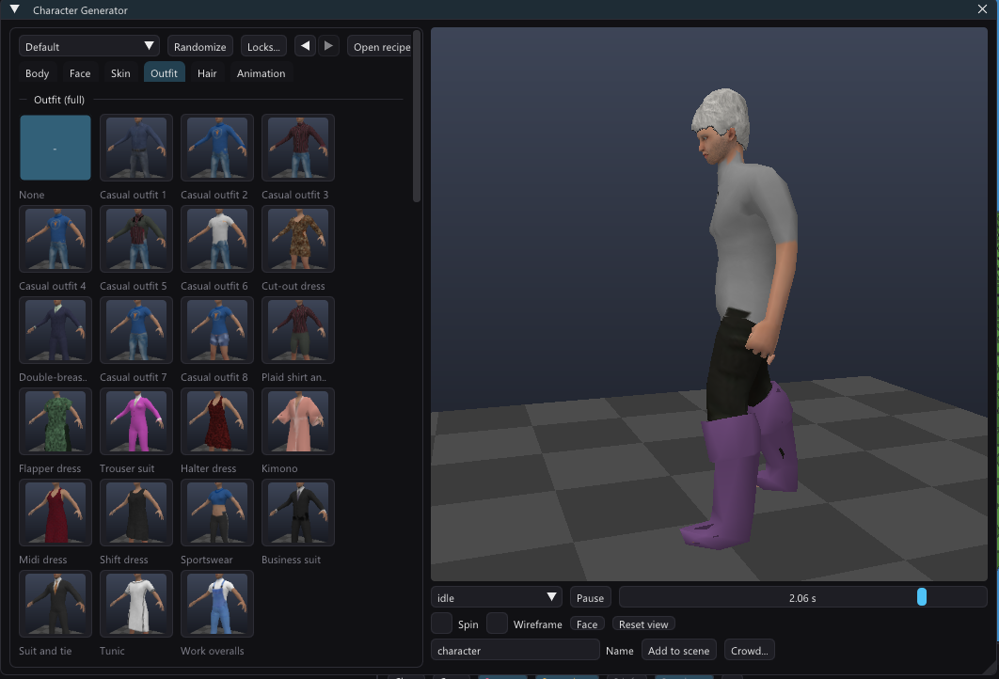
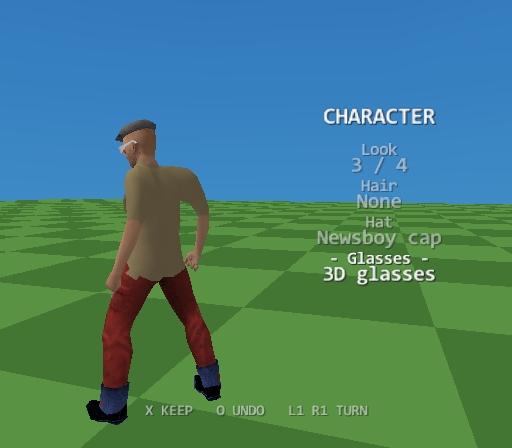
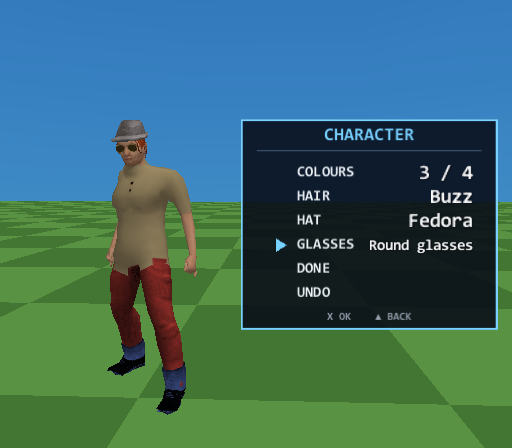
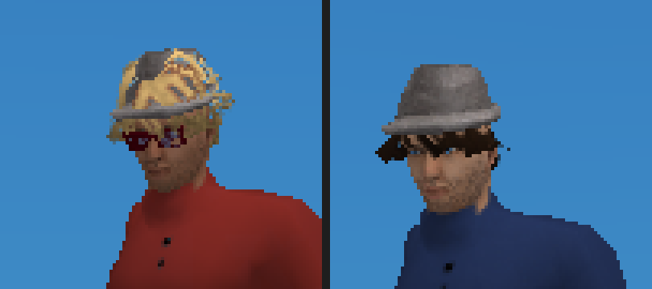

# Character generator

*Tools > Character Generator* builds a **rigged, skinned, dressed and animated
human** from sliders and drops it into the scene as an ordinary animated model.
It is built for the PS2 the way that console's best-looking games built their
people: one carefully laid-out texture per body with the face given the
texels, clothes that are part of the body instead of a second skin on top of it,
real eyes, and motion-captured movement.





| | |
|---|---|
| Body | two game topologies, a woman's and a man's (~3300 triangles with the eyeballs), quads with real edge loops round eyes and mouth |
| Rig | 35 Mixamo-named bones: spine, neck, head, arms, legs, two-bone thumb, index and fingers |
| Texture | one atlas, 128 / 256 / 512 square, 8-bit on the console; face ≈ 80 px wide at 256 |
| Shape | 96 macro targets (gender, age, muscle, weight, ancestry) + 76 detail sliders |
| Wardrobe | 82 items: 31 body-shell garments, 11 skirts and dresses, 12 shoes, 4 hats, 5 glasses, 19 hairstyles |
| Motion | 87 clips from Quaternius' Universal Animation Library, retargeted onto the rig |
| A dressed character | 4100-4500 triangles, **2 parts and 2 textures** (body + accessories), built in ~70 ms |

```
the character kit (resources/chargen-kit.bin, embedded in the editor)
   │  base mesh + ~500 targets as deltas on its own vertices
   ▼
blend targets → body + joints      outfit: shells push the body out,
   │                               meshes ride its surface
   ▼
compose one atlas: skin mix, AO, brows, lashes, eyes, makeup, stubble,
   │               every shell garment painted in, hair's scalp paint
   ▼
res/models/characters/<name>.glb  + <name>.chargen.json (the recipe)
   │  the existing animated-model chain: import, preview, Animation Editor,
   ▼  .tskl bake with LODs, player avatars, NPC AI, Live Link
```

Nothing downstream knows a character was generated. The generator's output is
a **plain glTF binary**, which is exactly where
[animated models](animated-models.md) already begin.

## Using it



The window has a parameter panel and a live, animated preview. Along the top,
**Preset** loads a tuned starting body, **Randomize** produces a plausible
stranger (body, face, colours, an outfit cut for that body, hair - click again
for another) and **Locks...** says what it must keep (body, face, outfit and
hair, colours); the arrows **undo and redo** - every settled change is a step,
a slider drag is one; **Open recipe...** loads a `.chargen.json`.

Clothes, hairstyles and the starting bodies are **cards with thumbnails**, not
lists of names. Each thumbnail is the item on a mannequin, framed where it is
worn (a hat at the head, shoes at the feet), built on a worker thread by the
generator itself and rendered by the preview's renderer
(`Viewport::renderCharacterIcon`) the first time the tab is open - so a card
is exactly what the item looks like, and a new kit item gets its card with no
art step. A garment's colour row is *As made*, the street-colour swatches and a
picker; patterns are one click each.

The preview turns with a left or right drag, zooms with the wheel and pans
with a middle drag; *Face close-up* looks at the face from the front with the
pivot between the eyes, *Reset view* puts it all back.

| Tab | What is in it |
|---|---|
| Body | the starting bodies as cards; gender, age, muscle, weight, height in metres, **dimorphism**; the ancestry mix; body and proportion sliders (belly, waist, hips, bust, shoulders, V-shape, arm/leg fat and muscle, leg/torso/arm/neck length, head/hand/foot size) |
| Face | head shape, forehead, brows, eyes (size, height, spacing, tilt, opening, epicanthic fold, bags), nose (11), mouth (9), jaw and cheeks (9), ears (4) - one folding section per feature. Right-click a slider to reset it |
| Skin | tone, warmth, weathering; eye colour; 12 eyebrow and 4 eyelash styles, brow density; stubble; lipstick, eye shadow, blush; the atlas size |
| Outfit | one card per item, per slot - full outfit, top, bottom, shoes, hat, glasses, gloves - each with its own colours and, for clothes, a pattern |
| Hair | 19 styles as cards and a colour; brows and stubble follow it |
| Animation | the standard locomotion set, or any of the 87 clips; key rate; or *Import clips...* from a Mixamo-named library or a phone take |

**Add to scene** writes `res/models/characters/<name>.glb` and drops in a
Model object (*Crowd...* drops in many, *Player creator...* makes it the
player with an [in-game creator](#in-game-character-creator)). It also writes **`<name>.chargen.json`** beside it - every
parameter the character came from. *Open recipe...* rebuilds that exact
character for editing; two recipes diff readably; and identical recipes always
produce byte-identical files.

Or ask the **AI Assistant** for one in plain words ("a tall woman in a green
dress with a braid", "five tourists") - it reads the kit's catalogue and writes
the recipe for you, a single character or a crowd ([ai-chat.md](ai-chat.md)).

From the command line (the same code path, no GUI):

```
tyrax-editor --chargen <recipe.json | - | preset:N | random:SEED> <out.glb> [--recipe-out <file>] [--variants N]
```

## The character kit

Everything the generator reads is ONE file, `resources/chargen-kit.bin`
(~17 MB, two bodies), linked into the editor by `src/chargen_kit.cpp` with the assembler's
`.incbin`. Nothing is downloaded and nothing is read from disk at runtime, so
the generator works the same on every machine and every platform the editor
builds on - the previous version fetched ~80 MB of MakeHuman files at setup,
half of which had moved off GitHub.

The kit is **built offline** by `tools/chargen-kit/` (Python + Blender, see its
README) from CC0 sources only:

| Source | Licence | What the kit takes from it |
|---|---|---|
| [MakeHuman](http://www.makehumancommunity.org/) data - `makehuman/data` and the *system assets* pack | CC0 1.0 | the `female1605` game topology, the reference mesh it rides, macro + detail targets, rig joints and weights, low-poly eyes, 12 eyebrows, 4 eyelashes, 18 skins, system clothes and hair |
| MakeHuman community asset packs (`*_cc0` builds only) | CC0 1.0 | shirts, pants, suits, dresses, skirts, shoes, hats, glasses, gloves, hair |
| [Quaternius - Universal Animation Library 1 + 2](https://quaternius.com/packs/universalanimationlibrary.html) | CC0 1.0 | 87 motion clips |

**MakeHuman's data is CC0 while the MakeHuman *program* is AGPL-3.0, and none
of the program is used** - not read, linked, copied or translated. MakeHuman
says outright that building your own character generator on the data is fine,
and that it claims nothing over a character made from it. Some community packs
are CC-BY (`hair02`, `shirts02`...); the kit uses none of them, and
`tools/chargen-kit/catalog.py` is the place to check before adding anything.

### Why the runtime never sees MakeHuman's files

A MakeHuman target is a sparse delta on the 19158-vertex reference mesh, and
the game body is a proxy that RIDES that mesh (three reference vertices and
barycentric weights per vertex, plus an offset scaled by three reference
distances). That fit is linear in the reference positions apart from those
three scale factors, so a target's effect on OUR vertices can be computed once,
offline, and stored as a delta - with its effect on every rig joint beside it.
The runtime blends ~200 small int16 arrays instead of carrying the reference
mesh and the fitting code. Measured: the kit's blend agrees with fitting the
proxy to the fully morphed reference to **2.6 µm**.

## The body

**Two topologies, MakeHuman's `female1605` and `male1591`** - 1584- and
1570-quad proxies authored for low-poly characters: edge loops round the eyes
and the mouth, a real nose and ears, separate fingers. Below the middle of the
gender slider the woman's mesh is used, above it the man's. Both are proxies of
the same reference, so every target moves both the same way and the SHAPE is
continuous across the switch; only the edge loops change. One topology for
everyone was tried first and measured wrong: on the female mesh even a naked
muscular man showed a bust, because its loops under the breasts draw a breast
crease across a male chest. Each body has its own atlas, skins, shells and
item bindings in the kit (prefix `m/` for the man); the clips, the rig, the
sliders and the items' meshes and textures are shared.

The previous generator used `proxy741` (730 quads, a face of a dozen polygons)
and decimated the garments; this one is four times the face for twice the
triangles.

**The eyes are geometry** - MakeHuman's 86-quad low-poly eyeballs - with the
iris painted into the atlas and recoloured by the *Eye colour* control. The old
body had holes where the eyes go, which is why its characters stared white.

**The atlas is re-packed for the PS2.** MakeHuman's UV layout is made for
2048-square photo skins and gives the face a fifth of the width - a 50-pixel
face at 256. `kit_body.py` keeps every island's SHAPE (so a MakeHuman skin
still maps onto it) but rescales them before packing - head ×1.55, arms ×1.25,
hands ×0.9, feet ×0.8, the mouth cavity ×0.3 - and cuts the torso/limbs island
into five pieces, because MakeHuman unwraps torso, arms and legs as one
starfish no packer fits tightly. Fill went from 65% to 77% of the square, and
the face is ~330 texels wide at the kit's 1024.

**Dimorphism.** MakeHuman's average man and woman are close in the face, and
a generated man read as soft. The *Dimorphism* slider (default 0.6) moves a
profile of detail sliders WITH gender - jaw, brow ridge, chin, neck, shoulders
up and lips, eye size, cheek volume down for a man, the reverse for a woman -
scaled down for children. It is a layer on top of the sliders, so the Face tab
still means what it says, and 0 gives MakeHuman's own bodies back.

**Breast size and firmness** are MakeHuman's own breast macro (cup size x
firmness, per age / muscle / weight corner, women only, 216 targets relative to
average cup and firmness - the base body), on the Body tab under Dimorphism.
They follow Gender: none at all on a man, whose chest is the *Bust* slider.

## The texture

The atlas is composed at 512 and box-filtered to the chosen size:

1. **Skin**: the 18 CC0 skins (young / middle-aged / old × three ancestries ×
   two genders), re-sampled into the atlas and mixed by the ancestry, gender
   and age sliders - so a 30% Asian, 70% European woman of 40 gets exactly that
   blend - then tone and warmth as multipliers, which keep the painted detail.
2. **Face paint**: lipstick, eye shadow, blush and stubble. Their regions come
   from MakeHuman's own detail targets - *lip volume* moves exactly the lips,
   *cheek volume* the cheeks - so each target's displacement, normalized, is a
   soft mask (`tools/chargen-kit/kit_body_masks.py`). Stubble is that region
   faded out under the chin (the jaw target also moves the neck, and a beard
   down to the collarbones reads as a rash), broken up by fixed noise so it
   reads as hair at 512 and as a shadow at 128, and painted strong and dark -
   a faint one is simply not there on the console.
3. **Brows and lashes**: MakeHuman's alpha-card meshes, baked onto the skin as
   masks and tinted by the hair colour.
4. **Ambient occlusion** from the 13k-quad reference body - nostrils, lips,
   ears and the gaps between fingers keep their shading though the low-poly
   mesh cannot.
5. **Eyes**: the eyeball layer, iris desaturated in the kit and tinted here.
6. **Clothes**: every shell garment painted in (next section), and a hairstyle's
   scalp paint, so the gaps between low-poly strands show hair, not skin.

"Add to scene" pins the model to **8-bit** (`Project::textureQuality`): skin is
one long gradient and bands into stripes in the project's default 16 colours.
A 256 atlas is 64 KB of GS VRAM at 8 bits; texbake claims a `.glb`'s extracted
images through an override on the model.

## The wardrobe

Every item is a CC0 garment converted offline into one of two shapes.

**Shells - the body IS the garment.** Shirts, sweaters, trousers, suits and
gloves are not kept as geometry. The body's own vertices under the garment are
pushed out along their normals onto its surface, and its texture is baked into
the body's atlas. A shell costs **no triangles at all**, cannot let skin poke
through (there is no skin under it - it is the skin, moved), fits every morph
and is skinned identically, because it is the body. This is how PS2 games
dressed people, and it is why a dressed character is not "body + suit".

Two measurements decide a shell, both against the garment fitted to the same
morph as the body:

- **Which body faces it covers**: the garment's own `delete_verts` declaration,
  plus every vertex whose outward ray meets the garment within 7 cm (a loose
  trouser leg stands 3-6 cm off the shin) or whose nearest garment point is
  within 2.5 cm - on the slope of the upper chest the normal tilts up and a ray
  along it leaves through the neck opening, which gave a crew-neck T-shirt a
  deep square neckline. Coverage is made symmetric (a vertex is covered if its
  mirror twin is), because ray-casting is not; then a closing pass takes in
  faces with some coverage and covered neighbours on at least half their sides,
  which is exactly a crotch or an armpit - their normals point at the other leg
  or the arm, and the rays miss.
- **How far out**: measured on the average **woman and man separately** and
  blended by gender at runtime. Measured once on an androgynous body, a T-shirt
  bridging under the breasts carried that gap onto a flat male chest as two
  bumps. The push is smoothed along the surface and is zero on the border, so a
  shell meets the skin it does not cover without a crack.

**Meshes - what leaves the body.** Skirts, dresses, shoes, hats, glasses and
hair are remeshed to a budget (hair 700, dress 560, skirt 360, shoes 320, hat
260, glasses 160 triangles), unwrapped, and their look baked into their own
256 texture. Each vertex is BOUND to the nearest point of the body surface -
triangle, barycentric weights, and an offset in that triangle's own frame
(along the interpolated normal, and for skirts and dresses two tangents too) - so it
follows morphs and is skinned like the body point it rides, with no cloth
solver. Shoes hide the feet they cover (196 triangles), so they cost ~120 net.
Skirts and dresses bind only to the body above the crotch: bound to the
nearest point, a hem 20 cm off the thigh rode the thigh's rotation like a
lever and spiked out in a stride. Bound to the pelvis the skirt moves rigidly
with the hips - the PS2-era choice: a leg passes through a long skirt, a skirt
never tears. That is also why the offset is a full vector: a long skirt's hem
hangs 60 cm below the hip triangle it rides, and an offset along the normal
alone folded it up into a mini skirt.

**Every worn mesh item shares ONE part and ONE texture.** At build time the
items' textures are packed into an accessory atlas the size of the body's, as
a grid of cells (half a texel of inset so filtering never reads a neighbour),
and their UVs are moved into their cells. A dressed character is two GS
allocations and two submits whatever it wears; the hair's cutout alpha rides
in the same texture, harmless to the opaque cells whose alpha is 255.

Getting a clean low-poly stand-in out of a CC0 garment took three rules, each
learned from a broken result (`kit_wear.py`):

- **Thicken first, by at least twice the voxel.** Cloth and hair cards have no
  thickness; a sheet thinner than a voxel voxelizes into hundreds of
  disconnected crumbs.
- **QuadriFlow, not a quadric collapse.** Collapsing a voxel mesh to 2% of its
  triangles does not simplify it, it crumples it into overlapping shards.
  QuadriFlow lays an even quad grid at the asked density.
- **Fill the bake's misses.** Texels the bake rays missed are black, and a
  recolour (below) turns black into streaks; the hit colours are grown into
  them first.

**Recolouring.** Every item can keep its own colours (*as made*) or take yours:
the texel's luminance against the garment's KEY colour becomes the shading, the
dye the hue, so folds and seams survive a recolour (hair flattens that
contrast first: its strands sit over near-black gaps, and at full contrast a
recoloured braid came out in tiger stripes). The key colour is the garment's
main fabric - the fullest bin of a chromaticity x luma histogram, worked out
when the kit is built - and only texels near it take the dye: the white shirt
and tie under a trouser suit, stitching and prints keep their own colours. A
plain uniform dye turned the clerk's blouse navy along with her suit. Hair
takes the colour whole. Clothes also take a
pattern (stripes, checks, plaid, diagonal) in two colours. Items cut for one
body carry a `sex` tag that *Randomize* respects; nothing stops you putting a
man in a dress.

### Clothes that move

A skirt or a dress is a mesh item riding the hips, and the legs under it move.
Two things keep them inside:

- **Legs under the cloth are not drawn.** The kit hides only the body
  triangles inside the garment's rest-pose stand-in, so a thigh that grazed
  the cloth came through it as soon as the leg moved - a "slit" in every skirt.
  The generator now also hides every pelvis/leg-skinned triangle that lies
  inside the cloth: per 5 cm band and 22.5-degree sector around the garment's
  axis it knows how far the cloth reaches, and a vertex 1 cm or more inside
  that is covered. A sector with no cloth (a real slit, a cut-out) keeps its
  leg. 130-290 triangles fewer per dressed character, too.
- **The panels swing with the thighs in every clip.** The front panel follows
  whichever thigh reaches furthest forward, the back one the furthest back,
  each side its own (0.85 / 0.7 of the swing) - the drive the game's
  `updateSprings` computes, baked into the clips as the four skirt bones'
  rotations. So the editor's preview, an exported `.glb` and a character
  beyond the game's 10 m spring range all show a skirt that rides up over the
  knee. Up close the game's spring replaces the panel's rotation with its own
  (`SkelInstance::setRotationOverride(..., replace = true)`) - the drive plus
  the lag and the bounce, no double swing. Only characters wearing something
  weighted to the panels get the channels: the EE pays per channel.

A backless dress (the halter and midi dresses) shows the back's skin by design.

### Hair over the scalp

Hair is a mesh item with gaps between its strands, and the scalp under it
showed through them - bald patches in a messy cut. The kit's scalp layer is
the hair baked onto the skin WITH its alpha, so every gap came through as a
gap. The generator closes it (`scalpCover`): everything that layer touches,
plus the skin the hair's vertices are actually bound to (not the face - a
fringe binds to the forehead, which stays skin), closed by 10 texels so gaps
up to 20 close without the outline growing, kept to the head's texels (the
body triangles skinned to the Head bone, rasterized in UV - it no longer
spills into the island next to the head in the atlas), softened. The gaps take
the hair's colour darkened like roots. An option hairstyle in the
[creator](#in-game-character-creator) cannot paint the skin (the player may
take it off), so it brings a **scalp cap**: the covered scalp triangles, 4 mm
out, on the darkest solid texel of its own texture, shown and hidden with it.

### Your own hair

*Hair > Your own hair* takes a hairstyle you modelled - a `.glb` or `.obj`,
with its texture or a separate one (alpha below 50% is cut out, like the kit's
hair cards) - and puts it on the character in place of the kit's:

1. *Export reference bodies...* writes `reference-female.glb` and
   `reference-male.glb` (the average woman and man at 1.75 m) into
   `res/models/characters/custom`; from the command line,
   `tyrax-editor --chargen-reference <dir>`.
2. Model the hair on the one whose body you will use (Gender below 0.5 / from
   0.5) and export it as a static `.glb` or `.obj`.
3. *Model...* (and optionally *Texture...*) picks it. A file outside the
   project is copied into `res/models/characters/custom` and the recipe keeps
   the project-relative path (`"customHair"`, `"customHairTexture"`).

It is bound like the kit's own items: every vertex to the nearest triangle of
the reference body (point, barycentrics, an offset in that triangle's
normal/tangent frame, in metres) and skinned like the skin there - so it rides
every body slider, takes hat hair under a hat, and costs what its triangles
cost. Built once per file version and topology. Its own colours are kept (the
hair colour does not dye it). Keep it light: the kit's hairstyles are 700
triangles.

## The rig

50 bones: 35 with Mixamo names (`mixamorig:Hips`...), because that is what
free animation libraries and retarget tools match on, nine for the face and
six spring bones:

```
Hips ─ Spine ─ Spine1 ─ Spine2 ─┬─ Neck ─ Head ─ HeadTop_End
  │                             ├─ LeftShoulder ─ LeftArm ─ LeftForeArm ─ LeftHand ─┬─ Thumb1 ─ Thumb2
  │                             │                                                   ├─ Index1 ─ Index2
  │                             │                                                   └─ Middle1 ─ Middle2
  │                             └─ (the same on the right)
  ├─ LeftUpLeg ─ LeftLeg ─ LeftFoot ─ LeftToeBase
  └─ RightUpLeg ─ RightLeg ─ RightFoot ─ RightToeBase

Head ─┬─ Jaw                       (the lower lip and the tongue hang below it)
      ├─ LeftEye,     RightEye     (the eyeballs)
      ├─ LeftEyelid,  RightEyelid  (the upper lids, pivoting on the eye's centre)
      ├─ LeftBrow,    RightBrow    (pivoting on the skull base - a raise is a slide)
      ├─ LeftMouthCorner, RightMouthCorner   (pivoting behind the mouth)
      └─ HairTail1 ─ HairTail2     (a ponytail / braid / long hair, down the back)
Hips ── SkirtFront, SkirtBack, SkirtLeft, SkirtRight   (a skirt's four panels)
```

The face bones are APPENDED after the 35 so no older bone changes index
(`anims.json` and every clip are indexed by bone; `build_kit.py` pads a clip
made before them with the bind pose). No clip animates them - the game does,
see [A living face](#a-living-face). A mesh item never takes their weights:
glasses resting by the eyes blinked with the lids until `build_kit.py` folded
the face bones' share into the head for everything that is not the body.

MakeHuman's reference rig has 163 bones; each one's weights fold into the
bone that stands for it, or its nearest kept ancestor (`tools/chargen-kit/rig.py`).
The fingers are cut down to what an animation can show at this budget: the
thumb and the index finger get two bones each and the other three fingers
SHARE two - enough for a fist, a pistol grip, a pointing hand and a relaxed one.

Each bone's head comes from a MakeHuman joint, a cube of reference vertices, so
the skeleton follows every morph - a child and a heavy-set adult get correctly
placed hips with nothing resembling a fitting step. Every bone binds with
**identity rotation**, so a bone's local space is world space and the inverse
bind is a translation; that is what lets one set of clips drive every body.

## Animation

Every character ships with **motion-captured clips**: Quaternius' Universal
Animation Library 1 and 2 (CC0), 87 clips - locomotion, jumps, crouches,
idles with character (talking, folded arms, on the phone), punches, sword
combos, pistol, sitting, swimming, farming, zombie walks, deaths.

They are retargeted **offline** onto the rig (`tools/chargen-kit/anim_retarget.py`)
and stored in the kit as local rotations plus a hips track. Because every bind
rotation is identity, a local rotation means the same thing on every body, so
the clips are proportion-independent; the hips track is scaled by the
character's hip height. The retarget aligns each bone's rest DIRECTION (the
library rests in a T-pose, the rig in an A-pose) and keeps the source's twist;
hands and fingers also align the knuckle line, or a fist closes only halfway.
Measured: every bone points where its source bone points to within 0.05°, and
the soles stay on the floor within 0.3 mm.

The **standard set** is written under the names the generated game's
third-person player looks for: `idle`, `walk`, `run`, `sprint`, `jump`
(+ `jump_start`, `jump_land`), `crouch`, `crouch_walk`, `interact`. `idle` comes
first, so a plain Model object (which autoplays its first clip) idles. Untick
*Standard set* to pick any clips; a clip outside the set keeps its library name
(`Idle_FoldArms_Loop`). Keys are resampled to the *Key rate* (default 15/s) -
the EE evaluates them, and all-identity channels are dropped.

The old analytic idle/walk/run/jump generator is gone; a motion library made by
an animator beats any sine wave.

Three things the generator changes on the way out of the kit, each from a
rendered failure:

- **Fingers.** The rig curls the index finger on its own chain and the other
  three on one (`Middle`); curled differently, the skin where the two chains'
  weights meet sheared into ragged, clawed fingers. Both chains take the
  average of the two rotations, and every finger - thumb too - curls 60% less:
  a relaxed, half-open hand, which is what a 1600-vertex hand can show.
- **Running shoulders.** Quaternius' jog and sprint hold the elbows 42 degrees
  out from the body (19 in the idle) and the clavicles shrugged up. In clips
  named Jog/Sprint/Run the clavicles take the idle's rotation and the upper
  arms come in by 18 degrees about the forward axis: measured 25 degrees out.
- **Skirt panels follow the legs** - see [Clothes that move](#clothes-that-move).

## A living face

A generated character in the game **blinks, looks at you and talks**. None of
it is a clip: the game turns five bones on top of whatever clip plays
(`TerrainGame::updateFace`, on `SkelInstance::setRotationOverride`), so it
works over an idle, a walk or a dance alike.

- **Blinks** every 2-6 s, one in six a double; 60 ms closing, 30 ms shut, 80 ms
  opening. Each object has its own random clock - a crowd never blinks in
  unison. The lids also ride the eyes up and down a little.
- **Looks at the player** (the camera: in third person the character meets
  your eye, which is the point) within 4.5 m, when you are in front of it. The
  head takes 65% of the turn, clamped to 46 degrees; the eyes take the rest,
  clamped to 23. It eases in and out - nobody snaps their head round. The
  player's own avatar is left alone.
- **Talks**: the jaw opens up to 12 degrees in syllables (about four a second,
  uneven, with breaths between phrases) while a clip whose name contains
  `Talk` plays (`Idle_Talking_Loop`), or for as long as a script asks:

  ```cpp
  talk(ctx, objectIndex, 3.0F);  // 3 seconds; 0 stops
  ```

- **Lip-syncs a sound**: set a Sound emitter's **Speaker** (Properties) to the
  character, and its jaw follows that sound's loudness while it plays. The
  editor decodes the WAV when the game is built and stores its loudness 30
  times a second (`LIP_SYNCS` / `LIP_ENVELOPES` in `scene_data.hpp`): RMS per
  window, normalised to the clip's loud end, gated under the room tone so a
  pause shuts the mouth. The game starts reading it the frame the sample
  REALLY starts (`tryPlay` returned OK), so a retrigger restarts the mouth with
  the voice. A real voice wins over the syllable machine.

The game finds the bones **by name** (`mixamorig:Jaw`, `mixamorig:LeftEye`...;
`.tskl` v3 carries node names, `SkelModel::findNode`), so any `.glb` with those
bones gets the same face, and a rig without them simply keeps a still one.

**Expressions.** The **Emote** node (Animation category; or
`emote(ctx, objectIndex, expression, seconds)` from a script) puts a face on
top of everything above: *Smile*, *Angry*, *Surprised*, *Sad* or back to
*Neutral*, held for some seconds or until the next one, easing in and out. It
moves four more bones - the brows and the corners of the mouth, both pivoting
deep in the head so a few degrees of turn reads as a slide - plus the lids
and the jaw. The values were tuned in Blender and then made about 30% bolder,
because at 512x448 on PCSX2 the Blender ones read as a twitch. The **Talk**
node starts and stops the syllable jaw (the `talk()` helper).

**What it costs.** A face is a pose of its own: an instance with overrides
never shares its skinned mesh with another in the same clip (the crowd trick
in [animated-models.md](animated-models.md)). Beyond 10 m a face is a few
pixels at PS2 resolution, so it is dropped there and the instance shares
again. The EE work itself is a few `sinf`s and five quaternions per character.

**The mouth.** The proxy's mouth is a 7.5 cm tube from the lips into the head,
and its inner end was open: with the jaw down you looked straight through the
head. `build_kit.py` caps it (`cap_mouth`, a fan over the end loop, no new
vertices - targets and weights are per vertex), wound to face the lips. Tyra
draws no back-face culling, so what the corners of an open mouth show is the
inside of the cheek, never the sky.

## Spring bones

Long hair and skirts move. A ponytail swings when its owner turns, a braid
bounces in a run, and a skirt or a dress parts around the stepping leg instead
of the leg going through it. Secondary motion, the 2004 trick - no cloth
solver.

- **The rig** carries a hair chain (`HairTail1` at the back of the skull,
  `HairTail2` at the top of the back - affine mixes of MakeHuman joints, so
  they follow every morph) and four skirt bones pivoting in the pelvis.
- **The weights** go to them only for items that hang (`catalog.py`'s
  `'spring': 'hair'` on long hair, ponytails and braids; every skirt and
  dress): hair behind the skull base, along the chain - a fringe stays on the
  face - and cloth a hand's breadth below the pelvis, by depth, split between
  the four panels by which way it faces (`build_kit.spring_weights`). A
  skirt keeps 35% of its own skin (legs included): wherever the springs are
  at rest - the editor's preview, any glTF viewer - a skirt that was all
  pelvis let a forward knee through its front.
- **The game** (`updateSprings`) simulates each bone's TIP in world space: a
  spring to where the bone's rest would put it, damping, a little gravity,
  held at the bone's length - so walking, turning and the clip's own sway all
  set it going. A skirt panel's target is DRIVEN by the legs: the front panel
  follows whichever thigh is furthest forward, the back one the furthest back,
  each side its own thigh, and the spring adds the lag and the bounce; the
  tips are also pushed out of the thighs. A collision alone came too late -
  the knee was gone before the hem reached it. The bone is then turned to
  point at its tip (a rotation override, like the face).

Same 10 m cut-off as the face, same cost model: a character with live springs
is a pose of its own. Verified in PCSX2 on a runner in a midi dress with a
ponytail: the dress flares with the legs through the run cycle, the legs stay
mostly covered, the ponytail swings.

## Crowds

*Crowd...* (next to *Add to scene*) puts the current character into the scene
many times over - in other colours, for almost nothing:

- The character is written once, like *Add to scene*. Beside it go N **colour
  variants**: the same person with a different skin tone and warmth, hair and
  eye colour and every worn item re-dyed (`chargen::paletteVariant` - only
  what lives in the textures, never a shape, an item or a clip), as
  `<name>_<image>.v<k>.png`.
- At build time texbake quantizes the base atlas as usual and then FITS each
  variant to it: for every palette index, the variant image's average colour
  over the texels that carry that index. The game gets
  `<texture>.v<k>.pal` - 256 colours, 1 KB.
- In the game a variant is a `Texture` that borrows the base's texels and
  brings only its CLUT (`Texture(base, rgba, entries)`); the VRAM manager keeps
  one copy of the texels for the base and every variant and uploads 1 KB per
  extra person (`RendererCoreTexture::useVariant`).
- Every person is an ordinary Model object naming its *Palette variant*.
  They idle in at most three clip groups, so each group is skinned ONCE and
  drawn for all of its members (pose sharing), and they get a mesh-LOD
  override of 8 m: half the mesh beyond it, a quarter beyond 16 m.

*Walk around* (on by default) makes them **pedestrians**: each wanders the
nav grid within the crowd's spread, walking and stopping, passing others on
the right ([navigation-ai.md](navigation-ai.md#wandering-pedestrians)). Off,
they stand and idle in their groups.

So a crowd of twelve is one mesh, one atlas, a few skins a frame and 12 KB of
palettes. What it is not: twelve different BODIES - variants share the
base's shape. Add a few crowds made from different characters for that.

The palette fit is exact where the base's quantizer kept skin, cloth and hair
in different palette entries, which a character atlas mostly does; where it
merged two of them (a beige garment the colour of skin), the variant blends
the two. Faces still work in a crowd: a person within 10 m gets its own pose
for its blinks and its glance, and goes back to the group's beyond it.

Verified in PCSX2: twelve palette variants of one character next to the
example's cast. It is also what forced the shared bind data
([animated-models.md](animated-models.md#performance-and-memory)) - the
same scene ran the EE out of memory before it.

## In-game character creator

The player can dress their own character in the game, create-a-skater style:
colours, hair, a hat and glasses, picked on a screen that shows them turning
in front of the camera.



**Making one.** *Player creator...* (next to *Crowd...*) lists every
hairstyle, hat and glasses in the kit; tick what the player may choose from
and set *Colour looks*. *Make it the player* writes the character and makes it
the active scene's Player model (third person), adding a Player when the scene
has none. What the character wears in the generator is where the player
starts. The preview shows only that start: every option at once would be a hat
on a hat.

In the recipe this is one field, `"options": ["afro", "fedora", ...]` - kit
ids of hair, `head` and `face` items, the same list the AI Assistant's
`create_character` takes.

**How it is built.** An ordinary character puts every mesh item into one
accessory atlas. Creator options cannot share it: the game must hide them one
by one. So each option is its OWN part with its own texture, at half the atlas
size: the part (material) is named `<kind>:opt-<slot>-<id>` and its texture
`<stem>_opt-<slot>-<id>.png` (`optd-` for the item worn at the start - a worn
item in a slot that has options becomes one too, and hat options make the
worn hairstyle one). The part name is the whole contract: `loadAnimModelAsset`
reads slot and id back out of it, so nothing new is stored in the `.tskl`, and
the `.tskl` loader never merges a part with `:opt` in its name into another
(it merges parts that share a texture, and a hairstyle and its hat twin do).
An option hides
no body triangles, pushes no shell and paints no scalp under itself - the
player may take it off. Colour looks are the crowd's palette variants
([Crowds](#crowds)): `<texture>.v<k>.pal`, options included.

**In the game.** The **Character Creator** flow node (Animation) opens it on
its target - or on the player, when the target is not a character with options
or colour looks, so a node on a trigger needs no link. Scripts call
`openCharacterCreator(ctx, object)` and read `ctx.creatorOpen`. Up/Down picks a
row (Look, Hair, Hat, Glasses - only the ones the model has), Left/Right the
choice ("None" included), L1/R1 or the right stick turn the camera, Cross keeps
it, Circle puts back what they wore when it opened. The screen owns the pad
but not the clock: the character idles, blinks and looks at the camera while
being dressed, and the world goes on behind it. Text uses the project's first
font, or the built-in HUD glyphs when it has none.

The choice is `RuntimeObject::look[4]` - palette variant, then the hair, hat
and glasses option (-2 as built, -1 none) - and `setLook()` sets it from a
script. `applyLook` turns it into hidden parts and re-pointed texture bags, and
costs four compares on a frame where nothing changed. The player's look is
kept in `TerrainGame::playerLook`, so it survives scene changes (it applies
whenever the Player wears the same model), and is saved with the game
(`SaveGameData::playerLook`, save format 5).

**Cost.** Every option hairstyle and its hat twin also carry a ~400-triangle
scalp cap (only the one shown is drawn). Eight options took the example hero from 4245 to 7341 triangles in
the file - but a hidden part is neither drawn nor skinned
(`SkelInstance::setPartSkipped`), so what the console pays per frame is the
character as worn. VRAM pays for every option's texture (a 128x128 palette
image each at a 256 atlas) and 1 KB per colour look per texture.

Verified in PCSX2: the screen opened from a script, D-pad changes of every row
(colours, hair, hat, glasses, None), the R1 turn, Cross keeping the look in
gameplay, a hidden-then-shown hairstyle re-skinned in the current pose, and a
fedora switching the messy cut to its pressed twin and back.
Not verified: a save/load round trip and a scene change carrying the look; the
real console.

### The creator as a menu

The built-in screen is fixed. To restyle it, make the creator a **menu**:
*Tools > Menu Editor > **+ Character creator menu*** scaffolds one -
COLOURS / HAIR / HAT / GLASSES rows, DONE and UNDO, not pausing, panel on the
right - and the **Character Creator** node's *Menu* picks it. From then on it
is an ordinary menu: stylesheet, font, title, row labels and order, icons,
descriptions, images, position, open and close motion
([menu-styles.md](menu-styles.md)).

- A **Character creator option** row (`"action": "creator"`, param `look`,
  `hair`, `hat` or `glasses`) changes that part of the look with Left/Right
  (Cross steps forward) and draws the current choice right-aligned in the
  menu's font as runtime text - the path a *Rebind key* row uses, so the
  menu's font gets an atlas for it. A row the model has nothing for shows
  `-`.
- **Character creator undo** puts back the look the creator opened with and
  closes the menu. Any other way out - a Close row, Back - keeps the new look.
- The creator ends when its menu goes away; the camera still frames the
  character and L1/R1 still turn it. Leave *Pause* off, or the character
  freezes while being dressed.
- Rows work in any menu: opened some other way (an Open Menu node, a pause
  menu) they dress the player.



## Hat hair

A hat is a mesh item riding the skull on its own, and big hair used to poke
straight through it - the crown of a messy cut sticking out of a fedora. The
generator now presses hair under hats, the way a real hat does:



- `hatCap` measures, for every body vertex a hat rides (bary >= 0.15), how far
  above the skin the hat's LOWEST surface sits there - the inside of the
  crown. Body vertices no hat covers have no limit.
- Hair keeps its binding (a body triangle, barycentrics, an offset along the
  normal); only that offset changes. A hair vertex over covered skin is
  pressed to 70% of the hat's limit there, and over the hat's edge the press
  fades out with how much of its triangle the hat covers. What hangs below
  the hat - a fringe, a ponytail, long hair - keeps its shape.
- A **worn** hat fits the hair outright, in any character. With hat
  **options** every hairstyle gets a second part, `hair:opth-hair-<id>`,
  pressed under all of the optional hats at once and sharing the plain part's
  texture; the game shows it instead of the plain one whenever a hat is on,
  and `chargen::partsShownAsBuilt` makes the editor's viewport do the same.

The press is under the union of the optional hats, so under a small cap the
hair is flat where only a taller hat would reach - read as hat hair, it looks
right. The cost is one more hidden part per hairstyle: file size, not frame
time.

## Cost on the console

**Turn the mesh LOD on.** Measured on the example in PCSX2 (frame counter,
vsync off), looking at the cast and the eight-commuter crowd: 42.9 ms a frame
with *Mesh LOD* and *Animation LOD* off, 25.8 ms with mesh LOD at 6 m and
animation LOD at 10 m - every character beyond 6 m drawn and skinned at half
its triangles, beyond 12 m at a quarter, and far poses refreshed every other
frame. Fourteen characters at full resolution are ~60 000 skinned triangles a
frame, and the EE pays per triangle. The hero alone renders at 8.6 ms.

**A walking crowd** costs in skinning what a standing one does not: standing
people of one model idle in one shared pose (one skin, drawn for all of them),
walking ones each had their own. Measured on the example's crowd scene in
PCSX2, 30 pedestrians: 24.3 ms standing, 49.9-66.8 ms walking. Four things
bring a walking crowd back:

- **Phase lock.** A wanderer's clip time is set every frame from one shared
  animation clock (`RuntimeObject::animSync`, `SkelInstance::setTime`), so
  every walker of a model walks - and idles - in step and shares one skin per
  clip and mesh-LOD tier. Phase groups were tried first: three of them split
  30 people into so many (model x clip x phase x tier) groups that almost
  nobody shared - 66.8 ms; one phase, 50.9 ms. Random pauses and headings keep
  it from reading as a march.
- **A live face for the nearest five.** Blinks, the glance and the springs
  make a pose of its own; only the five nearest characters get them (kept
  until seven are nearer, so the one at the edge does not flicker), however
  many stand within 10 m.
- **Mesh LOD per crowd member** - 4 m in the crowd scene.
- **Memory.** A character that skinned itself once - a crossfade, up close -
  kept its output buffers (~0.4 MB at full detail) for good, and 30 of them
  ran the EE out of memory ("# Restart" in PCSX2's emulog, nothing in the
  game's log). After a second of drawing someone else's shared pose an
  instance gives them back (`SkelInstance::trimOutputs`), and hidden creator
  parts never allocate any.

24 walking pedestrians plus the player: 32.7 ms. Hundreds would need a
lighter body - MakeHuman's 741-vertex proxy as a crowd topology - which the
kit does not carry yet.

A dressed character is 4100-4500 triangles in 2 parts (body, accessories)
and 46 bones - a hero budget. Crowds should use the `.tskl` distance
LODs (*Mesh LOD* in Project Preferences) and a 128 atlas: four bystanders and a
hero at 256 fit the example scene's VRAM with room to spare. Texture cost is
the one to watch: GS VRAM is ~1.33 MB with no eviction
([gs-vram.md](gs-vram.md)).

## Importing animation (Mixamo and friends)

*Import clips...* (Animation tab) retargets an existing `.glb`/`.fbx` animation
library onto the generated rig, instead of the kit's clips. Any rig that names its bones
the Mixamo way works - which is the whole reason the generated rig carries
those names.

The conversion is one line of intent: **apply the source bone's rotation
relative to its own bind pose**.

```
target_world(bone) = source_animated_global(bone) * inverse(source_bind_global(bone))
target_local(bone) = inverse(target_world(parent)) * target_world(bone)
```

That works because the generated rig binds with identity rotations, so the
delta IS the target's world orientation - the payoff for that decision. It also
means a constant transform on the source (the -90° X flip an FBX conversion
leaves behind, a 0.01 unit scale) cancels out of the delta for free, and a rig
with different proportions simply drives the joints it matches.

Two things happen on the way in, and both are the point of doing this at all:

- **Only the bones this rig has are sampled.** A Mixamo clip carries ~65 bones
  including every finger; a 156-channel source clip lands as a 23-channel one.
- **The keys are resampled** (default 15/s, adjustable). Mixamo exports a key
  per frame per bone at 24-30 fps, and the EE evaluates those at runtime.

The hips translation is scaled by the height ratio and rebased onto the
generated bind pose, so a 1.95 m source does not lift a 1.60 m character off
the floor. *In place* strips the horizontal component - the game moves the
character, the clip animates it.

Clip names come from the source, so a merged Mixamo download arrives as
`mixamo.com_1`, `mixamo.com_2`... Rename them in *Tools > Animation Editor*,
which is non-destructive and retargets every reference for you.

## Motion capture from a phone

The same *Import clips...* also takes a **`.tmocap`** - an ARKit body-tracking
recording made by the companion app,
[tyrax-mocap](https://github.com/doctorspider42/tyrax-mocap) (iOS, sideloaded,
its own repo - the sibling of `tyrax-cam`). Point an iPhone at somebody,
record, AirDrop the take, import it. No suit, no markers, no cloud service.

It is the same retarget path a Mixamo download takes, and that is the whole
design: `src/mocap.cpp` decodes the file, renames ARKit's joints
(`left_forearm_joint`) to the Mixamo names the rig uses, and hands over an
ordinary source `Skel`. Nothing after that knows the motion came from a phone.
The 40-odd joints the rig has no bone for - fingers, toes past the ball, face -
are loaded, parent their children correctly, and simply never match, which is
how a 91-joint take lands as a ~23-channel clip.

Two things the file carries that a stream of poses would not:

- **The skeleton's rest pose.** Retargeting is a delta against the source's own
  bind, so without it there is nothing to take the delta against. ARKit
  provides it as `neutralBodySkeleton3D`, and it is written into every take
  rather than assumed.
- **The performer's height**, implied by that rest pose. The hips translation is
  scaled by it, so a 1.9 m performer does not lift a 1.55 m character off the
  floor.

Scale is *dropped* when the matrices are decomposed. ARKit's skeleton-scale
estimation puts the performer's real limb lengths in the local transforms, and
a retarget applies rotations to a body that has its own proportions - carrying
the scale across would stretch the character to match whoever stood in front of
the camera.

What it is honestly good for: this is monocular pose estimation from one
camera. Gross body motion reads well; feet slide, depth wobbles, and
self-occlusion breaks the solve. At 1500 triangles seen from five metres that
is the right fidelity tier. For a close-up cutscene it is not.

## Tools > Mocap: a performer drives a character

There is a **Mocap layout** (the *Layout* menu) that opens exactly what a
capture session needs. This window carries its own 3D preview of the character
being driven, so it takes the middle - tabbed with the Viewport and focused -
rather than a side column, which was the first attempt and squeezed the one
thing you actually watch. *Phone Link* is the opposite shape, all controls and
no picture, so it gets a narrow full-height column on the right where the
address and pairing code stay visible instead of hiding behind a tab. Output
runs along the bottom, because during a session the useful diagnostics are
printed rather than drawn.

The Director layout carries *Phone Link* too, since recording a camera move is
the other thing a paired phone does.

A layout remembers its arrangement once shown, so changing the built-in recipe
does not move a layout you have already opened - *Layout > Reset to built-in
arrangement* is what re-applies it.


Record, AirDrop, import, discover it was wrong, repeat is a bad loop. *Tools >
Mocap* closes it: pick an animated model, pick a source, and the character is
posed **as frames arrive**, in the window's own preview - the Character
Generator's multi-part path, so clothes and hair come along.

Two sources, and the distinction matters less than it looks:

- **A `.tmocap` file**, played back. Scrub it, loop it, watch the retarget.
- **The live phone link.** Start the link in *Tools > Phone Link*, type its address
  and six-digit code into the app's LIVE LINK row, and the performer moves the
  character in the editor with about a frame of lag. The window binds to the
  phone's skeleton **the moment it arrives** - a phone connects, reconnects or is
  swapped for another one at times nothing announces, so *Rebind* is there for
  when you change the character, not for getting started.

The file source is not a mock of the live one - it *is* the live one with a
different feed. Both end in the same `mocapApplyFrame` → `charanim::applyLive`,
and a streaming feature that only runs when a phone is in the room is a feature
nobody can debug. (The equivalence is measured, not asserted: posing through
`applyLive` frame by frame and posing through the clip path agree to 0.48 µm.)

**Calibrate (T-pose)** comes first and decides whether any of the rest is
usable. Every frame is a delta from a *rest pose*; without calibrating, that
pose is ARKit's `neutralBodySkeleton3D` - a nominal figure out of a catalogue -
so everything a real performer differs from it by, in proportions and in stance,
is a **constant error in every single frame**. Have them stand in a T-pose
facing the camera and press it: that frame becomes the rest pose, `restFix` is
computed against *their* T-pose, and the height comes off their actual stance.
Bone lengths are kept from the catalogue, because those do not change between it
and the room - only the resting angles do. It sets the heading zero too, since
at that instant they are facing the camera by construction.

A **delay** sits beside it (none / 3 / 5 / 10 seconds), because nobody can press
a button and be in a T-pose at the same instant - with the phone on a tripod
this is the only way to do it alone. Pressing again during the countdown cancels
it. The same button is **on the phone**, and it arms the same countdown.

A **recorded take** calibrates too, on the frame under the playhead - which is
what recording somebody standing in a T-pose is for. Same rule either way: the
rest ROTATIONS are replaced, the bone offsets are kept.

**Zero here** is the smaller one. It says *"the performer is facing me,
right now"*: everything after is measured from that instant, so they turn and
the character turns, they walk across the room and it walks across the room.
Without it the link takes its zero from the **first frame it sees** - whatever
they happened to be doing when tracking caught them, which is rarely the moment
you meant. It is also what to press whenever the stream *jumps* rather than
moves: tracking lost and regained, or somebody else stepping in.

**Rebind** is a different thing that used to sit next to it looking like a pair.
It rebuilds *which bone drives which* - joint matching, rest poses, the height
ratio - and is what you need after changing the character, not after changing
where the performer is standing.

**Add as a clip** is the step that turns a recording into an animation. It
retargets the open take onto the chosen model and writes it back into that
model's own `.glb`, beside whatever clips it already had; rename it afterwards
in *Tools > Animation Editor*, which retargets every reference for you. Without
it the feature stopped one short of useful - recording produced a file, and the
only route onto a character was the Character Generator's *Import clips...*,
which rebuilds a **generated** character from its sliders. A model already in
the scene, the very one being posed in this window, had no route at all.

The model is re-read from disk for the bake rather than reusing the posed copy
on screen: that copy has live rotations written into its nodes, and baking it
would fold the current frame into the rest pose.

A take **carries the rest pose it was captured against**, so a recording made
during a calibrated session decodes to exactly what was on screen while it was
made. That slot has always been in the format; it was being handed ARKit's
neutral figure regardless, which is why a take recorded from a properly
calibrated session came back leaning the moment it was re-opened - the
calibration lived in the session and died with it.

**Record** writes a `.tmocap`, and only from the live source - a file is already
a take. It buffers the **source** frames rather than the retargeted pose,
because a take is reusable on any character and a baked pose is not; the result
imports through *Import clips...* like anything else. 

### What the wire carries

Only rotations, at 30 Hz - about 1.5 KB a frame for 91 joints, a quarter of what
the file format costs, because bone lengths do not change during a take. The
skeleton and its rest pose are sent **once** at connect (`bodyrest`), and a
`body` frame arriving before it is dropped: there is nothing to say which
rotation belongs to which joint, and nothing to take the retarget's delta
against. The phone joins the same server, port and handshake `tyrax-cam` uses;
`body: true` at hello is how `src/phonecam.cpp` tells the two apps apart. The
layout is written down in the phone repo's `PROTOCOL.md`.

### What ARKit does not solve, and how you find out

Point a phone at somebody and four things go wrong at once. Three of them are
one bug and one is not a bug at all, and telling them apart took measuring the
recording rather than staring at the character.

**The body would not turn round.** ARKit keeps the body's heading on the
*anchor*, not on the hips joint: across a nine-second take in which the
performer walked a full circle, `hips_joint`'s own rotation was constant **to
the bit**, while the anchor swung 177 degrees. Both paths threw that rotation
away and kept only the anchor's position, so a performer walking a circle
retargeted as one marching on the spot. The heading is now composed onto the
hips - on decode for a file, in the window for a live frame - and everything
below the hips inherits it for free. The phone sends it as four floats beside
the hips position; `writeTake` stores it, or a recorded live take would lose the
turn all over again.

**The heading has to be RELATIVE.** Composing the anchor onto the hips makes the
character turn, but composing it *absolutely* faces the character in an
arbitrary direction: ARKit's world zero is wherever the phone happened to point
when the session started, so the character came out turned some random angle
away from the camera. It is measured against the first frame seen - exactly as
the hips translation already was - and *Recentre* forgets it along with
everything else. The two halves of the same anchor have to be rebased the same
way, and for a while only one of them was.

**The hands, the head and the feet do not move** - and there is nothing to fix.
Over 277 frames, these joints' local rotations never changed by so much as a
float bit: both wrists, both ankles, both toe joints, and the head relative to
the neck. ARKit reports them, it does not *solve* them. The head still turns,
because it inherits the neck chain (which moves about 10 degrees in that take);
the wrists and ankles follow their parent bone rigidly, which is why a lifted
knee comes with a pointed foot. `mocap::load` measures this per take and says
so, because "the source has no wrist data" and "the retarget is broken" look
identical on screen and are not the same problem.

**The limbs themselves are exact.** Measured, not assumed: the angle between
each of the performer's bones and the character's, after retargeting, is
**0.0 degrees** for every limb across every frame sampled. When a pose looks
wrong, that number is where to start - if it is zero, the character is doing
precisely what the source said, and the source is what to argue with.

### Feet on the floor

Rotations do not know where the ground is. A retarget applies the performer's
joint angles to a body with its own proportions, so the ankle lands wherever
that chain of angles happens to put it - which on a real take meant **147 mm
below the floor**. Add a source that never solves the ankle, and the foot
follows the shin rigidly: a lifted knee comes with a pointed toe, like a dancer.

*Feet on the floor* (on by default, in both the Character Generator's retarget
options and the Mocap window) decides per frame whether each foot is **standing**
- low enough and slow enough - and if it is, puts the ankle back where it was set
down, levels the sole, and bends the leg with a two-bone solve to reach. Leaving
a plant needs a clearly higher foot than entering one; without that hysteresis a
foot hovering at the threshold flickers every other frame. The knee keeps
pointing where the pose already had it pointing, which is what stops the solve
inventing a direction and flipping the joint, and the leg is never allowed to
straighten completely, because at full extension there is no knee direction left.

Measured on a real 9.5-second take, for the foot that was actually on the ground:

| | off | on |
|---|---|---|
| slide while planted (mean) | 36.4 mm | **0.9 mm** |
| deepest through the floor | 146.8 mm | 4.0 mm |
| sole off level while down (mean) | 37.3° | **1.0°** |

The peak sole angle stays at 61° because that is the single frame of first
contact, before the ease-in has run - which is the intent, not a shortfall.

Two boundaries worth stating. The solve runs on the **retarget** path, so it
covers Mixamo imports, `.tmocap` files and the live link, but **not the kit's
own clips**, which are retargeted offline with their own floor correction
(the hips are moved per frame so the lowest sole matches the source's, within
0.3 mm) - running a stateful plant over a clip that has to loop seamlessly is
a way to break a working feature for a gain nobody can see at PS2 range. And a foot the
performer never puts down never plants - correctly. In the take above the left
foot stayed bent the whole time and the character's left foot never came within
94 mm of the floor; the hips bob 177 mm in that recording, which is enough for a
23 mm difference in leg extension between the two sides to become a 240 mm
difference in how low each ankle ever gets.

### Taking the shake out

Monocular tracking re-estimates every joint from scratch each frame, so a
performer standing perfectly still arrives **shimmering** - and a retarget
faithfully passes that on to the character. Averaging fixes it and ruins
everything else: smoothing strong enough to settle a still hand puts visible lag
on a punch.

*Smooth the shake* uses a one-euro filter, whose whole idea is that **the cutoff
rises with speed**. Slow movement is mostly noise, so it filters hard; fast
movement is mostly signal, so it gets out of the way. One knob set, no mode
switch, and the two failure modes trade against each other instead of fighting.

Measured against a known signal with 2.5° of joint noise:

| | jitter | error | lag |
|---|---|---|---|
| standing still, off | 1.85° | 1.22° | |
| standing still, **on** | **0.48°** | **0.58°** | |
| slow gesture, off | 3.00° | 1.22° | 0 fr |
| slow gesture, **on** | 2.38° | 2.79° | 1 fr |
| fast punch, off | 26.39° | 1.22° | 0 fr |
| fast punch, **on** | 25.73° | 4.20° | **0 fr** |

Standing still gets four times calmer *and* twice as faithful; a fast gesture
pays three degrees and no lag at all. The settings are not taste - they came out
of a parameter sweep scored the way an eye weights the defects, because the
first attempt (weighting jitter and error equally) scored the filter barely
better than doing nothing and said more about the weights than about the filter.

One number in the textbook one-euro is wrong for a body: the **derivative
cutoff**, which smooths the speed estimate that opens the main cutoff. At the
standard 1 Hz - tuned for a mouse pointer - it cannot follow a 2 Hz gesture, so
the cutoff never opens in time and the filter sits 18° behind a punch. It is 3 Hz
here.

Anything that smooths across frames has to be told when the stream *jumps*
rather than moves, so **Recentre** clears the filter and the Vision tracker
along with the root - otherwise the character is dragged through the gap instead
of cutting across it.

### The head and the hands: a second opinion

The joints ARKit reports and never solves are not a dead end. Hand and face
tracking on iOS live in **Vision**, a different framework, and it runs perfectly
happily over the same camera frames the body tracker is already producing. The
app now runs it at 12 Hz and sends what it sees; `src/visionpose.cpp` turns that
into rotations for `head_joint` and the two wrists, writes them into the source
frame, and the retarget downstream never learns a second framework was involved.

**The phone sends observations, the editor solves.** That split is the whole
reason the geometry is C++ and not Swift: it can be tested here against
synthetic data with no device in the loop, and getting a convention wrong costs
an edit rather than a build, a tag, an AltStore round trip and a reinstall.

It took three rewrites, and each came out of the harness rather than a hunch:

- **Matching directions does not work.** Two projected directions are two
  constraints on three unknowns, and a whole family of orientations projects
  identically. Nine synthetic cases, eight wrong, by 24 to 166 degrees. The
  missing third constraint is *foreshortening* - a palm turned away projects
  shorter - so the fit uses the vectors with their lengths and solves for the
  single unknown scale. That is also why no camera intrinsics are sent: only the
  ratio matters, and distance and focal length cancel.
- **A plane cannot be told from its mirror.** The wrist and three knuckles are
  coplanar, so two poses always fit equally well and no pixel accuracy separates
  them. The **thumb** sits off that plane, which is the only reason it is on the
  wire. With it, five failing cases became one.
- **The rest-pose tie-break had to be ten times weaker.** At its first weight it
  dragged correct answers home by 8 to 19 degrees. It only has to separate poses
  that are genuinely indistinguishable.

Measured, on synthetic data with a known answer:

| | error |
|---|---|
| clean geometry, camera anywhere | **≤ 1.2°** |
| realistic landmark noise (~3 px on a 90 px hand) | 4.8° |
| a small hand (0.5% of frame) | 10° |
| 1% of frame and beyond | breaks - the mirror wins |

Frame-to-frame tracking earns its keep at the noisy end: at 0.5% noise it takes
the mean from 11.1° to 7.7°, the worst case from 95.7° to 49.5°, and **jitter
from 15.8° to 6.8°** - which is the part you see.

**When it does not work, find out which thing is broken before fixing any of
them.** Three faults look identical on a character - Vision detecting nothing,
Vision detecting while the geometry is wrong, and geometry right with an axis
convention flipped - and each is a different scale of work. *What Vision is
seeing* in the Mocap window shows the raw numbers: whether a face or a hand was
found at all, the palm's size as a percentage of the frame (below a few per
cent the landmarks are noise and the solve is guessing), the angles Vision
reported, and the angles the solver produced from them. *Log every frame to a
file* writes `vision-log.jsonl` in the project folder for going over a session
afterwards rather than reading it off a screen.

What it needs is size in frame. A face across the room is plenty; a hand at four
metres is about ninety pixels. Step closer and the wrists come alive. The Mocap
window shows how many joints Vision is actually driving, and hovering that
number says why the others are not.

### Retargeting onto a rig you did not generate

The generated characters bind with **identity rotations**, by construction, and
the retarget was written against that - `findRig` composed bind positions from
translations alone and said so. Almost no rig anyone downloads is like that. A
Mixamo character measures **43 of 80 nodes with a real bind rotation, and its
thigh at a full 180 degrees**; composing its bone positions without them puts
every joint in the wrong place, which then poisons the rest-direction correction
and the pose built on top of it.

Bind rotations are composed now, and a bone's world orientation is
`delta × restFix × bindRotation` rather than `delta × restFix`. With an identity
bind that is the old formula unchanged, which is why the generated characters
render identically; with a real one the character is finally posed relative to
where its own bones actually point.

Calibration does not help here and cannot: it fixes the pose the **source** is
measured against, and this is the **target's** bind.

### The 90-degree pelvis

The correction above nearly ended the feature. A performer standing perfectly
still, arms out, came through with the legs crossed and the torso wrung out -
in the owner's words, like a twisted gut. It reproduced identically from a live
link and from a 1.6-second recording in which nothing moved by more than two
degrees, so it was not the performance.

Measuring where each bone POINTS at rest, on both rigs, found it in one line:

| bone | character points | source points | apart |
|---|---|---|---|
| **Hips** | (0.00, 0.94, -0.34) | (-1.00, 0.00, 0.00) | **90.0°** |
| Spine2 | (0.00, 0.99, 0.11) | (0.00, 1.00, -0.07) | 10.3° |
| LeftArm | (0.66, -0.75, -0.01) | (1.00, 0.00, -0.01) | 48.9° |
| LeftUpLeg | (0.10, -0.99, 0.08) | (-0.00, -0.99, 0.10) | 5.9° |

"Hips → Spine" points **up** on the generated rig and **sideways** on ARKit's,
because the two express a root frame differently - not because anybody is posed
differently. The correction dutifully rotated the pelvis 90° and held it there,
while the legs kept their own near-identity correction, and the result was a
body wrung around its own waist.

The hips are now excluded from it, and the reason generalises: **the root has no
bone direction to correct.** Its orientation *is* the body's, which the delta
already carries. Everything below it is a real bone with a real direction, and
there the correction is doing exactly the job it exists for - the arms measure
49° apart, which is the genuine T-pose-versus-A-pose difference.

### Two things real data broke that Mixamo clips never did

Both were found by importing an actual take and looking at it, which is the
argument for having the live window at all:

- **The performer's height was measured by adding up local Y offsets.** ARKit
  expresses a bone's offset in its parent's *rotated* frame, so the thigh-to-shin
  offset reads `(0.42, 0, 0)` - along the bone, not down. A 1.71 m performer
  measured 0.13 m, the hips translation came back thirteen times too big, and the
  character flew off the top of the screen. Composing the full transform is not
  pedantry here.
- **The two rigs rest differently.** ARKit rests in a true T-pose; the generated
  rig rests in an A-pose with the arm already 40° down. A delta measured from one
  rest pose applied to a body resting somewhere else turned "arms hanging at your
  sides" into arms folded across the chest. `charanim` now computes a per-bone
  `restFix` from the two bind directions. Mixamo libraries never showed it
  because their arms are never straight down.

## What is not here yet

- **A tall hat.** MakeHuman's CC0 "Uncle Joshi's hat" is an openwork lattice
  held together by alpha, and the remesh left a ring of crumbs; it was taken
  out of the kit. No CC0 pack has a top hat.

- **Fine expressions.** Four expressions on four bones - no cheek puff, no
  sneer, no asymmetric smirk; MakeHuman's expression targets are CC0 and would
  fit the same delta scheme, as morph targets the EE blends - a cost the bones
  avoid.
- **Cloth that drapes.** Skirts swing as four panels and hair as one chain;
  a coat's tails, a cape or a sleeve would need their own springs.

## Code map

| File | Role |
|---|---|
| `src/chargen.cpp` | the kit reader and `Params` → `glbparser::Skel`: target blend, shells and mesh items, atlas composition, rig, clip resampling, recipe JSON. Host-only, no GL, no `Project`. |
| `src/chargen_kit.cpp` | links `resources/chargen-kit.bin` in with `.incbin`. |
| `src/charanim.cpp` | retargeting an imported library or a phone take onto the rig, the live-link retarget, and host linear-blend skinning for the preview. Host-only, no GL. |
| `src/mocap.cpp` | reads `.tmocap` phone takes into a source `Skel` (ARKit joint names renamed to the rig's), and writes them - `buildSource` is shared by the file and live-link paths. Host-only, no GL. |
| `src/posefilter.cpp` | the one-euro jitter filter over a frame of joint rotations. Host-only, no GL. |
| `src/visionpose.cpp` | head and wrist orientation from Vision's landmarks - the geometry the phone deliberately does not do. Host-only, no GL. |
| `src/phonecam.cpp` | the link the phone joins: `bodyrest` / `body` messages into `bodySkeleton()` and `drainBodyFrames()`, alongside the camera app's own traffic. |
| `src/gltfwrite.cpp` | `Skel` → `.glb` bytes; the exact inverse of `glbparser::parseSkel`. |
| `src/texbake.cpp` | an override on a `.glb` claims its extracted textures - how a character's atlas gets 8 bits. |
| `src/app.cpp` | `drawCharacterGeneratorWindow` / `rebuildCharacterPreview` / `addCharacterToScene` / `addCrowdToScene` / `makeCreatorPlayer`, and the Mocap window. |
| `src/game_templates.inc` | the game side: `setupAnimObject`, `updateFace`, `updateSprings`, `applyLook` and the creator screen (`updateCharCreator` / `creatorCamera` / `renderCharCreator`). |
| `src/main.cpp` | `--chargen`. |
| `src/viewport.cpp` | `renderCharacterPreview` on its **own** framebuffer, sharing `drawToolPreview` with the Tree Generator. |
| `tools/chargen-kit/` | the offline kit build: `fetch_sources.py`, `kit_body.py`, `kit_wear.py`, `anim_retarget.py`, `build_kit.py`, `make_kit.py`; data in `catalog.py`, `rig.py`, `kit_body_masks.py`. See its README. |
