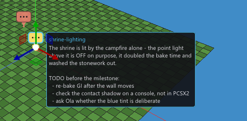

# Comments (editor notes)

A **comment** is a note pinned to a place in the scene: why this prop is here,
what still has to be done, what broke last time, which reported bug this wall
is. It lives in the editor and nowhere else — nothing about a note is
generated, baked, compiled or shipped, and the console never learns it exists.

Add one with **Add object > Comment** (the Scene menu, or `+ Add object` in the
Project panel). It lands where you are working, takes the keyboard straight
away, and you type.

## What you see

A comment is drawn as a **message icon** over the viewport image — never as
geometry. Two things follow from that, and both are the point:

- **It is always the same size.** The icon is screen-space, so a note ten
  metres away and a note across the map read identically, and neither grows
  into the scene when you zoom in.
- **It never hides what it is about.** There is no mesh, nothing enters the
  depth buffer, and the bubble floats above its anchor with the tail on the
  exact point it is pinned to.

**Selecting it shows the text**, beside the icon and in Properties. In the
viewport you get the note's name and its opening — enough to know which note
this is without opening anything — and the panel holds the whole of it.

## Long notes

A note is prose and there is no length limit, so the panel is built for one:

- the field grows with the text up to 24 rows and scrolls after that,
- it wraps (a single-line field would scroll sideways, one word at a time),
- **Copy text** puts the whole note on the clipboard — including the part the
  viewport bubble does not show,
- the character and line count is printed under it.

The bubble in the viewport is deliberately capped instead: past about 420
characters it ends in `...` and says *(full text in Properties)*. A bubble that
grew with its note would cover the scene the note is about.

## Hiding them

**View > Comments** turns them off. That is one switch, and it does everything
at once: the icons leave the picture, and they leave *clicking* too — a note
pinned in front of a prop cannot be selected by accident, and the rubber band
walks past it. Turn them back on and everything is where it was.

The setting is machine-global (`editor.ini`), not project data: whether you
want the scene's notes on screen is a property of how you work, and it is a
mode you stay in. Adding a comment while they are hidden turns them back on —
a note you cannot see is not one you can write in.

## It is an ordinary scene object

`PrimitiveType::Comment`, `"type": "comment"` in `objects/<id>.json`, with the
note in a `"comment"` key. That is what buys it, for free:

| | |
|---|---|
| a name | so notes are findable in the Project panel, which lists them like anything else |
| a place | the gizmo moves one, and it rests where you put it |
| undo | typing a note is an ordinary edit, `Ctrl+Z` and all |
| a colour | the icon's tint, which is how a scene full of notes grows categories: red for a problem, green for something settled |
| layers | a note on a layer hides with that layer |
| collaboration | notes merge per object like every other object, so two people annotating one scene do not fight |

What it does **not** get is anything a game object has: no geometry, no
collision, no physics, no material, no scripts, no flow graph, no shadow. The
Properties panel offers none of them, it cannot be used as an endless-scroller
segment, and every marker skip list in the generated game names type 20.

## What reaches the console

The note's TEXT reaches nothing — not `scene_data.hpp`, not a bake, not an
asset. Grep a generated project for a note's words and you will find none.

The OBJECT still occupies a row in the scene table, exactly like an
[Area](areas.md) or a procedural volume does: object *indices* are baked into
every generated table (flow graphs, mirrors, lightmap regions, live link), so a
type that vanished from the emitted list would silently retarget all of them.
That row is inert — no geometry is built for it, it collides with nothing, it
blocks no raycast and no navigation cell, and it is skipped by the USE picker —
but it is a row, so a scene with two hundred notes in it is a scene with two
hundred more objects. In practice notes are counted in tens.

## Format

`kFormatVersion` 39. The type name and the `"comment"` key are additive: an
older editor refuses the file rather than reading the type as a Box (which is
what an unknown type name falls back to), and no migration step is needed.

The note is deliberately **not** part of `liveLinkRecipeHash`, so rewriting one
while the game runs does not flip the LIVE chip amber and ask for a rebuild —
there is nothing in the running game that a note could be out of step with.
