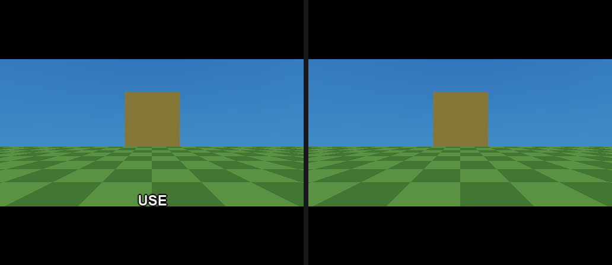
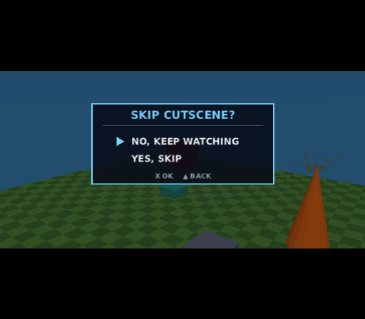

# Cutscenes

A cutscene is a keyframe timeline that poses scene objects and, optionally,
takes over the game camera for a while — authored in *Tools > Cutscene
Director*, compiled into the PS2 game as a runtime player, and started from a
flow graph with **Play Sequence**. This page covers what a cutscene does to the
rest of the game while it runs: the HUD, the USE prompt, and how the player
gets out of one early.

For the camera side of the Director — importing a phone-recorded 6DoF move as
keyframes, or using the phone as a live viewfinder — see
[camera takes](camera-takes.md) and [the phone camera](phone-camera.md).
`examples/cutscene-demo` is the worked example for all of it.

## The sequence options


Every cutscene carries a handful of switches above the dopesheet:

| Option | What it does |
|---|---|
| Duration / Loop | How long the timeline is, and whether it restarts at the end |
| Skippable | The player may end it early — see [Skipping](#skipping) |
| Camera track | Drive the game camera from the camera lane's shots |
| Hide player | Hide the third-person avatar (no effect in FPP — there is no body) |
| **Hide HUD** | Take the HUD, the USE prompt and USE itself off — see below |
| Widescreen bars | A letterbox mask, sliding in and out over its own times |
| Fade in / out | Ramp from and to black |

## Hide HUD

A cinematic with a health bar and a minimap in the corner is not a cinematic.
**Hide HUD** takes the whole HUD off for the duration of the cutscene and puts
it back exactly as it was afterwards:

- every HUD image in the screen stack,
- the live bars,
- the baked on-screen texts,
- the **USE prompt** — and, which is the part that matters, **the USE
  interaction itself**.

That last one is the reason the option exists in the shape it does. Use
targeting is a plain distance-and-facing test run from the **player** every
frame, before the cutscene camera is applied, and it knows nothing about
cutscenes — so a player left standing in front of a usable prop keeps *press to
use* on screen over the cinematic, and the button still works. That is the
common case rather than an edge one: the prop is usually the very one whose
**On Used** started the cutscene, and the walker keeps running underneath it.



**It is tied to this flag and not to "a cutscene is playing"**, deliberately. A
cutscene that animates a door, a lift or a piece of scenery while the player
keeps the camera and keeps playing is an ordinary thing to author, and there the
HUD and USE must keep working. Leave the box off for those.

**Runtime text is not hidden.** The *Display Text* flow node keeps drawing,
because that is what a cutscene's subtitles are written with. If you want a HUD
element to survive a hidden HUD, make it a Display Text rather than a baked
one.

Under the hood the player writes `ScriptContext::hudSuppressed` every frame and
clears it when the cutscene ends. That is a second flag rather than a write to
`hudVisible` on purpose: `hudVisible` belongs to the **Set HUD Visible** flow
node, and a cutscene restoring it to `true` on release would switch a HUD back
on that the game had deliberately hidden.

## Skipping

Tick **Skippable** and the player's `menu` action — START on a default pad —
ends the cutscene early. Two things about that are worth knowing.

**A skippable cutscene owns that button for its duration.** While it plays, the
press skips instead of opening the pause menu. Without that rule a skippable
cutscene is unskippable in any project that has a pause menu, which is most of
them: the press opened the menu, the open menu paused the scripts, and the
cutscene player never ran to see the button at all. There is nothing to
configure — ticking Skippable is what claims the button, and releasing the
cutscene hands it straight back.

**A skip can ask first.** The *On skip* dropdown, which appears next to the tick
box, chooses between:

- **Skip instantly** — the press ends the cutscene. The default, and what every
  project authored before this existed keeps doing.
- **Ask first** — the press opens the project's **skip screen** and the
  cutscene freezes on the frame it was on. The camera, the bars and the fade all
  hold where they were.

### The skip screen



The skip screen is an ordinary menu, so it is authored, styled and previewed
like every other one — *Tools > Menu Editor*, with the whole
[stylesheet](menu-styles.md) language available. One menu per project carries
the role, marked with the **Cutscene skip screen** tick box.

The fastest way to get one is **+ Skip screen** in the Menu Editor's menu list.
It scaffolds a two-row confirmation already marked with the role:

```
SKIP CUTSCENE?
  NO, KEEP WATCHING      (Close menu)
  YES, SKIP              (Skip cutscene)
```

`NO` is first so the cursor starts on it and a stray Cross does not throw the
cutscene away. Note that **declining needs no action of its own**: any way of
dismissing the menu — a *Close menu* row, the back button — leaves the cutscene
where it froze and it carries on. Only the **Skip cutscene** row action ends it.

If a cutscene is set to *Ask first* and the project has no skip screen, the
press skips on the spot. Swallowing it and doing nothing would read as a broken
button; the Cutscene Director says so in amber next to the dropdown, and the
Menu Editor marks an unreachable *Skip cutscene* row with `(!)`.

### Ending a cutscene from a graph

**Stop Sequence** does the same thing a skip does, from a flow graph, with no
button involved — and **On Sequence Finished** fires either way, so a graph that
cleans up after a cutscene does not need to know how it ended.

## What a cutscene does NOT take over

- **The walker keeps running.** A camera-track cutscene overrides the camera,
  not the player's movement; the player can still walk about behind it. Freeze
  them with a flow graph if that matters (or use *Hide player*, which at least
  takes the avatar out of shot).
- **The pause menu still exists** — a cutscene that is not skippable leaves the
  `menu` action exactly where it was, so START still pauses.
- **Split screen suspends itself** for the duration of a camera override: a
  cutscene owns the whole frame (see [multiplayer](multiplayer.md)).

## Where it lives in the code

| Piece | File |
|---|---|
| The data model + the shared interpolation math | `src/sequence.hpp` |
| The Director window, dopesheet and camera lane | `src/cutscene_ui.cpp` |
| The generated PS2 player | `sequencesSource` in `src/templates.cpp` → `src/gen/sequences.gen.cpp` |
| The skip interception and the confirm row | `updateGameMenu` in `src/templates.cpp` |
| The HUD / USE suppression | `ScriptContext::hudSuppressed`, read by the frame loop and `updateUseTarget` |

The easing, sampling, bars, fade, shake and camera-basis functions in
`src/sequence.hpp` are **mirrored** in the generated player so the editor's
scrub preview and the console agree. Change one, change both.
