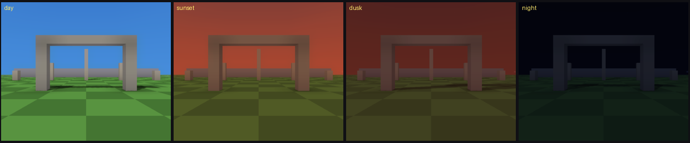
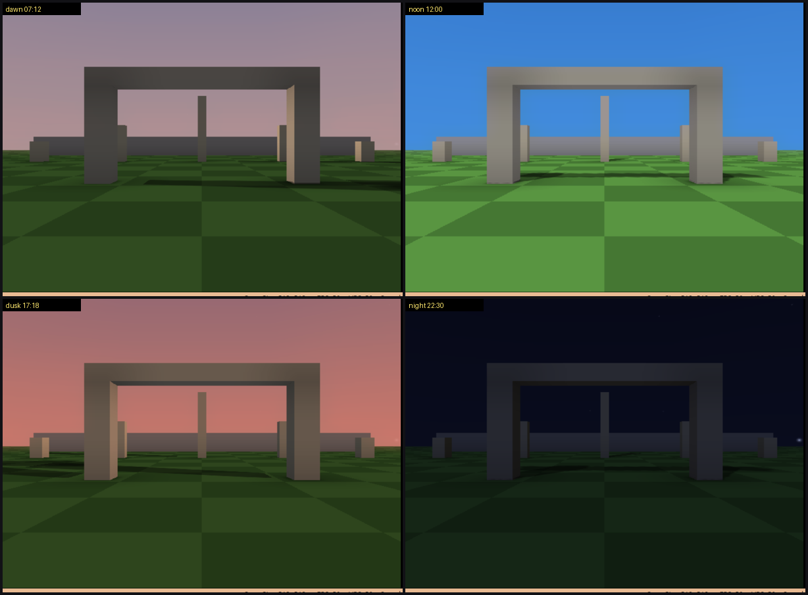

# Day and night cycle

The day/night cycle controls the sky, sun, moon, stars, fog and scene lighting
from one time-of-day track. Open **Tools > Ambience Editor > Day / night**.

The example project shows the same scene at four authored times:
[examples/day-night](../examples/day-night).

## Set it up

A cycle belongs to an ambience preset. Select the preset used by the current
scene, enable the cycle and set:

- sunrise and sunset;
- the sun's azimuth and tilt;
- the moon's offset, azimuth and tilt;
- sun and moon disc size;
- time-of-day keyframes;
- optional live clock speed.

The viewport previews the selected preset while the Ambience Editor is open.
If it is not the scene's preset, the tab says so and offers **Use for this
scene**. Closing the window returns the viewport to the scene's preset; it does
not discard your edit.

## Keyframes

Each key stores the hour plus sky horizon/zenith colour, light colour, ambient,
diffuse, brightness, fog and star brightness. Keys interpolate around the full
24-hour loop, including across midnight.

Use two keys to hold a value. For example, keeping the same night colour at
00:00 and 04:30 prevents it from slowly blending toward dawn all night. **Seed a
default day** creates a useful nine-key starting track.

## Sun and moon arcs

Azimuth is the compass bearing where a body crosses the horizon (`0 = +Z`,
`90 = +X`). Tilt lowers the peak from the zenith: peak elevation is
`90 - tilt`. A moon offset of 12 hours puts it opposite the sun.

The active light never goes below 5 degrees or exactly through the zenith,
because those directions produce broken or degenerate shadows. Near sunrise
and sunset, directional shadows fade out, the light switches body, then fade
back in. Blob shadows stay visible because they have no direction to switch.

The sun uses additive blending; the moon uses alpha blending and a desktop-
generated phase texture. Both discs can bloom and flare.

The lens flare and the god rays are aimed from the sun's projected screen
position, and that projection is not the textbook one. Tyra's perspective
matrix is built for the VU1 pipeline's fixed 2048 scale, so after the
homogeneous divide the screen edge sits at `w * raster / 4096` rather than at
`w`, and the matrix already carries the GS's downward y. Until 1.65.1 the sun
was projected as if `x/w` were normalised device coordinates and its y was
flipped a second time, which pulled it 8x closer to the middle of the screen
(at a 512 px raster) and mirrored it across the centre: the shafts radiated
from roughly nowhere, the ghost sprites walked the wrong axis, and the edge
fade decided the sun had left the screen at the wrong angles. If a sun effect
looks misaimed, that is the first thing to check. The ghost sprites also take
one extra correction, because the 2D renderer authors sprites in the stock
512x448 layout and letterboxes it into taller rasters - so in **Full-height
PAL** or **1080i** a world-anchored sprite has to come back up by half the
difference, or the flare hangs below its own sun.

## Stars

Stars are a deterministic point field on the sky dome. Keyframes control their
brightness. They fade near the horizon and around the moon so the sky does not
look like a flat texture pasted behind it.

The star seed and density are project settings. Changing them changes the field
but adds no runtime asset files.

## Static or live

With **Let the clock run** off, the chosen hour is baked and stays fixed. This
is the cheapest and most accurate mode.

With it on, the game advances time. Cheap values update continuously:

- sky, fog and brightness;
- sun, moon and stars;
- directional light and live shadows;
- lens flare and god rays.

Expensive lighting stays baked at its authored hour:

- ambient occlusion;
- global-illumination lightmaps;
- light probes;
- baked point and emissive light.

The editor shows both the live hour and the bake hour. Keep them reasonably
close or the moving light will disagree with baked shadows and bounce colour.
For a full-day game, bake several ambience presets and switch scenes or lighting
sets at planned times instead of stretching one bake across 24 hours.

## Rebuild rules

Changing time or any resolved light setting invalidates GI and AO caches. Re-run
their bakes before judging the result. The normal project build uses the latest
available cache; it does not run those desktop raytracers automatically.

## Useful starting values

- Start with the seeded day and adjust colours before changing arc math.
- Keep the moon about 12 hours behind the sun for a readable night.
- Use a shallow star brightness ramp around dusk, not an instant switch.
- Preview sunrise and sunset in motion; static noon/night shots will not expose
  a bad handover.
- Use the runtime example as a reference before building a custom track.
