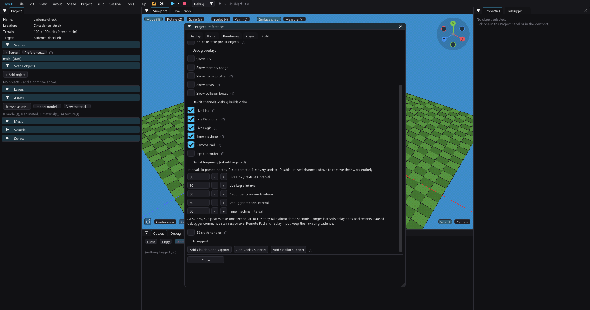

# Devkit


TyraX debug builds can inspect and control a running game. Release builds remove
the devkit completely.

Enable individual channels in **Project > Preferences > Build**. Most need a
game launched with **Build & Run** (`F5`) or **Run on PS2** (`F6`).

## Choosing the work and frequency



The channel checkboxes select what the game actually includes. Disable Live
Link when not editing the scene/textures, Live Logic when not patching graphs,
Time Machine when not rewinding, and Remote Pad when using a physical pad.
Keep Live Debugger for frame statistics, watches, breakpoints and captures.
The input recorder remains a separate opt-in channel.

**Devkit frequency** in the same Build tab provides five independent overrides:

| Setting | Work scheduled |
|---|---|
| Live Link / textures interval | Scene-edit and painted-texture command reads |
| Live Logic interval | Graph patch reads; graph execution still runs every update |
| Debugger commands interval | Breakpoints, stop/step and capture request reads |
| Debugger reports interval | Snapshot writes with statistics and watched history |
| Time machine interval | Restore request reads and state capture writes |

Values are game updates: **0 = existing platform defaults**, 1 = every update,
up to 120. Missing fields in older projects mean 0. Changes require rebuilding
the game. At 50 FPS, 50 updates take one second; at 16 FPS, about three seconds.
Increasing an interval trades response latency or history density for fewer
host filesystem operations. It does not disable per-node counters, per-update
watch sampling or graph execution; disable the corresponding channel to remove
that work. Longer report gaps can overwrite older entries in bounded history
rings before the editor receives them.

Automatic intervals remain 6 updates locally and 25 over ps2link for Link,
Logic and debugger I/O; Time Machine retains its platform defaults. The initial
poll phases stay staggered. Paused debugger command polling is capped at two
loop ticks and forced reports still bypass the report interval. The editor's
missing-heartbeat tolerance scales with the configured report interval and
reported FPS. Remote Pad polling and input recording/playback keep their
existing timing; these controls must not make a held button lag or lose frames.

For a lighter hardware session, try Link/Logic/Time Machine at 100, debugger
commands at 25 and reports at 50, then disable the unused channels. This is a
starting configuration, not a measured FPS guarantee. No extra polling channel
is introduced, and release builds still omit all these runtimes.

Verified for 1.90.0 on Windows: settings save/reopen and range clamping,
Preferences editing, automatic/custom/disabled/release code generation, native
game build, and PCSX2 plus physical PS2 runtime checks. With reports set to 50,
successive snapshot frame ids differed by exactly 50 on both. Physical PS2
halt/one-step/resume succeeded (step and resume about 0.15 s), and frame capture
worked. This is functional validation, not a measured performance improvement.

## Release builds stay clean

Devkit code is generated only for the debug profile. A release build removes
Live Link, the debugger, Remote Pad, Time Machine, the input recorder and
their file polling, buffers and symbols.

Every release build runs an ELF audit. You can repeat it with:

```text
tyrax-editor --audit-release <projectDir>
```

Exit code 0 means no devkit marker, symbol, command file or buffer reached the
ELF. Run the same command on a debug ELF when checking the auditor itself: it
must fail and list what it found.

**"Clean" means no devkit — not no logging.** A game build **never defines
`NDEBUG`** (the release profile only drops `-g` and sets `KEEPSYM=0`), so every
`TYRA_LOG` / `TYRA_WARN` in the engine ships: the calls run and the format
strings sit in `.rodata`. Harmless on a retail console, which has nowhere to
send the EE console, and not an audit failure since none of it is devkit code —
but do not write "compiles out" about a `TYRA_*` macro without checking.

## Tools

| Tool | What it does |
|---|---|
| [Live Link](live-link.md) | Streams object transforms and simple property edits |
| [Live Logic](live-logic.md) | Hot-patches compatible flow-graph changes |
| [Live Debugger](live-debugger.md) | Breakpoints, stepping, counters and watches |
| [Time Machine](time-machine.md) | Captures and restores recent game state |
| [Remote Pad](remote-pad.md) | Drives pad 1 or 2 without window focus |
| [Input recorder](input-replay.md) | Records a play session and performs it again |
| Debug window | Shows game logs, frame statistics, crashes and VU1 captures |
| Debugger > Screen | Makes the game photograph its own frame buffer |

Turn off channels you are not using when measuring performance. Debug file
polling is real work and can distort small timings. On real hardware it is not
small: the same scene measured **30-40 fps with the devkit polling and 50 fps
without it**, because a poll cycle is ~21 network round trips and one of them
writes ~10 KB in 1446-byte chunks.

The channels start on **different frames** — phases 5, 7, 9, 13, 17 and 21,
with the livedbg flush and Remote Pad deliberately left at 1 (liveness signal,
and latency). They used to all start at 1 and re-arm to the same number, so
they stayed locked to one frame in 25 for ever: that frame did seven blocking
`host:` round trips and the other 24 did none. Same total work, spread out.

The input recorder is phase **7**, and it is the odd one out in period as well:
it writes once per **chunk** — 64 frames under PCSX2, 256 over ps2link — not
once per poll cycle. A per-frame write would be a `host:` round trip per frame
and would change the very frame times the recording exists to capture.

## Frame statistics

The running game reports a compact snapshot containing:

- frame rate and current scene;
- draw flushes, vertices and VU1 quadwords;
- GS VRAM free, low-water and largest block;
- resident objects by type;
- optional free EE memory - measured ON REQUEST (*Measure now*), because the
  only way to ask this allocator how much it has left is to take all of it and
  give it back: `Info::getFreeRAMSize` claims every free block until malloc
  refuses, sums them and frees the chain. Thousands of allocations, so it is a
  button and not a timer. **A measurement that comes back 0 MB is reported as a
  failure rather than as a reading** - on a running game that number is either
  an emergency or a broken probe, and the panel used to show it as "not
  measured yet", which read as the button doing nothing (1.85.1);
- one row per render-bag flush.

The Debug window decodes it. Use the flush map to find a heavy draw before
capturing it; a terrain bag may contain many meshes, while a suspicious model
may be only one row.

## Crashes and hangs

The game writes `bin/log.txt` through PCSX2 HostFs. TyraX watches the heartbeat
and opens the latest assertion or crash report when the game stops advancing.

Debug builds can also keep an unstripped `bin/<name>.elf.sym`. Resolve an address
with:

```text
tyrax-editor --symbolize <projectDir> 0xADDRESS
```

PCSX2 does not reproduce every EE exception, so a crash handler must ultimately
be checked on real hardware. Assertions and soft errors are testable in the
emulator.

### A null pointer gets you no crash report at all

The report above covers the faults the handler hooks — address errors, bus
errors, reserved instructions, coprocessor-unusable, overflow and traps. The
**TLB causes are deliberately handed straight back to the kernel** (the reason
is in `crash_handler.cpp`: a hooked TLB refill with nothing to service it spins
in the vector forever), and a wild pointer into unmapped memory is exactly a TLB
refill. So the single most ordinary C++ bug there is produces **no
`bin/crash.txt`, no TYRAX banner and nothing on the TV** — just ps2link's own
register dump in the console log:

```text
Cause:7000800C   BadAddr:00000004   Status:70030C13   EPC:0013B988
```

Read it rather than skipping past it, because it is a complete diagnosis:

- `Cause`'s ExcCode is bits 6:2 — `(0x7000800C >> 2) & 0x1F` = **3**, TLB refill
  on store. 2 is the same thing on a load. Either one means *this address is not
  mapped*, and a small `BadAddr` means the pointer was null.
- `BadAddr` is the **offset of the field** that was written. `0x00000004` is a
  store four bytes into a null object — with `StaPipInfoBag`, whose `model`
  pointer is at 0 and `shadingType` at 4, that names the member outright.
- `EPC` is the faulting instruction, so `--symbolize` finishes the job:

```text
tyrax-editor --symbolize <projectDir> 0x0013B988
```

That printed `TerrainGame::setupLightPools() src/terrain_game.cpp:8435` and the
line was a bag field assigned before its `make_unique` (fixed in 1.54.1).
**PCSX2 cannot show you any of this**: its main RAM starts at address 0, so a
null store is an ordinary write there and the game runs on happily. A
null-pointer bug on this platform is a hardware-only symptom, and the crash
handler is not the thing that will report it.

### The SIF RPC completion guard

Heavy `host:` polling makes the devkit path an unusually busy SIF RPC client,
and ps2sdk's completion handler dereferences a null packet instead of ignoring
it — `BadAddr 0x00000010`, EPC in `rpc_packet_free`. The engine installs its own
handler that skips only that free and **always completes the client**, counting
what it skipped (`SifRpcGuard::rejected()`, 0 in a healthy session; a non-zero
count logs `==WARN: SIF RPC: dropped …`).

It is **not** gated on the debug profile, because a duplicate completion would
kill a release game too, and `--audit-release` stays clean either way (verified
in both directions). The mechanism, the measured teardown A/B, and the fact that
the fault has **never been reproduced** are in
[ps2link-setup.md](ps2link-setup.md#the-sif-rpc-completion-crash-and-the-guard-against-it).

## The game's own screenshot

In **Debugger > Screen**, press **Capture frame**. The game reads its last
finished frame straight out of GS VRAM, writes `bin/frame.tga` over the same
`host:` channel every other devkit file uses, and the panel shows it.

Every capture is then **kept as a PNG in the project's `screenshots/` folder**,
named by the clock (`frame-20260817-164501.png`), and **Show file** reveals that
copy. `bin/frame.tga` is a *channel*, not an album — one file, overwritten by
the next capture and deleted at every launch — so the PNG is the one that lasts:
it sits outside `bin/`, survives a *Clean*, opens in anything, and is
git-ignored. Delete the ones you do not want; nothing reads them.

From a shell, `tyrax-editor --capture-frame <projectDir> [-o out.png]
[--timeout s]` does the same thing headlessly: it writes the one-shot command
into `bin/livedbg.cmd`, waits for the game to finish `bin/frame.tga` (progress
is what decides the wait, so the ~3 s per shot over ps2link is fine) and
decodes it to a PNG. It is how an unattended A/B on a console gets its
pictures - a debug build with *Live Debugger* on, deployed with `--run-ps2`.
`--alpha <png>` writes the frame's own alpha channel as a grey image as well
(the game stores it in `frame.tga` as is since 1.70.3; the picture readers
force it opaque) - the only way to see an alpha-shaped artifact that the
television shows and the RGB does not.

This is the only capture path that does not need a desktop. Every host-side one
— the emulator's F8 key, a GDI grab of the window, `PrintWindow` — needs the
window present and, in practice, unoccluded and on an unlocked session; none of
them exists at all on a real PlayStation 2. So this is how you get a picture
from hardware, from a locked or disconnected machine, and from an unattended
script that must not depend on which window happens to be in front.

What comes back is the **frame buffer as the GS holds it**, not the television
picture: the raster the game rendered at, with no aspect correction and no
letterbox. A 512x448 project answers 512x448.

It costs the game a visible hitch, which is why it is one shot per press rather
than anything continuous — around a megabyte read back a scan line at a time and
written the same way. In PCSX2 that is over between two frames; **over ps2link
it is a network round trip per 1.4 KB, measured at about three seconds** on a
512x512 buffer, and the game is frozen for all of it.

The picture is the **previous real frame**: the last one the scene rendered, so
never a half-composed image and never a synthesised
[extrapolated](frame-extrapolation.md) one.

One thing that will look like a bug and is not: the capture is taken between
frames, so it can be one frame older than what you were looking at when you
pressed the button. The alpha channel needs no care — a frame buffer's alpha is
a working channel rather than coverage, so the game writes the file **opaque**
and both the panel and the PNG show a picture rather than a half-transparent
one.

### Why the file is written by the game rather than by libdebug

Worth knowing before touching that code, because the failure is silent and it
made this an **emulator-only feature for its first release**. ps2sdk's
`ps2_screenshot_file()` creates its output with `open(name, O_CREAT|O_WRONLY)`,
and over ps2link that create arrives at the `host:` server as a **mkdir of the
target name**: the host ends up with a *directory* called `frame.tga`, the open
that follows returns -1, and the function reports nothing at all — it has no
failure path. On hardware the log reads

```text
remove file host:frame.tga
mkdir name host:frame.tga
mkdir wrong mode, using fallback value 493
open name host:frame.tga flag 202  ->  open fd = -1
```

while every other devkit channel, writing through `fopen(name, "wb")` (flags
`0x602` on the wire), succeeds in the same session over the same server. So the
runtime keeps the half of libdebug that carries the value — `ps2_screenshot()`,
the VRAM readback — and writes the file through the same stdio path everything
else here uses. Two hardware-only traps come with that: the readback lands in
RAM **behind the EE's data cache** (the line is flushed after every transfer, or
rows repeat), and `ps2_screenshot()` refuses to run while VIF1's DMA channel is
busy and says so only through its return value, so refusals are counted and
reported instead of being written out as picture.

## Inspecting VU1 input

In **Debugger > VU**, arm a capture and choose a flush. The game writes
`bin/vucap.bin`; the editor shows DMA/VIF commands, mesh boundaries, vertices
and common packet problems.

The command-line decoder is useful when the UI is not:

```text
tyrax-editor --dump-vucap <projectDir>
```

A capture contains one bag flush, which can hold several meshes. Use the mesh
picker before assuming the first geometry belongs to the object you care about.
Only the last mesh in a multi-mesh chain can currently be replayed by the host
VU simulator.

Two limits are worth knowing before a capture is used as evidence rather than as
a debugging aid.

**The capture buffers clamp silently, and a heavy scene is already at the edge.**
The devkit holds 2 048 quadwords of chain, 64 referenced blocks and 2 048
quadwords of referenced data, and every one of those limits is applied by
truncation with no marker in the file. The Motor District's garage-day frame
submits about 1 050 packages over 120 flushes, i.e. 8.75 packages per flush,
which is roughly **1 986 referenced quadwords against the 2 048 limit — 97%
full**. A flush carrying the full 16 groups overflows it and nothing says so.

**The VU1 memory half is one package's residue, not a frame's output.** The
second hook waits for VU1 to idle and copies the whole of VU1 data memory, which
includes the GIF packet the microprogram staged for `XGKICK` — but that lives in
the double buffer and every package overwrites it, so what the snapshot holds is
whatever the **last** package of that one chain left. It is the right instrument
for "what did this draw hand the GS"; it is not, and cannot be made into, a
recording of the frame's GS stream. See
[baked-stream-acceptance-gate.md](baked-stream-acceptance-gate.md), which wanted
exactly that and had to build something else.

For VU source work, the faster checks are:

```text
tyrax-editor --vu-check
tyrax-editor --vu-replay <projectDir>
```

`--vu-check` compares generated and handwritten programs from the same editor
build. Rebuild first; mixing an old executable with a new engine directory
creates false failures.

## Find the live project

When several editors or emulators are open, do not guess paths:

```text
tyrax-editor --debug-state
```

It lists live sessions, transports and the freshest debug files, including the
frame and flush stored in a VU capture. Pass a project directory to inspect one
known project directly.

On hardware, the editor-owned `ps2client` is also the file server. Closing the
editor freezes devkit files even if the game keeps running. Redeploy, or start
`ps2client ... listen` from the project's `bin/` directory to restore the
channel.

### What the game already logs about itself

`bin/log.txt` is not only warnings and assertions - a few events that are hard
to reconstruct afterwards write a line each, so a report like *"I picked it up
and something threw me across the room"* can be read off the log instead of
guessed at. Grep for the prefix:

| Line | When |
| --- | --- |
| `Portal: player crossed <pi> to x y z` | a walker went through portal `pi`, with the arrival position |
| `Portal: object <oi> crossed <pi> to x y z` | a body did |
| `Pick: grabbed <oi> at x y z, player x y z` | an object was picked up, with both halves of that frame |
| `Pick: dropped <oi> …` / `Pick: threw <oi> … v vx vy vz` | it was put down or thrown |
| `Pick: lost <oi> mid-carry …` | it was despawned or hidden while carried |

Paired with an [input recording](input-replay.md) these turn a "it sometimes
does X" report into a fixture: replay the session, read the order of the lines.
That is how the carry and portal interactions are debugged here - the hop and
the grab are one frame apart or they are not, and the log says which.

Since 1.85.0 the same events are also **written into the recording itself**
(`--replay-dump` prints them with no emulator at all, and a replay compares
them frame by frame). The log lines stay: they carry the positions and the
velocities, which the events deliberately do not.

## First places to look

1. **Output** for build and launch failures.
2. `bin/log.txt` for game warnings and assertions.
3. `--debug-state` to confirm the project, transport and heartbeat.
4. The Debug window's frame and flush tables.
5. A VU capture only after you know which flush is wrong.

The devkit reports evidence; it does not prove performance on its own. Use real
hardware for timings and the PCSX2 software renderer for visual correctness.

### Manual ps2link launch: require the resident-IOP marker

Prefer `--build PROJECT --run-ps2 IP`, which creates the marker automatically.
If running ps2client manually, first create and verify **an absolute path** to
`PROJECT/bin/ps2link.run` containing `ps2link`. Launch with `PROJECT/bin` as the
working directory. `-ps2link` on execee alone is insufficient with this crt0.
A missing marker resets IOP, removes the host filesystem/network service and
can require a physical reboot; a later UDP poweroff cannot repair that loss.
Do not chain a failed marker write into an execee command. In PowerShell use
`-ErrorAction Stop` and `Test-Path -LiteralPath` before launching. A working
directory already ending in `bin` must not receive another relative `bin/`.
Also stop an emulator serving the same project before hardware captures: its
fresh `livedbg.bin`/`frame.tga` can otherwise disguise a disconnected console.

## Native hardware timeline

**Debugger > Hardware timeline** reads bounded engine captures without extra
polling: arm the next boot, load the completed CSV, choose a frame and zoom.
See [hardware profiler](hardware-profiler.md) for limits and HTML/Perfetto export.
