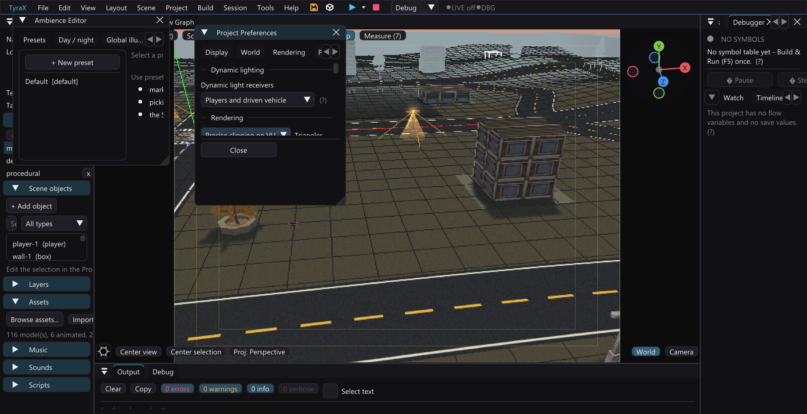

# Dynamic light receivers

Dynamic light receivers choose whether live scene lights and the camera flashlight illuminate every model or only player models and the vehicle being driven.

In **Project > Preferences > Rendering**, set **Dynamic light receivers** to
**All objects** (the default) or **Players and driven vehicle**. A scene can
override this choice independently in **Scene Preferences > Dynamic light
reception**. Disabling its override restores inheritance without discarding the
stored local choice. Project preferences follow the existing project-wide edit
behavior; scene overrides participate in scene undo and redo.

The restricted mode removes live model-light contributions from the world and
parked/traffic vehicles. Active player models and the currently driven vehicle
remain receivers, including their body, glass and wheels. Merely sharing a model
asset or spawning a clone does not make an object a player receiver. This is an
intentional visual/performance choice.

Baked light, probes, sun/moon, emissive materials and shadows remain. Projected
scene/flashlight pools, vehicle headlight projections, beams, coronas and lamp
glow are separate effects and remain visible. In particular, this option does
not remove the pools from the earlier private experiment's second mode.

The authoring viewport previews explicitly identified authored player models.
It has no running game's driver/controller binding: parked vehicle previews
remain world receivers and selection does not change reception. Both viewport
shading modes apply the receiver rule while retaining their existing shader
differences and projected ground-light approximation.

## Project and runtime contract

Format v96 writes `settings.dynamicLightReceivers` as `all` or `players`.
Missing or invalid values preserve full lighting. A scene stores the same
token and an independent `overrides.dynamicLightReceivers` flag; absent flags
inherit the project. Ambience presets and existing lighting overrides do not
implicitly change this policy.

Generated scene data resolves the policy for each scene. Runtime classification
uses live player and driven-vehicle bindings, not asset names, authoring order
or the camera owning a secondary view. Reflections and portal draws retain the
source geometry's ownership. Normal-lit and animated models gate their scalar
live-light pickup as well as the static pipeline's per-bag slot.

`PipelineInfoBag::dynamicLightReceive` defaults to true. False suppresses the
scene-light picker and explicitly selects the disabled spot object, including
the global flashlight fallback. It is independent of `dynLightPick`, `spotLit`
and the skipped light slot. A null picked light alone means the camera
flashlight and cannot implement a receiver rejection.

## Performance evidence

The [private fixed-night experiment](tyrax2-player-light-receivers.md) saved
1.41–1.50 ms with pools retained. Those results describe its own fixture/ELF;
they do not price the public option or guarantee 60 fps in another project.
The stronger private mode also removed pools and is not exposed by this option.

The public implementation has separate
[validation evidence](dynamic-light-receivers-2026-10-06/README.md): actual
model/serialization/undo controls, 22 CLI checks, editor UI interaction and
saving, seven normal native game builds, and owned emulator captures. The
animated All/Players pair shows both active players retaining the red light
while ordinary animated copies lose it only in Players mode. Same-definition
vehicle tests cover driving, exit and switching to the parked clone without
obvious wheel/body corruption. Showcase's targeted fixture renders the
destination through its portal and records an actual round trip; its
original-spawn navigation captures alone do not prove a crossing.

A fresh physical PS2 start and game-owned screenshots cover the restricted
vehicle scene and exit to foot. This is correctness evidence from a debug
build, not a performance comparison. Mirror ownership has source review;
these captures do not independently qualify a mirror ownership transition
or exact per-pixel equivalence. Audio was not qualified.

On R5900, `PipelineInfoBag` grows from 40 to 44 bytes. Engine and game code
must be rebuilt together; the normal build does that. Restricted wheel groups
and secondary-view animated-color refresh also have costs. Neither the common
default path nor the public restricted mode has a new hardware price yet.
The receiver option changes no production VU source.
