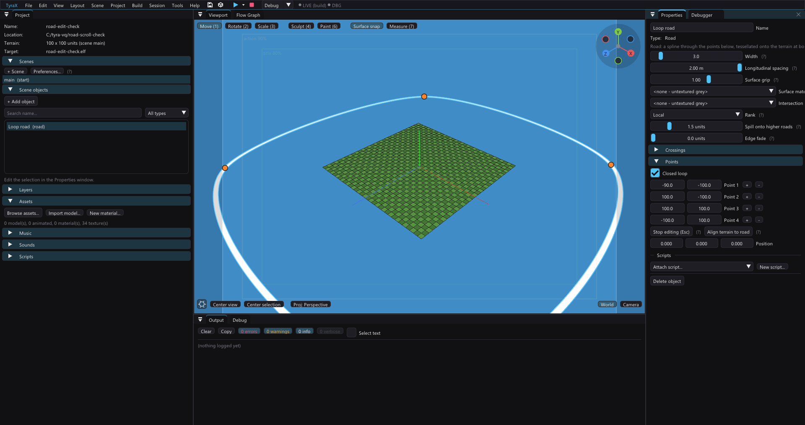

# Editor viewport performance

The editor skips static models that lie entirely outside the viewport before
submitting their material parts to OpenGL. This reduces CPU draw preparation and
GPU work during camera navigation without lowering preview resolution or lighting
quality. It does not remove scene objects, affect picking, or alter PS2 output.

Visibility uses the imported mesh bounds and the actual model-view-projection
matrix, rather than a unit cube or an object's pivot. Rotated, mirrored and
nonuniformly scaled models, orthographic views, large meshes and models crossing
the near plane remain conservative: a model is rejected only when its entire
box lies beyond one clip plane. Animated models keep their existing path because
an undeformed mesh bound cannot safely describe a changing pose. Reflections and
selection overlays retain their separate passes.

When comparing performance, warm the asset/shader caches first and use the same
camera path, viewport size and scene. Compare alternating old/new samples in one
run where possible: GPU contention and clock changes make separate runs vary
considerably. UI-script runs disable display synchronization, so their throughput
is not the normal window's presented FPS. A synchronized CPU/GPU diagnostic also
includes readback stalls; do not present its reciprocal as a measured display FPS.

Validation on an Aster copy used alternating off/on/on/off culling samples at
matching orbit poses in the same process. Across 300 warmed frames, per-mode
medians were 11.55 ms without rejection and 10.83 ms with it; the median ratio of
paired four-frame blocks was 0.971. On average 18 of 36 static model submissions
were rejected. These are synchronized diagnostic costs, not display FPS; separate
runs varied too much to support the initially observed twofold difference.
A static viewport crop matched pixel for pixel with rejection off/on. A host
harness exercised all six clip planes, intersecting and large boxes, negative
scale, perspective depth and near-plane crossings. The reported severe navigation
hitches were not reproduced reliably by this measurement.

## Road point editing

Since 1.151.0, selected-road editing borders reuse the viewport road cache.
Previously the UI tessellated every road again on every frame, including
unselected roads whose overlay it never drew. The geometry cache follows
points, width, authored spacing, materials, terrain revision and road rank;
soft-edge roads keep the full outer outline as well as their opaque core.
Both crossing-planner consumers retain their previous junction preview during
a viewport point drag and rebuild after release. Road asphalt and handles
remain live. This removes repeated CPU work; it is not a measured display-FPS
guarantee, and the changed road still rebuilds its exact surface while dragging.

Road handles are overlay hit regions, not layout content. Since 1.151.1 their
hit boxes intersect the scene canvas and their drawing is clipped to it.
Registering a normal ImGui button outside the image grows the window's content
extent even if the draw list clips it, producing an unwanted scrollbar. Scene
viewports disable panel wheel scrolling and reset scroll offsets; the welcome
screen keeps ordinary project-list scrolling.

