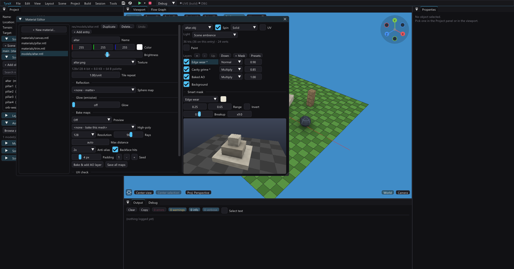

# Emissive materials (glow)



A material that lights **itself** — and, if you want, everything around it.
Lava cracks, neon signs, monitor screens, sci-fi panels, magic runes: anything
that must stay visible, in its own color, when the scene around it is pitch
black.

The PS2 has no pixel shaders and no HDR framebuffer, so this is not one effect
but three cheap, independent ones that together read as glow:

1. **The material's own brightness floor** — baked into the vertex colors at
   scene load, free at runtime.
2. **A thresholded bloom** — the GS bloom pass with a bright-pass cut and a
   spread control, so the halo lands on the glowing surface instead of veiling
   the whole frame.
3. **Baked emissive light** — the emitter's light folded into the vertex colors
   of the geometry around it, the ambient-occlusion treatment in reverse.

You can use any of them on its own. Together they give the full effect.

> **Why doesn't it glow harder at maximum?** Because at glow 1 an untextured
> surface is *already* at the framebuffer maximum in its own hue — there is no
> "brighter orange" left. From there, "more" means one of three things: whiter
> (the **White-hot core** slider), a bigger halo (**Bloom** / **Spread**), or
> lighting the surroundings so the whole area reads hot (**Lights up
> surroundings**). All three are below.

## 1. Making a material glow

*Tools > Material Editor* → pick a material → the **Glow (emissive)** section.

- **Glow** — 0 turns it off (matte, the default). 1 means "fully self-lit".
- **Glow color** — starts from the material's own color the first time you
  raise the slider (that is what "it glows in its own color" means to the eye);
  *Match material color* snaps it back after you have edited either.
- **White-hot core** — blows the surface out toward white, the way an
  overexposed emitter looks on camera. This is the control that makes a glow
  read as *hot*: a colored surface at glow 1 is already at the framebuffer
  maximum in its own hue, so the only way up is desaturating. It also pushes
  every channel over the bloom threshold, which widens and brightens the halo.
- **Lights up surroundings** + **Light reach** / **Light strength** — see
  [§3](#3-lighting-the-surroundings) below.

Both the Material Editor preview and the scene viewport show all of it live,
running the same formulas the console does. The section also reports the
project's current bloom setup, and warns when bloom is off — a glow with no
bloom is the single most common "why doesn't it glow?".

The material file stores the emission as the standard Wavefront `Ke`
statement — the **resolved** color, `glowColor × glow + whiteHot`, capped at
1.99. The authored controls ride in a `# tyra-glow` comment so a round trip
through the editor is lossless, exactly like `# tyra-brightness` does for `Kd`:

```
newmtl lava
# tyra-brightness 1
Kd 1.0000 0.3500 0.0500
# tyra-glow 1 1 0.35 0.05 0.3
# tyra-glow-light 9 1.6
Ke 1.0000 0.6500 0.3500
```

`# tyra-glow` is `<strength> <r> <g> <b> <white-hot>`; the one-number form from
the first release still loads (the color is then recovered by dividing `Ke`).
A hand-written `Ke` with no comment at all works too — its brightest component
is read as the strength. `Ke 0 0 0`, which most exporters write, is matte.

Any object using the material gets it: primitives via *Material*, `.obj` models
via their own or an override `.mtl`.

### What it actually does

The floor is applied **last**, after every lighting term:

```
shade  = directional × AO + point lights + emissive lights   // the normal path
shade  = shade × Kd
shade  = max(shade, Ke)                                      // the floor
color  = objectTint × shade
```

So an emissive surface:

- **ignores darkness** — sun, ambient, baked AO and point lights can only make
  it *brighter*, never dimmer than `Ke`;
- still respects the object's own **tint** color (a red-tinted object glows
  red-tinted), and still gets **fogged** at distance like everything else;
- costs **nothing** at runtime — it is three compares per vertex during the
  one-time geometry bake, and the console draws an ordinary bag.

`Ke 1 1 1` is therefore the classic *unlit* material: the texture or Kd color
renders at full brightness regardless of the scene. Values above 1 only bite on
**textured** materials, where the PS2 color byte modulates the texture up to 2×
— which is exactly why an untextured emitter cannot be made "brighter" past
glow 1, and why the White-hot core exists.

Objects with an emissive material are automatically excluded from the baked
**AO lightmap atlas** (docs/ambient-occlusion.md): that pass darkens per pixel
in a separate draw, which a floor baked into vertex colors cannot clamp back
up. They keep the per-vertex AO path, where the floor wins.

### Limitations

- **Animated models (`.glb`/`.fbx`) ignore `Ke`.** The skeletal runtime lights
  parts through a manual VU1 directional rig with no emission slot — the same
  reason `refl` is ignored there (docs/reflective-materials.md). Use a static
  `.obj` for a glowing prop.
- **Terrain ignores `Ke`.** Its material supplies the base tint and tiling
  only. (Terrain does *receive* emissive light — see §3.)

## 2. The glow halo (thresholded bloom)

The bloom pass downsamples the frame, blurs it and adds it back. Without a
threshold *everything* glows — the soft-focus look, not a glowing object.

*UI Editor* → the screen stack → **[ Bloom + color grading ]**:

- **Bloom** — how much of the blur is added back, **0 to 2**. The GS blend
  factor is a whole byte, so above 1 the blur is *over*-added: a blown-out,
  hot glow. (The *Set Bloom* flow node takes the same 0–2.)
- **Threshold** — only pixels **brighter** than this contribute. 0 = off (the
  whole frame, the historical behavior); ~0.5–0.7 collapses the halo onto
  emissive materials, the sky and specular hits.
- **Spread** — how far the glow reaches: 0 is the original tight fringe, 1 adds
  three more blur rounds over the quarter-res buffer, each with **doubled** tap
  offsets, so the halo grows geometrically into a real corona. A very wide glow
  over a busy frame reads as haze — tune it together with the threshold.

All three are per-scene overridable (*Scene > Scene Preferences > Post
effects*) and travel in the project settings as `bloom` / `bloomThreshold` /
`bloomSpread`.

On the GS the bright pass is one extra quarter-res sprite: a flat grey
subtracted from the downsampled frame through the `(0 − Cs)·128/128 + Cd`
blend, which clamps at zero — everything below the cut becomes black and drops
out of the blur, everything above keeps the excess. Each spread round is 4 more
sprites over the same tiny buffers. No EE cost, no extra VRAM.

## 3. Lighting the surroundings

Tick **Lights up surroundings** in the Glow section and the emitter stops being
a bright decal and starts behaving like a lamp: its light is baked into the
terrain, walls and props around it — per pixel where a lightmap covers the
surface, into the vertex colors at scene load everywhere else
([below](#per-pixel-via-the-scene-lightmaps)).

- **Light reach** — world units. The falloff is quadratic from the emitter's
  **surface**, not its center, so a long neon strip lights evenly along its
  length instead of pooling at the middle.
- **Light strength** — brightness at that surface. The light *color* is the
  **glow color**, deliberately *not* the resolved `Ke`: the white-hot core is
  an exposure effect on the emitter's own surface, and a green lamp keeps
  casting green light however blown out it looks.

The facing term is **half-Lambert squared**, `((1 + N·L) / 2)²`. These are area
sources — a lava plate, a neon strip — not points, so a plain `max(0, N·L)`
would light one face of a box fully and its neighbour not at all, seaming right
on the corner; and even a linear wrap still reaches zero at some finite angle,
which in a dark scene reads as a hard shading edge. The squared half-Lambert is
smooth everywhere, hits zero only directly away from the emitter, and leaves a
faint fill across the back hemisphere where a real bounce would put one. (The
occlusion term next door keeps its own linear `0.35 + 0.65·N·L` — different
physics, and it is the shape that bake was tuned with.)

Stored as `# tyra-glow-light <reach> <strength>`. This is the ambient-occlusion
machinery in reverse and shares its guts: `aobake::collectEmitters` reuses the
exact analytic box/sphere `collectOccluders` builds, the game answers both with
one distance-to-shape query, and the emitter list is pruned once per object /
per terrain chunk (never per vertex — see the dcache note on `pointLightAt` in
the generated game). Codegen emits the table into `inc/ao_data.gen.hpp`; a
scene with no emitters emits none and pays nothing.

### Per pixel, via the scene lightmaps

Baked light lands on **vertices**, and a plain box face is two triangles — so a
strong gradient across one face is interpolated from four corners and the
diagonal split between the triangles shows up as a hard seam. Primitives
therefore take the light through the **scene lightmap atlas** instead, the same
per-texel image the ambient occlusion already used:

- one 256² RGBA32 atlas per scene, **`A` = occlusion, `RGB` = emissive light**,
  so the light costs no extra VRAM;
- it is read twice, because texturing is MODULATE and the vertex color of each
  pass selects the channels it can see: a **black**-vertex alpha-over pass
  (an exact per-pixel multiply) and a **white**-vertex additive pass;
- the additive pass is `fogDisabled` — GS fog would add the fog color through
  an additive equation and brighten fogged pixels;
- **every texel's alpha is floored at 2.** StaPip draws with the GS alpha test
  set to *pass only when alpha ≠ 0* — the cutout rule that makes foliage and
  decals work. Both passes read the same texture, so a texel whose *occlusion*
  is zero used to fail that test and take the additive **light** pass down with
  it. The baked light was being clipped to wherever the ambient occlusion
  happened to be non-zero, punching hard, texel-aligned holes into lit
  surfaces; the floor costs 1/128 of darkening, under one framebuffer level.
  Any future pass that shares a texture with a cutout-style one inherits this
  trap.
- **both passes are pinned to the base pass's VU1 package size** — they draw
  the same vertex array, and passes that split it differently can classify a
  triangle differently against the frustum and then disagree about depth. The
  mechanism and the measured cost are in
  [docs/reflective-materials.md](reflective-materials.md); the same pin covers
  the reflection pass, since a reflective *and* lightmapped object draws all
  three over one array.

Each texel is the **mean over its own footprint** (a 4×4 sub-sample grid), not
a point sample at its centre. Shadow edges here are very nearly hard — a neon
fixture 0.3 units off a wall throws a penumbra of centimetres, well under one
texel — and point-sampling one writes a full-amplitude step between neighbouring
texels that bilinear filtering then reconstructs as a staircase. The cost is
host-side bake time only; the console draws exactly what it drew before.

Regions are **not** all sized alike. A pre-pass probes each one on a 6×6 grid
and asks two questions: how strong a signal it can carry (light received,
occlusion cast on it), and **how fast that signal moves along each of its two
axes**. The peak sets the *area* — density scales with its square root, so the
area a region gets is proportional to what it actually receives, and a
pedestal's underside or a wall's back collapses toward a floor size. The two
gradients then split that area between the axes, because a region's axes rarely
deserve the same density: an alley wall 18 units long and 5 high carries a steep
ramp up its height and a lazy one along its length. The density finally rises
globally (by bisection) until the image is genuinely full instead of leaving the
~60% a power-of-two round-up used to waste.

The atlas **dimension** is still computed from the unweighted area, so none of
this changes a project's VRAM in either direction — it only redistributes texels
inside the same image. On `examples/glow` the lit alley wall went from 6.0 × 6.0
texels per world unit to **15.6 × 7.8**, and the mean step between neighbouring
texels in its *worst* direction — which is what blockiness actually is — fell
from **5.70 to 2.26** at the same 256².

The atlas is built whenever *either* bake has content, so a scene can have
glowing lamps and no ambient occlusion at all.

### The ground, too

The **terrain** has the same problem in a worse form: its vertices are the
heightmap grid — one every terrain cell, *2 world units apart* in
`examples/glow` — so a pool of light spread over them is a handful of huge
Gouraud facets with the diagonal triangle split showing through. It now takes
the light per texel as well, through the image the terrain AO map already was:
**`A` = occlusion, `RGB` = light**, read twice by the same two passes the
primitives use. That map is 256² over the whole terrain — **4 texels per world
unit against 0.5 vertices per world unit, 8× finer** — and it costs no extra
VRAM, because the texture was already resident; only one more blended pass per
visible chunk.

Two catches worth knowing:

- the occlusion pass's vertex color had to become **black**. It used to be
  white, which was harmless while the map's RGB was empty; with light in there,
  a white vertex color would drag it into the multiply;
- a **textured** ground keeps the per-vertex path, for the same reason textured
  receivers do below. Terrain counts as textured if its base material or any
  paint layer has a `map_Kd`.

Everything else keeps the per-vertex path, where the gradient is coarser but
there is no atlas budget to spend: imported models, spawned clones, physics
bodies, pickables — and **textured receivers**, deliberately. The additive pass adds a flat color, so
on a texture it would blow out the dark texels; the vertex path multiplies the
texture instead, and texture detail hides the Gouraud seam far better than a
flat surface does. `SCENE_AO_ATLAS_LIT` tells the game which objects took the
atlas route, so the light is never applied twice.

For anything on the vertex path, raising the object's **Detail** (Properties >
subdivisions) is the fallback: a Detail-5 box is 300 triangles instead of 12
and the gradient smooths out.

**It only works when the extra vertices land in the direction the light
varies**, which is why a box behaves and the curved shapes need care. A box
subdivides each face into a `d x d` grid, so both directions improve.

A **cylinder** takes `d` radial segments and, with *Properties >* **Vertical
rings** ticked, one ring up its side per four of them (`primCylinderStacks`).
Without the rings the side is **one quad tall at any Detail**, so a lamp
overhead can only be a linear ramp between the top and bottom rims and every
segment paints that ramp's diagonal seam as a full-height stripe — raising
Detail 4 → 32 then multiplies the stripes (measured on the console: 0 → 15
brightness reversals across the silhouette) without shrinking their amplitude
at all. With the rings on, the same Detail-32 pillar drops to a 20-level
spread from a 49-level one, i.e. a soft gradient instead of a picket fence.

It is a **per-object switch and not the default** because the rings are only
worth their triangles when something lights the cylinder vertically; under a
plain sun they are geometry nothing shades. Detail 16 costs 160 triangles with
them and 64 without, Detail 32 costs 576 against 128. New cylinders are created
with the switch on and the triangle readout beside it; cylinders loaded from a
project that predates the field keep it off, so no existing scene changes.

A **cone** has no equivalent — its side is one triangle per segment, apex to
base, so a vertical gradient on a cone is a flat ramp however high the Detail
goes.

#### The ground

The **terrain** is where this matters most — it fills most of the frame in a
dark scene, and its vertex grid is coarse: *Preferences > Terrain detail* 32
over a 64-unit map is one lighting sample every **1.94 units**, so every pool
of light and every shadow edge on the ground was quantised into ~2-metre
squares.

It takes the identical route, one level up: the **terrain lightmap**
(`.res-baked/aomap/scene<N>.png`, the image the ambient occlusion already
shipped) gained the same `RGB` light channel, and every terrain chunk draws it
as a second, additive pass next to the occlusion one — same texture, same STs,
same `lightAddInfoBag`. It covers the whole terrain at ≤256², so the light
lands **per pixel at 0.25 world units per texel** on a 64-unit map (~8× finer
per axis than the vertex grid) and **0.75** on a 192-unit one like
`examples/showcase` — better than per vertex everywhere, dramatic on a small
map. `SCENE_AO_MAP_LIT` is the terrain's `SCENE_AO_ATLAS_LIT`: with the map
lit, `buildTerrainChunk` stops adding `emissiveLightAt` to the vertex colors
(and skips collecting the chunk's emitters entirely), so the light never lands
twice. A scene with no emitters bakes no light channel and draws no extra pass.

Two consequences worth knowing:

- the additive pass's vertex color carries the terrain's own **base tint**, so
  the light still lands on the ground's color. On an **untextured** terrain
  that is exactly what the vertex path did. On a **textured** one it is not:
  the add is flat rather than modulating the texture, so a hot pool reads
  slightly brighter over dark texels than it should. That is the opposite call
  from the one objects make, and deliberate — a prop is small and its texture
  hides the Gouraud seam, while the ground is the biggest surface on screen and
  its 2-metre quantisation had nowhere to hide.
- the map is **not** gated on the ambient-occlusion preference any more. A
  scene with glowing lamps and no baked occlusion ships a map with an empty
  alpha channel and draws only the additive pass.

### The limit you will actually hit: banding

A pool of light is a wide, *low-amplitude* ramp — it may span half the screen
while covering only 30 of the framebuffer's 255 levels. Each level therefore
becomes a broad plateau, and magnifying a handful of atlas texels over it turns
the plateau edges into visible irregular blocks. The bake dithers the light
with an ordered 4×4 pattern (sub-level, keyed on the atlas texel, so it is
deterministic and never crawls), which breaks those plateaus down to about one
texel — but it cannot manufacture precision that is not there.

What is left is a hard budget, not a bug:

- the whole scene shares **one 256² atlas** for its primitives, and **one
  256² map for the whole terrain** — bigger means RGBA32 VRAM the GS does not
  have (see the note on texture residency in the editor skill). On the terrain
  that cap is a texel size: 0.25 world units on a 64-unit map, 0.75 on a
  192-unit one, so a big map trades resolution for coverage. The importance
  weighting above spends the atlas budget where the light is, but it cannot
  enlarge it;
- palettising is not an option — the engine's tRNS→CLUT path destroys these
  smooth gradients (verified in PCSX2: a quantized bake renders as nothing);
- the framebuffer is **8-bit per channel** with no dithering on the blend.

Two things genuinely help. Keep the emitter's **reach** tight, so the ramp is
steep and spends its levels over a shorter distance instead of smearing them
across a whole wall. And add a little **film grain** (*UI Editor* > the screen
stack) — the era-standard answer, and what PS2 games shipped for exactly this
reason: a few levels of noise make the eye integrate the plateaus away.

### Shadows

The light is **blocked by solids**. Every object marked *Cast shadow*
(Properties — the same flag the ambient occlusion uses) becomes an analytic
box or sphere, and the light is scaled by how much of the emitter the lit point
can still see. So a wall stops the glow instead of letting it through.

These are **area** sources, so the edge is a **penumbra**, not a cut. Eight rays
go out per emitter — one to its nearest surface point, seven spread across the
emitter's silhouette as seen from the lit point (a fixed Vogel disk, no RNG: the
same scene bakes to the same bytes every time) — and the fraction that gets
through scales the contribution. Where nothing blocks, all eight arrive and the
result is bit-identical to an unshadowed bake; the soft band appears only along
the edge, and it **widens with distance from the caster**, the way a real one
does.

What stays hard is the *shape*, not the edge. The caster is still an analytic
solid, so a wall throws a soft-edged rectangle rather than its silhouette, and a
detailed mesh shadows as its bounding box. Untick *Cast shadow* on anything that
should not stop light (a railing, a grate, foliage) — otherwise its bounding box
will.

> **One path is deliberately still hard.** Eight rays instead of one are free
> where the shadow is baked on the host — the scene lightmap atlas and the
> terrain map below, and the editor viewport. The **per-vertex** path keeps the
> single ray: imported models, spawned clones, physics bodies, textured
> receivers and textured terrain. Two measured reasons: its own resolution is a
> box face's four corners or a terrain grid cell — 2 world units in
> `examples/glow` — far coarser than the penumbra it would resolve; and it runs
> on the EE at scene load and again on every runtime spawn and static-batch
> rebuild, where eight rays cost **+200 ms of scene load** on that example
> (1160 → 1360 ms, measured in PCSX2) with the same multiplier landing mid-frame
> on a spawn. The three implementations are otherwise exact twins; this is the
> one place they diverge, and this paragraph is where it is written down.

It is **static light**, exactly like the baked AO and the point lights:

- the pool does not follow an object that moves at runtime, and neither do its
  shadows;
- animated `.glb`/`.fbx` models neither cast light, nor receive it, nor shadow
  it;
- an emitter never lights *itself* (its own floor already holds it at full
  brightness) and never shadows its own light.

Only the object's **assigned** material is consulted, so a `.obj` model must
have the glowing `.mtl` set as its *Material* override to emit; a glowing
submesh inside the model's own library lights nothing.

## Recipes

"It glows in the dark", from subtle to blazing:

| Setting | Where | Subtle | Blazing |
|---|---|---|---|
| Glow | Material Editor | 1.0, color = material color | 1.0 |
| White-hot core | Material Editor | 0 | 0.3–0.5 |
| Lights up surroundings | Material Editor | off | on, reach ≈ 2× the object |
| Light strength | Material Editor | — | 1.2–2.0 |
| Bloom | UI Editor > Bloom | 0.7 | 1.2–1.6 |
| Threshold | UI Editor > Bloom | 0.5 | 0.5 |
| Spread | UI Editor > Bloom | 0.2 | 0.6–0.8 |
| Ambient / Diffuse | Ambience / Scene Preferences | low | very low |

## Where the code lives

Host and console implement the same formula twice — change one, change the
other:

| Piece | Console | Editor |
|---|---|---|
| `Ke` parsing | `vendor/tyra/engine/src/loaders/3d/obj_loader/lean_obj_loader.cpp` | `src/objparser.cpp` |
| The floor | `pushVert` in `src/templates.cpp` | the `uEmissive` line in `src/viewport.cpp`'s fragment shader |
| Shape query | `occShapeAt` in `src/templates.cpp` | `shapeAt` in the viewport FS — and `aobake::occShapeAt` on the host |
| Emissive light | `emissiveLightAt` in `src/templates.cpp` | `emissiveLight` in the viewport FS — host reference `aobake::emitterLightAt` |
| Emitter shapes | baked into `inc/ao_data.gen.hpp` | `aobake::collectEmitters` (single source for both) |
| Soft shadows | *single hard ray — the documented divergence above* | `aobake::emitterVisibility` + `kEmisShadowDisk`; `emisVisibility` in the viewport FS |
| Scene lightmap | the atlas passes in `rebuildObjectGeometry` | `aobake::bakeSceneLightAtlas` bakes it, texbake writes the PNG |
| Terrain lightmap | the two chunk passes in `buildTerrainChunk` | `aobake::terrainAOMap` bakes it, texbake writes the PNG |
| Texel budget | — | the importance pre-pass in `aobake::bakeSceneLightAtlas` (host only) |
| Alpha floor | — | `aobake::kMinLightmapAlpha`, applied by both bakes |
| Bright pass + spread | `RendererCorePostFx::apply` (`renderer_core_postfx.cpp`) | not previewed (GS-only, like every screen effect) |

Authoring UI: `App::drawMaterialEditorWindow` + `loadMaterialFile` /
`saveMaterialFile` / `matEdKe` (`src/app.cpp`). AO-atlas exclusion:
`materialGlow` in `src/aobake.cpp`.
