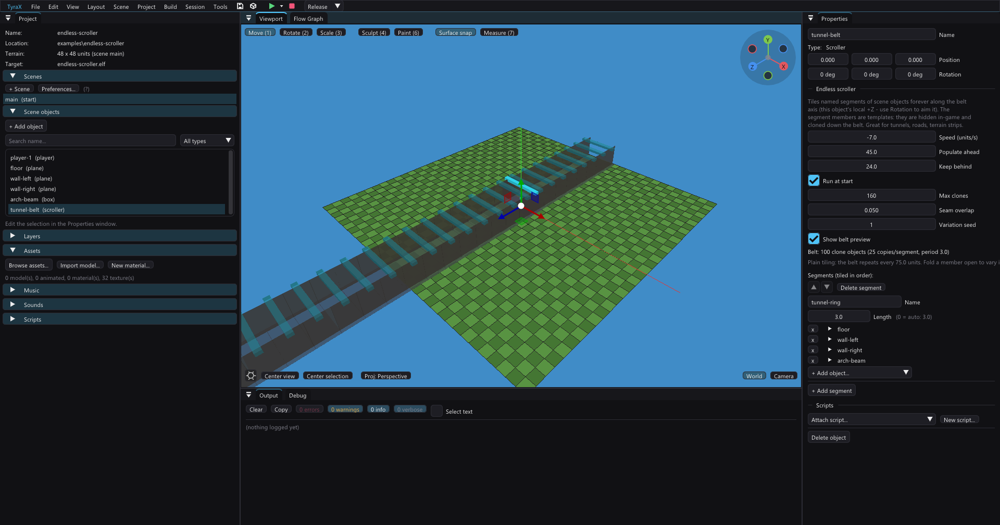

# Endless scroller

A **Scroller** is a conveyor belt for scene geometry. You author a chunk of a
level once — a tunnel ring, a strip of road, a clump of trees — tell the
scroller how long that chunk is, and the game tiles copies of it along the belt
axis **forever**, sliding them past the camera. It is the classic "level
generator in a train window": the world streams by to the horizon without you
placing a single object past the first chunk.

Because the whole belt is built from a handful of authored templates that get
cloned at build time and repositioned each frame, it costs only the geometry of
the copies that are actually on screen — no runtime spawning, no procedural
mesh generation on the PlayStation 2.

A Scroller is invisible and intangible in the game (it is just a marker that
drives its clones). Use its **Rotation** to aim the belt: the belt runs along
the scroller's local **+Z** axis.

Two ready-to-run demonstrations:
[examples/endless-scroller](../examples/endless-scroller), a first-person
endless tunnel streaming past at 7 units/s built from a single 3-unit chunk;
and [examples/endless-runner](../examples/endless-runner), a track that never
repeats, with a roadside generated once by a Procedural volume and then tiled
forever.

## Segments

A scroller owns an ordered list of **segments**. A segment is:

- a **name** (for your reference),
- a **length** — how much belt space the chunk occupies before the next
  segment starts (0 = auto-measured from the members' extent along the axis),
- a list of **member objects** — scene objects you authored that make up the
  chunk (referenced by name, exactly like a Mirror's reflected-object list).

Segments repeat in list order, forever: `A B C A B C A B C …`. Give a scroller a
single segment for a uniform belt (a straight tunnel), or several for variety (a
road that cycles straight / curve / junction pieces).

The member objects are **templates**. In the editor they stay visible so you can
edit them; in the game they are hidden and the scroller draws sliding clones of
them instead. A member's authored position defines its place *inside* its chunk;
its perpendicular offset from the belt axis is preserved, so you can build a
chunk with real shape (rails to the sides, a ceiling above, props scattered
across the width).

> Members should be plain scenery. Any flow graph or attached script on a member
> does **not** run (the template is deactivated in the game); the clones are
> pure visual + collision copies. Keep logic on other objects.

## Belt settings

| Setting | What it does |
|---|---|
| **Speed** | Belt speed in units/second along +Z. Negative reverses the flow. |
| **Populate ahead** | How far in front of the scroller origin to keep the belt filled. |
| **Keep behind** | How far behind the origin an instance stays before it recycles to the front. |
| **Run at start** | On = the belt moves from scene start. Off = it waits for a *Start Scroller* flow node. |
| **Max clones** | Safety cap on baked clone objects. Past it the belt recycles fewer copies and a gap may appear (the editor warns). |
| **Seam overlap** | Anti-z-fighting: every clone is stretched this much along the belt (default 0.02), so consecutive pieces interpenetrate slightly instead of butting up with exactly coplanar end faces, which flicker. 0 = exact tiling. See *Seams* below. |
| **Variation seed** | Seeds the per-cell variation below. Changing it deals a different infinite level out of the same pieces. |

The Properties panel shows the live **clone cost** ("28 clone objects, 14
copies/segment, period 4.0") so you can see how heavy a belt is before you
build, plus a warning if the clone cap is trimming the belt or a member name is
missing.

## Building a scroller

1. Author your chunk — place the objects that make up one repeating unit
   (e.g. two rails and a floor tile), sized to the length you want.
2. **Insert > World > Scroller (endless)**, then aim it with Rotation so its +Z
   points down the belt.
3. In Properties, **+ Add segment**, set its **Length** (or leave 0 to
   auto-measure), and **+ Add object** each chunk member.
4. Set **Speed** and the **ahead / behind** window, then build.

Shortcut: select the objects that make up a chunk, and in the multi-object
Properties click **"Make endless scroller from selection"** — it creates a
scroller at the group's centroid with those objects as its first segment.

## Per-cell variation: making the belt stop repeating

A plain belt tiles a fixed pattern, so it comes back around every
`copies × pattern length` — and a player watching it for a minute sees that. The
variation layer breaks the repeat **without adding a single triangle**.

The belt is divided into **cells**: one pass of the pattern past the window. Each
cell has an index that counts along the infinite belt — it holds still while a
piece is on screen and advances every time that piece recycles to the front. Fold
open any segment member in *Properties* and it gets its own knobs, all resolved
from a hash of (belt seed, cell, member):

| Setting | What it does |
|---|---|
| **Appears in** | Fraction of cells this member shows up in. 1 = every cell (plain tiling); 0.35 = roughly a third of them. |
| **Variant group** | 0 = off. Members of one segment sharing a group number are *alternatives*: exactly one shows per cell. Three obstacle shapes in one lane, a different one each time. A grouped member ignores *Appears in* — the group always fills. |
| **Yaw jitter** | ± degrees of random spin around Y, per cell. Free variety for rocks, trees and debris. |
| **Side jitter** | ± world units across the belt (perpendicular to the axis, horizontal), per cell. |
| **Scale jitter** | ± fraction of the authored size, per cell (0.20 = ±20%). |

Two rules of thumb. **Leave a tiling surface alone** — a floor slab or a rail has
to line up with its neighbour, so yaw, side and scale jitter all belong on the
props riding on top, not on the surface itself. And **use a variant group when
something must always be there but should differ**, `Appears in` when it should
sometimes not be there at all; they compose (a group for the obstacle, a chance
for the lamp post).

It costs nothing at runtime: a member's look is resolved once, when its clone
recycles into a new cell — four hashes — and nothing at all on the frames in
between. The editor's ghost preview runs the identical code, so the belt you
watch in the viewport is the belt that ships.

> **Why it really never repeats.** The runtime keeps its scroll accumulator
> folded into one belt period (see *How it works*), which is what stops float
> precision from decaying — but that fold is also what would make the layout
> eternally periodic. The director counts the folds, and the cell index adds them
> back. So the accumulator stays small while the cell index keeps climbing, and
> the stream does not come back around.

## Controlling the belt from logic

Three flow nodes (the **Scroller** category) target a scroller object:

- **Start Scroller** / **Stop Scroller** — run or freeze the belt.
- **Set Scroller Speed** — change the belt speed live (e.g. accelerate the
  tunnel as the game ramps up difficulty).

## How it works

The layout math lives in one shared host module, `src/scrollsim.cpp`, used by
both the editor preview and the build:

- The belt is a 1-D axis through the scroller origin. Each segment instance sits
  at a **phase** (`baseOffset + copy × patternLength`); as the belt scrolls, an
  instance's belt coordinate `u = wrapU(phase − beltScroll)` recycles it into
  the active window `[−behind, +ahead]` once it passes the back.
- At build, `templates::sceneDataContent` bakes enough clone objects to tile the
  window (`cellsPerSegment` copies of every segment's members) and **appends**
  them to the scene's object table — authored indices never move, so flow
  graphs, mirrors, scripts and the player still resolve. It emits three side
  tables (the same pattern as `MIRRORS`): `SCROLLERS` (per-belt state),
  `SCROLLER_CLONES` (each clone → its scroller + phase + home position) and
  `SCROLLER_HIDDEN` (the authored templates to deactivate).
- At runtime, the generated `ScrollerDirector` script (`scroller.gen.cpp`)
  advances each belt by the real frame time, wraps every clone with the same
  `wrapU` formula, slides it along the axis and hides the templates.
- **A clone rides the per-object matrix path.** Moving an object normally means
  re-baking its whole world-space vertex array on the EE — right for a one-shot
  move, ruinous for something that moves every single frame. A clone is
  therefore baked ONCE in local space and afterwards moved by refreshing its
  matrix, which VU1 applies for free; that is its entire per-frame render cost.
  Measured on [examples/endless-runner](../examples/endless-runner): the same
  116-clone scene ran at **16 FPS** re-baking and **50 FPS** on the matrix. The
  inherited trade-off is that a clone's baked shading freezes at the pose it was
  promoted in — invisible on a belt, which slides along one axis under
  direction-only lighting. A clone the fast path refuses (a usable, a reflective
  material) silently falls back to the re-bake and just costs more.
- **The scroll accumulator is folded back into one belt period every frame**, in
  the runtime *and* in `scrollsim::placements`. The layout is periodic, so this
  changes nothing you can see — it is what makes "endless" literally true. A
  raw accumulator grows without bound, and a `float` carries only 24 bits of
  mantissa: left running long enough, one frame's movement becomes smaller than
  the spacing between representable numbers at that magnitude, and the belt
  would first stutter in visible jumps and then stop dead. Nothing accumulates
  per-frame anywhere else in the feature, and the director allocates nothing —
  the clone tables are fixed-size and baked, so a belt costs no heap traffic on
  the console no matter how long it runs.

The editor viewport reads the identical `scrollsim` code to draw the animated,
semi-transparent **ghost belt** — so what you preview is exactly what ships.

A running belt fills its whole ahead/behind window with those copies, which is
exactly what you cannot see past while editing the member objects they are made
of. So the ghosts are hideable at two scopes:

- **Show belt preview**, in a Scroller's own Properties, hides *that* belt.
- **View > Scroller preview** hides *every* belt in the scene at once, and
  wins while it is off (the per-belt checkbox greys out, because there is
  nothing left for it to say).

The belt's origin markers stay either way — they are how an invisible,
intangible marker object is found and selected — and nothing else changes: the
clone count, the warnings and the layout maths are all still live. Both are
editor settings, not project data: they do not travel with the `.tyra` and the
game never hears about them.

## Seams: making the joints invisible

Where two copies of a chunk meet, faces can fight in the z-buffer and flicker.
Two rules keep the joints clean:

- **Build continuous surfaces from Planes (or open .obj meshes), not boxes.**
  A closed box has end caps; where two boxes butt, the hidden caps share the
  seam with the visible side faces and a flickering line can appear along the
  joint no matter how precisely they align (the cap's edge lies exactly on the
  surface). A Plane has no caps — floors and walls made of planes tile with no
  seam at all. Keep boxes for props that don't touch their neighbors (arches,
  pillars, obstacles). (The Plane primitive's own underside is already offset a
  hair below its top face — nothing on the PS2 backface-culls, so exactly
  coplanar front/back faces would dither-fight across the whole surface.)
- **Don't rest members exactly on the terrain plane.** A box or plane whose
  underside sits at exactly the terrain height is coplanar with the terrain and
  shimmers. Lift the chunk a little (e.g. floor top at 0.15) so the belt's
  surface is clearly above the ground.

The **Seam overlap** setting handles the rest: each clone is stretched slightly
along the belt so neighbors interpenetrate instead of merely touching. Raise it
if you still see cracks between pieces; lower it toward 0 if a *textured*
surface shimmers in the overlapped strip (the two copies' UVs disagree there).

## Procedural content on a belt

A belt tiles scene objects, and the chunk meshes a **Procedural volume** bakes
are ordinary `Model` scene objects — so generating a piece of world once and then
streaming it forever needs no new machinery at all:

1. Author a Procedural volume over the strip you want (*Tools > Procedural*) and
   let it bake. It produces one `Model` per asset per world chunk, named
   `<volume>#<asset>-x<i>z<j>`.
2. Add those objects as members of a scroller segment, and give the segment an
   explicit **Length** matching the strip's extent along the belt (the
   auto-measure reads an object's scale, which is 1 for a chunk mesh).
3. Give each member a **Side jitter** and a **Scale jitter** so consecutive
   copies of the same strip do not read as copies.

The mesh's own origin is its world-chunk centre, so author the volume's content
between 0 and the segment length along the belt axis and the tiling lines up on
its own. Keep the volumes small — a chunk mesh is re-submitted per clone, and the
whole belt is on screen at once. [examples/endless-runner](../examples/endless-runner)
does this with two 20 x 16 volumes that bake down to 508 triangles.

What this does **not** do is generate new content per cell: the strip is baked
once and the variation above is what keeps its copies from reading as identical.
Generating fresh geometry as cells recycle would mean running the evaluator
inside a frame, which is what [runtime procedural volumes](procedural-runtime.md)
are for — and their output is merged world-space vertex bags with nothing to
slide, so the two features do not compose that way today.

## Notes and limits

- A **uniform** belt (identical segments) looks visually static while scrolling,
  because every piece is interchangeable. Vary the segments, turn on per-cell
  variation, or add a landmark member, to see the motion.
- **A belt takes no baked lighting at either end.** Its member templates are
  deactivated in the game, so they cast no shadow and emit no light (baking them
  used to leave a permanent dark patch at the belt origin, cast by objects the
  player can never see), and the clones move, so a lightmap could not follow
  them. Belt geometry is lit by the per-vertex bake like anything else that
  moves. Put the scene's baked shadows and emissive pools on the static world
  around the belt.
- Keep member objects off streaming **layers** — the scroller owns their
  residency (clones are always resident; templates are deactivated).
- Live Link cannot restripe a belt, so editing a scroller (or moving any of its
  members) flips the LIVE chip to "rebuild".
- Total on-screen geometry is `clones × member triangles`; the clone repositions
  re-bake primitive meshes each frame (the same cost as a Cutscene Director
  moving objects). Keep members light and the window tight for busy belts; the
  **Max clones** cap is the backstop.
