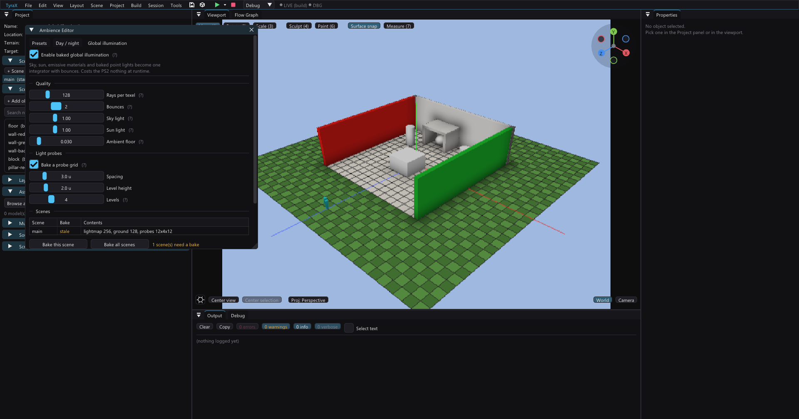

# Baked global illumination + light probes



Static geometry gets a baked multi-bounce lightmap. Everything that moves gets
its light from a probe grid. The PlayStation 2 pays **nothing** at run time for
either: the ray tracing happens on your desktop and ships as one texture and one
table.

Turn it on in *Tools > Ambience Editor*, on its **Global illumination** tab —
the same window the sky, the sun and the AO are authored in — press **Bake this
scene**, and build. Two example projects:
[global-illumination](../examples/global-illumination) is the one-room proof (a
red wall and a green wall, and nothing else coloured);
[gi-showcase](../examples/gi-showcase) is the guided walk with one station per
thing GI changes.

---

## What it actually changes

Before GI, a surface's light was `brightness * (ambient + diffuse * N·L)` plus
whatever analytic point lights and emissive materials reached it. The sun was
never shadowed, the sky was a backdrop, and light never bounced. With GI, one
hemisphere gather answers all of it at once:

| Source | Before | With GI |
| --- | --- | --- |
| **Sky** | a flat `ambient` constant | a real hemisphere light — the dome's authored colour *is* its radiance, remapped by the same zenith exponent the generated dome build uses |
| **Sun** | `N·L`, never occluded | `N·L` behind one shadow ray, so a wall casts |
| **Emissive materials** | an analytic box/sphere with a silhouette-disk penumbra hack | real area lights: the geometry answers the shadow directly |
| **Baked point lights** | the same linear-squared pool, unshadowed | the same pool, shadowed |
| **Bounce** | none | 2 passes by default — a red wall tints the floor beside it |

Visibility comes from a **triangle BVH over the whole scene**, not from analytic
boxes — so a cylinder casts a round shadow and an imported model casts its own
silhouette instead of its bounding box.

At the shipped defaults an open horizontal surface receives about **0.53** from
the sky, against the flat `ambient` **0.55** it replaces — switching GI on
re-lights a scene without re-exposing it.

---

## Why it fits in 1.33 MB of VRAM

GS VRAM is ~1.33 MB usable with no LRU — an all-or-nothing flush when the next
texture doesn't fit ([gs-vram.md](gs-vram.md)). The scene lightmap atlas is
256² RGBA32 = **256 KB**, already ~19% of the budget for one scene; a 512²
atlas would be 1 MB and leave the scene no texture budget at all. So the atlas
**cannot grow**, and every design decision follows from that:

- GI doesn't add a channel or a pass. It **replaces what the RGB channel
  means**: "baked emissive light" becomes "incoming light, all sources, all
  bounces", and emissive materials become one source among several instead of
  a special case.
- Occlusion stays in **A**, and is not made redundant: it still darkens the
  *dynamic* direct light (the flashlight, live point lights), which is not in
  the bake and never can be — and it is finer than the probe grid, so it keeps
  the contact detail probes cannot resolve.
- If a scene needs more lightmap resolution, the lever is the importance-weighted
  region sizing that already exists ([ambient-occlusion.md](ambient-occlusion.md)),
  not a bigger image.

---

## Which route each surface's light takes

**This is the correctness story.** A surface must declare its route, or the light
lands twice.

| Surface | Route | Where |
| --- | --- | --- |
| Static, untextured primitives already in the atlas | **per-texel lightmap**. Vertex shade goes black; the additive pass puts every photon back per pixel | `SCENE_AO_ATLAS_GI` + per-object `SCENE_AO_ATLAS_LIT`, read by `g_giLightmap` in `pushVert` |
| Untextured terrain | **per-texel lightmap**, same deal | `SCENE_AO_MAP_GI` |
| Imported models, textured receivers, batched props, physics bodies, spawn-pool clones, textured terrain | **probe grid**, sampled once per vertex at scene load | `g_giProbeShade` in `pushVert` / `shadeAt` |
| Animated models, the player, NPCs | **probe grid**, sampled once per frame at the model's centre | `updateAndRenderAnimObjects` |

**The editor viewport takes the same routes**, and has to: it shows what the
console will. `Viewport::setGiTerrain` feeds it the baked terrain map so the
ground goes down the lightmap route; `setGiProbes` covers everything else.
Putting the ground on the probe route instead isn't a small preview
inaccuracy — it paints the whole terrain one flat colour AND drops the ground's
own tint, because the terrain carries that tint in its vertex colour and the
probe answer replaces the vertex shade wholesale (PROGRESS 134).

In every GI case the ambient + directional term, the baked point lights and the
emissive pools are **skipped** — the baked answer already contains them.

**A textured surface never takes a lightmap.** A flat additive term over a
texture blows out its dark texels — the pre-existing rule for this atlas.
Probes are what makes obeying it cost nothing.

**Neither does anything that can move.** A lightmap glues the light to the
surface: tip a lightmapped cylinder over at runtime and it carries a contact
shadow that matches nothing. The bake excludes everything it can *prove* moves
through `project::objectRuntimeMovable` — the same predicate static batching and
the live catch areas use (physics, pickable, usable, save-state, streamed,
owning a flow graph, or named by one). Those objects take the probe path, where
the light is re-read from the grid every time the geometry is rebuilt, so they
relight as they move. *Properties > Baked lighting* is the manual override for
the channels no build-time scan can see: Live Link, a Raycast latch, a custom
node's object output.

---

## The probe grid

Irradiance at grid points, evaluated with the same integrator. **L1 spherical
harmonics**: 4 coefficients × 3 channels at one byte each = **12 bytes per
probe** plus one liveness byte. A 32×4×32 grid is 52 KB of EE RAM. L2 is not
worth 9 coefficients at this density.

Reconstruction — the same formula in all three copies (`gibake::sampleProbes` on
the host, `giProbeAt`/`giShade` in the generated game, `giProbe()` in the
viewport fragment shader):

```
shade(n) = L0 + (2/3) · dot(L1, n)
```

That is the exact clamped-cosine convolution for an L1 environment: a uniform
environment of radiance *L* gives `shade = L` for every normal, and a bright
upper hemisphere gives 1 looking up and 0 looking down.

The lookup is a **weighted** trilinear over the 8 surrounding probes. A probe
inside solid geometry is marked dead at bake time (most of its rays hit a back
face right next to the origin) and weighs **zero**, so a wall's black interior
never bleeds into the room next to it.

**The sun and the point lights are added analytically, not sampled.** A ray that
escapes comes back with the sky *dome's* colour, which carries no sun disc, and
a finite ray set cannot find a delta light anyway — so each is projected onto L1
by hand, behind one shadow ray. The least-squares fit of a clamped cosine over
the sphere is `max(0, n·s) ≈ 1/4 + 1/2 (n·s)`, and the reconstruction above is
`L0 + (2/3)(L1·n)`, so a light of strength *E* from direction *s* contributes
`0.25·E` to L0 and `0.75·E·s` to L1. At `n = s` that returns `0.75·E` against the
true `1.0·E` and lifts the back hemisphere by `0.25·E` — the inherent L1 trade,
and the reason a probe-lit character looks soft rather than hard-edged.

Skipping this isn't subtle and doesn't look like a bug: probes deliver only the
*bounce* of the sunlight around them, and characters read about 30% darker than
the lightmapped ground they stand on.

Animated meshes have exactly one VU1 light slot, so their per-frame sample is
split: **L0 goes into the ambient term**, and **L1 is reconstructed along the
sun direction** into that slot. A character walking from sunlight into a
doorway darkens *and* keeps directional shading, instead of going flat.

Grid extent follows the terrain; level 0 sits half a step above the lowest
ground in the grid, so a probe never starts buried in a hill.

---

## The bake is explicit, and cached

**Bake time is a feature. Press-a-button-and-watch is fine; part-of-the-build
is not** — a build that silently re-bakes lighting is a build nobody runs. So
the bake writes `.res-baked/gi/scene<N>.gi` and **codegen, texbake and the
viewport only ever READ it**:

- fresh cache → the scene ships GI;
- stale or missing → the whole scene falls back to the pre-GI emissive-only
  bake, *together*, and the Bake window says so per scene.

The signature hashes the scene (transforms, types, colours, materials, the
heightmap), the resolved lighting/sky/AO settings, the GI quality knobs, and
the **content** of every file the bake reads. "Resolved" is what makes a
[day/night cycle](day-night-cycle.md) work here: the cycle rewrites `lightDir`
and the sky colours before the bake sees them, so **each authored hour caches
separately** and moving the time-of-day slider correctly reads as stale rather
than silently shipping noon's bounce light at dusk. Content, not mtime: a bake
takes minutes and a `touch` (or a checkout, or a copy) must not throw it away —
and the example project ships its cache, which a fresh `git clone` would
otherwise invalidate the instant it landed on disk.

Run it from *Tools > Ambience Editor > Global illumination* (worker thread,
progress bar, cancel), or headlessly:

```bash
tyrax-editor --bake-gi <projectDir>
```

---

## Quality knobs

All on `ProjectSettings`, project-wide — deliberately **not** part of the
ambience-preset overlay: a preset changes what the light *looks like*, the bake
quality is a project decision.

| Setting | Default | What it does |
| --- | --- | --- |
| Rays per texel | 128 | hemisphere rays per lightmap texel and per probe |
| Bounces | 2 | interreflection passes. 0 = direct + sky only; 1 already bleeds |
| Sky light | 1.0 | the dome's strength as a light source |
| Sun light | 1.0 | the directional light's strength |
| Ambient floor | 0.03 | a constant added everywhere — real GI makes a sealed room pitch black, which reads as "broken" rather than "you forgot a lamp" |
| Probe spacing / level height / levels | 3.0 u / 2.0 u / 4 | the grid |

The reference scene (13 objects, a 32×32 terrain) bakes in about **10 seconds**
at those defaults.

---

## Determinism

Inherited from [matbake](material-baking.md), and load-bearing: the sample
spiral is rotated by a hash of a per-element seed (the texel's atlas
coordinate, the triangle's index, the probe's index) — never by shared RNG
state. Threads partition by element range. **The same inputs give bit-identical
bytes at any core count**, which is the only thing that makes an A/B comparison
possible at all.

---

## What this does not give you

Said out loud in the Bake window too, not just here:

- **Nothing is real time.** Moving a crate does not move its light until the
  next bake.
- **GI does not buy more dynamic lights.** VU1 still lights each mesh with one
  slot. The flashlight and live point lights are unchanged, and the baked
  occlusion still darkens them.
- **Textured surfaces and imported models are probe-lit, not lightmapped** —
  see the routing table. Imported models have no lightmap UVs; running
  `uvunwrap` at bake time to give them a real chart is the road not taken,
  because probes are much cheaper and cover the moving ones anyway.
- **The editor preview is probe-resolution.** It evaluates the same grid per
  fragment, so the colour and direction are exact — but the console's
  per-texel contact shadows on static geometry are sharper than what the
  viewport shows.

---

## Traps, for whoever touches this next

- **A lightmap texel's alpha must never be 0** (`aobake::kMinLightmapAlpha`).
  StaPip's alpha test discards alpha-0 texels and both passes sample the *same*
  texture, so a zero-occlusion texel takes the additive light pass down with
  it — and it looks exactly like "the lightmap is too low resolution". Dump the
  alpha channel before touching resolution, ever.
- **Keep the atlases RGBA32.** The engine's PNG path scales alpha by integer
  division into a CLUT; a palettized lightmap loses the gradient.
- **Under GI a region is kept even when its answer is black.** A dark corner is
  a *result*, not an absence — drop it and the corner falls back to the vertex
  path and comes out brighter than the lit wall beside it.
- **Chunk/part passes sharing one vertex buffer must share one `bboxVersion`.**
  The engine's package-bbox cache is keyed by the vertex pointer, so differing
  stamps make each pass recompute the boxes the previous one just built, every
  frame.
- **Every formula is a triplet**: host bake, generated game, viewport GLSL. GI
  adds several (the probe lookup, the L1 evaluation, the sky radiance). Write
  the twin comment at the same time as the formula, not after.
- **The `gi` flags travel with the pixels.** A cache whose pixels say "all the
  light is here" while the flag says otherwise renders the scene at double
  brightness. (A real bug during development — the flags were not serialized,
  and the first PS2 boot came out looking correct-but-flat.)
- **"Cast shadow" off does NOT remove an emissive surface from the bake.** That
  switch means "light passes through me" and is honoured for everything else,
  but an emitter *is* the light — there is no way to have one without the
  geometry. Dropping it produced exactly the symptom you would not connect: a
  plate that still glowed (the `Ke` floor is a vertex-colour term, independent
  of the bake) lighting absolutely nothing around it.
- **The signature ignores objects that contribute nothing** — markers, spawn
  points, the player, cameras, areas, decals, mirrors, portals. They cannot
  change what the bake produces, and hashing them only manufactures false
  staleness: nudging a spawn point would throw away a ten-minute bake and
  silently drop the scene back to classic lighting.
- **A lit VU1 bag lands in a different colour space depending on whether the
  part is textured.** `pushVert` builds an untextured surface in 0..255 and a
  textured one in 128 = 1.0 modulation, and the light colours handed to a lit
  bag must match: 128 for a textured part, 255 for an untextured one
  (`GeoPart::litScale`). The animated-model precedent is always textured, so
  copying its 128 makes every untextured object exactly half as bright as the
  same object baked — which reads as "the probe sample is too dark" and sends
  you looking in the wrong place entirely.
- **`StaPipVU1Cull_D` — the untextured lit program — never reads the colour
  bag.** Its whole output is `CalculateTyraDirectionalLights`, so
  `colorBag->single` cannot tint anything: the albedo has to be folded into the
  light colours before they reach the bag, exactly as the animated path does.
  (And `TYRA_ASSERT` is `((void)0)` in release, so the engine's "Multicolor is
  not supported with lighting" guard is not a safety net in a shipped build.)
- **A station outside the terrain is not a subtle mistake.** The walker clamps
  the player to the terrain bounds, so every spawn past the edge lands in the
  same place — which reads as "the camera is broken" rather than "you walked
  off the map". Cost three rebuilds while authoring `examples/gi-showcase`.

---

## Where the code lives

| Piece | File |
| --- | --- |
| Scene tessellation, integrator, bounces, probes, cache, the worker | `src/gibake.cpp/.hpp` |
| The BVH (shared with matbake) | `src/bvh.cpp/.hpp` |
| The lightmap seam (`aobake::LightFn`) | `src/aobake.cpp/.hpp` |
| Codegen: atlas flags + `inc/probe_data.gen.hpp` | `src/templates.cpp` (`aoDataHeader`, `probeDataHeader`) |
| Runtime: `giProbeAt` / `giShade` / `g_giLightmap` / `g_giProbeShade` | `src/templates.cpp` (game cpp template) |
| Baked pixels into `.res-baked/aoatlas`, `.res-baked/aomap` | `src/texbake.cpp` |
| Viewport twin (3D texture + `giProbe()`) | `src/viewport.cpp` |
| The Bake window | `src/app.cpp` (`drawGiBakeWindow`) |
