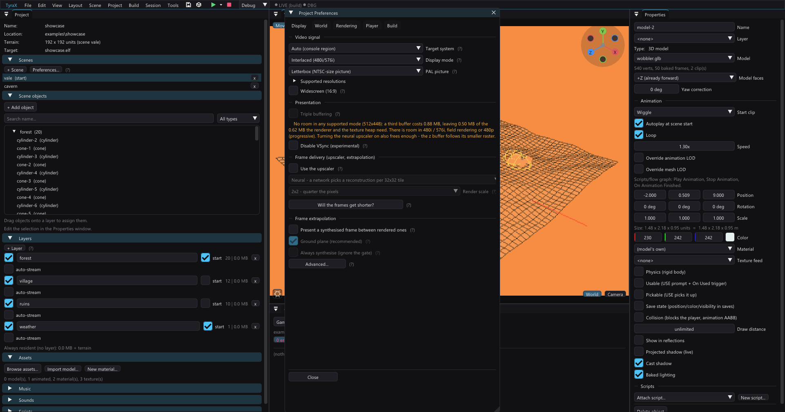

# GS VRAM residency



A developer note (not a user guide) on how the engine fork
(`vendor/tyra/engine/.../renderer/core/gs/renderer_core_gs_vram.*` and
`.../texture/renderer_core_texture.*`) hands out the PlayStation 2's 4 MB of
graphics memory, what the numbers actually are, and what happens when a scene
asks for more than fits.

## The budget

GS VRAM is 4 MB = 1 048 576 "words" (1 word = 4 bytes), and the allocator
counts in words. A project spends it like this — the two frame buffers are the
dominant term, which is why the colour depth below is the biggest single lever
anyone has over the texture budget:

| Region | Words (32bpp) | Words (16bpp) | Notes |
|---|---|---|---|
| Frame buffer × 2 (512×448) | 458 752 | 229 376 | halves again in the `InterlacedField` scan mode |
| Z buffer (512×448, always 32bpp) | 229 376 | 229 376 | |
| Post-fx scratch `lowVram[0..1]` | ~8 192 | ~4 096 | bloom/DoF blur chain; follows the frame format |
| Film-grain noise (always 32bpp) | 4 096 | 4 096 | uploaded, not rendered |
| Env-map target + its z (128×128) | 32 768 | 32 768 | **only if the project has a reflective `@sky` material** |
| Camera-feed target + its z (128×128) | 32 768 | 32 768 | **only if the project has a feed camera** |
| **Left for textures** | **~282 000 (1.08 MB)** | **~511 000 (1.95 MB)** | plus 65 536 more per unreserved target |

`Pal576i` costs ~380 KB more at 32bpp (three 512-line buffers); at 16bpp the
colour half of that comes back.

Measured on `examples/showcase` (4-bit textures), `VRAMSTAT`'s `freeMB`:

| Build | Free |
|---|---|
| before this work | 0.87 MB |
| exact sizing + neither optional target reserved | **1.15 MB** |
| ...and 16-bit colour | **2.04 MB** |

### What a texture costs

GS memory is **paged and swizzled**: a page is 2048 words (8 KB) and holds 32
blocks of 64 words, and the texels of one page are spread over those blocks in
a scrambled order. So a texture does not occupy `width * height` words — it
occupies every block up to the highest one its texels reach. `getSize()`
computes exactly that (whole pages once a texture is bigger than one, whole
blocks inside a single page). At 32bpp:

| Texture | Words | Of the 1.08 MB heap |
|---|---|---|
| 64×64 | 4 096 | 1.5% |
| 128×128 | 16 384 | 5.8% |
| 256×256 | 65 536 | 23% |
| 512×512 | 262 144 | 93% — one texture, basically the whole heap |
| Frame buffer × 2 (512×448, 32bpp) | 458 752 | halves in the `InterlacedField` scan mode |
| Z buffer (512×448, 32bpp) | 229 376 | sized from the **raster**, so the [neural upscaler](neural-upscaler.md) shrinks it to 57 344 at 2×2 |
| Post-fx scratch `lowVram[0..1]` + film-grain noise | ~12 288 | bloom/DoF blur chain |
| Env-map target + its z buffer (128×128) | 32 768 | reflective materials |
| Camera-feed target + its z buffer (128×128) | 32 768 | texture feeds |
| Baked-shadow atlas page (256×256 RGBA32) | 65 536 each | **23% per page**, one page per 16 shadows at the default detail ([shadows.md](shadows.md)) |
| **Left for textures** | **~282 000** | **≈ 1.08 MB** |

A **CLUT** is addressed by CBP in blocks, not pages: a 16-entry palette is one
block (64 words, 256 B) and a 256-entry one is four (256 words, 1 KB).

Palettizing is the single biggest lever after the colour depth:
*Preferences > Rendering > Textures* at 4-bit turns a 256×256 into ~1/8 of the
pixels plus a 64-byte CLUT (8 192 words instead of 65 536). It is why the
`showcase` example, which draws a whole village, never comes close to filling
VRAM.

> **This used to be a flat `+1024 * 2` words per allocation**, an upstream
> workaround carrying the comment *"without this hack, textures are
> overlapping ourselves"*. It was not derived from anything, and it was wrong
> in both directions: a 16-entry CLUT carrying 64 bytes of data was charged
> **8.25 KB** (so twenty palettized textures spent 160 KB of a 1 MB heap on
> palette padding alone), while an extreme aspect ratio was still
> UNDER-allocated — a 512×32 PSMCT16 strip spans 8 pages and reaches word
> 15 360, and was handed 10 240. The overlap the hack was named after was
> never fixed by it, only made less likely.

## Colour depth

*Preferences > Display > Colour depth* picks the frame buffers' pixel format
(`ProjectSettings::colorDepth`, `EngineOptions::colorDepth`):

- **32-bit** (`PSMCT32`) — the stock 8-8-8-8 buffer.
- **16-bit** (`PSMCT16`) — 5-5-5-1. Halves the two frame buffers and hands all
  of it to the texture heap, which roughly doubles. This is what makes the
  taller scan modes practical: 1080i at 32bpp leaves *less* texture VRAM than
  plain 480i does, and at 16bpp it leaves more than twice as much.

**The z buffer follows the colour depth, and it is not a choice.** On real
hardware a colour buffer and the z buffer it is depth-tested against must share
**page geometry**: 32- and 24-bit pages are 64×32 pixels, 16-bit pages are
64×64. A `PSMCT16` frame over a `PSMZ32` z is a pair the GS cannot address
consistently, and it shows as **banded depth errors across the whole scene** —
dark parallelogram bars over ground and walls, on a console, while PCSX2
(which addresses each buffer from its own PSM) renders it perfectly. So 16-bit
colour runs a `PSMZ16` z, which also hands back another 229 376 words.

The vertex path scales to match: packed `XYZF2` carries a **24-bit** Z field,
so a 32-bit z buffer is only ever filled to 24 bits and a 16-bit one needs the
scale dropped to 16 — sending 24-bit Z into a 16-bit buffer wraps, and models
read INSIDE-OUT (back faces winning the test). That range lives in exactly one
place now, `RendererCoreDepth`, which the StaPip and DynPip packet builders,
the depth-of-field solve and the generated portal mask all read; it used to be
five copies of `0xFFFFFF`.

**One more thing a 16-bit frame changes, and the engine undoes:** ps2sdk's
`draw_setup_environment` programs the GS's `FBA` ("alpha correction") to **1**
for a `PSMCT16`/`PSMCT16S` frame and 0 for a 32-bit one — read off
`libdraw.a`'s disassembly, the register at `0x4A + context` gets
`(psm & ~8) == 2`. With `FBA = 1` every alpha the GS writes has its MSB forced
to 1, which is harmless to a picture and fatal to anything that reads
destination alpha back — the flashlight's `TEST.DATE` shadow mask read *shadow*
over the whole raster and a 16-bit project drew no torch pool at all
([flashlight](flashlight.md), "The shadow"). `RendererCoreGS::
initDrawingEnvironment` writes `FBA = 0` straight after that call, so a 16-bit
frame follows the same alpha contract as a 32-bit one: alpha lands as written.

**The price of 16-bit colour is therefore depth precision**, and it is worth
stating in units. The world-space step at distance `d` is `d² / (maxZ × near)`
(`far` barely enters it):

| | d = 10 | d = 100 | d = 450 |
| --- | --- | --- | --- |
| 24-bit z, near 0.1 (32-bit colour) | 0.000 | 0.006 | 0.12 |
| 16-bit z, near 0.1 | 0.015 | **1.53** | **30.9** |
| 16-bit z, near 0.5 | 0.003 | 0.31 | 6.2 |
| 16-bit z, near 1.0 | 0.002 | 0.15 | 3.1 |

Measured on a console at `near` 0.1: the scene is band-free and correctly
sorted, and fine geometry at middle distance z-fights — `examples/night-walk`'s
procedural trees show a bright wedge across the crown where a tier's own cone
faces fight. Raising `near` buys that back linearly, but not freely: the
generated walker's `clipMargin` is `-(near + 0.15)` because it only guarantees
`playerRadius` 0.35 and `EYE_CLEARANCE` 0.2 of clearance, so a `near` past
~0.3 lets a wall the player leans on fall in front of the clip plane and open a
see-through hole. **16-bit colour therefore suits chunky geometry and a short
view distance**, and a project-declared near/far is the next step, not a
setting that exists today.

The cost of 16-bit colour is 32 levels per channel instead of 256, i.e.
banding in anything smooth — skies, fog, the post-fx blur. **GS ordered
dithering** (the `DTHE` + `DIMX` registers, *Preferences > Display > Dithering*,
on by default) trades that banding for fine noise a TV blurs away. The
hardware only dithers 16-bit destinations, so the switch does nothing at
32-bit. Measured on a `showcase` sky band (500×120 px of the captured frame):

| Build | Unique colours | High-frequency energy |
|---|---|---|
| 32-bit | 2 101 | 1.43 |
| 16-bit, dither off | 1 020 | 1.31 |
| 16-bit, dither on | 5 810 | 4.29 |

The middle row is the quantization showing up as exactly half the levels; the
last is the dither turning it back into detail, at the price of visible grain
up close.

The editor's viewport can show all of this before a build: **GS colour** in
the viewport gear (default *Match project*) quantizes the picture with the
same DIMX matrix — see [ps2-viewport.md](ps2-viewport.md).

> **Anything that writes a `FRAME` register for the screen must use the
> framebuffer's PSM**, not a hardcoded `GS_PSM_32`: the drawing environment,
> every post-fx blit, and the env-map / shadow-map brackets' restores. The
> post-fx work buffers are allocated in the frame format for the same reason;
> the film-grain noise texture stays PSMCT32 because it is uploaded rather
> than rendered (`RendererCorePostFx::psmFor` is what keeps those apart).
>
> **ps2sdk's `GS_SET_DIMX` cannot express the dither matrix.** Each DIMX entry
> is a 3-bit signed value (-4..3) and that macro masks the entries with `0x03`,
> so the negative half of the standard matrix (encoded 4..7) silently collapses
> to 0..3 and the dither comes out one-sided. `renderer_core_gs.cpp` packs the
> qword by hand.

## Optional render targets

Two 128×128 targets, each with its own z buffer, cost 128 KB apiece — a
quarter of the 32-bit texture heap between them — and used to be reserved for
every project whether or not anything read them:

- the **dynamic env map**, read only by a material whose `refl` is the `@sky`
  token (docs/reflective-materials.md);
- the **camera feed**, read only where a feed camera exists
  (docs/texture-feeds.md).

They are opt-in now (`EngineOptions::envMapTarget` / `camFeedTarget`,
`RendererCoreEnvMap::setEnabled`). The editor's codegen decides: it scans the
project's shipped `.mtl` / `.tmdl` / `.tskl` files for `@sky` and its scenes
for a feed camera (`projectNeedsEnvMap` / `projectNeedsCamFeed` in
`templates.cpp`). Looking at the files rather than the model is deliberate —
that token reaches the game through files it loads at run time, so a
hand-edited `.mtl` and a material only a spawn-pool prefab uses both count.

A disabled target owns no VRAM and `getTexture()` returns **nullptr**; the
generated game null-checks it and simply draws without the reflection pass. So
the failure mode of a detection miss is a missing reflection, never a sampled
address that belongs to something else.

The **projected shadow map** was already lazy in the same spirit — the game
calls `shadowMap.allocate()` only when a scene has "Cast shadow" objects.

## An allocation is whole BLOCKS, not pixels

`getSize()` used to count a texture's **pixels** plus a flat 2 048-word pad.
The GS does not store one that way: memory is paged *and* swizzled, so what an
allocation must cover is the highest **block** its texels reach — the last
page's index times 32 blocks, plus the block the swizzle puts that page's
bottom-right corner at.

For anything short and wide the pixel count is a wild under-estimate:

| texture | pixels (+ the 2 048-word pad) | really spanned |
|---|---|---|
| 256×256 PSMCT32 | 65 536 + 2 048 | 65 536 |
| 64×64 PSMCT32 | 4 096 + 2 048 | 4 096 |
| **512×16 PSMCT32** (the debug HUD font) | **10 240** | **15 872** |

A PSMCT32 page is 64×32 texels, so the 512×16 font is one page row of **eight**
pages — and the next texture was placed 10 240 words in, which is page 5 of the
font's own 8. It overwrote pages 5, 6 and 7: **every glyph from x = 320
rightwards**.

That is the bug behind *"opening the menu makes letters disappear"*. The HUD
read `V AM` because `R` sits at x = 480 and was the only glyph past x = 320 on
screen (`T`, at 496, was equally gone and simply not being drawn). The menu's
own font atlas is the allocation that lands on it — which is why a *menu
opening* triggers it, and why every scene that never opens one was fine.

Upstream's `// TODO: Without this hack, textures are overlapping ourselves`
sat on that 2 048-word pad. The pad was never the fix — it covers a width of
128 and nothing wider — and it was expensive at the other end of the scale, so
it is gone: the block arithmetic is a real bound, and a 16-entry CLUT costs
**one block** instead of 8.25 KB.

It changes **nothing** for the frame and z buffers — those are whole pages
already, and all five display modes come out identical either way. The debug
font grows 10 240 → 15 872 words, and almost everything else shrinks.

## Two regions

`RendererCoreGSVRam` splits VRAM in two:

- **The permanent region**, at the bottom, filled by `allocateBuffer()` during
  renderer init — both frame buffers, the z buffer, the post-fx scratch
  buffers, the noise texture, the env-map and camera-feed render targets. A
  plain bump region, never released; `free()` does not know those addresses,
  so nothing — including a buggy caller — can reclaim them.
- **The texture heap** above it, managed by a **coalescing free list**.
  `allocate()` takes a best-fit block; `free()` returns it in **any order** and
  merges it with its neighbours.

Two things move the floor between them, and both work the same way — evict every
texture, `vram.reset()`, re-run the allocation sequence:

- a **display-mode switch** (`RendererCore::setDisplayOutput`), which re-runs the
  whole init including the video mode;
- **`blss.configure()`** turning the [neural upscaler](neural-upscaler.md) on,
  through `RendererCore::rebuildPermanentBuffers()` — the same branch minus the
  mode. The z buffer is sized from the raster and the raster scale is not known
  until `configure()` runs, which is *after* z was allocated. Generated games
  call it at the top of `init()`, before `buildScene()` loads a single asset, so
  the eviction has nothing to evict and the "permanent buffers before any
  texture" rule below still holds. **A new caller of it later in a frame would
  break that rule**, which is why the hook is gated on
  `RendererCoreGS::needsBufferRealloc()` and fires at most once.

  **A game whose SCENES disagree about the upscaler pins the layout instead**
  (per-scene BLSS, docs/neural-upscaler.md). `RendererCoreGS::setZRasterScale`
  fixes what the z buffer is sized for independently of the raster scale the
  projection is currently using, so a project with some scenes upscaled and some
  native sizes z for the FULL display once, at init, and `needsBufferRealloc()`
  stays false for the rest of the run. That is what makes a per-scene switch
  cost no eviction: it never asks for this branch at all. The price is the
  z-buffer saving — such a project keeps the low-res colour target resident
  through its native scenes (0.25 MB at 512x512) instead of trading it for a
  smaller z (0.75 MB).

VRAM-*resident* textures — the dynamic env map and the camera feed, whose
pixels are rendered into GS memory rather than uploaded — bind their own
`texbuffer_t` (`Texture::vramResident`) and never enter the heap or the
residency list at all.

## Why the free list exists (the bug it fixes)

Upstream's `free()` was one line:

```cpp
void RendererCoreGSVRam::free(const int& address) { pointer = address; }
```

a stack pop. Freeing the *newest* allocation is correct; freeing anything else
rewinds the bump pointer **underneath still-live textures**, and the next
allocation is handed memory that other textures are rendering from.

Streaming layers hit it on every unload. A fixture with six textured boxes,
three of them in a layer that unloads at t=6 s and loads again at t=10 s,
showed on the old allocator:

```
free 821248, free 839680, free 858112   (newest live allocation: 931840)
freeMB 0.406 -> 0.727   (pointer rewound below three live textures)
freeMB 0.727 -> 0.516   (reload allocated straight over them)
```

and on screen two surviving boxes started drawing a different box's texture.
With the free list the same fixture round-trips exactly — `0.406 -> 0.617 ->
0.406`, largest free block unchanged at 416 KB — and the picture after the
reload is identical to the picture before the unload.

## Eviction policy

When an incoming texture does not fit, upstream deallocated **every** resident
texture and started over — one over-budget texture cost a full re-upload of
the entire working set on the following frames.

`RendererCoreTexture::makeRoomFor()` instead evicts one allocation at a time
until the newcomer fits, choosing the victim in two tiers (`pickVictim()`):

1. **Stale entries** — not bound in this frame *or* the one before it. Coldest
   first (lowest bind sequence), ties broken by the larger allocation. These
   are textures that went off-screen or belong to a layer that was streamed
   out — always the cheapest thing to give up.
2. **Everything is in the live working set** — what the scene draws genuinely
   does not fit. Here LRU is the *worst* policy: a scene re-binds its textures
   in the same order every frame, so the coldest entry is precisely the one
   that will be requested first next frame, and the whole set cycles. The
   victim is the **most recently bound** allocation instead (scan-resistant
   MRU): the head of the scan stays resident and only the overflow tail keeps
   re-uploading.

The two-frame window in tier 1 is deliberate. "Not bound yet in this frame" is
not evidence of coldness — the tail of last frame's scan simply has not come
round again, and evicting it is a guaranteed miss milliseconds later.

Fragmentation is the risk a bump pointer trades away. Best-fit plus coalescing
keeps it small in practice (the streaming fixture above returns to a single
416 KB block), and when a request cannot be served despite enough *total* free
space, the eviction loop keeps going — worst case it empties the heap, which is
exactly the old behaviour, so the failure mode degrades rather than breaks.

## Reading it without a debug log

The debug HUD's `VRAM 3.21/4 MB` line, directly under `MEM` (*Preferences >
Build > Show memory usage*), answers "how much of the 4 MB is gone". It is
phrased as used-over-total so it reads the same way round as the line above it.

**`MEM` and `VRAM` are different pools, and only one of them moves with the
display mode.** Reported as *"I keep switching display modes and the editor
shows the same memory usage the whole time — shouldn't it drop when I go from
HD to 480p?"* `MEM` is the EE's 32 MB of main memory; a display mode never
touches it. The frame and z buffers live in the GS' separate 4 MB, and that is
the pool a taller mode eats. Measured on the same fixture, changing only
`displayMode`:

| mode | buffers + z | free for textures |
|---|---|---|
| 1080i (448×540) | 3.21 MB | **0.79 MB** |
| 480p (448×448) | 2.76 MB | **1.24 MB** |

0.45 MB between them — 448×92 px × 4 B × three buffers (two display + z), minus
page alignment. **HD costs about a third of the texture budget**, and on a
scene with almost nothing in it the reading is still ~3 MB: what fills VRAM
first is the framebuffers, not the scene.

## Measuring it

`RendererCoreVRamStats` counts binds / hits / uploads / re-uploads / evictions
and the free-VRAM low-water mark. `RendererCoreTexture::traceFrame()` (called
from `RendererCore::endFrame`) prints a `VRAMSTAT` line to the game's
`bin/log.txt` on every frame that evicted something, plus a summary every 120
frames:

```
VRAMSTAT f=1440 bind=27280 (+2520) hit=27273 (+2520) up=7 (+0) reup=0 (+0)
         evict=0 (+0) runs=0 res=6 peak=6 oofree=0
         freeMB=1.15381 minFreeMB=1.15381 largestKB=1181
```

- `(+n)` are deltas since the previous line.
- `up` / `reup` — texture uploads, and how many of those were re-sending a
  texture that had been evicted. **`reup` per frame is the number that
  matters**: each one is a PATH3 transfer of the whole texture.
- `evict` / `runs` — allocations dropped, and how many `makeRoomFor()` calls
  had to drop anything.
- `res` / `peak` — allocations resident now / high-water mark.
- `oofree` — frees of something that was not the newest allocation. Harmless
  now; on the old allocator every one of these was a corruption.
- `largestKB` — largest single free block, i.e. the fragmentation read-out.

The counters are always compiled (a few integer increments per bind); only the
logging is debug-only, since `TYRA_LOG` compiles away under `NDEBUG`. Use a
**debug** build profile to see it.

### The residency census: WHICH textures, not how many

Those counters raise a question they cannot answer. "12.17 re-uploads per frame"
says a scene is thrashing; it does not say what is cycling, how big it is, or
what is holding the rest of the heap — and none of that can be guessed from an
asset list, because only a fraction of what a project ships is bound in any one
view. **It does not even say whether the reading is real**: the 12.17 that
started this investigation turned out to be a stale fixture (see below), and a
census would have said so in one line by naming a texture nobody expected to be
cycling. So the same 120-frame summary also prints **one line per resident
allocation, by name and by words**, plus the eviction victims since the last
summary and what each was given up for:

```
VRAMRES f=840 i=21 words=65536 kb=256 name=veh-tristarplay01-palette-image-0.png
VRAMRES f=840 i=11 words=1088 kb=4 name=concrete.png
VRAMEVICT f=5400 words=16384 kb=64 victim=icons.png for=district-pause.png
```

Victims are printed with the summary rather than on every eviction frame: a
thrashing scene evicts every frame, so the per-frame form is four lines a frame
forever and the counters already carry the rate. **The victim list is cleared
when it is printed, never per frame** — clearing per frame made the instrument
miss the one event it was built for, a pause menu that evicted eight allocations
between two summaries and was reported as nothing at all. A rare eviction is
exactly the interesting one.

It is **debug-only and costs a release build nothing**, and the way it does that
is worth copying: the id → name map and the victim list live in an anonymous
namespace inside `renderer_core_texture.cpp` under `#ifndef NDEBUG`, so no
header gains a field and the struct layouts are identical in both profiles. A
debug-only member on `RendererCoreTexture` would be an ODR hazard the moment one
translation unit disagreed about `NDEBUG`.

### What the Motor District garage is made of

Measured on `examples/vehicle-playground` (PCSX2 software renderer, PAL
`Pal576i` 512×512, 32-bit colour, debug profile, parked benchmark poses). The
permanent region first, and note that **three quarters of the 4 MB is gone
before a single texture is loaded** — the `~1.08 MB` the budget table at the top
of this page quotes is the 512×448 case, and this project is not it:

| region | words | of 4 MB |
|---|---:|---:|
| frame buffers ×2 (512×512 PSMCT32) | 524 288 | 50% |
| z buffer (512×512 PSMZ32) | 262 144 | 25% |
| post-fx scratch ×2 + film-grain noise | 12 288 | 1.2% |
| env-map target + its z (three shiny car bodies) | 32 768 | 3.1% |
| projected-shadow slots ×4 + z (64×64) | 20 480 | 2.0% |
| **texture heap** | **196 608** | **18.8%** |

and the heap itself, 27 allocations holding **165 440 words (0.631 MB, 84% of
it)**, largest free block 121 KB:

| allocation | words | of the heap |
|---|---:|---:|
| `veh-tristarplay01-palette-image-0.png` (256×256 **RGBA32**) | 65 536 | **33.3%** |
| `veh-ggbotrally0001-palette-image-0.png` (128×128 RGBA32) | 16 384 | 8.3% |
| `loading.png`, `icons.png`, `flare-corona.png` (HUD, RGBA32) | 16 384 each | 8.3% each |
| `district-sign.png` (256×128 PSMT4 + CLUT) | 4 160 | 2.1% |
| `use-text.png`, `flare-glow.png` | 4 096 each | 2.1% each |
| `district-road`, `district-asphalt` (128×128 PSMT4) | 2 112 each | 1.1% each |
| the **whole city** — 14 urban 64×64 PSMT4 + the terrain | 15 232 | 7.7% |

Read the last two rows together. Every building, tree, wall, roof and sign in
the district costs **15 232 words**; one car's body texture costs **65 536**.
The three vehicle textures are 83 392 words — **half the working set and 42% of
the heap** — and they are the only shipped model textures that do not go through
texbake's quantizer at all (`vehbake` writes them into a directory texbake's
sweep skips, [vehicles.md](vehicles.md)), so a project set to 4-bit ships a
32-bit car. That is a real bug and it is **not** a free win to fix: palettizing
them buys 280 KB of heap this scene does not currently need, and costs GS time
it does. See [backlog.md](backlog.md).

Two smaller observations from the same census, neither a bug: `loading.png`
stays resident for the whole run (nothing needs its 64 KB back, so tier 1 never
picks it), and the HUD sprites together are 57 344 words — more than the city —
because `res/hud/` is deliberately never palettized.

**Nothing is allocated per frame.** Over 4 440 frames and four poses the whole
run performed **28 uploads and zero re-uploads**, so "something transient that
should be resident" is ruled out with a number rather than an argument. The
eviction policy is not at fault either: with nothing evicted there is nothing
for a policy to get wrong. This scene is not thrashing — it is standing next to
a cliff.

### The 12.17 re-uploads were a stale fixture

Worth its own heading, because the instrument above exists partly because of it.
The reading that started this — 12.17 re-uploads per frame in garage day, 5.75
in garage night — came from a fixture built by `benchmark-district.py`, which
copies the example's **committed** generated sources. Those drift. Every fixture
since regenerated with the editor under test records **0.000 re-uploads and 0
evictions in all four poses**, and the stale one also showed 3.6 ms more
submission than the regenerated one.

**A performance fixture built from committed generated sources is measuring a
different game.** Regenerate before you measure, and before you believe a
counter that disagrees with the last run. `docs/vu1-and-dma-cache-cost.md` says
this too, and the script's own docstring now says it where somebody would
actually look.

### It is a cliff, and an ordinary menu walks off it

Parked, this scene does not thrash: 0.119 MB free, zero evictions, for as long
as you leave it alone — 4 440 frames of it. **Pressing Start does.** The pause
menu binds `menus/district-pause.png` (32 768 words) and its values page (8 192)
against 31 168 words of free heap, and the reading goes straight to the shape
the console reported:

| | free | largest free block | evict | reup |
|---|---:|---:|---:|---:|
| garage, parked | 0.119 MB | 121 KB | 0 | 0 |
| garage, pause menu open | **0.0483 MB** | **25 KB** | 8 | 3 |
| *(physical PS2, as reported)* | *0.048 MB* | *33 KB* | *+4/frame* | *+4/frame* |

The free-VRAM figure matches the console's reported `freeMB=0.048` to the digit.
The console reading itself came from a stale fixture (above) and its
re-uploads-per-frame are not a real measurement — but the **cliff** is real and
this is where it is. A scene sitting 4% of VRAM from its ceiling is one where
which sprite happens to be on screen decides whether the frame costs four PATH3
transfers, and the answer there is headroom rather than a cleverer victim.

One honest caveat on the emulator. PCSX2's residency accounting is the engine's
own (the allocator and the counters are the same code), so these numbers are not
an emulation of anything — but the console's exact working set at the moment it
was sampled is not knowable from here, and this run reaches 0.048 MB with `res`
26 against the console's 17. Same free VRAM, a different mix of survivors: read
the free/largest columns as the reproduced quantity and the counts as
circumstantial.

### Where the next 200 KB would come from, if it is ever needed

Three levers, in order of how cheap they are, and all three are **authoring**
decisions rather than engine ones:

- **`res/hud/` is never palettized** (57 344 words resident here, and
  `hud/save-busy.png` alone is another 65 536 the moment a save runs). That is
  deliberate — smooth alpha gradients are what palettes are worst at, and the
  flashlight's corona would band. But `icons.png` and `loading.png` are flat
  artwork, and a per-file override in the *Texture quality* map already exists.
- **`menus/` follows its stylesheet's own `quant`**, which defaults to none. The
  district's pause menu is 40 960 words at 32-bit against 5 248 at 4-bit. This is
  the single cheapest change available and it is one line of a stylesheet.
- **`palFullHeight`** costs **98 304 words (384 KB) of texture heap** against
  plain PAL 512×448 — half the heap again, for 64 more scan lines. And 16-bit
  colour would hand back 458 752 words, which would end this conversation
  permanently at the price of the depth precision the colour-depth section
  above prices in world units.

## Measured behaviour

All PCSX2, software renderer, PAL, 512×448.

These are the eviction-policy numbers, measured when the free list replaced the
bump allocator; the heap was ~0.87 MB free on `showcase` at the time (it is
1.15 MB now — see the budget section).

| Scene | re-uploads/frame before | after |
|---|---|---|
| `examples/showcase` (4-bit palettized, 6 allocations) | 0 | 0 |
| 3×256² + 3×128² 32bpp, just over budget | 9–10 | **3** |
| 6×256² 32bpp, ~2.4× over budget | 10 | 8 |

The showcase numbers are byte-identical before and after — a realistic project
never evicts anything, so this work changes nothing for it. The interesting
column is the middle one: a scene *slightly* over budget used to pay as if it
were massively over budget, and now pays roughly what it overspends. A scene
genuinely 2.4× over budget still thrashes, because no policy can invent VRAM —
the answer there is palettized textures, an atlas, or smaller source images.

Frame cost on the just-over-budget fixture (vsync off, so the 50 Hz cap does
not hide it): 5.51 → 5.33 ms of EE time per frame, and PCSX2's GS thread load
dropped 39% → 23% — that thread is where emulated PATH3 transfers land, so it
is the closest proxy available for what the transfers cost a real console.

## Rules for engine work

- Anything allocated with `allocateBuffer()` is permanent. Allocate it during
  init, before any texture, and re-allocate it after `vram.reset()` if the
  display layout changes.
- Never add a texture to the residency list that must not be evicted — use
  `Texture::vramResident` with your own `texbuffer_t` instead (see
  `RendererCoreEnvMap`).
- `free()` ignores addresses it did not hand out. That is the guard rail for
  the permanent region; do not "fix" it into an assert.
- If you add a new permanent buffer, update the budget table above — it is
  ~1.08 MB of texture heap at 32-bit colour and every 128×128 target is 3% of
  it. And ask whether it can be **opt-in**: two of the existing ones now are,
  and between them that was a quarter of the heap for projects that read
  neither.
- A new buffer that holds screen-shaped pixels should take
  `settings->getFrameBufferPsm()`, not `GS_PSM_32` — see the colour-depth
  section. One that is uploaded rather than rendered into (a lookup texture,
  noise) stays whatever format its data is in.
- `getSize()` is the only place that knows the GS storage layout. If you add a
  pixel format to it, give it a page geometry AND a block order, or leave the
  order null and let it round to whole pages (which is what the Z formats do —
  their block orders are permuted variants for which the corner rule the
  sub-page path relies on does not hold).
- The editor keeps a **host-side mirror** of this arithmetic in
  `menulayout.cpp` (`gsWords`) for the Menu Editor's "does it fit" check. It
  and `getSize()` must agree, or the editor reports menus as too big when they
  fit.
