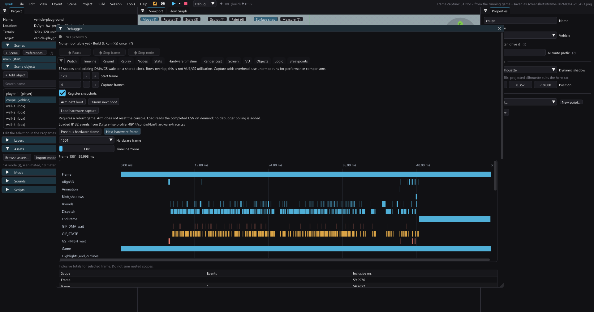

# Physical PS2 hardware timeline

The hardware profiler records bounded EE scopes and pipeline-state observations
in RAM, then exports an interactive timeline and Perfetto-compatible JSON.
It measures the ordinary asynchronous renderer without adding per-draw drains.

[Seven physical PS2 controls and measured overhead](hardware-profiler-results.md)
record the first full-asset Motor District diagnosis.

## In the editor (1.92+)



Open **Debugger > Hardware timeline** (F9). Set the first engine frame, capture
length (1–32) and optional register snapshots, then **Arm next boot**. This writes
`bin/hardware-trace.cfg`; it does not reset or interrupt the running console.
Build the game before arming. After the capture finishes, **Load hardware capture**
reads `bin/hardware-trace.csv` on demand. The previous file stays available until
the game replaces it; arming is not evidence of a new capture.

Select a frame and zoom horizontally (1–16x). Hover blue EE scopes, red waits or
orange register markers for duration, relative start and raw values. Scroll the
chart in either direction; expand or undock the Debugger for a wider view. The
inclusive table contains overlapping scopes, not additive hardware utilization.
The native viewer requires neither Python nor a browser, adds no polling and
rejects incomplete, overflowing or inconsistent captures. HTML/Perfetto export
still uses the same CSV and remains available with the command below.

Detailed engine lanes include `Package_create` (metadata and classification),
`Package_classify` (nested inside creation), `QBuffer_copy` (including pooled
allocation bookkeeping), and `Packet_build` (commands, excluding send/wait).
Generated debug games also expose `Live_debug`, with nested
`Live_debug_poll` and `Live_debug_flush` scopes when those synchronous host-file
operations actually run. These are the first place to look when an otherwise
fast physical-console frame periodically doubles.
Vehicle projects split `Vehicles_update`, `Vehicle_smoke_update` and
`Vehicle_skids_update`; `Vehicle_sleep` is nested once for every parked instance
that skipped its static physics work in that frame.
These extra hooks have measurable capture overhead; do not rank optimizations
using their short armed captures alone.

## Capture

Build a game with this engine and refreshed generated sources. Deploy all baked
resources, keep one ps2client host server alive, and use the usual ps2link marker.
Before the next boot:

```sh
python tools/hardware-trace.py arm /path/to/project --start 120 --frames 4
```

The engine reads `bin/hardware-trace.cfg` once after game initialization. Start
is a zero-based engine-loop index, including loading/splash loops, not a scene
frame number. Choose a warmed window after loading. Capture length is 1–32
frames; 32,768 event slots occupy 640 KiB on EE, allocated only when armed and
freed after export. A missing or invalid configuration disables capture. There
is no continuous host-file polling. The game keeps playing after capture.

The completed file is `bin/hardware-trace.csv`. Archive old files before a new
boot and verify fresh output; an earlier CSV is not evidence of a new capture.
Export only after the final END footer arrives:

```sh
python tools/hardware-trace.py export /path/to/project/bin/hardware-trace.csv -o /path/to/report
python tools/hardware-trace.py disarm /path/to/project
```

Export produces `report.html`, `report.json` (Perfetto/Chrome trace format), and
`report.summary.json`. Open HTML locally to select frames and hover over events.
The exporter rejects incomplete, overflowed and inconsistent captures. On
overflow reduce the requested frames. Disarm affects the next boot.

## Read the graph correctly

- Frame encloses the main EE loop, including pad, game and info. Game/Scene,
  static bags, dispatch and wait scopes nest: never add their inclusive totals.
- Scene phases and object IDs reuse the render-cost labels, but do not insert
  that tool's GS barriers. Do not request a serialized render-cost capture,
  screenshot or VU memory capture during hardware sampling.
- `Roads` is the per-frame cull/submission of road and junction bags that were
  generated once at scene load. `Procedural` excludes those reserved road
  chunks and covers only procedural volumes and prefab geometry. Generation is
  therefore not recurring, but submitting visible ready bags still is.
- VIF1_DMA_wait measures EE waiting for DMA consumption, not VU1 arithmetic.
  VIF1 snapshots show VPS and VEW at observed boundaries only. GIF_STATE shows
  active path and FIFO occupancy at those instants; it is not GS utilization.
- GS_FINISH_wait measures existing completion handshakes and can include queued
  upstream work. No new FINISH is inserted. Present includes buffer-flip waits.
- Packet_qwords is a submitted static-chain size, not total vertex/texture bytes
  referenced through DMA tags. No unmeasured transfer-byte total is inferred.
- COP0 Count timestamps use 294,912 ticks/ms. Scopes measure elapsed EE time,
  including preemption; they are not retired CPU instruction counts.

Record an unarmed control, an armed capture and a repeat. `--no-states` disables
register snapshots while retaining scopes for overhead diagnosis. Active scope
recording and register reads perturb timing; export itself occurs after the
window and must be excluded from FPS comparisons. Short traces locate work,
while longer warmed controls establish performance.

## Engine API

`debug/hardware_trace.hpp` exposes `Scope`, `record` and `state`. Labels must have
static lifetime; storage retains their pointers until export. The recorder is
for the main EE thread only. Scope destructors handle early returns. When
unarmed, hooks check the active flag without reading clocks or hardware state.
The engine owns configure/beginFrame/endFrame, so early game-loop returns still
close a complete frame. This first version uses a boot capture configuration,
not a live Debugger UI command or a hardware utilization percentage display.

Pair traces with isolated raster, shader, extra-pass and debug-I/O controls.
Changes to visible content are diagnostic substitutions, not proposed quality
settings. Verify actual GS captures and geometry counters before interpreting
their sensitivity as a bottleneck diagnosis.

For two reproducible engine probes, use an already-built fixed-workload project:

```sh
python tools/hardware-probe.py FIXTURE vendor/tyra NEW_DIRECTORY --kind one-pixel-scissor
python tools/hardware-probe.py FIXTURE vendor/tyra ANOTHER_DIRECTORY --kind unlit
```

Each command copies the game and engine, records resource hashes and patched
files in `probe.json`, and refuses an existing destination. Build its `game`
with native-build and its `tyra` as the engine source. The one-pixel probe masks
engine scissor writes, including render-target restores, while retaining the
original geometry, projection and VU programs. It suppresses raster area; it
does not remove primitive setup or all GS work. Verify its nearly empty GS
capture and matching geometry counts. Unlit removes lighting and normal data
from static bags, restoring the caller's pointer afterward; this changes
program class, data transfer and possibly package capacity, so it cannot
isolate VU arithmetic alone. Both are destructive to image quality by design
and must remain isolated diagnostics, never production engine patches.
