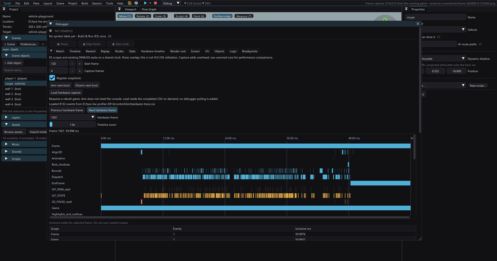

# Physical PS2 hardware timeline

The hardware profiler records bounded EE scopes and pipeline-state observations
in RAM, then exports an interactive timeline and Perfetto-compatible JSON.
It measures the ordinary asynchronous renderer without adding per-draw drains.

## Hierarchy and observer controls (1.170)

Coarse capture records the main loop, pad/game/info, refreshed generated
Update/Scene scopes, frame submission, existing completion waits and presentation
pacing. Detailed capture adds package, snapshot/preflight/fixup/mutable-copy,
native sizing/emission and other fine scopes. Register snapshots are a separate
option. Refresh generated game sources when upgrading: Update now reserves its
parent scope before nested work and closes explicitly before rendering.

The editor retains its five-column `hardware-trace.csv`. The separate
`hardware-trace-v2.csv` and `hardware-trace-v2-<first>.csv` provide explicit scope
parents, typed intervals and actual recording/presentation source jobs:

```sh
python tools/hardware-trace.py arm PROJECT --start 1100 --frames 4 --no-states
python tools/hardware-trace.py arm PROJECT --start 1100 --frames 2 --detailed --no-states
python tools/hardware-trace.py export PROJECT/bin/hardware-trace-v2.csv -o REPORT
```

`--capacity` selects 128..32768 slots (default8192). Event density depends on
scene and detail mode. The first Motor District emulator calibration overflowed
8192 slots during a32-frame detailed window; its result is rejected. The revised
private fixture captures8 frames with32768 retained slots. Capacity and timing
still require physical acceptance; shorten the window on overflow. Export
occurs after capture, but its host I/O can delay the enclosing/following loop.

V2 analysis partitions elapsed frame intervals once into authoritative scope
self-time, existing waits, pacing and uncovered time. Inclusive totals remain
separate. Raw compatibility spans have unknown parents and remain inclusive-only;
they cannot silently enter the exclusive ledger. COP0 spans include preemption
and any unclassified waiting: self-time is not useful CPU instructions or VU/GS
utilization. `present_job` identifies the CPU presentation source, not an ISR
display latch or TV photons. Pending jobs from before a capture are explicitly
unknown. Requested mode differs from effective recording after fallback.

Define `TYRA_HARDWARE_TRACE=0` consistently in engine and game to compile out
trace APIs: inline no-ops and constant false gates remove trace clocks, file
access, allocation, state reads and implementation calls. The default is1 to
retain the existing opt-in boot feature; a missing config still leaves compiled
guards. Runtime-off and compiled-out controls therefore answer different
questions. Never label the default build zero-overhead.

The private calibration compares Off/coarse/Off/detail/Off/detail+states/Off
with the same ELF and a ring reserved before all phases. Common independent
clock samples measure the full engine loop plus game/render work. Of8 samples,
the last includes automatic export and is excluded in every arm, leaving7.
Small single-boot windows are exploratory; repeat boots and compare both adjacent
controls. The independent sampler/FrameProfile also cost work. A separate
compiled-out ELF changes code layout and held heap, so its difference is not
pure dispatch cost. Wall time includes pacing; unchanged wall time does not
establish free instrumentation. Do not subtract one universal overhead constant.

`hardware-trace.py controls MANIFEST.json -o REPORT.json` checks repeated explicit
A/B/A controls with matching scene/camera/replay/clock/order/window identities,
one instrumented ELF and declared separate compiled-out layout. See
[host analysis protocol](../tools/hardware-trace-analysis.md) and the
[validation record](hardware-timeline-v2-2026-10-02.json). Physical observer cost
requires repeated valid matched controls on PS2.

The first instrumented physical calibration completes 15,400 frames and all
seven arms. Coarse/detail/detail-with-states captures pass strict export with
104/19,685/23,064 events, each 8 frames, no drops, invalid entries or ambiguities.
Independent FrameProfile work means are 17.697577/17.913900/17.702240/20.898795/
17.775104/21.412268/17.798146 ms for Off/Coarse/Off/Detailed/Off/States/Off.
Against both adjacent controls, observed work increases are 0.211660–0.216324 ms
coarse, 3.123690–3.196555 ms detailed and 3.614122–3.637163 ms detailed with states.
The whole-engine mean remains around 33.36 ms: added work mostly consumes pacing
headroom, and detail activation changes individual frame pacing. Unchanged FPS
therefore does not establish zero observer cost. Seven accepted samples per arm
in one boot remain exploratory; repeated matched runs are open.
States-minus-detail is not an isolated register-read
cost, and none of these ranges is a constant correction for production timing.

The separate compiled-out physical ELF also completes 15,400 frames, with
56 valid samples and 49 accepted. No trace file or recording is generated.
Work means at matching phase offsets 0/2/4/6 are
16.796231/16.815342/16.848844/16.831848 ms. The preceding instrumented ELF's
runtime-off means are 0.886898–0.966298 ms higher; whole-engine wall remains
around 33.36 ms in both runs. This compares complete configurations: inactive
hooks, code layout, a retained 32,768-event ring versus no ring, and independent
boot order. It does not isolate the cost of flag checks. Alternating boot
repeats remain required before assigning a stable configuration cost.

An identical instrumented-ELF repeat completes another 15,400 frames and passes
all raw controls and three strict captures (104/19,688/23,064 events, no drops or
invalid entries). In Instrumented/Compiled-out/Identical-instrumented boot order,
matching runtime-off work is 0.901345/0.886898/0.926261/0.966298 ms above the middle
boot in the first run and 0.928505/0.915934/0.922133/0.930526 ms above it in the
repeat. The two instrumented control means differ by only 0.004128–0.035772 ms.
This supports a repeatable combined configuration difference, not an isolated
inactive-hook bill. The middle compiled-out boot is still single; the retained
ring is allocated before scene assets and can change their memory placement.
Next isolate ring reservation using the same ELF and separate boot configuration,
with capture disabled in every arm and matching independent sample windows.

The [private ring-only control](hardware-timeline-ring-control-2026-10-02.json)
is built and passes both explicit boot settings in the emulator: one identical
instrumented ELF, reservation 0 or 1 before assets, three 1,800-frame blocks and
128 independent samples per block. Trace remains inactive and never exports.
Configuration parsing, geometry-address inspection and state digests occur
outside sampled windows. Both runs provide all 384 whole-engine/work samples;
declared state digests match within and between modes. Real physics dt remains
live, so this is not full vehicle-state or pixel equivalence. Final screenshots
look normal but differ in HUD speed; emulator timings are structural validation
only. The physical fresh-boot 0/1/0 results are recorded below. This probe
isolates a reservation configuration in one ELF, not compiler-pruned hook cost.

The first physical no-reservation boot also passes: 5,400 frames, all 384
independent samples, six matching state controls and valid accessible-address
provenance, with no trace recording or exports. Phase work means are
17.556390/17.664239/17.682027 ms and whole-engine means remain about 33.366 ms.
This first boot is a baseline only; the completed bracket follows below.
Older binaries cannot substitute for same-ELF reservation controls.

The complete same-ELF physical reservation 0/1/0 bracket now passes all three
5,400-frame boots and 384 samples per boot. Reserved-ring work means are
17.486194/17.588678/17.580696 ms; return no-ring means are
17.555806/17.658048/17.662766 ms. The reserved boot is 0.069370–0.101331 ms lower
than both matching controls, whose spreads are 0.000584–0.019261 ms. Declared
state fields and accessible vector/selected-part sizes and capacities match;
all 45 observed addresses move with the ring and restore in the return boot.
This is one bracket under this executable layout, with live physics and partial
state/address coverage. It does not establish a general ring cost or isolate
inactive hook dispatch, and its effect cannot be subtracted from an older
different ELF's configuration gap. The reserved boot's original cfg bytes were
overwritten after completion before archival: launch/runtime records establish
mode1/reserved1, but no original cfg byte hash is claimed. The return cfg was
archived explicitly before launch. The selected inactive dispatch controls
below retain the ring while testing routing separately.

### Inactive dispatch: state and phase controls

A private same-ELF selector bypasses selected inactive diagnostic callers and
metadata paths while retaining the ring, trace lifecycle counters, sampler,
profiling and real renderer operations. Its result is net routing performance,
including existing waits, rather than a pure function-call bill or a
compiler-pruned equivalent.

The [live-dt controls](hardware-timeline-dispatch-control-2026-10-02.json)
retain both rejected normal/bypass/normal boots: the first phase has a different
camera digest. Only the reverse bypass/normal/bypass boot passes all 384 samples;
its local bypass-minus-normal work difference is -0.185 to -0.174 ms. A separate
raw-camera ELF reconciles all 13 camera words with their hashes. Its physical
and emulator controls differ only in the camera position Y by one float ULP;
this maps the two observed hashes in that diagnostic, without recovering exact
values from the older hash-only ELF or repairing its rejected runs.

The [fixed-game-dt controls](hardware-timeline-dispatch-fixed-control-2026-10-02.json)
use the same nominal 1/30 s game step in every arm while measurement clocks and
pacing remain real. Both orders pass all 384 samples, exact state/camera/dt and
provenance controls, but the work delta reverses sign: +0.698 to +0.762 ms in
normal/bypass/normal, and -1.013 to -0.946 ms in bypass/normal/bypass. The middle
phase is heavier in both boots. No stable dispatch cost or gain is accepted.

The [continuous-scene controls](hardware-timeline-dispatch-continuous-control-2026-10-02.json)
retain scene/resources across phases and reuse one 128-sample buffer, exported
after its final whole-loop timestamp and before reuse. Both orders complete
5400 loops and pass all 384 samples, exact state/camera/dt checks, constant
sample and accessible resource addresses, and frozen provenance. Bypass lowers
measured work by 0.130383–0.134239 ms; outer-control spreads are 0.003855 ms
and 0.001551 ms. Whole-engine time remains approximately 33.36 ms with pacing.
The earlier middle-phase increase is absent in these two boots.

This is a local net routing effect from one normal/bypass/normal and one reverse
boot under a fixed game workload. Common sampling, lexical scopes and lifecycle
counters remain. It is not a total inactive-observer bill, a compiler-pruned
comparison or a universal correction for older ELFs. Removing reloads and
changing sample-buffer layout together does not identify which caused the
earlier phase effect. Broader repeats remain open; fresh coarse Scene
attribution is recorded below.

The immutable calibration fixture still has the older generated `Scene` scope,
which is detail-only. Its coarse renderer work therefore remains under `Game`;
this is a coverage limit of that ELF, not evidence that the remainder is scalar
math. The refreshed generator and examples explicitly enable coarse `Scene`.
Changing the calibration fixture requires new binary identities and controls.
In the instrumented detailed trace, the largest exclusive residuals are static
bag preparation, scene assembly, dispatch and bounds. Snapshot mutable copying
and preflight also have repeated activation. This ranking locates candidate
paths; detailed observer cost prevents treating it as a production cost bill.

### Fresh coarse Scene envelope

A new private fixture transplants the exact current generator's existing
`Scene` scope (`Kind::Span, false`) into the preserved game. This activates one
scope per main-view frame in coarse mode; it does not regenerate the complete
project or add per-object clocks. All remaining game/engine rendering code
stays unchanged. The same ELF uses Off/Coarse/Off and Coarse/Off/Coarse, continuous
scene/resources, a common sample buffer, fixed game dt, and normal inactive
routing in every arm. Detail and register snapshots remain off.

The unchanged capture API caps a window at 32 frames. Each arm records 32 raw
samples; index31 is excluded uniformly from every metric in every arm because
the last captured whole-engine loop includes automatic file export. The other
31 samples are aligned to actual engine frames and recording jobs. The ring
stays reserved before assets in all arms, and configuration bytes are frozen
before each launch. Camera/state/dt, accessible addresses and export-before-reuse
controls are required alongside strict complete CSV hierarchy acceptance.

[Two physical boot orders](hardware-timeline-scene-coarse-2026-10-02.json)
complete 5400 loops each, with 192 raw/186 uniformly selected independent
samples in total. All three active captures pass 32 frames/448 events each,
exactly one authoritative Scene per frame, zero drops/invalid hierarchy or
ambiguities, and matching actual source jobs. The first 31 frames of each
capture provide 93 attributed frames; full final capture frames remain valid
but are excluded from every quantitative comparison. Exact named state,
13 camera words, game dt, accessible vector/part addresses and the common
sample address match within and across both boots. ELF/config/source/asset
and matching-symbol provenance is frozen independently. Native compilation,
complete emulator replay and independent source/parser controls also pass.

| Coarse observation | Mean range across three accepted windows |
|---|---:|
| Scene inclusive/exclusive elapsed EE span | 17.680436–17.704852 ms |
| Update exclusive span | 1.439001–1.451992 ms |
| Remaining Game exclusive span | 0.385932–0.399354 ms |
| Named VIF/GS completion waits, outside Scene | 0.003058–0.003096 ms |
| Presentation pacing | 13.646139–13.681891 ms |

Coarse activation increases independent renderer work by 0.074674–0.096925 ms
in Off/Coarse/Off and 0.068905–0.089334 ms in reverse order. Outer-control
spreads are 0.022251/0.020429 ms. Whole-engine periods stay approximately
33.36 ms: pacing absorbs the observed increase. This is one boot per order
under the fixed parked workload, not a universal correction or a pure Scope
call cost. The new ELF's inactive timings are not interchangeable with older
calibration ELFs.

The dominant observed envelope is now Scene, rather than unexplained Game.
Scene has no typed children in this coarse capture, so its inclusive and
exclusive ledger durations coincide; that does not make it pure arithmetic.
The pooled CPU-labelled frame ledger is 19.666059 ms, known waits 0.003082 ms,
pacing 13.660563 ms and uncovered time 0.035484 ms, with zero ambiguity. These
categories partition elapsed frame time; the CPU label still includes any
unclassified waits or interruptions. Do not subtract the EndFrame completion
waits from Scene: they are outside it. Narrow attribution inside bag preparation
and dispatch remains open, as does pricing any actual candidate with capture
disabled. No production optimization or VU/GS utilization claim follows.

### What attribution can decide

A reliable total timer and a complete ownership ledger answer different
questions. A wide parent scope can own nearly all frame work while still
containing many unnamed operations. Detailed trace helps locate those paths,
but its several-millisecond disturbance can change when asynchronous work
finishes and where the EE waits. Its exclusive wall times are not a production
arithmetic bill.

Coarse Scene supplies a lower-volume envelope for `renderScene`: Update is
already closed, and deferred snapshot/native work in EndFrame remains outside
that invocation. Its span still includes unlabelled waits and interruptions.
Only the named completion waits are separately classified; tiny measured waits
do not prove all consumers or the EE are idle elsewhere. Existing narrow
snapshot and math censuses rank hypotheses, but different ELF/boot observations
cannot be summed into one Scene total.

After establishing the envelope and its activation cost, measure a small set
of aggregate operations inside the dominant bag-preparation/dispatch paths.
Keep original batching and compare candidate work with the observer disabled.
A useful next experiment must identify an operation or validate a saving;
repeating calibration alone does neither.

[Seven physical PS2 controls and measured overhead](hardware-profiler-results.md)
record the first full-asset Motor District diagnosis.

## In the editor (1.92+)



Open **Debugger > Hardware timeline** (F9). Set the first engine frame, capture
length (1–32) and optional register snapshots, then **Arm next boot**. This writes
`bin/hardware-trace.cfg`; it does not reset or interrupt the running console.
Build the game before arming. After the capture finishes, **Load hardware capture**
reads `bin/hardware-trace.csv` on demand. The previous file stays available until
the game replaces it; arming is not evidence of a new capture.

Select a frame and zoom horizontally (1–16x). Hover blue EE scopes, red waits or
orange register markers for duration, relative start and raw values. Scroll the
chart in either direction; expand or undock the Debugger for a wider view. The
inclusive table contains overlapping scopes, not additive hardware utilization.
The native viewer requires neither Python nor a browser, adds no polling and
rejects incomplete, overflowing or inconsistent captures. HTML/Perfetto export
still uses the same CSV and remains available with the command below.

Detailed engine lanes include `Package_create` (metadata and classification),
`Package_classify` (nested inside creation), `QBuffer_copy` (including pooled
allocation bookkeeping), and `Packet_build` (commands, excluding send/wait).
Generated debug games also expose `Live_debug`, with nested
`Live_debug_poll` and `Live_debug_flush` scopes when those synchronous host-file
operations actually run. These are the first place to look when an otherwise
fast physical-console frame periodically doubles.
Vehicle projects split `Vehicles_update`, `Vehicle_smoke_update` and
`Vehicle_skids_update`; `Vehicle_sleep` is nested once for every parked instance
that skipped its static physics work in that frame.
These extra hooks have measurable capture overhead; do not rank optimizations
using their short armed captures alone.

## Capture

Build a game with this engine and refreshed generated sources. Deploy all baked
resources, keep one ps2client host server alive, and use the usual ps2link marker.
Before the next boot:

```sh
python tools/hardware-trace.py arm /path/to/project --start 120 --frames 4
```

The engine reads `bin/hardware-trace.cfg` once after game initialization. Start
is a zero-based engine-loop index, including loading/splash loops, not a scene
frame number. Choose a warmed window after loading. Capture length is 1–32
frames. The default 8,192 event slots occupy approximately 480 KiB on EE;
capacity is configurable from 128 to 32,768. Boot capture allocates before
sampling and frees after export. A missing or invalid configuration disables capture. There
is no continuous host-file polling. The game keeps playing after capture.

The completed file is `bin/hardware-trace.csv`. Archive old files before a new
boot and verify fresh output; an earlier CSV is not evidence of a new capture.
Export only after the final END footer arrives:

```sh
python tools/hardware-trace.py export /path/to/project/bin/hardware-trace.csv -o /path/to/report
python tools/hardware-trace.py disarm /path/to/project
```

Export produces `report.html`, `report.json` (Perfetto/Chrome trace format), and
`report.summary.json`. Open HTML locally to select frames and hover over events.
The exporter rejects incomplete, overflowed and inconsistent captures. On
overflow reduce the requested frames. Disarm affects the next boot.

## Read the graph correctly

- Frame encloses the main EE loop, including pad, game and info. Game/Scene,
  static bags, dispatch and wait scopes nest: never add their inclusive totals.
- Scene phases and object IDs reuse the render-cost labels, but do not insert
  that tool's GS barriers. Do not request a serialized render-cost capture,
  screenshot or VU memory capture during hardware sampling.
- `Roads` is the per-frame cull/submission of road and junction bags that were
  generated once at scene load. `Procedural` excludes those reserved road
  chunks and covers only procedural volumes and prefab geometry. Generation is
  therefore not recurring, but submitting visible ready bags still is.
- VIF1_DMA_wait measures EE waiting for DMA consumption, not VU1 arithmetic.
  VIF1 snapshots show VPS and VEW at observed boundaries only. GIF_STATE shows
  active path and FIFO occupancy at those instants; it is not GS utilization.
- GS_FINISH_wait measures existing completion handshakes and can include queued
  upstream work. No new FINISH is inserted. Present includes buffer-flip waits.
- Packet_qwords is a submitted static-chain size, not total vertex/texture bytes
  referenced through DMA tags. No unmeasured transfer-byte total is inferred.
- COP0 Count timestamps use 294,912 ticks/ms. Scopes measure elapsed EE time,
  including preemption; they are not retired CPU instruction counts.

Record an unarmed control, an armed capture and a repeat. `--no-states` disables
register snapshots while retaining scopes for overhead diagnosis. Active scope
recording and register reads perturb timing; export itself occurs after the
window and must be excluded from FPS comparisons. Short traces locate work,
while longer warmed controls establish performance.

## Engine API

`debug/hardware_trace.hpp` exposes `Scope`, `record` and `state`. Labels must have
static lifetime; storage retains their pointers until export. The recorder is
for the main EE thread only. Scope destructors handle early returns. When
unarmed, hooks check the active flag without reading clocks or hardware state.
The engine owns configure/beginFrame/endFrame, so early game-loop returns still
close a complete frame. The editor uses boot capture configuration; calibration
code can reserve retained storage and arm future windows between phases.
This is not a hardware utilization percentage display.

Pair traces with isolated raster, shader, extra-pass and debug-I/O controls.
Changes to visible content are diagnostic substitutions, not proposed quality
settings. Verify actual GS captures and geometry counters before interpreting
their sensitivity as a bottleneck diagnosis.

For two reproducible engine probes, use an already-built fixed-workload project:

```sh
python tools/hardware-probe.py FIXTURE vendor/tyra NEW_DIRECTORY --kind one-pixel-scissor
python tools/hardware-probe.py FIXTURE vendor/tyra ANOTHER_DIRECTORY --kind unlit
```

Each command copies the game and engine, records resource hashes and patched
files in `probe.json`, and refuses an existing destination. Build its `game`
with native-build and its `tyra` as the engine source. The one-pixel probe masks
engine scissor writes, including render-target restores, while retaining the
original geometry, projection and VU programs. It suppresses raster area; it
does not remove primitive setup or all GS work. Verify its nearly empty GS
capture and matching geometry counts. Unlit removes lighting and normal data
from static bags, restoring the caller's pointer afterward; this changes
program class, data transfer and possibly package capacity, so it cannot
isolate VU arithmetic alone. Both are destructive to image quality by design
and must remain isolated diagnostics, never production engine patches.
