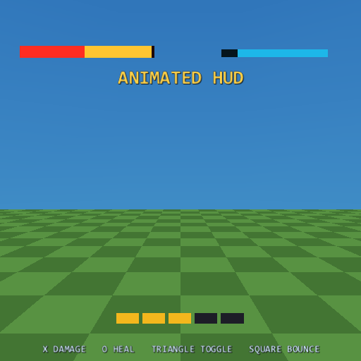
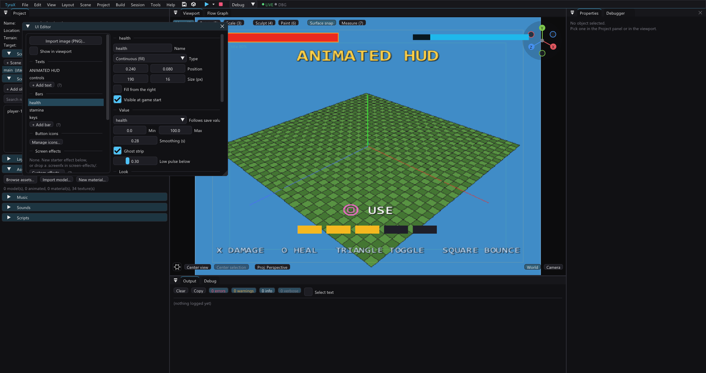

# Animated HUD: bars, motion and effects

The HUD used to be static: images and baked texts, shown or hidden as a
whole. This page covers the three things that move it - **live bars** (health,
stamina, progress), a **looped animation** any element can carry, and the
**show/hide transitions** and **one-shot effects** the flow graph plays on
them. Everything here is sprite properties changed per frame: nothing is
rebaked, and a whole animated HUD costs a few floats per element.

Open **Tools > UI Editor**. Images sit in the *Screen stack*, texts under
*Texts*, bars under *Bars*; every one of them ends with a **Motion** block.
The viewport overlay (*Show in viewport*, or while the UI Editor is open)
previews the looped animation and the bars live.

`examples/hud-animation` is the worked example: a health bar with a damage
ghost, a stamina bar that drains while you sprint, a coin strip that pops as
you collect, and a few things that move for no reason but fun.

The UI Editor keeps the same motion controls beside the selected element and
draws the looped animation directly over the scene preview:

## Bars

A bar is a **fill sized from a value every frame**. It is not a texture: the
track, the fill and the ghost are tinted white quads (the same 8x8
`hud/loading-white.png` the loading bars use), so a bar costs 2-4 sprites
and no VRAM. Add one with *+ Add bar*.

**Value.** The bar either **follows a save value** (*Follows save value*:
read every frame, mapped through *Min*/*Max* to a 0..1 fill) or is driven by
the **Set HUD Bar** flow node alone, starting at *Start*. Following a save
value is the usual choice: an `Add To Save Value -25` in any graph moves the
health bar with no node addressed to the bar at all, and the value is what a
memory-card save stores anyway. Set HUD Bar works on either kind - on a bound
bar it writes the save value, so the two never disagree. Its *set* pin eases
the fill, *set instantly* jumps it (a respawn).

**Feel.** *Smoothing* is how many seconds the fill takes to reach a new value
(0 = snap). The **ghost strip** lingers where the fill was after a drop, holds
for a third of a second and then slides down after it - the classic "damage
you just took" chip; a rise takes it along at once, so it only ever shows what
was lost. *Low pulse below* makes the fill breathe once the value is under
that fraction. *Fill from the right* mirrors the bar for a second player.

**Look.** Continuous or **quantized** (whole segments light up: "3 of 5
keys"). Track, fill and ghost colours. A **fill image** replaces the flat
fill: the sprite is *cropped* to the fraction rather than squashed (the
engine's repeat mode samples a sub-rectangle), tinted by the fill colour, so
paint it white to keep it as painted; a quantized bar draws it once per
segment. A **frame image** is drawn centred over the bar at its own size, so
a decorated border can wrap the fill. Both are baked like any HUD image
(power-of-two resize, palette quantization) and travel with the project.

Bars draw **above the whole screen stack** and under the texts and prompts.
Set HUD Visible hides them with the rest of the HUD; Set HUD Element Visible
hides one.

## Looped animation

Every image, text and bar has an *Animation* combo in its Motion block:

| Kind | What moves | `Amount` means |
| --- | --- | --- |
| Pulse | alpha dips once per period | depth, 0..1 (1 = to invisible) |
| Bob | y, up and down | pixels |
| Sway | x, side to side | pixels |
| Breathe | scale grows and settles | growth fraction (0.1 = 10 %) |
| Blink | hard on/off | share of each period it is drawn |
| Wobble | a small circle | radius, pixels |
| Shake | random jitter, re-rolled every *Step* | radius, pixels |

*Period* is seconds per cycle (for Shake, seconds per jitter step). Pixels are
in the logical 512x448 space and scale with the display mode like the
elements themselves. The motion is a pure function of the game clock, so a
paused game and a resumed one draw the same frame and nothing accumulates -
and it is the same function in the editor and on the console
(`src/hudanim.hpp` and its twin in the generated game), which is what makes
the viewport preview honest.

Use it sparingly. One pulsing "PRESS START", a bobbing objective marker, a
breathing low-health icon read as intent; six things bobbing read as a bug.

## Show / hide transitions

The *Show / hide* combo picks how an element **arrives and leaves** when a
flow node shows or hides it: *Fade*, *Slide from left/right/top/bottom* (a
40 px slide with a fade), or *Pop* (scales up from small). The duration is
beside it. Hiding plays the same curve backwards. An element that is visible
at game start starts fully shown - no transition plays on boot.

The nodes that trigger one:

- **Set HUD Element Visible** (show / hide / toggle) works on any element -
  an image, a bar or a text - through that element's transition. It is the
  per-element half of *Set HUD Visible*, which still hides the whole stack.
- **Set Text Visible** keeps its auto-hide seconds and now plays the text's
  transition too.

*Visible at game start* on an image or a bar is what makes a map, a boss bar
or a tutorial hint start hidden and slide in when a node asks.

Transitions are runtime-only: the editor overlay does not preview them.

## One-shot effects

**Play HUD Effect** fires a short effect on any element, layered over its
looped animation: **Flash** brightens and fades back (the GS modulates
colour up to 2x), **Bounce** pops the scale, **Shake** jitters the position
and settles. *Seconds* is the length - 0.3-0.5 reads as a hit, longer as an
alarm. The example flashes the health bar on every hit and bounces the coin
counter on every pickup.

## Cost

Per element per frame: one evaluation of the loop, the transition and the
effect (a handful of trig calls), and the sprite's position/size/colour
written. A bar adds its easing and 2-4 quads. No textures beyond the
optional fill and frame images, no rebakes, no EE allocations. The
editor-side cost is nil; the `.tyra` grows only by the HUD keys you change
(`anim`, `transition`, `visibleAtStart`, `hudBars`). Default motion and
transition settings are omitted, so this feature does not add noise to an
otherwise unchanged HUD definition.

## Limits

- No rotation: `Tyra::Sprite` has none, so a spinning icon is a sprite sheet
  (see the loading bars' segment image) rather than an animation kind.
- A bar's value is a float in its own units; the fill is clamped to
  *Min*..*Max*. Vertical bars are not offered - rotate the art and use a
  quantized bar, or a stack of images.
- Live Logic does not hot-patch the three new nodes; a graph using them
  builds normally and the Logic chip says so.
- The time machine does not rewind HUD state (it never did): a bar bound to
  a save value follows the rewound value, an unbound one keeps its last set.
