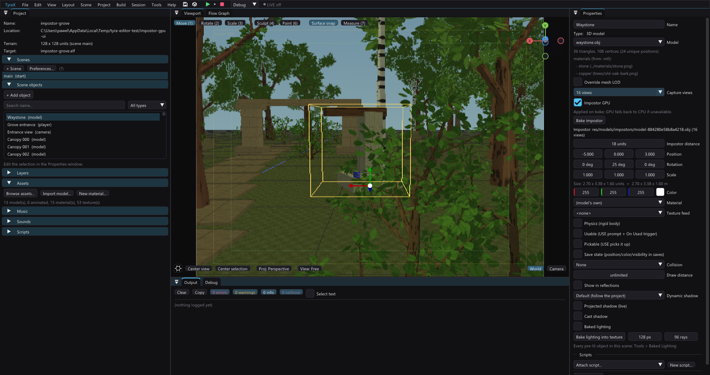

# Distant model impostors

Impostors replace a static model beyond an authored distance while retaining the
original object's collision and gameplay identity.



In **Tools > Tree Generator**, enable **Bake distant impostor** before **Add to
scene**. The generator writes the ordinary tree plus an `-impostor.obj`, matching
material and a PNG atlas: 4, 8 or 16 orthographic 128x128 views in four columns.
Choose **Capture views** and **Impostor GPU** in model Properties before **Bake
impostor**, or **Tree capture views** in Tree Generator before adding a tree.
The choice takes effect only when baking succeeds; existing assets retain their
old count until rebaked. GPU is on by default for these UI actions.
Only one OBJ part is drawn at a time, on a vertical camera-facing card: **two
triangles**. Each capture keeps its own projected bounds and the source origin.
The view is selected relative to the object's authored yaw, in sectors of 360 degrees divided by the capture count.
Binary alpha and RGB padding keep the silhouette clear of black filter fringes.

The inserted object switches beyond six authored tree heights by default. Change
**Impostor distance** in its LOD properties; zero disables replacement. The game
returns to the full model below 90% of that distance. At most four representation
switches happen per scene render. Initial geometry is built directly in the
selected representation. Camera movement subsequently updates six positions and
texture coordinates in place, without rebuilding the tree or allocating bags.
The viewport previews the same camera-facing capture selection.

## Supported assets

Select a static OBJ object and click **Properties > Bake impostor**. The baker
reads every material part, including an assigned material override, `Kd` colour,
`map_Kd` textures and their alpha cutouts. Untextured materials become solid
colours. Object tint remains a runtime multiplier. Missing textures/overrides,
reflection and emissive materials report an error without changing the object's
assignment. Alpha is thresholded at 128; translucent glass is not reproduced.
Captured albedo is clamped to the PNG's 0..1 range.

The output is `res/models/impostors/model-<object-id>.obj`, `.mtl` and `.png`.
Baking assigns it to this object, sets the billboard flag and refreshes the
viewport. A positive existing distance is preserved; otherwise the initial
threshold is six times the largest local dimension multiplied by the largest
supported instance scale. Change **Impostor distance** afterwards. The scene
assignment is undoable; exported files remain on disk. Re-baking overwrites this
object's generated assets, so undo does not restore an earlier texture bake.

The Tree Generator keeps its convenient export checkbox and shares the capture
kernel. Existing crossed cards remain ordinary replacement meshes. Static models
imported into the editor as OBJ use the same button; animated models are excluded.

`impostorBillboard: true` opts into the multi-view asset contract: exactly the saved number of
ordered material parts sharing the generated atlas, each holding one XY card.
The generator sets it automatically. Leave it false for ordinary far meshes.
Billboards require upright objects (no X/Z rotation), positive scale, and equal
X/Z scale. Unsupported transforms or missing/incompatible replacement assets
fall back to the original model. Physics, animated models and matrix-path moving
props do not use replacement. Re-export old generated trees to obtain camera-facing views;
turning on the flag alone does not convert their old two-card assets.

## Trade-offs

- Eight views preserve the source silhouette much better than superimposing two
  perpendicular images, but remain discrete: changes between sectors and the
  near/far hard swap can still be visible. Hysteresis prevents repeated swaps;
  it does not dissolve the image. Distance remains in world units, not pixels.
- The card rotates around world Y only. Elevated cameras expose the missing
  crown depth. There is no depth reprojection or per-pixel normal lighting.
- Captures contain source colour. An upward normal supplies stable approximate
  foliage lighting in both the viewport and game, so the card no longer lights
  like a rotating wall. It does not reproduce every branch's directional shade.
- Secondary game views reuse the main view's card and selected capture, as with
  existing static mesh LOD. Per-view billboards remain future work.
- Both source and far assets stay loaded. Atlas storage grows with the number of views. Fewer triangles are not a proportional
  frame-rate guarantee: texture traffic, draw calls and alpha overdraw still cost.

## Data and implementation

Objects store `impostor` (project-relative OBJ), `impostorDistance` (world units,
zero disables), `impostorBillboard` (default false), and `impostorViews` (4/8/16, default 8).
Format v41 adds the count; older eight-view assets load without conversion.
The far model retains its own material; collision and bounds retain `model`.
Rebuild the game after changing these fields; they are not Live Link parameters.
Asset Browser usage and rename/move operations track the far path.

`impostorbake.hpp` exposes the common capture interface; `treeimpostor.cpp`
performs deterministic CPU rasterization, optional GPU dispatch and shared
output, and retains the tree wrapper.
`modelimpostor.cpp` loads arbitrary OBJ parts and source images. `templates.cpp` collects both model assets and switches
visual geometry without changing `SceneObjectData::model`. UV updates use loaded
model coordinates, retaining texture-atlas remapping. No engine/VU changes or new
console texture format are required.

See [the grove example](../examples/impostor-grove/README.md) and
[rendering directions](rendering-directions.md).

Viewport selection includes the visible card in the source model AABB.
See [Selecting objects](object-selection.md) for mesh priority and alpha handling.


## GPU capture and view count

`impostorgpu.cpp` renders source albedo/Kd and alpha into an offscreen RGBA8 atlas
with depth testing, nearest texel sampling and an alpha threshold of 128. It
uploads geometry/textures once per asset, dilates RGB borders in four GPU
passes (without spreading alpha), and reads back once for all views.
`bakegl.hpp` shares hidden-window creation and scoped context restoration with
GI. The capture context is separate from GI and the viewport; it requires
OpenGL 3.3, whereas GI compute requires 4.3. Failed GPU capture automatically
retries on CPU, and the result message identifies the backend or fallback reason.
Both paths use the same projected bounds, binary alpha and per-capture RGB
padding. Silhouette edge coverage may differ slightly between GL rasterization
and the CPU barycentric reference. GPU acceleration affects bake time only.

| Views | Angle step | Atlas at 128px/view | 8-bit texels (excluding palette) |
|---|---|---|---|
| 4 | 90 degrees | 512x128 | 64 KiB |
| 8 | 45 degrees | 512x256 | 128 KiB |
| 16 | 22.5 degrees | 512x512 | 256 KiB |

Eight remains the default. Sixteen helps asymmetric props at a memory cost;
more azimuths do not fix elevated cameras, parallax or lighting differences.
The runtime still selects one two-triangle card. Tree Generator supports all
counts; repeated instances should share a generated variant's atlas.

CLI capture (does not assign the result to an object):

```text
tyrax-editor --bake-impostor PROJECT res/models/tree.obj res/models/tree-far 16 --gpu
```

Omit `--gpu` for the CPU reference or headless authoring. The standalone example
asset generator remains CPU-only and needs no GLFW dependency. The OBJ comment records backend, count and capture size. Rebuild the PS2
game after rebaking or changing the saved capture count.

Verification on Windows: CPU/GPU captures at all three counts matched the entire
Waystone silhouette; oak mask intersection-over-union exceeded 99.9%, with mean
interior RGB error below 0.05 on the 0..255 channel scale. Warm end-to-end bakes
(including PNG output) measured about 1.7-2.7x faster on GPU for these fixtures;
first context startup made the first small bake slower. These are host authoring
measurements, not PS2 FPS gains or guarantees for other GPUs.
