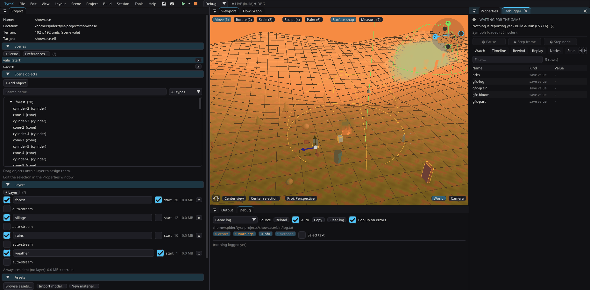

# Live Debugger — step through a PS2 game's logic from the editor



Live Link streams edits *into* the running game. The Live Debugger is the other
direction: the game streams back **what its flow graphs are doing**, and takes
commands. Nodes light up in the editor as the console runs them, exec links glow
behind the branch that just executed, hit counters tick up, the flow variables
and save values are visible while the game moves — and you can set a
**breakpoint** on a node, **stop the game**, **step it one frame at a time**,
**rewind** the last few hundred frames of execution history, and **fire a
trigger** from the editor to see what it does.

It works in PCSX2 and on a real PlayStation 2 over ps2link, over the same host
filesystem channel the game already loads its assets from. No debug hardware, no
extra transport, no engine change.

## Using it

1. Set the project's build profile to **debug** (*Project > Preferences >
   Build*) — the same requirement Live Link has. Release builds carry no
   instrumentation at all.
2. Leave **Live Debugger** on (*Project > Preferences > Build*, or *Build > Live
   Debugger*; on by default).
3. Build & run — **F5** (PCSX2) or **F6** (a console over ps2link).

That is the whole of it: **launching the game opens the Debugger panel** when
those first two conditions hold and the panel is closed. There is no separate
"run with the debugger" action to remember — every launch path does it (the
toolbar's Play, the run menu, and the F5/F6/Ctrl+F5/Ctrl+F6 chords), and a
new project starts with the panel already docked as a tab behind **Properties**,
so the first run has somewhere to report.

It opens only when closed, and never closes it: a panel you shut mid-session
stays shut until the next launch, and a launch never re-docks or steals focus
from one already open. In a release build, or with *Live Debugger* off, nothing
appears — there would be nothing to show.

To open it by hand anyway: *Tools > Debugger* (**F9**), or click the **DBG**
chip in the toolbar. For the full desk — the graph in the middle, the Debugger
panel in a column of its own — switch to the built-in **Debugger** window
layout (Layout menu).

The Flow Graph window becomes a live instrument the moment the game reports:

- a node's **title bar glows** amber the moment it runs and fades over ~0.6 s,
  so a node firing every few frames stays lit instead of strobing;
- the **exec links** out of a node that just ran are thickened and lit — the
  path a frame took through the graph is readable at a glance;
- a **hit counter** sits in each node's bottom-right corner (cumulative since
  the game booted);
- a **breakpoint** shows as a red dot on the node's title bar; the one the game
  actually stopped on turns yellow.

Right-click a node for *Set breakpoint* / *Fire now in the running game*, or use
the Debugger panel's **Nodes** tab, which lists every runnable node of the graph
being edited with its hit count, breakpoint checkbox and Fire button.

### The chip

The **DBG** chip in the toolbar (next to LIVE) reads like a status light:

- **DBG 50 fps** (green) — the game is reporting; the number is the game's frame
  counter timed against the editor's own clock. That counter counts **rendered**
  frames, so on a game with frame extrapolation on the picture changes about
  twice as often as this says — the *Stats* tab carries the game's own
  measurement of both rates. See docs/profiling.md, "The three frame rate
  counters", before comparing this against any other FPS readout.
- **DBG halted @ 1234** (orange) — the game is stopped, at that frame.
- **DBG (rebuild)** (amber) — the running ELF was built from different graphs, so
  its node numbering no longer matches the project. Nothing is highlighted until
  you Build & Run again.
- **DBG** (dim) — nothing is reporting yet.

Clicking it opens the Debugger panel.

### Transport

| Action | Key | What the game does |
|---|---|---|
| Pause / Continue | **F10** | Freezes / resumes the world |
| Step frame | **F11** | Runs exactly one frame, then freezes again |
| Step node | — | Runs until **any** instrumented node fires, then stops on it |

A halt freezes the world exactly the way a pausing menu does — scripts, the
player walker, particles and animation all stop — while the game keeps
presenting frames. The picture stays up, so you can look at what you stopped.

A breakpoint stops the game **at the end of the frame the node ran in**: by the
time a node can report itself, its own action has already happened. That is the
honest granularity of this design, and it is what the editor shows ("HALTED at
*chest · On Used*").

### Delays, and why a Fire can look like it did nothing

A `Delay` node does not wait - it **arms a countdown** that advances one frame at
a time, and the branch after it belongs to that countdown, not to the trigger.
So on a stopped game (or after a plain *Fire*, which runs exactly one frame) the
branch behind a `Delay` never comes: nothing counted.

Two things make that visible instead of mysterious:

- every armed countdown is reported, so the panel says **"⏱ 1 armed timer, next
  in 1.2 s"** (and the Nodes tab shows the frames left on the node itself);
- **Fire and continue** (right-click a trigger, or Shift-click the Fire button)
  fires the branch AND resumes the game, so the countdown reaches zero and your
  breakpoint on the node after it hits.

### The panel

- **Watch** — every flow variable in the project (Set/Get Int, Bool, Position
  nodes), every save value and every [World Fact](world-facts.md), with live
  values. Rewinding the timeline shows the values as of that frame.

  A **search box** filters it on the name and the kind together, so `marta`
  narrows to a character and `bool` or `save` to a column's worth; the count
  beside it reads *N of M* while a filter is on. A catalog-driven project puts
  its whole catalog in this table, which is what the box is for.

  Values are printed the way the thing is **declared**, not the way the console
  stores it: a position is three coordinates rather than the float that happens
  to be its X, a yes/no fact is `true`/`false`, and a one-of-several fact is its
  option's name. The *Kind* column names the source — `int`, `bool`,
  `position`, `save value`, `fact`, `fact (position)`.
- **Timeline** — the rewind. One column per frame that had a fire, newest on the
  right, bar height = how many nodes fired; hover for the list, click (or drag
  the slider) to inspect that frame. While rewound, the **graph overlay replays
  that frame** instead of the live one — the same drawing code, driven by
  history. ~900 frames are kept (about 15–18 seconds of PAL game time).
- **Objects** — up to 8 watched runtime objects, sampled **every frame** by the
  game: live position / rotation / scale / color / flags, a curve per axis over
  ~30 s of history, and a **trail in the viewport** showing the path it took
  (the head dot is where it is right now). Watch the selected object with one
  button; see [devkit.md](devkit.md).
- **Screen** — one button that makes the game photograph its own frame buffer,
  and the picture it sent back. The only capture path that works on real
  hardware or on a locked desktop; see [devkit.md](devkit.md).
- **Nodes** — the current graph's runnable nodes: hit counts, breakpoints, Fire,
  and the frames left on an armed `Delay`.
- **Breakpoints** — the whole project's list; click one to jump to its node.
- **Logic** — what [Live Logic](live-logic.md) has hot-patched, and what still
  needs a build.

A **crash** (or a game that just stopped reporting) takes over the top of the
panel: decoded cause, EPC/BadVAddr, a *Resolve names* button that turns the
addresses into functions and source lines, and the last flow-graph nodes and
watched-object positions from before it died. See [devkit.md](devkit.md).

### Firing a trigger from the editor

*Fire now* runs everything wired to a trigger, once, in the running game — the
trigger's own condition is bypassed. It is the fastest way to test a branch you
would otherwise have to walk across the map to reach. Codegen emits the
trigger's branch a second time under `livedbg::forced(key)` for this, in debug
builds only.

## How it works

Two files next to the ELF, on the host filesystem (PCSX2's *Host Filesystem*,
the ps2link file server on a console):

| File | Written by | Contents |
|---|---|---|
| `bin/livedbg.bin` | the game, every 6 frames (25 under ps2link) | cumulative hit count per node, a ring of the ~192 most recent fires with their age in frames, the watch values, the halted flag, the node that stopped it, the symbol-table hash |
| `bin/livedbg.cmd` | the editor, when the desired state changes | the full breakpoint list, halt / resume / step, node keys to force-fire, and the one-shot asks: a VU1 capture, a free-RAM measurement, a screenshot |
| `bin/frame.tga` | the game, once per *Capture frame* | its own frame buffer, read back out of GS VRAM (see [devkit.md](devkit.md)) |

The first two are validated by an exact-size + footer-echo check on both ends, so
a torn write is skipped rather than half-applied, and a command is applied only
when its sequence number changes. The Runner deletes all three at build start: a
stale command must not freeze a fresh boot, and a stale picture must not read as
an answer to the first capture of the new one.

The one-shot asks ride spare bits of the command's flags word rather than a
longer header, so a game built before one of them existed reads the switches it
knows and ignores the rest — no version bump on either side. Bit 3 is the VU1
capture, bit 5 the RAM measurement, bit 6 the screenshot.

The editor-side formats live in [`src/livedbg.hpp`](../src/livedbg.hpp) (parsers,
command writer, the timeline model — no GL, no ImGui, harness-testable); the game
side is generated into `src/gen/live_debug.gen.cpp` from `templates.cpp`. **They
are twins: change one layout and the other must follow.**

### Symbols

The game only ever reports **integer keys** — a PS2 game has no business carrying
name strings for something it flushes every few frames. Codegen assigns one key
per instrumented node (walking scenes, then objects, then nodes) and writes the
map to **`src/gen/livedbg.sym`**, a plain-text build artifact:

```
1
hash c212533fb7a98cfd
nodes 6
n 0 0 4a623929cf3bf60b 1 OnStart
...
vars 2
v 0 i score
v 1 b ticked
```

Each node line is `key scene objectId nodeId type`, where `objectId` is the
object's stable editor id — so breakpoints and highlighting survive renames and
reorders. The same table's hash is baked into the ELF; when the two disagree the
editor shows *DBG (rebuild)* rather than lighting up the wrong nodes.
Breakpoints themselves are stored in the `.tyra` as `<objectId>:<nodeId>`
(editor state, deliberately **not** a collaboration section — a peer's
breakpoints are their own).

### What is instrumented

Triggers and actions — everything that "runs". Pure data nodes (logic gates,
Get Position, variable reads) are expressions folded into the C++ of whoever
reads them; they have no moment in time to report, and the editor says so if you
right-click one. Up to 1024 nodes and 64 breakpoints are tracked.

### Cost

In a debug build with the debugger on: one counter bump plus a ring write per
node that fires, and one `fopen`/`fwrite` of a few KB every 6 frames (25 over
ps2link, where every file operation is a network round-trip). Nothing on the GS.
In a release build — or with the preference off — the generated runtime is an
empty translation unit, every `livedbg::` entry point is an inline no-op and
`halted()` is a compile-time `false`, so the game loop's `|| livedbg::halted()`
folds away. There is nothing to strip out later.

**A project with no flow graph still gets the runtime.** It used to not: the
gate was the preference *and* at least one instrumented node, so a bare project
generated the empty TU, wrote no `bin/livedbg.bin` at all, and the panel waited
forever with nothing to say. But most of what this channel carries is not about
anybody's logic — the **Stats** tab's frame rate, bag flushes, GS VRAM and free
EE RAM, the VU1 capture and the crash report are properties of the *frame* — and
a fixture with no graph is exactly the kind of project you open the Debugger on.
The gate is now the debug profile plus the preference; the hit table is simply
empty.

### When the panel is empty, it says why

An empty panel used to be the most expensive thing this channel could do: *"No
stats yet."* was the same sentence whether the game had not booted, the build
carried no runtime, or **the file server died half an hour ago with the console
still running**. That last one is the ps2link failure mode and it leaves a
perfectly valid `bin/livedbg.bin` frozen at its last write — indistinguishable
from "no data yet" unless somebody thinks to look at the file's timestamp.

So the editor stats that file every tick, independently of whether new
snapshots are arriving, and reports one of two things from a single string that
both the state block and the *Stats* tab read:

- **no file at all** — nothing has reported yet; build and run, or (if the game
  *is* running) rebuild it, because it predates the preference being switched on;
- **a stale file** — the chip goes amber, reads **STALE SNAPSHOT** rather than
  *WAITING FOR THE GAME*, and the text names **how old the snapshot is** and
  that the cure is a redeploy rather than a retry.

Because the game rewrites the file every 6 frames (25 over ps2link — roughly
half a second either way), several seconds of silence is a dead channel and not
a slow one. A collapsed frame rate makes the snapshot *late*, never absent.

## Limits

- **Frame granularity.** A breakpoint reports after its node's action ran, and
  the halt takes effect from the next frame. There is no "stop between two nodes
  in the same frame".
- **Projects that took ownership of `terrain_game.cpp`** (deleted its marker
  line) do not get the loop hook. The debugger still reports and breakpoints
  still stop all graph execution — a fallback global Script drives the pump —
  but the walker, particles and animation keep running while "halted", because
  the pause in the loop is what freezes those.
- **The watch is read-only.** Values are reported, not editable; changing them
  from the editor would need a second command channel and is not implemented.
- **ps2link** serves the same file channel and the code paths are identical, but
  the verified target is PCSX2 (see PROGRESS 191).
- **On a console the file channel outlives nothing.** It is served by a
  `ps2client` the Runner spawned, and *one file server at a time* is real:
  closing the editor, **Stop on PS2**, a **Clean** or a redeploy of **this**
  project all take it down. The console does not notice — the game keeps
  running, blocked on `host:`, and every devkit file stays frozen at its last
  write while the `[ps2]` log keeps scrolling, because the log is UDP straight
  to whichever `ps2client` is listening and does not go through that server at
  all. **Two transports, one of them dead, and only the log is visible.** That
  is what the stale-snapshot report above exists to name. A game that is still
  running does not need a rebuild — either redeploy (**F6**), or serve it
  yourself with `ps2client -h <ip> listen` from the project's `bin/` and it
  resumes within seconds.

  Deploying **another** project used to be on that list, and was the most
  confusing entry on it: the editor ran `taskkill /F /IM ps2client.exe`,
  machine-wide, so any *Run on PS2* anywhere killed this session's file server.
  Since 1.22.0 a deploy only reaps the servers it owns and refuses — naming the
  project that holds the channel — rather than taking one that is not its own
  (see [ps2link-setup.md](ps2link-setup.md#one-file-server-at-a-time)).
- Sequences, object scripts and custom `.flownode` C++ bodies are not
  instrumented beyond the node that invokes them.

## Related

- [live-link.md](live-link.md) — the opposite direction (edits into the game),
  and the channel this rides on.
- [object-scripts.md](object-scripts.md), [custom-flow-nodes.md](custom-flow-nodes.md)
  — the other halves of the scripting story.
- `examples/script-demo` is a good playground: open it, set the build profile to
  debug (the toolbar's profile dropdown, right of Stop), and press F5 — the
  panel opens by itself.
