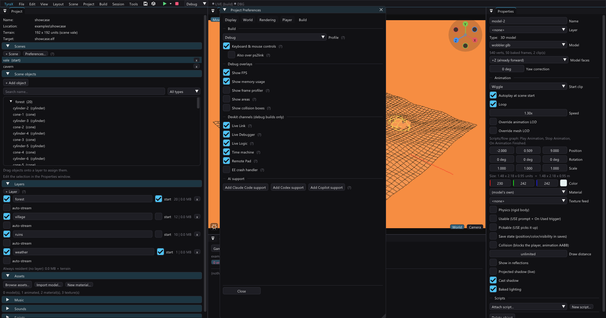

# Live Link — edit the running game

Live Link mirrors scene edits into the **running** game without a rebuild: drag
an object with the gizmo, spin it, scale it, recolor it — even **add or delete
objects** — and watch the scene change on the PS2 (or in PCSX2) as you work. In
2002 this kind of live tuning loop was devkit-studio magic; here it rides
entirely on infrastructure the project already has.

## Using it

1. Set the project's build profile to **debug** (*Project > Preferences >
   Build > Build profile*) — release builds carry no Live Link code at all.
   **New projects already start there** (debug profile, Live Link on): that
   is the profile you author in, and release — which strips both the poller
   and the overlays — is for the disc. Projects created before that default
   keep whatever they saved.
2. Build & run as usual — **F5** (PCSX2) or **F6** (real PS2 over ps2link).
3. Edit the scene: move / rotate / scale / recolor objects, duplicate them,
   delete them. Changes appear in the running game within a fraction of a
   second; a gizmo drag streams continuously.

The **LIVE chip** in the toolbar (after the run buttons) shows the session
state, and clicking it toggles Live Link on/off:

- **● LIVE** (green) — edits are streaming into the game.
- **● LIVE (rebuild)** (amber) — the scene changed in a way the session can't
  absorb (see below), so streaming pauses rather than mis-patch anything.
  Build & Run resumes it; so does an Undo back to the built structure, no
  rebuild needed.
- **● LIVE (build)** (dim) — Live Link is on but the last build has no poller
  yet; Build & Run once.
- **● LIVE off** (gray) — disabled for this project.

On/off is a **project setting** (*Project > Preferences > Build > Live Link*,
also in *Build > Live Link* and the chip; default on, stored in the `.tyra`).
Off means the game is **built without the poller** and the editor never writes
snapshots — for anyone who doesn't want their debug builds patched from
outside. Release builds never carry the poller regardless.

## What updates live vs what needs a build

Live:

- **position, rotation, scale, color** of every scene object — the same
  mutations the *Move/Set Color* flow nodes perform at runtime, so geometry
  rebuild, physics and collision all follow the patched values;
- **adding objects** — a new object is instantiated through the game's runtime
  spawn pool by cloning an authored object with the same "recipe" (same type,
  model, material, detail, layer, physics…), then patched to its own
  transform/color. A freshly duplicated (`Ctrl+C`/`Ctrl+V`) or same-type
  inserted object just appears in the game. Up to 32 live-added objects
  (the spawn pool size);
- **deleting objects** — the deleted object is hidden in the running game
  (its baked geometry stays until a rebuild, and — like the *Hide Object*
  flow node — collision remains). Undo restores it live;
- **renames and reorders** — records address objects by a stable id, so both
  are non-events for the session.

Needs a build — the chip flips to amber instead of applying something wrong:

- changing a built object's **recipe**: its type, model / material assignment,
  primitive detail (and a cylinder's *Vertical rings*, which is the same
  geometry decision), physics (the flag and, while it is on, the mass /
  bounciness / friction / tumble material) / collision, layer membership,
  emitter / sound / player / animation parameters…
- adding an object with **no matching template** in the built scene (nothing
  of the same recipe existed at build time), or one that can't be faithfully
  spawned at runtime: **point lights** (baked into vertex colors),
  **projecting decals** (baked host projection), **mirrors** (baked reflection
  table), **portals** (baked PORTALS link table), or objects carrying a
  **flow graph / attached scripts** (compiled per authored object);
- editing an existing point light / projecting decal (their transforms are
  baked at build);
- streaming-layer definitions, scene add/remove.

Other non-live properties (sky, terrain sculpting, HUD…) don't endanger the
session — they simply don't show up in the game until the next build.

## How it works

No socket, no extra protocol stack — the transport is the **host filesystem
the game already loads its assets from**: PCSX2's *Host Filesystem* on the
emulator, the ps2link/ps2client file server on a real console. One mechanism,
both targets.

- The editor (`App::liveLinkTick`, ~10 Hz) snapshots the active scene as one
  64-byte record per object — a stable **id hash** (FNV-1a 64 of the object's
  editor id), a spawn-template index for objects added since the build, and
  the 12 live floats — and writes `bin/livelink.bin` (`TXLL` magic, version,
  sequence number, a footer echoing the sequence) atomically via a sibling
  tmp file + rename, whenever the payload changed.
- The game side is a generated global script, `src/gen/live_link.gen.cpp`
  (debug profile + Live Link preference only; otherwise an empty translation
  unit). It re-reads the file every 6 frames (every 25 under ps2link — each
  `fopen` there is a network round-trip), validates magic/size/footer so a
  torn write is ignored, skips already-applied sequence numbers, and maps
  records onto runtime objects through the id-hash table baked into
  `scene_data.hpp`. Known ids are patched in place (`dirty` only on a real
  change); unknown ids are spawned from their template via the runtime spawn
  pool; authored objects absent from the snapshot are hidden (and restored
  when they reappear); spawned ones absent are despawned.
- Safety is guarded by the **as-built record** (`bin/livelink.sig`): the
  Runner stamps every authored object's id + recipe hash (plus a cross-object
  context hash) at build start, and the editor streams only while the live
  project is representable against it. Recipe drift on a built object, a new
  object with no template, layer-table changes → amber chip, no writes.
- The Runner also deletes `bin/livelink.bin` at build start: the fresh build
  bakes the current scene state, so a stale snapshot must not be re-applied at
  boot. Conversely, a *Run (no build)* keeps the snapshot — edits made while
  the game was down are applied as soon as it boots.

Cost: zero in release builds or with the preference off (the poller doesn't
exist), an `fopen` + at most a few tens of KB read every 6/25 frames in a live
debug build, and nothing on the GS — patched objects go through the exact same
dirty-rebuild path the flow-graph object actions already use.

## Texture hot reload

Live Link's sibling channel: **repaint a texture in the Material Editor and
watch it change on the running console** — the largest-return trick in the
whole pipeline. Every saved paint stroke / applied bake layer:

1. re-bakes the texture into `bin/<path>` in exactly the format the build
   shipped (the palette layout is read from the existing PNG's header, so
   the swap is format-identical), written atomically — **once per path the
   texture ships under**, see below;
2. bumps `bin/livetex.bin` — a tiny manifest of repainted textures with
   growing generations (`TXLT` magic, seq + footer echo like the scene
   snapshot; cumulative per session, so a game booted later catches up).
   Every path one paint produced shares a **group** number.

The generated poller (`src/gen/live_tex.gen.cpp`, same debug + Live Link
gate) re-decodes the PNG and **re-uploads the pixels into the texture's
existing GS VRAM allocation** (`RendererCoreTexture::updateTextureInfo` —
same address, so the GS bump allocator is never disturbed; textures are
matched by their full load path via the fork's `Texture::sourcePath`).
Every mesh sharing the texture updates at once. A repaint that changed the
texture's dimensions or palette format is skipped with a soft error in the
log — that needs a real build. The Runner deletes `livetex.bin` at build
start (the fresh build re-bakes everything).

**The path the game knows is not always where the texture lives.** An
animated model bakes every texture its material override names into a
*renamed* copy next to its `.tskl` — `res/materials/Body-tex.png` ships as
`models/hero__ovr3a65_Body-tex.png`, and that renamed path is what the
`.tskl` stores and the game loads. So the editor resolves the painted file
through the bake's own naming (`templates::animTextureAliases`) and updates
**and announces every one of those copies as well**, one per animated model
carrying the texture. For a texture only animated models use, the texture's
own location is not among them at all — which is exactly why a repaint used
to do nothing there, with no diagnostic anywhere.

**A reload that matches nothing says so.** The poller reports per *group*:
one record matching no loaded texture is ordinary (the paint announces every
path the texture may have shipped under, and the game loaded one of them),
but when a whole group matches nothing it prints a soft error naming each
path it tried. That is the case where the repaint genuinely did not happen —
the model is not in the running scene, or it is new since the last build —
and it used to be silent, i.e. indistinguishable from the feature not
existing.

## Limits & notes

- The snapshot targets the editor's **active scene**; a game in a different
  scene ignores it (switch scenes in the editor to tune there).
- A live-added object has no compiled flow graph / scripts / save-state until
  the next build (spawning refuses such objects — amber chip — so this can't
  surprise you silently).
- Deleting live hides the object; its collision stays until a rebuild
  (exactly the *Hide Object* approximation).
- An object that physics is actively moving is snapped back once per edit —
  the same behavior a *Set Position* flow node has.
- On a real PS2 the poll cadence is ~0.5 s to keep the ps2link file server
  happy; PCSX2 polls ~10x per second.
