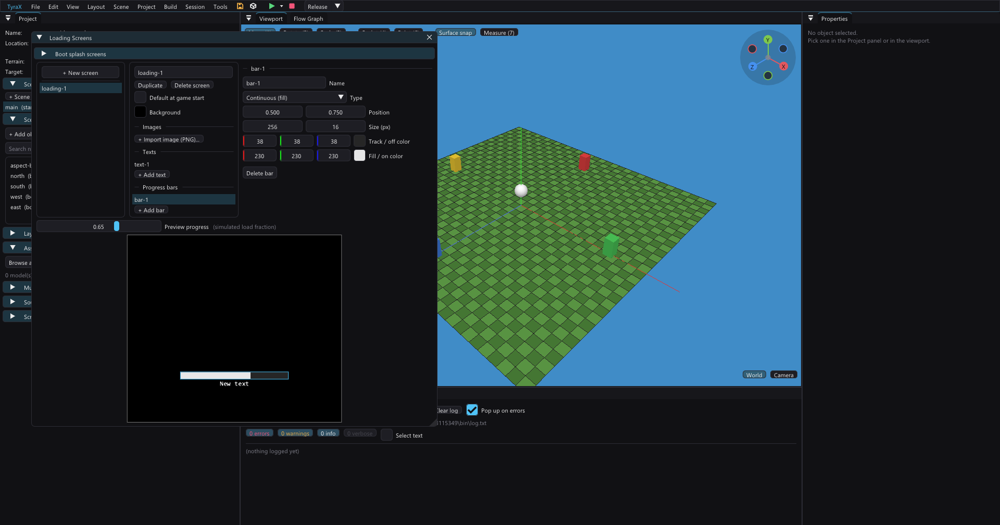

# Loading screens

A **loading screen** is what the game shows while a scene loads — at boot (the
[start scene](#the-start-scene)) and on every *Switch Scene*. You define named
screens, each with a background color, images, texts and **progress bars**,
then assign one per scene or set a project default.

Open it from **Tools > Loading Screens** (or the button in *Project >
Preferences*). The master switch is *Project > Preferences > "Loading screen
between scenes"* — off, scenes cut straight in.

## Anatomy of a screen

Drawn back-to-front:

1. **Background color** — the whole screen is cleared to it.
2. **Images** — PNGs imported into `res/hud/` (same pipeline as the HUD:
   normalized center anchor, sized in pixels on the 512×448 screen, baked to a
   PS2-valid power-of-two texture). For a logo or artwork.
3. **Texts** — named strings baked to sprites at build (the PS2 engine has no
   runtime font — any TTF, size, color, drop shadow). For a "LOADING" caption
   or a tip line.
4. **Progress bars** — see below.

Elements sit in the middle column; select one to edit it on the right. The
**preview** at the bottom renders at 512×448 aspect, with a *Preview progress*
slider so you can see the bars at any fraction without running the game.

## Progress bars

Two kinds, both colored rectangles (no texture needed):

- **Continuous** — a track (the *off* color) with a fill (the *on* color) that
  grows left-to-right with load progress.
- **Quantized** — `N` segments (2–16) with a configurable gap, lighting up one
  per `1/N` of progress (e.g. 5 dots that fill in steps). A quantized bar can
  swap the plain rect for a **segment PNG**: the same texture drawn per
  segment, tinted *on* when lit and *off* when unlit.

Position (normalized, center anchor), total size (px) and the on/off colors are
per-bar.

### The bar shows *real* progress

The load is otherwise a single blocking step, so the generated game counts the
work — assets to stream (textures/materials/models), objects to build, terrain
chunks in view — and presents a loading-screen frame every ~1/24 of the way
through. The bar advances as the scene actually loads, not on a timer. (Very
small scenes may jump straight to full; a big terrain or many assets make it
climb.)

### At boot

The very first scene is covered too. Boot order: the engine's **Tyra logo**
(held ~2 seconds) → any **boot splash screens** (below) → the loading screen
while the **start scene** loads → the scene. The first load is deferred into
the game loop on purpose — a frame presented from `init()`, before the main
loop, isn't vsync-paced and would flash by, leaving the boot loading screen
invisible. (The ~2s logo hold is the engine's `banner.show()` re-rendering the
splash for a fixed real-time window; it applies to every generated game,
loading screens or not.)

## Boot splash screens

The **Boot splash screens** collapsing header at the top of the window lists
images shown at startup, in order, **after the Tyra logo and before the loading
screen** — a studio / publisher / "presents" card. Each splash is:

- an **image** (PNG, imported into `res/hud/`, baked to a PS2-valid size like
  any HUD image; full-screen 512×448 by default, position/size adjustable),
- a **background color** behind it (letterboxing for a non-full-screen image),
- a **duration** in seconds (0.1–10).

Splashes are project-wide and **independent of the loading-screen master
toggle** — they always play when defined. Only images for now. *Move up* /
*Move down* reorder them; list order is play order. They compile to a
`SPLASHES[]` table in `inc/loading_data.gen.hpp` and render from the game loop
like everything above, so each shows for its full (vsync-paced) duration.

## The start scene

Which scene the game boots into is a project setting: **Scene > Preferences >
Startup > "Boot into this scene"**, ticked on the scene you want. New projects
boot the first scene, and the *Project* panel marks the start scene with
**(start)**.

The tick can only be *moved*, never cleared — some scene always has to be the
start, so the checkbox is disabled on the scene that holds it and you tick a
different one instead. Scene Preferences edits the **active** scene, so switch
to the scene first.

It reaches the game as `START_SCENE` in `inc/scene_data.hpp` — the only
argument the boot `loadScene()` takes, so a wrong value cannot desynchronize
anything, and nothing else about a scene (ambience, cycle, loading screen)
changes by *being* the start scene.

It is also kept honest automatically: deleting a scene shifts the index so it
still points at the same scene (deleting the start scene falls back to the
first), and an out-of-range value — a hand-edited `.tyra`, a collaboration peer
with a different scene list — folds back to the first scene on load rather than
booting into nothing.

Two more things follow it, because the boot path used to assume scene 0 in
places that are not a scene load:

- **The player starts on the start scene's own spawn point.** A Player object
  is placed by the scene load itself, but the built-in FPP player (a scene with
  a *spawn point* marker and no Player object) was positioned before the boot
  load, from scene 0 — booting scene 3 put the player on scene 0's coordinates.
  Measured on the console: a spawn at (25, 25) placed the player at (0, 0)
  before the fix, (25, 25) after. In a real level those borrowed coordinates
  can be inside a wall or off the map.
- **The loading screen shown at boot is the start scene's**, not the first
  scene's — which matters once scenes name different screens.

## Assigning a screen

- **Per scene** — *Scene > Preferences > Loading screen*: a screen by name, or
  `<default>` to inherit the project default.
- **Project default** — mark a screen "Default at game start" in the Loading
  Screens editor. Scenes that don't name their own use it (including the start
  scene at boot).
- **Built-in fallback** — with no screens defined (or a scene on the default
  when there is none), the game shows the classic centered
  `res/hud/loading.png` on black, exactly as before this feature existed. The
  placeholder PNG is generated when missing; replace the file to customize it.

## How it reaches the game

The screens compile to `inc/loading_data.gen.hpp` (element tables + a
scene→screen map). At runtime `loadingscreen::renderFrame` draws the resolved
screen; progress bars are tinted quads over a shared white 8×8 sprite
(`res/hud/loading-white.png`, shipped automatically). Loading images and
segment textures are baked (power-of-two + quantized) like HUD images; loading
texts bake to `res/hud/text-ls-<screen>-<name>.png`. Everything joins the
disc's startup group on ISO export.

Loading screens are project-wide data (like Ambience presets and Color
Grading), so edits here are not part of undo — but they are ordinary unsaved
edits: the toolbar save icon lights and Ctrl+S writes them. The per-scene
*assignment* is undoable with the rest of the scene.
