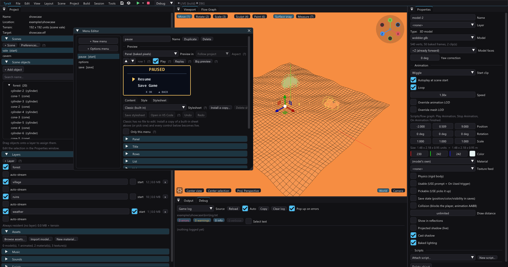
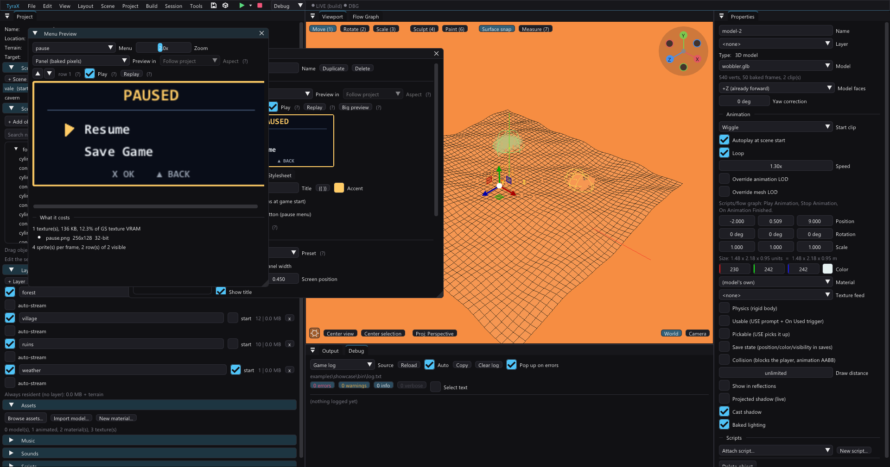

# Menu stylesheets

Menu stylesheets are CSS-shaped files in `menu-styles/*.menustyle`. They control
layout, fonts, colours, states and motion, then bake to PS2 sprites on the host.

Work in **Tools > Menu Editor > Style**, edit the source in the **Stylesheet**
tab, or use **Layout > Menu Designer** for the editor and large preview side by
side. A menu with no stylesheet keeps the Classic look.

Start with the visual controls:



Then check the result at a useful size:



## Example

```css
@style "Neon"

:root {
  --accent: #78d1ff;
  --ink: #eaf6ff;
}

panel {
  width: 512px;
  quant: 4bit;
  padding: 14px 0 0 0;
  background: linear-gradient(180deg, rgba(6,12,26,.95), rgba(10,20,42,.8));
  border: 1px solid var(--accent);
  border-radius: 8px;
}

title { color: var(--accent); letter-spacing: 3px; }
row { color: var(--ink); padding: 3px 0 8px 44px; }
row:selected { color: #fff; translate-x: 6px; }
row:disabled { color: #4d5a6b; }
row.header { selectable: no; }

list { rows-visible: 8; }
value { color: var(--accent); display: bar; bar-size: 90px 8px; }
hint { content: "{{cross}} OK   {{triangle}} BACK"; }

@transition open { 180ms ease-out; fade; translate-y 10px; }
@transition cursor { 110ms ease-out; }

menu#pause { panel { width: 256px; } }
```

The Style tab exposes the same properties as widgets and shows parse errors by
line. **Open in VS Code** writes pending widget edits first.

## Selectors and cascade

Elements are `panel`, `title`, `list`, `row`, `value`, `description`, `hint`,
`marker` and `image`.

- `row:selected` and `row:disabled` style states.
- `row.<name>` matches a row's **Class** field.
- `menu#<name> { ... }` scopes rules to one menu.
- Variables use `--name` and `var(--name)`.

The cascade is element < class < state; menu-scoped rules beat general ones.
Unspecified values fall back to the menu's normal accent, font sizes and panel
width.

Hover controls in the Style tab for the full property list and accepted values.

## Rows and scrolling

Each row can have a class, icon, description and **Enabled when** save value.
Disabled rows use `:disabled` and the cursor skips them. A Label action is a
non-selectable header or spacer.

Menus support 32 rows. Set `rows-visible` to make long lists scroll inside a
fixed window instead of baking one huge panel.

## Motion

Transitions animate open, close, cursor, scroll and value changes. Loops use
`@animate`:

```css
@animate selected { pulse 1.8s 0.22; }
@animate marker { bob .9s 3px; }
@animate panel { sheen 3.4s 52px rgba(255,255,255,.18); }
```

For a moving background, animate a separate texture layer:

```css
panel { background-anim: url(res/hud/stars.png) scroll 12px/s -4px/s; }
panel { background-anim: url(res/hud/flame.png) frames 8 1.2s; }
```

These change sprite alpha, position or texture coordinates; they do not rebake
the menu every frame.

## Images and sizing

`background-image` supports a normal image or 9-slice frame. Keep UI textures
power-of-two and use palette quantization where possible.

Styles use the project's logical 512x448 canvas. TyraX scales the result for PAL,
NTSC, progressive and widescreen modes. Use the Menu Preview's display-mode
picker instead of hand-tuning coordinates for one output mode.

## Cost

The preview reports texture memory and sprite cells before you build.

- Gradients, borders, shadows and text effects cost baked texture bytes only.
- `:selected` and `:disabled` appearances can add baked state cells.
- Motion costs a few sprite properties per frame.
- A lower `quant` depth saves GS VRAM but may band gradients.

The build writes menu textures to `res/menus/` and generated layout data to the
project sources. Edit the stylesheet, not generated PNGs.

Five built-in sheets provide starting points: Classic, Neon, Blade, Parchment
and Minimal. **Install a copy** before customizing one; built-ins are read-only.

## Limits

This is a sprite layout system, not browser CSS. There is no arbitrary nesting,
runtime text reflow or shader-based blur. Unsupported properties are reported
by the parser instead of silently ignored.
