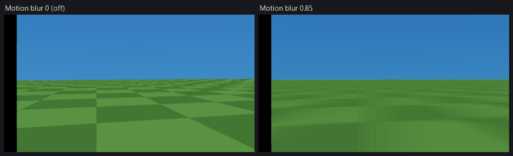

# Motion blur

The fourth built-in full-screen effect, next to bloom, colour grading and film
grain. It blends the **previous rendered frame** over the current one, which is
how the PS2 era did motion blur: there is no velocity buffer and no pixel
shader, but the other display buffer already holds the last frame, so the whole
effect is **one full-screen alpha blend** — no extra VRAM, no EE time, one
screen of GS fill.

Turn it on in *Tools > UI Editor* (the **Motion blur** entry of the screen
stack), per scene in *Scene > Scene Preferences > Post effects*, or from a flow
graph with **Set Motion Blur**.



Both frames are the same camera turn on the same fixture, PCSX2 software
renderer; the amount is exaggerated so a still picture can show it.

## What the number means

`Amount` is the weight the old frame gets: `out = mix(new, old, amount)`.

It **compounds**, and that is the thing to know before turning the slider up.
Each frame blends a predecessor that had already blended its own, so a still
object's contribution decays as `amount^n` — at 0.5 a trail is still a quarter
visible three frames later, and at 1.0 the picture stops updating altogether.

| Amount | Reads as |
|---|---|
| 0 | off |
| 0.15 – 0.25 | a light smear on fast motion, invisible when standing still |
| 0.3 – 0.45 | a clear trail — a dash, a hit, a drugged/dazed state |
| 0.6+ | a long ghost; readable only for a deliberate effect |
| 1.0 | the frame never changes |

Because the trail is **temporal and not directional**, it smears anything that
moves on screen — the world when the camera turns, and a moving object when it
does not. That is the honest limit of the technique: it cannot blur one object
and leave the rest sharp.

## Where it sits in the screen stack

Like bloom and grain, motion blur is an entry in the *UI Editor*'s screen stack
and composites right before the HUD sprite it sits under; sprites above it draw
crisp on top. **Unlike** them it defaults to the **bottom** of the stack rather
than the top, and that is not cosmetic:

> The blur's source is the **finished** previous frame — HUD, prompts and menus
> included. From the top of the stack, a HUD element that MOVES smears over the
> whole picture. Underneath the stack, the trail is the scene's and the UI
> redraws crisp over it every frame.

A static HUD element is unaffected either way (it blends with an identical copy
of itself), so the rule only bites on animated bars, tickers and moving
crosshairs — which is exactly when nobody is looking for the cause.

When several effects share one slot they composite **motion blur, then bloom +
grading, then grain**: the trail is the scene smearing, so this frame's own glow
and its fresh noise belong on top of it.

## From a flow graph

**Set Motion Blur** takes an `Amount` and takes effect on the next frame. Its
number input accepts a wire, so a **Tween** ramps it:

```
On Action "sprint"  ->  Tween 0 -> 0.35 over 0.4s  ->  Set Motion Blur (Amount wired)
On Action released  ->  Tween 0.35 -> 0 over 0.3s  ->  Set Motion Blur (Amount wired)
```

The node is in the `Scene` category with the rest of the post-effect family, and
**Live Logic can hot-patch it** — edit the amount and the running game follows
without a rebuild.

Scene changes re-apply the scene's authored amount, so a graph that raised the
blur does not leak it into the next scene.

## How it works

`RendererCorePostFx::apply()` (`vendor/tyra/engine/.../renderer_core_postfx.cpp`)
adds one sprite:

- source: `RendererCoreGS::getPreviousRealFrameBuffer()`, blitted 1:1 over the
  current display buffer,
- blend: `(Cs - Cd) * FIX >> 7 + Cd`, i.e. the plain alpha blend with `FIX` =
  the amount as a 0..128 byte,
- point sampling, because the blit is 1:1 and a bilinear tap would drift the
  trail half a texel per frame into a directional smear.

Two details are load-bearing:

- **`getPreviousRealFrameBuffer()`, never `getPreviousFrameBuffer()`.** With
  [frame extrapolation](frame-extrapolation.md) on, the newest finished frame is
  a synthesised warp half the time, and feeding a displaced image back into an
  accumulator compounds the displacement into a visible shake. The "real" one is
  the last frame the SCENE rendered — the same accessor the neural upscaler asks
  for, and for the same reason.
- **`RendererCoreGS::hasRealFrame()` gates the first frame.** Display buffers
  are never cleared at allocation, so the "previous" buffer after boot — or after
  a layout rebuild, such as a display-mode switch or the adaptive upscaler
  changing resolution — holds whatever was in that VRAM. The pass simply does not
  run until one real frame has been flipped.

## Interactions

- **[The neural upscaler (BLSS)](neural-upscaler.md)** samples the previous frame
  as its temporal history, so with both on, the history it reprojects is already
  blurred and the trail persists longer than the Amount suggests. It is not
  refused (nothing breaks), but tune the amount with the upscaler in the state it
  ships in, not without it.
- **[Frame extrapolation](frame-extrapolation.md)** composites nothing: a
  synthesised frame is a warp of an image that already carries the blur, and the
  pass is not re-run on it. The blur therefore updates at the render rate, not
  the presentation rate.
- **Film grain** in the previous frame is blended in as well, so grain plus a
  strong blur reads slightly smoother than grain alone.

## Cost

One full-screen alpha-blended sprite — the same GS fill as one bloom composite
pass and about a third of what film grain costs (grain draws two). No EE work,
no VU work, no VRAM: the source is a buffer the renderer already owns.

## Verifying it

A still camera sees nothing — the blur of a frozen picture is that picture. Move
the camera and read the pixels rather than eyeballing them: with the blur on, two
captures taken during the same turn differ **less** than with it off, because
each frame is partly the previous one. See the tyra-testing skill's motion gate
for the way to capture a moving picture repeatably.

**Mind the cadence.** A host-side capture loop manages roughly one frame every
0.3 s, which at 50 fps is ~15 game frames — and a trail at 0.45 has decayed to
`0.45^15`, i.e. nothing, by then. A pair of captures that far apart cannot see an
ordinary amount at all, and reports the feature as absent. Measured on the
`fpp` fixture under one identical 16-second pad turn (`stick r 90 0`), changed
pixels between consecutive captures 0.3 s apart:

| Amount | changed pixels / 0.3 s |
|---|---|
| 0 (control) | 19.6 % |
| 0.85 | 4.2 % |
| 1.0 | 0.02 % — the picture is frozen |

The 1.0 row is the decisive one and it needs no fast sampling: at full weight the
frame is exactly its predecessor, so the picture stops updating while the game
runs on (its frame counter kept advancing through that capture). The 0.02 % is
PCSX2's own FPS readout inside the captured window, not the game.

**And check what is driving the amount.** A `Set Motion Blur` node on an
`On Start` trigger overrides the scene's authored value on the first frame — two
arms of an A/B then run at whatever the graph says and measure identically,
which reads as "the effect does nothing".
