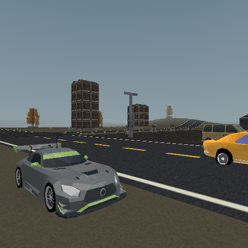

# Motor District performance work plan

This document retains the original task specifications and records measured
integration results below. Proposed acceptance criteria are not claims that
every experiment shipped. See [integration results](#integration-results-2026-09-12).

## Next universal experiment: indexed bounds cache (2026-09-14)

The physical PS2 lean-vehicle fixture spends roughly 7–8.5 ms in the inclusive
bounds bucket at the garage. That does not prove cache lookup owns the entire
bucket. The current `StapipBagBBoxesCacher::getCache` linearly scans every
retained entry for each submitted bag, and entries live for 250 frames.

1. Attribute lookup cost/probe counts in an isolated fixture before changing it.
2. Replace the linear lookup with a compact index keyed by buffer id and VU
   package capacity, if the measured cost warrants it. Avoid steady-state
   allocation and unbounded growth; retain existing bbox ownership and lifetime.
3. Preserve version/count invalidation, capacity variants, rewritten buffers,
   address reuse, eviction and scene reload behavior. Never cache a frustum
   result without its view and transform dependencies.
4. Compare baseline/candidate correctness and warmed frame cost with identical
   camera, assets and devkit settings. Include moving/dynamic geometry and
   expiry/reinsertion. Report memory cost as well as time; a tiny lookup win is
   not a claim to recover the entire bounds bucket.

Scope: generic engine bounds cache only, no road changes, model reductions,
quality loss, VU program rewrite or devkit changes. Keep or reject this bounded
experiment from evidence before proceeding to multi-entry transform reuse or
broader render submission changes. Sol owns the experiment; the coordinator
owns integration and hardware comparison. See the example's September 14 raw
hardware measurements for the reference configuration.

### Indexed bounds cache result

The experiment is retained. `StapipBagBBoxesCacher` now hashes the existing
buffer-id/VU-capacity key into 256 fixed buckets. Collision links are vector
indices stored in each cache item, so lookups allocate nothing and vector
relocation cannot invalidate the index. Expiry still happens after 250 unused
frames; an erase rebuilds the index after vector compaction. The existing
`bboxVersion`, vertex-count and capacity checks still decide whether the owned
boxes are reused, recalculated or recreated, including recycled addresses.

The fixed index costs 1,024 bytes on the 32-bit EE plus four bytes per retained
entry (about 2.5 KiB at 384 entries). A deterministic host workload modelling
384 aligned buffer addresses, three capacities, expiry/reinsertion and changing
versions/counts observed 1,156,543 indexed probes versus 132,068,375 probes for
the old linear reference (114.2 times fewer). This is an opportunity model, not
an EE timing result. A separate host shim compiled the real cacher source and
matched a linear reference across 700 entries, collision chains, middle-entry
expiry/compaction, reinsertion, capacity variants and version/count refreshes.

One non-alternated physical-PS2 candidate run used the same parked PAL 512x512
32-bit native-raster fixture and retained identical triangle counts. Compared
with `hardware-lean-repeat-frame-cost.csv`, mean inclusive bounds time moved
from 6.806 to 4.790 ms (garage day), 8.469 to 5.915 ms (garage night), 3.947 to
2.637 ms (outer day), and 5.083 to 3.376 ms (outer night), a 29.6-33.5%
reduction in that bucket. Whole-frame means improved in the two day phases but
were neutral/slightly worse in the two night phases; the run was not alternated
with a fresh baseline. The result supports the indexed lookup and does not
claim to recover the full historical 7-8.5 ms bounds bucket or to convert the
included-bucket delta directly into FPS.

[Hardware summary](../examples/vehicle-playground/authoring/frame-cost-2026-09-14/hardware-indexed-cache-summary.json)
and [raw candidate frames](../examples/vehicle-playground/authoring/frame-cost-2026-09-14/hardware-indexed-cache-frame-cost.csv)
retain the configuration, binary hash and comparison reference.

## Original baseline and measurement rules

Start from `1ce38d2b`, which includes bounded road chunks and the static-model
performance branch. The previous short PCSX2 software-renderer samples were
25.0 FPS by day and 22.1 FPS at night at the on-foot spawn camera, PAL 512x512,
debug configuration. A separate serialized day render capture reported
36.562 ms Total. These are different instruments; do not convert the serialized
capture directly into ordinary FPS or add its `_included` rows to parent costs.

The current roads contain 93,150 vertices in 90 chunks. Road drawing accounts
for roughly 7-8 ms in the sampled serialized captures. Environment mesh and
terrain LOD distances are zero. Live Link, Live Debug, Live Logic and Time
Machine are enabled. Wheels and the shared reflection capture currently lack
separate named phase rows.

The first agent audit confirmed that the shared reflection target already
updates every second frame. The next task must improve or validate that policy,
not claim savings against an incorrectly assumed every-frame baseline.

- Freeze the camera, input and test configuration in reproducible fixtures.
  Record traffic state or disable traffic identically in an isolated attribution
  fixture; also test normal traffic in the acceptance drive.
- Separate first-use allocation/loading from steady-state costs. Record cold
  starts separately. Reject stale telemetry by checking advancing frame IDs.
- Measure ordinary frame times/FPS outside one-shot serialized render captures.
  Record medians, slow frames and variability, not just the best reading.
- Alternate baseline and candidate boots when comparing small gains. Run no
  competing builds or benchmark emulators during a measurement window.
- Compare images for exact optimizations. For approximation, publish the error
  budget and inspect motion, silhouettes, seams and transitions, not only a
  parked screenshot.
- PAL targets 50 Hz (20 ms); a 60 Hz target needs an explicit NTSC fixture and
  a 16.67 ms budget. Changing video mode alone is not a speed optimization.
- Keep emulator results separate from real-console results. Low measured VU
  wait alone does not prove the GS is idle or the frame is solely EE-bound.

## Assignment and ownership

Three Terra subagents (`gpt-5.6-terra`) implement five tasks in isolated worktrees.

| Agent | Tasks | Branch |
|---|---|---|
| `terra_wheels` | 2: wheel preparation/rendering | `codex/district-wheel-performance` |
| `terra_roads_lod` | 3: adaptive roads; 4: environment LOD | `codex/district-road-performance` |
| `terra_measure_reflections` | 1: measurement/debug overhead; 5: reflection reuse | `codex/district-reflection-performance` |

All branches start at the same baseline. The coordinator owns integration,
version/format reconciliation, final combined validation and documentation
index/backlog updates. Agents may change separate sections of `templates.cpp`
in their own worktrees; no agent edits another agent's checkout. Heavy builds
and PCSX2 measurement slots are serialized by the coordinator. The measurement
agent has the first slot; others can inspect code and run lightweight host
checks meanwhile.

## Task 1: establish the remaining costs and debug overhead

Owner: `terra_measure_reflections`; priority: first, because other gains need a
trustworthy baseline.

1. Add a named shared-reflection capture phase. Coordinate with the wheel agent
   adding `Wheels`; keep counters mutually exclusive and label any included
   child counters explicitly.
2. Prepare fixed day/night spawn fixtures and a representative driving view.
   Provide a reusable procedure or script that restores temporary settings and
   stores configuration, frame IDs, timings and captures together.
3. Compare the current debug build, debug with optional live features disabled,
   and release. Preserve equivalent scene content and video settings. If release
   lacks live telemetry, use the ordinary FPS HUD or a minimal equivalent
   instrument; do not silently compare incompatible counters.
4. Attribute any difference before changing shipped settings. Identify whether
   periodic file polling/capture, diagnostics or rendering accounts for it.
5. Produce a table of per-phase costs, ordinary performance and measurement
   limitations. Report an inconclusive comparison as inconclusive.

Acceptance: reproducible fresh measurements; separate wheel/probe costs;
debug/release visual and gameplay parity; no permanent loss of development
features solely to improve a benchmark screenshot.

## Task 2: avoid unnecessary wheel work

Owner: `terra_wheels`; primary code: generated wheel storage and
`renderVehicleWheels()` in `src/templates.cpp`.

1. Reject invisible/off-screen vehicles before building their wheel arrays.
   Use a conservative bound that covers steering, suspension travel, roll,
   wheel radius and vehicle scale. Match the actual view being rendered.
2. Preserve existing distance and body-LOD rules: far body meshes already carry
   rest-pose wheels, so do not submit a duplicate set.
3. Cache invariant wheel UVs and modulation colors. Separate definitions and
   texture identities; changes to active instance count/order must not leave
   stale array ranges or mix the three cars' palettes.
4. Evaluate immutable wheel geometry with per-wheel matrices/VU transforms
   against the current CPU-transformed batching. Extra draw calls can outweigh
   saved arithmetic: implement the larger change only with supporting evidence.
5. Add the `Wheels` phase and measure parked, driving, steering, off-screen,
   near/far transition and multiple-definition cases.

Acceptance: correct body/wheel alignment, spin and suspension; no culling pops,
missing/duplicate wheels or wrong textures; exact optimizations preserve image
output; reduced measured wheel/whole-frame cost without memory instability.

## Task 3: adaptive road geometry

Owner: `terra_roads_lod`; primary code: `src/roadgen.cpp` and its generated
`buildRoads()` twin in `src/templates.cpp`.

1. Audit the actual longitudinal/crosswise sampling and flat-span reduction.
   Count retained geometry by road/shape to identify useful opportunities.
2. First try exact reductions on linear/planar sections. Do not assume equal
   shoulder heights imply a flat interior or that planar geometry guarantees
   equivalent interpolated texture coordinates.
3. If approximation is needed, define a world-space surface and UV error budget
   against the original dense reference. Retain samples around crowns, crests,
   saddles, bends, height discontinuities and segment endpoints.
4. Preserve winding, road width, texture arc length, junction continuity and
   the lift above terrain. Keep local chunk bounds/budgets; do not turn each
   entire road into one oversized culling box.
5. Keep editor drawing/picking and generated geometry consistent. Extend the
   existing road twin oracle with linear slopes, curved slopes, crowns,
   saddles, transitions, segment/chunk boundaries and scene revisits. Compare
   sampled surfaces/UVs to the dense reference as well as host/runtime twins.

Acceptance: measured vertex and road-time reduction; no floating/buried roads,
cracks, broken texture mapping or picking regressions; meaningful error checks
and slope/crest driving validation.

## Task 4: enable useful environment LOD

Owner: `terra_roads_lod`; primary files: the example manifest and deterministic
`authoring/build-district.py`.

1. Inventory model triangle/material counts, screen sizes and current per-object
   overrides. Preserve vehicle-specific LOD behavior.
2. Prepare isolated model-only, terrain-only and combined distance variants.
   Treat initial distances as experiments, not approved production values.
3. Keep detailed silhouettes near the camera. Verify memory use and first-use
   tier generation/allocation; more LOD levels are not automatically free.
4. Drive across thresholds in both directions. Inspect horizon movement,
   lighting, road/terrain intersections, light pools, shadows and reflection
   silhouettes. Coarsening terrain must not bury a road that follows the dense
   heightmap.
5. Select settings only after visual/performance validation and encode them in
   the authoring script so regeneration cannot undo the optimization.

Acceptance: reduced submitted geometry and repeatable frame-time improvement
without distracting transitions, changed collisions or geometry intersections.
Reject a setting that only improves the parked-camera benchmark.

## Task 5: reuse reflection captures safely

Owner: `terra_measure_reflections`; primary code: shared environment capture
and the corresponding dynamic-reflection sampling basis.

1. Measure capture and reflective-body costs separately before choosing policy.
   Keep the existing shared probe; do not multiply captures per car.
2. Detect conditions permitting reuse: unchanged capture pose and unchanged
   relevant scene/lighting, or a bounded update cadence with an explicit quality
   tradeoff. Unsupported dynamic conditions retain the existing every-second-frame cadence.
3. Preserve the original capture basis when reusing its texture. Sampling an old
   image using the current camera basis produces sliding reflections even if
   the capture itself is valid.
4. Invalidate on first use, scene reload, teleports, reflection mode changes,
   day/night changes and relevant reflected-object visibility/transform or
   lighting changes. Account for alternate cameras and split-screen semantics.
5. Test idle, straight driving, hard turns, camera orbit, reflected-object
   movement/hide-show, day/night toggles and re-entry after a scene change.
   Verify that all three car materials still reflect actual scenery.

Acceptance: measurable savings in supported cases, no stale day/night image or
reflection swimming, correct first frame and invalidation, bounded memory use.
If temporal reuse does not pass these gates, retain the measurement work and
report the experiment rather than enabling a visually broken shortcut.

## Integration and delivery

- Review each branch independently; do not add the claimed gains of separate
  experiments as if they were guaranteed to combine.
- Reconcile source changes, version/format additions and generated examples.
  Every implemented change carries English documentation and relevant skill
  twins; new serialized fields require normal format handling.
- Build the Release editor and native PS2 game, run vehicle properties and road
  oracles, then compare the integrated result with the same baseline fixtures.
- Exercise all three cars, AI traffic, acceleration/braking/turning, LOD
  transitions and day/night switching. Inspect captures and runtime errors.
- Publish accepted changes, rejected experiments, ordinary performance and
  visual tradeoffs. Keep real-hardware and Linux verification status explicit.
- Update this plan/backlog as tasks complete; do not mark unvalidated work done.

## Integration results, 2026-09-12

## Frozen-camera integration measurement

The baseline was `1ce38d2b`. The integrated build was `af8e6762`, containing
the wheel and shared-reflection basis work plus `origin/main`'s static
submission and baked-shadow merge. Both were measured with frozen, parked
camera fixtures in the PAL software renderer, without competing builds or
benchmark emulators.

| Camera | Baseline FPS | Integrated FPS |
| --- | ---: | ---: |
| Garage, day | 25.00 | 25.00 |
| Garage, night | 20.37 | 25.00 |
| Outer district, day | 50.00 | 50.00 |
| Outer district, night | 50.00 | 50.00 |

Quiet-debug and release repeated the integrated 25 / 25 / 50 / 50 result. The
comparison is ordinary frozen-camera FPS, not serialized render-cost timing;
the two instruments must not be converted into each other. It establishes no
60 FPS target, hardware result, Linux result, or full moving-traffic/reflection
matrix.

## Accepted work

### Task 1: measurement and debug overhead — complete for the frozen fixtures

Render-cost capture has a dedicated `Reflections_shared_probe` phase around
only the shared 128x128 target render. Reflective material samples remain in
their normal object rows, so phase totals do not double-count them. The frozen
fixtures distinguish ordinary FPS from serialized timing; quiet-debug and
release were compared with equivalent scene/video state. Their matching samples
do not support a claim that disabling development facilities is a performance
optimization.

### Task 2: wheels — integrated

The integrated wheel work is included in the measurements above. Its detailed
near/far, driving and multi-definition evidence belongs to its owning change;
this plan does not add it to unrelated gains.

### Task 3: roads — exact planar reduction verified

The actual district remains at **93,150 vertices in 90 chunks**. The existing
bounded-span reduction is retained. Generic planar-slope fixtures improved, but
they are not evidence that the authored district changed or that its FPS gain
combines with other work.

**Reopened and completed, 2026-09-16 (1.105).** The sentence above is the whole
problem in one line: the reduction improved generic planar fixtures and did
nothing to the authored district. It was all-or-nothing — one full-width quad,
or all `crossSteps` lateral cells — and the district's streets are curved
splines over a heightfield whose cell is 4 world units against the road's
0.5-unit lateral sampling, so the full width was almost never one plane and the
dense mesh always survived. Step 2 of this task ("first try exact reductions on
linear/planar sections") had been read as *the whole span*; the reduction that
pays is **per sub-span**.

Merging maximal coplanar runs instead takes the district from **31 050 road
triangles in 470 VU1 packages to 21 252 in 337**, with the surface and every
T-vertex seam exactly unchanged and a worst UV drift of 0.36 of a texel. On the
physical console that is **−0.358 ms of garage-day `work` and −0.591 ms in the
outer-road poses**. The oracle this task asked for was extended, not bypassed:
its tripwire fired on the changed reduction, and it now carries three checks
that print their worst case — surface, UV in texels, and an exact T-vertex seam
test — plus three heightfield fixtures, because none of the original eight can
exercise a lateral merge at all. See [roads.md](roads.md), "The lateral budget",
and [the raw evidence](../examples/vehicle-playground/authoring/road-lod-2026-09-16/README.md).

**And the acceptance criterion this task should have carried.** The road surface
is 31 050 triangles in the MAP; the garage-day frame contains 614 of the 9 798
removed. A content reduction has to be measured in the pose that is slow, not in
the map inventory.

### Task 5: shared reflection capture — complete correctness and attribution

The shared `@sky` target already refreshed every second frame before this work;
there was no every-frame baseline to claim as a saving. The runtime now stores
the level capture basis with the target and samples a retained target using that
same basis, preventing stationary scenery from swimming when the camera turns.
Scene reload invalidates the basis and forces the next non-split classic view
to capture. Reflected-ray probes keep their per-object basis, and split views
retain the existing conservative no-bracket fallback.

No more aggressive temporal content reuse is enabled. Day/night changes,
teleports, moving or visibility-changing reflected geometry, alternate views
and active gameplay make a broader reuse policy unsafe without a tested error
budget. All three vehicle paint materials and reflection texture memory remain
in scope.

**What the probe costs is now measured, 2026-09-16.** Step 1 of this task asked
for capture and body costs separately before choosing policy, and the capture
half had never been priced on hardware. A bounding probe — the shared 128x128
target refreshed every FOURTH frame instead of every second, forcing the
constant of the cadence that is already adaptive, with the retained capture
basis untouched — buys **1.033 ms of garage-day `work` and 1.278 ms at night**,
0.54 in the outer poses, for −2 643 triangles and −6.5 packet flushes a frame.
Halving the cadence removes half the probe, so **the whole shared probe costs
about 2.07 ms of garage day and 2.56 ms of garage night**.

That is larger than the road reduction and the terrain LOD together in the
garage, and it makes this task's remaining half the most valuable item on the
district. It is **not** a recommendation to ship the longer cadence: a 12.5 Hz
reflection on a car the player is looking at is a visible thing and nobody has
looked. The three options step 2 leaves open — fewer objects in the probe pass,
a coarser LOD for it, or a longer cadence — are now worth designing against a
real number. [Evidence](../examples/vehicle-playground/authoring/road-lod-2026-09-16/README.md).

**And step 2 is now DONE, 2026-09-16, as a reuse budget rather than as a
cadence** ([reflective-materials.md](reflective-materials.md), "The reuse
budget"; [raw evidence](../examples/vehicle-playground/authoring/reflection-probe-2026-09-16/README.md)).
The three options were priced against a per-producer inventory of the frame
first, which is what settled which one to build:

| option | what it is worth in the garage | why |
| --- | --- | --- |
| fewer objects | ~0 triangles | four near buildings are everything the probe draws there; three of the seven submitted objects already draw nothing and cost 15 bags a hit |
| a coarser LOD for the probe pass | up to ~70% of 10 413 triangles a hit | but the district bakes **no LOD tiers at all** (`meshLodDistance` is 0, and the bake gates on it), and swapping the live bag's tier twice a frame bumps `bboxVersion` and throws away the bbox and retained-command caches — so it needs an asset re-bake AND a second resident bag set per reflected part |
| **reuse when nothing changed** | **everything, when nothing is moving** | it is step 2 of this task verbatim, it is codegen only, and it cannot make anything worse |

The probe now skips its cadence beat while nothing that feeds the capture has
moved, and "moved" is a **number in pixels of the probe's own 128-pixel
target** rather than a frame count. Aim, camera travel seen as parallax on the
nearest reflected object, and the sun and moon all convert through one
pixels-per-radian factor and are summed. Colour is compared at the 8-bit
precision the GS stores and content is compared exactly, so neither is traded
against the budget. The every-second-frame cadence stays the ceiling, so the
worst case is the old behaviour — which is why the default of 1.0 pixel is safe
to enable for projects that predate the setting.

Step 5's test list was run as three fixtures rather than by hand, and the third
is the one that matters: a **parked camera with the SCENE changing** — a
reflected object hidden and shown, a reflected object sliding, the day/night
value flipping — which is where a reuse gate fails by holding an image it
should have thrown away.

## Full-asset hardware follow-up (2026-09-14)

The independent [physical recheck](performance-hardware-recheck.md) supersedes
the incomplete agent fixture evidence for the transform-cache and DMA
clip-table experiments. Neither candidate earns integration. The next proposed
universal step was hardware timeline attribution and controlled bottleneck
experiments. Those [tools and seven physical runs are now complete](hardware-profiler-results.md):
prioritize EE-side static submission and host-I/O profiles, not GS pixel fill.

## Validation status and remaining scope

- Normal-traffic smoke validation passed after integration: coupe and Tristar
  entry/acceleration/braking, coupe steering and the day/night menu. Close
  captures checked the three model appearances; AI logs exercised distant tiers.
  The final native build also returned a complete serialized report with
  `Wheels`, `Reflections_shared_probe` and `Shadow_decals`. The last token fixes
  a main-merge defect: the prior space made the host reject the whole report.
- LOD trials are concluded for this pass: model 64 and model 64 / terrain 96
  both repeated 25 / 25 / 50 / 50. Keep authored distances at zero; no full
  crossing acceptance is claimed for these discarded variants.

  **RE-RUN, 2026-09-16, and the pair splits.** Displayed FPS could not have
  shown anything here: the frame was pinned to a vsync rung, so no reduction in
  VU1 or EE work could move it. Measured against `work_ms` and the triangle
  counter on the physical console, the two halves have **opposite signs**.
  *Mesh LOD 64* removes 592 triangles and takes 0.32 ms out of `dispatch` and
  0.31 ms out of the VU1 wait, and still makes the frame **0.19 ms slower** —
  the per-object tier selection costs more than the geometry it saves at this
  object count, visible as `prepare` +0.269 and `packet` +0.153. It is now
  refuted with a mechanism rather than with a null result. *Terrain LOD* is the
  useful half: **−0.437 ms of garage-day `work` at 96**, −0.530 at night, and
  nothing worse anywhere. Step 4's own warning is what bounds it — a coarse tile
  must not bury a road that follows the dense heightmap — and that is now a
  number: across all 49 149 of the seven roads' dense sample positions the
  every-2nd-sample mesh rises at most **0.0175** above a road lifted **0.12**,
  while the every-4th-sample mesh rises **0.3807** and buries it over about 6%
  of its area. The second band starts at 2.2x the authored distance, so the
  setting must keep the whole map inside the first: **160** does (the second
  band would start at 352 units in a 320-unit map) and keeps −0.380 / −0.454.
  The worst shape settling at a band crossing subtends 0.57 pixels on the PAL
  raster, which answers "no distracting transitions" with a measurement.

  **The authored distances stay at zero all the same, and the reason is step 4
  of this task.** A parked fixture cannot see the one cost terrain LOD has —
  the tile rebuild when a band moves with the player — and "reject a setting
  that only improves the parked-camera benchmark" is this plan's own rule. One
  drive across the 160-unit band in both directions is the whole remaining gate.
  Evidence, arms and harnesses:
  [road-lod-2026-09-16](../examples/vehicle-playground/authoring/road-lod-2026-09-16/README.md).
- The baseline repeat after all candidates returned 25 / 20 / 50 / 50.
  [Raw results](../examples/vehicle-playground/authoring/performance-results.json)
  record both baseline runs and all candidates.
- Re-run day/night, all-car, traffic, camera-orbit, reflection hide/show and
  scene-reload cases after any later rendering integration.
- Confirm representative results on physical PS2 before quoting hardware
  performance, and test Linux separately.

### Hardware timeline follow-up (1.92)

Native editor viewing and finer package/classification/copy/packet scopes are
implemented. The bounded same-range classification reuse trial was rejected: no
convincing submission-time gain on physical PS2. Larger submission scheduling
changes remain open; do not treat this as a shipped engine speedup. See
[hardware profiler results](hardware-profiler-results.md).

### Bounded static submission follow-up (1.93)

Resident small-bag submission batching is retained after a complete physical
four-pose A/B, repeated baseline, image checks and texture/pipeline stress.
Render submission saves 0.95/1.14/0.37/0.34 ms; a larger-bag extension was
rejected. This is not a 50 FPS or whole-game FPS gain claim. Next measure
persistent package/geometry-command preparation; roads remain deferred. See
[the experiment and raw evidence](static-submission-batching.md).

### The district was never actually batched (1.98)

Counted before anything was changed: of 142 authored objects, 111 are
batchable shapes and **27 carried `batchStatic = 1` — every one a primitive
box, and not one of the 70 imported models.** All 70 models carry
`drawDistance = 145`, and the build-time rule `if (o.drawDistance != 0.0f)
return false;` was rejecting them wholesale. Three rounds of geometry and
microprogram work had been measured against a scene whose compact static-model
batching (#269) was, in practice, switched off.

The suspected cause — `dynamicLighting` — rejects **nothing at all** here; no
object in the scene sets it. That is consistent with the `cull_td` probe in
[vu1-and-dma-cache-cost.md](vu1-and-dma-cache-cost.md) reading +0.000 ms. The
~61% of colour-program triangles that have a dynamic light picked get it from
`StaPipCore::render`'s runtime per-bag pick, which never consults batching
eligibility. **Two mechanisms, one name.**

The cut-off now groups the batch instead of disqualifying its members
([model-pipeline.md](model-pipeline.md), "Draw distance on a batch"), taking
`batchStatic = 1` from 27 objects to 87. The half-cell footprint guard that
protects frustum culling is untouched. Hardware measurement is the owner's;
what is established here is the population and the mechanism.
