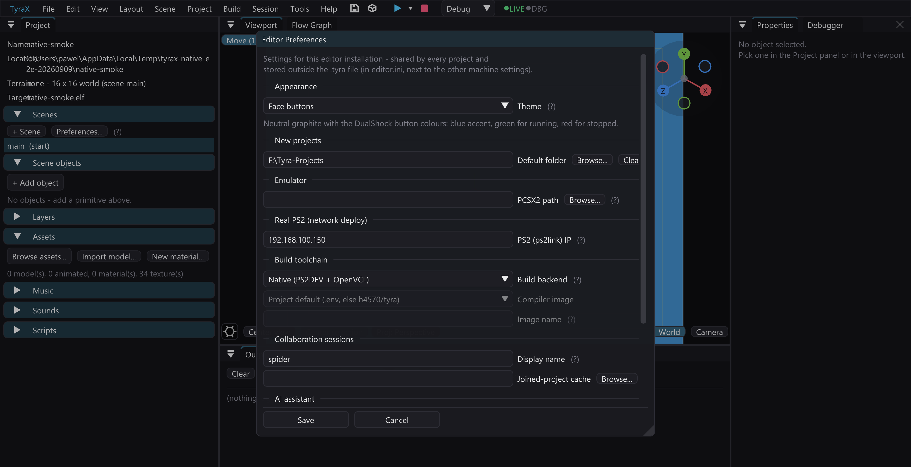

# Native PS2 toolchain

TyraX builds games without Docker by default, using a pinned PS2DEV toolchain and
the reviewed VU tools shipped as source with the editor.

Measured once end to end on a six-core Linux desktop, from nothing: the
toolchain install (254 MiB download, extract, build OpenVCL and run its tests,
build vclpp, bin2s and audsrv) takes about **six minutes**, and the first game
build — the whole engine plus the generated sources — about **eight** on top of
it. Both are once. Later builds are the incremental `make` and take seconds.

## What the first build installs

The editor runs `tools/toolchain/setup.sh` lazily. On Linux it runs directly; on
Windows `setup.ps1` invokes the same script through WSL, so both platforms use
the same Linux binaries and produce the same PS2 code. The only downloaded
artifact is the official PS2DEV v2.0.0 release archive. Its SHA-256 is pinned and
verified before extraction. It contains GCC, binutils, PS2SDK and the console
utilities that are impractical to bootstrap during every editor installation.

The parts TyraX changes are in this repository and are compiled locally:

- `vendor/openvcl` — TyraX fork snapshot `89efa51e`, based on upstream `a5867c3`;
- `vendor/vclpp` — the MIT-licensed VCL preprocessor at `00e44ecf`;
- `tools/toolchain/bin2s` — the AFL-2.0 PS2SDK utility at `8f397576`;
- `vendor/tyra/audsrv` — the LGPL-2.0 audsrv fork used by the engine.

Setup runs the complete OpenVCL suite before installing it. A content hash of
those source trees forms the toolchain identity, so changing a compiler flag or
vendored source invalidates both the tool install and cached VU/engine objects.

It lands in the editor's own configuration directory, under `toolchain/ps2dev`:
`%LOCALAPPDATA%\tyra-editor\toolchain\ps2dev` on Windows,
`${XDG_CONFIG_HOME:-~/.config}/tyra-editor/toolchain/ps2dev` on Linux. **That
is where a manual `setup.sh` run puts it too** — one copy, shared, because the
install is ~940 MB and an OpenVCL build, and having the manual command and the
editor disagree simply meant paying for both. Override it with `TYRAX_PS2DEV`
or a positional argument.

## Host prerequisites

Linux needs `build-essential`, CMake, curl, tar and rsync. Windows needs WSL
with a Debian/Ubuntu distribution and the same packages inside it.

**On Linux you normally install none of this by hand.** `./setup.sh --deps` in
the repository root installs the editor's own build dependencies *and* these,
for apt, dnf, pacman or zypper — one command for both halves, because a machine
that builds the editor and then fails the first game build on a missing `curl`
is the least helpful way to learn about the split. `prepare-host.sh` is the
game half on its own, for a host that wants nothing else.

A normal build only checks these host prerequisites and never changes the
distribution. The dedicated bootstrap installs them through `apt` only after an
explicit `--install`/`-Install` choice:

```bash
bash ./tools/toolchain/prepare-host.sh --install
```

```powershell
.\tools\toolchain\prepare-host.ps1 -Install
```

The Windows installer exposes the same operation as the unchecked **Prepare the
native PS2 toolchain in the default WSL distribution** task. Selecting it may
open a console for the WSL user's `sudo` password; it then provisions the pinned
toolchain too. Updates do not silently inherit the choice. Docker and Docker
Desktop are not required for normal builds.

For a manual install — the same install the first build would do, so afterwards
Build & Run has nothing left to fetch:

```bash
./tools/toolchain/setup.sh
```

```powershell
.\tools\toolchain\setup.ps1 -InstallHostDependencies
```

For CI or a scripted build, `native-build.ps1 -PrepareHost` performs the same
opt-in bootstrap before compiling. Without that switch it remains read-only with
respect to the WSL distribution and prints the command above when a tool is
missing.

## Docker fallback

Choose **Docker fallback** under *Edit > Preferences > Build backend*, or pass
`--docker` after the project path to the headless `--build` command. The fallback
keeps the previous volume-based incremental build and can still select an image
through `TYRAX_IMAGE`. `docker/Dockerfile.fromsource` compiles the same vendored
OpenVCL, vclpp and bin2s trees as the native backend and runs the OpenVCL tests,
so fallback does not mean a second compiler implementation. The inherited
`docker/Dockerfile` remains solely as the Sony-vcl A/B reference.



### Coming back from the Docker fallback

The container writes into the project through a bind mount **as root**, and on
Windows WSL stores that ownership in the file's metadata. A later native build
runs as your normal user, so every generated file the container left behind is
undeletable from WSL - `rm` reports *"Permission denied"* for the whole of
`bin/` and `obj/` even though the NTFS ACL grants you full control, and the
build fails on its first clean step:

```
[editor] Toolchain changed - rebuilding engine and game objects...
rm: cannot remove '.../examples/showcase/obj/gen': Permission denied
[editor] Native build failed.
```

`native-build.sh` handles this itself: when a native `rm` cannot remove one of
the generated trees it deletes it through Windows (`cmd.exe /c rd /s /q`), which
ignores the WSL metadata, and `make` recreates the tree as the current user
afterwards. Only `bin/`, `obj/` and the cached engine objects are ever dropped
this way - never sources or resources. To clear it by hand, delete the
project's `bin/` and `obj/` from Windows (Explorer, or `Remove-Item -Recurse
-Force`), not from the WSL shell.

Either clean puts the dropped tree's own `.gitignore` back. `bin/.gitignore`
and `obj/.gitignore` are committed files - they are what keeps those
otherwise-empty directories in git - so wiping the tree used to leave the
checkout showing a deleted tracked file after every toolchain change and every
*Build > Clean*. The file is preserved byte for byte, so a project that
customised it keeps its own version.

## Licences and provenance

Every redistributed source tree carries its upstream licence file. TyraX does
not bundle general-purpose Linux host binaries such as CMake, GCC or `rsync`:
they are dynamically linked to, and maintained by, the selected distribution;
duplicating an entire Linux userland would enlarge the installer substantially
and create a second security-update channel. The PS2-specific binaries are
either downloaded as the pinned official PS2DEV archive or built from the
redistributable sources shipped with TyraX.

The package also includes `THIRD-PARTY-LICENSES.md`, which records the exact
bases and the modification status. The downloaded PS2DEV archive is not
redistributed by TyraX; it comes directly from the official PS2DEV release and
its upstream licences and source links travel inside that distribution. No Sony `vcl` binary
is installed by the native path.
