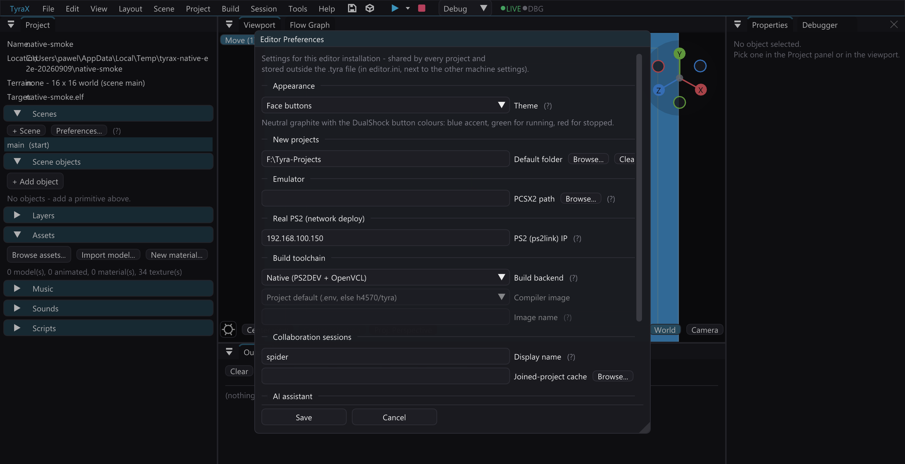

# Native PS2 toolchain

TyraX builds games without Docker by default, using a pinned PS2DEV toolchain and
the reviewed VU tools shipped as source with the editor.

Measured once end to end on a six-core Linux desktop, from nothing: the
toolchain install (254 MiB download, extract, build OpenVCL and run its tests,
build vclpp, bin2s and audsrv) takes about **six minutes**, and the first game
build — the whole engine plus the generated sources — about **eight** on top of
it. Both are once. Later builds are the incremental `make` and take seconds.

## What the first build installs

The editor runs `tools/toolchain/setup.sh` lazily. On Linux it runs directly; on
Windows `setup.ps1` invokes the same script through WSL, so both platforms use
the same Linux binaries and produce the same PS2 code. The only downloaded
artifact is the official PS2DEV v2.0.0 release archive. Its SHA-256 is pinned and
verified before extraction. It contains GCC, binutils, PS2SDK and the console
utilities that are impractical to bootstrap during every editor installation.

The parts TyraX changes are in this repository and are compiled locally:

- `vendor/openvcl` — TyraX fork snapshot `89efa51e`, based on upstream `a5867c3`;
- `vendor/vclpp` — the MIT-licensed VCL preprocessor at `00e44ecf`;
- `tools/toolchain/bin2s` — the AFL-2.0 PS2SDK utility at `8f397576`;
- `vendor/tyra/audsrv` — the LGPL-2.0 audsrv fork used by the engine.

Setup runs the complete OpenVCL suite before installing it. A content hash of
those source trees forms the toolchain identity, so changing a compiler flag or
vendored source invalidates both the tool install and cached VU/engine objects.

It lands in the editor's own configuration directory, under `toolchain/ps2dev`:
`%LOCALAPPDATA%\tyra-editor\toolchain\ps2dev` on Windows,
`${XDG_CONFIG_HOME:-~/.config}/tyra-editor/toolchain/ps2dev` on Linux. **That
is where a manual `setup.sh` run puts it too** — one copy, shared, because the
install is ~940 MB and an OpenVCL build, and having the manual command and the
editor disagree simply meant paying for both. Override it with `TYRAX_PS2DEV`
or a positional argument.

Sound conversion has the same contract as the Docker fallback: WAV effects
whose names end in `-loop.wav` are encoded with `adpenc -L`. The native build
also reads the loop byte from an existing ADPCM header, so an incorrectly
encoded but newer output is repaired instead of being accepted as fresh.

## Host prerequisites

Linux needs `build-essential`, CMake, curl, tar and rsync. Windows needs WSL
with a Debian/Ubuntu distribution and the same packages inside it.

**On Linux you normally install none of this by hand.** `./setup.sh --deps` in
the repository root installs the editor's own build dependencies *and* these,
for apt, dnf, pacman or zypper — one command for both halves, because a machine
that builds the editor and then fails the first game build on a missing `curl`
is the least helpful way to learn about the split. `prepare-host.sh` is the
game half on its own, for a host that wants nothing else.

A normal build only checks these host prerequisites and never changes the
distribution. The dedicated bootstrap installs them through `apt` only after an
explicit `--install`/`-Install` choice:

```bash
bash ./tools/toolchain/prepare-host.sh --install
```

```powershell
.\tools\toolchain\prepare-host.ps1 -Install
```

The Windows installer exposes the same operation as the unchecked **Prepare the
native PS2 toolchain in the default WSL distribution** task. Selecting it may
open a console for the WSL user's `sudo` password; it then provisions the pinned
toolchain too. Updates do not silently inherit the choice. Docker and Docker
Desktop are not required for normal builds.

For a manual install — the same install the first build would do, so afterwards
Build & Run has nothing left to fetch:

```bash
./tools/toolchain/setup.sh
```

```powershell
.\tools\toolchain\setup.ps1 -InstallHostDependencies
```

For CI or a scripted build, `native-build.ps1 -PrepareHost` performs the same
opt-in bootstrap before compiling. Without that switch it remains read-only with
respect to the WSL distribution and prints the command above when a tool is
missing.

## Docker fallback

The editor resolves the project directory to an absolute native path before it
starts the native helper. This matters for headless commands such as
`--build ./examples/cube`: the helper changes into the project, so forwarding
that relative spelling would append it a second time and fail before compiling.

Choose **Docker fallback** under *Edit > Preferences > Build backend*, or pass
`--docker` after the project path to the headless `--build` command. The fallback
keeps the previous volume-based incremental build and can still select an image
through `TYRAX_IMAGE`. `docker/Dockerfile.fromsource` compiles the same vendored
OpenVCL, vclpp and bin2s trees as the native backend and runs the OpenVCL tests,
so fallback does not mean a second compiler implementation. The inherited
`docker/Dockerfile` remains solely as the Sony-vcl A/B reference.

## Incremental builds

On Windows, native builds mirror the installed toolchain and generated project
into the WSL distribution's Linux filesystem under `~/.cache/tyrax/native/`.
Engine and project cache names hash their original absolute paths, keeping
different checkouts and projects isolated. The authored Windows project and
public toolchain install remain in their usual locations. A successful build
copies `bin/` back; debugger source paths point to the authored checkout.

This avoids thousands of dependency checks and large-object linker reads across
the Windows/WSL filesystem boundary. The toolchain mirror excludes installation
archives and refreshes only when its identity changes. Project inputs sync before
every build, including deletions, while cached `obj/` and `bin/` survive. Runtime
channels written on Windows are preserved during output sync. The first mirror
costs disk space and a cold engine/game build; later builds reuse it.

Linux projects already on a Linux filesystem build directly. For an A/B on
Windows, set `$env:TYRAX_NATIVE_DIRECT = '1'` before building to use the original
Windows paths; remove the environment variable to restore WSL caching. Rebuild
clears both the WSL intermediates and Windows project outputs. Removing the WSL
cache also starts a cold build, without changing authored sources.

The shared Makefile tracks the actual `bin/<name>.elf` and `bin/libtyra.a`
outputs. A build with unchanged sources and resources neither recompiles nor
relinks them. The game depends on the cached engine archive, so an engine rebuild
from another project also triggers the required relink. The engine is checked
by make on every native build, including retries after a failed compilation.

Changes to either Makefile invalidate compiled objects (compiler flags and
include paths can change there). The native backend copies the base Makefile
only when its content changes, preserving incremental builds. Resource copying
uses rsync and handles an empty resource directory without warnings. Engine
archives use the shared archive rule instead of overriding the ELF rule.
Embedded IRX data objects carry the EE compiler's CPIC ABI flag, eliminating
`linking abicalls files with non-abicalls files` warnings without changing their
binary payloads. Compiler warnings from generated C++ remain visible.

Toolchain identity hashes source contents and relative file names. Identical
source trees in different checkouts share the installed toolchain; their engine
caches remain separate. Updating from the older absolute-path identity causes
one toolchain rebuild and cache invalidation. Editing the compiler sources or
setup script still intentionally invalidates the install.
Each project's objects carry their own toolchain stamp too, so an already
updated shared engine cannot hide stale game objects in a different project.

Measured on Windows/WSL with a warmed `vehicle-playground` debug build: a
comment edit in one authored script took 50.5 s with the old Makefile on Windows
paths and 12.8 s with the WSL cache. Both compiled exactly one source; the latter
also includes provisioning checks, input sync and output sync. Unchanged cached
native builds took 6.7-7.6 s. The old Makefile's unnecessary link alone took about
70 s in a separate warmed run; the fixed Makefile skipped it in 6.1 s on Windows
paths. These are local iteration measurements, excluding code generation/baking
and cold setup, not clean-build or runtime FPS claims. The resulting game booted
in a private PCSX2 instance; IRX binary payloads stayed identical and script
addr2line locations retained the authored Windows path.
Moving Pica by 0.25 units and refreshing generated sources still rebuilt 11
translation units and took 103 s in the WSL cache. `scripts/script.hpp` includes
the full `scene_data.hpp`, coupling authored scripts and helpers to scene-table
changes. Splitting runtime types from generated scene tables is separate work;
the WSL cache does not remove the compiler cost of that dependency fan-out.

To measure iteration, copy an example outside the tracked project, build it
once to warm the cache, then time a second `--build`. Also test a one-file script
edit, a scene edit, and an engine edit separately: generated scene tables can
invalidate the large `terrain_game.cpp`, which still needs a full compiler pass.
Compare repeated alternating runs; exclude installation and cold-cache builds
from incremental timings.



### Coming back from the Docker fallback

The container writes into the project through a bind mount **as root**, and on
Windows WSL stores that ownership in the file's metadata. A later native build
runs as your normal user, so every generated file the container left behind is
undeletable from WSL - `rm` reports *"Permission denied"* for the whole of
`bin/` and `obj/` even though the NTFS ACL grants you full control, and the
build fails on its first clean step:

```
[editor] Toolchain changed - rebuilding engine and game objects...
rm: cannot remove '.../examples/showcase/obj/gen': Permission denied
[editor] Native build failed.
```

`native-build.sh` handles this itself: when a native `rm` cannot remove one of
the generated trees it deletes it through Windows (`cmd.exe /c rd /s /q`), which
ignores the WSL metadata, and `make` recreates the tree as the current user
afterwards. Only `bin/`, `obj/` and the cached engine objects are ever dropped
this way - never sources or resources. To clear it by hand, delete the
project's `bin/` and `obj/` from Windows (Explorer, or `Remove-Item -Recurse
-Force`), not from the WSL shell.

Either clean puts the dropped tree's own `.gitignore` back. `bin/.gitignore`
and `obj/.gitignore` are committed files - they are what keeps those
otherwise-empty directories in git - so wiping the tree used to leave the
checkout showing a deleted tracked file after every toolchain change and every
*Build > Clean*. The file is preserved byte for byte, so a project that
customised it keeps its own version.

## Licences and provenance

Every redistributed source tree carries its upstream licence file. TyraX does
not bundle general-purpose Linux host binaries such as CMake, GCC or `rsync`:
they are dynamically linked to, and maintained by, the selected distribution;
duplicating an entire Linux userland would enlarge the installer substantially
and create a second security-update channel. The PS2-specific binaries are
either downloaded as the pinned official PS2DEV archive or built from the
redistributable sources shipped with TyraX.

The package also includes `THIRD-PARTY-LICENSES.md`, which records the exact
bases and the modification status. The downloaded PS2DEV archive is not
redistributed by TyraX; it comes directly from the official PS2DEV release and
its upstream licences and source links travel inside that distribution. No Sony `vcl` binary
is installed by the native path.
