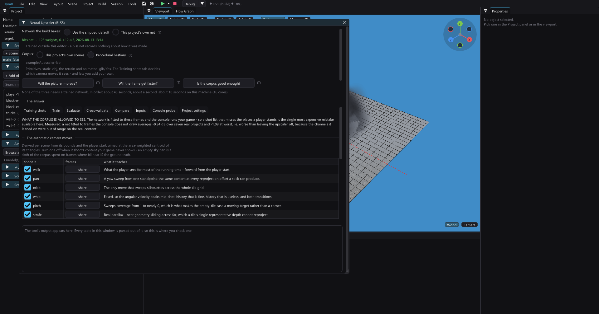

# Neural upscaler (BLSS)

BLSS (Bieda-Level-Super-Sampling or Bullshit-Level-Super-Sampling) renders the 3D scene at reduced resolution and reconstructs it for the
display. It is designed for fill-heavy scenes with haze, smoke and layered
transparency—not as a universal performance switch.



The feature is off by default. `examples/upscaler-lab` is the reference project.

## Should you use it?

Open **Project > Preferences > Display > Frame delivery** and click **Will the
frame get faster?**. The check takes about a second and measures the project's
coverage. Then use **Tools > Neural Upscaler (BLSS)** for the two other questions:
**Will the picture improve?** and **Is the corpus good enough?**

Two reconstruction modes are available:

| Mode | EE cost | Approximate break-even at 512x448 |
|---|---:|---:|
| Plain bilinear | 0.52 ms/frame | 2.6 full-screen coverages |
| Neural | 5.02 ms/frame | 13.1 full-screen coverages |

Start with **Plain**. It keeps the reduced raster and VRAM benefit without the
network cost. Use **Neural** only when evaluation shows useful quality headroom
and the scene is far above its higher break-even.

Real-PS2 measurements at 2x2 scale:

| Fixture | BLSS off | Neural on | Result |
|---|---:|---:|---:|
| light terrain + six slabs | 9.42 ms | 19.25 ms | 9.83 ms slower |
| `upscaler-lab` haze scene | 52.86 ms | 32.98 ms | 19.88 ms faster, 1.60x |

Triangle count is not the deciding metric. Repeated pixel coverage is.

## Settings

| Setting | Meaning |
|---|---|
| Use the upscaler | Project default; scenes may override it |
| Mode | Plain bilinear or per-tile neural reconstruction |
| Render scale | **2x2** quarter-area raster or **1x2** half-height raster |
| Sharpen | Strength of the optional sharpen pass |
| Temporal reuse | Allows history from the previous display buffer |
| Sub-pixel jitter | Adds temporal samples; off by default because it can visibly bob |
| Debug view | Kernel tint or feature logging |

At 1x2, the existing buffer layout saves no GS VRAM. Use it for horizontal
detail, not memory. At 2x2, both colour and depth targets shrink.

BLSS is per scene, but mixing native and reduced scenes changes permanent VRAM
layout. Preferences shows the exact cost for the current display mode.

## How it works

```text
3D scene -> reduced colour/depth target
         -> six geometric features per 32x32 display tile
         -> small 6 -> 12 -> 3 network
         -> point, temporal and sharpen weights
         -> 1-5 full-screen GS grid passes
```

The EE never reads the framebuffer. It derives motion, depth, edge, texel-density
and coverage features from submitted geometry. The network chooses reconstruction
weights; the GS interpolates them across a Gouraud-shaded grid. The previous
display buffer supplies history without another full-resolution allocation.

Empty or low-coverage tiles skip optional passes. The shipped network averages
about 1.8 passes; Plain always uses one.

The exact host/console contract is in
[BLSS reconstruction math](blss-reconstruction.md).

## Quality evaluation

Evaluation compares native rendering, plain bilinear, the selected network and
an oracle that finds the best weights available to this reconstruction design.
The oracle is the ceiling: if it improves less than about **0.10 dB**, training a
network cannot make the scene meaningfully better.

```bash
tyrax-editor --blss-eval <projectDir>
```

No custom net is required. The command uses the editor's shipped default and
prints a machine-readable verdict line.

Important limitation: the host corpus does not draw particle emitters. If a
project uses them, evaluation reports **NO VERDICT** for the picture instead of
pretending geometry-only results cover the whole frame. Coverage measurement
still counts their fill.

## Training

You do not need to train BLSS to use Neural mode. The editor ships a default net
trained on real projects plus the built-in bestiary. Leave-one-project-out tests
measured about **+0.29 dB** on unseen projects versus **+0.31 dB** for their own
nets. Per-project training can still gain a little more on scenes with headroom.

Use the window's **Train** tab or the CLI:

```bash
tyrax-editor --blss-train <projectDir> --all-shots -o blss.net
tyrax-editor --blss-eval  <projectDir> -i blss.net
```

Training is CPU-only and built into the editor. The corpus uses six automatic
camera moves plus enabled Cutscene Director tracks. Review **Training shots**:
a camera that misses the expensive part of the level teaches the wrong lesson.

For several projects, list them all. The word `bestiary` adds the built-in
procedural corpus:

```bash
tyrax-editor --blss-train examples/a examples/b bestiary --all-shots -o net
tyrax-editor --blss-eval examples/a examples/b bestiary --cv --cv-groups
```

Plain `--cv` holds out camera shots. `--cv-groups` holds out whole projects and
is the honest test for one network meant to ship across several games.

`--threads N` changes speed only: a fixed seed must produce byte-identical nets
and tables at every thread count.

## Incompatible features

The build refuses BLSS in a scene that also needs:

- depth of field, including a flow node that enables it;
- a linked portal;
- split screen with a second Player;
- frame extrapolation.

These features need full-resolution depth or reuse frame history in an
incompatible way. The editor names the scene and conflict before build; the
generated interlock prevents hand-edited projects from silently producing a
wrong frame.

Reflections, camera feeds and projected shadows are supported.

## Limits

- Features are geometric, so the network infers image detail rather than seeing
  rendered pixels.
- Reprojection uses one representative depth per tile; disocclusion inside a
  tile may ghost.
- Jitter can cause visible period-two motion, so it ships off.
- BLSS cannot be toggled by a flow graph inside a scene.
- Performance depends on the scene's real EE/GS balance. Confirm final timings
  on hardware, not PCSX2.

For the hardware profiler, calibration and reproducible A/B procedure, see
[Profiling](profiling.md). For GS memory pressure, see [GS VRAM](gs-vram.md).

## File map

- Host evaluation/training: `src/blss*.{hpp,cpp}`
- UI: `src/blss_window.cpp`, `src/blss_ui.{hpp,cpp}`
- Engine runtime: `vendor/tyra/engine/{inc,src}/renderer/core/blss/`
- Generated net: `inc/blss_net.gen.hpp`
- Project fields: `blssEnabled`, `blssNetwork`, `blssScale`, `blssSharpen`,
  `blssTemporal`, `blssJitter`, `blssDebugView`
