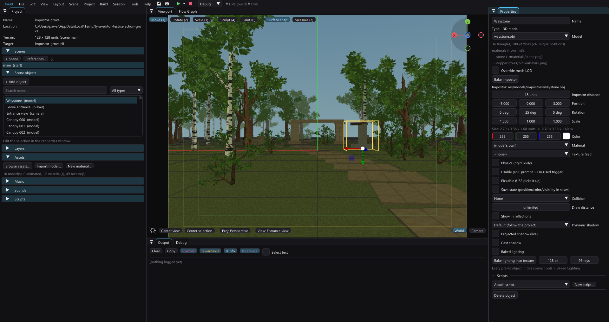

# Selecting objects in the viewport

Click a visible object to select it, or choose its name in the scene list; both
routes show the same yellow bounding box in the viewport.

The box encloses the object's actual bounds in world space (AABB), including its
position, rotation and scale. Models whose origin is at the ground get a box
around their whole height, rather than a unit cube buried at their feet. When
an impostor is visible, its selected camera-facing card is included too. Local
and collaborator selection outlines remain visible through scene geometry.

Picking static models first tests this box, then prioritizes a hit on the
visible mesh or selected impostor capture. Texture alpha below 128 does not count
as a solid hit. Clicking empty space inside a model's AABB still selects it when
there is no direct surface hit along that ray. A five-pixel grab
margin helps with small objects. **Wire boxes rank last**: areas, procedural
volumes and [invisible walls](collision-boxes.md#invisible-boundary-walls) are
drawn as outlines and usually enclose or fence a whole room, so a click aimed
through one selects what is inside, not the box (Aster's `boundary-south`
wall stood between the default camera and the whole pool, and used to take
every click at it). Hidden layers and generated procedural chunks remain
excluded.

## Reaching an object inside or behind another

Every click resolves to a **stack** — everything under the cursor, front to
back — and there are three ways to walk it:

- **Click the same spot again.** Each click steps to the next object in the
  stack and wraps around; a click elsewhere starts a new stack. The pivot of
  *View > Orbit around selected object* stays put while cycling, so the picture
  under the cursor does not move.
- **Right-click** the spot to see the stack as a menu, by name and type, with
  the selected one ticked. Choosing a row selects it (Ctrl adds to the
  selection) and a later left-click at that spot continues cycling from there.
- **Read the status line.** After a pick the menu bar says which object was
  selected, its place in the stack (`crossing (model) - 1/9 here`) and what the
  next click there would pick.

The transform gizmo does not get in the way of any of this. A large object's
gizmo lands on its origin — for a merged district mesh that is the middle of
the map, i.e. exactly where you just clicked — and a press on it that is
released without moving the mouse is treated as a **click**, which picks; only
a drag belongs to the gizmo. Such a click no longer registers as an edit
either (it used to mark the project dirty without changing anything).

This is editor selection only: collision, snapping surfaces and PS2 rendering
are unchanged. Animated model selection uses its existing cached model bounds;
this is not per-frame skinned-triangle picking. Asset reloads invalidate cached
pick meshes and alpha masks; painting a texture invalidates its pick mask too.
