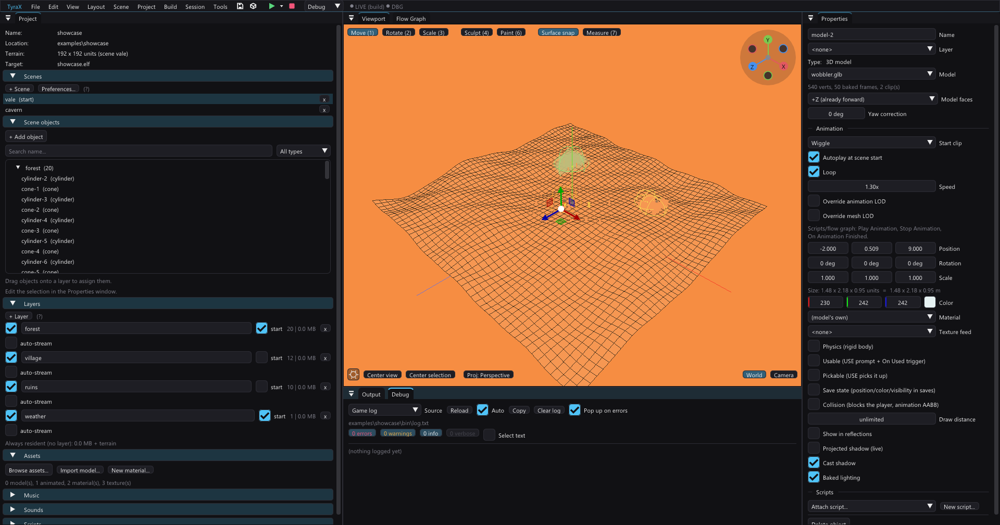
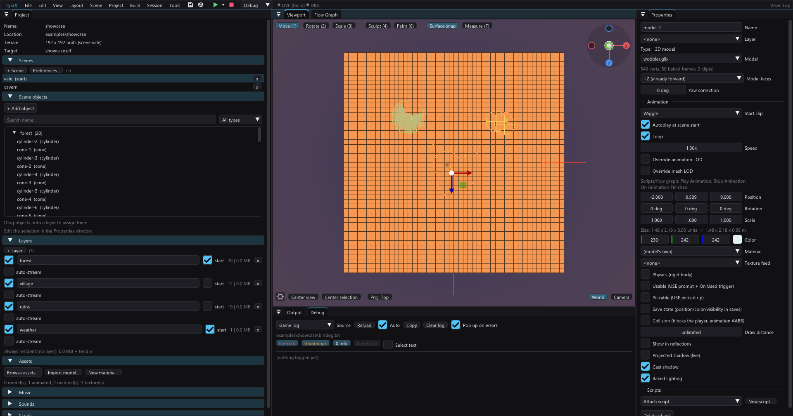
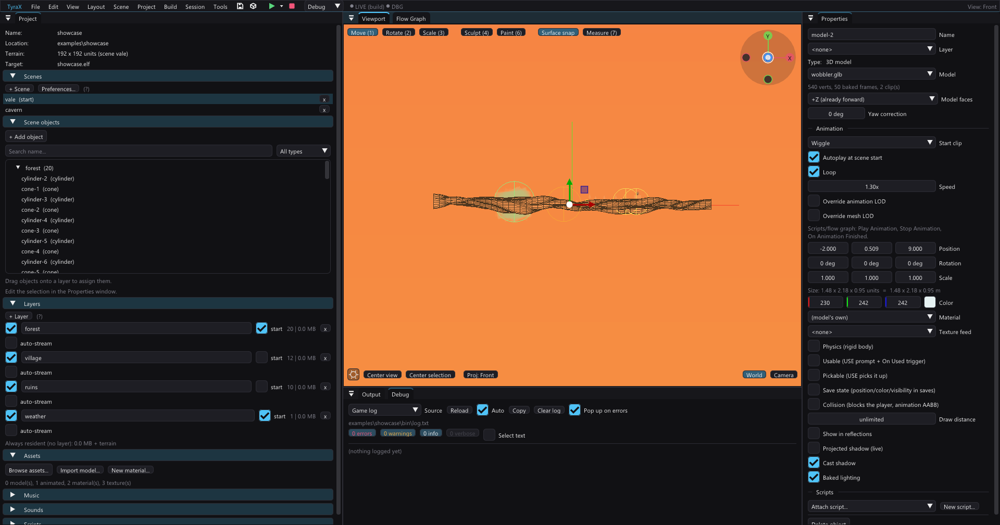

# Orthographic and axis views

The viewport camera is perspective by default — the free orbit camera that
looks the way the game will. But some jobs aren't "look at the scene", they're
"line these up": a street of houses along one axis, two platforms at the same
height, a wall that must be flat. Perspective foreshortening makes those hard,
so the viewport also renders with a **parallel (orthographic) projection**,
optionally locked to a world axis.

## Switching

The same scene makes the difference clearer than a definition:

**Perspective —** good for judging the scene as a player will see it.

**Top —** the same scene becomes a floor plan, so spacing is easy to compare.

**Front —** the same scene becomes an elevation, so height is easy to compare.

### The axis gizmo

The quickest way is the widget in the viewport's **top-right corner** — the
three world axes as coloured balls that turn with the camera:

- **X red, Y green, Z blue.** The positive end of each axis carries a stem and
  its letter; the negative end is a hollow ball opposite, labelled on hover.
- **Click a ball** to snap to the orthographic view from that end of the axis:
  +Y is Top, −Y Bottom, +Z Front, −Z Back, +X Right, −X Left. The ball of the
  current view wears a white ring.
- **Click the hub** in the middle to switch perspective ⇄ parallel without
  changing where the camera looks.

Clicking the widget never touches the selection. Turn it off in
*View > Projection > Axis gizmo* if you want the corner back (a machine
setting in `editor.ini`, like the navigation scheme).

### The other three ways

Same setting, all four stay in sync:

- The **`Proj:`** button in the bottom-left corner of the viewport.
- **View > Projection** in the menu bar.
- The **numpad**, with the viewport hovered (CAD/Blender muscle memory):

| Key | View |
| --- | --- |
| `Num 5` | toggle perspective ⇄ orthographic |
| `Num 7` / `Ctrl+Num 7` | Top (−Y) / Bottom (+Y) |
| `Num 1` / `Ctrl+Num 1` | Front (−Z) / Back (+Z) |
| `Num 3` / `Ctrl+Num 3` | Right (−X) / Left (+X) |

The number **row** keys stay on the transform tools (`1` move, `2` rotate,
`3` scale, `4` sculpt, `5` gizmo space, `6` paint) — nothing collides.

## What the modes do

- **Perspective** — the classic free orbit camera. Nothing changed.
- **Orthographic** — parallel projection, free orbit direction. Equal sizes
  read equal anywhere on screen; distant geometry no longer shrinks.
- **Top / Bottom / Front / Back / Right / Left** — parallel projection *and*
  the camera aimed straight down that world axis. Top is a floor plan
  (+X right, +Z down the screen); the other four are elevations.

Orbiting in a locked axis view drops the direction lock and returns to **the
projection you came from**, continuing from exactly where the image was. An
axis view is a glance, not a new home: from Perspective, the first drag gives
your perspective camera back; if you'd deliberately switched to
**Orthographic** (free) first, the drag returns you there. Stepping straight
from one axis view to another doesn't change what you'll come back to, and
neither does reopening the project in a saved axis view (which has no
history, so it returns to perspective).

Panning (middle-drag), the wheel zoom and WASD flying work in every mode — in
a Top view "forward" walks up the image, since there's no view direction left
to flatten onto the ground.

Selection clicks, the terrain sculpt/paint brush, rubber-band selection, the
transform gizmo and the paste placement all follow the projection, because
they build their ray from the same camera the image was drawn with.

## Notes

- A parallel projection is a **slab through the scene**, not a half-space in
  front of a point: geometry behind the camera plane keeps drawing. That is
  deliberate — a Top view must not hide the roof it is looking through.
- The zoom (wheel) still moves the camera distance, and the ortho framing is
  derived from it, so switching between perspective and ortho keeps roughly
  the same amount of world on screen.
- Looking **through a Camera entity** (the `View:` control next to `Proj:`,
  or a Cutscene Director camera preview) always renders in perspective with
  that camera's FOV — it's the game's picture, and the game has no ortho mode.
- The choice is editor state, stored per project in `<name>.tyra`
  (`"editor": { "viewProjection": ... }`) and restored on reopen. It never
  reaches the generated game.
