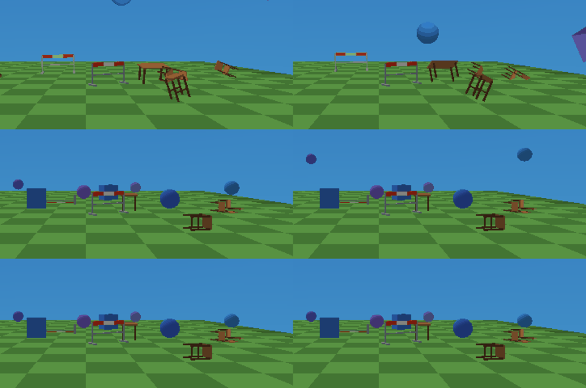
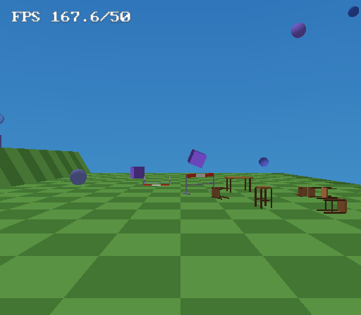

# Rigid-body physics

A scene object with **Physics (rigid body)** ticked is simulated in the game as
a real rigid body: it has a centre of mass, an orientation, linear and angular
velocity and an inertia tensor, and it collides as the **convex hull of its
own mesh** - so a stool stands on its four feet and tips over the edge of one,
a railing falls flat along its length, a chair lands on its backrest and a
ball rolls because the friction at its contact turns it.

It replaced a "rigid-body-lite" (1.123.0) that collided every body as its
bounding box, faked rolling by converting slide into spin as if everything were
a ball, and eased a settling body onto the nearest 90-degree face. That was
fine for crates and balls and looked wrong for anything else.

## Authoring

Properties > Physics, on any box, sphere, cylinder, cone, plane, save point or
static `.obj` model:

| field | meaning |
|---|---|
| Mass | relative; only matters against other bodies and shoves (heavier = harder to push) |
| Bounciness | restitution 0..1, the larger of the two bodies in a collision |
| Friction | 0..1, mapped to a Coulomb coefficient `0.05 + 0.95 * f` (the pair averages) |
| Tumble | off = the body slides but never rotates (infinite inertia) |
| Sleep after | seconds of rest before the body freezes and costs one branch per frame |

Nothing else is authored: the shape is derived from the mesh at build time.
`examples/physics-playground` has the reference props (stool, road barrier,
chair, table - `authoring/make-props.py` writes them) next to its boxes and
balls.

## The shape: a baked convex hull

At every build (`--refresh-gen` included) codegen bakes, for every static
model some physics object uses and for the four unit primitives, a hull into
`inc/model_data.gen.hpp` (`PHYS_HULLS`, `PHYS_HULL_VERTS`, `PHYS_HULL_PLANES`,
`MODEL_PHYS_HULL`, `PHYS_PRIM_HULL`) - `src/physhull.cpp`, host-only.

- **At most 24 corners.** The hull is not the full hull of the mesh but the
  hull of its SUPPORT POINTS: the extreme vertex along a fixed, prioritised set
  of directions - the six axes, the eight box corners (downward ones first),
  the twelve edge diagonals, then a Fibonacci sphere. The points a body can
  rest on come first, so a stool's four feet and a table's four legs always
  survive the reduction. Points on a face or an edge that are not corners are
  dropped.
- **Face planes** by brute force over triples (at most 2024 for 24 points) -
  immune to the degenerate cases an incremental hull has to special-case.
- **Solid mass properties** at unit density: volume, centre of mass and the
  second moment about it. The game derives the inertia tensor under any
  per-axis scale from those (the covariance scales as `S C S` and the volume
  cancels against the density), so a stretched table is not re-baked.
- A flat cloud (a Plane, a single card) is thickened to 2% of its largest
  extent, so every shape has a volume.
- A sphere is analytic. An animated model, or a model the build could not
  read, collides as the unit box stretched over its mesh AABB.

**The hull is convex.** A chair's hull fills the space under its seat and a
railing's fills the gap between its bars - a ball rolled at the gap bounces
off. That is the standard trade every game engine makes for dynamic bodies;
concave STATIC geometry uses mesh collision (below), which is exact.

## The solver

`TerrainGame::updateObjectPhysics` (the game template in `src/templates.cpp`)
runs once per frame over the awake bodies:

1. **Predict**: gravity into the velocity, then the pose one frame ahead
   (quaternion integration of the angular velocity).
2. **Contacts against that prediction**, each source reduced to the four points
   that span it (deepest, farthest, then the ones adding the most area):
   - **terrain** - hull corners below the heightfield, with the slope normal;
   - **box colliders** - hull corners inside the obstacle's collision box
     (`objectCollisionBox`, rotation included - the old code ignored the
     obstacle's rotation), pushed out through the face they came in by; plus
     the box's corners inside the hull, so a body lying across a narrow beam
     rests on the edge;
   - **mesh colliders** (`collision: mesh`) - every hull corner casts its own
     path for the frame against the `CollisionMesh`, from a skin behind where
     it was to where it is predicted, so a fast corner cannot cross a thin
     floor and a stool finds its feet inside a building;
   - **other bodies** - each hull's corners inside the other hull, sphere
     against the face of largest separation, sphere against sphere.
3. **Sequential impulses**, 6 passes: normal impulse with restitution (only
   above a resting threshold, so gravity's own frame of fall never buzzes a
   crate), Coulomb friction clamped by the accumulated normal impulse.
4. **Split impulse**, 3 passes: whatever overlap is left after the velocity
   solve is removed through pseudo-velocities that move the body and are then
   discarded - pushing a body out of the ground never launches it.
5. **Integrate and write back**: the object's position and its Euler angles
   (rebuilt from the quaternion, same `Rz*Ry*Rx` order as `rotated()`), the
   sleep countdown, and the matrix fast path exactly as before.

Portals keep their behaviour: the floor-portal swallow and the doorway rule
(`portalDoorwayOpens`) are applied to the new contacts the way they were to
the old box resolution.

### State and the script contract

The rigid-body state lives beside `RuntimeObject`, in `TerrainGame::physBodies`
(one per physics object, `physSlotOf` maps an object to it). `RuntimeObject`
keeps the script-visible half:

- `velocityX/Y/Z` - linear velocity in units per FRAME, read and written every
  frame (Set Velocity, Apply Impulse, carrying and throwing all keep working);
- `spin[3]` - now the angular velocity about the WORLD axes in degrees/frame.
  A script that writes it (Stop Motion zeroes it) is honoured;
- `restFrames` - write 0 to wake a body.

Anything else that moves or turns a body - a portal hop, a carry, Live Link,
the time machine, a script writing `data.position`/`rotation` - is detected
(the sim remembers what it last wrote) and the orientation is re-read from the
Euler angles. `flatTgt` is unused and kept for layout compatibility.

### Shoves have a point of application

The player's walk-into shove and a car's bumper push go through
`TerrainGame::physPushAt`: the same velocity change as before at the centre of
mass, plus the spin that impulse gives at the point where it lands (hip height
for the player, bumper height for a car). A tall stool leans and falls over; a
low crate slides.

## Cost

Measured in PCSX2 on `examples/physics-playground` (37 bodies), COP0 around
`updateObjectPhysics`, per frame - PCSX2 emulates no EE data cache, so read the
ratio, not the milliseconds:

| state | old solver | new solver |
|---|---|---|
| raining, ~30 bodies awake | 0.88 - 1.02 ms | 0.85 - 1.00 ms |
| settled (60 s in) | 0.33 ms, 3 bodies still awake | 0.07 ms, only the kicked ball is awake |

The new solver costs the same per awake body, and its bodies come to rest
sooner - three of the old one's were still awake a minute in. Where the budget
goes, and what keeps it bounded:

- a sleeping scene returns after one pass over its physics objects;
- the static obstacles are gathered ONCE per frame with a reject radius and
  no trigonometry, then every awake body tests only the near ones;
- a body carries at most 24 corners and each contact source at most four
  points, however detailed the mesh;
- a sleeping body is only expanded into a contact partner when an awake one is
  inside its bounding sphere.

## Limits

- **Corner contacts only.** Edge-against-edge crossings of two hulls (two
  beams crossed like an X) are caught only once a corner goes inside. The box
  corners-in-hull test covers the common case of a body resting across an
  edge.
- **No warm starting and no persistent manifolds.** Stable stacks of a few
  bodies are fine because sleeping bodies are immovable partners; tall stacks
  of awake bodies jitter before they sleep.
- A sphere is tested against a hull by the face of largest separation, which
  over-reports contact near a hull's edges by a few percent of the radius.
- A shape is convex (see above), and an animated model is its AABB box.
- There is no editor-side simulation: the viewport shows the authored pose.
