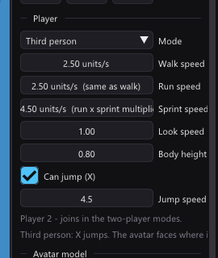

# Player speeds: walk, run and sprint

A Player object has **three** movement speeds instead of one. They are edited in
*Properties* on the Player object, in units per second, each with the metric
equivalent beside it:



| Field | When it applies |
| --- | --- |
| **Walk speed** | A gentle stick — the bottom of the ramp. |
| **Run speed** | A full stick. The stick's deflection ramps the speed from walk up to run. |
| **Sprint speed** | While the `sprint` input action is held. It pins the top speed flat, ignoring the ramp. |

Run and sprint may be left **unset**, which is what they are in every project
that has not touched them:

- an unset **run** speed means *the same as walk*, so the ramp is flat and the
  walk speed is the only speed there is;
- an unset **sprint** speed means *run × the sprint multiplier*
  (*Preferences > Input > Sprint speed*, or *Tools > Input Map*).

The field shows the number it inherits rather than a bare `0`, with the source
in brackets — `4.00 units/s (same as walk)`. Dragging it makes the tier
explicit; the **Auto** button beside an explicit tier clears it again.

## How the stick picks a tier

Movement speed is chosen once per frame in `updatePlayerWalker`:

```
stickMag = min(1, length(forward, strafe))

speed = sprint held ? SPRINT_SPEED
                    : WALK_SPEED + (RUN_SPEED - WALK_SPEED) * stickMag
```

Two consequences worth designing around:

- **A digital source always runs.** The d-pad and the keyboard have no partial
  deflection — they read full — so they always move at the run speed. That is
  usually what you want (there is no way to "half-press" a key), but it does
  mean the walk tier is analog-stick-only.
- **Sprint does not ramp.** It is a deliberate go-fast modifier, so a half stick
  while sprinting is still the sprint speed. This is also what makes an existing
  project's sprint behave exactly as it always did.

The ramp scales the *speed*; the stick's magnitude is already carried into the
movement vector, so easing the stick still gives fine positional control the way
it always did.

## Animation

The third-person avatar's locomotion clip is chosen from its actual planar speed
as a fraction of the **run** speed (*Properties > Run at*, default 0.55). A
separate **Sprint clip** (optional) replaces the run clip while the sprint
action is held — chosen from the button, not from a second speed threshold, and
its playback rate is normalised to the sprint tier so a clip authored at sprint
pace plays 1× while actually sprinting. Unset, the run clip covers sprinting,
exactly as before. So
"Run at 0.55" means "the run clip takes over past 55% of full-stick speed",
whether or not a run speed was set — with none, the run speed *is* the walk
speed and the number means exactly what it did before. Sprinting is above the
run speed by construction, so it always plays the run clip.

See [animated-models.md](animated-models.md) for the clip mapping itself.

## Scenes with no Player object

A scene without a Player object is driven by the fallback walker, which takes
its speeds from *Preferences > Player* (`ProjectSettings::walkSpeed` /
`runSpeed`) and sprints at the multiplier. It ramps the same way. There is no
absolute sprint speed there, because there is no object to state one on.

## Where the numbers live

Stored per Player object as `playerRunSpeed` / `playerSprintSpeed`, in the same
**movement per 1/50 s** step unit as `playerWalkSpeed` (see
[world-scale.md](world-scale.md) — the editor converts, the file and the game do
not). Both are written to the `.tyra` only when set, so a project that never
opens these fields resaves byte for byte.

The `0 = inherit` chain is resolved **once**, host-side, by
`project::playerRunSpeed()` and `project::playerSprintSpeed()`. Codegen bakes the
resolved numbers into `PLAYER_RUN_SPEEDS[]` / `PLAYER_SPRINT_SPEEDS[]` (and
`RUN_SPEED` / `SPRINT_SPEED` in `terrain_config.hpp` for the fallback walker),
and the Properties panel prints them through the same two functions — so the
runtime needs no fallback branch and the panel cannot promise a speed the
console does not run.

All three speeds **stream over [Live Link](live-link.md)**: in a debug build
with the LIVE chip green, dragging a speed field updates the running game in
about a tenth of a second, no rebuild. The scene tables still seed the values at
load; the walker reads them from `PlayerCtl::speeds`, which a Live Link record
(v3) overwrites with the same resolved numbers the panel shows. The fallback
walker of a Player-less scene keeps its baked constants — settings are not in
the stream.
