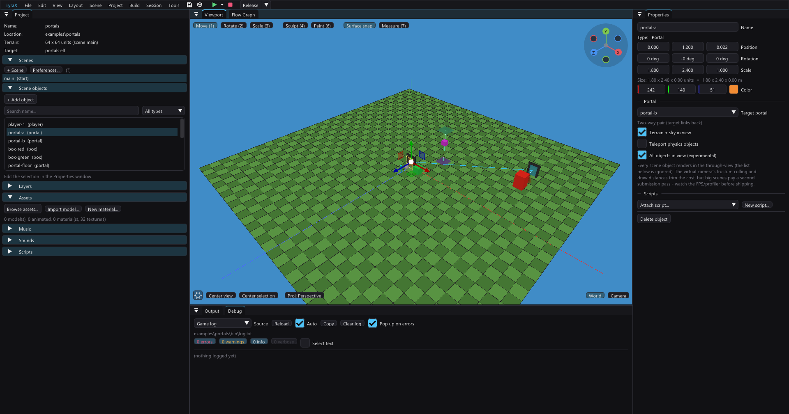

# Portals

A **Portal** is a scene object (Insert > Gameplay > Portal): a rectangle that
links to another Portal in the same scene. The surface shows a **live view
through to the target** — a second camera, kept in lockstep with the player
camera — and anything that walks into the front face is **teleported to the
target portal with position, view angle and vertical velocity carried
through**. Two portals pointed at each other make a seamless two-way door
between distant parts of the map.

The [Aster showcase](../examples/showcase/README.md) demonstrates a small
seaside doorway into a large vaulted cellar, including lamp coronas visible
before crossing and a bounded return view of the sea.

## Authoring

1. Insert two portals (Insert > Gameplay > Portal), place them where you want
   the ends of the corridor. The **+Z face is the front** — the side that shows
   the view and accepts the crossing (same convention as Decal/Mirror). Scale
   X/Y sets the rectangle; a door-sized 1.6 x 2.4 is the default.
2. In Properties > Portal, pick the **Target portal**. Links are one-way by
   design; use **Link back (make two-way)** to complete the pair.
3. List the **objects visible through** the portal — the explicit list is the
   render budget, exactly like a Mirror's reflected-object list. Instead of
   (or on top of) listing names, set a **catch area**: everything inside an
   Area object's box joins the list, resolved at build so the count stays
   visible — or ticked to *Update every frame*, so an object that walks into
   the volume starts showing through (and, by the crossing rule, walking
   through) from that frame on — see [areas.md](areas.md). Terrain and the sky
   dome have their own toggle (**Terrain + sky in view**, on by default). Keep
   the list to the landmarks that sell the destination.
   **Point Lights can join this list too.** With **Beam** set to corona or
   corona + shaft, their visible effects render using the portal's virtual
   camera and destination depth, including the normal brightness/flicker
   level. Walls still occlude them and the portal mask bounds the glow.
   Include the lamp fixture as well as its Point Light. Baked GI already
   travels with the destination geometry; this adds the visible light source,
   not another GI bake or a second projected-light/shadow pass.
   Or tick **All objects in view (experimental)**: every scene object renders
   in the through-view and the list is ignored. The virtual camera's frustum
   culling drops off-view geometry EE-side and draw distances are measured
   from the virtual eye, so the practical cost is what the destination
   actually sees — but a big scene pays a second submission pass whenever that
   portal's view is live; watch the FPS/profiler before shipping, and prefer
   the list for release builds.
   Static batching interplay: objects on a portal's view list are **excluded
   from static batching** at build (like a Mirror's list — the through-view
   re-submits them as solo bags), and in the **All objects** mode a batched
   object gets a one-time solo bake the first time a live view needs it, so
   batched decor shows through the portal either way. (The merged batch bags
   themselves are never submitted into a through-view: a merged bag can't drop
   just the members behind the destination's exit plane, and the wall the
   target portal is mounted on would fill the view with its backside.)
4. **A thrown (or dropped) pickable flies through any linked portal**, like
   the player does — no flag needed. The hop maps position and the full
   velocity vector through the pair, so it exits the target with the matching
   motion, and while the flight is aimed into an opening the wall the portal
   is mounted on stops colliding for it (the walkers' doorway rule) — wall
   portals swallow throws instead of bouncing them back. The released body
   stays "portal-free" until it settles to rest.
   **Carrying** a pickable through a portal works too: walk into the opening
   holding it and both you and the object come out the far side. As the object
   reaches the surface it flies on *through* — mapped to the far side, where
   you see it just beyond the portal (drawn by the through-view) — then
   re-anchors in front of the new camera the moment you cross. (This only
   works through a portal whose through-view shows the object — one set to
   **All objects in view**, or with the object on its view list. Through a
   plain **Teleport physics objects** portal, which renders no through-view,
   the carried object stops at the surface instead.)
   For *ambient* rigid bodies — anything that falls or rolls in on its own —
   the rule is **whatever the portal shows can also go through it**: an object
   on the portal's view list crosses, **All objects in view** opens the
   crossing to every rigid body, and the **Teleport physics objects** flag
   does the same when you want crossings without the through-view cost. A
   floor portal linked to a downward-facing ceiling portal makes the classic
   **infinite fall** — see `examples/portals`. Falls are capped at a 30 u/s
   terminal velocity, so the loop stays fast but readable instead of
   accelerating into a strobing blur; the portal's swallow zone is tested
   against the whole frame-to-frame motion segment, so a terminal-velocity
   faller cannot skip over it and snag on the terrain.

The editor viewport draws the surface as a translucent tinted quad, a **bright
arrow out of the entry face** (the +Z front — the side that shows the view and
teleports; flip the portal 180° if the arrow points into your wall) and a link
line to the target; the live view exists only in the game (it is the PS2
in-place render).

## How the game renders it (and what it costs)

- Each frame the game picks up to **four** portals — the nearest linked ones
  the camera is in front of — and renders their through-views **in-place, at
  full resolution, straight into the framebuffer** (no render-to-texture, no
  resampling — the opening is pixel-for-pixel as crisp as the scene around
  it). The GS has no stencil, so the shaped opening is carved with the
  z-buffer: the destination view renders right after the frame clear,
  scissored to the quad's screen bbox; then the bbox depths are re-farred, the
  quad interior is capped at the surface depth (a z-only triangle fan from the
  quad's 4 corners, frustum-clipped on the EE — a handful of flops), and the
  spill outside the opening is repainted with the clear color. The main scene
  then draws around it: walls in front still occlude the view, the wall behind
  loses the z-test, and DoF/particles treat the surface as solid geometry.
- Content: sky + terrain (optional) + the authored object list, submitted
  through the normal VU1 static pipeline — transform and clipping stay on VU1,
  the virtual-camera math runs on the VU0-macro Vec4/M4x4 ops, and the EE only
  packages the extra submissions.
- The virtual camera is the player camera mapped through the pair (source
  local frame -> 180° flip -> target frame) with the **same projection as the
  screen** (only the view matrix swaps), so the destination lands exactly
  where the opening sits — correct parallax with no per-pixel work.
- Every other portal (and a portal with no/dangling target) draws as a
  translucent quad tinted with the object color. Hiding a portal (layer or
  Set Object Visible) disables its view *and* its teleport.
- The teleport uses the same mapping as the camera, with **no exit offset** —
  the isometry carries your overshoot past the target plane, so crossing is
  mathematically continuous (the arrival matches what the surface showed,
  frame to frame). The camera is rebuilt on the hop; no frame renders from the
  departure side. The player probes with two segments — waist (door-sized wall
  portals) and **feet**, so jumping or dropping into a floor portal teleports
  too.
- **The doorway moment**: with your eye a breath from the plane, parts of the
  quad fall behind the near plane and a clipped opening would let the world
  behind the free-standing surface peek around it for a frame ("looking
  through two portals at once"). Inside that zone — close, inside the
  rectangle, looking into the surface — the opening expands to the whole
  screen: the destination fills the view until you cross.
- **Dead zone**: the virtual camera sits behind the exit plane, and the PS2
  has no oblique near plane to clip what lies in between. Both view objects
  and terrain chunks fully on the camera side of the target plane are skipped
  automatically (through a real hole they'd be invisible; chunks carry their
  exact height extent and objects project their exact OBB extent onto the
  plane normal, so a **wall the target portal is mounted flush on counts as
  behind** and never fills the opening with its backside — while geometry
  genuinely poking through the plane still renders) — a floor→ceiling pair
  keeps **Terrain + sky in view** on and the opening correctly shows the
  sky-dome gradient and whatever falls through, not the terrain's backside. A
  chunk that straddles the plane still renders whole, so on an extreme
  cliff-edge portal a backside sliver can peek in — nudge the portal off the
  geometry if it does.
- **Floor portals swallow**: while a body stands over a linked floor portal's
  rectangle (front normal pointing up), it stops colliding with the terrain —
  otherwise the ground would rest it before it could reach the crossing plane,
  and a portal lying ON the ground could never eat anything. Works for the
  player (walk into one and you drop in like a pit) and for physics objects;
  wall and ceiling portals are unaffected.
- **Doorways open in collision**: while the player's body column sits inside a
  linked portal's opening (any orientation), object collision ignores
  everything fully BEHIND that portal's plane (the same exact-OBB rule as the
  through-view) — so the wall a portal is mounted flush on lets you walk
  through the opening, while the same wall still blocks right beside it, and a
  crate standing in front of the surface still blocks too. Physics objects
  never collide with objects, so they need no equivalent.

## Limits (era-honest by design)

- **Up to four live views per frame** (nearest first; each is its own
  destination render, so every extra visible portal costs its content). Beyond
  the budget, a portal shows its tint. Where two openings overlap on screen,
  the nearer one wins its bbox (views are carved farthest-first).
- **No portal-in-portal recursion**: a portal never appears inside another
  portal's view (it would sample the very target being rendered).
- Walkers keep no horizontal velocity state, so a **tilted** pair (floor ->
  wall) carries only the vertical component of the crossing speed. Yaw-only
  pairs — the common teleporter — preserve movement perfectly.
- Animated models in the through-view render their last skinned pose (one
  frame stale).
- **Particle emitters show through** (fire, smoke, fog, rain, …): the VU1
  billboard program re-expands the same particle centers from the virtual
  camera's basis, so an emitter in the view (listed, or any emitter with **All
  objects in view**) faces the portal viewer correctly — the same simulation,
  a second cheap on-VU expansion. Mirrors, on the other hand, show only their
  glass through a portal (their reflected copies are a main-pass trick that
  would need its own bracket).
- With **terrain streaming** on, the view renders only resident chunks — keep
  both portals inside the streamed radius or turn the portal's terrain toggle
  off and list objects instead.
- Portals are baked into the `PORTALS` side table at build, so Live Link can
  live-move an existing portal but cannot spawn a new one (the chip flips to
  "LIVE (rebuild)"; same rule as mirrors).

### Imported mesh bounds (1.77.1)

The exit-plane rejection uses each model's actual local bounds, transformed
with its offset centre, scale, rotation and model heading. Previously it tested
a unit box at the object pivot, which discarded large district meshes even in
**All objects in view**. Primitives retain their unit bounds. Whole objects
behind the exit are rejected early. Static bags straddling it
are clipped against the exit plane, interpolating positions, colours, UVs and
lighting normals. Otherwise a large model's rear wall covers the destination.
Only straddling bags need this CPU path; animated bags keep the existing
whole-object test. Since 1.77.2 each part retains its clipped streams per portal.
An unchanged source geometry stamp, model matrix and exit plane reuse them,
including the frustum-cache stamp. Moving the viewing camera does not invalidate
world-space clipping. A rebuild/LOD/body transform/exit change drains DMA before
replacing the buffers. Live texture, light and pipeline descriptors still refresh
on every draw. Scene unload releases the part-owned caches.

Use a bounded destination list for a small interior: **All objects in view**
can still submit a whole outdoor scene even when most of it ends up behind the
room walls. Aster uses five inward objects and 18 arrival-court objects outward.

Aster regression measurement (PCSX2, frozen player at `(9.78103, 1.8, 21.2)`,
heading `180.183466`, profiler enabled): all objects with uncached clipping
measured 10.0 FPS / 93.28 ms SCENE; destination lists alone measured 11.1 FPS /
73.24 ms; lists plus cached clipping measured 25.0 FPS / 29.87 ms. These are
one matched doorway view, not a whole-level frame-rate guarantee. A 360 x 300
cellar crop was pixel-identical before and after caching. The scene still
exceeds the 20 ms budget for 50 FPS in this view.

Physical PS2 follow-up (2026-09-09, same frozen view, 512 x 448 PAL,
network deployment with Live Debugger/Remote Pad and profiler enabled):
textures loaded successfully and the warm portal run measured 12-12.5 FPS,
66.11 ms SCENE (80.72 ms FRAME). Removing only the source portal's target
measured 12.5 FPS, 59.88 ms SCENE (82.32 ms FRAME). The portal adds roughly
6 ms of scene work here, but disabling it does not solve the frame-rate problem;
the base scene itself exceeds the budget. These debug/network runs are not
standalone retail-build measurements. GS captures are in the showcase preview
folder (`ps2-portal-performance.png`, `ps2-noportal-performance.png`).
