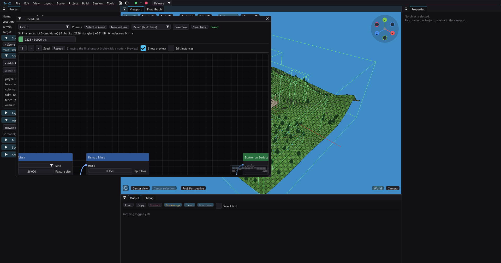
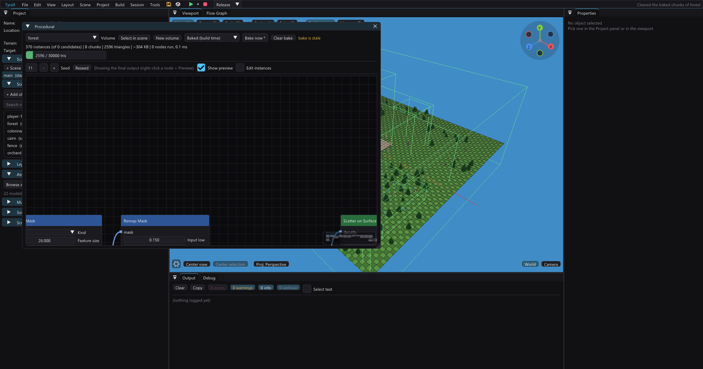

# Procedural generation

Procedural volumes fill a region with rule-driven objects: forests, rocks,
fences, orchards or exact arrays. Open **Tools > Procedural** or switch to the
**Procedural** layout.

The graph runs on your PC. A build merges its instances into ordinary chunk
meshes, so the PS2 never evaluates the graph. For generation on the console,
see [runtime procedural generation](procedural-runtime.md).

Try the six graphs in [examples/procedural](../examples/procedural).

## From rules to geometry

1. Edit the graph with **Show preview** off. The volume is visible, but it has
   not placed anything in the scene.

   

2. Turn on **Show preview** to inspect the result without changing scene
   objects.

   

3. Click **Bake now**. The preview becomes chunk meshes that will ship in the
   game; the status changes to `baked`.

   

## Start a volume

Add **Procedural volume** from the object menu or click **New volume** in the
Procedural window. Its transform is the region: position sets the centre, scale
sets its size and Y rotation turns the footprint.

The window lets you:

- choose a volume and seed;
- edit its graph;
- preview the result in the viewport;
- bake or clear its generated chunks;
- hand-edit individual preview instances.

Graphs pass three data types: **points**, **masks** (0–1 fields over the region)
and **curves**. Pins only accept their own type, and cycles are refused.

## Node cheat sheet

| Group | Main nodes | Use them for |
|---|---|---|
| Sources | Scatter on Surface/Grid/in Volume/along Curve, Single Point, Blocks Fill | Create points |
| Masks | Noise, Terrain, Combine, Remap | Say where or how densely |
| Filters | Attribute, Mask, Minimum Distance, Keep Away, Limit Count | Remove unwanted points |
| Repeat | Array, Radial Array | Exact rows, stacks, rings and arcs |
| Assign | Pick Asset, Pick Prefab, Vary Transform, Set Attribute | Choose and vary the result |
| Output | Output, Object Settings | Set chunks, budget and shared properties |

Hover a node or its controls for the full parameter description.

### Common recipes

**A natural forest**

1. **Scatter on Surface** over the terrain.
2. Feed a large **Noise Mask** into density.
3. Filter steep slopes with **Filter by Attribute**.
4. Add **Minimum Distance**.
5. **Pick Asset** from weighted tree variants.
6. **Vary Transform**, then connect to **Output**.

**Trees only on painted grass**

Use **Terrain Mask > Terrain material**, choose the grass layer and connect it
to density or **Filter by Mask**. The mask reads visible coverage, so rock
painted over grass counts as rock. This source is build-time only.

**A colonnade**

Use **Single Point > Radial Array > Pick Asset > Output**. Arrays are exact and
do not add random placement.

## Curves and hand edits

A **Curve** node exposes its control points in the viewport. Move, add or delete
them there; **Scatter along Curve** places points at a fixed spacing and can turn
them along the path.

Enable **Edit instances** to move, rotate, scale or delete preview instances.
Overrides are tied to stable point identities, so they survive re-evaluation as
long as the upstream rule still produces that point. **Reset overrides** returns
to the pure graph.

## Seed and stability

Generation is deterministic: the same project, graph and seed produce the same
instances. Editing a downstream node does not reshuffle unrelated upstream
points. Use **Reseed** when you want a new arrangement.

The preview evaluates in the background. Expensive graphs show progress and
keep the last good result visible until the new one is ready.

## Bake and budget

**Bake now** creates scene objects and chunk meshes. Builds and
`--refresh-gen` also bake stale volumes automatically.

Chunks exist because hundreds of separate PS2 draw submissions are too costly.
Larger chunks mean fewer draws but coarser culling; 48 units is a sensible
starting point. The Output node shows instance and triangle counts and warns
when the graph exceeds its budget.

Keep source assets deliberately low-poly. Instance count can be misleading:
500 trees at 600 triangles each are still 300,000 triangles after merging.

Generated chunks inherit the volume's layer. Put them on a streamed layer when
the region should load and unload together. Use **Object Settings** for shared
mesh LOD, baked lighting and reflection flags; edit the graph, not individual
generated chunks, when the setting should survive the next bake.

## Limits

- Baked instances cannot move, hide or run scripts independently.
- Prefabs keep their object identity and are not merged like plain models.
- Collision on dense scatter can be expensive; enable it only where needed.
- Graphs stop before runaway arrays consume the editor.
- Runtime volumes support a smaller node set and different budgets.

If the result is empty, check the selected volume, source surface, filters and
Output connection in that order. If it is too dense, lower source density or
add **Limit Count** before tuning chunk size.
