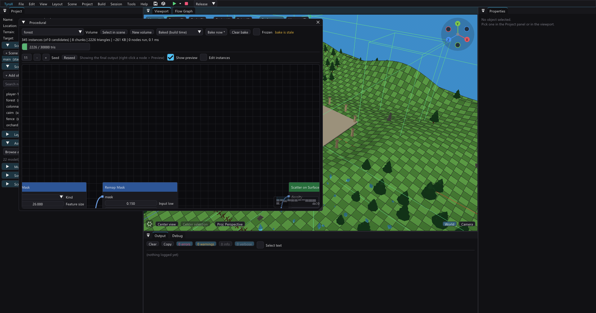
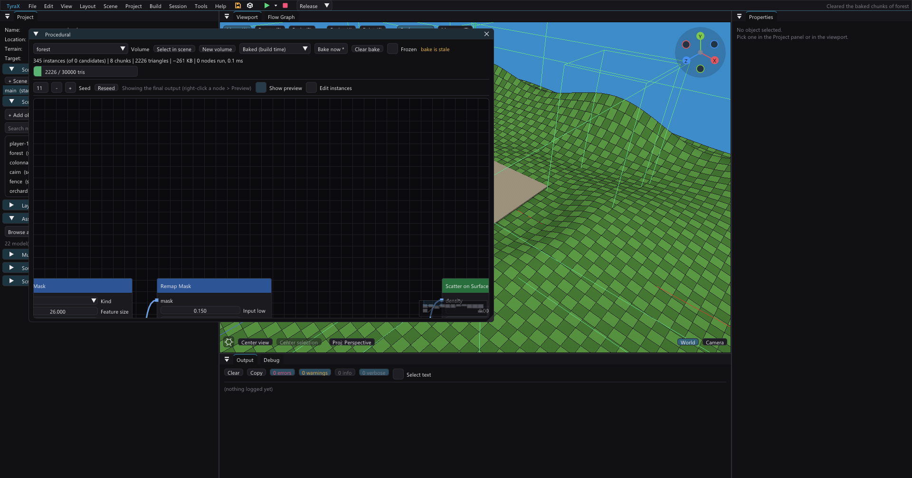
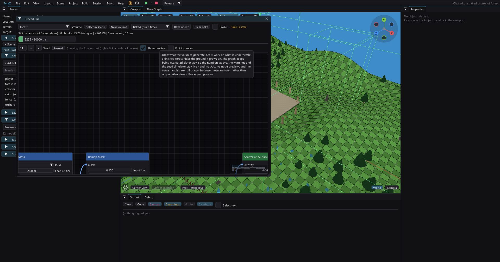
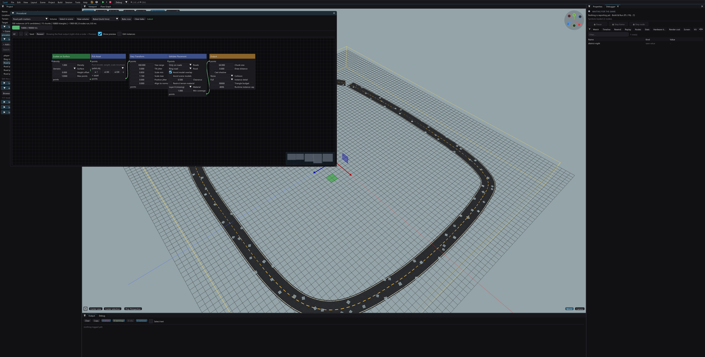
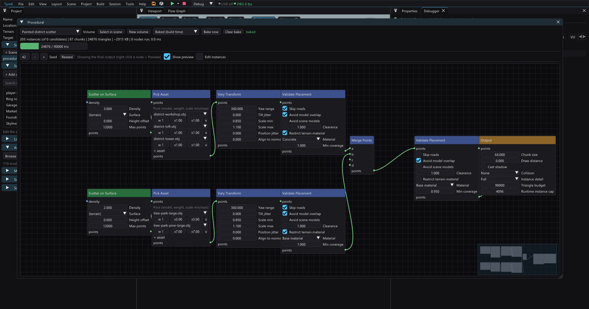

# Procedural generation

Procedural volumes fill a region with rule-driven objects: forests, rocks,
fences, orchards or exact arrays. Open **Tools > Procedural** or switch to the
**Procedural** layout.

The graph runs on your PC. A build merges its instances into ordinary chunk
meshes, so the PS2 never evaluates the graph. For generation on the console,
see [runtime procedural generation](procedural-runtime.md).

Try the six graphs in [examples/procedural](../examples/procedural).

## From rules to geometry

1. Edit the graph with **Show preview** off. The volume is visible, but it has
   not placed anything in the scene.

   

2. Turn on **Show preview** to inspect the result without changing scene
   objects.

   

3. Click **Bake now**. The preview becomes chunk meshes that will ship in the
   game; the status changes to `baked`.

   

## Start a volume

Add **Procedural volume** from the object menu or click **New volume** in the
Procedural window. Its transform is the region: position sets the centre, scale
sets its size and Y rotation turns the footprint.

The window lets you:

- choose a volume and seed;
- edit its graph;
- preview the result in the viewport;
- bake or clear its generated chunks;
- hand-edit individual preview instances.

Graphs pass three data types: **points**, **masks** (0–1 fields over the region)
and **curves**. Pins only accept their own type, and cycles are refused.

## Node cheat sheet

| Group | Main nodes | Use them for |
|---|---|---|
| Sources | Scatter on Surface/Grid/in Volume/along Curve, Single Point, Blocks Fill | Create points |
| Masks | Noise, Terrain, Combine, Remap | Say where or how densely |
| Filters | Attribute, Mask, Minimum Distance, Keep Away, Validate Placement, Limit Count | Remove unwanted points |
| Repeat | Array, Radial Array | Exact rows, stacks, rings and arcs |
| Assign | Pick Asset, Pick Prefab, Vary Transform, Set Attribute | Choose and vary the result |
| Output | Output, Object Settings | Set chunks, budget and shared properties |

Hover a node or its controls for the full parameter description.

### Common recipes

**A natural forest**

1. **Scatter on Surface** over the terrain.
2. Feed a large **Noise Mask** into density.
3. Filter steep slopes with **Filter by Attribute**.
4. Add **Minimum Distance**.
5. **Pick Asset** from weighted tree variants.
6. **Vary Transform**, then connect to **Output**.

**Trees only on painted grass**

Use **Terrain Mask > Terrain material**, choose the grass layer and connect it
to density or **Filter by Mask**. The mask reads visible coverage, so rock
painted over grass counts as rock. This source is build-time only.

**A colonnade**

Use **Single Point > Radial Array > Pick Asset > Output**. Arrays are exact and
do not add random placement.

**Buildings on concrete, trees on grass, roads kept clear**

Use **Scatter on Surface > Pick Asset > Vary Transform > Validate Placement**
for each species. Set **Roads = Avoid roads**, enable **Restrict terrain material** and
choose the allowed **Material**: concrete for buildings, grass for
trees. **Min coverage = 1** requires fully visible material throughout
the footprint, including any clearance. A centre on concrete is insufficient
when part of the building would extend onto grass.

Enable **Avoid model overlap** to reject intersections between accepted
instances, and **Avoid scene models** to include placed static models and
solid primitives. These switches are independent. **Clearance** adds a gap
in world units. Merge the species, then add one final **Validate Placement**
with model overlap enabled to check them together; earlier input wins, so
connect buildings to Merge's first input to give them priority. Two separate
volumes do not check each other's generated instances; baked procedural chunks
are excluded to keep previews and repeated bakes independent of bake order.

**Using a road as a scatter path**

Set **Validate Placement > Roads = Only on roads**. **Road** selects a named
road; **(every road)** accepts any road in the scene. Feed points from **Scatter
on Surface** or **Scatter on Grid** through Pick Asset and Vary Transform first.
Only origins inside the road's full spline ribbon survive, including soft edges
and bends; a canopy or arch can extend outside it. This is an area filter, not
centreline spacing, and does not change height or heading. Keep the source's
terrain snap and height offset as appropriate for the asset.

**Ignore roads** disables road filtering. **Avoid roads** checks the whole
transformed model footprint plus clearance. **Only on roads** checks the origin
without a road inset; clearance still applies to model overlap and painted
material checks. Collision and material switches remain independent. Turn off
**Restrict terrain material** when the path should ignore the paint under it,
and turn off both overlap switches if models should intersect. No road surface
means an empty result in Only mode. A missing or non-road target warns rather
than silently falling back to all roads. Existing saved `roads=0/1` values keep
their Ignore/Avoid behavior.

The check uses conservative world AABBs from actual OBJ bounds, transformed
with rotation, offset and scale. It can leave extra room beside rotated or
concave models. Roads use the full authored width (including faded edges) and
the same spline triangles as the road renderer. Painted coverage uses a lower
bound across all intersected splat cells, including layers painted on top;
blended borders may reject additional placements. Material checks require
terrain and reject footprints outside its bounds. Missing models and prefab
instances are rejected with a warning; use Pick Asset for this workflow.

Keep this filter after all automatic transform edits. Manual instance overrides
apply after graph evaluation and can intentionally move an accepted object
across a boundary. This is an authoring placement check; **Output > Collision**
separately controls the baked geometry's gameplay collision.

The host CPU evaluates the filter on the background preview worker. A spatial
hash checks nearby occupied cells rather than every model against every other
model; giant bounds use a bounded overflow path. No GPU or runtime PS2 work is
required. Validate Placement is build-time only and the runtime capability
checker reports it as unsupported.

Try the **procedural** scene (index 2) in
[vehicle-playground](../examples/vehicle-playground): existing urban buildings
and park trees, painted concrete lots, grass strips and seven roads, with one
merged scatter graph. The project's default start scene remains `main`.

## Curves and hand edits

A **Curve** node exposes its control points in the viewport. Move, add or delete
them there; **Scatter along Curve** places points at a fixed spacing and can turn
them along the path.

Enable **Edit instances** to move, rotate, scale or delete preview instances.
Overrides are tied to stable point identities, so they survive re-evaluation as
long as the upstream rule still produces that point. **Reset overrides** returns
to the pure graph.

## Seed and stability

Generation is deterministic: the same project, graph and seed produce the same
instances. Editing a downstream node does not reshuffle unrelated upstream
points. Use **Reseed** when you want a new arrangement.

The preview evaluates in the background. Expensive graphs show progress and
keep the last good result visible until the new one is ready.

## Bake and budget

**Bake now** creates scene objects and chunk meshes. Builds and
`--refresh-gen` also bake stale volumes automatically.

Chunks exist because hundreds of separate PS2 draw submissions are too costly.
Larger chunks mean fewer draws but coarser culling; 48 units is a sensible
starting point. The Output node shows instance and triangle counts and warns
when the graph exceeds its budget.

Keep source assets deliberately low-poly. Instance count can be misleading:
500 trees at 600 triangles each are still 300,000 triangles after merging.

Generated chunks inherit the volume's layer. Put them on a streamed layer when
the region should load and unload together. Use **Object Settings** for shared
mesh LOD, baked lighting and reflection flags; edit the graph, not individual
generated chunks, when the setting should survive the next bake.

## Limits

- Baked instances cannot move, hide or run scripts independently.
- Prefabs keep their object identity and are not merged like plain models.
- Collision on dense scatter can be expensive; enable it only where needed.
- Graphs stop before runaway arrays consume the editor.
- Runtime volumes support a smaller node set and different budgets.

If the result is empty, check the selected volume, source surface, filters and
Output connection in that order. If it is too dense, lower source density or
add **Limit Count** before tuning chunk size.
