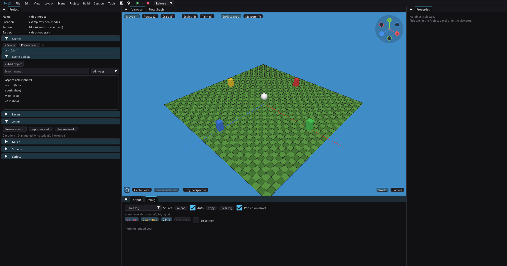
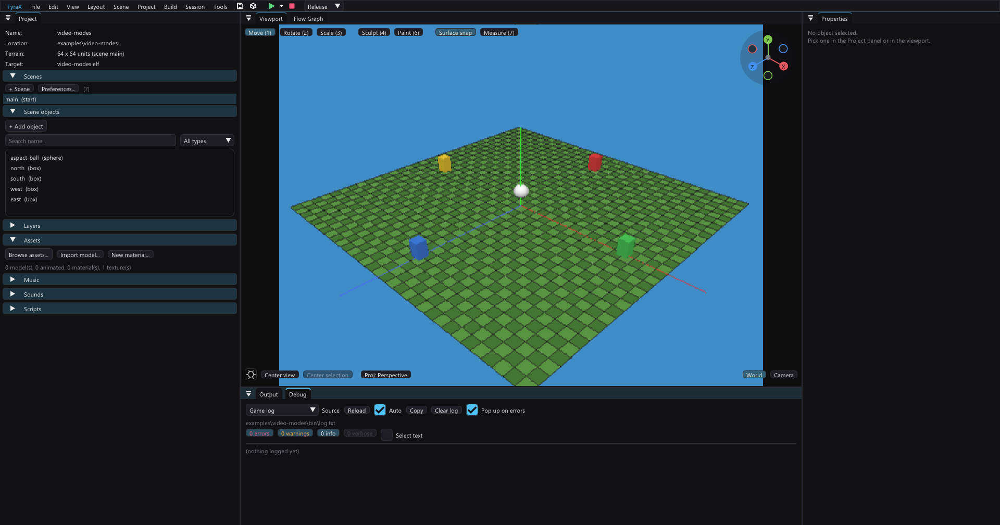

# PS2 output in the viewport

Two ways of looking at the same scene:

- **Editor** (default) — the viewport's own image. Full monitor resolution,
  and as wide as you docked the panel.
- **PS2 output (GS)** — what the console draws. The scene is rasterized at the
  **GS framebuffer size** of the project's display mode and shown the way a
  television shows it: fitted into a 4:3 or 16:9 picture, point sampled, with
  everything outside that picture black.

Switch in the **gear in the viewport's bottom-left corner** or *View >
Viewport output*. Machine-global (`editor.ini`, key `viewportPs2`) like the
safe areas — a way of looking, not project data, so it never dirties the
`.tyra` and never travels to a collaboration peer.

Two more simulations live next to it, in the same gear and menu, and compose
with either output mode — triangle shading and 16-bit banding are visible
(and true) at any raster:

- **PS2 shading** (`viewportPs2Shade`) — shade the way the console does:
  every lighting term evaluated per **vertex**, most surfaces **flat-shaded**.
  See [PS2 shading](#ps2-shading) below.
- **GS colour** (`viewportGsColor`) — the framebuffer depth the picture is
  shown at: *Match project* (default — follows *Preferences > Colour depth*
  and its dithering), *Full 32-bit*, *16-bit*, or *16-bit + dithering*. See
  [GS colour](#gs-colour-16-bit--dithering) below.

## Why

The editor's viewport is a lie in three specific ways, and each costs real
time later:

1. **Resolution.** A 1600×900 panel has about six times the pixels of a PS2
   frame. Detail that reads cleanly at the desk can be two pixels wide on the
   console; a texture that looks crisp can be a shimmering mess in motion.
2. **Framing.** The panel is whatever shape you docked it to. The console
   outputs one fixed shape, and everything outside it does not exist. The
   [safe-area guides](safe-areas.md) draw that rectangle; this mode *renders*
   into it, so the camera really does frame what the player will see.
3. **Pixel shape.** GS pixels are not square (below).

Everything that costs the console nothing to be honest about is on: the
resolution really is 512×448, the raster really is that coarse, and the
picture really is that shape.

## What changes when it is on

| | Editor | PS2 output |
|---|---|---|
| Rasterized at | panel size | the GS framebuffer of the display mode |
| Projection aspect | panel width / height | the engine's `RendererSettings::aspectRatio` |
| Scaled up with | — | nearest neighbour, into the display window |
| Vertical resolution in `interlaced-field` | full | **halved** — the mode's whole point |
| Flicker filter | — | on for `interlaced` and `pal576`, as on the console |

The editor's own decoration (grid, selection outlines, markers, the light
gizmos) is rasterized with the scene, so it goes chunky too. The transform
gizmo, the axis gizmo, the measuring tape and the safe-area guides are drawn
by the UI *over* the image and stay sharp — and correctly placed: picking,
both raycasts and the gizmo all travel through the same letterbox the picture
does.

### The GS geometry per display mode

The host twin of Tyra's `RendererSettings::updateGeometry` (see
`App::ps2ViewportOutput`):

| *Preferences > Display mode* | GS framebuffer | Notes |
|---|---|---|
| `interlaced` | 512×448 | the stock signal; flicker filter on |
| `interlaced-field` | 512×**224** | true field rendering — half the lines |
| `progressive` (480p) | 448×448 | |
| `1080i` | 448×540 | 4:3 is pillarboxed inside the 16:9 raster |
| `pal576` | 512×512 | the full-height PAL frame |

*Widescreen* widens the projection and the picture; it does not change the
framebuffer. That is anamorphic output, so 2D has no projection to widen and
is stretched by the TV instead — game menus cancel that stretch themselves
(see [menu-styles.md](menu-styles.md) "Widescreen"), the HUD does not.

**2D is authored against 448 lines whatever the framebuffer is.** Sprite
coordinates are framebuffer pixels with the origin at the top-left of the
picture, and the engine's 2D pass keeps that origin on the top of the raster
by centring the logical 448-row space in whatever height the mode allocates
(`RendererCore2D::SPRITE_SPACE_HEIGHT`). It has to: the offset used to be a
bare constant that was only right at 448 rows, so in `1080i` — the one mode
taller than 448 — every sprite was drawn (540 − 448) / 2 = **46 rows too
high** and the debug HUD's first line fell off the top of the screen. The
term is exactly zero in the 448-row modes, so nothing that already worked
moved. A future mode with a different framebuffer height gets the same
treatment for free; one with a different *width* would not — the horizontal
origin is deliberately still the raw constant (measured correct at both 512
and 448 wide; 2D is not re-centred horizontally).

**One thing the editor cannot know**: with `videoSystem: auto`, whether
*PAL picture* (`palFullHeight`) promotes `interlaced` to the 512-line frame
depends on the region of the console that boots the disc. The viewport shows
the **PAL** picture there — `palFullHeight` is only meaningful on a PAL
console, so a project that turns it on (new ones do) is authored for PAL, and
the taller frame is the one whose extra 64 lines need composing for. The
shorter NTSC picture inside it is what the safe-area overlay's *NTSC picture
inside PAL* guide draws, and that guide enables in exactly this
configuration. Only an explicit `ntsc` video system says the disc will never
meet a PAL console.

## GS pixels are not square, and they are not square by 16.7%

Tyra builds its projection with `aspectRatio = 512/448 = 1.143` for a 4:3
display window (`renderer_settings.hpp` keeps the stock value as its 4:3
baseline and scales it with the shape of the mode's window). The television
then shows those 512×448 pixels as a 4:3 picture — 1.333 wide. So the
console's picture is **horizontally stretched by 1.333 / 1.143 = 1.167**: a
sphere is a circle in the GS framebuffer and an ellipse on the TV. Measured
on a centred sphere: 0.99 wide/high in the editor mode, **1.18 in PS2
output**.

This is the engine's own convention, not something the viewport introduces —
until now the editor simply did not show it. Author against it: circular
things authored to look circular in the editor will read slightly wide on the
console.

## PS2 shading

The editor's viewport normally shades **per pixel**: point lights, emissive
lights, ambient occlusion, GI probes, the flashlight and fog are all evaluated
in the fragment shader, so a light pool is a smooth circle and a lit sphere a
smooth blob. The console cannot do any of that — it evaluates the same
formulas **per vertex** (the EE bake at scene load, VU1 for the dynamic
terms) and interpolates across the triangle, and most static geometry is
submitted **flat-shaded** (`TyraShadingFlat`: one corner's colour paints the
whole triangle — terrain chunks, static primitives, models, batches; the sky
dome, animated models and dyn-lit objects shade Gouraud). That difference is
exactly the "it looked better in the editor" gap.

*PS2 shading* closes it: the scene pass swaps to a shader variant with a
geometry stage that runs the **identical** lighting stack once per triangle
corner with the triangle's own winding normal — the console's flat normal,
not the screen-space one — then flat- or Gouraud-interpolates per draw the
way the game's bags do. One formula, two evaluation sites: the lighting
functions live in a single GLSL chunk shared by both paths, so they cannot
drift.

**Dynamic lights change formula, not just evaluation site.** The editor's
per-pixel preview draws a dynamic point light with an N·L term and a
quantized shadow test; the console cannot — on **objects** a dynamic light
rides the VU1 spot slot (the flashlight's), which is pure radial `1 − d²/r²`
with a cone for spots, **no N·L and no shadow**, added on top of everything
(baked GI included). The **terrain** never takes that slot at all
(`dynLightPick = false`): its dynamic light is the **ground pool** — a
terrain-conforming additive patch textured with the corona sprite
(`updateAndRenderLightPools` in the generated game). With *PS2 shading* on
the viewport does both, with the same numbers: the slot formula per vertex
on objects, and the pool (same 4×4 patch over 0.9 × radius, the same corona
pixels, the same additive FIX scale) on the ground. The camera flashlight
stays per-pixel, because on the console its footprint is a projected pool —
per pixel by construction. Two honest divergences stay: the console lights
each mesh with its **strongest** dynamic light only (`pickDynLight`) while
the preview adds them all, and a dynamic **spot** light's gobo projection is
not reproduced (its pool is skipped; the per-vertex cone still lands on
objects). The shadow a spot carves out of that pool previews in **Solid**
shading instead ([shadows.md](shadows.md), "In the editor").

A light's visible **beam** (*Properties > Point light > Beam*) is not part of
this mode and never was: the corona billboard and the cone shaft are geometry
the game submits whatever it shades with, so the viewport draws them in every
mode, from the same sprite bake and the same numbers — see
[flashlight](flashlight.md) for the pull that keeps the corona off its own
lamp post, and for the one thing the preview leaves out (the runtime level:
flicker and *Set Light*).

What to expect with it on: faceted spheres, light pools that follow the
terrain grid, banded cylinders — the console's look, verified A/B against a
PCSX2 frame of the same scene. The editor's gizmos, outlines and grid stay
per-pixel (they have no console twin), and the preview windows (Material
Editor, Animation Editor, thumbnails) deliberately keep the smooth per-pixel
look.

## GS colour (16-bit + dithering)

*Preferences > Display > Colour depth* can put the game's framebuffer in
PSMCT16 — 5 bits per channel, half the GS memory, and the GS's 4×4 ordered
dither (`DTHE` + the `DIMX` matrix) to break the banding up
([gs-vram.md](gs-vram.md)). The viewport can now show it: the picture is
quantized to 5 bits per channel after the grading pass — the console's own
order, since the grading sprites are the last thing written into the
framebuffer — with the **same sixteen DIMX offsets the engine programs**
(`tyraxDitherMatrix` in the engine fork; the two matrices must stay
identical), and scan-out expands the 5 bits back by bit replication so white
stays white.

*Match project* is the default: a project at 32-bit shows full colour, a
project at 16-bit shows the banding (and, with dithering on, the pattern that
hides it) with nothing configured. The forced modes answer "what would this
scene look like at 16-bit" without touching the project.

## What it does not simulate

Deliberately, because the engine does not do these things and inventing them
would trade one lie for another:

- **Texture palettization.** *Preferences > Texture quantization* palettizes
  textures at build (4-bit by default), and the viewport still samples the
  full-colour source. The Material Editor's **PS2 CLUT** display mode answers
  that question per material today; bringing it to the whole scene is a
  separate job.
- **Interlace flicker.** The flicker *filter* (the vertical blend the console
  applies) is reproduced. The temporal flicker between fields is not: the
  editor does not run at the console's field rate, so a simulated strobe
  would be a different artifact wearing the same name. Field rendering's real
  cost — half the vertical resolution — is shown, and that is the part you
  author against.
- **Texture filtering** needs no simulation: the engine draws bilinear with
  mipmapping off (`max_level = 0`), which is what the viewport already did.
  The distance shimmer that produces appears on its own at 512×448.

## Notes

- The [phone-camera](phone-camera.md) viewfinder streams the presented image,
  so the phone sees the console's picture too, bars and all.
- Nothing about this reaches code generation. It is a viewing mode; the game
  is identical either way.
