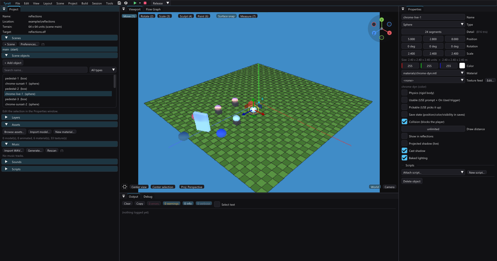

# Reflective materials (sphere-mapped "chrome")



The way PS2-era games faked reflections on car paint and chrome: the GS has no
pixel shaders, so a *spherical environment map* (a small texture of the
surroundings) is sampled per **vertex** with UVs derived from the camera-space
normal, and the mesh is drawn a **second time** with additive blending. The
highlight slides across the surface as the camera moves — that is the whole
effect.

## Authoring

Open *Tools > Material Editor*, pick a material, and in the **Reflection**
section choose a **sphere map** PNG and a **strength** (0–1). A vertical sky
gradient with a bright horizon band makes a convincing default; the map is a
normal power-of-two PNG living next to the `.mtl` (imported like any texture).
Both the Material Editor preview and the scene viewport show the effect live,
with the same math the console runs.

The material file stores it as the standard Wavefront `refl` statement, with
the strength riding in the `-mm` option's gain operand:

```
newmtl chrome
Kd 0.8 0.1 0.1
refl -type sphere -mm 0 0.8 chrome-sky.png
```

Any object using the material — primitives via *Material*, `.obj` models via
their own or an override `.mtl` — gets the reflection pass. Materials without
`refl` are unaffected.

### Rounded normals (flat surfaces)

Matcap UVs come from the surface normal, so a **flat face has one normal →
one sample of the map stretched across the whole face** — a box reflects as
six uniform patches while a sphere sweeps the entire map. Tick **Rounded
normals** in the Reflection section (stored as the TyraX `-rounded` flag,
placed before the filename so last-token parsers stay compatible):

```
refl -type sphere -mm 0 0.9 -rounded @sky
```

The env pass then uses normals **radiating from the part's centroid**
(`normalize(vertex − centroid)`, recomputed at geometry rebuild) instead of
the face normals: every corner of a flat face gets a different UV and the
face sweeps a gradient of the map that pans with the camera — the
curved-lacquer look flat walls and monoliths need. Spheres are unchanged by
construction (their real normals are already radial); base lighting and
geometry are untouched. Zero runtime cost — it is just different data in the
env bag's ST slot.

### Dynamic mode (GT3 style)

Pick **`<dynamic - live sky>`** as the sphere map instead of a PNG (stored as
the filename token `@sky`):

```
refl -type sphere -mm 0 0.9 @sky
```

The game then re-renders the scene's **sky dome, resident terrain and roads**
into a small VRAM texture every second frame and samples that as the sphere map —
reflections follow the live sky and the ground under the vehicle, including
script retints (*Set Sky Color*). The editor viewport
approximates it with the analytic horizon/zenith gradient.

**Objects in reflections:** mark an object's *Show in reflections* checkbox
(Properties; stored as `"reflected": true`) and it is rendered into the env
map too — chrome then mirrors it, GT3-style. Each marked object costs a
second (small, wide-FOV) render per frame, so mark the few props that sell
the effect. The env pass owns a dedicated 128×128 z-buffer, so marked
objects occlude each other correctly inside the map. The editor viewport's
approximation shows the sky only — check object reflections in the game.

For a large background object, enable **Reflection box proxy** below that
checkbox. The environment-map pass then draws one untextured box over the
object's current visual bounds: 12 triangles in one material bag, normally one
VU1 package. The main camera still draws the full model, and collision and
picking are unchanged. This is intentionally a reflection-only lie: the target
is 128×128 and is sphere-mapped afterwards, so a building's material seams and
window geometry often cost many packages while resolving to only a few blurred
texels. Leave it off for nearby hero props or silhouettes that are not box-like.

The field is stored as `"reflectionProxy": true` (format v57). Existing
projects retain full-model reflection submission until the option is enabled.

A marked object the camera is standing right next to is **skipped** from the
map (within ~1.9× its bounding radius): it would swamp the whole reflection —
typically as the inspected surface's own dark self-reflection, which read as
ugly patches up close. It fades back in as you step away.

**The whole town at once:** *Project > Preferences > Rendering > Reflect static
scenery as boxes* draws every static object into the map without marking
anything - see "Static scenery in the probe" below. *Reflect the ground as flat
colour* swaps the probe's terrain and road chunks for a cheap coloured grid -
"The ground stand-in".

## How the PS2 side works

- `LeanObjLoader` parses `refl` (texture + strength) alongside `Kd`/`map_Kd`.
- At geometry build, the generated game captures the **world-space normal** of
  every emitted vertex for reflective parts (`pushVert`, `g_envNormals`).
- The part is submitted a second time as its own `StaPipBag`: same vertex
  array (and `bboxVersion`), all-white
  colors, the sphere map as texture, a standard GEQUAL z-test (the passes are
  coplanar, so the env pass re-writes the same depths — benign; the
  `TestOnly` alpha-fail trick used at first corrupted close-up frames on the
  EE-clipped path: later objects punched through the reflective surface), and
  `fogDisabled` (GS fog would *add* the fog color through the additive
  equation).
- **Both passes are pinned to one VU1 package size** (`StaPipBag::packageSize`,
  set by the generated game's `pinPackageSize`). They must be: the engine
  derives the package size from the bag's *program class*, and an untextured
  base pass fits **111** verts per package where its textured env twin fits
  **75** — so without the pin the same array splits at different boundaries,
  and one pass can classify a triangle as fully inside (perspective divide on
  VU1) while the other sees a straddling package (clipped on the EE, drawn
  `as_is`). Two routes over one coplanar triangle disagree in the last bits of
  z, and at the frustum edge in coverage. The pin is the **minimum** over the
  passes an object draws — pinning a class above its own capacity would
  overflow its VU1 buffer. It also un-splits the frustum-bbox cache, which is
  keyed by package size on top of the vertex pointer: measured on a scene of
  reflective + lightmapped spheres it was worth **+4–6 %** frame rate (126 →
  133 FPS vsync-off in PCSX2), because the companion passes stopped
  recomputing the boxes the base pass had just built.
- **The matcap ST math runs on VU1** (phase 2): the env bag's texture bag has
  `coordinatesAreNormals` set, the normals ride in the vertex stream's ST
  slot, and the `TCE` program family (`stapip_cull_tce_vu1.vclpp` /
  `stapip_as_is_tce_vu1.vclpp` / `stapip_clip_tce_vu1.vclpp`,
  `CalculateTyraEnvStq` in `tyra_macros.i`) computes
  `u = 0.5 + 0.5·(n·right)`, `v = 0.5 − 0.5·(n·up)` from the per-mesh camera
  basis uploaded at `VU1_ENV_BASIS_ADDR`. The EE transposes those two vectors
  and folds the `+0.5/-0.5` ST scale into the same three-qword packet; VU1 then
  evaluates both dot products in one accumulator chain (10 instructions per
  vertex instead of 16). The EE refreshes it per reflective part per frame —
  in **both** clipping modes: the clip_tce
  variant computes the ST from the normal *before* the Sutherland–Hodgman
  pass, so it interpolates through the cuts like a regular texture
  coordinate (the earlier EE-computed-ST fallback for VU1-clipping scenes
  is gone).
- The additive blend equation travels **in-band**: every StaPip mesh's tag
  block carries a GS `ALPHA` A+D pair (`VU1_ALPHA_ADDR`,
  `StoreTyraGifTags*Alpha`) — alpha-over by default, `Cv = Cs·FIX/128 + Cd`
  with `FIX = strength · 128` when the bag sets
  `PipelineInfoBag::additiveBlendFix`. No FINISH barriers, no practical limit
  on reflective mesh count. (The dynamic pipeline keeps the original macros
  and knows nothing of the ALPHA qword.) Consequence for everything drawn
  AFTER the 3D scene: the GS `ALPHA` register holds whatever the last mesh
  set, so the 2D sprite path pins the standard source-alpha equation in
  every sprite packet (`RendererCore2D::render`) — without it the debug
  HUD font drew additively after a reflective frame and its black outline
  vanished (found on real hardware).
- The dynamic env map is re-rendered **every second frame** (the GT3 cadence
  — the VRAM target persists, and a 25/30 Hz refresh of a blurry 128 px
  reflection is imperceptible), halving the pass's per-frame cost. The
  level-forward right/up basis is saved with each target update and reused for
  the intervening sample; applying a newer camera yaw to an older target makes
  stationary reflected buildings swim across the material. A scene load marks
  that basis invalid and forces the next non-split classic view to capture,
  regardless of the cadence phase. Since 1.106.0 the cadence is a CEILING
  rather than a schedule: see "The reuse budget" below.
- Terrain uses the chunks already resident around the main camera. Road capture
  filters the shared procedural list to owner `-3`, so it draws asphalt and
  automatic junctions without also paying for prefabs or procedural volumes.
  These ground layers are static capture content; scene generation
  invalidates the retained map, while ordinary camera translation is already
  bounded by the reuse budget's conservative one-unit nearest distance.

The editor's GLSL twin lives in the viewport fragment shader (`uReflOn` block)
— flat normals from screen-space derivatives, the same camera-basis formula.
**When you change one side, change the other** (the usual twin rule).

## Limits (v1) and the planned "pro" version

- Normals are the loaders' **flat per-face normals** (`vn` is ignored, exactly
  like base lighting), so low-poly chrome looks faceted — a disco ball at low
  sphere detail. **Magnified up close this reads as irregular smudges/patches**
  (each facet samples one point of the map; adjacent facets jump across its
  bands). Raise the primitive detail (24 → 48 visibly cleans a hero sphere)
  or model density for smoother highlights.
- An object crossing the screen edge goes PARTIALLY_IN_FRUSTUM and takes the
  EE-clipper path — that cost is per pass, so a reflective object pays it
  twice; expect an FPS dip when a big reflective mesh straddles the edge
  (same engine characteristic as unreflective geometry, doubled). The VU1
  matcap re-normalizes the clipper's lerped normals, so clipped strips
  sample correctly.
- Animated (`.glb`) models and terrain don't take reflections; static
  primitives and `.obj` models do.
- Dynamic mode reflects the sky, terrain, roads and objects marked **Show in
  reflections**. Unmarked ordinary scenery is not submitted; each included
  object costs an additional render in the environment pass. Terrain and roads
  add their visible chunk submissions on capture frames, so profile the shared
  probe when using many small chunks.
- Remaining "pro" idea: smoothed normals for the env pass.

## Probe aim: reflected ray (Preferences > Rendering)

The classic pass aims the env camera **level along the player's forward**
from the eye — the GT3 trick, correct for skies and "good enough" for
everything else. **Reflection probe: aim along the reflected ray** replaces
that with **one probe render PER reflective object**, anchored to the
object: the eye→center ray is reflected at the surface, using analytic
shapes —

- boxes / save points / planes → **OBB face** test in the object's own
  frame (live rotation honored), the hit face's normal;
- spheres / cylinders / cones → sphere (radius = half the largest scale
  axis; the exact eye→center hit's normal faces the eye, so the probe
  looks straight back at the player — the crystal-ball look-back);
  models → bounding sphere.

Each object's map re-renders **right before that object draws**,
interleaved on the single shared VRAM target (the env bracket's `begin()`
drains PATH1, so the previous object's draws sample *their* map before it
is overwritten). Because the eye→center pose depends only on positions —
never on where the camera points — reflections **stay put when the player
looks around**, and the pose is continuous per object, so there is **no
smoothing at all**. Two reflective objects side by side show genuinely
different, simultaneously-correct reflections. (Two earlier cuts are
recorded in PROGRESS 157: a crosshair-anchored shared probe decayed to the
classic aim whenever the object left the screen center, and its constant
smoothing trailed the camera by ~20 frames.)

Honest limits: **cost scales with the reflective object count** — every
probe is a full 128² render (PATH1 drain + sky + the reflected list) per
frame; a scene with ten of them will crawl, budget accordingly. A single
110° probe camera still cannot cover the full reflected hemisphere, and
inside split-screen halves probes are skipped (surfaces keep the last
map). Off by default (existing projects keep their look).

## Dynamic env map internals

- `RendererCoreEnvMap` (engine fork): a 128×128×32 render target allocated at
  init **below the texture region** (the bump allocator's FIFO free can never
  reclaim it), exposed as a **VRAM-resident `Texture`**
  (`Texture::vramResident`) that `useTexture` binds directly — no PATH3
  upload, never evicted.
- Per frame, `renderScene` (when any loaded material uses `@sky`):
  `envMap.begin(horizonColor)` drains PATH1 and redirects
  FRAME/SCISSOR/XYOFFSET at the target (z writes masked — the pass shares the
  main z-buffer address), clears it, then the sky dome is submitted under
  `renderer3D.pushEnvView(...)` (square 110° projection along the camera's
  level forward, widened frustum planes), and `envMap.end()` restores the
  frame state (+ TEXFLUSH so the scene samples fresh texels).
- Beware the GIF NLOOP pitfall hit while building this: an A+D giftag whose
  NLOOP undercounts its register writes stalls the GIF forever — the game
  hangs on the loading screen inside `draw_wait_finish()`.

## The vehicle paint pass

A placed vehicle's env bag is drawn with the GS **HIGHLIGHT2** texture function
and per-frame per-vertex colours - a fresnel rim in the RGB, a white Blinn-Phong
specular in the alpha (docs/vehicles.md, "A shiny body"). This is gated per
OBJECT (`vehiclePaintFor`), so every other `refl` material keeps the exact
MODULATE + constant-FIX look this page describes. The engine hook it rides is
`StaPipTextureBag::textureFunction` - per-bag TFX, safe on a shared texture
because TEX0 is re-emitted per bag.

The paint colours are a pure function of the normal, so the pass evaluates
each DISTINCT normal once and scatters (1.125.0): the CC96 body's 4212 env
vertices carry 2106 distinct normals. The map is built once per normal array
and logged as `VEHPAINT normals N distinct M`.

Only the driven car and the nearest others up to *Shiny vehicles at once*
(default 2) draw this pass; the rest stay matte (docs/vehicles.md, "The shine
budget"). A second car's pass measured 0.7 ms a frame parked and 1.2 ms while
the camera turned, on a physical PS2.

## The ground in the probe (1.125.0)

The shared probe paints the resident terrain and road chunks into its target,
so the car's paint shows the world under it. A turning camera moves the aim
past the reuse budget on every beat, and the probe then captures every second
frame - and the whole resident ring cost **10-15 ms of each capturing frame**
on a physical PS2 (Motor District, car parked at the 25 FPS spot, camera swept
at ~180 deg/s with the right stick). It was the frame drop on every turn.

*Preferences > Rendering > Reflection ground radius* keeps only the chunks
whose box lies within that distance of the eye. In a 128-pixel target with a
110 deg field of view a chunk a hundred units away is a few pixels at the
horizon. FRAMETIME `work`, ordinary frame, same sweep:

| ground in the probe | mean | worst window |
|---|---:|---:|
| every resident chunk (0, the default) | 25.6 ms | 36.4 ms |
| 40 units | 21.8 | 27.6 |
| **20 units** (Motor District) | **21.2** | **25.2** |
| none at all (measured for reference only) | 20.2 | 23.8 |

At 20 the paint loses only the faint grass streaks near its horizon line.
Objects with *Show in reflections* are not affected by the radius. 0 keeps the
old behaviour, and a project without the key loads as 0 (format v62).

## Static scenery in the probe (1.161.0)

*Project > Preferences > Rendering > Reflect static scenery as boxes* puts every
static object of the scene into the shared probe as **one untextured box**: the
object's own oriented bounds, coloured with the average of its material (Kd x
the texture's mean colour, weighted by triangle count over a model's parts) and
lit with the same `shadeOf()` every static object is baked with. It is one
switch for the reflection-proxy idea: nothing has to be marked, and the paint
of a car mirrors where the buildings are and roughly what colour they are.
The main view, collision and picking keep the real objects.

Which objects get a box is decided on the host (`src/reflscenery.cpp`), and
*Properties* prints the verdict under *Show in reflections* ("In reflections:
drawn as a box", "can move at runtime", "too small"...):

- solid primitives (box, sphere, cylinder, cone, plane, save point) and static
  `.obj` models, whose longest half extent is at least 0.6 units - a bench is
  a sub-texel dot in a 128-pixel target, a lamp post is not;
- **not** anything that can move or appear at runtime (the
  `objectRuntimeMovable` test: physics, pickable, usable, save-state, scripts,
  flow graphs, anything a graph or a sequence names, vehicles, scroller belt
  members) - the table is baked, so a box would stay where the object was;
- **not** animated models, invisible walls, markers, lights, decals, mirrors,
  portals and areas;
- **not** procedural chunks (`procgen-*.obj`): a chunk merges every instance of
  one asset in a grid cell, so its box would be a block over the whole cell;
- **not** objects with *Show in reflections* - those keep their own path (full
  model or *Reflection box proxy*), so authored hero props and anything the
  scene switches on and off (the district's night windows) stay exact.

A streaming layer only decides whether an object EXISTS, so layered objects do
get a box and the game draws a layer's boxes only while that layer is
resident.

**What the game does with it.** Codegen emits the boxes as `REFL_SCENERY` in
`inc/scene_data.hpp` (only while the switch is on, so a project with it off
regenerates byte for byte). On the first capture of a scene the probe groups
them into one bag per 96-unit cell and layer - 36 vertices a box, one submit a
cell instead of one per object - and a cell whose box lies outside the probe's
frustum is skipped before StaPip sees it. A box the probe's eye stands in, or within a
unit of, is left out (the whole target would be its inside: the garage you
drive out of); a cell is rebuilt only when that set changes, right after
`envMap.begin()` has drained PATH1. The reuse budget sees the boxes too: the
nearest one is what camera travel shifts in the target, and a layer streaming
in or out invalidates the capture.

The switch is off by default, in new projects too, because it is not free (see
below); format v88 writes it only when on. It costs nothing in a project
without a `<dynamic - live sky>` material, where no probe runs. Not covered: the
reflected-ray probe mode (*Reflection probe: aim along the reflected ray*)
draws only marked objects, and the editor viewport shows the sky only, as for
every dynamic reflection.

### What a capture costs, measured on a PS2

Physical PS2, `examples/vehicle-playground` as a `benchmark-district.py`
fixture (quiet-debug, parked camera, traffic parked), **reuse budget 0** so the
probe captures on every cadence beat - every second frame, which is what a
turning camera does. One ELF per fixture with a boot-time mode that removes one
part of the capture. The number is the median EE `work` of a frame that
captured minus one that did not; 240 frames per pose per boot, two boots per
mode, round-to-round spread of the mean at most 0.015 ms. Texture uploads were
**0.00 per frame in every mode**: the probe's textures are the main view's and
stay resident, so the cost is geometry and submission, not texture traffic.

| pose | whole capture | sky only | ground (terrain + roads, radius 20) | marked objects | scenery boxes |
|---|---:|---:|---:|---:|---:|
| garage day | 1.37 ms | 0.41 | 0.77 | 0.20 | +1.40 |
| garage night | 2.60 | 0.90 | 0.87 | 0.92 | +1.65 |
| outer road day | 5.57 | 0.87 | **4.65** | 0.14 | +1.18 |
| outer road night | 5.70 | 0.90 | **4.65** | 0.23 | +1.30 |

"Marked objects" are the district's 14 *Reflection box proxy* buildings plus the
night windows; "scenery boxes" is this switch on top of that with the 14
buildings unmarked (189 boxes in that scene). Averaged over a turn (half the
frames capture) the switch adds **0.33-0.57 ms a frame**, and nothing while the
camera is parked (the reuse budget then skips the capture altogether). Most of
it is `dispatch`, not triangles (~700 extra a capture): big boxes close to the
eye cross the probe's 110-degree frustum and go through the EE clipper, and
growing the cells from 48 to 96 units plus the frustum skip bought only ~0.1
ms. **The ground is what the probe spends in the open:** 4.65 ms of every
capture on the outer road is the resident terrain and road chunks within 20
units - which is what the ground stand-in below replaces.

## The ground stand-in (1.161.0)

*Project > Preferences > Rendering > Reflect the ground as flat colour*
(`reflectionGroundProxy`, format v88, written only when on) draws the probe's
ground as a **coarse, untextured, height-following grid** instead of the
resident terrain and road chunks. The paint needs the ground's colour and where
its horizon is, not its triangles - in a 128-pixel sphere map the grass and the
asphalt are a few blurred bands either way.

- **The colours are baked on the host** (`reflscenery::ground`): a 64x64
  albedo map over the terrain's extents - the base material's Kd x texture
  mean, blended with the painted layers by their splat weights - with every
  road painted over it in its surface's mean colour, weighted by how much of a
  texel its ribbon covers (4x4 samples). Codegen emits it as `REFL_GROUND_<n>`
  (12 KB a scene) in `inc/scene_data.hpp`, only while the switch is on; a
  project with it off regenerates byte for byte.
- **The game** builds a 21x21-cell grid around the probe's eye, at least 64
  units out (or the *Reflection ground radius*, if larger: the radius bounds
  the real chunks, and past it the probe would show the clear colour), heights
  from `terrainHeightAt`, colours from the map lit with `shadeOf()`. The grid
  snaps to its own cells so it does not swim, and it is rebuilt only when the
  eye crosses one - with nothing but the map and the heightmap to read, not the
  road triangle search.
- It is **three by three bags** with the eye in the middle one. One bag's
  bounding box always straddles the probe's frustum, so every triangle went
  through the EE clipper; sixteen bags culled better outdoors but paid more in
  per-bag cost than they saved indoors.

Measured the same way as the table above (one ELF per variant, two boots per
mode, rounds within 0.02 ms, a third boot of the old fixture to rule out
drift). The probe's own EE time on a capturing frame, and the mean frame over a
turn (every second frame captures):

| pose | probe: real ground | probe: stand-in | probe: no ground | frame: real | frame: stand-in |
|---|---:|---:|---:|---:|---:|
| garage day | 1.82 ms | 1.79 | 1.09 | 10.81 ms | 10.63 |
| garage night | 2.52 | 2.60 | 1.83 | 13.88 | 13.76 |
| outer road day | 5.52 | **1.99** | 0.96 | 10.79 | **8.82** |
| outer road night | 5.63 | **2.13** | 1.04 | 11.78 | **9.79** |

So **-2 ms a frame on the open road while turning**, and a wash in the garage,
where the real ground within 20 units was already small. The variants that lost:
one bag was best indoors (frame 10.43 / 13.46) and worst outdoors (9.14 /
10.05); 4x4 bags the reverse (10.74 / 13.82 and 8.79 / 9.79). Frames that do
not capture got ~0.15-0.2 ms cheaper too.

What it changes in the picture (PCSX2, the same chase frame on and off): only
the paint, and there the ground reads about 10% darker on the trunk - the
stand-in has no lightmap or AO pass, only `shadeOf()`. The road in the main view
and the stand-in's road colour agree. Not covered: the reflected-ray probe mode,
which draws its own subset, and a scene without terrain (no grid - the probe
then draws no ground at all, as before).

## The reuse budget (1.106.0)

The cadence above halves the probe's cost and stops there. What it cannot do is
notice that the capture it is about to take would come out the same as the one
already in VRAM — and on a parked camera under a still sky, every second one
does. *Preferences > Rendering > Reflection reuse budget* is that second half,
and it avoids recapturing an unchanged view when the capture pose and relevant
scene lighting remain stable.

**The budget is the quality contract, and its unit is pixels of the probe's own
128-pixel target.** Not frames, not milliseconds — how far the retained image
may be out of date, measured in the only raster it is ever seen through. One
radian of aim is `128 / (110 degrees in radians)` = 66.7 pixels, and every pose
term converts through that one factor and is **summed**, so the figure bounds
the worst displacement rather than describing a typical one:

| term | what it measures |
| --- | --- |
| aim | the angle between this frame's level-forward and the captured one |
| camera travel | the distance moved, seen as parallax on the NEAREST reflected object — the dome and the discs are parked on the eye and do not move with it, so the objects are the only thing translation can shift. The nearest distance is clamped to 1 unit, so a scene with **no** "Show in reflections" object at all re-captures on any camera movement even though nothing in its target could have moved: conservative, never wrong, and worth revisiting if such a scene ever matters |
| sun and moon direction | the angle each disc has swung since the capture |
| sun and moon radius | the disc growing or shrinking |
| moon roll | the roll times the moon's own radius in pixels |

**Colour is not traded against the budget at all.** The sky tint, the dome's
top colour, the day-cycle grade compensation, the star fade and the moon's
opacity are compared at the **8-bit precision the GS actually stores**, so a
capture is skipped only when the colours would come out bit-identical. Neither
is content: a reflected object that moves, rotates, scales, appears, vanishes
or dirties its geometry invalidates outright, and so do a scene load (which
already cleared the basis) and a teleport (which the travel term sees as a very
large number).

**It can only ever REDUCE captures.** The every-second-frame cadence stays the
ceiling and the gate is consulted only on a beat the cadence would have
captured on, so the worst case is exactly the pre-1.106 behaviour. **0 turns
the reuse off** and restores that behaviour exactly.

**What the budget costs, stated the way it is actually paid.** The reflection
was already up to one cadence beat out of date; the budget says how many
*extra* target pixels of lag you will accept on top of that. So the worst
displacement goes from "one beat's motion" to "one beat's motion plus B", and
when nothing is moving it goes from zero to zero — a parked camera under a
still sky reuses with a measured staleness of **0.000 pixels**, because the
capture it skipped would have been the same image. The **default of 1.0 pixel**
is therefore one pixel of a 128-pixel reflection at worst and nothing at all at
rest, which is why it is safe to enable for projects that predate the setting.

The shape of what it buys follows from that, and it is the right shape: the
faster the camera turns, the less it saves, because a fast turn is exactly when
a stale reflection would be seen. Measured on the Motor District garage at 50
Hz, the drift a single cadence beat produces is **0.00 px parked, 0.91 px
driving straight at 6 units/s, 0.93 px turning at 20 deg/s and 4.19 px turning
at 90 deg/s** — so at the default budget the hard turn captures on every beat,
exactly as it does today.

**Nothing can take the target away while it is being reused.** The env map is
allocated at init below the texture region and is *never evicted*
(`renderer_core_envmap.hpp`), which is what makes an arbitrarily long reuse
safe rather than a race against the texture heap — the every-second-frame
cadence already depended on it, and this only lengthens the interval.

The gate's own cost is one walk of the runtime objects per cadence beat: a
branch each, plus about a dozen multiplies and a hash for the ones flagged
`reflected`. On the Motor District's 142 objects that is roughly 0.01 ms per
beat against 4.14 ms per capture, and it is paid only on beats the cadence
would have captured on.

Two honest statements go with it. The staleness bound is "the budget, plus one
cadence beat's motion", because drift is noticed on a beat and acted on at that
same beat. And what the budget buys depends entirely on how the camera is
moving — measured on the Motor District garage,
[the round's evidence](../examples/vehicle-playground/authoring/reflection-probe-2026-09-16/README.md)
gives the capture rate idle, driving straight and turning at 20 and 90 degrees
a second, with the worst staleness the gate actually permitted in each.

## Dynamic map camera basis (1.85.0)

The shared `@sky` probe renders with a level forward direction. Its sampling
basis must therefore use world-up, including when a chase camera tilts down.
Previously the sampler used the viewing camera's pitched up vector: visible
rear/side faces sampled below the captured horizon and could show only the
clear colour, despite buildings being present in the environment target.
The generated runtime now matches the capture basis; the viewport's analytic
sky approximation uses the same world-up rule. Static image sphere maps retain
their camera-relative basis, and per-object reflected-ray probes retain their
own captured basis.
