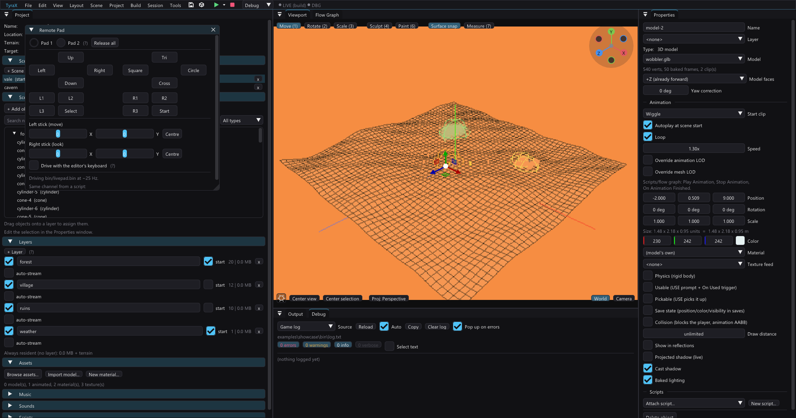

# Remote Pad — hold the running game's controller from the editor (or a script)



Live Link streams edits *into* the running game, the Live Debugger reads *out* of
it, the time machine rewinds it. The Remote Pad answers the question none of
those can: **who is pressing the buttons.**

The editor writes a pad state into `bin/livepad.bin` and the game overlays it on
the physical pad every frame. Two things follow from that, and they are the whole
point:

- **Nothing needs the keyboard focus.** PCSX2 can sit behind the editor, on the
  other monitor, or minimised, and still be driven. (On Windows this is not a
  convenience — a background process cannot reliably give PCSX2 the foreground
  at all, so before this the only way to press a button was for a human to click
  the emulator first.)
- **It is scriptable.** `tyrax-editor --pad` drives the same file from a command
  line, so "walk forward for two seconds, then press Cross" is a test that can
  run unattended, next to a screenshot.

It works in PCSX2 and on a real PlayStation 2 over ps2link, over the same host
filesystem the game already loads its assets from. No debug hardware, no extra
transport.

## Using it from the editor

1. Set the project's build profile to **debug** (*Project > Preferences >
   Build*) — a release build carries none of this.
2. Leave **Remote Pad** on (*Project > Preferences > Build*; on by default).
3. Build & run — **F5** (PCSX2) or **F6** (a console over ps2link).
4. Open *Tools > Remote Pad*.

The panel is a DualShock: click and *hold* a button and the game sees it held —
the state is announced for as long as the widget is down, not for the one frame
of the click. The two sticks are sliders with a **Centre** next to each, because
the generated walker reads the **analog sticks** and never the D-pad: a held
`Up` does nothing at all, while a left stick left at −80 is a player who never
stops walking. **Release all** drops everything.

**Drive with the editor's keyboard** turns the panel into a controller:

| Key | Pad |
|---|---|
| `WASD` / arrows | left stick (move) |
| `IJKL` | right stick (look) |
| `Space` | Cross |
| `E` / `Q` / `R` | Circle / Square / Triangle |
| `Enter` / `Backspace` | Start / Select |
| `1` `2` / `3` `4` | L1 L2 / R1 R2 |

The keys are read only while the Remote Pad window is **focused**, so typing
anywhere else in the editor is unaffected. Focus that window, look at PCSX2, and
play.

*Pad 2* only does something in a multiplayer project (*Project > Preferences >
Multiplayer*) — that is where the generated game opens the second connector.
Start on pad 2 is what hot-joins player two, which makes the join path testable
without a second physical controller.

## Using it from a script

```
tyrax-editor --pad <projectDir> "<script>" [more...]
tyrax-editor --pad <projectDir> --file <script.pad>
tyrax-editor --pad <projectDir> --stdin
```

Commands are separated by `;` or newlines, `#` starts a comment:

| Command | Meaning |
|---|---|
| `press cross [seconds]` | tap and release (default 0.1 s). `tap` is a synonym; a bare `cross` works too |
| `hold up` | hold until released — non-blocking |
| `release up` / `release all` | let go |
| `stick l\|r <x> <y>` | stick to (x, y), each −127..127 |
| `wait <seconds>` | hold the current state for that long |
| `neutral` | release everything on both pads, centre the sticks |
| `pad 1\|2` | which connector the following commands target |

Button names are case-insensitive and accept the spellings people type: `x` and
`o` for Cross and Circle, bare `up`/`down`/`left`/`right` for the D-pad. A
comma-separated list is **one** moment, which is how you get a diagonal or a
combo: `press up,cross`.

```bash
# turn, then walk: an axis-aligned walk over flat terrain barely moves any pixels
tyrax-editor --pad ~/TyraProjects/mygame "stick r 110 0; wait 1.5; stick r 0 0; stick l 0 -127; wait 2.5; neutral"
```

**A `hold` needs a `wait` after it.** The driver detaches when it exits and the
game lets go — deliberately, because a driver killed mid-hold must not leave the
player walking into a wall. To hold something while another tool works, run
`--pad` in the background with a long enough `wait`.

The exit code is 0 when the whole script ran. The driver warns on stderr when
the project is a release build or has the preference off, because then the game
was built without the channel and nothing will happen — the commonest reason
"nothing moved".

## How it works

One file next to the ELF, on the `host:` filesystem (PCSX2's Host Filesystem,
or the ps2link file server):

```
bin/livepad.bin   written by the editor / --pad, read by the game
```

It is **absolute state, not events**: which buttons are down and where the
sticks are, right now. A dropped poll therefore cannot swallow a press and a
doubled poll cannot repeat one. The cost of that choice is that a writer has to
keep the file fresh — the game treats a `seq` that has not moved for 120 frames
(~2.4 s) as "the driver went away" and drops the overlay, which is what stops a
crashed script from leaving a direction held forever. Both writers refresh at
~25 Hz while they hold anything.

Layout v1, little-endian, 36 bytes (`src/livepad.hpp` and the generated
`src/gen/live_pad.gen.cpp` are twins — change them together):

```
u32 magic 'TXPD', u32 version=1, u32 seq, u32 flags (bit0 = attached),
u32 buttons[2] (bit i = kPadButtonNames[i]), s8 axes[2][4] (lh,lv,rh,rv),
u32 footer = seq ^ 0x5A5A5A5A
```

Torn writes are rejected by the exact-size + footer-echo check on both ends, the
same guard the other channels use, and the editor writes through a sibling tmp +
rename.

**That replace races the reader on Windows**, which is worth knowing because the
symptom looks like a dead channel. The game re-opens `livepad.bin` about every
frame through PCSX2's Host Filesystem, and Windows refuses to rename over — or
delete — a file another process has open, so a replace occasionally comes back
`Access is denied` (measured: one denial per ~200 replaces at the driver's 40 Hz
refresh, none at all with the emulator stopped; POSIX `rename` is immune, so
Linux never sees it). The reader holds the file only for the length of one
`fopen`/`fread`/`fclose`, so `livepad::write` simply retries — five spare tries
4 ms apart, enough to absorb an exclusive 60 ms hold in testing.

If a write does lose the file for longer than that, **what happens depends on
what the write carried**: a *step* (a new state — the button you asked for) is an
error and stops the run, while a *refresh* (the same state again, ~25 of them a
second, only there to keep the seq moving) is a warning and the run carries on to
the next one 40 ms later. `--pad` prints the first three such warnings and counts
the rest into its summary line (`done - 7 step(s) in 9.1s, pad released (27
refresh write(s) lost to the reader)`), so a disturbed run says so instead of
looking clean. Before this split a single denied refresh aborted the whole
script, which is what made long Windows holds unreliable: one 9 s script in five
died with nothing but `error: cannot replace ...livepad.bin: Permission denied`
to show for it.

The game side is `livepad::tick(engine, pad2)`, called at the top of
`TerrainGame::loop()` **after** both pads were refreshed from hardware —
`Pad::update()` rebuilds the pad state from the console, so an overlay applied
before it would simply be thrown away. The overlay itself is the engine's
`Pad::injectVirtual`, the same mechanism the USB keyboard/mouse support uses
(docs/keyboard-mouse.md); the two use **different overlay slots**, because
click edges are derived from the previous overlay and two sources sharing one
history would each read as the other releasing everything.

Polling is per frame under PCSX2 (`host:` is a host syscall there) and every 4th
frame over ps2link, where every `fopen` is a network round-trip. So on real
hardware the pad answers a little later; the file format does not change.

## What it costs a shipped game

Nothing, and that is checked rather than claimed (docs/devkit.md). In a release
build — or with the preference off — `src/gen/live_pad.gen.cpp` is an empty
translation unit and `inc/live_pad.gen.hpp` defines `tick()` as an empty inline
function, so the call in the game loop disappears entirely: no poll, no static
state, no file name in the binary. `tyrax-editor --audit-release <project>`
fails if any of it survives (the runtime plants a `TXDEVKIT-livepad` marker so
the audit can see it even though the PS2 toolchain strips symbols).

## Limits

- The overlay **adds** to the physical pad; it never masks it. A real controller
  held at the same time still counts.
- Stick axes are offsets applied to the polled values, so a physical stick that
  is already deflected and a remote deflection sum (and clamp).
- The USB keyboard/mouse path (docs/keyboard-mouse.md) is independent and can be
  used at the same time.
- A pause/step from the Live Debugger freezes the world; the pad state still
  arrives, it just has no frames to act on until the game resumes.
- An [input replay](input-replay.md) **overrides** this channel completely. The
  recorder is the last stage of a frame's input and it *overwrites* the pad
  rather than merging, so a `--pad` script running against a replaying game
  changes nothing. The reverse is what makes `--record --pad` work: the
  recorder reads the pad after the overlay has been folded in, so whatever the
  Remote Pad presses is recorded as though a person had pressed it.
