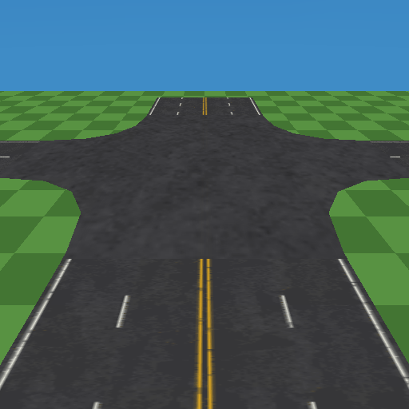

# Road textures — the Road Texture Generator

The Road Texture Generator (Tools > Road Texture Generator, or **Generate...**
beside a Road's Surface material) bakes road surface materials procedurally -
asphalt, cobble setts, gravel or dirt, with lane markings - into
`res/materials/roads/`, so a road looks right the moment it is dropped instead
of starting untextured grey.



## What a new project gets

`project::create` seeds five ready materials, each a `.png`, a one-material
`.mtl` and the editor-only `.roadtex` recipe:

| Material | What it is |
|---|---|
| `road-2lane` | Asphalt, two lanes, dashed white centre line, solid edge lines. |
| `road-4lane` | Asphalt, four lanes, double solid yellow centre, dashed dividers. |
| `road-dirt` | Dirt track with mud and ruts, ragged sides, no markings (5 units). |
| `road-cobble` | Cobble setts, no markings (6 units). |
| `road-junction` | Isotropic asphalt for the **Intersection material**. |

A Road inserted from Insert > Gameplay > Road picks `road-2lane` as its
surface and `road-junction` as its intersection material whenever those files
exist, so two roads dropped across each other already meet in a textured
junction. The files are ordinary authored assets: `res/.gitignore` does not
ignore `res/materials/`, so they are tracked.

## The window

- **Load** re-opens a texture made here (it reads the `.roadtex` recipe).
  **Name** is the file stem in `res/materials/roads`.
- **Surface**, **Wear** (stains, cracks, wheel tracks, chipped paint), **Tint**
  (multiplies the surface colour), **Seed**, **Resolution** (64 / 128 / 256;
  2 / 8 / 32 KB at the default 4-bit quantization).
- **Intersection patch** makes the junction variant: no markings, and it tiles
  in both directions (see the layout contract below).
- **Ragged edges** (dirt only) notches both sides with alpha 0, which pairs
  with the road's Edge fade ([roads.md](roads.md), "Soft edges").
- **Markings**: **Lanes** (0-6), **Design width** (the road width the lines are
  placed for - match the road's Width; auto = lanes x 3 + 1.5), then one block
  per line type - **Centre line** (between the two directions, 2+ lanes),
  **Lane dividers** (between lanes of one direction, 3+ lanes) and **Edge
  lines**. Each has its own style (none, dashed, solid, double solid, solid |
  dashed, dashed | solid), colour (any RGB, with White and Yellow presets),
  line width and, for a dashed style, the dash and gap lengths in units.
- **Save** writes the files. **Apply to selected road** writes them and sets
  the selected Road's Surface material; with Intersection patch on it reads
  **Apply as intersection material** and sets that slot instead. Both are
  ordinary undoable edits.

The preview shows the texture repeated as a strip of road at its design
proportions (or 2 x 2 for a junction patch), on a grass-coloured ground so the
ragged sides show.

## Layout contract

The texture follows the road tessellator's mapping ([roads.md](roads.md)):

- U runs 0..1 **across the full road width**, so markings are placed across U
  in world units of the design width. A road wider or narrower than that
  stretches them.
- V runs **along** the road, one repeat per 4 units (`roadgen::kTexLen`). The
  image tiles in V, and a dash pattern must divide the repeat: dash + gap is
  snapped so a whole number of periods fits 4 units, keeping the dash/gap
  ratio (the tooltip shows what is drawn). 2 + 2 is one dash per repeat,
  0.6 + 0.7 becomes three 0.62 + 0.72 dashes. Dashes are centred in their
  periods, so none crosses the seam.
- A junction patch is mapped in world space, one repeat per **32** units in
  both axes, so the intersection variant has no direction and tiles in U and
  V. Its noise is sized in world units like the strip's, so the grain matches
  where an arm meets the patch; at 128 px a texel is 0.25 units, so setts
  turn into noise there - asphalt is the junction surface that reads well.
- No line is drawn thinner than about one texel, and the two lines of a pair
  keep at least one clear texel between them, so a wide road at 64 px does not
  fade its lines to grey.
- Alpha is 255 everywhere except the ragged sides of a dirt track. StaPip
  discards alpha-0 texels (the GS alpha-test cutout trap), so alpha 0 is never
  written inside the road.

## Files and determinism

`res/materials/roads/<name>.png`, `<name>.mtl` (`newmtl <name>`, `Kd 1 1 1`,
`map_Kd <name>.png`) and `<name>.roadtex`, each written only when its bytes
change. The recipe is `key=value` text; the texture bake treats `.roadtex` as
editor-only (it never reaches `.res-baked/`), and in the Asset Browser it
follows the same-stem `.png` or `.mtl` it sits next to through a move, rename
or delete, like a `.drone` patch. **Load** only lists recipes that are still in
`res/materials/roads`.

The pixels are a pure function of the recipe - seeded hashes and periodic value
noise, never a running RNG - so the window's preview, the saved file and the
CLI agree byte for byte (checked: the -O1 editor and an -O2 host harness give
identical md5s).

## Headless

```
tyrax-editor --road-texture <projectDir> <name> [key=value ...]
```

Starts from `<name>.roadtex` when it exists (so the keys edit it), else from
the defaults. Keys are the recipe file's own: `surface=asphalt|cobble|gravel|dirt`,
`lanes=0..6`, `wear`, `tint=r,g,b`, `seed`, `size=64|128|256`, `width`
(0 = auto), `ragged=0|1`, `intersection=0|1`, and per line `L` = `centre`,
`divider` or `edge`: `L=none|dashed|solid|double|solid-dashed|dashed-solid`,
`L.colour=white|yellow|r,g,b`, `L.width`, `L.dash`, `L.gap`. Exit 2 on a bad
key or value.

| File | What it is |
|---|---|
| `src/roadtex.hpp/.cpp` | The generator, the recipe text, the asset writer and the presets (host-only). |
| `src/roadtex_ui.cpp` | The Tools window. |
