# Roads — spline streets glued to the terrain

A **Road** object (Insert > Gameplay > Road) is a polyline of world-space XZ
points, a width and one texture. Everything else is derived: a Catmull-Rom
spline threads the points, and the surface is tessellated **at boot** — a row
every ~1 unit along the spline and a vertex every ~0.5 unit across it, each glued
to the terrain underneath (+0.12 lift), V running along the arc length so one
texture repeat covers 4 units of street. The cross-road subdivisions prevent a
single wide planar strip from dipping below a rolling heightfield and exposing
grass triangles through the asphalt. Height queries use the same two planar
triangles per cell that the terrain renderer draws — not a different bilinear
saddle — so projection, driving and the visible ground agree. The authored cost stays tiny: **a
kilometre of road is a few hundred floats in the `.tyra` and ONE small texture
in VRAM.** There is no baked geometry to store, ship or stream.

## Authoring

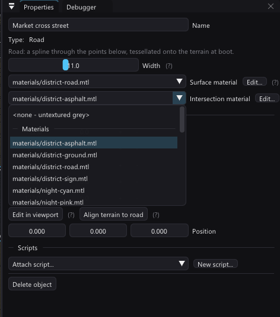

- **Points** and **Crossings** are collapsible Properties sections.
  Points opens by default; Crossings starts folded to keep long streets compact.
- **Points** live in the Properties panel: a table of XZ pairs with insert
  (`+`, midway to the next point) and remove (`-`). The selected road draws
  editing edges and point markers over the road in the viewport. The surface
  underneath is real textured, depth-tested geometry — the exact strip the
  game will build, because the preview and the runtime share the tessellator
  (see below). It is not a screen-space translucent approximation.
- Click anywhere on that textured surface to select the road. Picking tests the
  generated triangles themselves; the unused object-position cube and transform
  gizmo are not road controls and are not shown. Use **Edit in viewport** for
  point-level changes.
- **Width** is the full surface width in world units.
- **Surface material** picks a project `.mtl`; its first material's `map_Kd`
  is tiled along the road. Empty = untextured grey. The picker can import or
  open that material directly in the Material Editor. Direct PNG paths from
  older projects remain readable and appear in a separate legacy section of
  the picker, but new authoring should use a material so a texture replacement
  has one owner. Road UV scale remains fixed at one repeat per four world units;
  the other MTL properties are not applied to this boot-generated surface.
  **Tools > Road Texture Generator** (the **Generate...** button beside the
  picker) bakes asphalt, setts, gravel or dirt with lane markings into
  `res/materials/roads/` ([road-textures.md](road-textures.md)). A new project
  is seeded with five of them, and a Road inserted into it starts on
  `road-2lane` with `road-junction` as its intersection material - textured
  from the first click. Empty still means untextured grey. The Motor
  District's road textures are hand-made checked-in PNGs
  (`examples/vehicle-playground/res/textures/district-*.png`).
- **Intersection material** enables automatic junctions. Wherever roads of
  the same **rank** meet - a crossing at any angle, a road ending on another
  (a T or a fork), two road ends sharing a spot (a corner) - and they all name
  the same non-empty material, the build makes one **node patch** there with
  rounded corners (roads of different ranks follow "Crossings" below; how a
  node is found and shaped is "Road nodes" below). Empty or different values
  are deliberately left alone instead of choosing a material by object order.
  Its first `map_Kd` supplies the patch texture, mapped in world space (one
  repeat per 32 units, no direction), so an isotropic asphalt texture shows no
  seam where an arm meets the patch; legacy direct PNG references still work.
  The viewport shows the same generated patch and texture.
  One crossing can differ from these rules: see "Junction overrides" below.
- **Align terrain to road** flattens the heightfield to the road's line: the
  grade is snapshotted first (the spline's height read off the current
  terrain, box-smoothed twice along the line so no single cell's spike
  survives), then every cell within `width/2 + 3` units is levelled to it
  with the flatten brush's own falloff. One undo step, like a brush stroke.

- **Edit in viewport**: click the ground to APPEND a point, click a point
  marker to DRAG it, click the line between points to INSERT one there;
  **Shift+click** a point marker to delete it (at least two open-road controls
  or three loop controls remain). Shift+click on empty ground does nothing.
  Esc stops, every operation is one undo step. Every road draws as its actual
  textured strip; the selected one additionally gets edges and markers.
- **Close a loop**: drag the final point onto the first marker and release
  within 14 screen pixels. The two endpoints become one edit handle, and the
  Catmull-Rom neighbours wrap across the join so both road shoulders meet
  smoothly. At least three remaining controls are required. **Ctrl+Z** restores
  the point before the drag, including its original position. **Closed loop**
  in Points also closes a road without moving existing controls; uncheck it to
  reopen the road at its seam. Move the shared handle to move both endpoints.
  Insert on the closing segment just like any other segment; a closed road
  ignores empty-ground appends until reopened.
- The mouse wheel zooms the camera during road editing. Point hit areas and
  road borders are clipped to the scene image, so off-screen controls cannot
  grow a scrollbar or move the viewport panel (fixed in 1.151.1).
- Editing outlines reuse the viewport's terrain-aware geometry cache instead
  of tessellating every road again every frame. During a viewport point drag,
  asphalt and handles update live; junction patches, spills and diamonds keep
  their last completed positions and rebuild after release. This avoids two
  full crossing-planner runs per drag frame. Build output always uses the final
  exact points, with no preview simplification or changed road detail.

- An ordinary road has no vertical authoring offset: every left and right edge
  vertex is sampled independently from the terrain. The short-lived 1.77
  `roadHeights` lift is still accepted when an older file contains it, but is
  ignored and cleared the next time the spline is edited. A road that should
  leave the ground is a **bridge** (see "Bridges" below), which gives that same
  per-point field a new meaning.
- The road OBJECT does not collide (`objectCollides` excludes it) — the
  surface is procChunks, and the box at the object's position was an
  invisible wall you could hit.
- **Align terrain to road** is FLAT across the road's width (full strength
  inside `width/2`), with the cosine falloff only on the ±3-unit
  shoulders — the per-station flatten brush crowned the surface. The road keeps
  its small surface lift afterward, so the aligned terrain does not z-fight it.

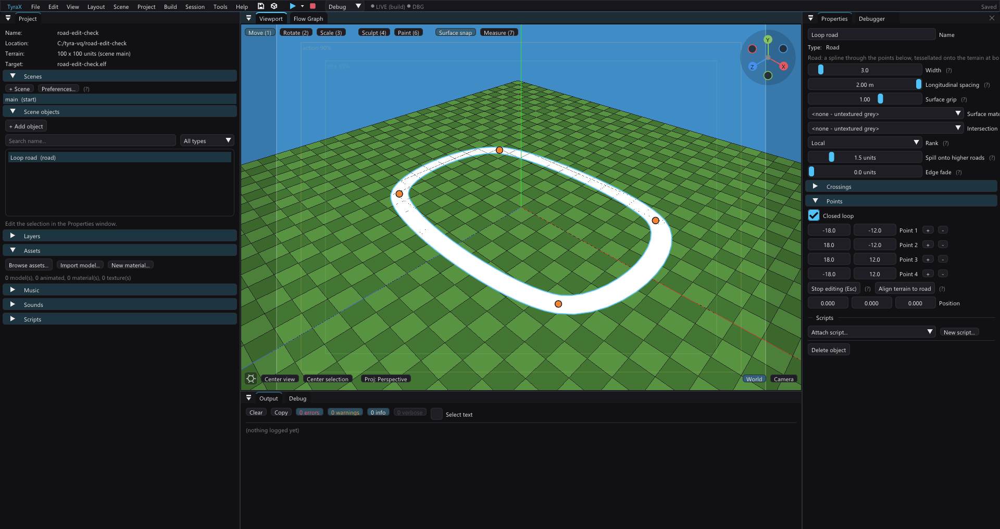

## Closed-loop storage

Loops use the existing `roadPoints` array: the final XZ pair exactly repeats
the first. The repeated pair is a seam sentinel, not a second editable handle.
No new project field or format version is needed; save/load, undo/redo and
collaboration already carry the entire array. Existing roads with coincident
endpoints now use the same periodic interpolation. Open roads retain their
clamped interpolation. The host tessellator and generated runtime wrap the
same controls and use the same final tangent. Longitudinal texture V remains
arc-length based; a loop whose length is not a whole texture repeat may still
have a texture phase seam.

## How it runs

The object itself emits **no runtime geometry** (type 22 is authoring-only in
`rebuildObjectGeometry`, like an area). Instead the codegen writes tables —
`ROAD_DEFS` (scene, point range, width, texture slot), `ROAD_POINTS`,
`ROAD_TEXTURE_PATHS` (selected materials resolve to their first `map_Kd`, then
deduplicate and lose the `res/` prefix: the game's asset root is `bin/`, which
holds `.res-baked`'s content) — and `buildRoads(scene)`
tessellates them into **procChunks** at scene load, at most 36 spans per chunk
and a target budget of 1,800 vertices (a single wider span stays indivisible),
under owner `-3`. That buys the proc pipeline's whole economy for free:
per-chunk AABBs, one submit per visible chunk, and `procFinishChunks()` building
the bags. Since 1.117.1, the generated renderer tests each chunk's world AABB
against the current view before entering StaPip; wholly invisible chunks pay
only that coarse test, while intersecting chunks still use StaPip's precise
package classification and clipping. The road-only reflection pass uses the
same early reject against the probe camera. The call sits **after** the
procedural-volume build on purpose — that block clears `procChunks` on every
scene load, and the first placement of this call built five chunks that were
wiped ten lines later (a road only the boot log ever saw). `ROADS scene N
chunks M` in `bin/log.txt` is the acceptance line.

Intersection detection and surface fitting are entirely host/codegen jobs.
Since 1.151.2, `tessellateJunctionSurface` fits the patch to the **actual road
triangles**, including rank lift, rather than sampling only its centre and four
corners on the terrain. That old fan let curved roads protrude through the
intersection material on uneven ground (Market cross street's east endpoint).
The editor, vehicle test drive and generated game use the same patch builder.

The builder clips each nearby road triangle against each patch triangle and
checks their height difference at every overlap corner. Since the difference
of the two planes is affine, this bounds the entire overlap, including narrow
ridges missed by a sampling grid. It refines triangles needing more than
0.01 units of correction, splitting neighbouring edges too so no T-junctions
appear. After at most three passes (256 triangles), the remaining measured
correction plus a 0.0001 float guard guarantees the normal 0.02-unit clearance.
The safety cap preserves clearance on extreme terrain; its remaining correction
can exceed 0.01, so a sharply folded junction may still look raised.

Generated `ROAD_JUNCTIONS` rows select baked **XYZUV** vertices from
`ROAD_JUNCTION_VERTS`. Scene load only uploads those vertices in bounded
triangle-list chunks; the EE does no road pairing, surface fitting or additional
per-frame junction work. Flat/slope-only patches retained 12 vertices (since
1.170 a node's fillets make a flat four-way 90; see "Road nodes"). Geometry
on uneven junctions costs additional rendering work: this is a correctness fix,
not an FPS optimization. In the saved Motor District, the main scene's 14
patches increase from 168 to 1,362 vertices (+1,194); dense's six increase from
72 to 312. Most flat patches remain at 12 vertices.

`authoring/verify-road-twins.py` checks flat and sloped crossings, terrain folds,
Main rank and both Market endpoints against an independent world-space sweep,
then uploads nonempty baked rows through the extracted generated `buildRoads`
and compares XYZUV exactly. The saved Market fixture reproduces penetration in
the old fan and passes with the new patches (225 vertices across both ends).

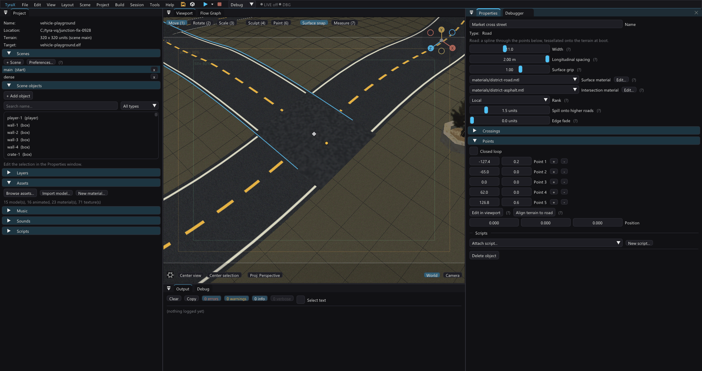

Road tables are emitted independently of vehicle tables. A road-only project
therefore gets `ROAD_DEFS`/`ROAD_JUNCTIONS` even when it has no vehicle
definition; this is covered by the headless road-only generation fixture.

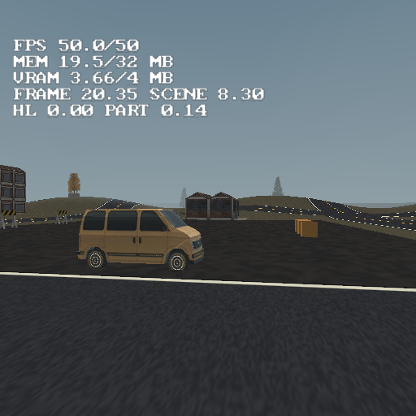

## Road nodes (1.170)

A **node** is one place where roads meet, however many and however they meet.
`roadgen::findNodes` finds them on the host in three steps:

1. **Contacts** between every pair of roads: their centre lines crossing (at
   any angle - the old crossing finder refused anything under ~14 degrees), and
   an open end of one road lying within the other's half width + 1 unit (a T, a
   fork, or two ends sharing a spot).
2. **Clustering**: contacts closer than the widest half width involved + 0.5
   are one node, so three roads meeting at one point make one node, not three
   pairwise crossings.
3. **Arms**: every road leaves the node once if it ends there (within the
   other roads' half width + 1.5) and twice if it runs through. An arm knows
   its road's centre line, so its edges follow the curve.

A node with fewer than two arms, or two arms almost in line (a road simply
continuing into another, more than 150 degrees apart), is not a junction.

**The outline** (`Junction::outline`, counter-clockwise) is built arm by arm,
sorted by angle:

- each arm is cut square at its **trim distance**;
- the gap between neighbouring arms closes with a **fillet**: a curve tangent
  to both road edges, radius 1.5 x their mean half width (1 to 8 units).
  Corners use a quadratic Bezier rather than an arc, so a fillet still meets a
  curved edge tangentially;
- the outside of a sharp turn (a side wider than 180 degrees, such as the far
  side of an L corner) is rounded around the node instead;
- the trim grows until the fillets fit, and is capped at 3 x the arm's width
  and at half the road to the next node. A fillet that no longer fits shrinks.
  One that cannot shrink enough (a slip road leaving at a shallow angle) is
  **cut**: the outline follows one arm's cap until it meets the other arm's
  edge, so the gore between them stays ground.

The outline does not have to be star-shaped around the node centre (an arm on
a bend can curl around it). It must be simple; a self-crossing ring falls back
to its convex hull.

**The patch** (`tessellateJunctionSurface`) is unchanged in what it promises
(at least 0.02 above every road triangle under it, XYZUV baked on the host, the
EE only uploads it). Three things changed:

- a star-shaped outline is a fan from the centre; any other outline is
  ear-clipped;
- a fillet reaches past the roads onto bare ground, so the terrain's own
  triangles (`roadgen::TerrainGrid`, the scene's render grid) join the
  clearance proof - the patch clears the ground between its vertices, not only
  at them;
- **where the fan cannot follow the ground** (its proof needs more than 0.01),
  the outline is cut along the terrain's own triangles instead, so every piece
  lies in one ground plane. Splitting a fan's long thin triangles chords across
  every fold and reaches the vertex cap well above tolerance; the grid cut
  reaches tolerance at half the vertices. Measured on the Motor District main
  scene: 9 033 vertices for the refined fan against 4 410 for the grid cut,
  with the worst float above the road 0.06 against 0.02.

The callers pass the grid: codegen and `decalproj` build it from the scene
(`terrainGridOf`), the viewport from its own heightmap (`Viewport::
terrainGrid`). An unknown grid falls back to 2-unit cells.

What the nodes cost, measured on the Motor District (`ROAD_JUNCTION_VERTS`,
same 14 / 6 / 14 patches per scene as before):

| scene | before | after |
|---|---:|---:|
| main | 1 362 | 4 314 |
| dense | 312 | 2 907 |
| procedural | 168 | 1 380 |

A flat four-way went from 12 vertices to 90 (its four fillets). The rest is the
uneven ring junctions. On the main scene that is about 3 000 more road vertices
on top of ~25 000, uploaded once at scene load as triangle lists; it has not
been priced on a console.

The district then gained six roads that show the node kinds (the example's
README names them: a T into a Y fork, a slip road, a T into an L corner). With
them the main scene has 22 patches and 6 981 patch vertices, and the game logs
`ROADS scene 0 chunks 80 vertices 34656` and `ROADSTRIP ... packages 493
triangles 24612`. Older measurements in this page and elsewhere were taken on
the seven-road district.

Two dead ends, measured, so nobody repeats them:

- **Decimating the grid cut with meshlod** (outline locked). Most of a node's
  grid vertices lie on its outline, so the collapse stalls (131 -> 91
  triangles). It also flattens folds and breaks clearance by 0.05 to 0.3 units.
- **Merging whole coplanar cells along a row** (the flat-road reduction asked of
  the ground). On the district's uneven nodes about a third of the cells are
  whole and no two neighbours share a plane, so it merged nothing.

Verified by `--vehicle-check` "road nodes" (T, Y fork, 14-degree slip road,
three roads through one point = six arms, L corner, end-to-end continuation),
by `verify-road-twins.py` (clearance swept over the outline polygon, runtime
upload exact across 1 800-vertex chunks), and in PCSX2 on a scratch project
with each kind on flat ground and on rolling hills.

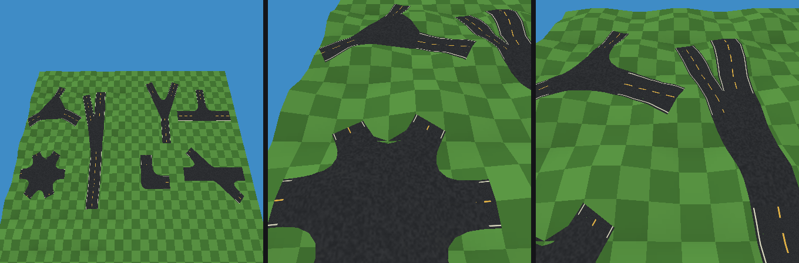

## Transition nodes (1.171)

Two roads joined end to end in line used to make no node at all. When their
WIDTHS differ (by more than half a unit), the join is a **transition node**: its
patch is the taper from the wide road to the narrow one, 3 units long per unit
of width lost (4 to 20 units), laid entirely on the narrow road's side. It sits
there because the wide road's own ribbon ends at the node at full width; a taper
reaching back into it would leave the wide ribbon's corners showing outside it.
Every corner of a transition outline is cut straight (`nodeOutline`'s `taper`),
so it is a trapezoid. It follows the patch rules like any node (equal ranks and
the same intersection material), and it gets no markings.

A change of SURFACE at one width (asphalt into a dirt track) is not a
transition: give the two roads different ranks and the lower one spills onto
the higher, or overlap their ends.

## Markings (1.171)

Every patch node is painted: untextured white geometry baked on the host by
`roadgen::bakeMarkings` and laid onto the roads and patches it covers
(`kSpillLift` above them, split where the surface bends), uploaded as one more
`ROAD_JUNCTIONS` row with `tex = -1` and its colour in the new `rgb` column. So
it costs no texture and no VRAM, one bag per scene, and no work per frame.

- **Edge lines.** The road texture's edge line is carried round the node along
  every outline segment that is a road edge or a fillet, never across a cap,
  where the road and its own painted line carry on (`Junction::outlineCap`
  marks those). Where it sits across the width comes from the road: a texture
  made by the [road texture generator](road-textures.md) has a `.roadtex`
  recipe, and `project::crossingRoads` asks it (`roadtex::edgeLineSpan`); any
  other texture gets the Motor District's columns 5..8 of 128
  (`CrossingRoad::edgeU0/U1`). A recipe with no edge line paints none round the
  node. The node uses the average of its arms, so roads of different textures
  meeting at one node show a small step at the caps. The paint is always one
  white, solid line, whatever colour or dash the texture's edge line has.
- **Stop lines** on the road that gives way: one ending at a node another road
  runs through (a T), or at a crossing of through roads the lower rank, then
  the narrower, then the later one. Across the incoming lane only, assuming
  right-hand traffic, just inside the patch.
- **Zebra crossings** (opt-in): 0.5-unit stripes on a 1-unit pitch, 3 units
  long, across every arm just past the patch, on nodes of three or more arms.

Each road chooses with **Markings** in Properties (`roadMarkings`, format 96,
written only when not 1): *None*, *Stop lines* (the default, edge lines
included) or *Stop lines + zebras*. A node paints edge lines only when every
road at it allows markings. Paint that would hang past a road is dropped.

Cost: a T on flat ground is 84 vertices of paint (edge lines and one stop
line), 198 with zebras - a straight run of outline is one stripe, split only
where the ground bends by more than 1 cm. The Motor District (zebras on Skyline
avenue only) paints 4 860 / 1 182 / 2 328 vertices in its main / dense /
procedural scenes; the district's uneven ground is what splits them. The paint is not a shadow receiver: baked shadow decals
lie under it, so a stripe stays white in a building's shadow.

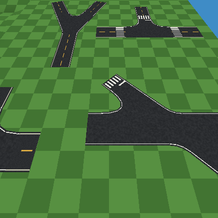

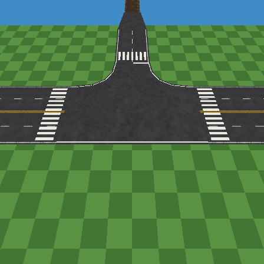

**The bug the paint found.** The first PCSX2 run drew no paint at all, while the
data was right. The paint row's world box reached +infinity in Y: on the
six-armed node over rolling ground, one sliver triangle of the grid cut had no
area in XZ, `plane()` answered -1e30 for it, the clearance proof read that as a
1e30 deficit, and the whole patch was lifted out of the world - taking the
paint, laid onto that surface, with it. Slivers are now skipped by the proof and
dropped by the ear clipper. `--vehicle-check` "a node patch on rolling ground
stays on the ground" pins it on a real heightfield.

## Kerbs (format 95)

A road's **Kerbs** checkbox (`roadKerb`, off by default) puts a concrete kerb
along both of its edges. **Kerb height** (`roadKerbHeight`, 0.02-0.5, default
0.15) and **Kerb width** (`roadKerbWidth`, the flat top, 0.05-1, default 0.25)
size it. All three are written only when they differ from the default, so an
untouched road saves byte-identical.

The profile is the cheapest one that reads as a kerb: a vertical **face** at the
road edge, from 0.04 below the road surface up to the kerb height, and the flat
**top** from the edge outward by the kerb width. There is no bottom and no back
face; nobody sees them, and nothing in this engine backface-culls, so the face
is visible from both sides anyway.

Where a kerb runs (`roadgen::planKerbs`, host only):

- **Along both edges of each kerbed road**, cut wherever the kerb would enter a
  drawn junction patch or stand on another road. The cut is placed by
  bisection and snapped onto the patch's own kerb end, so the two meet in one
  point.
- **Around each patch outline**, minus the arm caps (where a road carries on),
  minus anything on a road or on another patch. Each remaining run is the kerb
  round one fillet, round the outside of an L corner, or along the far side of
  a T. It is kept only when the roads at **both** of its ends have kerbs.
- Crossings without a patch (different ranks, or equal ranks without an
  intersection material) get no ring. Each road's kerb simply stops at the
  other road's edge.

Points sit on the drawn surface. Heights are read 0.1 inside the road or patch
through `roadgen::Surface`, so a kerb follows the rank lift and the patch fit.
Patch outline segments are subdivided to 1 unit so the heights follow the
patch. Then each line is merged: a point goes when the chord around it is within
**0.02 units** of it, both sideways and in height (`kKerbTolerance`). A merged
chord is at most 8 units long, and the normal may turn at most about 6 degrees.
A straight street therefore costs a point every 8 units, while a bend keeps
what it needs.

The kerb has **no texture and costs no VRAM**. Shading is baked into the vertex
colours: the top is 0.78 grey and the face 0.56, with a slightly warm tint.
Each kerb point is four strip vertices: two for the face strip and two for the
top strip.

### How it runs

The kerbs follow the junction patches' pattern: the host bakes them and the
console only uploads them. **There is no EE twin to keep in step.** The codegen
emits `ROAD_KERBS` (one `{scene, first, count}` row per chunk) and
`ROAD_KERB_VERTS` (x, y, z, shade). Both are emitted only when some road has
kerbs, so every other road project regenerates byte-identically (the upload
block in `buildRoads` is gated the same way).

- **Triangle strips** under the road chunks' run contract (`roadgen::
  kStripRun` = 75, `roadgen::kerbStrips`). Full runs carry their last two
  vertices over, and separate strips join through repeated vertices. A
  chunk's last run is padded to a multiple of 3. `TYRA_STRIP_ROADS 0` expands
  the same runs into a triangle list.
- **Chunks of one 32-unit cell** (`kKerbCell`), cut by segment midpoint, at
  most 1 800 vertices. A chunk's box stays about a street block wide, so the
  frustum and the draw distance drop kerbs a block at a time.
- **Owner -4**, not the roads' -3. `renderProcChunks` draws them, using its
  frustum reject, chunk draw distance and occlusion test, and their cost lands
  in the `Procedural` profiler row. The road height index takes them as well
  (see "Kerb collision" below).
- **A draw distance of 60 units** (`ROAD_KERB_DRAW_DISTANCE`, the chunk's
  `drawDist`, measured from the chunk centre). A 15 cm kerb is a few pixels at
  that range.
- `ROADKERB scene N chunks C vertices V packages P triangles T` in
  `bin/log.txt` is the acceptance line. `--road-crossings <project>` prints the
  same totals plus one line per road, from the same bake.

The viewport draws the same lines from `roadgen::planKerbs` as triangle lists
(`kerbTriangles`). They are rebuilt with the crossings, so the editor shows
what the console builds.

### Kerb collision

**A kerb's top is solid ground.** The road height index (`buildRoadHeightIndex`,
read by `roadSurfaceAt` and `groundSurfaceAt`) takes the owner -4 kerb chunks
along with the -3 roads. A wheel that clips a kerb rides up onto it, and blob
shadows and light pools lie on top of it. The vertical faces have no area in
XZ, so the barycentric test drops them by itself. The kerb grip is 1.

- **The walker** stands on roads and kerb tops too, through
  `walkGroundAt(x, z, feetY)`: the terrain, or the road surface when it is no
  more than 0.5 units above the feet (the same step `collidePlayer` allows onto
  objects). A road on a ramp or a bridge overhead therefore never teleports a
  walker up onto it. All three walk loops use it (FPP, the per-player avatar
  and the split-screen walker).
- **The test drive** sees the same tops: `roadgen::addKerbsToSurface` adds them
  to the host `Surface` after the patches. `--vehicle-check` ("kerb
  collision") checks that a kerb top is one kerb height above the road, with
  nothing past its outer edge.
- **A kerb is a step, not a wall.** A 0.15 kerb is lower than a wheel's
  suspension travel, so the car bumps over it rather than stopping.
- **Rebuilds:** the kerb upload sets `roadIdxDirty`. A scene load erases and
  pushes back the same number of kerb chunks, so the index's chunk-count check
  alone would miss the change.

Kerbs are **not shadow receivers**: the shadow bake's road hash does not include
them, so turning kerbs on leaves a baked-shadow cache fresh.

### What they cost

Measured on the Motor District main scene, with all 12 asphalt streets kerbed
and the dirt West service lane left bare:

- **Geometry**: 141 kerb lines, 3 449 units long. They make 4 636 triangles
  as 6 558 strip vertices in 71 chunks (121 packages). That is about 1.9
  strip vertices per unit of kerb. The Ring road alone is 50 lines, 1 485
  units and 2 024 vertices. A straight street such as Garage boulevard is 504
  vertices over 327 units. `--road-crossings` prints every road.
- **Untouched**: `ROADS scene 0 chunks 80 vertices 34656`,
  `ROADSTRIP ... packages 493 triangles 24612` and `ROADINDEX cells 66x66
  entries 62872` read the same with kerbs on and off.
- **PCSX2, frozen camera, interleaving pinned off, three `--profile-frame`
  captures per arm** (emulated EE timing, so treat the numbers as rough):

| pose | `Procedural` off -> on | `Total` off -> on | HUD FPS off / on |
|---|---:|---:|---:|
| street level beside a fillet (eye 0.8) | 0.02-0.06 -> 0.33-0.35 ms | 7.6-8.9 -> 8.1-8.9 ms | 30 / 30 |
| raised view over the Garage x Foundry node (eye 6) | 0.02-0.03 -> 0.47-0.50 ms | 8.7-10.3 -> 9.3-9.8 ms | 28 / 28 |

So the kerbs cost about **0.3-0.5 ms of EE time** where several kerb chunks are
within draw distance. That is mostly per-chunk submit cost, because the chunks
are small (about 92 vertices each). The frame rate did not change at either
pose. This has not been measured on a physical PS2. If it shows up there, the
first lever is larger chunks: a bigger `kKerbCell`, with the draw distance
raised to match.

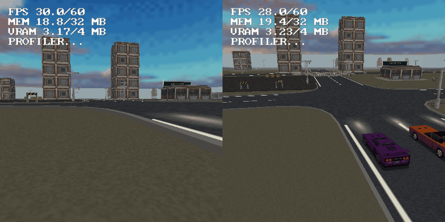

Kerbs and node markings together on the Motor District (PCSX2): the kerb
round a fillet, the painted edge line inside it, a zebra beyond.

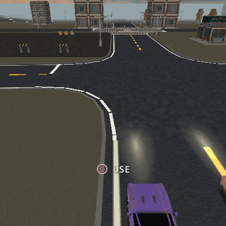

### Limits

- No collision, and no surface query answers the kerb top.
- One profile and one colour. A pavement (a wide raised walk behind the kerb)
  is the same sweep with a wider top and a texture, and is not built.
- The draw distance is a constant, not a project setting.
- A ring around a patch takes the first end road's height and width. Two kerbed
  roads with different kerb sizes meet with a step.
- A crossing without a patch only cuts the kerbs. It does not round them.

`--vehicle-check` "road kerbs" builds a kerbed T and checks that:
- the kerb runs around both fillets and along the far side;
- the stem's own kerb stops at the patch;
- no kerb point stands on a road;
- a straight edge merges to at most a point every 8 units;
- every ring end meets its road's kerb end;
- the strip runs hold exactly the list's triangles;
- a fillet loses its kerb when one of its roads has none.

## Bridges (format 100)

A road with **Bridge** ticked leaves the ground: its deck runs through a height
profile instead of hugging the terrain, and wherever it stands clear of the
ground it gets parapets, a deck edge and underside, piers and abutments. It is
the same Road object - the same points, width, material and rank - plus one flag
and one number per point, so a bridge is authored the way a street is.

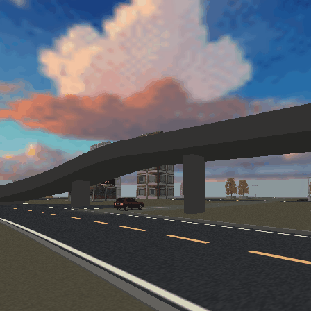

### The model, and why this one

Each control point carries a **Height** (`roadHeights`, Properties > Points,
0..30): the deck's height above the terrain AT that point. The deck at any
station is the Catmull-Rom of *(terrain at point k + height k)* along the same
spline parameter as the XZ, clamped between the segment's two control values so
a plateau never bulges and a ramp never dips below its foot. A deck vertex is
the **higher** of that profile and the ordinary glued road there.

That one rule gives the two cases people actually build:

- **Every height 0: a valley bridge.** The deck runs straight from control point
  to control point and spans whatever dip lies between them - a river, a ravine -
  with nothing to tune. Where the terrain rises above that line, the road is
  simply on the ground again.
- **A raised point: an overpass.** Points `0, 3, 6, 6, 3, 0` are two ramps and a
  span; the ramps are as long as the neighbouring points are far apart, so the
  grade is controlled by point spacing, which is already what the author edits.

Two alternatives were weighed. A flag plus an automatic profile (straight line
between where the deck leaves and rejoins the terrain) handles valleys but
cannot make an overpass on flat ground, which is the commoner case in a city. A
per-point ABSOLUTE height would make every bridge break when the terrain is
re-sculpted under it; heights relative to the terrain at the point keep the
abutments on the ground through a sculpt. The deck is **flat across** (one
height per station), so a station pair wholly in the air is one full-width quad.

`roadHeights` only means this when `roadBridge` is on. On an ordinary road it is
still the retired lift: ignored, and cleared by a point edit. On a bridge it is
kept in step with the points instead: inserting a point interpolates its
neighbours' heights, deleting one removes its height (`roadbridge::onPoint*`).

### Host-baked, so the EE twin did not grow

Every ordinary road is tessellated **on the EE at boot** from `ROAD_DEFS`, and
`buildRoads` is a hand-kept twin of `roadgen.cpp`. A bridge is not: the codegen
leaves it out of `ROAD_DEFS` altogether and bakes it, like the junction patches
and the kerbs:

- the **deck** becomes ordinary `ROAD_JUNCTIONS` rows - textured with the road's
  own material, owner `-3`, one row per 1 800 vertices with V rebased by a whole
  repeat (the road chunks' physical-GS rule). Being owner `-3` it joins the road
  height index, so wheels, walkers, blob shadows and light pools stand on it with
  no new runtime code;
- the **structure** becomes `ROAD_BRIDGES` / `ROAD_BRIDGE_VERTS` (x, y, z, baked
  shade per vertex), triangle lists in 32-unit cell chunks uploaded unchanged by
  a block spliced into `buildRoads` before `procFinishChunks`. Owner **`-5`**:
  `renderProcChunks` draws it (frustum reject, occlusion, no draw distance) and
  the road height index does NOT read it, so nothing ever stands on an underside
  or a parapet top.

Both are emitted only when a road is a bridge, so every other road project's
generated sources are byte-identical. `verify-road-twins.py` still passes
unchanged - the twin it checks is untouched. `src/roadbridge.cpp` is the deck,
the structure and the tables; the viewport, the test drive, the shadow decals'
receivers, `--road-crossings` and the codegen all call it.

### The structure

Built wherever the deck is more than 0.3 above the glued road
(`roadbridge::kStructureMin`), per run of such stations:

- **parapets**: a 0.9-high, 0.3-wide solid wall outside each edge - inner face,
  top, and an outer face that continues down to the **deck underside** 0.7 below
  the deck top, which is the visible edge beam;
- the **underside** across the full width, and **end caps** where a run starts
  and ends;
- **abutments**: a full-width block at each end, where the gap under the deck
  first exceeds 0.5, from just below the ground up into the deck;
- **wall piers** at most 16 units apart between the abutments, only where the
  gap is taller than 1.5, sunk 0.3 into the ground - and **never on another
  road**: a pier whose footprint would touch any other road (plus a unit of
  margin) moves up to a quarter spacing along the deck, or is left out.

Stations merge into chords within 3 cm (at most 8 units each), so a straight span
costs a handful of vertices; the parapet's inner face stands that tolerance ON
the deck so a chord on the inside of a bend never opens a gap at the deck edge.
Shading is baked from a fixed sun (top 0.80, the shadowed underside 0.30), like
the kerbs, and the structure is untextured: no VRAM.

**Measured** on the Motor District's flyover (95 units, 9 wide, 6 high): deck
582 vertices (98 stations, one row), structure 978 vertices in 4 chunks
(4 piers, 2 abutments) - `[bridge]` lines in `--road-crossings`, and the
`ROADBRIDGE scene N chunks M vertices V` line in the game's log.

### Overpasses: no node, kerbs and wheels keep their road

- **No junction.** `CrossingRoad::elevation` tells the planner how high a road is
  above the ground at a point; `findNodes` refuses a contact where EITHER road is
  more than `kOverpassClearance` (2 units) up. A deck passing over a street is an
  overpass, and a bridge's ends on the ground still make ordinary T nodes - the
  flyover joins the ring road and Foundry link that way. Two decks meeting in
  the air make no node (not supported).
- **Kerbs.** A kerb is not cut by a road more than the clearance above or below
  it (`KerbWorld::onAnyRoad`), and a kerb never climbs onto a deck overhead: the
  surface lookup falls back to the glued height when it answers more than the
  clearance above it. A bridge has parapets, not kerbs (`Kerbs` and `Edge fade`
  are greyed for a bridge).
- **Node patches** are fitted to the GLUED roads - a bridge's ground-level self -
  so a junction under a bridge is not pulled up to the deck.
- **Wheels.** `roadSurfaceAt` and `groundSurfaceAt` take a `maxY`: the highest
  surface NOT above it. The vehicle wheels, the body-floor probes, skid marks,
  the headlight beam patch and debris ask with the car's height + 1.5
  (`roadbridge::kVehicleStepUp`), so a car under a bridge stays on its road
  instead of snapping up onto the deck; one driving up the ramp is always within
  that step of the deck. `walkGroundAt` asks with the feet + 0.5 (it used to fall
  through to the terrain under a deck, missing the lower road), and blob shadows
  with the caster's base + 0.5. The host twins match: `roadgen::Surface::at`
  takes the same cap and the editor test drive uses it.

### Limits

- **No collision with the structure.** A walker or a car passes through a pier
  or a parapet, and a car can drive off the side of a deck. The walker's
  `collidePlayer` reads boxes and procedural colliders; a rotated pier would need
  an oriented box and a parapet a chain of them - not done.
- **Shadows.** The deck does not cast onto the terrain under it: baked shadow
  decals and ground shadow maps come from objects, and a road is a receiver
  only (the deck does receive decals, at deck height). Projected shadows and
  light pools under a deck may still land on it - their receiver query
  (`projSurfaceAt`) is uncapped.
- A bridge does not spill onto other roads, has no soft edge, and **Align
  terrain to road** is disabled for it (it would fill the gap under the deck).
- The reflection probe's ground stand-in paints a bridge onto the ground map.
- The editor's point markers sit at terrain + Height; the deck itself is drawn
  exactly.

`--vehicle-check` "road bridges" checks: the deck passes through terrain +
height at a raised point with no overshoot and one quad per elevated station
pair; an all-zero bridge spans a 5-unit dip; an overpass makes no node while the
same road on the ground makes one; the lower road keeps both kerbs, uncut, at its
own height; a wheel under the deck reads the lower road and one on the deck the
deck; piers and abutments reach into the ground and none stands on the lower
road; a 100-unit bridge stays under 2 000 structure vertices.

## Physical-PS2 texture coordinates and the strip default

Roads reach VU1 as **triangle strips** by default. A temporary triangle-list
control once appeared necessary because physical GS hardware sampled one
stretched texel across a road and erased its lane markings; PCSX2 did not
reproduce the fault. The list produced the same corruption, which ruled strip
topology out as the cause.

The remaining hardware-specific hazard was the longitudinal V coordinate:
`arc / 4` grew for the full road, even though the sampler repeats every integer.
Each generated chunk now subtracts `floor(V at chunk start)` from all of its
vertices. Since 1.151.0, a chunk also ends before its rebased V reaches 16,
so the wider station spacing cannot evade the coordinate bound. This changes no sampled texel or seam — the offset is a whole repeat —
but keeps the GS/VU ST values close to zero instead of eventually overflowing
their useful fixed-precision range. The editor list, retained strip oracle and
runtime twin all use the same rebasing; `verify-road-twins.py` compares V modulo
whole repeats and still checks geometry, fractional UV, seams and runtime output
vertex-for-vertex. `TYRA_STRIP_ROADS=0` remains the list control arm. A
physical-console capture remains the final acceptance gate.

The list arm uses the same sampled positions, planar-span collapse and
junctions; chunk boundaries may differ because its vertex budget is larger.

A road chunk can reach VU1 as a **triangle strip** instead of a triangle list — the
same contract a baked `.tmdl` keeps (see
[model-pipeline.md](model-pipeline.md), "Triangle strips"): `StaPipBag::
stripped` set and `packageSize` pinned to the 72-vertex run, so the VU1
packages **are** the baked runs and no package boundary can splice two
unrelated vertices into one triangle. The point is the EE, not the GS: every
per-frame term of render submission — bounding boxes, per-bag preparation,
package creation and classification, packet construction, the send bracket —
scales with the package count, which scales with vertices.

It matters here more than it did for the models, because this is where the
geometry is: the Motor District is **93 150 road vertices in 90 chunks**
against 13 176 in all eleven of its baked models. And a road is a grid, which
strips properly. The models are flat-shaded, so a strip cannot cross a face
boundary and they only reached 0.732x; a road has no face boundaries to cross
and the fixtures come out at **0.355–0.374x**.

**No general stripifier is involved**, and `meshstrip` is deliberately not
reused. The ribbon's rows *are* the strip, so there is nothing to search for —
and the runtime twin tessellates the whole district on the **EE at scene
load**, where `meshstrip`'s exact-bytes weld hash, edge-adjacency multimap and
six-orientation greedy walk are not affordable at all. What is reused is its
run *contract*: full runs padded with repeats of the last vertex, separate
strips joined by repeating a vertex either side of the seam, every run length a
multiple of 3.

**Every hand-written grid strip owes one more thing than the run contract: the
QUAD DIAGONAL.** A strip's shared edge is its trailing pair, so walking each
column pair near-first splits every cell along the opposite diagonal from the
one a triangle list writes. On a flat quad that is the same picture; on a quad
whose four corners are at four heights — which is every road glued to terrain —
it is a different surface. `verify-road-twins.py` compares the two emitters
vertex for vertex, so the roads are safe by construction, but the trap is real
and cost a capture elsewhere: see [model-pipeline.md](model-pipeline.md), "A
hand-written grid strip flips the quad diagonal".

The one real subtlety is **which way the strip runs**, and the adaptive budget
above is what creates it. A dense span is a row of `crossSteps` lateral cells,
so its strip walks **across** the road: `N[0], P[0], N[s], P[s], …`, 2(n + 1)
vertices against the list's 6n. But a *collapsed* span is one full-width quad,
so a street of them is a grid one cell **wide** and many stations **long**.
Taken laterally it is 4 vertices plus a 2-vertex join against the list's 6 —
exactly break-even on the EE, and three times the GS primitives, two thirds of
them degenerate. Taken **along** the road it is 2 vertices per station, the
same 0.35x. So the emitter follows the grid's long axis, and consecutive
collapsed spans become one longitudinal strip `… P[w], P[0], N[w], N[0] …`.

Both orders are chosen so that successive triples are the list stitch's own
triangles cut along the **same diagonal**. The other interleaving of either one
is also a valid strip and silently takes the other diagonal, which reshapes
every non-planar quad — invisible in a vertex count and obvious on a crest.

Everything the reduction protects is untouched: winding parity alternates as it
does in any strip (nothing in this engine backface-culls), and road width,
texture arc length, the lift, junction continuity, chunk bounds, the chunk
budget, editor drawing and picking, and the exact planar-span collapse all read
the same. The editor viewport still previews through `roadgen::tessellate`, the
triangle **list**, which stays the source of truth for the surface.

`ROADSTRIP scene N strips 1 packages P triangles T` in `bin/log.txt` is the
acceptance line. `triangles` is the **surface** count, computed by the producer
with degenerates dropped. A diagnostic A/B may temporarily enable the retained
list arm; its triangle count must remain identical to the strip arm or the arms
are not drawing the same road. The pipeline's own triangle counters cannot
answer that question; see "What the triangle counters count" in
[model-pipeline.md](model-pipeline.md).

The shipping hardware A/B on 2026-09-20 used one road-only project and one
macro. The list arm reported 63,966 vertices, 880 packages and 83 chunks; the
strip arm reported 24,576 vertices, 347 packages and 68 chunks. Both reported
the same 21,322 surface triangles. Across three synchronized captures at the
same parked camera, median procedural time fell **7.782 -> 4.149 ms** and total
render time **17.020 -> 13.611 ms**. Physical-console captures at the spawn,
through the junction, down the long marked road and after movement retained the
lane markings. The spawn pictures differed on 637 of 187,904 non-HUD pixels
(0.34%, 2,608 total RGB levels), confined to small raster/interpolation changes
on the asphalt rather than the old stretched-texel failure.

## The tessellator is a twin

`src/roadgen.hpp/.cpp` (host-only, the vehiclesim shape) is the single source
of truth: the editor's real geometry cache calls it directly, and `buildRoads` in
templates.cpp carries its arithmetic as a raw string. **CHANGE ONE AND CHANGE
BOTH** — a road that previews half a metre off its console self is a road
nobody can author. Whole-repeat V offsets are texture-equivalent, so the oracle
canonicalizes only that integer part; positions and fractional UVs remain exact.

## Files

| File | What it is |
|---|---|
| `src/roadgen.hpp/.cpp` | The Catmull-Rom tessellator, `splineAt` (align pass, handles), `findNodes` (where roads meet, and each node's outline) and `planCrossings` (every crossing decision). |
| `src/roadbridge.hpp/.cpp` | Bridges: the deck profile and tessellation, the structure, the console tables and upload block, `--vehicle-check` "road bridges". |
| `src/templates.cpp` (`roadsImpl`) | The runtime twin + data tables + the scene-load hook. |
| `src/props_ui.cpp` | The Road properties panel + `App::alignTerrainToRoad`. |
| `src/junction_ui.cpp` | Junction markers, selection and the Junction section (overrides). |
| `src/roadtex.cpp/.hpp`, `src/roadtex_ui.cpp` | The Road Texture Generator ([road-textures.md](road-textures.md)). |

## Adaptive street geometry budget (1.86.3)

Both tessellators still sample all cross-road heights first. A span collapses to
two shoulder-to-shoulder triangles only when every dense sample lies within
0.00001 world units of the proposed 3-D quad plane. This is an exact surface and
UV reduction for a sloped terrain triangle when its station pair is an affine
parallelogram. The established horizontal reduction, including curved flat
spans and its existing UV interpolation, remains unchanged. Curved non-flat
spans, crowns, ditches, saddles and terrain folds keep their dense mesh.
Longitudinal sampling, endpoints, winding, texture arc length, terrain
contact and chunk culling remain unchanged. A 13-unit planar road reduces from
156 to 6 vertices per station (26x); total scene savings depend on the terrain.
The game logs the actual road vertex count.

## Longitudinal spacing (1.119)

Each road exposes **Longitudinal spacing** from 1 to 2 world units. One metre
is the compatibility/default surface and follows sharp heightfield folds most
closely. Two metres roughly halves its stations and is intended for broad,
gently varying streets after the crest and bend have been inspected. The
editor viewport, picking mesh and generated `buildRoads` use the same authored
value; the optional `roadSampleStep` object field is omitted at its 1 m default.

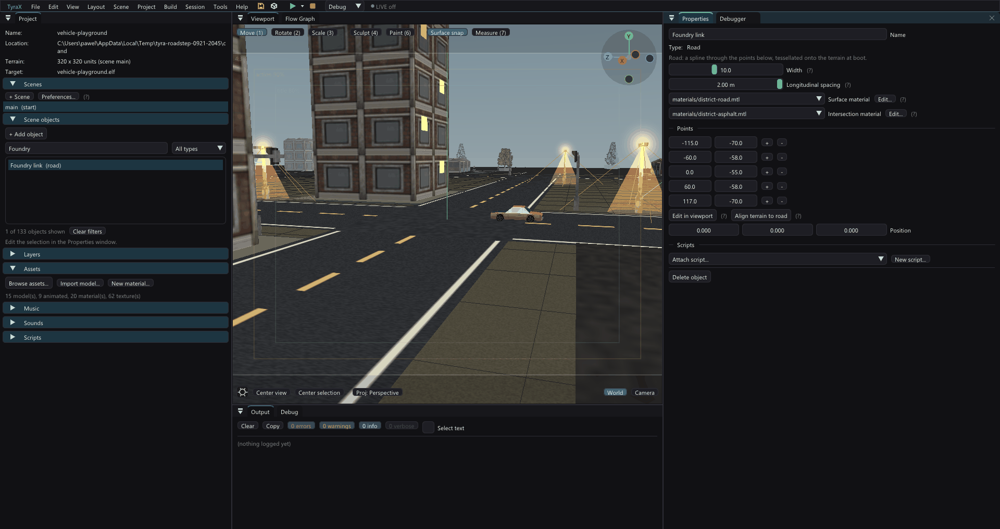

Texture V deliberately does **not** use the cheaper chord length. It integrates
the Catmull-Rom at the original one-metre cadence even when geometry uses 2 m,
so changing detail cannot accumulate a different number of texture repeats and
slide lane markings down the road.

The Motor District oracle priced 2 m on all seven roads at 13 172 triangles /
205 packages versus 21 286 / 338, but rejected that blanket setting: the loop
and eastern crest reached 4.6 and 12.5 texels of longitudinal interpolation
drift. The checked-in scene therefore uses 2 m only on five measured gentle
roads and keeps those two at 1 m. The mixed network is **18 750 triangles / 297
packages**; against the 1 m reference its worst height error is 0.0351 world
units, worst lateral UV error 0.00030 and worst longitudinal UV error 0.00710
(under one texel on the 128 px road texture), with no missed reference sample.

A physical-PS2 A/B used the same parked, four-pose Motor District fixture and
`quiet-debug` profile, with eight rolling FPS samples per pose. The all-1 m
control and mixed candidate retained the same 25 / 16.67 / 50 / 25 median FPS
for garage day/night and outer-road day/night: this reduction is not large
enough to cross another vsync rung. The outer-road-day sample floor moved from
44 to 48 FPS, while the other ranges overlapped; eight samples do not justify
claiming that tail as a frame-time win. The hardware run accepts stability, not
a measurable median-FPS improvement. A driven crest/bend inspection remains.

`road-budget-sweep.py` accepts `--sample-step` as the fallback for roads without
an authored value and reads `roadSampleStep` from the real fixture. Its V metric
compares modulo whole repeats because runtime chunks intentionally rebase that
integer part for physical-GS precision.

## Crossings (1.143)

Each road has a **Rank** (Track, Local or Main; `roadRank` 0-2, omitted at
Local) and a **Spill onto higher roads** (`roadSpill`, 0-8 units, omitted at
its default of 1.5). Together they decide what a crossing looks like:

- **Equal ranks** behave as before: the intersection-material junction patch,
  or nothing.
- **Different ranks** never make a patch. The higher road runs straight
  through. Every rank sits `roadgen::rankLift` (3 cm per step) above the one
  below, so the higher road covers the lower without z-fighting. Every
  "highest surface" query (the wheels, the grip) answers the higher road, so
  nothing had to be cut out of the lower road's mesh.
- **The lower road spills** onto the higher one: its surface carries on over
  the higher road's edge for `roadSpill` units and fades out, like mud
  trailed onto the asphalt. Grip fades with it, from the lower road's to the
  higher road's. 0 gives a clean edge.

A crossing that needs something else (a patch across ranks, another patch
material, the lower road winning) takes a per-junction override - "Junction
overrides" below.

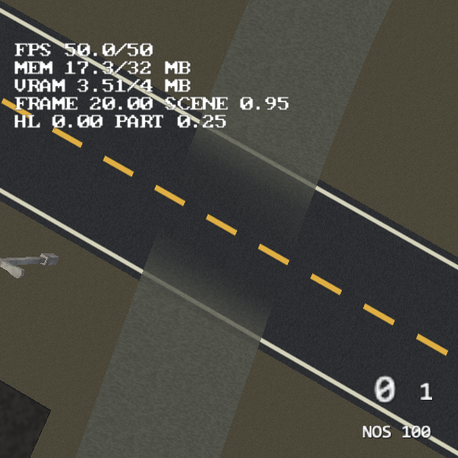

How the spill is made:
- `roadgen::tessellateSpill` bakes the patch on the host. It keeps the lower
  road's own triangles that lie on the higher road within the spill distance
  of its edge, with an alpha of 1 at the edge falling to 0 that far in.
- The codegen emits the patches as `ROAD_SPILLS` / `ROAD_SPILL_VERTS` (XZ, UV
  and alpha, no heights). At boot the EE lifts each vertex onto the road under
  it (`roadSurfaceAt` + `kSpillLift` 0.02) and adds one blended road chunk per
  patch: alpha-over by vertex alpha, the painted terrain layer's arrangement.
  All the Y values are read before the first spill chunk joins `procChunks`,
  because the surface index rebuilds whenever that list grows.
- The chunk's grip blends from `roadGripBase` to `roadGrip` by the same alpha,
  so `roadSurfaceAt` reports what the player sees.
- The viewport draws the same baked triangles after the scene (unlit,
  alpha-over, no depth writes), and the test drive adds them to its surface
  with per-vertex grips.

`--vehicle-check` "road crossings" checks the assembled surface with a Track
road (grip 0.5, spill 2) crossing a Main road:
- the grip is 0.59 at the edge, 0.75 one unit in, and 1.00 three units in;
- the Main road is the surface on top at the centre;
- roads that do not cross bake nothing.

In PCSX2 (the image above) the six patches of the district's service lane
add 138 vertices in both scenes together.

## Soft edges (1.144)

**Edge fade** (`roadEdgeFade`, 0-4 units, omitted at 0) makes the road's
outer band on each side fade into the terrain instead of ending in a hard
line, as a dirt track does.

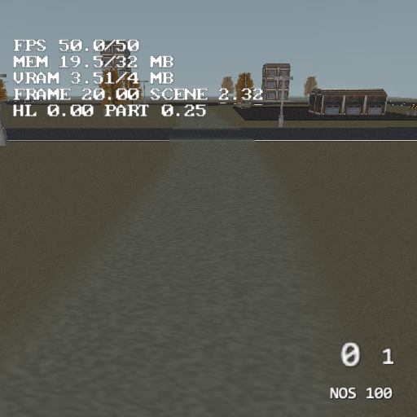

How it is built:
- `roadgen::edgeFadeFor` snaps the fade to the tessellator's lateral grid
  (width / ceil(width / 0.5), so 0.5 units on a 9-unit road) and splits the
  road into a CORE and two bands.
- The core is tessellated as before at `coreWidth`, with a `uInset` so its
  texture still spans the full width. Both twins take it: the host through
  `tessellate`'s `uInset`, the console through `RoadDefRt::width` /
  `uInset`.
- `roadgen::tessellateEdges` bakes the bands on the lateral grid of the full
  width. Their inner vertices are exactly the core's outer ones, so there is
  no crack. The alpha is 1 at the core and 0 at the authored edge.
- The codegen emits them as `ROAD_EDGES` / `ROAD_EDGE_VERTS`. The EE projects
  each vertex exactly like the road's own (terrain + 0.12 + the rank lift),
  cuts the bands into chunks of whole quads with the integer V rebase, and
  draws them blended (`ProcChunk::roadEdge`).
- A spill from a faded road carries the same lateral fade. It is then built
  on the dense grid, because the reduced one keeps only the two faded edges
  of a flat street. So the mud on the asphalt has soft sides too.

The GRIP fades with the picture. `roadSurfaceAt` (and
`roadgen::Surface::at`) reports a `cover`: 1 on a road, the fade alpha on a
band. A tyre's grip is `cover x road grip + (1 - cover) x offroadGrip x the
terrain layers' grip`, and the off-road acceleration and drag take
`1 - cover` as their share (`vehiclesim::SurfaceSample::cover`).

`--vehicle-check` checks it on a 9-wide road with a 1.5 fade:
- 3 columns per band and a 6.00 core with U 0.167..0.833;
- the core's edge and the band's inner edge both at x 3.0000;
- cover 1.00 at the centre, 0.50 mid-band and 0.03 at the edge.

Cost, measured in PCSX2 on the district's dirt lane (both bands, and its 6
spills now on the dense grid):
- 3300 more road vertices in the main scene (22 329 -> 25 629);
- the spill tables grew from 138 to 2424 vertices;
- the crossing view's SCENE went from 1.34 to 1.47 ms (a single pair of
  captures, so a rough number).

A texture whose alpha is ragged along its sides (U 0 and 1) makes the edge
look organic: StaPip discards texels with alpha 0, and the fade blends the
rest. The Road Texture Generator's **Ragged edges** (dirt only, on in the
seeded `road-dirt`) writes exactly that.

## Junction overrides (1.145)

Rank decides every crossing at once. A **junction override** changes ONE
crossing: select a road, click the white diamond on a crossing (or the road's
*Junction with ...* button in Properties) and the Properties panel shows a
**Junction** section.

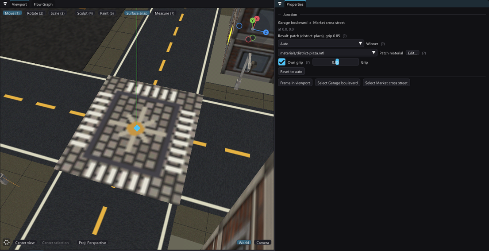

- **Winner**: *Auto* (the rank rule), *Patch* (a junction patch whatever the
  ranks), or one of the two roads, which then runs through here regardless of
  rank. Choosing a winner at two equal-rank roads is how a patch is suppressed.
- **Patch material**: a road `.mtl` for this crossing's patch. Setting one
  forces a patch even across ranks or different intersection materials. Auto =
  the roads' own intersection material.
- **Own grip**: the tyre grip of the crossing's surface. Auto = the lower road
  for a patch, the winner's for a winner.
- **Reset to auto** deletes the override; *Frame in viewport* pivots the camera
  on the crossing.

Diamonds are drawn while a road or a junction is selected: white = Auto,
accent = overridden, red = orphaned.

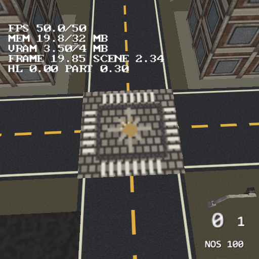

### How a crossing is identified

An override is stored in the scene (`SceneData::roadJunctions`, the scene
table's `"roadJunctions"` list, format 79): the two road object ids, the
crossing's position, and the three fields (each omitted at Auto). It matches
the computed crossing of the same road pair nearest to the stored position
within the narrower road's width, so point edits that move the crossing a
little keep it. Editing a field re-stamps the position.

An override that matches nothing (a road deleted, or moved so the roads no
longer cross there) is **orphaned**: it is kept, changes nothing, shows as a
red diamond at its stored spot and as a warning in the road's Properties, and
can be deleted from its Junction section. `--road-crossings <project>` lists
every crossing, its result and every orphan, and exits 1 when there is one.

### One decision, three readers

`roadgen::planCrossings` (host-only, in roadgen.cpp) is the only place a
crossing is decided. It takes a scene's roads (`project::crossingRoads`) and
its overrides, and returns the crossings with their result plus the decals to
draw. The codegen (`ROAD_JUNCTIONS` / `ROAD_SPILLS`), the viewport
(`syncRoadDraws`) and the test drive (`roadgen::addCrossingsToSurface`) all
read that result, so the three copies of the pairing loops are gone and the
console builds what the editor shows.

### How a winner is drawn

A winner the rank lift already puts on top needs nothing. Otherwise (the
lower or an equal rank wins) the winner gets an **overlay**: its own triangles
over the loser at that crossing (`tessellateSpill` with no fade, only the
winner's soft edges), `kSpillLift` above the highest road. The loser then
spills onto the winner with its own Spill value, one more `kSpillLift` up, so
the mud or asphalt it trails lies over the overlay.

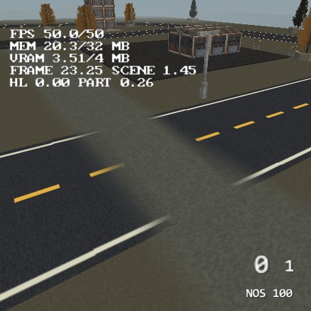

The rank spills are filtered per crossing: a spill triangle belongs to the
nearest crossing of its road pair, and it is dropped where that crossing is a
patch or lets the other road win. Without overrides the output is the same
as before, row for row.

On the console an overlay is one more `ROAD_SPILLS` row (alpha 1, the
winner's texture). `RoadSpillRt` gained `grip` (the grip at alpha 1) and
`lift` (added over `roadSurfaceAt` + 0.02); overlays come first, because the
spills that land on them must be drawn after them. A forced patch is an
ordinary `ROAD_JUNCTIONS` row at the higher road's lift.

### Verification and cost

`--vehicle-check` "junction overrides" builds two crossing roads and checks:
- Auto makes the patch at the lower grip;
- an override stored with the ids reversed and 2.5 units off still matches;
- a chosen winner suppresses the patch, its surface and grip are on top, and
  the loser spills over the overlay;
- a patch material forces a patch across ranks at its own grip, and removes
  the crossing's spill;
- an override far away, or naming a deleted road, is counted as orphaned and
  changes nothing.

In PCSX2 (both images above; a district fixture with the lane-wins override
added at -65, 0) the plaza shows its setts and zebra bars and the lane runs
over the street with soft sides.

Cost, from `--road-crossings` and the boot log of that fixture:
- a patch override costs nothing beyond its texture: the patch existed
  already, and the plaza is one more 128 x 128 4-bit texture (8 KB of GS
  memory);
- the lane-wins override adds a 681-vertex overlay and a 24-vertex spill of
  the street, and drops the 567-vertex lane spill it replaces: the main
  scene's road vertices go 25 629 -> 25 767 (+138);
- ELF data: `RoadSpillRt` grew two floats per row (7 rows in the district).

## Surface grip (1.137)

Each road has a **Surface grip** (0.1 to 1.5, the `roadGrip` object field,
omitted at its default of 1). It multiplies the grip of every vehicle whose
tyre stands on the road:
- 1 is asphalt;
- about 0.7 is gravel;
- about 0.3 is ice.

A junction takes the lower of its two roads. The value rides the road's
`RoadDefRt` into its chunks, so `roadSurfaceAt` reports the grip of the
triangle that answered, at no extra query. The vehicle side, including how
it averages over the four tyres and what happens off the road, is in
[vehicles.md](vehicles.md), "Off-road grip".

## The lateral budget (1.99)

That rule was **all-or-nothing**: one full-width quad, or every one of the
`crossSteps` lateral cells. It is the wrong shape for what a road actually is —
a decal sampled far more finely than the heightfield it is projected onto. The
Motor District's terrain cell is **4 world units** and a road samples across at
**0.5**, so a 13-unit street is 26 lateral cells laid over three or four terrain
triangles. The full width is almost never one plane, so all 26 cells were
retained, even though runs of eight of them sit *inside* a single terrain
triangle and are exactly coplanar.

`spanCuts` now merges **maximal runs** instead, greedily, one cell at a time. A
single cell is the fallback and is never tested, so the previous behaviour is
the reduction's lower bound and the full-width collapse its upper one; the
established flat-span path is untouched and still skips the affine test.

Two named budgets decide a merge, and they are **not the same kind of number**:

| constant | bounds | costs |
|---|---|---|
| `kSpanFlatness` | how far a dense sample may sit off the merged quad's plane | the SURFACE, and the T-vertex seam |
| `kSpanShear` | the quad's parallelogram defect | the UV only |

**`kSpanFlatness` stays at the float noise floor (1e-5) and the surface is
therefore exactly unchanged.** That also makes the reduction seamless, and the
argument is worth stating because it is not obvious: neighbouring station pairs
cut the row they *share* independently, so a merge that bridges a sample its
neighbour keeps leaves a T-vertex. It cannot open a gap here, because a row's
samples lie on a straight line in XZ, and a straight line that is also coplanar
with the merged quad is a straight line in 3-D — so the two representations of
the shared segment coincide. Raise the budget and that argument dissolves; the
oracle checks the conclusion rather than trusting the proof.

**`kSpanShear` is the one that was relaxed, to 0.05.** The two triangles of a
trapezoid interpolate ST with two different affine maps, so a bend could never
merge at all — and every street in the district except one is a curved spline,
which is why the exact rule was buying almost nothing. Measured over the whole
district, against the branch-tip surface, at every dense sample:

| `kSpanShear` | road triangles | packages | worst surface error | worst UV drift |
|---:|---:|---:|---:|---:|
| 1e-5 (exact) | 29 432 | 448 | 0 | 0.004 texel |
| 0.005 | 25 506 | 394 | 0 | 0.03 texel |
| 0.01 | 23 830 | 373 | 0 | 0.06 texel |
| 0.02 | 22 610 | 356 | 0 | 0.12 texel |
| **0.05** | **21 252** | **337** | **0** | **0.36 texel** |
| 0.1 | 20 790 | 331 | 0 | 0.77 texel |
| 0.2 | 20 654 | 330 | 0 | 2.0 texel |

Texels are on the district's 128-pixel road texture, which tiles every 4 units
of arc. The reduction saturates just past 0.05 — 0.1 buys 2% more geometry for
twice the error — so 0.05 is the knee, and it is the shipped value. Against the
branch tip the whole network goes from **31 050 road triangles in 470 packages
to 21 252 in 337**, with the surface and every seam untouched.

`kSpanFlatness` is a live budget in the code, and the sweep behind it is
recorded in
[road-lod-2026-09-16](../examples/vehicle-playground/authoring/road-lod-2026-09-16/README.md).
It is **not** raised here: at 0.02 the district drops to 7 428 triangles, but
the worst T-vertex seam measures 0.028 world units against the road's 0.12 lift
above the terrain, and this repository does not ship a crack it has not looked
at from a car. That is a costed next step, not a rejected one.

Both constants are `TYRA_ROAD_SPAN_*` overrides so the sweep can be re-run
without editing the header, and `templates.cpp` carries them as literals with a
`static_assert` against the header — the generated `buildRoads` is a raw string
and cannot read a constant, and a literal that quietly stops matching its twin
is exactly how a road ends up previewing half a metre off its console self.

### What a variable cut breaks, and what it does not

The two consumers that read the triangle list generically — the viewport's real
road geometry and the picker's ray test, both in `viewport.cpp` — do not care
how a station pair is cut, and did not change.

The **selected road's cyan border overlay** did. It walked the list in strides
of `crossSteps * 6`, one station pair at a time, and drew the first span's A→D
edge and the last span's B→C edge as the two authored shoulders. That stride
had already stopped being true when the flat collapse shipped — a collapsed pair
emits six vertices, not `crossSteps * 6` — so the overlay was drifting off the
station grid on any flat street and drawing the border through the middle of the
asphalt; a variable cut would have made it drift everywhere. It now finds the
borders **by U**, which is exactly 0 on the left shoulder and exactly 1 on the
right by construction in `buildRows`: a span owns the left border when its first
vertex's `u` is 0, and the right border when its second vertex's `u` is 1.

That rule is an assumption about emission order, so the oracle pins it: a span
begins a station pair **if and only if** the span before it ended one, and the
last span of the road reaches the right shoulder. It also prints the station-pair
count per fixture, which is the number that would move if the order ever did.

The [Motor District example](../examples/vehicle-playground/README.md) exercises
a seven-road network. Its `authoring/verify-road-twins.py` compiles the real
host tessellator and the actual generated `buildRoads` body with storage stubs,
then compares geometry/UVs and repeated scene loads against a compiled copy of
the prior tessellator (horizontal collapse retained; non-flat spans dense), on
planar, crowned, saddle, curved and transition fixtures.

Three of its checks are what make the lateral budget above safe to ship, and
each one prints its worst case rather than only asserting it:

- **the surface** must still be represented at every dense-reference sample,
  within `2 * kSpanFlatness` — the reduction may not move the asphalt;
- **the UV** may drift, but only within the published budget, reported in
  texels so the number can be read against a texture rather than a tolerance;
- **the seams**, by an exact T-VERTEX test rather than a sampled one. Sampling
  a surface at its own vertices reads barycentric noise off every triangle that
  merely touches the point, and that noise floor (5e-5 here) is larger than the
  seams worth finding; the test instead looks for a vertex lying strictly
  inside another triangle's edge in XZ and off it in Y, which is what a crack
  *is*.

Two fixtures were added with the budget, because none of the original eight can
exercise it: the analytic surfaces are curved everywhere and have no coplanar
runs to find. `heightfield straight`, `heightfield curve` and `heightfield
crest` lay a road over a **triangulated 4-unit heightfield** — the district's
own ground, with the renderer's own diagonal — and are the fixtures that stand
for the Motor District. The straight one merges to 0.306x, the curve to 0.795x,
and `crown with equal shoulders` and `saddle` still measure 1.000x, which is
the point: the shapes the reduction must not touch are still dense.

## Road height queries, and the grid that pays for them (1.123)

`roadSurfaceAt(x, z)` answers "how high is the asphalt here", and everything
that has to sit ON the road calls it through `groundSurfaceAt`: the blob
shadow's receiver patch, the dynamic lights' ground pools, the vehicle glow
gobo, the projected-shadow receivers and the vehicle contact. Each of those
builds a **4x4 receiver lattice**, so one of them is 17 queries per frame.

Until 2026-09-22 a query walked **every triangle of every road chunk whose XZ
box contains the point**, running the full barycentric test — two divides —
on each. Road chunks overlap and one chunk is ~400 vertices, so on the Motor
District that was about **2 100 triangles per query**. Measured on a physical
PS2 at a parked vantage six units behind the player's car, with the render-cost
capture (`--profile-frame`):

| phase | as shipped | road lookup removed entirely |
|---|---:|---:|
| `Blob_shadows` (ONE 54-vertex quad) | 1.148 ms | 0.237 ms |
| `Vehicle_lights` | 1.436 ms | 0.347 ms |
| `Particles` | 1.453 ms | 0.365 ms |

A third arm that kept the walk but replaced the barycentric test with a
three-load compare read 0.730 ms on `Blob_shadows`, which splits the bill
roughly in half: **walking the vertices** and **the arithmetic**. That is why a
per-strip-run bounding box does nothing (measured: 1.148 → 1.262 ms, i.e.
worse) — the runs are long and the point is genuinely inside them.

What works is a **uniform XZ grid**, built once by `buildRoadHeightIndex()`
after the roads are: ~4-unit cells over the road bounding box, capped at
128x128, each cell holding the triangles whose box touches it, as a counting
sort into a prefix-offset array plus `chunk << 22 | last vertex` entries. A
query is then one cell lookup and a handful of triangles, each still guarded by
a cheap XZ reject before the divides. `ROADINDEX cells NxN entries M` in the
game's log is the acceptance line — the district builds 66x66 cells and 47 558
entries, about 208 KB of EE RAM.

| phase | before | after | floor (no road lookup at all) |
|---|---:|---:|---:|
| `Blob_shadows` | 1.148 ms | **0.383 ms** | 0.237 ms |
| `Vehicle_lights` | 1.436 ms | **0.524 ms** | 0.347 ms |
| `Particles` | 1.453 ms | **0.542 ms** | 0.365 ms |
| whole `Total` | 18.708 ms | **17.341 ms** | 16.797 ms |

It captures ~84% of what is available, and the same mechanism was worth far
more at the night vantage this hunt started from, where `Blob_shadows` alone
read 12.2 ms of a 44.7 ms frame.

**The acceptance gate is `TYRA_ROAD_INDEX_VERIFY`** in the generated
`terrain_game.cpp`, default 0 — it costs far more than the work it checks, so
it never ships and never goes into a measurement. Set it to 1, rebuild the game
and drive: every query is answered twice, once through the grid and once by
`roadSurfaceScan`, the pre-grid walk kept verbatim as an oracle and deliberately
NOT refactored to share code with the fast path. `ROADINDEXVERIFY checked N bad
M` is the tally. Measured on the district, day and night, walking the map:
**140 000 queries, 0 mismatches**. And the gate was falsified before it was
believed — shifting the query one cell in x made it report its first mismatch
within a minute of switching to night, naming the point.

Two things worth knowing if you touch this. An off-road query agrees trivially
(both sides answer "no road"), so a run that never drives onto asphalt proves
nothing — the falsification arm stayed green for 40 000 queries for exactly
that reason. And the index keys chunks by their index in `procChunks`, so it is
rebuilt whenever that list changes size as well as when `buildRoads` marks it
dirty.

## The coarse frustum reject comes back, without the occlusion one (1.123.5)

1.122.2 removed TWO coarse rejects from `renderRoadChunks` in one commit after
false-hidden asphalt gaps: the whole-AABB frustum test and the software-depth
one. Only one of them can produce a false negative. The software-depth test is
approximate by construction and stays out. The frustum test is
`CoreBBox::frustumCheckAABB` against the chunk's own exact world box - the
identical call `renderProcChunks` makes on every other generated chunk and
`renderVehicleWheels` on every rig, at the same point in the frame and off the
same planes, neither of which has ever dropped anything visible. A conservative
box test cannot hide geometry its box contains, and `procFinishChunks` builds
that box from the very vertices the chunk draws.

Without it roads had no coarse reject at all: all 54 chunks went to StaPip on
every frame to be classified package by package. Measured in PCSX2 at a parked
street vantage (counts are exact there, milliseconds are not), one knob:

| per 50 frames | without | with | delta |
|---|---:|---:|---|
| `out` (packages rejected) | 24 850 | **13 200** | **-47%** |
| `cull` | 15 100 / 913 350 | 15 100 / 913 350 | identical |
| `clip` | 950 / 28 900 | 950 / 28 900 | identical |
| `guard` | 3 500 / 123 900 | 3 500 / 123 900 | identical |
| `verts`, `flush` | 21 171, 3 000 | 21 171, 3 000 | identical |

Everything drawn is identical to the digit and half the classification work is
gone, which is the signature of a correct conservative cull: had the box test
dropped anything visible, `cull` would have fallen with it.

Pictures, from two `benchmark-district.py` fixtures one knob apart, two
captures per pose per arm: **0 pixels differ on both DAY poses**, with both
arms byte-identical within themselves. The two night poses are not readable -
their own repeats disagree, because the district's lamps flicker and its stars
twinkle (tyra-testing, "The district's NIGHT poses are not frozen"). Read that
as the fixture's property, not as a result.

### The hardware number (2026-09-23)

Physical PS2, parked street vantage, six samples per arm, paired against the
stored baseline. `Roads` 3.407 -> 3.182 ms by day and 3.458 -> 3.294 by night;
`Terrain` 2.909 -> 2.650 and 2.916 -> 2.675 over the same pair, since the
terrain reject (1.123.6) and the detail distance landed in the same arm. The
emulator had promised -47% of the rejected-package count and the console pays
about 0.2 ms a frame for it here.

## Holes in the road (1.127.1)

**The symptom.** In some places, and only from some angles, part of a road
(or a junction) was missing. The terrain or a static object showed through,
with ragged edges and thin slivers of asphalt and lane markings left behind.
It was stable while the camera stood still, and it looked like z-fighting.
It was not.

**The cause.** Retained command blocks (`TYRA_STAPIP_RETAINED_COMMANDS`,
docs/ee-submission-rearchitecture.md) replay a package's geometry commands
from a cache. Each block starts with the buffer header, and that header's
packed vertex count carries `VU1_STAPIP_EMIT_STATE_FLAG`: "send the GS state
(primitive included) again". That flag is set only when the buffer's VU1
program differs from the previous buffer's, so it depends on where the block
lands, not on the block itself. A stripped road bag mixes two programs in one
flush:
- wholly visible packages go to the strip CULL program;
- partially visible packages are expanded into a triangle LIST for the CLIP
  program.

A strip block captured mid-run (flag clear) and replayed right after an
expanded list therefore told VU1 to keep the list's GS state, and the strip
was drawn as a triangle list. The fix re-flags every replayed header for its
actual position (`StaPipVU1Program::emitsStateFlag`, `kPackedCountWord`), and
the capture asserts in debug builds that the word really is the packed count.

**How it was found**, because every obvious suspect was wrong. Keep this recipe:
1. Reproduce by POSE, not by driving: `capture-console.ps1` /
   `pic-pcsx2.ps1` in the tyra-vq rig hold a benchmark pose with the car
   parked at the reported `VEH pos` (object rotation Y = the logged yaw), and
   `--capture-frame` takes the picture. It reproduced in PCSX2 too, which
   ruled out cache and DMA races.
2. Strip the scene: no terrain, then no static batches. With neither, the
   holes showed SKY, so road triangles were missing rather than covered.
3. Lift ×3 and 2 m triangles changed nothing, which ruled out depth.
4. `TYRA_STAPIP_PROBE_ACCEPT_ALL` and `TYRA_STRIP_ROADS 0` both fixed it. A
   probe then found no visible package rejected anywhere, so "fixes it" meant
   "changes the submission sequence", not culling.
5. Flag bisection: `TYRA_STAPIP_RETAINED_COMMANDS 0` fixed it, while baked
   streams and guard-band bags off did not.

Traps met on the way:
- A clip-space test of "on screen" must use |x| <= w * W / projectionScale,
  not |x| <= w (Tyra's projection does not produce NDC). The first probe got
  this wrong and named a plane that was innocent.
- The same day's physical-PS2 A/B also showed that code layout between two
  builds can move `bounds` and `prepare` by ~0.17 ms with no change in them.
  This fix measured +0.18 ms in garage day, all of it in those two untouched
  brackets, with `dispatch` and `packet` flat and `vif_wait` -0.09.
- `popEnvView` rebuilt the frustum planes from the caller's camera. The
  projected-shadow pass passes no `up`, and a chase camera rolls with the car.
  That was fixed in the same round (the planes are now saved and restored) but
  it was NOT this bug.

Verified: PCSX2 and physical-PS2 captures of the reported pose (107, -67, yaw
65) with the full scene and with terrain and static batches off. Before, the
holes are there; after, the road and junction are whole.
