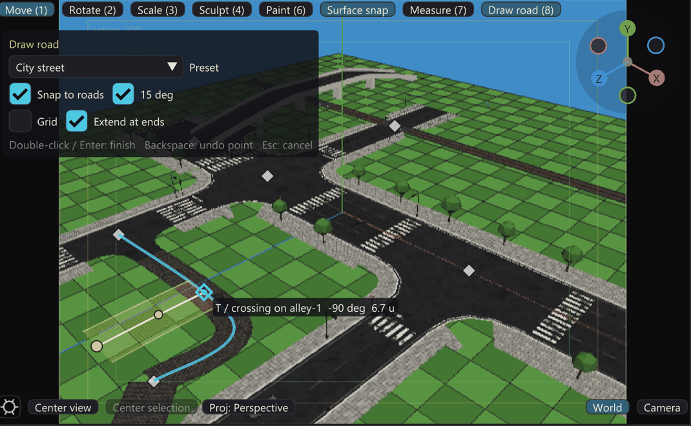
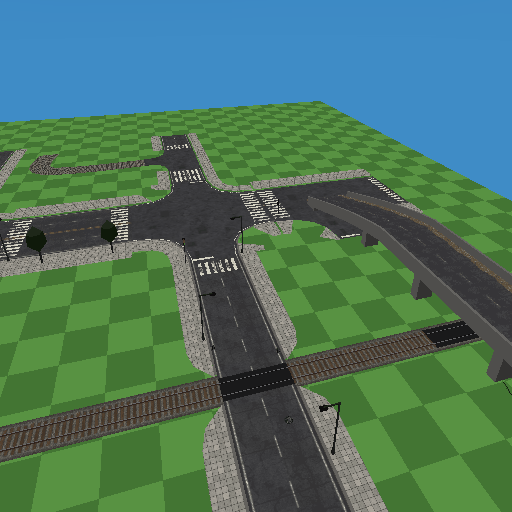
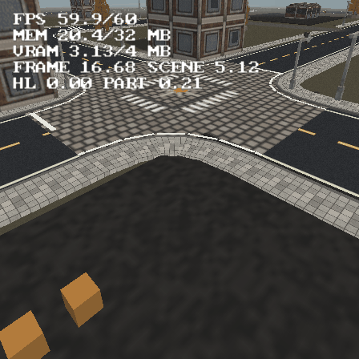
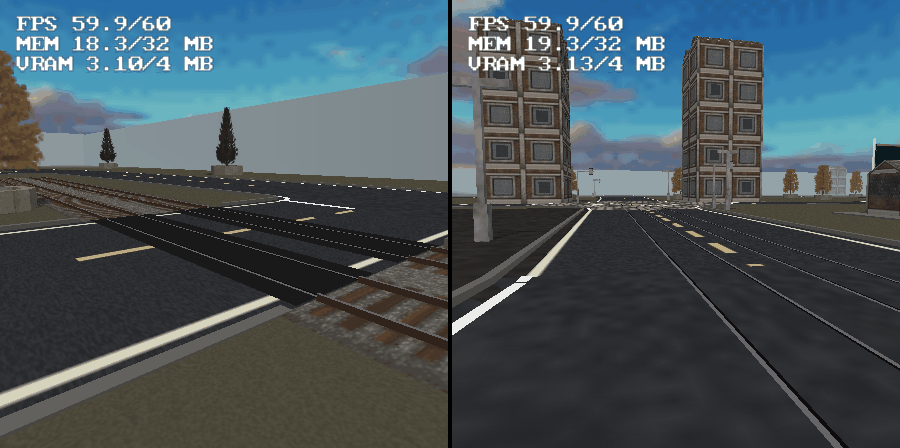
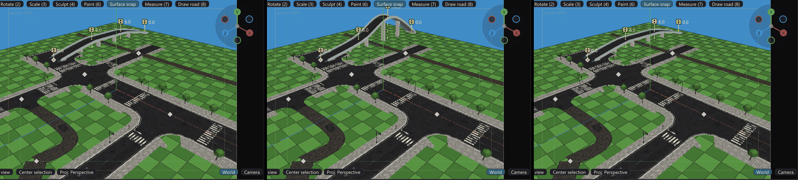
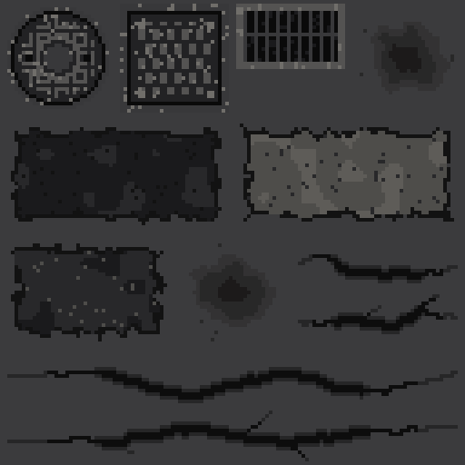
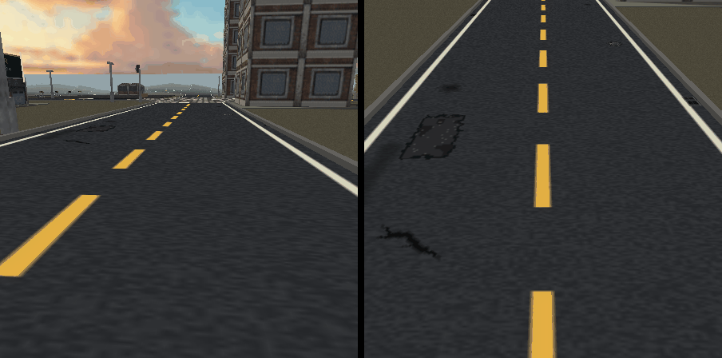
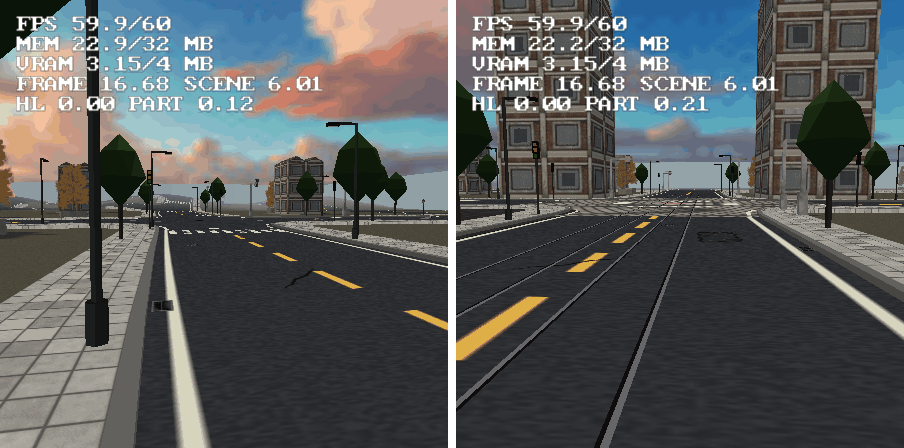
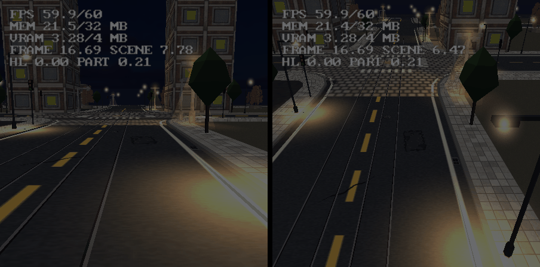
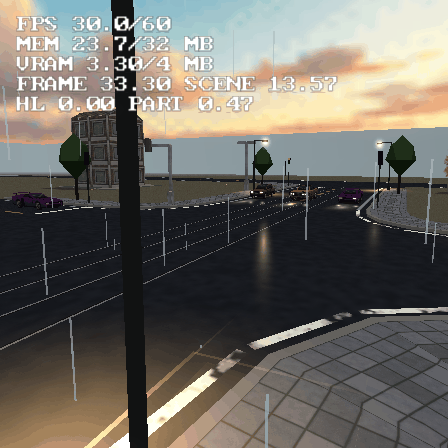

# Roads — spline streets glued to the terrain

A **Road** object (Insert > Gameplay > Road) is a polyline of world-space XZ
points, a width and one texture. Everything else is derived: a Catmull-Rom
spline threads the points, and the surface is tessellated **at boot** — a row
every ~1 unit along the spline and a vertex every ~0.5 unit across it, each glued
to the terrain underneath (+0.12 lift), V running along the arc length so one
texture repeat covers 4 units of street. The cross-road subdivisions prevent a
single wide planar strip from dipping below a rolling heightfield and exposing
grass triangles through the asphalt. Height queries use the same two planar
triangles per cell that the terrain renderer draws — not a different bilinear
saddle — so projection, driving and the visible ground agree. The authored cost stays tiny: **a
kilometre of road is a few hundred floats in the `.tyra` and ONE small texture
in VRAM.** There is no baked geometry to store, ship or stream.

## Drawing roads

The fastest way to lay out a street network is the **Draw road** tool: the
viewport toolbar's **Draw road (8)** button, the `8` key, Insert > Gameplay >
**Draw road...**, or **Draw road...** in a road's Properties.



1. **Pick a preset** in the tool's panel (top left of the viewport): City
   street, Avenue with tram, Boulevard, Country road, Dirt track, Railway,
   Highway, Alley, or one of the project's own ("Road presets" below). The
   preset is the road's whole look.
2. **Click the ground** to place points. The spline under the cursor is drawn
   live, with a ghost of the preset's width.
3. **Double-click or Enter** finishes the road: ONE undo step, and the new road
   is selected. **Backspace** drops the last point, **Esc** cancels the drawing
   (a second Esc leaves the tool). Click back on the first point to close a
   loop.

The junctions are not drawn: they form by themselves wherever the new road
meets another (`roadgen::findNodes`, "Road nodes" below), and the snapping is
what puts the points where findNodes forms the junction you meant. Each click is
resolved in this order (`roaddraw::Snapper::resolve`, `src/roaddraw.cpp`):

| Order | Snap | When | Lands | Makes |
|---|---|---|---|---|
| 0 | **Loop** | 3+ points placed, cursor within 1.5 units of the first | the first point | a closed loop, finished at once |
| 1 | **Road end** | within the road's half width + the tolerance of an open end | exactly on the end point | a corner node, or the same road carried on (below) |
| 2 | **Centre line** | within half width + tolerance of a road's centre line | on the centre line | a **T** when the drawing ends or starts there, a **crossing** when it carries on |
| 3 | **Angle** | a point is already placed, Shift not held | a whole 15-degree step from the reference, at the cursor's distance | a square turn, a straight run |
| 4 | **Grid** | the grid is on | the nearest grid node (or, with the angle step, a whole number of cells along it) | a planned layout |

- **The tolerance** is about 14 pixels at the cursor, in world units, so a
  road is as easy to hit zoomed out as zoomed in.
- **The angle reference** is the previous segment; for the second point it is
  the road the first one snapped to (so leaving a road at 90 degrees is one
  step); otherwise world +X. When the cursor is near a centre line, the step is
  measured from THAT road instead and the point lands where the stepped ray
  meets its centre line, so a 90-degree T or crossing is exact, not merely
  close.
- **The road the drawing stands on is skipped** for the next point's centre
  snap, so a road that starts on a street can leave it.
- **Highlight**: the snapped road's centre line glows, the snap point is a
  square (an end), a diamond (a centre line) or a ring (the loop), and a label
  says what a click makes ("T / crossing on boulevard-1", "end of ...
  (carry on / corner)", the angle, the segment length).
- **Carried on, or a corner.** A drawing that starts (or ends) on a road END,
  leaves it within 45 degrees of the road's own direction and has the same look
  (the preset would leave the road's width, surface and kind as they are) is
  **that road extended** - its points are appended (or prepended), its settings
  kept, and a bridge's heights shifted with the points. Otherwise it is a new
  road: at an angle that is a corner node, in line with a different width a
  transition node. **Extend at ends** in the panel turns the rule off.
- **Why the snaps make the right node.** findNodes forms a contact where an open
  end lies within the other road's half width + 1, and where two centre lines
  cross. A T end on the centre line is the first; a point on the centre line
  with the road carried on past it is the second (its segments cross the other
  road's polyline on both sides); an end on an end is both. The snapper samples
  centre lines exactly as the planner does (the Catmull-Rom in `kSampleStep`
  pieces), so a projected point is ON the polyline findNodes tests.
- **Editing afterwards**: in **Edit in viewport**, releasing a dragged road
  END snaps it the same way (to another road's end or centre line, never its
  own; hold Shift to drop it freely).
- Diamonds are shown on every node while the tool is active; hovering one says
  what it is, and clicking one (outside the tool) opens its overrides in
  Properties ("Junction overrides").

**Headless**: `--draw-road <projectDir> <scene> "x,z x,z ..." [preset]
[--angle] [--grid N] [--no-snap] [--no-extend] [--tolerance U]` runs the same
snapping, finish rule and preset, saves, and prints what each point snapped to
and the nodes the road takes part in. A third number on a point (`x,z,h`) is a
bridge deck height there, which makes the road a bridge. Angle steps are off
unless `--angle` (a script means its coordinates). The AI Assistant's
`draw_road` tool is the same path. A small town in one go:

```
--draw-road P 0 "-60,0 0,0 60,0" boulevard
--draw-road P 0 "-20,-55 -20,0.8 -20,50" city-street      # crosses it: 4 arms
--draw-road P 0 "25,48 25.5,1" city-street --angle         # a square T: 3 arms
--draw-road P 0 "60.5,0.5 60,-30 45,-60" country-road      # a corner off its end
--draw-road P 0 "-20.3,30 10,30 12,42" alley               # a T off the street
--draw-road P 0 "-75,-38 0,-38 75,-38" railway             # two level crossings
--draw-road P 0 "-45,-75 -45,-50,6 -45,-26,6 -45,0.5" country-road  # over the railway
```



`--vehicle-check` "road drawing" checks every rule: the end and centre snaps,
the angle and grid steps, Shift, a drawn T making one three-armed patch node
through `planCrossings`, a drawn crossing making four arms, extension in line
(appended and prepended) against a corner off an end, the loop, a one-point
double-click making nothing, every preset setting every field with its
materials on disk, and the bridge handle's arithmetic.

## Road presets

A preset (`src/roadpresets.cpp`, a data table) sets **every** field a road's
look is made of: width, the surface and intersection materials (the lanes are in
the texture), kerbs, pavement and its material, details, the street-furniture
lines, markings, kind and tracks, rank, grip, spill and edge fade. Points,
bridge heights, the name and the id are left alone. A material a preset names is
**generated on demand** into `res/materials/roads/` from its recipe when the
project lacks it (an existing file is never overwritten, so a repainted
material stays), with the node paint and the details atlas.

| Preset | Width | Surface / junction | Kerb, pavement | Furniture | Other |
|---|---:|---|---|---|---|
| City street | 7.5 | road-2lane / road-junction | kerbs, 2.5 slabs | lamps every 16, staggered; give-way signs | zebras, details 0.5 |
| Avenue with tram | 13.5 | road-4lane / road-junction | kerbs, 3 slabs | lamps every 14 both sides; give-way; traffic lights | tram street, 2 tracks, zebras, details 0.4 |
| Boulevard | 13.5 | road-4lane / road-junction | kerbs, 4 slabs | trees every 10 both sides (offset 2.6), lamps every 20 staggered; give-way; lights | zebras, details 0.4 |
| Country road | 8 | **road-country** / road-junction | none | give-way signs | edge fade 0.75, grip 0.95, details 0.3 |
| Dirt track | 5 | road-dirt / **road-dirt-junction** | none | none | rank Track, spill 3, edge fade 1.5, grip 0.6, no markings |
| Railway | 3.6 x gauge | rail-ballast / rail-junction | none | none | Kind Railway, rank Track, no spill, grip 0.7 |
| Highway | 15 | **road-highway** / road-junction | none | lamps every 30 both sides | details 0.15 |
| Alley | 4.5 | road-cobble / road-junction | none | none | no markings, grip 0.9, details 0.6 |

The three **bold** materials are not seeded into a new project; the first road
that asks writes them. `road-country` is worn two-lane asphalt with no edge
lines and 0.9-unit **dirt-and-gravel verges** (the generator's Verge,
[road-textures.md](road-textures.md#verges)); `road-highway` four lanes with a
double yellow centre and 0.2-wide edge lines on a 15-unit design width;
`road-dirt-junction` the isotropic dirt patch two tracks meet on.

**Every paved preset is rank Local with the `road-junction` intersection
material**, so any two of them meet in a node patch: a different rank or
material would make the higher road run through instead ("Crossings"). Dirt
tracks and railways are rank Track on purpose: a street runs over them (mud
spills, a level crossing). The railway's gauge is the standard 1.435 m in the
project's units per metre, and its bed scales with it (the Kind = Railway
rule, which now lives in `roadpresets::applyRailway`).

**In Properties** (a road's **Preset** section): the combo marks the preset the
road already is; **Apply preset** applies the chosen one to every selected road
(one undo step); **Save preset** captures this road's look under a
name. Project presets are saved in the `.tyra` (`settings.roadPresets`, format
105, written only when there are any) and listed after the built-ins in
Properties, the Draw road tool, `--draw-road` and the AI tool; one of the same
name is replaced, and **Delete preset** removes the one this road matches.

## Authoring


- **Points** and **Crossings** are collapsible Properties sections.
  Points opens by default; Crossings starts folded to keep long streets compact.
- **Points** live in the Properties panel: a table of XZ pairs with insert
  (`+`, midway to the next point) and remove (`-`). The selected road draws
  editing edges and point markers over the road in the viewport. The surface
  underneath is real textured, depth-tested geometry — the exact strip the
  game will build, because the preview and the runtime share the tessellator
  (see below). It is not a screen-space translucent approximation.
- Click anywhere on that textured surface to select the road. Picking tests the
  generated triangles themselves; the unused object-position cube and transform
  gizmo are not road controls and are not shown. Use **Edit in viewport** for
  point-level changes.
- **Width** is the full surface width in world units.
- **Surface material** picks a project `.mtl`; its first material's `map_Kd`
  is tiled along the road. Empty = untextured grey. The picker can import or
  open that material directly in the Material Editor. Direct PNG paths from
  older projects remain readable and appear in a separate legacy section of
  the picker, but new authoring should use a material so a texture replacement
  has one owner. Road UV scale remains fixed at one repeat per four world units;
  the other MTL properties are not applied to this boot-generated surface.
  **Tools > Road Texture Generator** (the **Generate...** button beside the
  picker) bakes asphalt, setts, gravel or dirt with lane markings into
  `res/materials/roads/` ([road-textures.md](road-textures.md)). A new project
  is seeded with five of them, and a Road inserted into it starts on
  `road-2lane` with `road-junction` as its intersection material - textured
  from the first click. Empty still means untextured grey. The Motor
  District's road textures are hand-made checked-in PNGs
  (`examples/vehicle-playground/res/textures/district-*.png`).
- **Intersection material** enables automatic junctions. Wherever roads of
  the same **rank** meet - a crossing at any angle, a road ending on another
  (a T or a fork), two road ends sharing a spot (a corner) - and they all name
  the same non-empty material, the build makes one **node patch** there with
  rounded corners (roads of different ranks follow "Crossings" below; how a
  node is found and shaped is "Road nodes" below). Empty or different values
  are deliberately left alone instead of choosing a material by object order.
  Its first `map_Kd` supplies the patch texture, mapped in world space (one
  repeat per 32 units, no direction), so an isotropic asphalt texture shows no
  seam where an arm meets the patch; legacy direct PNG references still work.
  The viewport shows the same generated patch and texture.
  One crossing can differ from these rules: see "Junction overrides" below.
- **Align terrain to road** flattens the heightfield to the road's line: the
  grade is snapshotted first (the spline's height read off the current
  terrain, box-smoothed twice along the line so no single cell's spike
  survives), then every cell within `width/2 + 3` units is levelled to it
  with the flatten brush's own falloff. One undo step, like a brush stroke.

- **Edit in viewport**: click the ground to APPEND a point, click a point
  marker to DRAG it, click the line between points to INSERT one there;
  **Shift+click** a point marker to delete it (at least two open-road controls
  or three loop controls remain). Shift+click on empty ground does nothing.
  Esc stops, every operation is one undo step. Every road draws as its actual
  textured strip; the selected one additionally gets edges and markers.
- **Close a loop**: drag the final point onto the first marker and release
  within 14 screen pixels. The two endpoints become one edit handle, and the
  Catmull-Rom neighbours wrap across the join so both road shoulders meet
  smoothly. At least three remaining controls are required. **Ctrl+Z** restores
  the point before the drag, including its original position. **Closed loop**
  in Points also closes a road without moving existing controls; uncheck it to
  reopen the road at its seam. Move the shared handle to move both endpoints.
  Insert on the closing segment just like any other segment; a closed road
  ignores empty-ground appends until reopened.
- The mouse wheel zooms the camera during road editing. Point hit areas and
  road borders are clipped to the scene image, so off-screen controls cannot
  grow a scrollbar or move the viewport panel (fixed in 1.151.1).
- Editing outlines reuse the viewport's terrain-aware geometry cache instead
  of tessellating every road again every frame. During a viewport point drag,
  asphalt and handles update live; junction patches, spills and diamonds keep
  their last completed positions and rebuild after release. This avoids two
  full crossing-planner runs per drag frame. Build output always uses the final
  exact points, with no preview simplification or changed road detail.

- An ordinary road has no vertical authoring offset: every left and right edge
  vertex is sampled independently from the terrain. The short-lived 1.77
  `roadHeights` lift is still accepted when an older file contains it, but is
  ignored and cleared the next time the spline is edited. A road that should
  leave the ground is a **bridge** (see "Bridges" below), which gives that same
  per-point field a new meaning.
- The road OBJECT does not collide (`objectCollides` excludes it) — the
  surface is procChunks, and the box at the object's position was an
  invisible wall you could hit.
- **Align terrain to road** is FLAT across the road's width (full strength
  inside `width/2`), with the cosine falloff only on the ±3-unit
  shoulders — the per-station flatten brush crowned the surface. The road keeps
  its small surface lift afterward, so the aligned terrain does not z-fight it.


## Closed-loop storage

Loops use the existing `roadPoints` array: the final XZ pair exactly repeats
the first. The repeated pair is a seam sentinel, not a second editable handle.
No new project field or format version is needed; save/load, undo/redo and
collaboration already carry the entire array. Existing roads with coincident
endpoints now use the same periodic interpolation. Open roads retain their
clamped interpolation. The host tessellator and generated runtime wrap the
same controls and use the same final tangent. Longitudinal texture V remains
arc-length based; a loop whose length is not a whole texture repeat may still
have a texture phase seam.

## How it runs

The object itself emits **no runtime geometry** (type 22 is authoring-only in
`rebuildObjectGeometry`, like an area). Instead the codegen writes tables —
`ROAD_DEFS` (scene, point range, width, texture slot), `ROAD_POINTS`,
`ROAD_TEXTURE_PATHS` (selected materials resolve to their first `map_Kd`, then
deduplicate and lose the `res/` prefix: the game's asset root is `bin/`, which
holds `.res-baked`'s content) — and `buildRoads(scene)`
tessellates them into **procChunks** at scene load, at most 36 spans per chunk
and a target budget of 1,800 vertices (a single wider span stays indivisible),
under owner `-3`. That buys the proc pipeline's whole economy for free:
per-chunk AABBs, one submit per visible chunk, and `procFinishChunks()` building
the bags. Since 1.117.1, the generated renderer tests each chunk's world AABB
against the current view before entering StaPip; wholly invisible chunks pay
only that coarse test, while intersecting chunks still use StaPip's precise
package classification and clipping. The road-only reflection pass uses the
same early reject against the probe camera. The call sits **after** the
procedural-volume build on purpose — that block clears `procChunks` on every
scene load, and the first placement of this call built five chunks that were
wiped ten lines later (a road only the boot log ever saw). `ROADS scene N
chunks M` in `bin/log.txt` is the acceptance line.

Intersection detection and surface fitting are entirely host/codegen jobs.
Since 1.151.2, `tessellateJunctionSurface` fits the patch to the **actual road
triangles**, including rank lift, rather than sampling only its centre and four
corners on the terrain. That old fan let curved roads protrude through the
intersection material on uneven ground (Market cross street's east endpoint).
The editor, vehicle test drive and generated game use the same patch builder.

The builder clips each nearby road triangle against each patch triangle and
checks their height difference at every overlap corner. Since the difference
of the two planes is affine, this bounds the entire overlap, including narrow
ridges missed by a sampling grid. It refines triangles needing more than
0.01 units of correction, splitting neighbouring edges too so no T-junctions
appear. After at most three passes (256 triangles), the remaining measured
correction plus a 0.0001 float guard guarantees the normal 0.02-unit clearance.
The safety cap preserves clearance on extreme terrain; its remaining correction
can exceed 0.01, so a sharply folded junction may still look raised.

Generated `ROAD_JUNCTIONS` rows select baked **XYZUV** vertices from
`ROAD_JUNCTION_VERTS`. Scene load only uploads those vertices in bounded
triangle-list chunks; the EE does no road pairing, surface fitting or additional
per-frame junction work. Flat/slope-only patches retained 12 vertices (since
1.170 a node's fillets make a flat four-way 90; see "Road nodes"). Geometry
on uneven junctions costs additional rendering work: this is a correctness fix,
not an FPS optimization. In the saved Motor District, the main scene's 14
patches increase from 168 to 1,362 vertices (+1,194); dense's six increase from
72 to 312. Most flat patches remain at 12 vertices.

`authoring/verify-road-twins.py` checks flat and sloped crossings, terrain folds,
Main rank and both Market endpoints against an independent world-space sweep,
then uploads nonempty baked rows through the extracted generated `buildRoads`
and compares XYZUV exactly. The saved Market fixture reproduces penetration in
the old fan and passes with the new patches (225 vertices across both ends).


Road tables are emitted independently of vehicle tables. A road-only project
therefore gets `ROAD_DEFS`/`ROAD_JUNCTIONS` even when it has no vehicle
definition; this is covered by the headless road-only generation fixture.


## Road nodes (1.170)

A **node** is one place where roads meet, however many and however they meet.
`roadgen::findNodes` finds them on the host in three steps:

1. **Contacts** between every pair of roads: their centre lines crossing (at
   any angle - the old crossing finder refused anything under ~14 degrees), and
   an open end of one road lying within the other's half width + 1 unit (a T, a
   fork, or two ends sharing a spot).
2. **Clustering**: contacts closer than the widest half width involved + 0.5
   are one node, so three roads meeting at one point make one node, not three
   pairwise crossings.
3. **Arms**: every road leaves the node once if it ends there (within the
   other roads' half width + 1.5) and twice if it runs through. An arm knows
   its road's centre line, so its edges follow the curve.

A node with fewer than two arms, or two arms almost in line (a road simply
continuing into another, more than 150 degrees apart), is not a junction.

**The outline** (`Junction::outline`, counter-clockwise) is built arm by arm,
sorted by angle:

- each arm is cut square at its **trim distance**;
- the gap between neighbouring arms closes with a **fillet**: a curve tangent
  to both road edges, radius 1.5 x their mean half width (1 to 8 units).
  Corners use a quadratic Bezier rather than an arc, so a fillet still meets a
  curved edge tangentially;
- the outside of a sharp turn (a side wider than 180 degrees, such as the far
  side of an L corner) is rounded around the node instead;
- the trim grows until the fillets fit, and is capped at 3 x the arm's width
  and at half the road to the next node. A fillet that no longer fits shrinks.
  One that cannot shrink enough (a slip road leaving at a shallow angle) is
  **cut**: the outline follows one arm's cap until it meets the other arm's
  edge, so the gore between them stays ground.

The outline does not have to be star-shaped around the node centre (an arm on
a bend can curl around it). It must be simple; a self-crossing ring falls back
to its convex hull.

**The patch** (`tessellateJunctionSurface`) is unchanged in what it promises
(at least 0.02 above every road triangle under it, XYZUV baked on the host, the
EE only uploads it). Three things changed:

- a star-shaped outline is a fan from the centre; any other outline is
  ear-clipped;
- a fillet reaches past the roads onto bare ground, so the terrain's own
  triangles (`roadgen::TerrainGrid`, the scene's render grid) join the
  clearance proof - the patch clears the ground between its vertices, not only
  at them;
- **where the fan cannot follow the ground** (its proof needs more than 0.01),
  the outline is cut along the terrain's own triangles instead, so every piece
  lies in one ground plane. Splitting a fan's long thin triangles chords across
  every fold and reaches the vertex cap well above tolerance; the grid cut
  reaches tolerance at half the vertices. Measured on the Motor District main
  scene: 9 033 vertices for the refined fan against 4 410 for the grid cut,
  with the worst float above the road 0.06 against 0.02.

The callers pass the grid: codegen and `decalproj` build it from the scene
(`terrainGridOf`), the viewport from its own heightmap (`Viewport::
terrainGrid`). An unknown grid falls back to 2-unit cells.

What the nodes cost, measured on the Motor District (`ROAD_JUNCTION_VERTS`,
same 14 / 6 / 14 patches per scene as before):

| scene | before | after |
|---|---:|---:|
| main | 1 362 | 4 314 |
| dense | 312 | 2 907 |
| procedural | 168 | 1 380 |

A flat four-way went from 12 vertices to 90 (its four fillets). The rest is the
uneven ring junctions. On the main scene that is about 3 000 more road vertices
on top of ~25 000, uploaded once at scene load as triangle lists; it has not
been priced on a console.

The district then gained six roads that show the node kinds (the example's
README names them: a T into a Y fork, a slip road, a T into an L corner). With
them the main scene has 22 patches and 6 981 patch vertices, and the game logs
`ROADS scene 0 chunks 80 vertices 34656` and `ROADSTRIP ... packages 493
triangles 24612`. Older measurements in this page and elsewhere were taken on
the seven-road district.

Two dead ends, measured, so nobody repeats them:

- **Decimating the grid cut with meshlod** (outline locked). Most of a node's
  grid vertices lie on its outline, so the collapse stalls (131 -> 91
  triangles). It also flattens folds and breaks clearance by 0.05 to 0.3 units.
- **Merging whole coplanar cells along a row** (the flat-road reduction asked of
  the ground). On the district's uneven nodes about a third of the cells are
  whole and no two neighbours share a plane, so it merged nothing.

Verified by `--vehicle-check` "road nodes" (T, Y fork, 14-degree slip road,
three roads through one point = six arms, L corner, end-to-end continuation),
by `verify-road-twins.py` (clearance swept over the outline polygon, runtime
upload exact across 1 800-vertex chunks), and in PCSX2 on a scratch project
with each kind on flat ground and on rolling hills.


## Transition nodes (1.171)

Two roads joined end to end in line used to make no node at all. When their
WIDTHS differ (by more than half a unit), the join is a **transition node**: its
patch is the taper from the wide road to the narrow one, 3 units long per unit
of width lost (4 to 20 units), laid entirely on the narrow road's side. It sits
there because the wide road's own ribbon ends at the node at full width; a taper
reaching back into it would leave the wide ribbon's corners showing outside it.
Every corner of a transition outline is cut straight (`nodeOutline`'s `taper`),
so it is a trapezoid. It follows the patch rules like any node (equal ranks and
the same intersection material), and it gets no markings.

A change of SURFACE at one width (asphalt into a dirt track) is not a
transition: give the two roads different ranks and the lower one spills onto
the higher, or overlap their ends.

## Markings (1.171)

Every patch node is painted: white geometry baked on the host by
`roadgen::bakeMarkings` and laid onto the roads and patches it covers
(`kSpillLift` above them, split where the surface bends), uploaded as more
`ROAD_JUNCTIONS` rows with its colour in the `rgb` column (see "Worn paint"
below for the texture). So
it costs no texture and no VRAM, one bag per scene, and no work per frame.

- **Edge lines.** The road texture's edge line is carried round the node along
  every outline segment that is a road edge or a fillet, never across a cap,
  where the road and its own painted line carry on (`Junction::outlineCap`
  marks those). Where it sits across the width comes from the road: a texture
  made by the [road texture generator](road-textures.md) has a `.roadtex`
  recipe, and `project::crossingRoads` asks it (`roadtex::edgeLineSpan`); any
  other texture gets the Motor District's columns 5..8 of 128
  (`CrossingRoad::edgeU0/U1`). A recipe with no edge line paints none round the
  node. The node uses the average of its arms, so roads of different textures
  meeting at one node show a small step at the caps. The paint is always one
  white, solid line, whatever colour or dash the texture's edge line has.
- **Stop lines** on the road that gives way: one ending at a node another road
  runs through (a T), or at a crossing of through roads the lower rank, then
  the narrower, then the later one. Across the incoming lane only, assuming
  right-hand traffic, just inside the patch.
- **Zebra crossings** (opt-in): 0.5-unit stripes on a 1-unit pitch, 3 units
  long, across every arm just past the patch, on nodes of three or more arms.

The stop-line rule is `roadgen::giveWayArms`, and it is also what decides who
gives way in [road traffic](traffic.md): an AI car stops where the paint says.

Each road chooses with **Markings** in Properties (`roadMarkings`, format 96,
written only when not 1): *None*, *Stop lines* (the default, edge lines
included) or *Stop lines + zebras*. A node paints edge lines only when every
road at it allows markings. Paint that would hang past a road is dropped.

Cost: a T on flat ground is 84 vertices of paint (edge lines and one stop
line), 198 with zebras - a straight run of outline is one stripe, split only
where the ground bends by more than 1 cm. The Motor District (zebras on Skyline
avenue only) paints 4 860 / 1 182 / 2 328 vertices in its main / dense /
procedural scenes; the district's uneven ground is what splits them. The paint is not a shadow receiver: baked shadow decals
lie under it, so a stripe stays white in a building's shadow.

### Worn paint

Flat white paint on asphalt reads as a cartoon, so the paint is drawn with a
generated **worn-paint texture** (`res/materials/roads/road-paint.png`,
`roadtex::paintWear`, 64 x 64). It is near-white with grime in it, and its
alpha is eaten away by the wear: broad patches where the paint is half faded,
chips right through it inside them, and a fine grain everywhere. The paint
row is alpha-blended by that alpha onto the asphalt under it, so the line
blends into the road instead of lying on top of it.

- **UVs are the world position** / `kPaintExtent` (4 units), so the wear does
  not repeat stripe by stripe, and two stripes side by side wear differently.
- **One row per 32-unit cell** (`kKerbCell`) instead of one per scene. Each
  is culled a block at a time, and its UVs are rebased to small numbers.
- **The texture is generated, not authored.** `roadtex::ensurePaintTexture`
  writes it (only when missing or different) at build, when the viewport
  draws markings, and with the seeds of a new project. It has no recipe;
  delete it and it comes back byte-identical.
- **Runtime:** a row with both a texture and an `rgb` is paint over a texture.
  Its chunk is `roadBlend` (blended, its grip the road's), and its colour is
  halved, because 128 is 1x when the colour modulates a texel. The alpha
  has eight levels, which the console's 4-bit palette keeps; a level of 0 is
  discarded by the alpha test (chipped through).


**The bug the paint found.** The first PCSX2 run drew no paint at all, while the
data was right. The paint row's world box reached +infinity in Y: on the
six-armed node over rolling ground, one sliver triangle of the grid cut had no
area in XZ, `plane()` answered -1e30 for it, the clearance proof read that as a
1e30 deficit, and the whole patch was lifted out of the world - taking the
paint, laid onto that surface, with it. Slivers are now skipped by the proof and
dropped by the ear clipper. `--vehicle-check` "a node patch on rolling ground
stays on the ground" pins it on a real heightfield.

## Kerbs (format 95)

A road's **Kerbs** checkbox (`roadKerb`, off by default) puts a concrete kerb
along both of its edges. **Kerb height** (`roadKerbHeight`, 0.02-0.5, default
0.15) and **Kerb width** (`roadKerbWidth`, the flat top, 0.05-1, default 0.25)
size it. All three are written only when they differ from the default, so an
untouched road saves byte-identical.

The profile is the cheapest one that reads as a kerb: a vertical **face** at the
road edge, from 0.04 below the road surface up to the kerb height, and the flat
**top** from the edge outward by the kerb width. There is no bottom and no back
face; nobody sees them, and nothing in this engine backface-culls, so the face
is visible from both sides anyway.

Where a kerb runs (`roadgen::planKerbs`, host only):

- **Along both edges of each kerbed road**, cut wherever the kerb would enter a
  drawn junction patch or stand on another road. The cut is placed by
  bisection and snapped onto the patch's own kerb end, so the two meet in one
  point.
- **Around each patch outline**, minus the arm caps (where a road carries on),
  minus anything on a road or on another patch. Each remaining run is the kerb
  round one fillet, round the outside of an L corner, or along the far side of
  a T. It is kept only when the roads at **both** of its ends have kerbs.
- Crossings without a patch (different ranks, or equal ranks without an
  intersection material) get no ring. Each road's kerb simply stops at the
  other road's edge.

Points sit on the drawn surface. Heights are read 0.1 inside the road or patch
through `roadgen::Surface`, so a kerb follows the rank lift and the patch fit.
Patch outline segments are subdivided to 1 unit so the heights follow the
patch. Then each line is merged: a point goes when the chord around it is within
**0.02 units** of it, both sideways and in height (`kKerbTolerance`). A merged
chord is at most 8 units long, and the normal may turn at most about 6 degrees.
A straight street therefore costs a point every 8 units, while a bend keeps
what it needs.

The kerb has **no texture and costs no VRAM**. Shading is baked into the vertex
colours: the top is 0.78 grey and the face 0.56, with a slightly warm tint.
Each kerb point is four strip vertices: two for the face strip and two for the
top strip.

### How it runs

The kerbs follow the junction patches' pattern: the host bakes them and the
console only uploads them. **There is no EE twin to keep in step.** The codegen
emits `ROAD_KERBS` (one `{scene, first, count}` row per chunk) and
`ROAD_KERB_VERTS` (x, y, z, shade). Both are emitted only when some road has
kerbs, so every other road project regenerates byte-identically (the upload
block in `buildRoads` is gated the same way).

- **Triangle strips** under the road chunks' run contract (`roadgen::
  kStripRun` = 75, `roadgen::kerbStrips`). Full runs carry their last two
  vertices over, and separate strips join through repeated vertices. A
  chunk's last run is padded to a multiple of 3. `TYRA_STRIP_ROADS 0` expands
  the same runs into a triangle list.
- **Chunks of one 32-unit cell** (`kKerbCell`), cut by segment midpoint, at
  most 1 800 vertices. A chunk's box stays about a street block wide, so the
  frustum and the draw distance drop kerbs a block at a time.
- **Owner -4**, not the roads' -3. `renderProcChunks` draws them, using its
  frustum reject, chunk draw distance and occlusion test, and their cost lands
  in the `Procedural` profiler row. The road height index takes them as well
  (see "Kerb collision" below).
- **A draw distance of 60 units** (`ROAD_KERB_DRAW_DISTANCE`, the chunk's
  `drawDist`, measured from the chunk centre). A 15 cm kerb is a few pixels at
  that range.
- `ROADKERB scene N chunks C vertices V packages P triangles T` in
  `bin/log.txt` is the acceptance line. `--road-crossings <project>` prints the
  same totals plus one line per road, from the same bake.

The viewport draws the same lines from `roadgen::planKerbs` as triangle lists
(`kerbTriangles`). They are rebuilt with the crossings, so the editor shows
what the console builds.

### Kerb collision

**A kerb's top is solid ground.** The road height index (`buildRoadHeightIndex`,
read by `roadSurfaceAt` and `groundSurfaceAt`) takes the owner -4 kerb chunks
along with the -3 roads. A wheel that clips a kerb rides up onto it, and blob
shadows and light pools lie on top of it. The vertical faces have no area in
XZ, so the barycentric test drops them by itself. The kerb grip is 1.

- **The walker** stands on roads and kerb tops too, through
  `walkGroundAt(x, z, feetY)`: the terrain, or the road surface when it is no
  more than 0.5 units above the feet (the same step `collidePlayer` allows onto
  objects). A road on a ramp or a bridge overhead therefore never teleports a
  walker up onto it. All three walk loops use it (FPP, the per-player avatar
  and the split-screen walker).
- **The test drive** sees the same tops: `roadgen::addKerbsToSurface` adds them
  to the host `Surface` after the patches. `--vehicle-check` ("kerb
  collision") checks that a kerb top is one kerb height above the road, with
  nothing past its outer edge.
- **A kerb is a step, not a wall.** A 0.15 kerb is lower than a wheel's
  suspension travel, so the car bumps over it rather than stopping.
- **Rebuilds:** the kerb upload sets `roadIdxDirty`. A scene load erases and
  pushes back the same number of kerb chunks, so the index's chunk-count check
  alone would miss the change.
- **How many chunks it can hold.** An index entry is one 32-bit word: 13 bits
  of chunk position in `procChunks` and 19 of vertex index, so 8 192 chunks of
  up to 524 287 vertices. It was 10 + 22 (1 024 chunks) until
  [examples/big-city](../examples/big-city/README.md), whose roads, kerbs,
  rails and details make about 1 600 chunks: every road chunk past the 1 024th
  was silently missing, so wheels and walkers there stood on the terrain 0.12
  below the asphalt. A chunk still out of range is counted and logged as
  `ROADINDEX skipped N chunk(s) ...` instead of vanishing.

Kerbs are **not shadow receivers**: the shadow bake's road hash does not include
them, so turning kerbs on leaves a baked-shadow cache fresh.

### What they cost

Measured on the Motor District main scene, with all 12 asphalt streets kerbed
and the dirt West service lane left bare:

- **Geometry**: 141 kerb lines, 3 449 units long. They make 4 636 triangles
  as 6 558 strip vertices in 71 chunks (121 packages). That is about 1.9
  strip vertices per unit of kerb. The Ring road alone is 50 lines, 1 485
  units and 2 024 vertices. A straight street such as Garage boulevard is 504
  vertices over 327 units. `--road-crossings` prints every road.
- **Untouched**: `ROADS scene 0 chunks 80 vertices 34656`,
  `ROADSTRIP ... packages 493 triangles 24612` and `ROADINDEX cells 66x66
  entries 62872` read the same with kerbs on and off.
- **PCSX2, frozen camera, interleaving pinned off, three `--profile-frame`
  captures per arm** (emulated EE timing, so treat the numbers as rough):

| pose | `Procedural` off -> on | `Total` off -> on | HUD FPS off / on |
|---|---:|---:|---:|
| street level beside a fillet (eye 0.8) | 0.02-0.06 -> 0.33-0.35 ms | 7.6-8.9 -> 8.1-8.9 ms | 30 / 30 |
| raised view over the Garage x Foundry node (eye 6) | 0.02-0.03 -> 0.47-0.50 ms | 8.7-10.3 -> 9.3-9.8 ms | 28 / 28 |

So the kerbs cost about **0.3-0.5 ms of EE time** where several kerb chunks are
within draw distance. That is mostly per-chunk submit cost, because the chunks
are small (about 92 vertices each). The frame rate did not change at either
pose. This has not been measured on a physical PS2. If it shows up there, the
first lever is larger chunks: a bigger `kKerbCell`, with the draw distance
raised to match.


Kerbs and node markings together on the Motor District (PCSX2): the kerb
round a fillet, the painted edge line inside it, a zebra beyond.


## Pavements (format 97)

A kerbed road's **Pavement** slider (`roadPavement`, 0-6 units, default 0 =
none) lays a walk that wide behind each of its kerbs, at the kerb's height.
**Pavement material** (`roadPavementMaterial`, a `.mtl`) textures it; empty
means untextured concrete (`kPavementRgb`). Both are written only when set.
The Road Texture Generator's **Pavement** mode makes the texture: the
`pavement-slabs` seed every new project gets, or **Apply as pavement
material**, which also turns the road's kerbs on and gives it a 2.5-unit walk
([Paving slabs](road-textures.md#paving-slabs)).



A pavement is the kerb top carried on outward, so it follows every kerb line
(`roadgen::planPavements`, host only, over the `planKerbs` pieces):

- **It wraps the junction corners with the kerb.** Round the inside of a
  fillet the straight offsets would fold over each other. Each folded run is
  closed in the point where the offsets either side of it meet, so the block
  corner is paved square.
- **It narrows instead of running onto another road or patch.** The outer edge
  is found by bisection along the kerb normal and stops half a pavement short
  of any other road, so two parallel streets' pavements meet in the middle
  rather than overlapping. A width changes by at most one unit per unit along,
  so a cut reads as a taper, not a notch.
- **It follows the ground.** Flat at the kerb top, it rises wherever the
  ground under its outer edge or its middle is higher (`kPavementLift`, 0.05,
  above it). Wherever it stands above the ground, an **outer face** drops to
  0.04 below it, textured as the slab's edge.
- **UV**: one texture repeat per 2 units (`kPavementTile`), across AND along,
  rebased per mesh to small numbers for the PS2's ST path.
- **No kerb, no pavement**: the walk is built from the kerb lines, so a road
  with Kerbs off has none whatever the slider says.

### How it runs

Pavements need **no runtime code**. The codegen groups the triangles by
material and 32-unit cell (`kKerbCell`) and emits them as ordinary
`ROAD_JUNCTIONS` rows (XYZUV, the junction patch format). At scene load they
become owner -3 road chunks like a patch, so they are:

- **culled** per cell by `renderRoadChunks`' frustum test,
- **in the road height index**: the player walks on them (`walkGroundAt`), a
  car bumps up onto them, and blob shadows and light pools lie on them,
- **free on the EE**: uploaded unchanged, no per-frame work.

`// scene N: pavements V vertices in R rows` in the generated `scene_data.hpp`
is the bake's own count. The viewport draws the same meshes, and the test
drive stands on them (`roadgen::addKerbsToSurface` adds them). `--vehicle-check`
("pavements") checks that a walk is at the kerb top and as wide as asked, that
it narrows off another road, that the inside of a fillet corner is paved, and
that the UVs stay small.

### What they cost

The Motor District main scene, with 2.5-unit slab pavements on its four
downtown streets (Skyline avenue, Garage boulevard, Market cross street and
Foundry link): **11 292 vertices in 51 rows** (3 764 triangles). `ROADS scene
0` goes from 83 chunks and 39 513 vertices to 134 and 50 805.

PCSX2, raised view over the Garage x Market plaza (eye 9), three
`--profile-frame` captures per arm, emulated EE timing:

| | `Roads` | `Total` |
|---|---:|---:|
| without pavements | 0.12-0.15 ms | 8.7-9.9 ms |
| with pavements | 0.17-0.19 ms | 8.6-8.6 ms |

About **+0.05 ms** in the road phase; the frame total is within noise and the
HUD reads 60 FPS on both arms. Not measured on a physical PS2.

The pavements are **not shadow receivers** (the shadow bake's road hash leaves
them out, like the kerbs), and they have no draw distance of their own:
`renderRoadChunks` draws every road chunk in the frustum.

### Limits

- No collision, and no surface query answers the kerb top.
- One profile and one colour. A pavement (a wide raised walk behind the kerb)
  is the same sweep with a wider top and a texture, and is not built.
- The draw distance is a constant, not a project setting.
- A ring around a patch takes the first end road's height and width. Two kerbed
  roads with different kerb sizes meet with a step.
- A crossing without a patch only cuts the kerbs. It does not round them.

`--vehicle-check` "road kerbs" builds a kerbed T and checks that:
- the kerb runs around both fillets and along the far side;
- the stem's own kerb stops at the patch;
- no kerb point stands on a road;
- a straight edge merges to at most a point every 8 units;
- every ring end meets its road's kerb end;
- the strip runs hold exactly the list's triangles;
- a fillet loses its kerb when one of its roads has none.

## Rails and tram tracks (format 98)

A road's **Kind** (`roadKind`) turns it into track. **Railway** (1) makes the
strip itself the ballast bed, and real steel rails stand on it. **Tram street**
(2) is an ordinary street with the rails set flush into it. Road (0) is the
default and is not written, so every existing road saves byte-identical. The
point of building track out of roads is that the whole road workflow carries
over: the same spline handles, the same terrain gluing, the same nodes, and no
external tool.

- **Tracks** (`roadTracks`, 1 or 2) lays one or two tracks side by side,
  centred: 4 units apart on a railway, 3 on a tram street.
- **Gauge** (`roadRailGauge`, default 1.435) is measured between the rail
  heads' inner faces, as real gauge is. The whole profile scales with it, so a
  1.0 metre-gauge line gets lighter rails. A project at another scale sets it
  once. Choosing Railway in a project whose units-per-metre is not 1 converts
  the default for you.
- Choosing **Railway** in the Properties panel applies a preset. It sets the
  ballast materials, a bed as wide as its sleepers (3.6, or 7.6 for two
  tracks), rank **Track**, no spill, no kerbs, no markings and grip 0.7. The
  materials are written from the generator's presets when the project has
  none. Changing Tracks swaps the single and double bed and resizes it.

### What is built

- **The bed** is the road strip, textured with a `rail-ballast` material: the
  `ballast` surface of the [Road Texture Generator](road-textures.md), with
  crushed stone, timber or concrete sleepers painted across it (seven per
  4-unit repeat, 0.57 apart), tie plates or rail pads, and rust dust under
  each rail. New projects are seeded with `rail-ballast` (one track),
  `rail-ballast-double` (two) and `rail-junction` (stones only, the
  intersection material).
- **Raised rails** on a railway's own bed: two side faces from 0.03 below the
  bed up to the head at 0.12, and the 0.07-wide head on top. The faces are
  rusty brown and the head is polished steel. There is no foot and no
  sleeper geometry, because the texture carries those.
- **Flush rails** on a tram street, and on a railway wherever it crosses
  another road: the 0.07 head 0.035 above the road surface (above the node
  paint at 0.02), plus a dark 0.045 groove on its inner side, which is the
  flangeway.
- **Level-crossing panels**: where a railway crosses a road, a dark rubber
  panel 0.025 above the road spans each track and 0.6 past each rail. It is
  drawn before the rails that lie on it.

The rails run the road's **whole length and are never cut at a node**. Where
a railway leaves its own bed and crosses any road that is not a railway (or a
node patch that one takes part in), its rails turn flush there. The switch
point is placed by bisection, so the flush stretch is exactly the road's
width. That is what makes a level crossing: the street runs through (the
Railway preset is rank Track, so a Local street covers the bed), the rails stay
on top of it, and the panel goes under them. Two railways meeting at a fork
or a diamond simply run their rails on through. With the `rail-junction`
intersection material on both, the node's patch is a stones-only bed under
the turnout.

**A railway is never kerbed or painted.** `project::crossingRoads` forces its
kerb, markings and edge line off whatever was authored, and `bakeMarkings`
paints nothing at a node a railway takes part in. So there is no zebra across
the tracks. A kerbed street's kerb stops at the ballast's edge, because
planKerbs cuts a kerb wherever it would stand on another road. A tram street
is a street, and it keeps its kerbs and markings.

### How it runs

There is **no new runtime table and no console rail code**. The rails are
host-baked (`roadrail::planRails`, `src/roadrail.cpp`) and travel in the
kerbs' own `ROAD_KERBS` / `ROAD_KERB_VERTS` chunks: the same strip run
contract, the same 32-unit cells, owner -4, and the 60-unit draw distance. A
rail vertex is a kerb vertex whose shade is 2 or more. That shade names an
entry of `ROAD_KERB_PALETTE` (polished steel, rust, groove, panel), which the
codegen prints from `roadrail::kPalette`. A shade below 1.5 is still the kerb's
concrete grey, so a kerbed project without rails draws as before. A project with
a rail or tram road gets the kerb tables even if it has no kerbs.

- **Collision**: the heads, grooves and panels have area in XZ, so the road
  height index takes them like kerb tops. A car rides over a flush head on the
  street. On the bed, a wheel or a walker steps up the 0.12 raised rail, which
  is well inside the walker's 0.5 step. The test drive sees the same tops
  through `roadrail::addRailsToSurface`.
- **The stations** are the road's own. `planRails` reads them back out of
  `roadgen::tessellate` over a flat height. There, every station pair is one
  full-width quad whose first two vertices are the row's edges, so the rails
  follow exactly the spline the bed is built from without a third copy of the
  sampler. Points then merge within 0.01 units (tighter than a kerb's 0.02,
  because a rail must look straight), with chords of at most 8 units.
- The viewport draws the same pieces from `roadrail::planRails`, rebuilt with
  the crossings (the signature mixes kind, gauge and tracks). Live Link
  reports a rail edit as needing a rebuild.
- `--road-crossings <project>` prints `[rail] <road>: railway|tram, N raised
  (L units), N flush (L units), N crossing panel(s)` per road and the strip
  total. The game's `ROADKERB` log line counts the rail chunks with the kerbs.

**Motor District** has both (main scene). **Freight line** is a double-track
railway at x = -110 that crosses Market cross street at a level crossing.
**Garage boulevard** is a two-track tram street, with the tracks running on
through its nodes, including the plaza at the centre. Measured with
`--road-crossings`: the tram is 4 flush rails over 880 units; the railway is
8 raised lines (324 units), 4 flush (44 units, the 11-unit street) and 2
panels; together that is 1 464 strip vertices in 20 chunks. Market cross
street's kerbs gain two cuts at the ballast, so the kerb total is now 143 lines
over 3 438 units.



Both shots are frozen-camera `--capture-frame`s of a short-path copy (60 FPS
in PCSX2; `ROADKERB scene 0 chunks 91 vertices 8001`, which is the 71 kerb and
20 rail chunks).

### Limits

- No points (switch blades) or frogs. A turnout is two lines overlapping on a
  shared bed, which reads right from a car but not from a train driver's seat.
  There is also no train to drive.
- The sleepers are texture, so they are laid out for the material's design
  width and the standard gauge. A bed much wider than its material, or a
  far-from-standard gauge, puts the painted tie plates beside the rails.
- A level crossing needs the street to cover the bed. The Railway preset's
  rank Track does that. A railway left at the street's rank overlaps it and
  z-fights, like any two equal-rank roads without a shared intersection
  material.
- Rails are not shadow receivers (the same as kerbs). There are no crossing
  barriers or signals; those are props.

`--vehicle-check` "road rails" builds a railway crossing a kerbed,
zebra-painted street on flat ground and checks that:
- the railway is never kerbed or painted;
- the rails are at the gauge and on the drawn surface;
- they run unbroken across the street (raised, flush, raised);
- they are flush for exactly the street's width, with one panel;
- the heads are standable and within a walker's step;
- the street's kerbs stop at the ballast;
- no paint is laid;
- the strips hold the list's triangles in palette colours;
- a two-track tram street gets four flush rails 3 apart;
- the ballast texture is deterministic, tiles, has seven sleepers per repeat,
  and round-trips its recipe.

## Bridges (format 100)

A road with **Bridge** ticked leaves the ground: its deck runs through a height
profile instead of hugging the terrain, and wherever it stands clear of the
ground it gets parapets, a deck edge and underside, piers and abutments. It is
the same Road object - the same points, width, material and rank - plus one flag
and one number per point, so a bridge is authored the way a street is.


### The model, and why this one

Each control point carries a **Height** (`roadHeights`, Properties > Points,
0..30): the deck's height above the terrain AT that point. The deck at any
station is the Catmull-Rom of *(terrain at point k + height k)* along the same
spline parameter as the XZ, clamped between the segment's two control values so
a plateau never bulges and a ramp never dips below its foot. A deck vertex is
the **higher** of that profile and the ordinary glued road there.

That one rule gives the two cases people actually build:

- **Every height 0: a valley bridge.** The deck runs straight from control point
  to control point and spans whatever dip lies between them - a river, a ravine -
  with nothing to tune. Where the terrain rises above that line, the road is
  simply on the ground again.
- **A raised point: an overpass.** Points `0, 3, 6, 6, 3, 0` are two ramps and a
  span; the ramps are as long as the neighbouring points are far apart, so the
  grade is controlled by point spacing, which is already what the author edits.

Two alternatives were weighed. A flag plus an automatic profile (straight line
between where the deck leaves and rejoins the terrain) handles valleys but
cannot make an overpass on flat ground, which is the commoner case in a city. A
per-point ABSOLUTE height would make every bridge break when the terrain is
re-sculpted under it; heights relative to the terrain at the point keep the
abutments on the ground through a sculpt. The deck is **flat across** (one
height per station), so a station pair wholly in the air is one full-width quad.

`roadHeights` only means this when `roadBridge` is on. On an ordinary road it is
still the retired lift: ignored, and cleared by a point edit. On a bridge it is
kept in step with the points instead: inserting a point interpolates its
neighbours' heights, deleting one removes its height (`roadbridge::onPoint*`).

### Host-baked, so the EE twin did not grow

Every ordinary road is tessellated **on the EE at boot** from `ROAD_DEFS`, and
`buildRoads` is a hand-kept twin of `roadgen.cpp`. A bridge is not: the codegen
leaves it out of `ROAD_DEFS` altogether and bakes it, like the junction patches
and the kerbs:

- the **deck** becomes ordinary `ROAD_JUNCTIONS` rows - textured with the road's
  own material, owner `-3`, one row per 1 800 vertices with V rebased by a whole
  repeat (the road chunks' physical-GS rule). Being owner `-3` it joins the road
  height index, so wheels, walkers, blob shadows and light pools stand on it with
  no new runtime code;
- the **structure** becomes `ROAD_BRIDGES` / `ROAD_BRIDGE_VERTS` (x, y, z, baked
  shade per vertex), triangle lists in 32-unit cell chunks uploaded unchanged by
  a block spliced into `buildRoads` before `procFinishChunks`. Owner **`-5`**:
  `renderProcChunks` draws it (frustum reject, occlusion, no draw distance) and
  the road height index does NOT read it, so nothing ever stands on an underside
  or a parapet top.

Both are emitted only when a road is a bridge, so every other road project's
generated sources are byte-identical. `verify-road-twins.py` still passes
unchanged - the twin it checks is untouched. `src/roadbridge.cpp` is the deck,
the structure and the tables; the viewport, the test drive, the shadow decals'
receivers, `--road-crossings` and the codegen all call it.

### The structure

Built wherever the deck is more than 0.3 above the glued road
(`roadbridge::kStructureMin`), per run of such stations:

- **parapets**: a 0.9-high, 0.3-wide solid wall outside each edge - inner face,
  top, and an outer face that continues down to the **deck underside** 0.7 below
  the deck top, which is the visible edge beam;
- the **underside** across the full width, and **end caps** where a run starts
  and ends;
- **abutments**: a full-width block at each end, where the gap under the deck
  first exceeds 0.5, from just below the ground up into the deck;
- **wall piers** at most 16 units apart between the abutments, only where the
  gap is taller than 1.5, sunk 0.3 into the ground - and **never on another
  road**: a pier whose footprint would touch any other road (plus a unit of
  margin) moves up to a quarter spacing along the deck, or is left out.

Stations merge into chords within 3 cm (at most 8 units each), so a straight span
costs a handful of vertices; the parapet's inner face stands that tolerance ON
the deck so a chord on the inside of a bend never opens a gap at the deck edge.
Shading is baked from a fixed sun (top 0.80, the shadowed underside 0.30), like
the kerbs, and the structure is untextured: no VRAM.

**Measured** on the Motor District's flyover (95 units, 9 wide, 6 high): deck
582 vertices (98 stations, one row), structure 978 vertices in 4 chunks
(4 piers, 2 abutments) - `[bridge]` lines in `--road-crossings`, and the
`ROADBRIDGE scene N chunks M vertices V` line in the game's log.

### Overpasses: no node, kerbs and wheels keep their road

- **No junction.** `CrossingRoad::elevation` tells the planner how high a road is
  above the ground at a point; `findNodes` refuses a contact where EITHER road is
  more than `kOverpassClearance` (2 units) up. A deck passing over a street is an
  overpass, and a bridge's ends on the ground still make ordinary T nodes - the
  flyover joins the ring road and Foundry link that way. Two decks meeting in
  the air make no node (not supported).
- **Kerbs.** A kerb is not cut by a road more than the clearance above or below
  it (`KerbWorld::onAnyRoad`), and a kerb never climbs onto a deck overhead: the
  surface lookup falls back to the glued height when it answers more than the
  clearance above it. A bridge has parapets, not kerbs (`Kerbs` and `Edge fade`
  are greyed for a bridge).
- **Node patches** are fitted to the GLUED roads - a bridge's ground-level self -
  so a junction under a bridge is not pulled up to the deck.
- **Wheels.** `roadSurfaceAt` and `groundSurfaceAt` take a `maxY`: the highest
  surface NOT above it. The vehicle wheels, the body-floor probes, skid marks,
  the headlight beam patch and debris ask with the car's height + 1.5
  (`roadbridge::kVehicleStepUp`), so a car under a bridge stays on its road
  instead of snapping up onto the deck; one driving up the ramp is always within
  that step of the deck. `walkGroundAt` asks with the feet + 0.5 (it used to fall
  through to the terrain under a deck, missing the lower road), and blob shadows
  with the caster's base + 0.5. The host twins match: `roadgen::Surface::at`
  takes the same cap and the editor test drive uses it.

### Structure collision

The parapets and piers are **walls**. `roadbridge::buildStructure` also emits
one collision box per straight wall (`Structure::boxes`, `wallBoxes`): one per
parapet chord and side, from the deck top to the parapet top, and one per
pier, from below the ground to the deck underside. The boxes are **oriented**,
so a diagonal or curving deck is walled in without the boxes reaching onto it.
An axis-aligned box round a 45-degree chord would cover most of the lane.

- **Runtime**: the codegen emits them as `ROAD_BRIDGE_BOXES` (scene, world
  AABB, half x/z in the box's own frame, yaw cos/sin; 11 floats per box). The
  bridge upload pushes them into `procColliders` (owner -5), so the walker's
  `collidePlayer` and every car's wall gather already see them.
  `ROADBRIDGE scene N walls W` is the log line.
- **`StaticBox` gained an optional frame** (`lhx`, `lhz`, `yc`, `ys`), using
  the object boxes' convention. 0 means the plain AABB, so every other
  procedural collider behaves exactly as before. The walker tests an oriented
  box in its own frame (step, overhead and wall rules as for an object box),
  and the car's wall list keeps the frame, because `VehWallBox` was already
  oriented.
- **Measured**: the Motor District flyover is 42 walls. In PCSX2 a walker
  pushed at the parapet for 5 s stops 0.3 short of it (the player radius)
  and slides along it. `--vehicle-check` ("road bridges", collision) builds a
  45-degree bridge and checks that every parapet box runs along the wall and
  that its inner face is no nearer the centre line than the deck edge.

### Limits

- The structure collides as **walls only**: a parapet top is not something to
  stand on, and the deck underside is not a ceiling for a jump (see "Structure
  collision" below).
- **Shadows.** The deck does not cast onto the terrain under it: baked shadow
  decals and ground shadow maps come from objects, and a road is a receiver
  only (the deck does receive decals, at deck height). Projected shadows and
  light pools under a deck may still land on it - their receiver query
  (`projSurfaceAt`) is uncapped.
- A bridge does not spill onto other roads, has no soft edge, and **Align
  terrain to road** is disabled for it (it would fill the gap under the deck).
- The reflection probe's ground stand-in paints a bridge onto the ground map.

### Height handles

With a bridge road selected, every control point gets a **height handle** in
the viewport: a dashed stem from the ground up to the DECK (terrain + the road
lift + the rank lift + Height), the point's marker at the deck, and a small
square with up/down chevrons just above it, labelled with the height. Drag the
square up or down: the height follows the point on the stem nearest the mouse
ray (`roaddraw::verticalHandleY`, the closest approach of the ray and the
vertical line through the point), keeps the grab's offset so it does not jump,
snaps to 0.1 (Ctrl: whole units) and is clamped to 0..30. One undo step per
drag; the deck redraws live, and the crossing planner waits for the release, as
it does for a point drag. The squares are named `Bridge height N` for
`--ui-script`. Looking straight down reads nothing (the ray is parallel to the
stem), so tilt the view to raise a deck. Properties > Points still has the
numbers.



`--vehicle-check` "road bridges" checks: the deck passes through terrain +
height at a raised point with no overshoot and one quad per elevated station
pair; an all-zero bridge spans a 5-unit dip; an overpass makes no node while the
same road on the ground makes one; the lower road keeps both kerbs, uncut, at its
own height; a wheel under the deck reads the lower road and one on the deck the
deck; piers and abutments reach into the ground and none stands on the lower
road; a 100-unit bridge stays under 2 000 structure vertices.
## Road details (format 99)

A road's **Details** slider (`roadDetails`, 0..1, default 0 = none) scatters
the small things that make a generated street read as a used one: **manhole
covers** (round and square), **storm-drain gullies** along the kerb, asphalt
**repair patches**, **cracks** and **oil stains**. **Detail seed**
(`roadDetailSeed`, default 0) picks another arrangement at the same density.
Both keys are written only off their default, so a road without details saves
byte-identical. Generated road textures already carry fine wear (stains,
cracks, tyre tracks in the tile itself, [road-textures.md](road-textures.md));
details are the PLACED layer on top: things a tiling 4-unit texture cannot do
without repeating itself every 4 units.

What goes where (`roaddetail::build`, host only, `src/roaddetail.cpp`), per road
and in this priority order. A spacing `s` below is at density 1, and grows to
the upper figure as the density falls toward 0. Every spacing is jittered.

| Detail | Where | Spacing | Size |
|---|---|---|---|
| Manhole, round (75%) or square | a lane centre (lanes = width / 3.5), +-0.3 | 20 .. 60 | 0.9 / 0.8 |
| Gully | both edges, just inside the kerb, aligned with the road. **Kerbed roads only.** | 20 .. 40 per side | 0.72 x 0.45 |
| Repair patch (3 cells: fresh dark, old bleached, mid) | anywhere across; 30% are trenches cut across the lane | 12 .. 60 | 1.8-4.2 long |
| Crack (4 cells, 2 branching) | anywhere, any direction | 8 .. 40 | 1.4-2.4 or 3-5 long |
| Oil stain (2 cells) | near a lane centre | 15 .. 60 | 0.7-1.5 |

A candidate is **kept only when it fits**, which is what keeps the layer from
looking stuck on:

- its whole footprint (sampled every 0.25) lies on its own road's triangles,
  inside the opaque core (an Edge fade's soft bands are excluded);
- nothing that is not this road - a junction patch, node paint (stop lines,
  zebras, edge lines), a spill or overlay, another road - is within **0.3
  units** (`kClearance`) of it. Nodes are therefore clean by construction:
  their patch, its paint and the arms' zebras all block. That is a choice, and
  the cheap one to revisit: patches on a node patch would need their own owner
  test, nothing else;
- it does not overlap a decal already placed (two blended decals at one height
  would fight).

Placement is a pure function of the road's points, width, density, seed and
stable id (counter-based hashes, never a running RNG), so an unchanged project
bakes the same decals byte for byte, and moving one road never reshuffles
another's.

Each decal is a quad in its atlas cell's proportions, **split until it follows
the drawn road surface to 5 mm** (`kFlatness`, probed at seven points per
piece, up to 8 x 8 pieces) and lifted **0.03** (`kDetailLift`) over it - one
step above the node paint and the spills (0.02) and below the 0.03 rank step.
Its heights are read from that road's own triangles (rank lift included), so
it lies exactly where the asphalt is drawn. On the district's flat streets a
decal is one quad (6 list vertices).

### The atlas

All details share one generated texture, `res/materials/roads/road-details.png`
with a one-material `road-details.mtl` beside it - 128 x 128, 12 cells, every
pixel one of **16 fixed RGBA entries** (`roaddetail::palette`), so the texture
bake's 4-bit quantization is lossless: 8 KB of VRAM. Alpha is 0 outside the
shapes (StaPip's alpha test drops those texels) and partial on cracks and oil.
Every cell keeps a one-pixel transparent margin and its UVs land on texel
centres, so bilinear filtering never reads a neighbour.

The atlas is an ordinary asset: it is written by `roaddetail::ensureAtlas` the
first time a road asks for details (the Details slider, and every
`refreshGenerated` - i.e. every build) **only when it does not exist yet**.
Repaint it freely; delete the two files to get the generated one back. Its
generator lives in `roaddetail.cpp` rather than `roadtex.cpp` on purpose: the
atlas has no recipe and no window, and keeping it out of the road texture
generator keeps the two features apart.



### How it runs

The roads' host-baked pattern again: **the console does no detail work beyond
uploading.** The codegen emits `ROAD_DETAILS` (one `{scene, first, count}` row
per chunk), `ROAD_DETAIL_VERTS` (x, y, z, u, v), `ROAD_DETAIL_TEX` (the atlas'
`ROAD_TEXTURE_PATHS` index) and `ROAD_DETAIL_DRAW_DISTANCE`, plus an upload
block (`roadDetailsUpload`) spliced into `buildRoads` after the kerbs'. All of
it - and the atlas' texture slot - exists only when some road has details
(`projectHasRoadDetails`), so every other project regenerates byte-identically.

- **Triangle lists**, whole decals per chunk, chunked by **32-unit cell**
  (`kDetailCell`), at most 1 800 vertices.
- **Owner -6** (-5 is the bridge structure). Not -3: that would put decals into the road height index (a
  wheel would ride 3 cm up onto a manhole, a blob shadow would lie on it). Not
  -4: the kerbs are solid. `renderRoadChunks` draws -6 after every -3 chunk
  (frustum reject, chunk draw distance, ground radius), so the cost lands in
  the `Roads` profiler row and the reflection views see them too.
  **Why not `renderProcChunks`, like the kerbs:** a blended decal must reach
  the GS after the asphalt, and the interleaved passes hold the road bags back
  until the object loop - later than the `Procedural` phase, so a decal drawn
  there would go out BEFORE the asphalt it lies on. (Not A/B'd in isolation:
  the order was fixed from the code before the first useful capture.) The two
  owner tests are patched in the generated source only when a road has
  details, so other projects keep their exact source.
- **Blended** (`roadBlend`, the spills' info bag), modulated by the atlas alpha,
  vertex colour 128 grey.
- **Draw distance 50 units** from the chunk centre.
- `ROADDETAIL scene N chunks C vertices V triangles T` in `bin/log.txt` is the
  acceptance line. `--road-crossings <project>` prints one `[detail]` line per
  road and a total (per kind, vertices, chunks, and why candidates were
  dropped), from the same bake.

The viewport draws the same `roaddetail::build` output, blended with the atlas,
rebuilt with the crossings (the details and seed are in the crossing
signature).

### What they cost

Motor District main scene, the twelve kerbed asphalt streets:

| density | decals | manholes / gullies / patches / cracks / stains | list vertices | chunks | candidates dropped |
|---:|---:|---|---:|---:|---|
| 0.8 (the example) | 255 | 39 / 89 / 37 / 50 / 40 | 3 222 | 65 | 289 of 544 (269 clearance, 20 overlap) |
| 1.0 | 356 | 55 / 112 / 59 / 71 / 59 | 4 422 | 67 | 461 of 817 (416 clearance, 45 overlap) |

About half the candidates fall at nodes (their patch, paint and the 0.3
clearance), which is the "nodes stay clean" rule doing its job on a district
with a node every block. Most decals are one quad; the rest are split where the
terrain bends the road, so the mean is 12.6 vertices a decal. The atlas is 8 KB
of VRAM, once.

- **Untouched**: `ROADS scene 0 chunks 83 vertices 39513`, `ROADSTRIP ...
  packages 557 triangles 26231` and `ROADINDEX cells 66x66 entries 84689` read
  the same with details on and off.
- **PCSX2, frozen camera over a Market cross street cluster (eye 4, pitch 38,
  x -51), interleaving pinned off, three `--profile-frame` captures per arm**
  (emulated EE timing, so rough): `Roads` 0.58-0.63 ms off, 0.70-0.77 ms at
  0.8 and 0.73-0.77 ms at 1.0 - about **+0.15 ms** with a few detail chunks in
  view. `Total` 4.8-8.3 ms off (one noisy capture) against 5.0-5.6 ms on.
  Physical PS2 not measured.

Density 0.8, left at street level (eye 1.6) and right from 4 units up. At eye
height the details read the way real ones do - a crack here, a patch there, the
gullies at the kerb - rather than as a pattern.



### Puddles

In a project with [weather](weather.md#puddles-host-baked-decals-one-colour) a
road with details also gets **puddles**: a seventh decal kind
(`roaddetail::kPuddle`), kept out of `kKindCount`, so every per-kind table and
line above reads as before. They behave like the other details in four ways:

- they are owner -6, blended and kDetailLift over the road;
- they follow the same footprint and clearance rules, so never on a node;
- they ride the same density and seed;
- they stream and go to `roads.bin` the same way.

They differ in five:

- **Placed last.** A second pass after every other decal, so gaining weather
  never moves a manhole. Puddles go beside the gullies (uphill), along the
  lower edge, now and then in a wheel rut, and never on a crest.
- **The overlap test.** It is an exact rectangle one, not the circles.
- **Their own texture.** `road-puddles.png`, 64 x 64, written by
  `roaddetail::ensurePuddles` only when missing.
- **Their own chunks.** By 64-unit cell (`kPuddleCell`), as extra `ROAD_DETAILS`
  rows with a `wet` column. The column exists only when puddles do.
- **One shared colour.** Its alpha is the wetness, so they fade in as the road
  soaks and out as it dries, with no per-vertex work. A dry puddle chunk is not
  submitted.

`SceneInput::puddles` switches them on, and `Result::puddles` / `puddleTris` /
`puddleChunkSizes` hold them. `--vehicle-check` "wet roads and lamps" proves the
placement.

### Limits

- Nodes stay clean (see above), and so do the first metres of every arm (the
  zebra and stop-line clearance).
- One atlas per project, 12 fixed cells; a repaint must keep the layout.
- Decals are paint: no grip change on a patch, no bump on a manhole.
- The density is per road, not per kind.
- Viewport: no per-decal picking or editing; change the seed instead.

`--vehicle-check` "road details" builds a kerbed T with zebras plus a kerbless
cross street on rolling ground and checks: the same input bakes the same
decals bit for bit; every kind is placed; no sample of any decal triangle lies
off the road, on a node patch or on paint; every sample is 0.03 +- 0.01 over the
drawn surface; gullies only on kerbed roads; chunks hold whole triangles within
budget; a new seed changes the arrangement; fewer decals at density 0.25, none
at 0; and the atlas survives a 16-colour quantization unchanged.

## Street furniture (format 101)

A road's **Street furniture** section (Properties, a collapsing header under
the road's own controls) fills the street the way a city does: **street
lamps**, **trees** and **bollards** in lines along the pavement, a **give-way
or stop sign** at every stop line, and **traffic lights** at three- and
four-way nodes. None of it is a scene object. It is generated from the road at build, the way
kerbs and pavements are, so moving a road moves its lamps, and a district
with three hundred lamps saves three hundred fewer objects.



### Authoring

Each of the three lines has the same controls:

- **Spacing** (units between stations along the road; 0 = off). Stations are
  at `phase + spacing/2 + k * spacing` along the centre line.
- **Side**: both, left, right (seen walking the road in the order its points
  run) or **alternate** (left, right, left, ... station by station - the
  staggered lamps of a real avenue).
- **Offset** from the road edge (the kerb face) outward. On a 2.5-unit pavement
  0.6 is at the kerb, 1.6 mid-walk.
- **Phase** shifts every station along the road.
- **Model**: a project `.obj` (`res/models/...`; a `.tmdl` names its sibling
  `.obj`), or **built-in**. **Scale** sizes it; **Yaw** turns it (a model's +Z
  faces the road).

**Furniture seed** turns and sizes every tree (a random yaw, 0.85-1.15 size)
without moving or dropping one. **Signs** picks None, Give way or Stop for the
stop lines this road gives way at; **Traffic lights** puts a signal on every
arm of this road's three- and four-way nodes instead (before format 108, only
four-way nodes). A junction's own **Control** (the Junction panel: Auto, None,
Traffic lights, Stop signs; format 108) overrides both at that one node -
docs/traffic.md, "Signals". Sign and signal models are pickable too.

Everything is stored as one `roadFurniture` object on the road, holding only
the keys that differ from the defaults, and written only when something is set
(format 101). A road without furniture saves byte-identical.

### Where things go

`roadfurn::build` (`src/roadfurniture.cpp`, host only) places, in this order:

1. **Signs and signals.** For every patch node (not a transition, not one a
   railway crosses), the arms that give way - a road ending at a node another
   road runs through, or the minor road of a crossing of through roads, the
   `bakeMarkings` rule - get a sign beside their stop line: on the incoming
   lane's side, just behind the kerb (`h + kerb width + 0.45` from the centre
   line), facing the driver coming in. A three- or four-way node where any
   road asks for lights (`roadfurn::nodeSignalled`, the rule the lane graph's
   phases use too) gets a signal on every arm and no signs. A junction's
   Control can turn the lights on (3+ arms) or off, or put a STOP sign at every
   arm that gives way whatever the road asks; it never changes which arms give
   way. A sign that does not fit moves back along the arm a unit at a time (up
   to 8).
2. **Lamps, then bollards, then trees** along each road (bridges excluded: a
   bridge has parapets). Lamps face the road; bollards too; trees take the
   seed's yaw.

A candidate is **kept only where it fits**:

- its solid footprint (pole, trunk) stays off every **carriageway** - its own
  road's (the footprint clear of the edge) and every other road's by
  `kClearance` (0.3) more, a bridge's by another 0.4 for the parapet;
- off every **junction patch** and its **paint** (stop lines, zebras, edge
  lines) by 0.3. Trees and bollards keep a further 2 units from a patch (sight
  lines at the corner); a lamp may stand right at a corner;
- clear of what is already placed: solid parts 0.3 apart, and two tall things
  (anything but a bollard) also keep their heads apart - a crown, a lamp head,
  a sign plate. A bollard may stand under a tree; a lamp may not stand in one.

A dropped station is simply skipped; the rest stay on the spacing grid. The
base height is the **pavement top** where there is one (`planPavements`, the
same slabs the console draws) and the ground otherwise.

Placement is a pure function of the roads, their settings and their stable ids
(counter-based hashes), so an unchanged project bakes the same furniture byte
for byte, and editing one road reshuffles nobody else's trees.

### The models

The built-in ones are box-and-prism geometry in metres with baked colours -
cheap on purpose, since a hundred lamps is a hundred copies:

| kind | triangles | what |
|---|---:|---|
| lamp | 54 | 5.5 m pole on a plinth, an arm 1.4 over the road, a head with an unshaded warm lens |
| tree | 36 | a 2.3 m trunk and a six-sided two-tone crown |
| bollard | 28 | 0.92 m, dark with a white top |
| give-way sign | 11 | pole, red-rimmed triangle point down, grey back |
| stop sign | 26 | pole, red octagon with a white rim, grey back |
| traffic light | 26 | pole, dark head, red / amber / green lenses |

An **`.obj` model** is instanced with its own triangles. Its texture is
**sampled into the vertex colours** (Kd x the texel at each vertex's UV), never
uploaded: every chunk stays one untextured vertex-colour bag and the furniture
costs **no VRAM**, whatever models it uses. That is exact for flat-coloured
low-poly kits like the district's Kenney models (their UVs point at colour
swatches), and an approximation for a detailed texture. It also avoids the
texture atlas trap: an atlased texture ships only inside its page.

Shading is baked from a fixed sun (ambient 0.45, diffuse 0.55), the kerbs' and
bridges' rule; lenses are unshaded.

### How it runs

The roads' host-baked pattern again: **the console does no furniture work
beyond uploading.**

- The codegen emits `ROAD_FURN` (one `{scene, first, count}` row per chunk),
  `ROAD_FURN_VERTS` (x, y, z), `ROAD_FURN_RGB` (0xRRGGBB per vertex),
  `ROAD_FURN_BOXES` (scene + world AABB per instance) and
  `ROAD_FURN_DRAW_DISTANCE`, plus an upload block spliced into `buildRoads`
  before `procFinishChunks` (`roadfurn::uploadSource`). All of it exists only
  when some road asks for furniture, so every other project regenerates
  byte-identically (checked: the Motor District without furniture regenerates
  `game_collision.gen.cpp` and `game_vehicles.gen.cpp` unchanged).
- **Merged**: every instance in a **48-unit cell** goes into one triangle-list
  chunk of at most 1 800 vertices - the procedural merge's economy (a submit
  costs about the same whatever it holds), so hundreds of lamps are a few
  dozen draws, of which a handful are in view.
- **Owner -7** (-3 roads, -4 kerbs and rails, -5 bridge structure, -6 details).
  `renderProcChunks` draws them: the frustum reject, occlusion, and the
  chunk's **draw distance of 80 units** from its centre - later than the kerbs
  (60), because a lamp post is tall, sooner than the district's buildings (145).
  The cost lands in the `Procedural` profiler row. The road height index does
  not read -7, so nothing stands on a lamp.
- **Collision**: one axis-aligned box per instance round its pole or trunk
  (lamp 0.12, tree 0.2, bollard 0.12, sign 0.06, signal 0.1 radius; full
  height), pushed into `procColliders` under owner -7. The walker's
  `collidePlayer` and every car's wall gather already read them: a car stops
  at a lamp post, the player walks round a tree.
- `ROADFURN scene N chunks C vertices V boxes B` in `bin/log.txt` is the
  acceptance line. `--road-crossings <project>` prints one `[furniture]` line
  per furnished road and a total (per kind, vertices, chunks, boxes, and why
  candidates were dropped), from the same bake.

The viewport draws the same `roadfurn::build` output (one opaque vertex-colour
mesh per road, with that road), rebuilt with the crossings: the furniture
settings are in the crossing signature, and Live Link reports a furniture edit
as needing a rebuild (`liveLinkRecipeHash`, mixed only when set).

### Lamps that light

At night the lamps light the street ([weather.md](weather.md)). Each lamp gets a
**pool** of warm light on the road under its head, and a **halo** round the
head. On a wet road it also gets a **reflection** streaking toward the viewer.

None of these is a dynamic light. The console's light budget is a handful per
view, and a city has hundreds of lamps. So the pieces are built cheaply:

- the pool is a host-baked additive decal laid on the drawn surface. It goes in
  extra `ROAD_FURN` rows with a `light` column, so it streams and pages with the
  furniture;
- the halos and streaks are one sprite bag rebuilt per frame from a 10-float
  `ROAD_LAMPS` row per lamp;
- the night level is one colour per frame.

When the lamps light is the scene's **Street lamps** setting (Scene Preferences):
*Auto* follows the day/night cycle's sun, or a lamp can be *Always on* or *Off*.
The lamps' own lens is unshaded (its full warm colour) at any hour.

In the Motor District the cost is 50 lamps, 3 342 pool vertices, about +0.3 MB
and about +0.5 ms in PCSX2 at a street-level night pose. The numbers, the
streaming and Big City are in weather.md, "What it costs".



### Breakable furniture (format 109)

Need for Speed style: a car that hits a lamp post, a sign, a bollard or a
traffic light fast enough knocks it over. The prop snaps off and tumbles away.
The car loses a little speed instead of stopping dead. Dust and sparks fly and
a hit sound plays. A slow bump still stops the car, as before.


**Authoring.** The Street furniture section has a **Breakable** block:

- **Cars knock it over** is the road's switch.
- Each kind (lamps, trees, bollards, signs, traffic lights) has its own check
  box, a **Break speed** (units/s; the field also shows km/h) and a **Speed
  lost** (the share of the car's speed the hit takes).
- Lamps, signs, signals and bollards break when the switch is on. Trees do not
  (a tree is what stops a car).
- The defaults are: lamps 9 u/s and 15%, bollards 7 and 10%, signs 6 and 8%,
  signals 9 and 18%, trees 14 and 45% when switched on.
- A sign's or a signal's rule is the road of the arm it stands on.
- **Hit sound** is a project sound. `<auto>` takes the first one named like a
  crash (break, crash, impact, hit, smash, clank, thud, knock). With none, the
  hit is silent and the dust and sparks still fly.

All of it is saved as a `breakable` object inside `roadFurniture`, holding only
what differs from the defaults (format 109). The whole runtime exists only in
a project with a vehicle and a breakable road (`projectHasBreakableFurniture`).
Every other project generates byte for byte what it did before.

**How it runs.**

- **The table.** `ROAD_FURN_PIECES` has one row per furniture box (the
  instance index), 44 bytes each. A row holds the ROAD_FURN row and the vertex
  range of the instance's triangles in it, its kind, its `ROAD_LAMPS` row and
  pool range, its sound, its threshold and what the car keeps. The Motor
  District needs 132 rows, 5.8 KB of ELF.
- **The decision is in the car's collider gather.** `considerProc` normally
  turns a furniture box near the car into a wall. If the car is at or above the
  piece's threshold, it sets the box aside instead (at most four a frame).
  After the wall pass, `furnBreakContacts` tests the car's body rectangle
  against each set-aside box: where the car is now, where it was, and half way
  between. A box it touches **breaks**. Below the threshold the box is a wall
  as it always was. The host twin of both rules is `roadfurnbreak::breaks` /
  `touches`.
- **The geometry: one write, no rebuild.** The broken instance's vertex range
  in its merged chunk collapses onto its first vertex. The triangles have no
  area and the GS draws nothing. It is one write of at most a few hundred
  vertices (a lamp is 162), through `BagArray::span`, which stamps the chunk's
  content, plus a new `bboxVersion`.
  - The alternative was to draw every breakable prop as its own bag. That
    costs a submit per prop every frame, and on the console furniture already
    costs about 1 ms ("Cost on a real PS2"). The collapse costs nothing per
    frame: a broken prop costs exactly what it cost standing.
  - The chunk knows its row through `ProcChunk::furnRow`. Both fields this
    adds (`furnRow`, `StaticBox::furn`) exist only in a breakable project.
- **The collider goes at once.** The box stays in `procColliders` but is moved
  out of reach (`furnBoxInert`). An erase would shift the indices that the
  sub-step gather cache and the streaming tags hold.
- **The falling prop** is a **vehicle debris piece** (docs/vehicles.md,
  "Damage"): the pool of 8 slots that lost car panels use, round robin.
  - The piece's own vertices and colours are copied out of the chunk before the
    collapse, around their centre, into an untextured debris batch (one more
    submit while any piece is in flight or lying).
  - It is thrown along the car's way at 0.55 x speed + 1, up at 2.5 + 0.12 x
    speed, and spins forward about the axis up x forward.
  - The debris pass does the rest. It kicks the piece out of the car's
    footprint, bounces it and lays it flat. A car that drives over it later
    scatters it again.
  - The piece goes when it is more than 60 units from the camera, or when the
    pool needs its slot for a newer one.
  - The slots' vectors are reserved at scene load (192 vertices each), so a hit
    allocates nothing.
- **The prop stays down for the rest of the scene.** There is no respawn
  timer (docs/backlog.md). A scene load stands everything up again
  (`furnBreakReset`, before the furniture is built).
- **Effects.** The hitting car's own smoke pool (every vehicle project has one)
  puffs 8 dust clouds at the foot of the pole and, unless it is a tree, 10
  small bright sparks along the car's way. The hit sound plays on the drive's
  reserved one-shot voice (base+20, the gear shift's), quieter with distance
  and silent past 60 units.
- **Lamps and signals go dark.**
  - A broken lamp's `ROAD_LAMPS` row is skipped by `renderRoadLamps` (no halo,
    no wet streak). Its pool collapses in its own light chunk, the same way as
    the post.
  - With road traffic, a broken signal's head is moved out of
    `renderTrafficLamps`' reach, so its lit lens goes out. The junction keeps
    its phases, and the AI cars still obey them.
- **Streaming.** The broken flags are per piece (per box), so they belong to
  the scene, not to a chunk. When a cell streams back in, its rebuilt box comes
  back inert (`furnBrokenAt` in the box build) and its rebuilt chunk is
  collapsed again (`furnBreakApplyChunk` after `roadStreamFinish`). So a prop
  stays down when its cell unloads and reloads, and stands again only on a
  scene load. In PCSX2, with a radius of 40, the Ravager broke the lamp, drove
  167 units away and reversed back. The log said `FURN restreamed row 30 kept 1
  broken piece(s) down` (the pool chunk) and `row 16` (the furniture chunk).
- **AI cars** run the same vehicle update, so traffic and waypoint cars near
  the camera break props too, at no extra cost. A far traffic car takes the
  kinematic path and does not collide with furniture at all, as before. In the
  PCSX2 runs no AI car happened to hit a prop.
- **The flow node.** **On Prop Broken** (Player category) fires when the
  player's car knocks something over. It has a Kind filter (-1 any) and a Min
  speed, and its number output is the speed. It is the On Red Light Run shape:
  the game counts `ScriptContext::propBreaks`. Use it for scoring.
- **The log line**, one per break:
  `FURN break kind lamp speed 13.9 piece 89 car 0 keep 85% debris 162 lamp 30
  pool 60 broken 1 us 279`. The last field is the EE time of the break itself.

**What it costs (PCSX2, Motor District, the Ravager parked on Garage
boulevard, 6 traffic cars, 2026-10-04).**

| | breakable off | breakable on |
|---|---:|---:|
| `TRAFFIC ... vehicles us/frame` at clock 10 / 15 / 20 / 25 (fresh boots) | 627 / 821 / 842 / 788 | 612 / 819 / 834 / 788 |
| `--profile-frame` `Procedural`, 3 captures | 0.98-1.02 ms | 0.99-1.18 ms |

- **With no hit there is no cost.** The vehicle EE time is the same within
  15 us. The render path has no new draw, so the render rows differ only by
  noise: `Total` read 11.1-12.8 off and 13.2-14.0 on, with the traffic cars
  moving and another session's PCSX2 running on the machine.
- **A hit** costs 252-313 us of EE time in its frame (five runs; the 162-vertex
  copy and the collapse). The chunk is sent again once, for its new content
  stamp.
- **After a hit** the debris adds one untextured bag of 162 vertices while it
  lies within 60 units of the camera.
- Not measured on a physical PS2.

**Limits.**

- A broken prop never stands up again before a scene load (no respawn timer).
- The debris collides with object boxes and the ground, not with other
  furniture.
- The 8 debris slots are shared with lost car panels. The ninth piece takes the
  oldest slot, and that piece vanishes.
- A prop's collision is still only its pole box. The arm of a lamp never
  collided and still does not.
- The walker cannot break anything: a standing prop is a wall for it, and a
  broken one is gone for it too.
- The sound shares the gear-shift voice: a shift in the same instant is cut.
- Dust and sparks are puffs of the car's own smoke texture, not particle
  effects of their own.

`--vehicle-check` "breakable furniture" checks:

- every instance gets its kind's rule from its road, and trees stay solid;
- every `ROAD_FURN_PIECES` row is exactly its instance's vertex run of its row;
- every lamp row names its `ROAD_LAMPS` row and its pool's run;
- collapsing a piece moves no other vertex and leaves its triangles no area;
- a host `vehiclesim` drive at a lamp breaks it at 16.7 u/s, keeps exactly 85%
  of the speed and drives on past the pole; the debris is the piece's own 162
  vertices, thrown forward;
- a car cruising at 4 u/s stops at the pole and breaks nothing;
- the same drive breaks on the same step, bit for bit;
- a tree stops a fast car;
- the settings round-trip and save nothing at their defaults;
- the codegen: every hook in a vehicle project with breakable furniture
  (`roadfurnbreak::kHookMarks`, plus the lamp, traffic and streaming hooks,
  embedded and with tables on disk), and none of it without a car or with
  nothing breakable.

### What it costs

The Motor District main scene: Skyline avenue, Garage boulevard, Market cross
street and Foundry link, each with lamps every 12 alternating sides, trees
every 16 on both walks (offset 1.9), give-way signs, and traffic lights on
Garage boulevard's four-way nodes.

- **Bake**: 128 instances - 50 lamps, 58 trees, 8 signs, 12 signals (three
  four-way nodes) - from 222 candidates (44 dropped on a carriageway, 50 at a
  node, none overlapping); **15 564 vertices (5 188 triangles) in 23 chunks**,
  128 collision boxes. ELF data: 46 692 floats + 15 564 colour words, about
  250 KB. Since format 108 Garage boulevard's two T's onto the ring road are
  signalled too: 132 instances (6 signs, 18 signals), 15 966 vertices in 26
  chunks.
- **Untouched**: `ROADS scene 0 chunks 187 vertices 52131` and `ROADKERB scene
  0 chunks 91 vertices 8040` read the same with furniture on and off.
- **PCSX2**, frozen walker on Garage boulevard at (-3, -35) looking north
  toward the plaza (eye 1.8, pitch 6), interleaving pinned off, three
  `--profile-frame` captures per arm (emulated EE timing, so rough): about 6
  furniture chunks (~5 000 vertices) are within draw distance ahead.

| | `Procedural` | `Total` | HUD SCENE | HUD FPS | MEM |
|---|---:|---:|---:|---:|---:|
| without furniture | 0.76-0.77 ms (one 2.09 outlier) | 9.9-10.8 ms (one 21.2 outlier) | 5.45 ms | 60 | 21.1 MB |
| with furniture | 1.38-1.51 ms | 8.5-9.8 ms | 6.01 ms | 60 | 22.3 MB |

So the furniture costs about **+0.6 ms of EE time** where a handful of its
chunks are in view - the HUD's SCENE agrees (+0.56) - and the frame rate does
not move. `Total` is within its own noise. EE RAM grows 1.2 MB (the tables plus
the chunks' vertex and colour arrays). Not measured on a physical PS2. The cost
follows vertices more than chunks (6 chunks, ~5 000 vertices), so the levers
are lighter models (the lamp is the heaviest at 162 vertices), a shorter draw
distance, and strips instead of lists.

### Limits

- Bridges get no lines (their deck has parapets); a sign on a bridge's node
  still works.
- No furniture inside a node: lamps may stand at a corner, never on the patch.
- Prefabs are not accepted as models yet: a merged chunk needs triangles, and a
  prefab is objects. Pick an `.obj`.
- Signs follow right-hand traffic (the stop line's side), like the markings.
- Furniture is not a shadow caster (the baked shadow bake reads objects) and
  is not lit by the light probes; its shade is baked.
- The draw distance is a constant, not a project setting.
- A lamp lights the street with a baked pool and a halo, not a dynamic
  light: it does not light models or cars (see "Lamps that light").
- Traffic lights are decoration unless the project runs
  [road traffic](traffic.md): then each signal head shows its phase (the
  built-in head's lenses are baked unlit and the console lights the current
  one), and the AI cars obey it.

`--vehicle-check` "road furniture" builds a kerbed T with pavements and zebras,
a four-way crossing with lights, a T onto the signalled road, a give-way T and
a lone kerbless street, and
checks: the same roads bake the same furniture bit for bit; every kind is
placed; no instance's footprint touches a road, a patch or paint; the lone
street carries exactly the expected lamps at exactly their spacing and the
crowded one keeps its survivors on the station grid; lamps face their road and
stand on the pavement top; every sign is at a painted stop line facing the
approach, with the road's sign kind; the four-way gets four signals and no
signs, the T on the signalled road three; a junction's Control turns the X's
lights off, lights the unsignalled T and swaps a give-way sign for STOP; the vertex, chunk and box counts match the instances; a new seed turns
the trees without moving them; an `.obj` model is instanced with its own
triangles and colours; and the settings round-trip with nothing saved at the
defaults.

## Road streaming (format 102)

**Project > Preferences > World > Road stream radius** keeps only the road
geometry near the camera in memory. With a radius above 0 the game builds every
road chunk within that many units of the view focus and frees the ones that
fall further than radius + 40 behind; the rest of the network is built, a few
chunks a frame, as the player moves. It is the terrain view distance's twin for
the road network, and the reason a generated city larger than 1 km fits in the
PS2's 32 MB (examples/big-city went from 27.9 MB at spawn to 21.8 MB with roads
streamed, and from 1 km to 1.4 km once its districts streamed too).

Everything a road makes streams: the EE-tessellated strips, junction rows
(node patches, paint, bridge decks), spills, soft edges, kerbs and rails,
bridge structure, road details, street furniture, and the collision boxes of
bridge walls and furniture. The baked rows those items are built from are not
in the ELF either: they are read from `bin/roadfile/roads.bin`, item by item
(see "Tables on disk" below).
0 (the default) builds every road at scene load as before, and the generated
sources are byte-for-byte what they were before the setting existed (checked:
the Motor District regenerates unchanged). The value is saved only when set.
Live Link is not involved: changing it needs a rebuild, like the terrain view
distance.

**Choosing the radius.** Keep it past the fog end and the terrain view
distance, so a chunk is built while it is still fogged out or off the terrain
ring; the **Suggest** button next to the field uses the larger of the two plus
half a cell. The road pass has no draw distance of its own, so anything beyond
the fog is wasted memory rather than something you see.

### How it runs

- **The plan.** At scene load `roadStreamSetup` walks every road once with
  buildRoads' own tessellator, but keeps no geometry: each time buildRoads
  would start a new chunk, it records an ITEM - the road, the station BEFORE
  the chunk's first span and the arc-length state that station started from -
  and the chunk's XZ box and vertex count. Junction rows, spills, edges,
  kerbs, bridge rows, details, furniture rows and every collision box become
  items too, their boxes read from the tables. The `ROADS`/`ROADSTRIP` lines
  are printed from the plan and match the full build exactly (city: `chunks
  1134 vertices 89043`, `packages 1667 triangles 50186`, the same numbers as
  without streaming). It costs what building the roads used to: 0.8 s on the
  1 km city, 1.4 s on the 1.4 km one.
- **The replay.** Building a strip item resumes the tessellator at that
  station: the station rebuilds the row the first span needs (it emits nothing,
  `havePrev` is still false), and the replay stops where buildRoads would have
  opened the next chunk. A replayed chunk is the planned chunk vertex for
  vertex (the vertex count is checked on every build; `ROADSTREAM replay
  mismatch` would name one). Every other item is a copy of its rows.
- **One source.** None of that code is retyped. `roadstream::emit`
  (src/roadstream.cpp) CUTS the streaming runtime out of the non-streaming
  build's own text - buildRoads' per-road loop, its junction/spill/edge
  uploads, the kerb, bridge, detail and furniture upload blocks and
  procFinishChunks' per-chunk body - at fixed anchors, and wraps them. An
  anchor that stops matching becomes an `#error` in the generated source, and
  `--vehicle-check` "road streaming" generates a streaming project with every
  road feature to prove each anchor still holds.
- **The ring.** `roadStreamUpdate` runs once a frame after the terrain's ring
  (profiler row `Road_stream`), focused on `cameraLookAt` and on player 2
  while active. It drops every resident item whose box is further than
  radius + 40 from both foci, then builds the missing items within the radius,
  nearest first, until a budget is spent: 600 vertex units a frame, a strip
  vertex counting 4 (it is tessellated, with terrain heights) and a baked one
  1, plus 32 per item. The first item is always built, so the budget bounds
  what a frame starts, not one item. At scene load the drain is unbounded.
  Nothing is done in a frame where no focus moved more than 2 units and
  nothing is pending.
- **Where the items live.** Built items occupy procChunks slots tagged with
  their item (`instance = -2 - item`); a dropped item's slot is freed (owner
  -8) and reused, so procChunks never shifts under the other items. Anything
  else that erases from procChunks (a prefab despawn, a regenerated volume)
  is caught by the tags and remapped; a reallocation re-binds every bag (a
  bag holds the address of its array's content stamp).
- **The height index.** A streamed project does not use the global
  `ROADINDEX` grid (it would be rebuilt on every load and unload: 0.7 s for
  the 1 km city's 175 775 entries). Each surface chunk (owners -3 and -4) gets
  its own copy of that grid, ~4-unit cells over its own box, built with the
  chunk and freed with it, and a static 64-unit cell grid over all item boxes
  says which items touch a point. `roadSurfaceAt` asks the resident ones. At
  spawn in the 1 km city that is 299 KB of index for 41 256 resident surface
  vertices. `TYRA_ROAD_INDEX_VERIFY` still checks it against the scan of every
  resident triangle: 80 000 queries, 0 mismatches, driving the Motor District
  with a radius of 80 (chunks loading and dropping all the way).
- **Spills** are lifted onto the road under them by `roadSurfaceAt` over the
  COMPLETE road set, which a streamed scene never holds. The plan pass does
  the lift instead, as it walks every strip and junction chunk (the same
  triangle test, the same maximum), and keeps one float per spill vertex
  (1 743 in the Motor District). Soft edges only need the terrain.
- **Collision boxes** (bridge walls -5, furniture -7) are items of their own
  and come and go from `procColliders` with their box.
- **Cars nobody drives freeze where their roads are not built.** A parked or
  AI car whose 64-unit cell has a surface item that is not resident sleeps in
  place (the parked-car sleep path) instead of dropping 0.12 units onto the
  terrain - or through a bridge deck - and being found there when the ring
  comes back. It wakes when the cell is ready. The driven car is never frozen;
  the radius keeps far ahead of it (26 units/s down a city avenue: wheels on
  the asphalt for 590 units, `roadlift1000 119-140` all the way).
- **Layers in a vehicle project.** Auto-streamed layer zones used to read the
  walker's position while you drove (it waits at the car's door), so a whole
  city kept its spawn districts. A project with auto-stream layers and
  vehicles now focuses them on the driven car (docs/streaming-layers.md).

`ROADSTREAM` lines in `bin/log.txt` are the acceptance lines:

```
ROADSTREAM plan scene 0 items 1579 cells 22x22 radius 260 keep 300 spill vertices 0 ms 799
ROADSTREAM load resident 544/1579 vertices 43053 index KB 313 ms 300
ROADSTREAM resident 265/1579 vertices 18117 index KB 164 built 139 dropped 418 busy frames 150 total us 136094 worst us 8009
```

The third is printed every 150 frames in which the ring moved: resident items
of all items, their vertices and index, what was built and dropped, and the
total and worst EE time the streaming took in those frames.

### What it costs and saves (PCSX2)

1 km city (78 roads, 1 283 objects), NTSC progressive, `interleavePasses` off,
three `--profile-frame` captures per arm:

| | MEM at spawn | MEM driving | downtown pose `Roads` | downtown `Total` |
|---|---:|---:|---:|---:|
| everything resident | 27.9 MB | 28.6-29.1 MB | 8.5-8.6 ms | 17.2-18.1 ms |
| roads streamed (260) | 21.8 MB | 20.8-22.7 MB | 3.1 ms | 12.8-13.9 ms |

The frame got cheaper as well as smaller: the road pass no longer walks 1 600
chunks to reject most of them. While driving at 26 units/s the streaming took
136 ms of EE time over 150 busy frames (about 0.9 ms a frame) with a worst
frame of 8 ms at a budget of 1 600; at the shipped 600 the worst was 4-6 ms
(4.1-5.6 ms in the 1.4 km city, 6.4 ms in the hilly Motor District). That
worst frame is one dense strip chunk - see Limits.

### Limits

- **The resident road is the limit now, not the ELF** (see "Tables on disk"):
  each resident road vertex costs ~60 bytes plus ~8 of height index. With
  pavements on every street the 1.4 km city keeps ~120 000 road vertices
  resident and peaks at 26 MB driving downtown.
- **One item is built in one frame.** A dense strip chunk (up to ~1 800
  vertices on hills) is a 4-6 ms frame however small the budget.
- **Nothing is drawn past the radius**, so a radius inside the fog shows the
  network ending. Use the suggestion.
- **Far cars stop, they do not drive on.** An AI car on a waypoint loop outside
  the ring stands still until the player comes back. [Road traffic](traffic.md)
  never places a car where the ring has not built the road, and keeps its
  radius 20 units inside the stream radius; its lane graph stays resident (Big
  City: 56 800 points, about 1.1 MB of ELF).
- Verified in PCSX2 only: the 1 km and 1.4 km big-city, and the Motor District
  forced to a radius of 80. Not on a physical PS2.

`--vehicle-check` "road streaming" checks the cut (every chunk has exactly one
home cell, the grid lists a chunk in exactly the cells its box touches, the
streamed units add up to the whole build), the height index (per-chunk indexes
answer exactly what a scan of every resident triangle answers, with everything
resident and after every step of a load/unload walk, and equal a rebuild from
scratch), the ring (everything within the radius resident, nothing past the
keep band, nearest first), the spill lift's arithmetic, and the codegen (every
anchor matches, a streaming project gets every piece and hook, and streaming
off generates no streaming code at all). `--vehicle-check` "road tables on
disk" generates a streamed project with every baked kind both ways and checks
that every directory item's bytes, read from the file at its offset, are
exactly the embedded table's floats for that item, with the same box and a
valid checksum; that the directory holds exactly the items the embedded plan
makes; that a file from another build fails the header hash; and the LRU
cache.

### Tables on disk (format 104)

Streaming frees the expanded runtime copy of a road (~60 bytes a vertex), but
the rows it is built from - the host-baked `ROAD_JUNCTION_VERTS` (node patches,
paint, pavements, bridge decks), `ROAD_SPILL_VERTS`, `ROAD_EDGE_VERTS`,
`ROAD_KERB_VERTS` (kerbs and rails), `ROAD_BRIDGE_VERTS`, `ROAD_DETAIL_VERTS`
and `ROAD_FURN_VERTS`/`ROAD_FURN_RGB` - used to be `constexpr` tables, and the
whole ELF is resident. They became the wall: the 1.4 km city with kerbs and
furniture on every road was an 11.8 MB ELF, and with pavements everywhere a
20.8 MB ELF that never reached a frame. So a streamed project now keeps them
in a file and reads each item's rows when the ring wants it.

- **The file.** The codegen writes `.res-baked/roadfile/roads.bin` on every
  refresh; the Makefile's resources step copies it next to the ELF as
  `bin/roadfile/roads.bin`, the game's asset root (host: in PCSX2 and over
  ps2link, `cdrom0:\ROADFILE\ROADS.BIN;1` on a disc - an ISO export packs
  `bin/`, and puts the file right behind the ELF). It is not written into
  `bin/` directly because `--rebuild` drops `bin/` after the refresh. It is a
  32-byte header (magic, version, item count, payload size, the payload's
  checksum) and then every streaming item's rows back to back - the floats the
  embedded table would have held, bit for bit: each value goes through the
  literal the embedded table prints (most are 6-7 significant digits, not a
  float's round trip) and back.
- **The directory.** The ELF keeps `ROAD_FILE_ITEMS` (scene_data.hpp): per
  item its kind, scene, row, first vertex, count, file offset and size,
  checksum and XZ box - 44 bytes, which is everything the plan needs without
  reading a byte. The row tables (`ROAD_JUNCTIONS`, `ROAD_KERBS`, ...) and the
  collision boxes stay in the ELF: a box row IS its own directory entry, and
  `ROAD_POINTS`/`ROAD_DEFS` (the EE tessellator's input, 10 KB in the 1.4 km
  city) are too small to be worth a read. `ROAD_FILE_HASH` must match the
  file's header.
- **The read.** A reader thread (priority 0x30: above the game's 0x40, below
  the audio threads) takes queued items from 8 slots, oldest first: one
  absolute `lseek`, `read`s of at most 16 KB (the engine's proven pattern on
  the PS2 host filesystem, and a short read keeps a main-thread file call - a
  log line, a texture - from waiting behind a whole item), the checksum, done.
  It blocks on the IOP the rest of the time, so the frame never waits for I/O.
  The ring wants items within radius + 30 (`kPrefetch`, less than the 40-unit
  keep band, so an item dropped behind is never read again on the way out); an
  item inside the radius whose rows are not in yet is skipped this frame
  (`late` in the log) and built when they are. Read rows wait in a cache
  capped at 1 MB (least recently wanted first out) and are freed the moment
  their item is built. At scene load the rows inside the radius are read
  synchronously, with the reader idle. One semaphore and one thread for the
  whole game - kernel semaphores are scarce on the EE.
- **The build is the embedded build.** The cut upload text indexes
  `ROAD_KERB_VERTS[kr.first * 4]` and so on; a file-backed build declares a
  local pointer of that name over the item's bytes and sets the row's `first`
  so the same index lands on them, so not one line of the upload changed.
  buildRoads itself (never called by a streamed project) is not compiled.
- **Spills** need every spill vertex's XZ, and every junction row under them,
  before the strips are planned: the plan reads the scene's spill rows (one
  per crossing decal) and the junction rows whose box overlaps them, once,
  synchronously. A spill-free scene (the big city) reads nothing at plan time.
- **When it fails, it says so.** A missing file, a stale one (header vs
  `ROAD_FILE_HASH`), an unreadable one or an item whose checksum does not
  match: a `ROADFILE ERROR ...` line in `bin/log.txt` naming the file and the
  fix, and `ROAD DATA MISSING|STALE - REBUILD|READ ERROR - SEE LOG` drawn over
  every frame in the debug font every build ships (release builds have no
  log; the HUD line stays). The strips still stream; the baked rows are not
  built. Never a crash (verified in PCSX2: a missing file and another build's
  file both boot to a driveable city with the message). A failed read is
  retried twice, then the item is given up.
- **Off.** `roadStreamEmbedTables` (Project > Preferences > World > *Keep road
  tables in the ELF*, saved only when on) restores the embedded tables, no
  file and no thread. A project with streaming off (radius 0) never had a file
  and still generates byte-identical sources (the Motor District, checked).
  File-backed tables WITHOUT streaming would only save the ELF copy (~25% of
  what a resident road costs) and are not implemented (docs/backlog.md).

Log lines:

```
ROADFILE open host:/roadfile/roads.bin items 1370 KB 1953
ROADFILE load reads 345 KB 524 read ms 59 KB/s 8787 errors 0
ROADFILE reads 130 KB 164 reader ms 20 worst us 326 late 4 cached KB 19 errors 0
```

The second is the scene load's synchronous reads (throughput); the third is
printed beside each `ROADSTREAM resident` line: what the reader read, its own
wall time (off the frame), its slowest item, how many item-frames an item
inside the radius waited for its rows, and what sits read ahead.

**What it saves (PCSX2, the 1.4 km city, 2026-10-03, the same 30 s R2 drive
from spawn, HUD `MEM`/`FPS`):**

| | ELF | file | MEM spawn | MEM driving | FPS driving | worst stream frame |
|---|---:|---:|---:|---:|---:|---:|
| shipped roads, tables in the ELF | 6.86 MB | - | 18.2 | 16.6-18.9 | 40-60 | 5.5 ms |
| shipped roads, tables on disk | 4.92 MB | 2.0 MB | 16.5 | 14.9-17.3 | 39-60 | 5.4 ms |
| kerbs, pavement on lanes, details on every road | 5.10 MB | 6.0 MB | 19.0 | 16.7-19.8 | 38-60 | 6.1 ms |
| plus pavements on every street | 5.19 MB | 16.4 MB | 22.5 | 20.1-26.2 | 32-60 | 6.3 ms |

The embedded "every road" configurations were 11.8 MB (30.7 MB at spawn, with
2 500 more trees and lamps) and 20.8 MB (never reached a frame). Read
throughput in PCSX2 over host: 8.7-15.7 MB/s for the scene load's synchronous
reads, 0.2-0.7 ms of reader time per item while driving, and the ring kept up
at 26 units/s (4-10 late item-frames per 150 busy frames, all in the first
seconds). A ps2link `host:` is a network round trip per read and a CD a seek
per item (~100 ms on hardware, not measured): the read band is what hides
them, and a disc layout ordered by position would help a CD.

## Physical-PS2 texture coordinates and the strip default

Roads reach VU1 as **triangle strips** by default. A temporary triangle-list
control once appeared necessary because physical GS hardware sampled one
stretched texel across a road and erased its lane markings; PCSX2 did not
reproduce the fault. The list produced the same corruption, which ruled strip
topology out as the cause.

The remaining hardware-specific hazard was the longitudinal V coordinate:
`arc / 4` grew for the full road, even though the sampler repeats every integer.
Each generated chunk now subtracts `floor(V at chunk start)` from all of its
vertices. Since 1.151.0, a chunk also ends before its rebased V reaches 16,
so the wider station spacing cannot evade the coordinate bound. This changes no sampled texel or seam — the offset is a whole repeat —
but keeps the GS/VU ST values close to zero instead of eventually overflowing
their useful fixed-precision range. The editor list, retained strip oracle and
runtime twin all use the same rebasing; `verify-road-twins.py` compares V modulo
whole repeats and still checks geometry, fractional UV, seams and runtime output
vertex-for-vertex. `TYRA_STRIP_ROADS=0` remains the list control arm. A
physical-console capture remains the final acceptance gate.

The list arm uses the same sampled positions, planar-span collapse and
junctions; chunk boundaries may differ because its vertex budget is larger.

A road chunk can reach VU1 as a **triangle strip** instead of a triangle list — the
same contract a baked `.tmdl` keeps (see
[model-pipeline.md](model-pipeline.md), "Triangle strips"): `StaPipBag::
stripped` set and `packageSize` pinned to the 72-vertex run, so the VU1
packages **are** the baked runs and no package boundary can splice two
unrelated vertices into one triangle. The point is the EE, not the GS: every
per-frame term of render submission — bounding boxes, per-bag preparation,
package creation and classification, packet construction, the send bracket —
scales with the package count, which scales with vertices.

It matters here more than it did for the models, because this is where the
geometry is: the Motor District is **93 150 road vertices in 90 chunks**
against 13 176 in all eleven of its baked models. And a road is a grid, which
strips properly. The models are flat-shaded, so a strip cannot cross a face
boundary and they only reached 0.732x; a road has no face boundaries to cross
and the fixtures come out at **0.355–0.374x**.

**No general stripifier is involved**, and `meshstrip` is deliberately not
reused. The ribbon's rows *are* the strip, so there is nothing to search for —
and the runtime twin tessellates the whole district on the **EE at scene
load**, where `meshstrip`'s exact-bytes weld hash, edge-adjacency multimap and
six-orientation greedy walk are not affordable at all. What is reused is its
run *contract*: full runs padded with repeats of the last vertex, separate
strips joined by repeating a vertex either side of the seam, every run length a
multiple of 3.

**Every hand-written grid strip owes one more thing than the run contract: the
QUAD DIAGONAL.** A strip's shared edge is its trailing pair, so walking each
column pair near-first splits every cell along the opposite diagonal from the
one a triangle list writes. On a flat quad that is the same picture; on a quad
whose four corners are at four heights — which is every road glued to terrain —
it is a different surface. `verify-road-twins.py` compares the two emitters
vertex for vertex, so the roads are safe by construction, but the trap is real
and cost a capture elsewhere: see [model-pipeline.md](model-pipeline.md), "A
hand-written grid strip flips the quad diagonal".

The one real subtlety is **which way the strip runs**, and the adaptive budget
above is what creates it. A dense span is a row of `crossSteps` lateral cells,
so its strip walks **across** the road: `N[0], P[0], N[s], P[s], …`, 2(n + 1)
vertices against the list's 6n. But a *collapsed* span is one full-width quad,
so a street of them is a grid one cell **wide** and many stations **long**.
Taken laterally it is 4 vertices plus a 2-vertex join against the list's 6 —
exactly break-even on the EE, and three times the GS primitives, two thirds of
them degenerate. Taken **along** the road it is 2 vertices per station, the
same 0.35x. So the emitter follows the grid's long axis, and consecutive
collapsed spans become one longitudinal strip `… P[w], P[0], N[w], N[0] …`.

Both orders are chosen so that successive triples are the list stitch's own
triangles cut along the **same diagonal**. The other interleaving of either one
is also a valid strip and silently takes the other diagonal, which reshapes
every non-planar quad — invisible in a vertex count and obvious on a crest.

Everything the reduction protects is untouched: winding parity alternates as it
does in any strip (nothing in this engine backface-culls), and road width,
texture arc length, the lift, junction continuity, chunk bounds, the chunk
budget, editor drawing and picking, and the exact planar-span collapse all read
the same. The editor viewport still previews through `roadgen::tessellate`, the
triangle **list**, which stays the source of truth for the surface.

`ROADSTRIP scene N strips 1 packages P triangles T` in `bin/log.txt` is the
acceptance line. `triangles` is the **surface** count, computed by the producer
with degenerates dropped. A diagnostic A/B may temporarily enable the retained
list arm; its triangle count must remain identical to the strip arm or the arms
are not drawing the same road. The pipeline's own triangle counters cannot
answer that question; see "What the triangle counters count" in
[model-pipeline.md](model-pipeline.md).

The shipping hardware A/B on 2026-09-20 used one road-only project and one
macro. The list arm reported 63,966 vertices, 880 packages and 83 chunks; the
strip arm reported 24,576 vertices, 347 packages and 68 chunks. Both reported
the same 21,322 surface triangles. Across three synchronized captures at the
same parked camera, median procedural time fell **7.782 -> 4.149 ms** and total
render time **17.020 -> 13.611 ms**. Physical-console captures at the spawn,
through the junction, down the long marked road and after movement retained the
lane markings. The spawn pictures differed on 637 of 187,904 non-HUD pixels
(0.34%, 2,608 total RGB levels), confined to small raster/interpolation changes
on the asphalt rather than the old stretched-texel failure.

## The tessellator is a twin

`src/roadgen.hpp/.cpp` (host-only, the vehiclesim shape) is the single source
of truth: the editor's real geometry cache calls it directly, and `buildRoads` in
templates.cpp carries its arithmetic as a raw string. **CHANGE ONE AND CHANGE
BOTH** — a road that previews half a metre off its console self is a road
nobody can author. Whole-repeat V offsets are texture-equivalent, so the oracle
canonicalizes only that integer part; positions and fractional UVs remain exact.

## Cost on a real PS2 (2026-10-04)



The first hardware pass of the whole road set. The console was the user's PS2
over ps2link. The scene was Motor District's main scene with a frozen camera
over the Garage boulevard x Foundry link node, and it ran in rain with the
lamps on, the tram rails and six traffic cars. Each arm turns one more feature
off. `--profile-frame` rendering totals are in ms; a run of three captures
spans less than 0.3 ms.

| Arm | Total | Roads | Procedural | Removed vs the arm above |
|---|---:|---:|---:|---:|
| A: everything (1 capture) | 18.5 | 3.83 | 2.34 | - |
| B: dry, lamps off | 15.9-16.1 | 3.55-3.61 | 2.39-2.45 | 2.5 |
| C: B and no traffic | 15.0-15.2 | 3.63-3.65 | 2.31-2.38 | 0.9 |
| D: C and no furniture, no details | 14.1 | 3.32-3.36 | 1.68-1.73 | 1.0 |
| E: D and no pavements | 13.45 | 2.39-2.48 | 1.69-1.82 | 0.65 |
| F: E and no node markings | 12.8-13.1 | 1.88-1.96 | 1.71-1.76 | 0.5 |

What it says:

- **The emulator under-reads the road features 3-10x.** In PCSX2 the same
  scene ran at 60 FPS with SCENE 6.4 ms. On the console arm A is 30 FPS, and
  its Total of 18.5 ms is over the 16.7 ms budget. Pavements measured +0.05 ms
  in the emulator and cost about 0.65 ms here. The traffic core and vehicle
  sim log about 0.3 ms plus 1.0-2.6 ms of EE time a frame (`TRAFFIC ...
  vehicles us/frame`), against 0.06 + 0.4 ms in PCSX2.
- **Biggest levers, in order:**
  - lamps and rain together (2.5 ms; the per-frame sprite bag and the pools);
  - furniture and details (1.0 ms);
  - traffic rendering (0.9 ms) plus its EE sim;
  - pavements (0.65 ms);
  - worn node paint (0.5 ms, blended).
- **The picture matches PCSX2.** Rain, the wet tint, lamp halos and streaks,
  the cars, the tram rails and the pavements were all right on the console,
  with no artefacts.
- Over ps2link the frame also pays for host file access, so 30 FPS here is an
  upper bound on the cost, not a USB or ISO number.

The A/B series ended in the known IOP pad-driver wedge (`freepad: DMA Busy`)
on the seventh deploy, with no `--pad` call at all. Plan about five deploys per
power cycle.

## Files

| File | What it is |
|---|---|
| `src/roadgen.hpp/.cpp` | The Catmull-Rom tessellator, `splineAt` (align pass, handles), `findNodes` (where roads meet, and each node's outline) and `planCrossings` (every crossing decision). |
| `src/roadrail.hpp/.cpp` | Rails and tram tracks: `planRails`, the strip emitter and the palette ("Rails and tram tracks"). |
| `src/roadbridge.hpp/.cpp` | Bridges: the deck profile and tessellation, the structure, the console tables and upload block, `--vehicle-check` "road bridges". |
| `src/templates.cpp` (`roadsImpl`) | The runtime twin + data tables + the scene-load hook. |
| `src/props_ui.cpp` | The Road properties panel + `App::alignTerrainToRoad`. |
| `src/junction_ui.cpp` | Junction markers, selection and the Junction section (overrides). |
| `src/roadtex.cpp/.hpp`, `src/roadtex_ui.cpp` | The Road Texture Generator ([road-textures.md](road-textures.md)). |
| `src/roaddetail.cpp/.hpp` | Road details: placement, the surface-following decal bake and the details atlas ("Road details"). |
| `src/roadstream.cpp/.hpp`, `src/roadstream_core.inl` | Road streaming: the codegen that cuts the streaming runtime out of the non-streaming source, the template hooks, the core (item boxes, cell grid, per-chunk height index, ring) compiled into the editor AND pasted into the game, `--vehicle-check` "road streaming" ("Road streaming"). |
| `src/roadfile.cpp/.hpp` | Tables on disk: the `roads.bin` builder, the `ROAD_FILE_ITEMS` directory and `--vehicle-check` "road tables on disk"; the reader runtime is the `kDisk*` text in `roadstream.cpp`, the header/checksum `RsFile` in the core ("Tables on disk"). |
| `src/roaddraw.cpp/.hpp` | The Draw road tool's decisions: `Snapper` (end, centre-line, angle and grid snaps), `finish` (a new road or one carried on), `commit`, the bridge handle arithmetic, `--vehicle-check` "road drawing" ("Drawing roads"). |
| `src/roaddraw_ui.cpp` | The tool in the viewport (panel, preview, clicks), the bridge height handles and Properties' Preset section. |
| `src/roadpresets.cpp/.hpp` | The preset table, the on-demand materials, `apply` / `fromRoad`, the project presets' JSON ("Road presets"). |
| `src/roadfurniture.cpp/.hpp`, `src/roadfurniture_ui.cpp` | Street furniture: placement, the built-in models, `.obj` instancing, the console tables and upload, `--vehicle-check` "road furniture", and the Properties section ("Street furniture"). |
| `src/roadfurnbreak.cpp/.hpp` | Breakable furniture: the generated break runtime (a template patch applied after the lamp patch), the host twins of its two rules and `--vehicle-check` "breakable furniture" ("Breakable furniture"). |
| `src/roadlight.cpp/.hpp`, `src/weather_core.inl` | Lit street lamps and weather ([weather.md](weather.md)): the lamp pools' bake, `ROAD_LAMPS`, the generated lamp/rain/wet-tint runtime and its template hooks, the weather state machine shared with the game, `--vehicle-check` "wet roads and lamps". |

## Adaptive street geometry budget (1.86.3)

Both tessellators still sample all cross-road heights first. A span collapses to
two shoulder-to-shoulder triangles only when every dense sample lies within
0.00001 world units of the proposed 3-D quad plane. This is an exact surface and
UV reduction for a sloped terrain triangle when its station pair is an affine
parallelogram. The established horizontal reduction, including curved flat
spans and its existing UV interpolation, remains unchanged. Curved non-flat
spans, crowns, ditches, saddles and terrain folds keep their dense mesh.
Longitudinal sampling, endpoints, winding, texture arc length, terrain
contact and chunk culling remain unchanged. A 13-unit planar road reduces from
156 to 6 vertices per station (26x); total scene savings depend on the terrain.
The game logs the actual road vertex count.

## Longitudinal spacing (1.119)

Each road exposes **Longitudinal spacing** from 1 to 2 world units. One metre
is the compatibility/default surface and follows sharp heightfield folds most
closely. Two metres roughly halves its stations and is intended for broad,
gently varying streets after the crest and bend have been inspected. The
editor viewport, picking mesh and generated `buildRoads` use the same authored
value; the optional `roadSampleStep` object field is omitted at its 1 m default.


Texture V deliberately does **not** use the cheaper chord length. It integrates
the Catmull-Rom at the original one-metre cadence even when geometry uses 2 m,
so changing detail cannot accumulate a different number of texture repeats and
slide lane markings down the road.

The Motor District oracle priced 2 m on all seven roads at 13 172 triangles /
205 packages versus 21 286 / 338, but rejected that blanket setting: the loop
and eastern crest reached 4.6 and 12.5 texels of longitudinal interpolation
drift. The checked-in scene therefore uses 2 m only on five measured gentle
roads and keeps those two at 1 m. The mixed network is **18 750 triangles / 297
packages**; against the 1 m reference its worst height error is 0.0351 world
units, worst lateral UV error 0.00030 and worst longitudinal UV error 0.00710
(under one texel on the 128 px road texture), with no missed reference sample.

A physical-PS2 A/B used the same parked, four-pose Motor District fixture and
`quiet-debug` profile, with eight rolling FPS samples per pose. The all-1 m
control and mixed candidate retained the same 25 / 16.67 / 50 / 25 median FPS
for garage day/night and outer-road day/night: this reduction is not large
enough to cross another vsync rung. The outer-road-day sample floor moved from
44 to 48 FPS, while the other ranges overlapped; eight samples do not justify
claiming that tail as a frame-time win. The hardware run accepts stability, not
a measurable median-FPS improvement. A driven crest/bend inspection remains.

`road-budget-sweep.py` accepts `--sample-step` as the fallback for roads without
an authored value and reads `roadSampleStep` from the real fixture. Its V metric
compares modulo whole repeats because runtime chunks intentionally rebase that
integer part for physical-GS precision.

## Crossings (1.143)

Each road has a **Rank** (Track, Local or Main; `roadRank` 0-2, omitted at
Local) and a **Spill onto higher roads** (`roadSpill`, 0-8 units, omitted at
its default of 1.5). Together they decide what a crossing looks like:

- **Equal ranks** behave as before: the intersection-material junction patch,
  or nothing.
- **Different ranks** never make a patch. The higher road runs straight
  through. Every rank sits `roadgen::rankLift` (3 cm per step) above the one
  below, so the higher road covers the lower without z-fighting. Every
  "highest surface" query (the wheels, the grip) answers the higher road, so
  nothing had to be cut out of the lower road's mesh.
- **The lower road spills** onto the higher one: its surface carries on over
  the higher road's edge for `roadSpill` units and fades out, like mud
  trailed onto the asphalt. Grip fades with it, from the lower road's to the
  higher road's. 0 gives a clean edge.

A crossing that needs something else (a patch across ranks, another patch
material, the lower road winning) takes a per-junction override - "Junction
overrides" below.


How the spill is made:
- `roadgen::tessellateSpill` bakes the patch on the host. It keeps the lower
  road's own triangles that lie on the higher road within the spill distance
  of its edge, with an alpha of 1 at the edge falling to 0 that far in.
- The codegen emits the patches as `ROAD_SPILLS` / `ROAD_SPILL_VERTS` (XZ, UV
  and alpha, no heights). At boot the EE lifts each vertex onto the road under
  it (`roadSurfaceAt` + `kSpillLift` 0.02) and adds one blended road chunk per
  patch: alpha-over by vertex alpha, the painted terrain layer's arrangement.
  All the Y values are read before the first spill chunk joins `procChunks`,
  because the surface index rebuilds whenever that list grows.
- The chunk's grip blends from `roadGripBase` to `roadGrip` by the same alpha,
  so `roadSurfaceAt` reports what the player sees.
- The viewport draws the same baked triangles after the scene (unlit,
  alpha-over, no depth writes), and the test drive adds them to its surface
  with per-vertex grips.

`--vehicle-check` "road crossings" checks the assembled surface with a Track
road (grip 0.5, spill 2) crossing a Main road:
- the grip is 0.59 at the edge, 0.75 one unit in, and 1.00 three units in;
- the Main road is the surface on top at the centre;
- roads that do not cross bake nothing.

In PCSX2 (the image above) the six patches of the district's service lane
add 138 vertices in both scenes together.

## Soft edges (1.144)

**Edge fade** (`roadEdgeFade`, 0-4 units, omitted at 0) makes the road's
outer band on each side fade into the terrain instead of ending in a hard
line, as a dirt track does.


How it is built:
- `roadgen::edgeFadeFor` snaps the fade to the tessellator's lateral grid
  (width / ceil(width / 0.5), so 0.5 units on a 9-unit road) and splits the
  road into a CORE and two bands.
- The core is tessellated as before at `coreWidth`, with a `uInset` so its
  texture still spans the full width. Both twins take it: the host through
  `tessellate`'s `uInset`, the console through `RoadDefRt::width` /
  `uInset`.
- `roadgen::tessellateEdges` bakes the bands on the lateral grid of the full
  width. Their inner vertices are exactly the core's outer ones, so there is
  no crack. The alpha is 1 at the core and 0 at the authored edge.
- The codegen emits them as `ROAD_EDGES` / `ROAD_EDGE_VERTS`. The EE projects
  each vertex exactly like the road's own (terrain + 0.12 + the rank lift),
  cuts the bands into chunks of whole quads with the integer V rebase, and
  draws them blended (`ProcChunk::roadEdge`).
- A spill from a faded road carries the same lateral fade. It is then built
  on the dense grid, because the reduced one keeps only the two faded edges
  of a flat street. So the mud on the asphalt has soft sides too.

The GRIP fades with the picture. `roadSurfaceAt` (and
`roadgen::Surface::at`) reports a `cover`: 1 on a road, the fade alpha on a
band. A tyre's grip is `cover x road grip + (1 - cover) x offroadGrip x the
terrain layers' grip`, and the off-road acceleration and drag take
`1 - cover` as their share (`vehiclesim::SurfaceSample::cover`).

`--vehicle-check` checks it on a 9-wide road with a 1.5 fade:
- 3 columns per band and a 6.00 core with U 0.167..0.833;
- the core's edge and the band's inner edge both at x 3.0000;
- cover 1.00 at the centre, 0.50 mid-band and 0.03 at the edge.

Cost, measured in PCSX2 on the district's dirt lane (both bands, and its 6
spills now on the dense grid):
- 3300 more road vertices in the main scene (22 329 -> 25 629);
- the spill tables grew from 138 to 2424 vertices;
- the crossing view's SCENE went from 1.34 to 1.47 ms (a single pair of
  captures, so a rough number).

A texture whose alpha is ragged along its sides (U 0 and 1) makes the edge
look organic: StaPip discards texels with alpha 0, and the fade blends the
rest. The Road Texture Generator's **Ragged edges** (dirt only, on in the
seeded `road-dirt`) writes exactly that.

## Junction overrides (1.145)

Rank decides every crossing at once. A **junction override** changes ONE
crossing: select a road, click the white diamond on a crossing (or the road's
*Junction with ...* button in Properties) and the Properties panel shows a
**Junction** section.


- **Winner**: *Auto* (the rank rule), *Patch* (a junction patch whatever the
  ranks), or one of the two roads, which then runs through here regardless of
  rank. Choosing a winner at two equal-rank roads is how a patch is suppressed.
- **Patch material**: a road `.mtl` for this crossing's patch. Setting one
  forces a patch even across ranks or different intersection materials. Auto =
  the roads' own intersection material.
- **Own grip**: the tyre grip of the crossing's surface. Auto = the lower road
  for a patch, the winner's for a winner.
- **Control** (format 108): *Auto* (traffic lights at a three- or four-way node
  when one of its roads asks for them), *None* (no lights, no signs), *Traffic
  lights* (whatever the roads ask) or *Stop signs* (a STOP at every arm that
  gives way). It never changes who gives way - docs/traffic.md, "Signals".
- **Reset to auto** deletes the override; *Frame in viewport* pivots the camera
  on the crossing.

Diamonds are drawn while a road or a junction is selected: white = Auto,
accent = overridden, red = orphaned.


### How a crossing is identified

An override is stored in the scene (`SceneData::roadJunctions`, the scene
table's `"roadJunctions"` list, format 79): the two road object ids, the
crossing's position, and the four fields (each omitted at Auto; `"control"`
since format 108). It matches
the computed crossing of the same road pair nearest to the stored position
within the narrower road's width, so point edits that move the crossing a
little keep it. Editing a field re-stamps the position.

An override that matches nothing (a road deleted, or moved so the roads no
longer cross there) is **orphaned**: it is kept, changes nothing, shows as a
red diamond at its stored spot and as a warning in the road's Properties, and
can be deleted from its Junction section. `--road-crossings <project>` lists
every crossing, its result and every orphan, and exits 1 when there is one.

### One decision, three readers

`roadgen::planCrossings` (host-only, in roadgen.cpp) is the only place a
crossing is decided. It takes a scene's roads (`project::crossingRoads`) and
its overrides, and returns the crossings with their result plus the decals to
draw. The codegen (`ROAD_JUNCTIONS` / `ROAD_SPILLS`), the viewport
(`syncRoadDraws`) and the test drive (`roadgen::addCrossingsToSurface`) all
read that result, so the three copies of the pairing loops are gone and the
console builds what the editor shows.

### How a winner is drawn

A winner the rank lift already puts on top needs nothing. Otherwise (the
lower or an equal rank wins) the winner gets an **overlay**: its own triangles
over the loser at that crossing (`tessellateSpill` with no fade, only the
winner's soft edges), `kSpillLift` above the highest road. The loser then
spills onto the winner with its own Spill value, one more `kSpillLift` up, so
the mud or asphalt it trails lies over the overlay.


The rank spills are filtered per crossing: a spill triangle belongs to the
nearest crossing of its road pair, and it is dropped where that crossing is a
patch or lets the other road win. Without overrides the output is the same
as before, row for row.

On the console an overlay is one more `ROAD_SPILLS` row (alpha 1, the
winner's texture). `RoadSpillRt` gained `grip` (the grip at alpha 1) and
`lift` (added over `roadSurfaceAt` + 0.02); overlays come first, because the
spills that land on them must be drawn after them. A forced patch is an
ordinary `ROAD_JUNCTIONS` row at the higher road's lift.

### Verification and cost

`--vehicle-check` "junction overrides" builds two crossing roads and checks:
- Auto makes the patch at the lower grip;
- an override stored with the ids reversed and 2.5 units off still matches;
- a chosen winner suppresses the patch, its surface and grip are on top, and
  the loser spills over the overlay;
- a patch material forces a patch across ranks at its own grip, and removes
  the crossing's spill;
- an override far away, or naming a deleted road, is counted as orphaned and
  changes nothing.

In PCSX2 (both images above; a district fixture with the lane-wins override
added at -65, 0) the plaza shows its setts and zebra bars and the lane runs
over the street with soft sides.

Cost, from `--road-crossings` and the boot log of that fixture:
- a patch override costs nothing beyond its texture: the patch existed
  already, and the plaza is one more 128 x 128 4-bit texture (8 KB of GS
  memory);
- the lane-wins override adds a 681-vertex overlay and a 24-vertex spill of
  the street, and drops the 567-vertex lane spill it replaces: the main
  scene's road vertices go 25 629 -> 25 767 (+138);
- ELF data: `RoadSpillRt` grew two floats per row (7 rows in the district).

## Surface grip (1.137)

Each road has a **Surface grip** (0.1 to 1.5, the `roadGrip` object field,
omitted at its default of 1). It multiplies the grip of every vehicle whose
tyre stands on the road:
- 1 is asphalt;
- about 0.7 is gravel;
- about 0.3 is ice.

A junction takes the lower of its two roads. The value rides the road's
`RoadDefRt` into its chunks, so `roadSurfaceAt` reports the grip of the
triangle that answered, at no extra query. The vehicle side, including how
it averages over the four tyres and what happens off the road, is in
[vehicles.md](vehicles.md), "Off-road grip".

## The lateral budget (1.99)

That rule was **all-or-nothing**: one full-width quad, or every one of the
`crossSteps` lateral cells. It is the wrong shape for what a road actually is —
a decal sampled far more finely than the heightfield it is projected onto. The
Motor District's terrain cell is **4 world units** and a road samples across at
**0.5**, so a 13-unit street is 26 lateral cells laid over three or four terrain
triangles. The full width is almost never one plane, so all 26 cells were
retained, even though runs of eight of them sit *inside* a single terrain
triangle and are exactly coplanar.

`spanCuts` now merges **maximal runs** instead, greedily, one cell at a time. A
single cell is the fallback and is never tested, so the previous behaviour is
the reduction's lower bound and the full-width collapse its upper one; the
established flat-span path is untouched and still skips the affine test.

Two named budgets decide a merge, and they are **not the same kind of number**:

| constant | bounds | costs |
|---|---|---|
| `kSpanFlatness` | how far a dense sample may sit off the merged quad's plane | the SURFACE, and the T-vertex seam |
| `kSpanShear` | the quad's parallelogram defect | the UV only |

**`kSpanFlatness` stays at the float noise floor (1e-5) and the surface is
therefore exactly unchanged.** That also makes the reduction seamless, and the
argument is worth stating because it is not obvious: neighbouring station pairs
cut the row they *share* independently, so a merge that bridges a sample its
neighbour keeps leaves a T-vertex. It cannot open a gap here, because a row's
samples lie on a straight line in XZ, and a straight line that is also coplanar
with the merged quad is a straight line in 3-D — so the two representations of
the shared segment coincide. Raise the budget and that argument dissolves; the
oracle checks the conclusion rather than trusting the proof.

**`kSpanShear` is the one that was relaxed, to 0.05.** The two triangles of a
trapezoid interpolate ST with two different affine maps, so a bend could never
merge at all — and every street in the district except one is a curved spline,
which is why the exact rule was buying almost nothing. Measured over the whole
district, against the branch-tip surface, at every dense sample:

| `kSpanShear` | road triangles | packages | worst surface error | worst UV drift |
|---:|---:|---:|---:|---:|
| 1e-5 (exact) | 29 432 | 448 | 0 | 0.004 texel |
| 0.005 | 25 506 | 394 | 0 | 0.03 texel |
| 0.01 | 23 830 | 373 | 0 | 0.06 texel |
| 0.02 | 22 610 | 356 | 0 | 0.12 texel |
| **0.05** | **21 252** | **337** | **0** | **0.36 texel** |
| 0.1 | 20 790 | 331 | 0 | 0.77 texel |
| 0.2 | 20 654 | 330 | 0 | 2.0 texel |

Texels are on the district's 128-pixel road texture, which tiles every 4 units
of arc. The reduction saturates just past 0.05 — 0.1 buys 2% more geometry for
twice the error — so 0.05 is the knee, and it is the shipped value. Against the
branch tip the whole network goes from **31 050 road triangles in 470 packages
to 21 252 in 337**, with the surface and every seam untouched.

`kSpanFlatness` is a live budget in the code, and the sweep behind it is
recorded in
[road-lod-2026-09-16](../examples/vehicle-playground/authoring/road-lod-2026-09-16/README.md).
It is **not** raised here: at 0.02 the district drops to 7 428 triangles, but
the worst T-vertex seam measures 0.028 world units against the road's 0.12 lift
above the terrain, and this repository does not ship a crack it has not looked
at from a car. That is a costed next step, not a rejected one.

Both constants are `TYRA_ROAD_SPAN_*` overrides so the sweep can be re-run
without editing the header, and `templates.cpp` carries them as literals with a
`static_assert` against the header — the generated `buildRoads` is a raw string
and cannot read a constant, and a literal that quietly stops matching its twin
is exactly how a road ends up previewing half a metre off its console self.

### What a variable cut breaks, and what it does not

The two consumers that read the triangle list generically — the viewport's real
road geometry and the picker's ray test, both in `viewport.cpp` — do not care
how a station pair is cut, and did not change.

The **selected road's cyan border overlay** did. It walked the list in strides
of `crossSteps * 6`, one station pair at a time, and drew the first span's A→D
edge and the last span's B→C edge as the two authored shoulders. That stride
had already stopped being true when the flat collapse shipped — a collapsed pair
emits six vertices, not `crossSteps * 6` — so the overlay was drifting off the
station grid on any flat street and drawing the border through the middle of the
asphalt; a variable cut would have made it drift everywhere. It now finds the
borders **by U**, which is exactly 0 on the left shoulder and exactly 1 on the
right by construction in `buildRows`: a span owns the left border when its first
vertex's `u` is 0, and the right border when its second vertex's `u` is 1.

That rule is an assumption about emission order, so the oracle pins it: a span
begins a station pair **if and only if** the span before it ended one, and the
last span of the road reaches the right shoulder. It also prints the station-pair
count per fixture, which is the number that would move if the order ever did.

The [Motor District example](../examples/vehicle-playground/README.md) exercises
a seven-road network. Its `authoring/verify-road-twins.py` compiles the real
host tessellator and the actual generated `buildRoads` body with storage stubs,
then compares geometry/UVs and repeated scene loads against a compiled copy of
the prior tessellator (horizontal collapse retained; non-flat spans dense), on
planar, crowned, saddle, curved and transition fixtures.

Three of its checks are what make the lateral budget above safe to ship, and
each one prints its worst case rather than only asserting it:

- **the surface** must still be represented at every dense-reference sample,
  within `2 * kSpanFlatness` — the reduction may not move the asphalt;
- **the UV** may drift, but only within the published budget, reported in
  texels so the number can be read against a texture rather than a tolerance;
- **the seams**, by an exact T-VERTEX test rather than a sampled one. Sampling
  a surface at its own vertices reads barycentric noise off every triangle that
  merely touches the point, and that noise floor (5e-5 here) is larger than the
  seams worth finding; the test instead looks for a vertex lying strictly
  inside another triangle's edge in XZ and off it in Y, which is what a crack
  *is*.

Two fixtures were added with the budget, because none of the original eight can
exercise it: the analytic surfaces are curved everywhere and have no coplanar
runs to find. `heightfield straight`, `heightfield curve` and `heightfield
crest` lay a road over a **triangulated 4-unit heightfield** — the district's
own ground, with the renderer's own diagonal — and are the fixtures that stand
for the Motor District. The straight one merges to 0.306x, the curve to 0.795x,
and `crown with equal shoulders` and `saddle` still measure 1.000x, which is
the point: the shapes the reduction must not touch are still dense.

## Road height queries, and the grid that pays for them (1.123)

`roadSurfaceAt(x, z)` answers "how high is the asphalt here", and everything
that has to sit ON the road calls it through `groundSurfaceAt`: the blob
shadow's receiver patch, the dynamic lights' ground pools, the vehicle glow
gobo, the projected-shadow receivers and the vehicle contact. Each of those
builds a **4x4 receiver lattice**, so one of them is 17 queries per frame.

Until 2026-09-22 a query walked **every triangle of every road chunk whose XZ
box contains the point**, running the full barycentric test — two divides —
on each. Road chunks overlap and one chunk is ~400 vertices, so on the Motor
District that was about **2 100 triangles per query**. Measured on a physical
PS2 at a parked vantage six units behind the player's car, with the render-cost
capture (`--profile-frame`):

| phase | as shipped | road lookup removed entirely |
|---|---:|---:|
| `Blob_shadows` (ONE 54-vertex quad) | 1.148 ms | 0.237 ms |
| `Vehicle_lights` | 1.436 ms | 0.347 ms |
| `Particles` | 1.453 ms | 0.365 ms |

A third arm that kept the walk but replaced the barycentric test with a
three-load compare read 0.730 ms on `Blob_shadows`, which splits the bill
roughly in half: **walking the vertices** and **the arithmetic**. That is why a
per-strip-run bounding box does nothing (measured: 1.148 → 1.262 ms, i.e.
worse) — the runs are long and the point is genuinely inside them.

What works is a **uniform XZ grid**, built once by `buildRoadHeightIndex()`
after the roads are: ~4-unit cells over the road bounding box, capped at
128x128, each cell holding the triangles whose box touches it, as a counting
sort into a prefix-offset array plus `chunk << 22 | last vertex` entries. A
query is then one cell lookup and a handful of triangles, each still guarded by
a cheap XZ reject before the divides. `ROADINDEX cells NxN entries M` in the
game's log is the acceptance line — the district builds 66x66 cells and 47 558
entries, about 208 KB of EE RAM.

| phase | before | after | floor (no road lookup at all) |
|---|---:|---:|---:|
| `Blob_shadows` | 1.148 ms | **0.383 ms** | 0.237 ms |
| `Vehicle_lights` | 1.436 ms | **0.524 ms** | 0.347 ms |
| `Particles` | 1.453 ms | **0.542 ms** | 0.365 ms |
| whole `Total` | 18.708 ms | **17.341 ms** | 16.797 ms |

It captures ~84% of what is available, and the same mechanism was worth far
more at the night vantage this hunt started from, where `Blob_shadows` alone
read 12.2 ms of a 44.7 ms frame.

**The acceptance gate is `TYRA_ROAD_INDEX_VERIFY`** in the generated
`terrain_game.cpp`, default 0 — it costs far more than the work it checks, so
it never ships and never goes into a measurement. Set it to 1, rebuild the game
and drive: every query is answered twice, once through the grid and once by
`roadSurfaceScan`, the pre-grid walk kept verbatim as an oracle and deliberately
NOT refactored to share code with the fast path. `ROADINDEXVERIFY checked N bad
M` is the tally. Measured on the district, day and night, walking the map:
**140 000 queries, 0 mismatches**. And the gate was falsified before it was
believed — shifting the query one cell in x made it report its first mismatch
within a minute of switching to night, naming the point.

Two things worth knowing if you touch this. An off-road query agrees trivially
(both sides answer "no road"), so a run that never drives onto asphalt proves
nothing — the falsification arm stayed green for 40 000 queries for exactly
that reason. And the index keys chunks by their index in `procChunks`, so it is
rebuilt whenever that list changes size as well as when `buildRoads` marks it
dirty. A project that streams its roads does not use this grid at all: every
surface chunk carries its own copy of it, built and freed with the chunk (see
"Road streaming"), and the same gate checks that.

## The coarse frustum reject comes back, without the occlusion one (1.123.5)

1.122.2 removed TWO coarse rejects from `renderRoadChunks` in one commit after
false-hidden asphalt gaps: the whole-AABB frustum test and the software-depth
one. Only one of them can produce a false negative. The software-depth test is
approximate by construction and stays out. The frustum test is
`CoreBBox::frustumCheckAABB` against the chunk's own exact world box - the
identical call `renderProcChunks` makes on every other generated chunk and
`renderVehicleWheels` on every rig, at the same point in the frame and off the
same planes, neither of which has ever dropped anything visible. A conservative
box test cannot hide geometry its box contains, and `procFinishChunks` builds
that box from the very vertices the chunk draws.

Without it roads had no coarse reject at all: all 54 chunks went to StaPip on
every frame to be classified package by package. Measured in PCSX2 at a parked
street vantage (counts are exact there, milliseconds are not), one knob:

| per 50 frames | without | with | delta |
|---|---:|---:|---|
| `out` (packages rejected) | 24 850 | **13 200** | **-47%** |
| `cull` | 15 100 / 913 350 | 15 100 / 913 350 | identical |
| `clip` | 950 / 28 900 | 950 / 28 900 | identical |
| `guard` | 3 500 / 123 900 | 3 500 / 123 900 | identical |
| `verts`, `flush` | 21 171, 3 000 | 21 171, 3 000 | identical |

Everything drawn is identical to the digit and half the classification work is
gone, which is the signature of a correct conservative cull: had the box test
dropped anything visible, `cull` would have fallen with it.

Pictures, from two `benchmark-district.py` fixtures one knob apart, two
captures per pose per arm: **0 pixels differ on both DAY poses**, with both
arms byte-identical within themselves. The two night poses are not readable -
their own repeats disagree, because the district's lamps flicker and its stars
twinkle (tyra-testing, "The district's NIGHT poses are not frozen"). Read that
as the fixture's property, not as a result.

### The hardware number (2026-09-23)

Physical PS2, parked street vantage, six samples per arm, paired against the
stored baseline. `Roads` 3.407 -> 3.182 ms by day and 3.458 -> 3.294 by night;
`Terrain` 2.909 -> 2.650 and 2.916 -> 2.675 over the same pair, since the
terrain reject (1.123.6) and the detail distance landed in the same arm. The
emulator had promised -47% of the rejected-package count and the console pays
about 0.2 ms a frame for it here.


## Holes in the road (1.127.1)

**The symptom.** In some places, and only from some angles, part of a road
(or a junction) was missing. The terrain or a static object showed through,
with ragged edges and thin slivers of asphalt and lane markings left behind.
It was stable while the camera stood still, and it looked like z-fighting.
It was not.

**The cause.** Retained command blocks (`TYRA_STAPIP_RETAINED_COMMANDS`,
docs/ee-submission-rearchitecture.md) replay a package's geometry commands
from a cache. Each block starts with the buffer header, and that header's
packed vertex count carries `VU1_STAPIP_EMIT_STATE_FLAG`: "send the GS state
(primitive included) again". That flag is set only when the buffer's VU1
program differs from the previous buffer's, so it depends on where the block
lands, not on the block itself. A stripped road bag mixes two programs in one
flush:
- wholly visible packages go to the strip CULL program;
- partially visible packages are expanded into a triangle LIST for the CLIP
  program.

A strip block captured mid-run (flag clear) and replayed right after an
expanded list therefore told VU1 to keep the list's GS state, and the strip
was drawn as a triangle list. The fix re-flags every replayed header for its
actual position (`StaPipVU1Program::emitsStateFlag`, `kPackedCountWord`), and
the capture asserts in debug builds that the word really is the packed count.

**How it was found**, because every obvious suspect was wrong. Keep this recipe:
1. Reproduce by POSE, not by driving: `capture-console.ps1` /
   `pic-pcsx2.ps1` in the tyra-vq rig hold a benchmark pose with the car
   parked at the reported `VEH pos` (object rotation Y = the logged yaw), and
   `--capture-frame` takes the picture. It reproduced in PCSX2 too, which
   ruled out cache and DMA races.
2. Strip the scene: no terrain, then no static batches. With neither, the
   holes showed SKY, so road triangles were missing rather than covered.
3. Lift ×3 and 2 m triangles changed nothing, which ruled out depth.
4. `TYRA_STAPIP_PROBE_ACCEPT_ALL` and `TYRA_STRIP_ROADS 0` both fixed it. A
   probe then found no visible package rejected anywhere, so "fixes it" meant
   "changes the submission sequence", not culling.
5. Flag bisection: `TYRA_STAPIP_RETAINED_COMMANDS 0` fixed it, while baked
   streams and guard-band bags off did not.

Traps met on the way:
- A clip-space test of "on screen" must use |x| <= w * W / projectionScale,
  not |x| <= w (Tyra's projection does not produce NDC). The first probe got
  this wrong and named a plane that was innocent.
- The same day's physical-PS2 A/B also showed that code layout between two
  builds can move `bounds` and `prepare` by ~0.17 ms with no change in them.
  This fix measured +0.18 ms in garage day, all of it in those two untouched
  brackets, with `dispatch` and `packet` flat and `vif_wait` -0.09.
- `popEnvView` rebuilt the frustum planes from the caller's camera. The
  projected-shadow pass passes no `up`, and a chase camera rolls with the car.
  That was fixed in the same round (the planes are now saved and restored) but
  it was NOT this bug.

Verified: PCSX2 and physical-PS2 captures of the reported pose (107, -67, yaw
65) with the full scene and with terrain and static batches off. Before, the
holes are there; after, the road and junction are whole.
