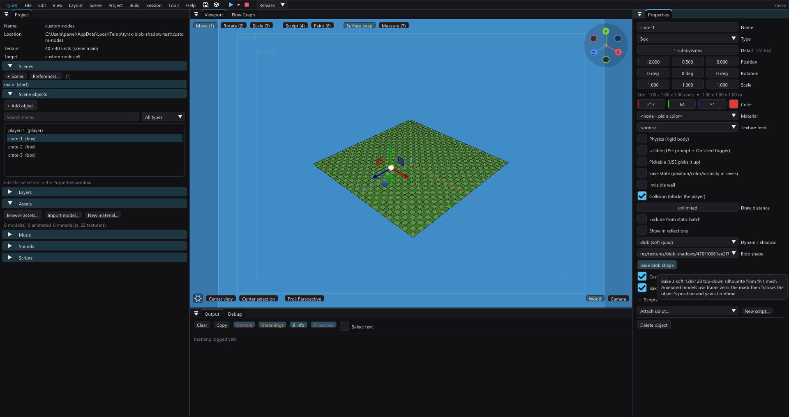

# Shadows

Three shadows an OBJECT can cast, chosen **per object** in *Properties >
Dynamic shadow* — plus a fourth thing further down this page, which is about a
LIGHT rather than an object ("Spot-light shadow volumes"):

| | Blob | Projected silhouette | Baked (decal) |
| --- | --- | --- | --- |
| What it is | one soft dark quad that follows the ground under the object | the object rendered a second time (64×64, from the sun) and projected under itself | the shadow traced once on your machine and projected onto whatever is under it |
| Shape | a baked/picked top-down mask per object; round fallback when none is assigned | the real silhouette, animation included | the real silhouette, with a real penumbra |
| Moves | yes | yes | **no** — it is baked |
| Cost | one 18-triangle / one-package patch | a second render per frame, **four casters at a time** (the nearest to the camera win) | one submit per atlas page, whatever the shadow count |
| Good for | crowds, small props, anything you want grounded | hero objects | static scenery, and anything standing on a textured floor or against a wall |

They are not the same thing as **"Cast shadow"** further down that panel, which
is the *baked* ambient occlusion ([ambient-occlusion.md](ambient-occlusion.md)):
that one is painted into the lighting at build time and never moves. Nor is it
the flashlight's own shadow machinery, which is a separate system with its own
page ([flashlight.md](flashlight.md), "The shadow"). If what you want is a big,
plainly visible dynamic shadow, it is the **projected silhouette** below that
gives it: a torch held at the eye hides its own shadows behind whatever casts
them, by geometry rather than by any bug (flashlight.md, "How much of a volume
shadow you will actually SEE").

## The choice, and what "Default" means

*Properties > Dynamic shadow* offers **Default / None / Blob / Projected
silhouette / Baked (decal)**, and Default is what every project did before the
choice existed:

- a **blob** under the things that MOVE — the third-person avatar, animated
  models and physics bodies — while *Preferences > Rendering > Blob shadows
  under moving objects* is on;
- a **projected silhouette** where the object's *Projected shadow (live)*
  checkbox is ticked (that checkbox is still there, and still what an existing
  `.tyra` carries).

Picking anything else overrides both, in both directions:

- **Blob** works on a **static** prop too, and with the project preference
  **off** — the moving-things rule only gates the default. This is the answer
  to "I want this model grounded, but not at the price of a silhouette render".
- **None** keeps an object out of both systems even when the preference is on
  and the checkbox is ticked.
- **Projected silhouette** casts one whether or not the old checkbox is set.
- **Baked (decal)** leaves both runtime systems and takes the static route
  below instead. It needs a bake and it needs the caster to stand still.

Lights and markers never cast either kind, whatever the mode says.

## Baked blob shapes

Choose **Blob**, then use **Blob shape** in the same Rendering section. Every
renderable scene object can pick an existing project PNG or press **Bake blob
shape**. The bake rasterises the object's top-down triangles into a soft
128x128 alpha mask under `res/textures/blob-shadows/`; static OBJ models and
primitives use their authored mesh, while animated GLB/FBX models use frame
zero. The stored X/Z footprint keeps rectangular objects rectangular after the
mask is normalised into a square texture.

The console cost does not grow with mesh complexity: it samples the mask on a
compact 3x3 heading-aligned receiver grid (54 vertices, one textured VU1
package) that follows the visible ground — the baked road/junction surface
where present, otherwise terrain. The interior samples matter at road edges:
four outside corners can all sit on terrain while asphalt crosses the middle of
the footprint. Heading comes
from the full runtime object basis, so vehicle pitch/roll and the XYZ Euler fold
past 90 degrees cannot freeze or reverse the mask. Re-bake after a model's
silhouette changes. Picking a PNG manually is useful for an art-directed
shadow; because an arbitrary image has no geometry metadata, its quad size is
inferred from the runtime model or primitive. Lights, cameras, markers and
other objects without drawable triangles may pick a mask, but cannot generate
one from themselves.

Vehicles expose the same choice in their **Rendering** section. A projected
silhouette is intended for the player's car or another hero vehicle; a blob is
cheap enough to put under every AI traffic car. Both follow the vehicle's live
runtime transform, so an NPC keeps its shadow while driving its route. Vehicles
cannot use baked shadow decals: the baker rejects them, and their selector
offers only runtime modes, including for objects without the generic physics
flag. Their
size comes from the imported body's real model bounds rather than the instance's
unit-cube scale. The vehicle import also rasterises the canonical body's
top-down triangles into a soft 128×128 alpha mask. Blob mode puts that mask on
one yaw-aligned, four-corner terrain-conforming quad, so the low-cost shadow
reads as the car's shape instead of a circle without adding another model
render. The blob covers the wheelbase instead of sitting between the axles,
and the 64x64 projected-shadow camera frames the whole body. The
projected pass renders the body model; the separately batched near wheels do not
consume another shadow submit (at distance they are already baked into the body
LOD).

**Under a GI bake, Default draws no sun silhouette for a static object.** Its
sun shadow is already in the baked lighting
([global-illumination.md](global-illumination.md)), per texel, and the editor
shows that bake — so a live silhouette on top would land the same shadow twice
(a second, darker copy the editor never has) and spend one of the four slots
on something that cannot move. The live one still draws while the day/night
clock runs (the bake is at one hour, the live shadow sweeps), under a torch or
a dynamic spot (nothing baked those), and for anything animated, physical or
on the matrix path. *Projected silhouette* in the combo forces it regardless.

**A caster's silhouette stops at its floor.** Projecting a texture cannot
tell a receiver point in front of the caster from one behind it along the
light ray, so any part of a caster below the surface it stands on throws a
second shadow onto the *lit* side — the ray from a sunlit ground point,
carried on underground, meets the buried part. A wall sunk 4.5 of its 10
units into the terrain (the usual way to plant one) drew a full shadow on
both sides of itself. The silhouette render lifts every vertex below the
floor up to it, for that render only: a box loses exactly its underground
part, a model's underground part flattens to a sliver at floor level.

## What it costs

The projected system claims its VRAM at boot **only if some object asks for a
silhouette** (`PROJ_SHADOWS_USED`), and the blob system loads its sprite only if
some object asks for a blob or the preference is on (`BLOB_SHADOWS_USED`) — so a
project that uses neither pays for neither. An assigned per-object mask wins;
a vehicle otherwise uses its derived
`.res-baked/vehicles/veh-<id>-shadow.png`; blobs with neither use the round
flare-glow fallback baked into `res/hud/` when either half wants it.

Four projected casters are active per frame, ranked by apparent size (distance
divided by their bounding radius), so marking everything does not draw
everything. Blobs have no such limit; they are a quad each. A blob does,
however, follow its caster's authored draw distance and uses a conservative
whole-footprint frustum test before rebuilding the quad or sampling terrain.
Off-screen casters therefore do not pay five terrain queries merely to be
rejected later by per-package culling.

A silhouette also fades out with distance on its own: it is dropped past **50
units** from the camera and dissolves over the last 15 of them, so backing away
from a caster loses its shadow smoothly rather than switching it off. Nothing
scales that with the caster's size — a building's shadow goes at the same range
a crate's does.

### Almost all of it is the CASTER's geometry, not the shadow's

Worth knowing before anyone optimises this producer, because the shape of the
cost is not where it looks. Measured per producer on the Motor District's
garage-day frame (`examples/vehicle-playground/authoring/wheel-strip-2026-09-17/`),
with the bracket split three ways:

| what submits it | VU1 packages | vertices | bags |
| --- | ---: | ---: | ---: |
| the caster's own model bags, into the slot | **60** | **4 440** | 4 |
| the receiver patches | 2 | 96 | 2 |
| the torch's wall copy | 0 | 0 | 0 |

**87% of the packages and 96% of the vertices are the caster's own bags being
re-submitted from the light's point of view** — geometry this feature neither
builds nor owns, and which is packed exactly as well as the object loop packs
it. If a caster's model is a triangle list, its shadow is one too. (In this
scene they are: the casters are two imported cars, and an imported car is
flat-shaded — see [vehicles.md](vehicles.md), "The wheel batch is a strip".)

### Halving that, without touching the geometry

The vertices are not the lever; **how they are packaged** is. Those bags are
submitted exactly as the object loop submits them — textured, with per-vertex
colours — which is the texture+colour VU1 class at **75 vertices a package**.
The shadow map reads neither attribute. It is 64x64, and
`RendererCoreShadowMap` says so itself: no colour fidelity, only the alpha
coverage matters, because the receiver draws black modulated by that alpha.

Submit the same vertices with no texture bag and ONE colour and they go through
the colour class at **150 a package** — exactly double. `getMaxVertCount` is
`(dbuffer - 9) / (colorElementsPerVertex + reglistCount)` rounded down to a
multiple of 3; the double buffer is `(944 - 22) / 2 = 461` and `cull_c` is built
with `elementsPerVertex 2, reglistCount 2`:

| silhouette bag | vertices per package |
| --- | ---: |
| textured + per-vertex colour | 75 |
| untextured + per-vertex colour | 111 |
| untextured + single colour | **150** |

That is `TYRA_CHEAP_PROJ_CASTER` in the generated game, and on the garage frame
it takes the silhouette from **60 packages to 32**, in both the day and the
night pose, with the vertex count, the bag count and the receiver patch
unchanged. No geometry changes, no second vertex array, no bake and no format
change: the silhouette bag shares the part's own vertices.

Two things make it work, and both were paid for:

- **The package size must NOT be inherited from the base bag.** `pinPackageSize`
  gives that bag the minimum size over itself and its coplanar companions — the
  reflective env pass, the AO pass, the emissive one — because they rasterize
  the same pixels and a GEQUAL test cannot survive two passes that classify a
  triangle differently. A car body is reflective, so copying its pin held the
  silhouette at 75 and the change moved *nothing at all*. The silhouette is
  coplanar with nothing: it rasterizes alone into a slot target with its own
  z-buffer, so it asks for its own derived size. A **stripped** array is the
  exception — its runs are self-contained, so it keeps its run and wins only
  the class change.
- **It shares the base bag's binding, not an array.** A LOD tier re-aims the
  base bag at the tier's own array, so the silhouette follows whichever array
  the base currently points at — pointer, count and `contentVersion` together
  (docs/bag-content-version.md).

**Why it defaults to 0.** The colour half is exact: `pushVert` writes alpha 128
for every model vertex, so per-vertex colour carries nothing the coverage reads.
The texture half is not. The GS modulates alpha as well as RGB, so a caster
whose texture has alpha — foliage, a chain-link fence, any alpha-tested cutout —
gets its holes from that texture and would cast a solid blob without it. That is
a per-model property the pass cannot see (`Texture` exposes no alpha predicate),
so the knob stays off until a project's casters are known to be opaque. A
per-material gate is the real fix and is not built. In the Motor District both
casters are vehicles — the only two `shadowMode 3` objects in it — and their
bodies are opaque palette bakes.

The receiver patch, the only array this feature generates, is written as a
**triangle strip**: one strip per row of cells joined by degenerate seams, 48
vertices where the list was 96, and `StaPipBag::packageSize` pinned to it. That
is a bigger saving than halving the vertex count suggests — a list patch is a
single 96-vertex package that the partial-frustum route then sub-splits into
thirds, and a stripped package is never sub-split, so the two patches fell from
**9 packages to 2**. The pixels are byte-identical; a patch is a grid, which is
the shape a strip is best at.

The torch's **wall copy** is still a triangle list, built per frame from
arbitrary receiver geometry. Nothing above prices it, because no sunlit pose
reaches it at all.

### Road and terrain are both receivers

Receiver patches are depth-tested and never write z. `groundSurfaceAt` first
tests the already-built road chunks (including automatic junction fans) and
falls back to the terrain; `projSurfaceAt` can then raise that result to the top
of an ordinary platform or bridge receiver. Blob shadows, point-light pools,
flashlight floor pools and projected silhouettes all share this base. Reading
the baked triangles instead of re-evaluating the road spline is important: the
answer includes the exact lateral terrain tessellation and list/strip geometry
that is submitted to the GS.

The old Motor District garage pose exposed the bug: both casters stood on a
road, while their patches were placed on terrain 0.12 units below it and failed
the road depth test. When validating receiver work, still compare against a
known-bad arm; a held shadow slot or submitted package is not proof that a pixel
survived depth testing.

Sampling the correct height function is necessary but not sufficient for a
moving decal. Blob shadows therefore use a 3x3 grid rather than one quad: a
road can cross the footprint without touching any of its four outer corners.
The 54 textured vertices remain below the 75-vertex package ceiling.

### The four slots change hands slowly

### Distance

A caster further than **Preferences > Shadows > Projected shadow distance**
from the camera takes no slot at all, and a shadow dissolves over the last
30 % of the way there (35..50 units at the default of 50, which is what the
number used to be as a built-in). It is one project-wide number because the
four slots are one project-wide budget: on a wide scene where nothing contests
them, raise it and the shed's shadow is there from further off; on a crowded
one, lowering it keeps the slots for what is near. The `.tyra` carries
`projShadowDistance` only when it is not 50 (format v38).

**Which four win** within that reach (1.71.1): only casters inside the
camera's view cone are candidates - a radius and a half of margin, so a
caster at the frame's edge still counts - and they
are ranked by how big they are on screen, distance over bounding radius, so
the shed twelve units off outranks a crate at ten. Raw camera distance used
to decide it, and the slot's own log showed the yard's four slots held by
casters at 5.6 / 7.4 / 8.5 / 9.7 units, three of them *behind the player*,
while the lamp post in front of the camera at twelve cast nothing. The
hysteresis and the dissolve are unchanged; they compare the same key.

Marking twenty casters is not an error, but which four you get is then decided
by where you stand, and the answer must not change on a footstep. It is held,
on the same terms as the count band below:

- a caster that **stops qualifying** — hidden, streamed out, past the far cull,
  or unable to draw a shadow at all for half a second — releases its slot at
  once, because there is nothing left to flicker against;
- a **challenger** must be 15 % or 1.5 units nearer, whichever it reaches
  first, for ten consecutive frames before it may take a slot over;
- and the hand-over is a **cross-dissolve in time**: the outgoing shadow keeps
  its slot while it fades away, and only then does the challenger move in and
  fade up. About a third of a second each way, so an exchange reads as one
  shadow softening while another firms up rather than as two pops.

The **light** a silhouette is thrown from is held the same way. Each caster
picks its own — the scene sun or moon, any placed light in reach, and (with
*Flashlight shadow volumes* off) the player's torch — scored by how much that
light actually lands on it, so a lamp you are standing under really does throw
the shadow rather than the sky. A torch walking past a lamp crosses that line
twice in a couple of steps, which would swing the shadow round to the other
side of the prop and back. A caster keeps its light unless another is a fifth
brighter on it for ten frames; a light that drops out entirely (switched off,
streamed out, the caster leaves its cone) hands over immediately. Note this one
is only patient, not gradual — a shadow that changes light MOVES, and a
direction cannot be crossfaded ([day-night-cycle.md](day-night-cycle.md) makes
the same point about the sun/moon handover).

None of this is a reason to mark everything. Four is still four, and the
casters you did not want are still the ones the camera happens to be near — it
just no longer blinks while it decides.

## Baked (decal)

The other three shadows on this page are computed while the game runs, and
every one of them is rationed: four silhouette slots, one spot light, a quad
with no shape. This one is computed **here, once**, and then costs the console
almost nothing — so it is the only shadow you can have a hundred of.

What it is: the editor traces the shadow the object throws along the scene's
sun into a small texture, and projects that texture onto the receivers under it
with the same machinery an authored *projecting decal* uses
([decalproj](../src/decalproj.hpp)). The console receives a finished list of
world-space triangles and draws them through one blended pass. Nothing is
projected, clipped or silhouetted on the EE.

Two things follow from that, and they are the whole reason to reach for it:

- **It lands on textured surfaces and on models.** The baked lightmap
  ([ambient-occlusion.md](ambient-occlusion.md),
  [global-illumination.md](global-illumination.md)) cannot: a lightmapped
  receiver is untextured by construction, because the lightmap needs the
  texture slot. A crate's shadow on a tiled stone floor, or on the side of an
  imported `.obj` building, has no other static route.
- **It is sharp where it matters.** The terrain lightmap is one 256×256 image
  for the *whole* ground, so on a 128-unit map it holds two texels per unit.
  A 64×64 shadow tile over a four-unit footprint holds sixteen.

### Using it

1. Turn the feature on in *Ambience Editor > Baked lighting > **Baked
   shadows***.
2. Set *Properties > Dynamic shadow* to **Baked (decal)** on the objects that
   should cast one.
3. Press **Bake this scene** (or **Bake all scenes**) in that same section.

The bake is cached in `.res-baked/shadow/`, keyed by a content hash of
everything that could change it — the sun at the baked hour, the quality
settings, the heightmap, and the transform and model bytes of every object that
**takes part**: a caster, or anything that could receive. A marker, a light, a
camera or the player's spawn cannot move a shadow, so moving one does not stale
the bake. Move a caster or the wall it falls on and the scene reads **stale**;
the cache is checked into git on purpose, like the GI one, so a clone keeps its
shadows. **Re-bake stale scenes before every build** does it for you.

**A stale bake ships nothing, and the build says so.** There is no partial
answer here — an out-of-date cache is not read at all — so a scene with casters
and no fresh bake would otherwise produce a game with no shadows and no
complaint, which reads as the feature being broken. The build prints one
warning per such scene, naming it and the fix.

### What it costs

Three budgets, and the panel prints all three per scene because which one you
hit first depends entirely on the project.

| | What | Where it runs out |
| --- | --- | --- |
| **VRAM** | one 256×256 RGBA page per 16 shadows (at the default 64 px detail) | a page is 256 KB — **23 %** of the 32-bit texture heap, 13 % at 16-bit colour ([gs-vram.md](gs-vram.md)). **Each streaming layer starts a fresh page**, so two casters in different layers cost two pages even if one would have held both |
| **ELF / RAM** | 60 bytes per projected triangle, in the executable | a shadow over plain terrain is tens of triangles; one over a dense model is hundreds |
| *(and the triangles are culled)* | a receiver triangle that lands entirely on fully lit texels is dropped at bake — the projector volume is a long box down the light and most of what it contains is lit ground beside the shadow | |
| **EE** | **one submit per page**, per streaming layer | not the limit, and that is the point — see below |

**The atlas is what makes this affordable, and it is not a VRAM
optimisation.** A PS2 static submit costs roughly 0.7–1.5 ms of fixed EE time
whatever it contains ([prefabs.md](prefabs.md)) — which is why static batching
exists at all. Sixteen shadows as sixteen objects would be most of a PAL frame.
They are **one bag** because they share one atlas page, and they can share one
page because each tile's rectangle is folded into the UVs at bake time. That
fold is free at run time: `decalproj` clips to the projector's unit cube, so
its UVs are in 0..1 by construction and the rect is an affine remap here rather
than a per-vertex multiply on the console (which is what the general
[texture atlas](texture-atlasing.md) needs).

The fill is small and easy to price: a full-screen blended textured pass costs
**0.587 ms** at 512×448 on hardware ([profiling.md](profiling.md)), so a shadow
covering 5 % of the screen costs about **0.03 ms**. The fully lit margin of
each tile is alpha 0 and the GS alpha test drops it, so the transparent part of
a tile pays the raster scan and not the blend.

And there is no distance cull, deliberately. The engine classifies each VU1
package against the frustum on its own bounding box, and the bake sorts a
merged group's triangles into world cells so those boxes stay small — a shadow
off screen costs the classify and nothing more.

### What the bake costs

Seconds, not minutes. `--bake-shadows <projectDir>` prints its own wall clock
per scene so that claim can be re-run rather than believed — **0.03 s** for a
two-caster scene at 64 px detail on a six-core desktop, and it also prints the
**sun it baked at**, which is the first thing to check when a shadow is not
where you expected (the direction comes from the scene's ambience preset, and
a preset's light wins over the project's).

The bake is **deterministic**: the work is split over cores by a dynamic
scheduler, and every texel's sample spiral is rotated by a hash of its own
coordinates, so two runs write byte-identical caches. Check that with `cmp` on
`.res-baked/shadow/scene<N>.shadow`, never with an assertion.

**There is no GPU backend, and that is a measurement rather than an
omission.** A GI texel fires ~128 hemisphere rays against the whole scene tree;
a shadow texel fires a couple of dozen against **one caster's own triangles** —
a box is twelve of them. The work is three orders of magnitude smaller, so a
compute backend would buy a fraction of a second in exchange for a second
answer to "what does this caster occlude" and a GL context to create. If those
per-scene numbers ever stop being fractions of a second, that is the decision
to revisit; `gigpu.hpp` is the shape it would take.

### What it will not do

- **A caster that moves.** Physics bodies, carryables, save-state objects and
  animated models are refused **by name** — in *Properties* the moment you pick
  the mode, and again in the bake log. A silently skipped caster is
  indistinguishable from a broken bake, so nothing is skipped silently.
- **A receiver that moves.** The shadow's triangles are the receiver's
  geometry. Move the wall and the shadow stays where the wall was — which is
  what the staleness check is for, and why the scene goes amber the moment you
  do it.
- **Follow the clock.** The bake is at one hour, the same
  `ambience::bakedHour` the GI bake uses ([day-night-cycle.md](day-night-cycle.md)).
  With the day/night cycle running, the sun sweeps and a baked shadow does not.
  Use the projected silhouette there.
- **Double up with a lightmap.** Where a scene has a fresh GI bake, the sun's
  shadow is already in the terrain map and in every untextured primitive's
  atlas region. The projection **skips those receivers** — automatically, in
  `shadowbake`, not as advice — and lands only on what the lightmap cannot
  reach. Without GI it lands on everything.
- **Cross a streaming layer.** A shadow belongs to its caster's layer and is
  projected only onto receivers in that layer or outside every layer. Otherwise
  unloading one building would leave its shadow on the ground, or take the
  ground out from under somebody else's. Unloading the layer stops the shadow
  being **drawn** — precisely, and be clear about which half this is: its
  triangles live in the executable like every other baked decal's, and its
  atlas page stays resident for the scene. A page is never shared between two
  layers (each layer's tiles start on a fresh page), so freeing one with its
  layer is possible later; today it is not done.
- **Come from a lamp.** The direction is the scene's sun (or moon) at the baked
  hour. A per-object choice of light is a future addition, and each extra
  source costs its own tile and its own mesh.

### Print through a wall — and why that took a second test

The tile is one image with **one depth per texel**: a ray down the light finds
the first receiver and measures the sun there. But the projector is a long
prism down that light, and `decalproj` fills the whole of it — so a second
receiver *behind* the first is inside the volume too, and gets printed with the
same alpha. Concretely: a post's shadow reaches a wall, climbs it correctly,
and then goes on printing onto the grass on the far side. It reads exactly like
the shadow passing through the wall, because it is.

The tile cannot answer that question, so `shadowbake` asks the scene. Every
triangle the projection emits is tested at its corners and centroid: can this
point see the sun once the **caster itself** is discounted? Two trees, no third
structure — a hit in the scene tree nearer than the hit in the caster's own
tree means somebody else shades this point, and the triangle is dropped. The
test is deliberately conservative (all four points must be blocked), because
the decision is per triangle and eating a real shadow is the worse error.

Worth knowing what this leaves behind: the ground past that wall is now
**unshadowed**, not wall-shadowed. Only an object in mode 4 throws anything. If
that ground should be dark, the wall needs the mode too.

It is also a saving, not just a correction — on `examples/baked-shadows` it
dropped the scene from 300 triangles to 230, because every one of those
triangles was drawing a shadow onto ground no light reached anyway.

### On a real model, not a box

The tile is traced against the caster's **own triangles**, so a model casts its
actual silhouette rather than a blob. How well that reads depends on one thing,
and it is not the one you would guess:

| Caster | Result |
| --- | --- |
| Solid, chunky shapes — a tree canopy, a crate, a statue, a vehicle | Reads clearly. The outline is the real one and the edge is soft. |
| Thin members — scaffolding tube, lamp post, railing, fence wire | Washes out to nothing at any distance. |

**Thin things vanish to the penumbra, not to the texel count**, and the A/B
says so: at *Shadow detail* 64 and at 128 the same scaffolding shadow is
indistinguishable, and only dropping *Softness* from 2.5° to 0.5° brings its
bars back. The arithmetic is why — a 2.5° light 12 units away has a penumbra
about `12 * tan(2.5°)` = 0.5 units wide, so a 0.1-unit tube blocks a fifth of
the disc and bakes at alpha ~28 of 255. That is not a defect; it is what a thin
pole at that distance actually does under a soft light. Raising *Shadow detail*
to fix it is the reflex, and it buys nothing.

So: reach for **Softness** when a caster's detail is disappearing, and for
**Shadow detail** when a large shadow looks blocky.

### A caster that is too big

The 512-triangle cap is about what the shadow **lands on**, not about how
complex the caster is: a 20-triangle castle still covers half the map, and at
60 bytes a triangle that is ~120 KB of executable for one shadow, which does
not stream. So a whole street block marked as one caster is refused, and every
lamp modelled into it loses its shadow with it. The panel says which, by name.

The answer is usually not this feature. **A big static building on terrain
already casts a shadow through GI** — the sun's shadow is in the terrain
lightmap and in every untextured primitive's atlas region, per texel, at no
extra cost, which is exactly why the projection skips those receivers. Baked
decals exist for the gap GI cannot reach: textured surfaces and models.

When the receiver genuinely is a model or a textured surface, the two ways
through are to **split the model** so each piece casts its own shadow within
its own budget, or to bake the light into that receiver's own texture with
[pre-lit](ambient-occlusion.md) — one unique texture per receiver.

| Receiver | Tool | Cost |
| --- | --- | --- |
| Terrain, untextured primitives | **GI** | none extra — already in the lightmap |
| One specific textured surface | **pre-lit** | a unique texture per receiver |
| Models and textured walls, many casters | **baked decal** | ~60 B/triangle of ELF, one submit per page |

### Quality settings

All four are project-wide, in *Ambience Editor > Baked lighting*:

- **Shadow detail** — 32 / 64 / 128 px per shadow, i.e. 64 / 16 / 4 shadows per
  atlas page. A page costs the same 256 KB whatever is on it, so this is
  really a choice about how many shadows share one.
- **Softness** — the light's angular diameter in degrees. The real sun is 0.53;
  the default 2 is softer because it reads better at this resolution and hides
  the tile's own texel count. The penumbra opens with distance from the
  contact, so a crate is crisp where it touches the ground and soft at its far
  edge, for free.
- **Strength** — how much light full shadow takes away, 0..1 (default 0.55).
  **The shadow is a per-pixel MULTIPLY, not a wash**: the tile is near black
  and blends alpha-over, which is the same trick the scene lightmap's occlusion
  pass uses, so a shaded surface keeps its own colour and simply gets darker —
  green grass stays green, red brick stays red. It carries a little of the
  sky's *hue* at a low value so shade reads cool rather than neutral.

  This is worth stating because the obvious alternative is wrong and looks it.
  Blending toward a bright "shadow colour" — the sky at ambient strength, say —
  is `Cs*a + Cd*(1-a)` with a bright `Cs`, which at any useful alpha *replaces*
  the receiver instead of shading it: every surface converges on the same
  grey-blue and the scene goes flat. That is what this did in its first cut,
  and the report was simply "these shadows are awfully grey".
- **Max length** — how far a shadow stretches, in multiples of the caster's own
  height. A low sun throws one hundreds of units long and every texel of the
  tile goes into it, so this has to exist. `0` means across the map.

  It is a **fade, not a cut**, and getting there took two goes. The first
  version simply ended the projector at this distance, which drew a straight
  line across the ground — reported, fairly, as a bug. Ramping the alpha down
  over the last of the reach fixed the easy half. The hard half only showed up
  in the atlas itself: where a receiver **steps away** — a quay edge, a stair,
  a drop to water — the surface below is much further along the light, so a
  search that stopped at the fade distance found *nothing* there, and a texel
  with no hit at all sat next to one at full strength. No ramp can soften that,
  because the ramp never runs. The measured tile went `0` to `140` across one
  row. So the search now runs on past where the shadow fades, the lower surface
  is found, and the shadow walks down the edge instead of stopping on it. Same
  scene after: eighteen distinct alpha levels instead of two.

  It costs what you would expect — a deeper projector holds more receiver
  geometry, about +34 % triangles on `examples/showcase`. The footprint is
  still sized from the fade distance rather than the search distance, so the
  extra depth does not also cost tile resolution.

### One interaction worth knowing

**16-bit colour is a trap here.** It nearly doubles the texture heap
([gs-vram.md](gs-vram.md)), which is exactly what you want when you are paying
256 KB a page — but it also runs a 16-bit z buffer, whose depth step is ~1.5
world units at a distance of 100. A decal sits 0.015 units in front of the
surface it darkens. Baked shadows in the distance will z-fight in a 16-bit
project, and no setting here fixes that. This applies to authored projecting
decals too; it is simply much easier to hit when you have fifty of them.

## Spot-light shadow volumes

The two shadows above are about an OBJECT and the sun. This one is about a
**light**: a placed point light with *Spot (cone)* on
([flashlight.md](flashlight.md), "A scene light with the same trick") carves
its own occlusion per pixel, exactly the way the player's torch does
(flashlight.md, "The shadow"). Without it a street lamp bolted to a wall lights
the wall and the alley behind it equally — the cone is a lighting term and
nothing stops it.

Switch it on project-wide in *Preferences > Rendering > **Spot light shadow
volumes***, and override it on any one light in *Properties > Point light >
**Shadow volumes*** — **Default (follow the project) / Off / On**, the same
tri-state idiom as *Dynamic shadow* above. The override only means anything
while *Spot (cone)* is on; a point light has no cone to carve.

**What gets carved is the lamp's ground pool and its light on the solids in
its cone** (1.70.0). The pool is the projected patch under the cone
(flashlight.md, "What the pool does"). The solids are the torch's **receiver
pass** on a scene lamp: the nearest three solids the cone touches - the
torch's rules, so thin things and grouping-cell sized things are skipped - are
rendered a second time, additively, with the lamp's projective STQ per vertex,
through the same mask the pool drew through, from a shared 3997-vertex budget
split fairly between them. What made that honest is a new engine lever:
`PipelineInfoBag::dynLightSkipSlot` names ONE scene light a bag's per-vertex
slot must ignore, and every wall-sized receiver (the torch's 1.4 u rule - a
crate lit all over reads better than one bright face and three black ones)
skips the carving lamp for as long as it is a receiver, so the wall takes that
lamp's light once, projected, with the shadow carved out of all of it. The
wall's falloff is half the torch's slope, because the lamp's pool beside it has
none - a wall that faded faster than the floor at its foot read as a seam.
Smaller solids keep their per-vertex light from the lamp AND get the projected
pass on top (the torch does the same). A statically batched receiver takes the
skip only when its batch holds nothing else, exactly as `setFlashSpotOff`.

### Only one spot casts per frame

Volumes are counted in a dedicated GS buffer — the **count band** — and a
counting bracket is per light per frame. There is one band, so a scene holding
six shadow-casting lamps does not cost six times a single lamp: **the one
nearest the camera is the one that casts**, and the others light their cones
without occluding them.

Precisely: among the lights that are active, visible, spot, asked for volumes
and actually **lit** (a lamp a *Set Light* node switched off, or one flickering
dark, is not a candidate) and whose reach is not wholly behind the eye, the
nearest to the camera holds the slot. The hand-over uses **hysteresis** — a
challenger has to be 15 % or 1.5 units nearer, whichever it reaches first, for
ten consecutive frames — so two lamps at nearly equal distance cannot trade the
slot every frame and make the scene's shadows blink. A lamp that loses its
qualification (switched off, streamed out, walked out of view) hands over at
once, because there is nothing left to flicker against.

That is the reason the per-light override earns its place. In a room of lamps,
setting one to **On** and leaving the rest on *Default* in a project whose
switch is off is how you say *this* is the lamp whose shadow the scene is
about. Setting them all to On does not buy more shadows; it only makes which
one you get depend on where the camera happens to be.

### What it will not do

- **Animated models and physics bodies are not receivers** (skinned buffers
  and local-space vertices - the torch's rule), and a receiver whose batch is
  shared keeps the lamp per vertex as well as the projected pass, so it can
  read brighter than its lone neighbour. One lamp must not unlight everything
  batched beside its wall.
- **A scene with no terrain has no spot pool at all** ([terrain.md](terrain.md)),
  so there is nothing for a lamp to carve. The torch's pool is projected onto
  whatever its beam lands on and is unaffected.
- **The caster whose shadow you are standing in is dropped** for that frame.
  The count is z-*pass*: it asks how many volume faces sit in front of the
  scene's depth, which is the shadow's depth only while the eye is outside
  every volume. A torch is held at the eye and can never be inside one; a lamp
  on a wall throws a shadow you can walk into. Your own shadow fading as you
  step into it is a far smaller lie than the whole mask inverting.
- **No count band, no shadow.** If the GS refuses the band's VRAM the lamp
  lights its cone plainly. (The torch has a 1-bit fallback for that case; it
  works by interleaving each receiver's light with the volumes in front of it,
  and a lamp's receiver is one patch, so there is nothing to interleave.)
- **Casters follow the same rules as the torch's**: everything solid inside the
  cone, nearest first, at most four, nothing bigger than a grouping cell, and
  nothing whose *Dynamic shadow* is **None** — that setting now keeps an object
  out of the volumes too, for both lights.

### In the editor

The viewport previews the carve in **Solid** shading (the default): the spot
that would hold the slot in the game — the nearest to the editor camera among
the dynamic spots that resolve to "on" — shadows through the same casters the
game's `pickVolCasters` would pick (everything solid in its cone, nearest four
to the light, nothing grouping-cell sized, nothing whose *Dynamic shadow* is
None), while every other dynamic light keeps the older preview rule (its
nearest four *Cast shadow (projected)* objects). Two honest differences: the
preview's shadow is the analytic box or sphere the AO occluders use, where the
console extrudes a model's real triangles, so a tree throws a box; and there
is no hysteresis — an editor camera does not drift between two lamps frame to
frame. The same change uploads the occluders whenever a dynamic light is in
the scene, not only with ambient occlusion on (the lamp-shadow preview was
silently off without AO), and lets the ground take point and spot light with
GI *off* — the terrain's "never probe-lit" flag used to read as "lit by GI"
and skipped every lamp. **PS2 shading** is unchanged: the terrain is shaded
flat per cell there, so a per-pixel cone comes out as cells, and a spot's
gobo pool is not drawn in that mode ([ps2-viewport.md](ps2-viewport.md)).

### What it costs

**No extra VRAM next to the flashlight.** The torch and the frame's active spot
count into the **same** band, so a project that already has *Flashlight shadow
volumes* on has paid for it — the boot path allocates the band if *either* asks
(`(FLASH_SHADOW_VOLUMES && FLASHLIGHT_USED) || SPOT_SHADOW_VOLUMES_USED`), and
the Preferences VRAM warning is one warning about the pair. On its own the band
is 512 KB at 32-bit colour, 256 KB at 16-bit; that page is worth reading before
switching either on ([gs-vram.md](gs-vram.md)) — the symptom of running out is
not a missing shadow but every texture in the scene re-uploading once a frame.

What is left is the per-frame volume fill for the one active light, and the
same geometry rules the torch's volumes follow: models cast from their real
triangles (a decimated **shadow proxy** past 1200 of them), primitives from
their own unit mesh (flashlight.md, "The shadow"). The count bracket is
scissored to the volumes' own screen rectangle, so a lamp whose shadow is a
few hundred pixels costs a few hundred pixels of fill and not a full raster.
Measured on a scratch fixture (one lamp, one box, PCSX2 software renderer):
50.0/50 with the switch on and 50.0/50 with it off.

One thing a project that has never had a flashlight gains here: the lamp's
projected pool is drawn through the same **gobo** image the torch uses, and
that image used to be baked and loaded only for projects with a torch. A
project whose only user of it is a shadow-casting spot now bakes and loads it
too — a 128×128 texture, and without it there is no pool to carve.

A project that uses none of this generates none of it. `SPOT_SHADOW_VOLUMES_USED`
is **resolved**, not read off the project switch, because the two disagree in
both directions: a light overridden to On in a project with the setting off
still needs the band, and a project with the setting on but no spot light
anywhere must not allocate one.

## On disk

`SceneObject::shadowMode` — `0` follow the project, `1` none, `2` blob, `3`
projected, `4` baked decal — written into the object's JSON only when it is not
0 (format v35 for 0..3, **v46** for the baked mode,
[format-versioning.md](format-versioning.md)). An untouched project therefore
resaves byte for byte, and an older editor reading a newer file falls back to
the `projShadow` flag it already understands.

The baked mode's six project-wide settings (`bakedShadows`, `bakedShadowRes`,
`bakedShadowSunAngle`, `bakedShadowStrength`, `bakedShadowMaxLength`,
`bakedShadowAutoBake`) are v46 as well and are each written **only when they
are not the default** — so a project that never touched the feature is
byte-identical on a resave. The bake itself is not in the `.tyra` at all: it
lives in `.res-baked/shadow/scene<N>.shadow`, and its atlas pages in
`.res-baked/shadowatlas/`, regenerated from that cache by every build.

Only the **pages** ship. `shadow/` is a host cache — nothing on the console can
read it — so the build's resource copy skips it (and `gi/`, which had always
been copied) and the ISO export skips it too. Otherwise it would sit in `bin/`,
which is the game's own filesystem, and be burned onto the disc.

`ProjectSettings::spotShadowVolumes` (`"spotShadowVolumes"` in the manifest's
settings, written only when true) and `SceneObject::lightShadowVolumes`
(`"shadowVolumes"` inside a light object's `light` block, written only when it
is not 0) are format **v37**, on the same terms: both defaults are what every
earlier file meant, so a project that touches neither resaves byte for byte and
an older editor drops two keys whose absence *is* the old behaviour.

An object in the **baked** mode cannot be live-spawned at all
(`liveLinkCanSpawnLive` refuses it, exactly as it refuses a projecting decal):
its shadow is a host projection onto the receivers around the template, so a
clone would stand in daylight with its shadow still lying under the original.

Two objects that differ only in what they cast are **not** interchangeable as
spawn templates: `shadowMode` and `lightShadowVolumes` are both part of the
live-link recipe hash ([live-link.md](live-link.md)). For the light field that
also means an edit of it flips the LIVE chip amber and asks for a rebuild
rather than streaming — it decides what the boot path allocates and which lamp
the frame counts into the band, which is not a thing a running game can be told
mid-flight.
