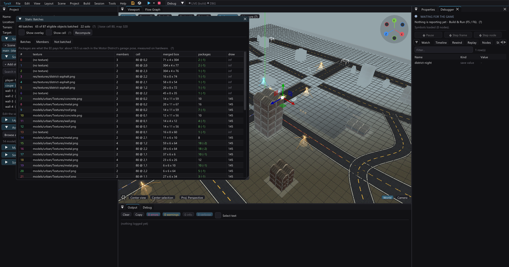
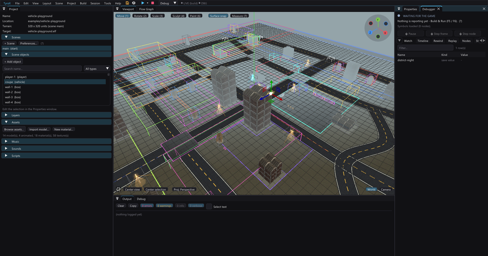

# Seeing how static objects batch

Static batching merges non-moving objects that share a texture into one
submission, and until now the only thing it told you was a count. *Tools >
Static Batches* shows which objects merged with which, what each batch costs
in VU1 packages against drawing its members separately, and — the part worth
opening it for — **why every object that is not batched is not batched**. The
viewport overlay (*View > Static batches*) paints the same answer onto the
scene.



The mechanism itself is described in
[model-pipeline.md](model-pipeline.md#compact-static-model-batching) — what
groups with what, why the grouping cell is bounded by the draw distance, and
why a batch must keep its triangle strips. This page is about looking at it.

## Why a counter was not enough

The generated game already logs two totals at scene load:

```
Static batching: 65 objects in 48 batches
Static batching: eligible 87, solo 22, base cell 80, widest cell 80
```

Those numbers are correct and they are not actionable. They say *how many*,
never *which* and never *why*. The Motor District's own history is the
argument for the difference: in 1.98.0 the scene had 142 authored objects,
111 of them batchable shapes, and exactly **27** carried the flag — not one of
the 70 imported models, the entire population compact model batching was
written to serve. The cause was a single build-time line (`drawDistance != 0`)
rejecting them wholesale. The counter said 27 for months. It took three rounds
of measurement to find out why; a panel that prints the reason per object
answers it in a glance.

Today the same scene reads 87 eligible, 65 batched, 22 solo. **The counter
totals those 22; the panel names them** — on this scene all 22 are singleton
groups, and a further 24 shapes never became eligible at all (18 marked *Show
in reflections*, 6 physics bodies).

## Reading the panel

**Batches** lists one row per batch: its texture, how many members, its
grouping cell, its merged box, and its VU1 packages against what those members
would cost solo. Selecting a row focuses the overlay on that batch alone,
which is the only practical way to read a dense scene.

Packages are the unit to think in, because packages are what the EE pays for:
about **19.5 µs each** in the Motor District's garage pose, measured on
hardware. Carry that figure with its caveat — the same measurement reads 31.8
µs in the night pose, and the bracket split behind it does not support a pure
per-package model (see
[ee-submission-rearchitecture.md](ee-submission-rearchitecture.md#what-one-vu1-package-costs-measured-end-to-end)).
It is the right order of magnitude for deciding whether a merge is worth
having, and nothing more.

A batch that saves no packages is not a broken batch. The saving a merge
always makes is in **submits** — one bag instead of many, and a static submit
costs roughly a millisecond of fixed EE time whatever it holds. Packages fall
too when members pack together, but a list-mode bag whose members each already
filled whole packages will show the same count either way.

**Members** lists the selected batch's objects, with the part index for a
multi-part model (one model can legitimately span several batches — each
material part joins the batch for its own texture).

**Not batched** is the tab that earns the feature its keep. Every shape that
is not in a batch gets a row with the stage that decided it and the reason,
with the full explanation on hover.

## The reasons, and what they mean

They fall into two stages, and the split matters: **a build reason is a
property of the object you can act on directly; a runtime reason depends on
what else shares its cell.**

Build-time (`staticBatchEligible` in `templates.cpp` — these decide the
`batchStatic` column baked into `inc/scene_data.hpp`):

| reason | why |
| --- | --- |
| not a batchable shape | only Box, Sphere, Cylinder, Cone, Plane and Model carry mergeable geometry |
| invisible wall | `collision: invisible` emits no geometry at all |
| physics body | repositioned every frame while it moves |
| usable | the USE highlight re-submits the body itself |
| pickable | carried and thrown, so it moves |
| save state | a loaded save repositions it |
| reflected | re-submitted into the environment-map pass |
| dynamic lighting | wants its own VU1-lit bag, refilled per frame |
| texture feed | a live feed rebinds its texture, and a batch groups *by* texture |
| VU parameters | per-mesh VU numbers are uploaded once per bag |
| mesh LOD / impostor | its representation can switch at runtime; a merged bag has one |
| streaming layer | streamed in and out independently of the batch |
| flow graph / script | per-object logic can move it |
| referenced at runtime | named by a flow node, mirror, portal, cutscene track or catch area |
| baked lightmap region | owns an atlas region, drawn as extra per-object passes |
| excluded by author | the manual opt-out below |

Runtime (`buildStaticBatchList`, among the objects that passed the above):

| reason | why |
| --- | --- |
| batching off | the project-wide switch in *Project Preferences > Rendering* |
| model not baked | no `.tmdl` yet — build, or *Build > Refresh generated files* |
| model has no parts | nothing to draw |
| reflective material | draws a second additive pass per bag |
| too big for its cell | footprint over half its cell; merging would defeat the whole-bag frustum cut |
| alone in its group | nothing else shares its texture, cell, draw distance, lamp and strip run |

**"Alone in its group" is the common one, and it is usually a near miss.**
Turn on *Show cell* with a batch selected: two objects that look like they
should have merged are normally in different cells, or disagree about one key
— a draw distance, which lamp reaches them, or whether their model baked a
triangle strip.

## The overlay, and the box that matters

*View > Static batches* colours every static object by the batch it lands in,
with solo objects in grey — one grey, deliberately, because "not in a batch"
is one state and forty hues would read as forty tiny batches.



On top of the members it draws each batch's **merged box**, in the batch's own
colour and twice as heavy. That box is the reason the overlay exists. A batch
is culled as a **unit**: the frustum test and the draw-distance test are
applied to the whole group, not to its members, so the merged box decides
whether every member draws. An over-wide one is geometry the unbatched scene
would have culled — measured once on `examples/large-terrain` as **400 pixels**
of cones that individually vanish at 60 units, kept on screen by a 512-unit
batch box. That regression is what bounded the grouping cell by the draw
distance, and it is invisible in every other view of a scene.

Two boxes are reported, because two tests use different ones. The **merged
box** in the table is over member *geometry* — what the frustum classifies.
The **member-centre spread** printed by `--batch-report` is over member
*positions* — what `renderStaticBatches` measures the draw distance against.
A member can therefore outlive its own cut-off by up to that spread; it can
never disappear early.

Since 1.127.6 the frustum half of that test runs in the game, before the batch
enters `StaPipCore::render`. The batch is world space (identity model) and its
merged box is exactly its vertex box, so the verdict is the one StaPip's own
main-box check would give, with the same planes. It saves the head and
`bounds` work of every batch off screen: 14 of garage day's 16 bags that
StaPip used to reject itself were batches (PCSX2 counters, captures
unchanged).

## Excluding one object

*Properties > Exclude from static batch*, or the checkbox in either of the
panel's lists, keeps one object out of every batch. It submits its own bag,
exactly as it did before batching existed.

This is the only per-object lever, and it exists for one case: **a member
whose position widens its batch's merged box enough to keep the whole group
drawn past what the scene would cull.** The automatic rules cannot see that —
they know each object's own size, not what its neighbours cost by association.
Before this the only remedies were re-authoring the scene or switching
batching off for the whole project.

Worked example, from the district itself. Batch 0 merges `wall-1` with two
pavements into a box **304 units long**, because a 304-unit wall and two small
slabs share a cell and a texture. Excluding the wall leaves the pavements
their own tight batch and puts the wall on the solo path, where its own bounds
are tested:

```
$ tyrax-editor --batch-report examples/vehicle-playground
batch 0   (no texture)   cell 80 at 0,2   3 members
          merged box 70.8 x 4.1 x 304.0, member-centre spread 78.0
...
[batch] eligible=87 batched=65 solo=22 batches=48

# with wall-1 excluded
    wall-1              build    excluded by author
[batch] eligible=86 batched=64 solo=22 batches=48
```

It is deliberately a plain on/off flag and not a group id. Splitting a batch
into two named halves was considered and dropped: no case was found that the
existing cell key does not already cover, and the cell is a length the scene
states about itself rather than one more thing to hand-tune.

Note that toggling it is a **build-time** change. It decides the object's
`batchStatic` column, the batch list is built once at scene load, and Live
Link cannot re-group a running game — so the LIVE chip goes amber (rebuild)
rather than pretending the running ELF matches.

## The headless twin

```
tyrax-editor --batch-report <projectDir> [sceneIndex]
```

prints the same thing without a GUI: every batch with its members, box and
packages, then every unbatched shape with its stage and reason, then a
machine-readable tail (`[batch] eligible=87 batched=65 solo=22 batches=48`)
that a script can diff across two arms. It exists for the reason
`--atlas-report` does — a number nobody can re-run is a number nobody can
check.

## How the panel avoids lying

The grouping runs **on the PS2**, at scene load, in generated code
(`TerrainGame::buildStaticBatchList`). It reads things that exist only then:
the loaded models and materials, the live dynamic-light list, and the engine's
own `Texture*` pointers. It cannot be moved host-side without baking a batch
table into `inc/scene_data.hpp` — which would change the generated output of
every project that exists.

So the editor has a **twin**: `src/staticbatch.cpp`, a host implementation of
the same rules, in the tradition of `scrollsim`/`scroller.gen.cpp`,
`livelogic` and `menulayout`. A twin that nobody checks is exactly the failure
this repository has already paid for once with the road geometry, so it is
checked two ways:

- **`examples/vehicle-playground/authoring/verify-batch-twins.py`** lifts
  `buildStaticBatchList` *verbatim* out of `templates.cpp`, compiles it beside
  the twin against small stubs, runs both on eleven fixtures and diffs the
  batch assignment member for member. It is the roadgen arrangement
  (`verify-road-twins.py`). Run it after changing either side.
- **The eligibility half checks itself for free.** `batchStatic` in any
  generated `inc/scene_data.hpp` *is* the twin's stage-1 verdict, so a
  regenerated project is an oracle: 87 of 142 objects on the district, which
  is the figure `src/version.hpp` records for that scene.

One fixture in that script is worth knowing about, because it is the subtlest
thing a second implementation gets wrong. `acquireTexture` caches by path and
returns a **null pointer** for a file that is not on disk — and a bag groups
by that pointer. So in the running game **every missing texture batches
together with every untextured object.** It looks like a bug, it is the
behaviour, and "fixing" it in the twin would make the panel confidently wrong
about a scene with a broken asset path. Fixture E pins it.

## Limits

- The panel describes the **authored** scene. Runtime demotion — an object
  dirtied by a flow node or Live Link leaves its batch and draws solo — is not
  shown, because it has not happened yet.
- A model with no baked `.tmdl` cannot be grouped, since its parts, textures
  and strip runs are products of the bake. Those objects are reported as
  *model not baked* rather than guessed at, and the panel says so at the top.
- Package counts are derived from vertex counts and the package size the
  static programs use (75 vertices, `meshstrip::kRun`). They are what the bag
  submits, not a measurement of a frame.
