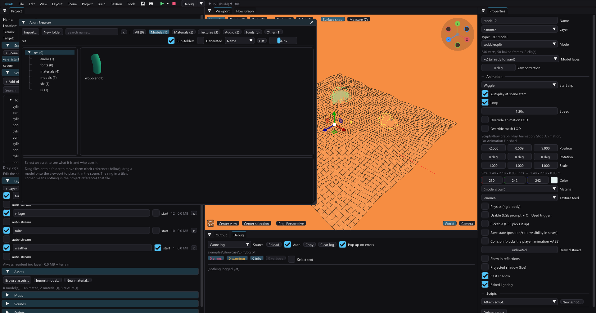

# A binary format for static models (`.tmdl`) + static mesh LODs — design & plan



Developer design doc (not a user guide). Status: **M1–M3 done** — the format
ships, static models carry distance LOD tiers, and a model can name its own
LOD meshes. The user-facing guide is [model-pipeline.md](model-pipeline.md).
M4 (custom LOD meshes for *animated* models, i.e. joint remap by name) and M5
(prebuilt collider, quantization, folding the per-object shade bake into
codegen) are untouched.

Three things the plan got wrong, corrected in place below: the disc gets
BIGGER, not smaller; the tiers cannot weld on normals; and "pixel-identical"
was the wrong bar.

Two problems, one artifact:

1. Static `.obj` models are still **parsed as ASCII at runtime on the EE**,
   once per model, inside a loading screen or — worse — inside a streaming
   layer's one-asset-per-frame job.
2. Static models have **no mesh LODs**. Animated models got them (baked into
   the `.tskl`, ~50%/~25% vertices) because a binary format had somewhere to
   put them. `.obj` does not, which is the whole reason the feature stops at
   animated meshes.

A binary static-model format solves (1) and is the *carrier* for (2). On top
of that, both static and animated models should accept **artist-authored LOD
meshes** instead of only the automatic quadric decimation.

## Why — the evidence

**Runtime parsing.** `vendor/tyra/engine/src/loaders/3d/obj_loader/lean_obj_loader.cpp`
reads the whole file into a `std::string`, then per line constructs a
`std::istringstream` (`lean_obj_loader.cpp:263`) and pulls floats through
`operator>>`; it fan-triangulates, computes a flat normal with `sqrtf` per
triangle, does a `std::map<std::string,…>` lookup per `usemtl`, and grows
output vectors without knowing the final count. The staging arrays, the file
text and the output all live at once. On a 300 MHz EE with 32 MB this is the
expensive part of loading a model, and the whole parse happens inside one
frame of a streaming job (`docs/streaming-layers.md` — "missing assets are
loaded one per frame").

**What the parse produces is trivially bakeable.** `LeanObjMaterial::vertices`
is a flat triangle list of **8 interleaved floats** (pos3, nrm3, uv2), which
`loadModelAsset` swaps straight into `GameModelPart::verts`
(`src/templates.cpp:3800`). Everything the parser computes — triangulation,
flat normals, the `1-v` UV flip, the atlas `# tyra-uvrect` fold, `.aov` AO
bytes — is a pure function of build-time inputs. A baked file can be
`readWholeFile` + one `memcpy` per part.

**Measured outcome (2026-07-25, PCSX2 SW renderer, PAL, host: boot).** A
9 216-vertex model: the loader call went 286.4 ms → 39.2 ms (7.3x), the whole
`loadModelAsset` 306 ms → 59 ms. Twelve instances of it at 8 units:
`renderScene` 27.1 ms → 11.5 ms with decimated tiers (25 → 50 FPS), 6.5 ms
with hand-authored ones. Tiers came out at 4368 (47%) and 1938 (21%) corners.

**Correction 1 — the disc gets bigger, not smaller.** The plan claimed ASCII
is "3–5x bigger"; measured, the 168 KB `.obj` bakes to a 295 KB `.tmdl`
(497 KB with tiers). An `.obj` shares vertices through indices while the
runtime needs a flat triangle list, and indexing the binary would not help:
this pipeline derives a FLAT normal per face (`vn` is ignored), so adjacent
triangles share no corner attributes and welding recovers almost nothing.
RAM is unchanged — the `.obj` path built the same arrays anyway — so the
trade is disc space for load time, and the ISO-size argument is retired.

**Correction 2 — tiers must not weld on normals.** For the same reason: with
per-face normals every corner of a position carries a different normal, so
every position looks like a uv/normal seam twin, the collapse's position-twin
lock fires on all of them and nothing decimates. The first implementation
produced byte-identical "tiers" for exactly this reason. Static tiers weld by
position+uv and recompute face normals after the collapse — which is also
what flat shading wants (each tier flat-shaded on its own faces). The
animated path keeps welding on normals: authored smooth normals are real
data and a hard edge must stay a seam.

**Correction 3 — "pixel-identical" was the wrong bar.** Positions and UVs
(atlas rect included) ARE bit-identical, verified by loading both formats in
one run and comparing on the console. Normals differ by up to 146 ulp,
because the cross product now runs on the host FPU instead of the EE's
non-IEEE one — which is a fix, not a regression: the console's normals now
match the ones the editor viewport shades with. Screen-level A/B was
abandoned as meaningless here: the scene's orbit camera is at a different
phase in every run, so window captures never line up (and the interlaced
FIELD mode's field phase differs too).

**Static LODs are where the FPS is.** Per instance, a static object holds
48 B/vertex (`vertices` 16 + `colors` 16 + `sts` 16 in `GeoPart`,
`templates.cpp:566`), 80 B/vertex with a reflective or AO-atlas pass. An
N-vertex model instanced 10× costs 32N shared + ~480N in per-object copies.
Vertex count also drives exactly what PROGRESS entry 79 and entry 100
identified as the EE cost of static geometry: per-package bbox
classification plus clipping of frustum-crossing packages. The animated
mesh-LOD landing measured 22.9 ms → 11.1 ms on its stress scene
(`docs/animated-models.md:298`); static geometry has the same lever and no
way to pull it.

**No custom LODs anywhere.** `generateSkelLods` (`src/glbparser.cpp:1565`)
auto-decimates and that is the only option. An artist who has a proper
low-poly variant cannot use it, and the decimator deliberately refuses to
touch small parts (`kMinVerts = 96`) or to cross UV/normal seams, so some
models simply do not shrink.

## Scope and non-goals

In scope: static `.obj` models (scene object `type == 5`), their runtime
representation, LOD tiers for them, and artist-authored LOD meshes for both
static and animated models.

Explicitly **not** in scope:

- **Primitives** (box/sphere/cylinder/cone/plane) keep their current path.
  They are generated procedurally at load, they are the only things static
  batching merges (`templates.cpp:13306` excludes models from batching), and
  a merged batch bag cannot switch a single member's tier without re-baking
  the whole batch. If primitive LOD ever happens it must be per *batch*, on
  the batch centroid.
- **Rendering throughput of tier 0.** The format changes load time, not the
  hot path — the submit path already runs on packed arrays. Any FPS win
  comes from LODs, not from the format.
- **The per-object shade bake** (`pushVert`, `templates.cpp:2425`). It runs
  per object after the parse and is the other half of load cost. Moving it
  to build time is a separate, larger decision (per-instance color arrays in
  the ISO, and it interacts with runtime light changes). Measure it in M0 so
  we know what the format does *not* fix.
- **Prebuilt colliders.** `gm.collider.build(...)` at `templates.cpp:3826`
  is more load-time work, but its layout is engine-owned; embedding it
  couples the file to an engine version. Revisit only if M0 says it matters.
- **Position/UV quantization.** Keep `f32` so M1 can be proven
  pixel-identical. `.tskl` quantizes only quaternions
  (`glbparser.cpp:1648`); that precedent is available later as a size lever.

## The format

`"TMDL"` + `u32` version, then packed little-endian host layout — the same
conventions as `.tskl`, which are worth copying wholesale because both sides
ship together and the files are re-baked derived artifacts (no forward
compatibility needed, and none offered):

```
"TMDL" u32 version(=1)
f32   min[3], max[3]          // tier-0 AABB: collision, split band, physExtents
u32   partCount
partCount * {
  char  name[32]              // usemtl name (NUL-padded, truncating snprintf)
  char  texture[64]           // map_Kd, bin/-relative; "" = untextured
  char  reflTexture[64]       // "" | "@sky" | path
  f32   kd[3]
  f32   reflStrength
  u32   flags                 // bit0 = reflRounded
  u32   vertexCount
  f32   verts[vertexCount * 8]   // pos3, nrm3, uv2 — GameModelPart::verts layout
  u32   aoCount                  // 0 = no baked AO; else == vertexCount
  u8    ao[aoCount]
  u32   lodCount                 // 0..2
  lodCount * { u32 vertexCount; f32 verts[vc*8]; u32 aoCount; u8 ao[aoCount] }
}
```

Conventions inherited from `.tskl` (`glbparser.cpp:1587` writer comment,
`vendor/tyra/engine/src/loaders/3d/tskl_loader/tskl_loader.cpp` reader):
4-byte ASCII magic compared with `memcmp`; `u32` version with a
reader-accepted *range*; no byte swapping (x86 writer, little-endian MIPS
reader); no alignment or padding, `memcpy` out of the buffer rather than
casting onto it; fixed-size NUL-padded strings, no length prefixes; `u32`
counts followed by inline arrays; a **bounds-checked sequential reader**
(host `fseek` is unreliable — never seek); sanity caps that reject absurd
counts; and soft failure (`TYRA_WARN` + `nullptr`, never an assert) so a
corrupt model renders nothing instead of trapping. Both files get the
"keep in sync" comment pointing at each other, like
`glbparser.hpp:184` ↔ `tskl_loader.cpp:9`.

What the baker resolves so the console does not have to: material
assignment and the `overrideMtl` replacement rule, texture paths made
bin-relative, the atlas UV rect folded into the UVs (so
`# tyra-uvrect` stops being a model-side concern — see
`docs/texture-atlasing.md`), flat normals, the `1-v` flip, fan
triangulation, dropped empty submeshes, and the `.aov` AO bytes folded in
per tier (which fixes the sidecar's tier problem by construction: `.aov` is
keyed by source `v` index and cannot survive decimation).

**Identity.** A model's runtime identity is already the pair
`(modelPath, materialPath)` (`templates.cpp:63` `collectModelKeys`), and
`animBakedTsklRel` (`templates.cpp:138`) already encodes that into a
filename: `<stem>.tmdl`, or `<stem>__ovr<4 hex of fnv1a64(materialPath)>.tmdl`
with an override. Reuse it verbatim. A custom-LOD selection becomes a third
component of that hash (M3).

## Where the bake lives

Follow `bakeAnimAssets` (`templates.cpp:19399`, called from
`project.cpp:3676` inside `refreshGenerated`): a new
`templates::bakeStaticAssets(p, &warnings)` returning `templates::File`s
written next to the source, i.e. `res/models/<stem>.tmdl` beside the `.obj`
exactly as `.tskl` sits beside the `.glb`. Two reasons this beats putting it
in `texbake`: it runs under `--refresh-gen` (`src/main.cpp:336`) so the
whole bake is testable **without Docker or a GUI**, and it gets the same
`[model bake] …` stdout warning channel.

The atlas UV rect is available there — `texatlas::plan(p)` is deterministic
and already called from two places (`texbake.cpp:279` and
`templates.cpp:17491`); call it a third time rather than reading the
rewritten `.mtl`.

Then, in `texbake`:

- **Ship exactly one of the two.** A model with a `.tmdl` must have its
  `.obj` (and its now-redundant `.mtl`, unless a material asset references
  it) **skipped from the `.res-baked` mirror** — that is where the ISO-size
  win comes from. The pattern exists: atlas members are skipped and any
  pre-atlas copy removed (`texbake.cpp:291`).
- The vanished-source sweep (`texbake.cpp:405`) and the `bin/` staleness
  caveat (`bin/` is additive; a stale `.obj` lingers until a clean, see
  `docs/texture-atlasing.md:73`) both need to account for the switch.
- `isoexport.cpp:94-106` orders per-scene `modelPath` files into the load
  group — it must resolve to the `.tmdl` name.

**Codegen.** `MODEL_PATHS` (`templates.cpp:17434`) points at the `.tmdl`
when one was baked, at the `.obj` otherwise. `MODEL_MTLS` stays for the
fallback path only.

**Incremental bake — new infrastructure, and the one real cost risk.**
Nothing in this repo caches bakes: codegen always rewrites, `texbake`
compares mtimes only for verbatim copies, and AO/atlas/stoch use
`remove_all` + full regenerate. The decimator is the heaviest thing here:
`weldPart` uses a `std::map<std::string,…>` keyed by raw attribute bytes and
`decimate` rebuilds adjacency and quadrics **every round**, up to 64 rounds
(`glbparser.cpp:1445`). Re-decimating a whole level of models on every
`--refresh-gen` would be felt. Plan for a stamp file next to the output
carrying a hash of (source mtime + size, resolved material set, LOD
settings, baker version) and skip when it matches — the audsrv `md5sum`
stamp at `runner.cpp:643` is the only precedent to copy.

## Runtime

**Engine.** New `TmdlLoader::load(relativePath)` under
`vendor/tyra/engine/{inc,src}/loaders/3d/tmdl_loader/`, returning the
existing `LeanObjMesh` (its `LeanObjMaterial::vertices` is already the
target layout, so the loader fills it by `memcpy` and copies the small
material fields). `LeanObjLoader` stays for the fallback path and for
`loadMtl` (standalone material assets). Dispatch by extension inside
`loadModelAsset` (`templates.cpp:3786`) — everything downstream
(`mn/mx`, texture cache, collider build) is unchanged.

Validate once at load, trust later — the `.tskl` loader's rule
(`tskl_loader.cpp:205`): reject absurd counts, verify `aoCount` is 0 or
`vertexCount`, verify `vertexCount % 3 == 0` (every consumer assumes a
triangle list).

## Static mesh LODs

The animated path is the template; mirror it deliberately
(`updateAndRenderAnimObjects`, `templates.cpp:4374`, tier pick at
`:4507-4513`, bag re-aim at `:4554-4569`).

**Storage.** `GeoPart` gains a per-tier array set — `vertices`, `colors`,
`sts`, plus `envNormals`/`envColors` when reflective. Per-tier buffers are
mandatory, not an optimization: bags cache raw pointers
(`part.bag->vertices = part.vertices.data()`, `templates.cpp:7212`), the env
and AO passes deliberately share the base tier's pointer and `bboxVersion`
(`:7346`, `:7370`), and the engine's bbox cache is keyed by
`(vertex pointer, maxVertCount)` with a 50-frame retention
(`stapip_bag_bboxes_cacher.hpp:26`). Separate buffers give each tier its own
cache slot and make flipping back and forth free; resizing one shared vector
would dangle every bag pointing into it.

Bake a tier **lazily on first use** and keep it resident (matching
`SkelInstance`'s "deeper levels own their buffers" model). All-tiers-resident
costs ~84 B/vertex per instance versus 48; lazy means a distant object never
pays for tier 0's colors it will not draw.

**Tier selection** goes in `renderScene`'s solo loop next to
`beyondDrawDistance` (`templates.cpp:8423`), which already needs the squared
distance: `meshLodDist = o.data.meshLod < 0 ? MESH_LOD_DISTANCE : o.data.meshLod`,
then `tier = dist2 > m2*4 ? 2 : dist2 > m2 ? 1 : 0` — the same hard
thresholds as the animated path (no hysteresis there either; do not invent
some here without a reason). Then per part, re-aim `bag->vertices`,
`bag->count`, `colorBag->many`, `texBag->coordinates`, the env bag's
equivalents, and set `bboxVersion` — bumping `++g_bboxStamp` **only when
that tier's buffer was just (re)baked**, otherwise reusing the tier's last
stamp.

**Invariants that must hold** (each of these is a real break, not a style
preference):

- **Collision and bounds always come from tier 0.** `gm->collider`,
  `gm->mn/mx`, `physExtents`, `objectOutsideSplitBand` are all model-level
  today and must stay that way, or an object's collision silhouette would
  change with camera distance.
- **Part count and order must match tier 0** — every tier reuses tier 0's
  `texture`/`kd`/`refl*` (`templates.cpp:7222`), and the raytraced-mirror
  proxies index `gameModels[..].parts[pr.part]` (`:8897`). Enforce at bake;
  fall back to auto-decimation with a warning if a custom tier disagrees.
- **Every other view reuses the tier the main camera picked.** Mirrors
  (`:8830`), portal views (`:9537`), camera feeds (`:8990`), the two env
  probes (`:8336`, `:9126`) and the rim repaint (`:8498`) all submit the
  same bags without re-deriving pointers. The animated path has exactly this
  approximation and documents it (`:8837`); do the same rather than
  per-view tiers.
- **`hullProxyVerts` / `apronVerts` must be invalidated on a tier switch.**
  They are built by concatenating `part.vertices` (`:10285`) and are only
  cleared inside `rebuildObjectGeometry` (`:7015`) — a tier switch that
  skips the rebuild would leave a highlight shell from the other tier.
- **`dirty` invalidates every resident tier.** Live Link patches
  (`:17096`, `:17106`, `:17127`), flow-node moves, physics contacts and
  nav-AI steps all set `dirty`; a rebuild must not leave stale distant
  tiers behind.
- **The physics fast path and LOD are mutually exclusive.** `matrixMode`
  bakes local-space vertices with shading frozen at the wake pose
  (`:7216`); moving bodies are near the player anyway.

**Authoring surface.** `App::drawLodOverrides` (`src/app.cpp:6241`) already
draws the *Override mesh LOD* row but is only called from the animated and
player branches (`:5013`, `:5787`) — the static `.obj` branch (`:5021`) has
to call it too. The build-time gate copies `templates.cpp:19449`: bake tiers
only when `settings.meshLodDistance > 0` **or** some object referencing that
model sets `meshLodOverride > 0`. Preferences help text
(`app.cpp:18304-18311`) currently says "animated models" and must change.

**Decimator reuse.** `decimate()` (`glbparser.cpp:1416`) already touches
only `pos` and `tris` — it is a static-mesh decimator with no skin coupling.
Only the adapters need work: `weldPart` takes a `SkelPart` (separate
position/normal/uv arrays) and appends joints/weights to the weld key, while
`objparser::Submesh::verts` is interleaved 8-float; `unweld` emits a
`SkelLod`. Both, plus `Quadric` and `WeldedMesh`, live in an anonymous
namespace (`glbparser.cpp:1347`) and must be promoted to a shared TU. Keep
every invariant when promoting: exact-bit attribute welding, the
position-twin lock, the per-round open-border lock, one collapse per vertex
per round, and the shrink-acceptance test that breaks the chain when a tier
did not actually get smaller.

## Custom (artist-authored) LODs

**Project data.** A per-asset map keyed by the project-relative model path,
following `textureQuality` exactly (`project.hpp:1389`): value = the ordered
list of tier files (`["res/models/hero_lod1.obj", "res/models/hero_lod2.obj"]`),
absent/empty = automatic decimation. That means a new `Section` enum entry,
a `write*Section`/`read*Section` pair, all four dispatch sites
(`project.cpp:1269`, `:1286`, `:3036`, `:3155`), a `kSectionCount` bump, and
an erase in `performAssetDelete` (`app.cpp:16674`) — the
`tyra-editor-dev` skill flags the trap that a manifest key without a
section pair reaches the file but never the collaboration wire.

**UI.** A `LOD…` small button on each model row in the Assets list
(`app.cpp:4142`), opening a popup with one file picker per tier modeled on
`drawMaterialCombo` (`app.cpp:3993`), a `(auto — decimate)` default entry,
and each tier's triangle count from `ModelInfo` so the artist sees what they
picked. If `<stem>_lod1.obj` exists beside the model, surface it as a
detected suggestion — pre-filled but never silently applied.

**Validation at bake** (warn + fall back to auto for that model, never fail
the build): same part count and same `usemtl` names as tier 0, each tier
strictly smaller than the previous one, and every tier a valid triangle
list. Same rule as the decimator's own acceptance test.

**Animated models (M4).** The same UI, but a custom tier is a `.glb`/`.fbx`
whose skinned parts must map onto the *base* skeleton: match parts by name,
resolve every joint name against the base palette, and reject the tier if
any joint is unknown. This is genuinely harder than the static case and
should not block M3. Note the engine's existing per-part fallback is the
right model to keep: a part missing level *L* contributes its base arrays as
a stand-in (`tskl_loader.cpp:260`), so a mixed chain never makes geometry
disappear at distance.

**Viewport preview.** Keep showing the full mesh by default. Add an explicit
"preview LOD tier" control, never distance-driven — the editor camera has no
relation to `meshLodDistance`. Implementation is small: `modelCache_` is
already keyed by `"model|material"` (`viewport.hpp:412`), so extend the key
and `modelDraw`'s signature with a tier and read the baked tier from the
`.tmdl` rather than decimating on the UI thread.

## Milestones

M0–M3 are **done** (numbers above; per-milestone verification notes in
PROGRESS). M4–M5 are open.

**M0 — measure (gates everything).** Scratch project (`--new`) with a
genuinely large `.obj`, COP0 timers around `LeanObjLoader::load`, the
per-object `pushVert` bake, and `collider.build` separately; record ISO size
and peak RAM. Also time a streaming-layer load job. Deliverable: numbers in
PROGRESS that say which of parse / shade bake / collider dominates. If the
shade bake dominates, the format still helps but the priority order changes.

**M1 — `.tmdl`, no LODs.** Baker + engine loader + codegen path switch +
mirror exclusion + ISO ordering. Verified: `--refresh-gen` produces the file
headlessly; both formats loaded in ONE PCSX2 run and compared on the console
(positions/UVs bit-identical, normals ≤146 ulp — correction 3 above);
load-time COP0 before/after. The Runner also sweeps a superseded `.obj` out
of `bin/`, which the plan had left as "documented staleness".

**M2 — automatic static LODs.** Promote the decimator, write tiers into
`.tmdl`, per-tier `GeoPart` arrays, tier pick in `renderScene`, the
invariant list above, `drawLodOverrides` on the static branch, Preferences
text. Verify: tier 0 still pixel-identical; a stress scene (many instances
of a heavy model) measured with the frame profiler before/after; RAM with
`Show memory usage`; visual check that mirrors/portals do not flicker tiers.

**M3 — custom static LODs.** Project section + UI + validation + identity
hash threading + viewport tier preview.

**M4 — custom animated LODs.** Joint remap by name, reusing M3's UI.

**M5 — optional, measurement-gated.** Prebuilt collider in the file; s16
position/UV quantization; folding the per-object shade bake into codegen.

## Risks and pre-existing bugs to fix in passing

- `modelInfoCache_` is keyed `"path|material"` but the import-time erase at
  `app.cpp:3722` uses the bare path, so it already misses every entry for
  that model. A third key component makes it worse — fix it in M1.
- `generateSkelLods`' acceptance test (`glbparser.cpp:1579`) compares a
  target computed on *welded* vertices against an *unwelded* corner count.
  Fix when promoting the decimator.
- The generated game's header exists in two near-identical template copies
  (`TPL_GAME_HPP_ORBIT` at `templates.cpp:469`, `TPL_GAME_HPP_FPP` at
  `:1207`) — every struct change lands in both.
- Bake wall-clock: see the incremental-stamp note above. Measure
  `--refresh-gen` on a model-heavy project before and after M2.
- `.aov` AO is currently disabled and swept from `.res-baked`
  (`texbake.cpp:418`, decision recorded at `:430`). Folding AO bytes into
  `.tmdl` per tier is the right shape for when it returns, but M1 must not
  quietly re-enable it.

## Docs this touches (per the `tyra-docs` skill)

A new user-facing page for the model pipeline (or a section in the README's
asset chapter) explaining that `.obj` is the authoring format and `.tmdl` is
what ships; `docs/animated-models.md` (the Mesh LOD rows at `:265`, `:273`,
`:292` stop being animated-only); `docs/texture-atlasing.md` (the UV rect is
folded into `.tmdl` for models); `docs/ambient-occlusion.md` (`.aov` folding);
`docs/streaming-layers.md` (per-asset load cost is the whole point);
`docs/live-link.md` if tier invalidation is user-visible; the
`tyra-editor-dev` skill (new bake seam, new project section) and the
`tyra-engine-dev` skill (new loader, new format conventions); example project
READMEs if an example adopts static LODs; and a PROGRESS entry per milestone
with the M0 numbers.
