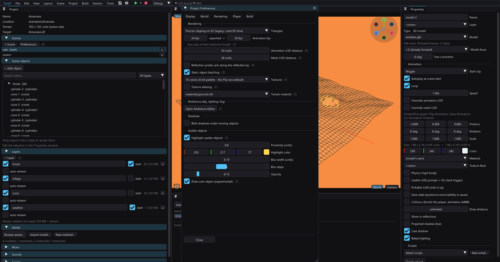

# Texture atlasing

Texture atlasing packs small material textures into shared **256×256 pages**
at build time — *Project > Preferences > Rendering > Texture atlasing*
(default off). The GS then keeps **one VRAM allocation (+~8 KB allocation
overhead) per page** instead of one per texture, and draw batches switch
textures less. On a scene decorated with many small props this reclaims real
VRAM — every resident texture costs its pixels *plus* the fixed allocation
overhead, and PS2-era prop textures are typically 32–128 px.

The boot log prints what was packed:
`Texture atlas: N textures in M page(s)`.

## What gets packed (conservative by design)

A texture joins a page only when **every consumer samples it with plain
0..1 UVs**:

- `map_Kd` textures of **static `.obj` models** whose textured submesh UVs
  stay within 0..1 (checked against the real mesh), and of **primitive
  objects** (box/sphere/cylinder/cone/plane — their generated UVs are 0..1
  by construction);
- baked size **≤128×128** (larger fills half a page alone — no sharing win);
- the reference is a **same-directory** `map_Kd` token (pages are grouped by
  the `.mtl`'s directory, so the rewritten reference never needs a `..`
  path over the PS2 host filesystem).

Excluded, and why:

- **terrain** base/layer textures — they tile (UVs far beyond 0..1);
- **emitters** — particle corner UVs are fixed inside the VU1 program;
- **decals / mirrors / portals** — separate ST paths (projected decals bake
  their STs host-side);
- **refl sphere maps** — STs are computed at runtime from normals;
- materials with a **tiling factor** (`map_Kd -s`);
- textures whose consumers carry a **per-asset quality override**
  (`textureQuality`) — a pinned quality is deliberate, and pages
  re-quantize as one image;
- HUD/menu/font sprites — separate 2D pipelines with their own bakes.

## How it works

`src/texatlas.cpp` computes a **deterministic plan** (eligibility, shelf
packing, page assignment) that both consumers reuse, so they can never
disagree within a build:

- **texbake** composites the member pixels into
  `.res-baked/<dir>/tyra-atlas-N.png` (each member keeps a 2-texel
  edge-dilated gutter, so bilinear filtering never reaches a neighbor),
  skips the members' individual baked PNGs, and **rewrites the baked
  `.mtl`**: `map_Kd` points at the page and a `# tyra-uvrect u0 v0 du dv`
  hint line follows. Sources in `res/` are never touched — the editor
  viewport keeps reading the originals.
- For **static models** the rect never reaches the console: the model bake
  multiplies it into the vertex UVs it writes to the `.tmdl`, per LOD level
  as well (see [model-pipeline.md](model-pipeline.md)). The hint line still
  goes into the baked `.mtl` for the material's other consumers, and the
  engine's `LeanObjLoader` still applies it on the fallback `.obj` path.
- `loadMtl` exposes the rect so the generated game's **primitive builders**
  remap their generated STs the same way (one multiply in `pushVert`).

Pages quantize **as one image**: a palettized project gets a shared
**256-color CLUT per page** (the era-authentic trade — sharing a palette is
how PS2 games did it; if a texture must keep its own palette, pin it with a
per-asset quality override and it stays out of the atlas), a full-color
project gets full-color pages.

## Notes

- The plan re-computes every build; adding/removing textures reshuffles
  pages safely (the baked `.mtl` rewrite and the pages always move
  together).
- **Texture hot reload** (docs/live-link.md) skips atlased textures — a
  repaint of a page member needs a rebuild (the editor detects the missing
  individual PNG in `bin/` and simply does nothing).
- `bin/` is additive across builds, so previously shipped individual PNGs
  may linger there after enabling the atlas; they are unreferenced. A clean
  rebuild (or deleting `bin/`) clears them.
