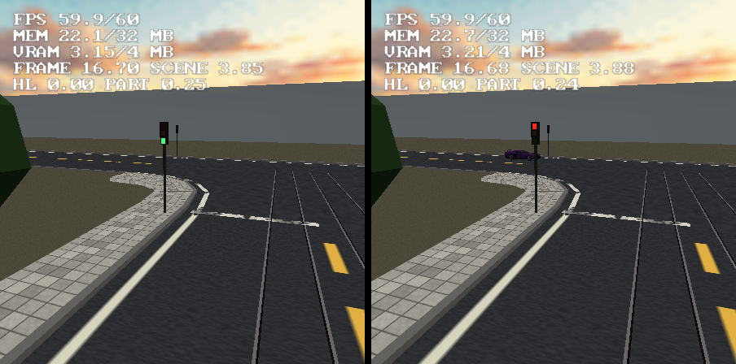
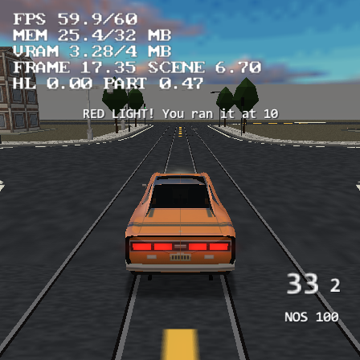

# Road traffic — AI cars that drive the road network

Road traffic fills a scene's roads with ambient AI cars that drive the lanes by
themselves, stop at the stop lines, give way to priority traffic, obey working
traffic lights, change lanes on multi-lane roads and switch their headlights on
at night. It is one project setting: no route to place, no waypoint to name.
The cars are ordinary vehicle instances of the project's own vehicle
definitions, driven by the same vehicle sim as the player's car.


## Turning it on

**Project > Preferences > World > Traffic** (saved as `settings.traffic`,
format 106, only the keys that differ from the defaults):

| setting | default | what it does |
|---|---|---|
| Ambient cars | 0 (off) | cars per scene with drivable roads; 0 generates nothing at all |
| Vehicles | every definition | the definitions the cars are drawn from, round robin |
| Spawn radius | 110 | cars live within this range of the player |
| Density | 1.5 | cars per 100 units of lane inside the radius (the count is capped by Ambient cars) |
| Lane speed | 11 units/s | the speed every lane is driven at, curves permitting |
| Green / Amber / All red | 12 / 3 / 2 s | one phase of the traffic lights |
| Left-hand traffic | off | lanes on the left of the direction of travel |
| Lane changes | on | multi-lane roads: move into the turn's lane, pass a stopped car (`laneChanges`, format 108) |
| Headlights at night | on | the cars light their lamps with the scene's night (`headlights`, format 108) |

Traffic lights come from the roads' **Street furniture**: a three- or four-way
node where any of its roads ticks **Traffic lights** gets a signal head on every
arm (docs/roads.md, "Street furniture"), and with traffic on those heads work.
A junction's own **Control** turns them on or off at that node alone (see
"Signals"). **View > Lanes** draws the lane graph over the viewport, and
`--road-lanes <projectDir> [scene]` prints it (see "Checking a network").

## The lane graph

`src/roadlanes.cpp` bakes the graph on the host from the road network, in the
same pass that builds the junction patches. Every consumer - the codegen, the
View > Lanes overlay, `--road-lanes`, `--vehicle-check` - calls the same
`roadlanes::build`.

- **Lanes.** A road is cut at its node arms' caps into stretches, and each
  stretch carries lanes both ways, offset from the centre line onto their side
  of the road. The lanes of one direction know their neighbours (`inner`
  toward the centre, `outer` toward the kerb) - what a lane change moves
  between. The lane count per direction is half the lanes of the road's
  generated texture recipe (`project::crossingRoads` reads the `.roadtex`; a
  4-lane texture gives 2 per direction), else one per 7 units of width. Lanes
  follow the drawn surface: the terrain plus the road's rank lift and road lift,
  and a bridge's deck elevation. Railways carry none; tram streets do.
- **Connections.** At every node, every lane arriving on an arm connects to the
  lanes leaving on the other arms: a cubic Bezier from the arriving lane's end
  to the leaving lane's start, tangent to both, inside the node's patch.
  Straight on keeps the lane index; the near-side turn (right in right-hand
  traffic) leaves from the kerb lane, the far-side turn from the centre lane.
  No turning back inside a node. Two roads joined end to end without a node
  join lane to lane; a loop with no node carries on into itself.
- **Priority** is `roadgen::giveWayArms` - the ONE give-way rule, the function
  `bakeMarkings` paints its stop lines from and the street furniture stands its
  signs by. A movement from an arm that gives way has rank 0 (1 if it is not a
  far-side turn); one from a priority arm 2 (3). Higher ranks go first.
- **Conflicts.** Two movements of one node conflict when their curves cross or
  come within 2.2 units of each other, unless they leave the same lane (that is
  a queue, not a conflict).
- **Signals.** A node is signalled by `roadfurn::nodeSignalled`, the furniture's
  own rule (see "Signals" below). The cycle is one slot per phase - green,
  amber, all red - each phase in turn, each node offset in the cycle so
  neighbours do not change together. Phases come from `roadfurn::signalPhase`:
  at a four-way node its arms are in angular order, so opposite arms share a
  phase (arm index % 2, two phases); at any other node every arm is a phase of
  its own (a T runs three).
- **Dead ends.** A lane reaching an open road end goes nowhere. The car stops at
  the end and is recycled once nobody is looking. (A U-turn at a dead end was
  tried and removed: a street one lane each way has no room for a car to turn
  in, and the host simulation found two cars inside each other on the bend.)
- **Overpasses** need nothing: no node is made where a road is more than 2
  units above another, so a deck's lanes simply pass over.

The points are thinned by Douglas-Peucker (0.25 across a lane, 0.2 on a curve
through a node; a point at least every 24 units).

## Signals

Which nodes have traffic lights, and how they cycle (a signal a car knocks
over - roads.md, "Breakable furniture" - loses its lit lens, and the node
keeps cycling):

- **Auto** (every node, unless overridden): a patch node of three or four arms -
  not a transition, not one a railway crosses - where any of its roads ticks
  Street furniture > **Traffic lights**. Before format 108 only four-way nodes
  were signalled; a road that already asked for lights now gets them at its T's
  too (the Motor District's Garage boulevard has two).
- **A T runs three phases**, one arm at a time: each approach gets its own
  green for all of its movements, so no two movements ever cross under the same
  green, and every movement gets green once per cycle (3 x (green + amber +
  all red); 51 s at the defaults). A four-way node keeps its two phases, the
  opposite arms together, with the far-side turn giving way to the oncoming
  stream.
- **The junction's Control** (select a junction's diamond in the viewport,
  saved as the override's `"control"`, format 108):

  | Control | what the node does |
  |---|---|
  | Auto | the rule above |
  | None | no lights and no signs; who gives way is still the stop lines' rule |
  | Traffic lights | lights whatever the roads ask (3+ arms; only in a scene whose roads carry street furniture, so the heads always stand where the lights work) |
  | Stop signs | a STOP sign at every arm that gives way, whatever the road's own sign setting |

  The panel prints what the node does now ("traffic lights, 3 phases").


- **Without lights, priority is `roadgen::giveWayArms`** - always. The Control
  only adds or removes lights and signs; it never moves a stop line, so the
  paint, the signs and the cars keep agreeing.
- **The heads** stand on every arm of a signalled node, facing its approach, and
  each shows its own arm's phase (`TRAFFIC_LAMPS` carries the phase, not the
  arm parity).

## Lane changes

On a road with two or more lanes each way the cars change lanes, for two
reasons:

- **To be in the right lane for a turn.** Entering a lane, a car picks WHICH
  movement it will make at the end of the stretch over everything the
  stretch's lanes offer (straight on three times as likely as either turn),
  then the lane nearest its own that offers it - a near-side turn leaves from
  the kerb lane, a far-side turn from the centre lane (`TfSim::route`). It
  changes lanes toward that one; until it gets there it carries on its own
  lane's way (straight on when there is one), so a change it never finds a gap
  for costs it the turn and never strands it. A single lane each way is
  exactly the old pick.
- **To pass** a car standing or crawling in its lane (under 45 % of the lane
  speed) that is not itself queueing - not waiting at a line, not close behind
  another car - or anything else standing in the lane (the player's car, a
  parked car). Behind such a car it stops 10 units back, not 2: the room to
  steer out round it from a standstill.

A change is safe by construction:

- **Only on a lane** (never inside a node), holding no junction reservation,
  3 s after the last change, and with room to finish the move before it has to
  brake for the line (blend + braking distance + 6 units).
- **A gap check** on the target lane (`TfSim::gapClear`): room ahead (more the
  faster it closes on the car there: 3 units + 2.5 s of closing speed) and
  behind (3 units + 0.6 s of the follower's speed + 2.5 s of ITS closing
  speed), over the cars on the lane, the cars moving into it, the cars coming
  onto it out of a node, and any obstacle standing on it.
- **A smooth blend**: the pursuit point is blended from the old lane onto the
  new one along 8 + 1 unit per unit/s of speed (at most 24; shorter when what
  it passes is closer), smoothstepped. The car is on both lanes meanwhile: it
  follows whatever is ahead in either, and a car moving into a lane is ahead of
  whoever is behind it there. It counts as done once the blend is covered and
  the body is within 0.7 of the new lane (or twice the blend, or its old lane
  about to end).
- **Far cars** (the cheap kinematic path) slide across along the same blend
  (`TfSim::pose`) instead of jumping.

## How it runs

There is no traffic code in a project that does not use it: the tables, the
core and the hooks are emitted only with Ambient cars above 0 (checked: the
check generates a project both ways).

- **The cars** are `Vehicle` objects the codegen APPENDS to every scene with
  drivable roads (`roadlanes::withTrafficCars`), so they get every table a
  placed car gets - the model, the wheel batch, the far tiers, damage, smoke.
  Their `VEHICLES` row carries `wpFirst -2`, their live-link id is 0 (Live Link
  neither patches nor hides them), and they are hidden until placed.
- **The tables** (`TRAFFIC_*` in `inc/scene_data.hpp`): per scene a run of
  segments - lanes, then connections - with their points, successors,
  conflicts, node signals and the signal heads' positions.
- **The core** is `src/traffic_core.inl`, ONE SOURCE in two homes (the road
  streaming core's arrangement): the editor compiles it for `--vehicle-check`,
  and the codegen pastes the same text into `TerrainGame`. It decides, per car
  and step, where the car is on its path, which way it goes at the next node
  (straight on three times as likely as a turn), whether it may enter the
  junction, and the three numbers it hands the vehicle sim - throttle, brake
  and steer, exactly the numbers the pad and the waypoint AI fill. Steering is
  pure pursuit of a point on the path ahead; speed is the lowest of the lane
  speed, every curve ahead braked down to, the stop line and the car ahead.
- **Junction admission.** Before its stop line a car asks: is the light red (or
  amber with room to stop)? Is a crossing movement already held by another car?
  Is there room on the exit lane (do not block the box)? Is a car with
  priority coming to a crossing movement within 3.5 seconds (gap acceptance)?
  If it may go, and it is the FIRST car in line, it reserves its movement until
  it leaves the node - a car queued behind it reserving too was what gridlocked
  the first simulation. A far-side turner waiting at the line may clear the
  junction on amber, when the oncoming stream has to stop.
- **Spawning.** Once a frame (`trafficFrame`, before the vehicle sub-steps) the
  ring recycles cars more than 1.25 x the radius from the player, cars stopped
  for 45 s and wrecks nobody sees, and places at most one new car on a lane
  between 0.4 and 1 x the radius, outside the camera's view cone and 14 units
  clear of every car, until the density target is met. With road streaming on
  the radius is held 20 units inside the stream radius and a car is placed only
  where `roadStreamReady` says the road is built; a car whose road is not built
  freezes like any other car nobody drives (docs/roads.md, "Road streaming").
- **Far cars** take the cheap path (`trafficKinematic`): beyond 30 units past
  their definition's traffic tier distance (45 at least) a traffic car skips
  the vehicle sim - tyres, suspension, walls - and slides along its lane at the
  speed the core's pedals ask for, glued to the lane's height. The far tier is
  drawing it by then. The full sim takes over as it comes near.
- **Traffic lights.** The built-in signal head's three lenses are baked unlit
  when the project runs traffic, and the console draws the lit one over them:
  one quad (both windings) per head within 95 units, in one untextured bag,
  rewritten only when a light changes or a head comes into reach. A head from
  a custom signal `.obj` gets the quad at the built-in head's lens positions.
- **The player** drives through it all as an obstacle the traffic queues
  behind (or passes, on a multi-lane road, when it stands still), and on foot
  is one too.
- **Running a red light.** The player's car crossing a stop line at a
  signalled node while its light is red is a log line (`TRAFFIC red light run N
  at node M speed V`) and bumps `ScriptContext::redLightRuns`, with the node and
  the car's speed beside it (`redLightNode`, `redLightSpeed`). The **On Red
  Light Run** flow node (Player category) fires on it: once per crossing, never
  for the ambient cars, its number output the speed in units/s. Its params
  filter by node (-1 = any; the numbers `--road-lanes` prints) and by a minimum
  speed. The Motor District shows it: Garage boulevard's graph puts "RED LIGHT!
  You ran it at N" on screen for 3 s (On Red Light Run -> Number To Text
  (formatted) -> Display Text). Every crossing of a signalled line by the
  player is also logged with its colour (`TRAFFIC player crossed the line at
  node M on green|amber|red`). The line is the one nearest the car across,
  within 4.5 units - a car straddling the centre line of a one-lane-each-way
  street crosses its lane's line too (the first version only looked 2.5 units
  either side of the lane, and missed exactly that car).

  
- **Headlights at night.** Every traffic car switches its lamps (the
  vehicle's own: lamp parts, the headlight pool, the coronas - docs/vehicles.md)
  with the night: the scene's day/night cycle with the sun under 2 degrees, or,
  for a cycle that does not run, the hour it is baked at (`TRAFFIC_NIGHT`,
  host-computed with the same rule). A scene with no cycle is day. One test a
  frame (`trafficNight`); the cars are rewritten only when it flips, and a car
  placed later takes the current state. A traffic car's lamps are lit with
  `lightsOn` 2: lamp parts and coronas, but NOT the projected headlight pool
  the player's car throws (a sixth hook in `renderVehicleGlow`) - six pools on
  moving cars cost 1.1-1.6 ms of render (see "What it costs").

`bin/log.txt` lines:

```
TRAFFIC scene 0 lanes 90 connections 188 points 1694 signals 5 lamps 18 cars 6
TRAFFIC cars 6/6 lane 1102 spawned 1 recycled 1 at a line 0 red runs 0 lane changes 0 overtakes 0 lights 0 clock 30 far 4 core us/frame 67 vehicles us/frame 616
```

The second line comes every 5 seconds: cars placed / the density target, lane
units inside the radius, cars placed and recycled since the last line, cars
waiting at a line, red runs, lane changes begun for a turn and to overtake
since the last line, whether the headlights are on, the signal clock, cars on
the far path, and the EE time of the traffic core and of the whole vehicle step
(every car, traffic or not) per frame.

## What it costs (PCSX2)

Motor District main scene, the camera frozen 16 units over the Garage
boulevard x Foundry link signals, NTSC, `interleavePasses` off, three
`--profile-frame` captures per arm (emulated EE timing, so rough):

| | MEM (HUD / MEMSTAT) | vehicle step | traffic core | profile `Total` | HUD FPS |
|---|---:|---:|---:|---:|---:|
| traffic off | 21.9 / 22.5 MB | - | - | 11.3-12.2 ms | 60 |
| 6 cars, every car simulated | 24.1 / 24.6 MB | 1.61-1.73 ms | 0.07 ms | 10.8-11.2 ms | 60 |
| 6 cars, far path (3-5 cars far) | 23.9 / 24.5 MB | 0.46-0.77 ms | 0.05-0.07 ms | 12.0-13.0 ms | 60 |

The render-cost `Total` moves with how many cars happen to be in view; the
same pose traffic-off reads 11.3-12.2, so it is within its own noise. A car is
about **0.37 MB of EE RAM** (its own vehicle geometry: dents and paint are per
car, so cars do not share a mesh), and a fully simulated car about 0.25 ms of
EE a frame - which is why the far path exists. The lane tables for the
district's three scenes are ~5 000 points.

**Headlights** (the same district at night - the `district-night` save value's
default 1 - the frozen walker at (14, -78) eye 16 over the Garage boulevard x
Foundry link signals, 6 cars, three `--profile-frame` captures per arm):

| | `Vehicle_lights` | `Vehicle_lamp_glow` | profile `Total` |
|---|---:|---:|---:|
| Headlights at night off | 0.14-0.15 ms | 0.14-0.20 ms | 14.1-15.1 ms |
| on, lamps + coronas (what ships) | 0.17-0.18 ms | 0.19-0.38 ms | 14.5-15.0 ms |
| on, with the projected pool per car (rejected) | 1.26-1.74 ms | 0.31-0.38 ms | 14.1-17.5 ms |

So the shipped headlights cost about 0.03 ms in `Vehicle_lights` and up to
~0.2 ms of corona sprites; the EE vehicle step and the traffic core did not move
(the TRAFFIC lines of the two arms are identical, frame for frame).

**Signals at the T's** add six signal heads to the district's furniture bake
(132 instances: 50 lamps, 58 trees, 6 signs, 18 signals - the two T's lose
their give-way signs) and nothing measurable to the core (57-64 us/frame against
the 50-70 the four-way-only version logged on the same pose).

**Lane changes** (Big City, a copy with 8 cars and the walker frozen over Grand
Avenue - two lanes each way - at (-586, -20)): the traffic core 101-107 us/frame
with Lane changes on and 101-107 with it off; `--profile-frame` `Total`
10.8-11.9 ms on, 11.1-12.9 ms off (one 28 ms capture off, a hitch). The log
counts a lane change every 10-15 s there (`lane changes 1`): the cars are
spread thin and Big City's four-way nodes have no lights, so changes come from
cars moving into their turn's lane. One-lane roads never run the code (the
lanes have no `inner`/`outer`).

Big City (1.4 km, 120 roads, roads streamed, tables on disk), the car at
spawn: 2 310 lanes and 4 710 connections, 56 800 points; the ELF grows from
5.10 to 6.20 MB (the tables, resident: the graph stays whole while the roads
stream) and the HUD MEM from 18.3 to 24.2 MB with 6 cars, 22.2 MB with the 4
the example ships; the vehicle step was 1.1-1.5 ms with 4 (most of it is the
driven car, which is always fully simulated).

## Checking a network

`--road-lanes <projectDir> [scene]` prints, per scene, the lanes and points,
the lane stretches per road, every node's movements (from which arm, the turn,
who gives way, the signal phase, how many movements each crosses), and the
warnings: dead ends, a stretch between two nodes, a lane that reaches a node
with no legal exit. It exits 1 on the last.

`--vehicle-check` "road traffic":

- a two-way street has a lane each way on its own side, mirrored under
  left-hand traffic; 14 units wide carries two each way; open ends are dead ends;
- a T: every lane into it has a legal exit (6 movements); the lane that stops is
  the lane the stop line is painted on; exactly the movements from a
  stop-lined arm give way; every turn curve stays inside the patch;
- a signalled crossing: 12 movements, the two phases are never green or amber
  together, and two movements that cross under the same green always have one
  that gives way;
- a host simulation: 10 cars on `vehiclesim::step`, driven by the console's
  core, for 300 s through the signalised crossing (recycled at the dead ends;
  a busy street end takes a car off the road until there is room): no two car
  bodies ever overlap, no car takes a movement on red, every car keeps passing
  the node (no deadlock), the cars stay within 1.5 units of their lanes, and
  nobody changes lanes on a one-lane road;
- a signalled T: three phases, never two moving at once, every movement green
  within one cycle (51 s at 12/3/2), the same simulation through it, and the
  unsignalled T giving way exactly by `roadgen::giveWayArms`;
- lane changes: a 2+2-lane signalled crossing (14-unit roads), 12 cars, one of
  them broken down in an approach's kerb lane 50 units before the node, 300 s:
  followers pass it (31 passes, 12 overtakes), turners move into their turn's
  lane (20 changes, near- and far-side turns both taken), no overlap, no entry
  on red, no deadlock (longest standstill 19 s), and a car mid-change is never
  more than 1.5 units outside the band between its two lanes. Swept by hand
  at 8, 12 and 16 cars with the breakdown 25, 50 and 75 units out, and on a
  21-unit (three lanes each way) road: all pass. The FIRST version passed this
  exact case and deadlocked in five of the other eight - see the traps below;
- the codegen: a traffic project gets the tables, the core and all six hooks
  (a streamed one too), the On Red Light Run node compiles to its count watch
  with the node and speed filters, the lanes' neighbours and the night table
  are in the tables, and traffic off generates none of it.

Traps the lane-change simulation found, kept here so they are not re-learned:

- **A car that starts a change too close behind what it passes cannot steer
  out**: a car turns only as it rolls, so one stopped 2 units behind a
  breakdown is stuck there for good. It stops 10 back instead, the blend is
  never longer than the room ahead, and in a change the car in the old lane
  only blocks while the two would touch side by side (half widths, `halfW`).
- **Done is not "the blend is covered"**: a slow car lags its pursuit point,
  and switching lanes 1.2 units short of the new lane put it on the wrong
  lane's arc. It needs the body within 0.7 of the lane too.
- **A breakdown near the line was "queueing"**: the first `passable` asked for
  25 units of lane left, so a car stopped 25 before a node was queued behind
  forever.

## Limits

- Lane changes happen only on a lane stretch with room to finish before the
  line; a car never changes lanes inside a node, never merges where a road
  narrows (a lane that ends at a transition node has no exit of its own), and
  nobody makes room for a car that wants to come in.
- On a one-lane road a parked car still holds the queue until it is recycled
  (45 s, out of view); traffic does not yield to pedestrians beyond queuing
  behind a player standing in its lane.
- A T's three phases give each arm its own green - safe and simple, slower
  than a plan where the through road's two straight movements share one.
  Five-way and larger nodes are signalled only by a junction's Control
  (Traffic lights), one phase per arm; no protected left-turn phase at a
  four-way node, no green wave (the per-node offsets are arbitrary).
- The lit lens sits at the built-in signal head's lens positions, also on a
  custom signal model. The editor viewport shows the built-in head with all
  three lenses lit.
- Traffic cars' headlights light the lamps and coronas but throw no pool of
  light on the road.
- Not measured on a physical PS2.
