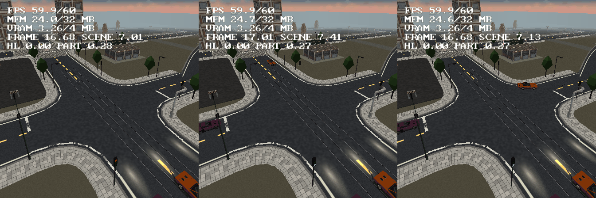

# Road traffic — AI cars that drive the road network

Road traffic fills a scene's roads with ambient AI cars that drive the lanes by
themselves, stop at the stop lines, give way to priority traffic and obey
working traffic lights. It is one project setting: no route to place, no
waypoint to name. The cars are ordinary vehicle instances of the project's own
vehicle definitions, driven by the same vehicle sim as the player's car.



## Turning it on

**Project > Preferences > World > Traffic** (saved as `settings.traffic`,
format 106, only the keys that differ from the defaults):

| setting | default | what it does |
|---|---|---|
| Ambient cars | 0 (off) | cars per scene with drivable roads; 0 generates nothing at all |
| Vehicles | every definition | the definitions the cars are drawn from, round robin |
| Spawn radius | 110 | cars live within this range of the player |
| Density | 1.5 | cars per 100 units of lane inside the radius (the count is capped by Ambient cars) |
| Lane speed | 11 units/s | the speed every lane is driven at, curves permitting |
| Green / Amber / All red | 12 / 3 / 2 s | one phase of the traffic lights |
| Left-hand traffic | off | lanes on the left of the direction of travel |

Traffic lights come from the roads' **Street furniture**: a four-way node where
any of its roads ticks **Traffic lights** gets a signal head on every arm
(docs/roads.md, "Street furniture"), and with traffic on those heads work.
**View > Lanes** draws the lane graph over the viewport, and `--road-lanes
<projectDir> [scene]` prints it (see "Checking a network").

## The lane graph

`src/roadlanes.cpp` bakes the graph on the host from the road network, in the
same pass that builds the junction patches. Every consumer - the codegen, the
View > Lanes overlay, `--road-lanes`, `--vehicle-check` - calls the same
`roadlanes::build`.

- **Lanes.** A road is cut at its node arms' caps into stretches, and each
  stretch carries lanes both ways, offset from the centre line onto their side
  of the road. The lane count per direction is half the lanes of the road's
  generated texture recipe (`project::crossingRoads` reads the `.roadtex`; a
  4-lane texture gives 2 per direction), else one per 7 units of width. Lanes
  follow the drawn surface: the terrain plus the road's rank lift and road lift,
  and a bridge's deck elevation. Railways carry none; tram streets do.
- **Connections.** At every node, every lane arriving on an arm connects to the
  lanes leaving on the other arms: a cubic Bezier from the arriving lane's end
  to the leaving lane's start, tangent to both, inside the node's patch.
  Straight on keeps the lane index; the near-side turn (right in right-hand
  traffic) leaves from the kerb lane, the far-side turn from the centre lane.
  No turning back inside a node. Two roads joined end to end without a node
  join lane to lane; a loop with no node carries on into itself.
- **Priority** is `roadgen::giveWayArms` - the ONE give-way rule, the function
  `bakeMarkings` paints its stop lines from and the street furniture stands its
  signs by. A movement from an arm that gives way has rank 0 (1 if it is not a
  far-side turn); one from a priority arm 2 (3). Higher ranks go first.
- **Conflicts.** Two movements of one node conflict when their curves cross or
  come within 2.2 units of each other, unless they leave the same lane (that is
  a queue, not a conflict).
- **Signals.** A node is signalled by `roadfurn::nodeSignalled`, the furniture's
  own rule. Its arms are in angular order, so opposite arms share a phase
  (arm index % 2): phase A is green, amber, all red, then phase B the same, each
  node offset in the cycle so neighbours do not change together.
- **Dead ends.** A lane reaching an open road end goes nowhere. The car stops at
  the end and is recycled once nobody is looking. (A U-turn at a dead end was
  tried and removed: a street one lane each way has no room for a car to turn
  in, and the host simulation found two cars inside each other on the bend.)
- **Overpasses** need nothing: no node is made where a road is more than 2
  units above another, so a deck's lanes simply pass over.

The points are thinned by Douglas-Peucker (0.25 across a lane, 0.2 on a curve
through a node; a point at least every 24 units).

## How it runs

There is no traffic code in a project that does not use it: the tables, the
core and the hooks are emitted only with Ambient cars above 0 (checked: the
check generates a project both ways).

- **The cars** are `Vehicle` objects the codegen APPENDS to every scene with
  drivable roads (`roadlanes::withTrafficCars`), so they get every table a
  placed car gets - the model, the wheel batch, the far tiers, damage, smoke.
  Their `VEHICLES` row carries `wpFirst -2`, their live-link id is 0 (Live Link
  neither patches nor hides them), and they are hidden until placed.
- **The tables** (`TRAFFIC_*` in `inc/scene_data.hpp`): per scene a run of
  segments - lanes, then connections - with their points, successors,
  conflicts, node signals and the signal heads' positions.
- **The core** is `src/traffic_core.inl`, ONE SOURCE in two homes (the road
  streaming core's arrangement): the editor compiles it for `--vehicle-check`,
  and the codegen pastes the same text into `TerrainGame`. It decides, per car
  and step, where the car is on its path, which way it goes at the next node
  (straight on three times as likely as a turn), whether it may enter the
  junction, and the three numbers it hands the vehicle sim - throttle, brake
  and steer, exactly the numbers the pad and the waypoint AI fill. Steering is
  pure pursuit of a point on the path ahead; speed is the lowest of the lane
  speed, every curve ahead braked down to, the stop line and the car ahead.
- **Junction admission.** Before its stop line a car asks: is the light red (or
  amber with room to stop)? Is a crossing movement already held by another car?
  Is there room on the exit lane (do not block the box)? Is a car with
  priority coming to a crossing movement within 3.5 seconds (gap acceptance)?
  If it may go, and it is the FIRST car in line, it reserves its movement until
  it leaves the node - a car queued behind it reserving too was what gridlocked
  the first simulation. A far-side turner waiting at the line may clear the
  junction on amber, when the oncoming stream has to stop.
- **Spawning.** Once a frame (`trafficFrame`, before the vehicle sub-steps) the
  ring recycles cars more than 1.25 x the radius from the player, cars stopped
  for 45 s and wrecks nobody sees, and places at most one new car on a lane
  between 0.4 and 1 x the radius, outside the camera's view cone and 14 units
  clear of every car, until the density target is met. With road streaming on
  the radius is held 20 units inside the stream radius and a car is placed only
  where `roadStreamReady` says the road is built; a car whose road is not built
  freezes like any other car nobody drives (docs/roads.md, "Road streaming").
- **Far cars** take the cheap path (`trafficKinematic`): beyond 30 units past
  their definition's traffic tier distance (45 at least) a traffic car skips
  the vehicle sim - tyres, suspension, walls - and slides along its lane at the
  speed the core's pedals ask for, glued to the lane's height. The far tier is
  drawing it by then. The full sim takes over as it comes near.
- **Traffic lights.** The built-in signal head's three lenses are baked unlit
  when the project runs traffic, and the console draws the lit one over them:
  one quad (both windings) per head within 95 units, in one untextured bag,
  rewritten only when a light changes or a head comes into reach. A head from
  a custom signal `.obj` gets the quad at the built-in head's lens positions.
- **The player** drives through it all as an obstacle the traffic queues
  behind, and on foot is one too. Running a red light is a log line
  (`TRAFFIC red light run N at node M`); there is no flow node for it yet.

`bin/log.txt` lines:

```
TRAFFIC scene 0 lanes 90 connections 188 points 1694 signals 3 lamps 12 cars 6
TRAFFIC cars 6/6 lane 1102 spawned 1 recycled 1 at a line 0 red runs 0 clock 30 far 4 core us/frame 67 vehicles us/frame 616
```

The second line comes every 5 seconds: cars placed / the density target, lane
units inside the radius, cars placed and recycled since the last line, cars
waiting at a line, red runs, the signal clock, cars on the far path, and the EE
time of the traffic core and of the whole vehicle step (every car, traffic or
not) per frame.

## What it costs (PCSX2)

Motor District main scene, the camera frozen 16 units over the Garage
boulevard x Foundry link signals, NTSC, `interleavePasses` off, three
`--profile-frame` captures per arm (emulated EE timing, so rough):

| | MEM (HUD / MEMSTAT) | vehicle step | traffic core | profile `Total` | HUD FPS |
|---|---:|---:|---:|---:|---:|
| traffic off | 21.9 / 22.5 MB | - | - | 11.3-12.2 ms | 60 |
| 6 cars, every car simulated | 24.1 / 24.6 MB | 1.61-1.73 ms | 0.07 ms | 10.8-11.2 ms | 60 |
| 6 cars, far path (3-5 cars far) | 23.9 / 24.5 MB | 0.46-0.77 ms | 0.05-0.07 ms | 12.0-13.0 ms | 60 |

The render-cost `Total` moves with how many cars happen to be in view; the
same pose traffic-off reads 11.3-12.2, so it is within its own noise. A car is
about **0.37 MB of EE RAM** (its own vehicle geometry: dents and paint are per
car, so cars do not share a mesh), and a fully simulated car about 0.25 ms of
EE a frame - which is why the far path exists. The lane tables for the
district's three scenes are ~5 000 points.

Big City (1.4 km, 120 roads, roads streamed, tables on disk), the car at
spawn: 2 310 lanes and 4 710 connections, 56 800 points; the ELF grows from
5.10 to 6.20 MB (the tables, resident: the graph stays whole while the roads
stream) and the HUD MEM from 18.3 to 24.2 MB with 6 cars, 22.2 MB with the 4
the example ships; the vehicle step was 1.1-1.5 ms with 4 (most of it is the
driven car, which is always fully simulated).

## Checking a network

`--road-lanes <projectDir> [scene]` prints, per scene, the lanes and points,
the lane stretches per road, every node's movements (from which arm, the turn,
who gives way, the signal phase, how many movements each crosses), and the
warnings: dead ends, a stretch between two nodes, a lane that reaches a node
with no legal exit. It exits 1 on the last.

`--vehicle-check` "road traffic":

- a two-way street has a lane each way on its own side, mirrored under
  left-hand traffic; 14 units wide carries two each way; open ends are dead ends;
- a T: every lane into it has a legal exit (6 movements); the lane that stops is
  the lane the stop line is painted on; exactly the movements from a
  stop-lined arm give way; every turn curve stays inside the patch;
- a signalled crossing: 12 movements, the two phases are never green or amber
  together, and two movements that cross under the same green always have one
  that gives way;
- a host simulation: 10 cars on `vehiclesim::step`, driven by the console's
  core, for 300 s through the signalised crossing (recycled at the dead ends):
  no two car bodies ever overlap, no car takes a movement on red, every car
  keeps passing the node (no deadlock), and the cars stay within 1.5 units of
  their lanes;
- the codegen: a traffic project gets the tables, the core and all five hooks
  (a streamed one too), and traffic off generates none of it.

## Limits

- No lane changes: a car keeps its lane index from node to node.
- Traffic does not yield to pedestrians beyond queuing behind a player standing
  in its lane; a parked car in a lane holds the queue until the car is recycled
  (45 s, out of view).
- Only four-way nodes are signalled (the furniture's rule); every other node
  runs on priority.
- The lit lens sits at the built-in signal head's lens positions, also on a
  custom signal model. The editor viewport shows the built-in head with all
  three lenses lit.
- Traffic cars never turn their headlights on.
- Not measured on a physical PS2.
