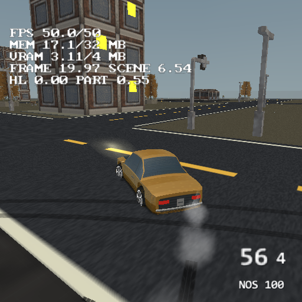

# Vehicles

Driveable cars: one authored model in, a vehicle definition you place in as many
scenes as you like out. The player walks up to one, presses USE and drives it.

This page is the contract between the four pieces: the import bake, the drive
model, the editor's Vehicle Editor, and the generated PS2 runtime.

## The constraint everything here is shaped by

A PS2 StaPip submit costs **~0.7–1.5 ms of fixed EE time whatever it holds**, and
a PAL frame is 20 ms. So the question "how many draw calls is a car" decides
whether vehicles are a feature or a demo. The answer this design reaches is
**two per vehicle**:

| | submits |
|---|---|
| body | 1 — a `.tmdl` drawn through `objMat`, so VU1 applies the motion and the EE does no per-vertex work at all |
| wheels | 1 per definition — all four merged into a shared bag, rebuilt in world space each frame; different definitions keep their own texture |

Two opt-ins add one each, and the Cost tab counts them: *Body shine* splits
the matte trim off the paint (reflection is per part), and lamp materials
become one fullbright `lamps` part the runtime recolours per instance. The
reference car with both is **four**.

Each placed vehicle also has **Properties > Rendering > Dynamic shadow**:
**Projected silhouette** is the higher-quality choice for the player's car,
while **Blob** is the low-cost choice for AI traffic. The selection belongs to
the placed instance, not the shared vehicle definition, so one CC96 can be the
projected hero and twenty CC96 rivals can use blobs. Both use the imported
body's actual bounds for their footprint/framing and follow player-driven and
AI-driven transforms. The import writes a soft 128×128 top-down body mask next
to the `.tmdl` files; Blob rotates that mask with the car on a single
terrain-conforming quad. See [shadows.md](shadows.md) for the four projected-slot
budget and the project-default behaviour.

The wheel batch composes spin, steering, body attitude and instance scale into
three matrix columns **once per wheel**. Each vertex then needs only a matrix
multiply and translation; no per-vertex trigonometry. Geometry, UVs and the
number of submits are unchanged.

The live positions are the only wheel data rebuilt each frame. Each definition
owns persistent position, colour and UV runs: colours and UVs are filled only
when a newly visible instance extends the batch, and the separate buffers stay
alive until the scene unloads because an earlier PATH1 DMA may still read them
while another definition is prepared. Before any wheel trig or vertex work, a
conservative rig box is checked against the active view. It includes the full
wheel mesh radius, track, wheelbase, suspension travel and every steer/spin/
body-attitude rotation. The wheel pass also follows the body's active,
visibility, draw-distance and split-band gates. Therefore a camera, split half
or secondary view may do less CPU work without changing the visible wheel set.

The opaque wheel pass runs after the body loop. Z testing keeps the image and
draw order intact, while the live wheel gate reads the body LOD selected for
that same view, so a transition cannot draw both the baked and live wheels.
Debug render-cost captures report this work as a separate `Wheels` row rather
than folding it into the scene total.

Rebuilding four wheels' worth of vertices per frame on the EE sounds expensive,
and this page used to say it was not — "a few hundred vertices, VU0 macro-mode
work measured in microseconds against the millisecond a second submit would
cost". **That was never measured, and when it finally was it was wrong by three
orders of magnitude**: the render-submission attribution priced the rebake at
**1.970 ms a frame**, a seventh of the Motor District's whole render submission
(docs/render-submission-attribution.md). The estimate was wrong about *what*
the work is, not only how much — the dominant term was never the per-vertex
multiply at all but the trigonometry around it, recomputed four times per car.
The trade-off the paragraph describes still holds; what does not hold is that
the price of it is negligible. What it actually costs, and what it costs now,
is [wheel-rebake-skip.md](wheel-rebake-skip.md). The batch is no longer
rebuilt for a rig whose inputs did not move, and it no longer bumps its
`bboxVersion` when its vertices are byte-identical.

This is the static-batching trade-off run in the opposite direction — batching
merges to avoid submits, and so does this; it just does it every frame for the
members that moved.

Distant vehicles drop their wheel bag by baking the wheels into the body
mesh: the paint part's two ordinary distance tiers each carry the four wheels
at their rest anchors, hard-decimated, and past *Far tier from* (Cost tab,
`farDistance`, default 40 units) the body swaps to that tier while
`renderVehicleWheels` stops submitting the wheel bag. The matte trim tiers
itself and the lamps stay tier 0 (their corner ranges must not be reordered),
and those parts are clamped to their own tier count by the runtime — so at
distance the car is its paint with wheels in, plus the lamps. The wheels can
ride a tier only when they sample the paint's own texture (or both are palette
cars); a car whose paint is an atlas and whose wheels are palette colours — the
Ravager — gets no carrier, and the bake says so (`no far tier carries the
wheels`). That is what [an authored far model](#an-authored-far-model-1134)
is for. The tier is picked per car by `vehicleLodTier` (1.134.0), not by the
row's `meshLod`: entered at the distance, left at 0.9 of it.

**Two bugs this had until 1.134.0.** The wheel bag decided "the far tier is
showing" from `parts[0]`, and on every car with lamps `parts[0]` IS the lamps,
which never tier: every far tier drew a second set of wheels through its
baked-in ones, and saved nothing. The bake now measures the carrying part
(`farPart`, adopted like `lampPart`) and the bag reads that. And `applyGeoLod`
left a stripped body's `StaPipBag::stripped` set when it bound a tier's LIST,
so a strip-baked body (the CC96 since 1.117.4) drew its far tier as a strip.
Both were found by reading the code, not by seeing them: neither shows in the
editor, and at the default 48 units the car is a few pixels. Setting
`farDistance` to 3 on a scratch copy puts the driven car on its far tier; that
is the fixture the fixed build was checked on (one set of wheels, no spikes). What made this possible: matrix-path
objects were excluded from LOD outright, because a tier was baked in WORLD
space at first use and a mover would have carried a stale copy; a tier is now
baked LOCAL for a `matrixMode` object (exactly as its tier 0 was at
promotion) and a rebuild already drops every tier, so the exclusion is gone
for every fast-path mover, not only cars. `VEHAI ... lod N` reports the tier
a rival is showing, which is how the switch is checked without eyes; the old
"no wheels past 70 units" rule stays as the floor for a definition that sets
the distance to 0.

## Importing a model

**One file.** A car arrives from Blender, Sketchfab or a kitbash pack as a single
`.glb`/`.fbx` with the wheels as separate nodes inside it, and that is what the
importer takes. Asking an author to export the body and each wheel separately,
with the origin in the hub, is 20 minutes of work per vehicle and the first
thing anybody gets wrong.

### How the wheels are found

Not by name. The reference asset this was built against
(`CC96/car1.fbx`, CC0) names its nodes `Cube`, `Cylinder`, `Cylinder.001`,
`Cylinder.002`, `Cylinder.003` — Blender defaults — so a name-matching importer
would have failed on the very first real model. Geometry decides, and the text
is only ever a bonus:

1. **Cluster mesh nodes by shape.** Nodes whose AABB extents agree within 10%
   are candidates for being the same part repeated. Grouping on size rather than
   on vertex count is deliberate: a car whose front and rear rims are different
   meshes is still a car.
2. **Score each cluster of 2, 4 or 6.** Round (the two non-axle extents match),
   thin (narrower across the axle than tall), low in the model, small relative
   to it, all the same mesh — plus a bonus if a name or material says *wheel*,
   *tyre*, *rim*. Below a threshold nothing is reported rather than four wheels
   being invented.
3. **Derive the vehicle's frame from the cluster itself.** The axle is the axis a
   wheel is *thinnest* along. Of the two remaining axes, the one the wheel
   centres barely spread along is up (they all sit on the ground) and the other
   is forward. **No exporter axis metadata is read at any point** — Blender, Maya
   and Max disagree about it, and four wheels do not.

That yields the wheelbase, the track and the wheel radius as measurements, so
the author types no numbers to get a working vehicle.

**The body is re-origined to the axle centre at hub height** — the mean of the
detected wheel centres in the canonical frame. The sim places its wheel anchors
at ±wheelBase/2 and ±track/2 around the *chassis origin*, so a body that kept
the exporter's own pivot put every wheel wherever that pivot happened to be:
the reference car's origin sat 0.25 behind the axle midpoint and all four
wheels rode visibly forward of their arches. With the origin at hub height,
`rideHeight = wheelRadius` puts the tyres exactly on the ground.

**What it cannot decide is which end is the nose.** If a node or material says
`front`/`rear` that wins; otherwise the shorter body overhang past an axle is
assumed to be the front, the assumption is stated with both overhang figures,
and the Vehicle Editor offers a flip. A car driving backwards is the most likely
wrong answer the importer can produce and it is never silent.

### Why the bake merges materials

The reference car has **40 materials**, 36 of which become mesh parts — and a
`.tmdl` part is one bag, so the model as authored is **36 submits, nearly two PAL
frames for one parked car**.

The fix rests on a property of the baked lighting path: `pushVert` folds a
material's `kd` into the *vertex colours*, so colour does not have to be a
per-bag state. Untextured materials can therefore be merged losslessly — the
bake collects every untextured material of a model into ONE part, writes each
distinct colour into a generated **palette texture**, and points that material's
vertices at its own cell.

The palette is a **one-dimensional strip**: each colour owns a full-height
column 8 px wide, and every UV sits at `v = 0.5`. It began as a 2-D grid of
blocks and that was a mistake worth recording, because a grid makes the colour
depend on the V coordinate — and V's origin is a *convention*, top-left in the
image file, bottom-left in GL, flipped again somewhere in the console path. A
strip has no row to be off by, so no V convention can select the wrong colour.
The columns are 8 px rather than 1 because the GS quantises texture coordinates
to 12.4 fixed point and filters bilinearly, which would bleed a one-pixel cell's
neighbours into the model at some camera distances. Cells are keyed on the
**colour**, not the material name, so twelve materials sharing six colours cost
six columns; 16 colours still fit in a 128×8 strip, i.e. 4 KB.

Textured materials always keep their own part — they have real UVs that cannot
be rewritten.

Measured on the reference car: **36 parts → 2, and 40 materials → 10 palette
colours in a 128×8 strip.**

### Triangle budgets

PS2-era cars are 1–3k triangles; the reference asset is 8780. The bake decimates
through `meshlod` (the same quadric-error collapse both model bakes already
use) toward a per-vehicle budget — body 2400, wheel 700 by default. The old
1500-body default was too aggressive for curved fenders and sloped glass at the
camera distances used by a driving game; existing definitions keep their
authored value, while new imports and the vehicle playground use the rounder
2400-triangle baseline. The QEM wrapper converts that triangle budget through
the source part's measured triangle/vertex ratio. Its previous hard-coded
closed-manifold ratio made a requested 2400-triangle multi-material body land
at only 1256, which is why the slider removed far more shape than its label
promised.

The wheel budget is much higher than a PS2 wheel would suggest because a wheel is
several materials, and meshlod **locks material seams**, so the collapse cannot
thin the rim without eating its roundness. Measured: at a 200-triangle budget the
silhouette lost **21% of its radius**; at 700 it loses 2%.

**The wheel radius the simulation uses is measured from the BAKED wheel, never
from the source.** A collapse pulls a round silhouette inward, and a car whose
physics rides on a 0.240 radius while a 0.190 wheel is drawn floats above the
road with its wheels spinning at the wrong rate. The bake corrects the figure and
says so in the panel whenever the shrink exceeds 5%.

## The drive model

A kinematic chassis on four height samples, not a rigid-body solver — the
era-correct arrangement and the only one that fits the EE budget beside
everything else a scene does.

- **Steering** is the bicycle model: `yawRate = speed / wheelBase * tan(steer)`.
  The turn radius therefore follows from the wheelbase, so a long vehicle turns
  wide with no second knob. Verified against its own closed form by measuring
  path length per radian of yaw off the trajectory: **5.244 m measured vs 5.115 m
  predicted, 2.5% apart**, the remainder being real lateral slip.
- **The steering lock shrinks with speed.** Without it a full-lock flick at top
  speed spins the car on the spot, and a d-pad — which always reads full
  deflection — makes the vehicle undriveable rather than merely twitchy.
- **Grip is one number.** Yawing the body does not yaw the velocity; the
  difference *is* the sideways slip, and grip is the cap on how fast the tyres
  kill it. Low slides, high is on rails, and `handbrakeGrip` replaces it while
  the handbrake is held — that is the entire drift knob.
- **Walls are eight sample points** — the four corners of the BODY rectangle
  (the wheelbase plus `bodyOverhang`, the bumpers' reach past the axles,
  measured off the baked body — the axle rectangle alone let the bonnet clip
  a bumper's length into any wall) plus the edge midpoints — through the
  runtime's own collider set (object boxes, generated
  prefab boxes, and mesh props), axis-separated so a glancing hit grinds and
  only a head-on stops. Corners alone let anything narrower than the corner
  spacing — a pillar, a post, a thin wall hit end-on — pass *between* the
  samples and sit inside the car. Two rules keep the overlapped case honest:
  a car already overlapping (a swept corner, an old save) may only move AWAY
  from the centroid of its blocked points (count comparisons fail here in
  both flavours — "no deeper" tunnels thin walls, "strictly fewer" deadlocks
  the escape), and an OBJECT floor rising more than half a unit over the
  car's feet blocks even where the on-foot walker would climb it, because a
  car reads its height from the terrain alone and a "walkable" mesh face was
  a door into the prop's inside. The colliders are gathered ONCE per vehicle
  per frame (the trig lives in the gather, the eight points cost multiplies),
  and the host twin holds all of it as `--vehicle-check` properties: pillar,
  overlapped, thin wall.
- **Car vs car is MOMENTUM, not a wall** (runtime-only, the
  solid()/collidePlayer split again — the editor's test drive has one car).
  Each body is two discs on its forward axis (a capsule: long like a car,
  cheap like a circle); the deepest overlapping pair defines the contact,
  and the response has two modes. A closing hit exchanges velocity along the
  contact normal with the authored `mass`es and 0.35 restitution — a thump
  with a bit of bounce, both cars keep moving ("nieklimatyczne jeb i oba
  stoją" is the wall answer this replaces). A *resting* contact instead
  velocity-matches the pair along the normal (momentum-conserving, e = 0),
  because the bouncy impulse plus full per-frame separation acted as glue
  and stalled a pusher nose-to-tail with the gas held — bumper against
  bumper now bulldozes traffic, the era's shove. Separation resolves 60% of
  the penetration per frame, inverse-mass weighted, and both bodies' matrix
  paths are told they moved.
- **Car vs PHYSICS BODY is a shove, not a wall** (runtime-only, like car vs
  car). The collider gather sets physics bodies aside instead of listing them
  as walls, and after the wall pass every body whose footprint reaches the
  car's body rectangle takes a velocity kick — along the car's motion plus a
  radial component off its centre, scaled by the frame's travel and divided
  by the body's mass, the player shove's own arithmetic (`PHYS_PUSH`) — with a
  small upward kick, because a crate that tumbles is the look and one that
  slides is not. The car scrubs speed by body mass over its own: a 0.6 crate
  against a 12 car is nothing, a heavy barrel a thump. `restFrames = 0` wakes
  a sleeping body; the physics pass then moves it and resolves it out of the
  car's own collision box.
- **The AI driver un-sticks itself.** Pure pursuit has no obstacle avoidance,
  so a pillar on the racing line parks the rival against itself forever the
  moment walls actually hold. Throttle held for over a second with no motion
  reads as wedged: the car backs out for a second, advances its waypoint so
  it aims past the obstacle, and resumes.
- **Ground contact is four height samples** under the wheel anchors — each
  the MAX of the terrain and any object floor there (a box top within half a
  unit of the car's feet, a mesh prop's walkable face), so a car drives ONTO
  platforms and ramp props instead of nosing into their sides. Per wheel, so
  a car half on a platform tilts; drive off the edge and the ordinary
  airborne drop takes over. The editor's test drive stays terrain-only — the
  twins share the formulas, the height *source* is each side's own, exactly
  like the wall test's solid()/collidePlayer split. They give
  the ride height, the pitch and the roll from one query each, which is what
  makes a heightfield vehicle affordable at all. A scene with no terrain answers
  `TERRAIN_VOID_Y`, so "there is no floor" needs no branch of its own.
- **Contact orientation is local to the car.** Pitch and roll are applied
  before heading. `vehiclesim::bodyRotation` and the generated
  `vehBodyRotation` convert that frame to the ordinary renderer's XYZ Euler
  convention; both body and wheels use it. The plane fit uses the actual
  projected wheel spacing. Applying roll around world Z made a bank behave
  differently after turning, and reversed the tilt at some headings.
  Missing terrain samples are excluded from the mean and neutralized in the
  fit, never averaged as kilometre-deep ground. No valid sample means airborne.
- **The body is a SPRUNG RIG.** Height, pitch and roll are damped
  second-order springs pulled toward the terrain-derived targets (heave
  wn 14 rad/s at 0.9 of critical with translation-over-slope feed-forward;
  attitude wn 11 at 0.8, softly overshooting a crest;
  airborne both glide level at wn 4). The body used to SNAP to the plane
  while a rate-limited attitude hung mid-swing over every ridge — the mean
  of four samples jumps across a crest, so the body teleported vertically
  while the wheels rode their own samples — and every "car breaks apart on
  a bump" report was that one seam. A landing now compresses and rebounds
  once (the fall speed is kept and absorbed, never zeroed in a frame), a
  cliff-base slam bottoms out on a hard floor one travel below the plane,
  and **grounded has slack** (a third of the ride height), because the
  binary test flickered over every bump and each flicker dropped the
  steering and the tyres for a frame. Held as a `--vehicle-check` property:
  full throttle across a washboard of sharp ridges keeps the per-frame
  height step under 0.3, the attitude sane and the pace up.
  Heave uses an implicit step throughout the accepted 0–50 ms interval.
  The six body-clearance probes impose a position floor only: they cannot
  raise the spring target or feed a height derivative back as launch velocity.
  The old derivative gave a stationary bumper on a raised patch 5.46 units/s
  upward with alternating 50/8.33 ms steps. Regression checks cover that case,
  partial terrain support, and bank alignment at six headings and 20–120 Hz.
- **The four wheels are an analytic rig, not IK.** Each hardpoint is transformed
  by the chassis' full pitch/yaw/roll attitude, then its suspension displacement
  runs along the transformed chassis-up axis. The separately batched wheel mesh
  gets spin, steering and that same full body attitude in the same order. The
  previous runtime transformed body vertices in all three axes but placed wheel
  X/Z with yaw only; on a crest the wheel arch and wheel were literally in two
  different coordinate frames. Six extra terrain probes under the front and
  rear body overhangs now provide a hard clearance floor, so a valid four-tyre
  contact plane cannot put the bonnet or bumper through a sharp crest.
- **Suspension compression is presentation**, derived from each wheel's ground
  height against the *tilted* chassis plane — the residual the pitch and roll do
  not already express. On the console each hub aims for one radius above its own
  sampled ground, solved along chassis-up and clamped **asymmetrically** — 45% of
  `suspensionTravel` in droop, while upward travel is capped by both 10% of
  suspension travel and 6% of tyre radius. The old 30% travel-only cap let a
  scaled hub move roughly 23% of its radius into the vehicle playground's tight
  arch.
  A kerb still shoves a wheel up into the arch and a crest still shows daylight
  under a tyre, but a wheel hanging a whole travel below the body read as
  falling off the car, which is exactly how it was reported. The
  **weight-transfer lean moves the wheel clamp WITH the body**: squat, dive and
  corner roll are cosmetic — no ground caused them — so a leaning body over
  ground-stuck wheels opened daylight at the arches on flat ground (4° of squat
  over the front overhang is ~0.11 units of gap). Each hub adds the body
  plane's fully rotated offset at its own anchor; the tyre still starts from
  its own ground sample, and only the arch-safe clamp corrects it. The editor
  preview uses the same hardpoint-plus-body-up construction. Measured against
  the mean instead, a constant slope reads
  as fully compressed at one axle and fully extended at the other while the body
  is in fact riding it level. Driving one wheel over a kerb gives
  `[0.40 0.60 0.60 0.40]`: the diagonal racking four springs actually produce.

- **Budgeted vehicle meshes keep their curves.** A body or wheel that exceeds
  its triangle budget still goes through the same QEM collapse, but the vehicle
  bake now rebuilds crease-aware normals afterwards. Faces within 55 degrees
  share their lighting; sharper bonnet, glass and panel edges remain split.
  This removes the folded-cardboard look from curved fenders and tyres without
  increasing the authored triangle budget or the number of runtime submits.

Two traps this cost, both worth not repeating:

**The chassis rides the contact plane with no rate limit.** Smoothing the
vertical position looks like suspension and is not: a car climbing a 25% grade at
17 units/s needs 4.3 units/s of vertical travel and an authored suspension rate
supplies about 1.4, so the chassis sinks below the terrain and stays there for
the whole climb (measured: y = 4.68 where the ground was 10.16). The ride belongs
in the compression, which is free.

**`SkelPart::positions` are LOCAL to their node**, not model space — a rigid mesh
node gets a palette slot with an identity inverse bind matrix, so the skin
evaluates to `nodeGlobal * p`. Reading positions straight out of a parsed
skeleton and expecting model space makes all four wheels report the same
unit-cube AABB at the origin, which is what happened before the node transforms
were composed in.

### The gearbox is presentation until you ask it not to be

A car has five gears, an engine speed and a redline. **All of it is DERIVED from
the speed the model above already produces** — the gear is resolved from how fast
the car is going and feeds nothing back — which is the decision the whole feature
rests on: `accel` means exactly what it meant before the gearbox existed, so
every vehicle authored without one accelerates identically with one. Checked
rather than asserted: a harness reproduces the pre-powertrain arithmetic
independently and reads a worst-case difference of **0.000000000** over 14 s of
full throttle.

What that buys for free is everything that needs to *know* the engine speed — the
engine sound's pitch, a tacho, and the shift the player hears.

The ratios are **geometric**, because that is what a real gearbox is: the top gear
reaches `topSpeed` and each one below it reaches that divided by `gearSpread`. At
the defaults (5 gears, spread 1.52, top speed 22) that is 4.12 / 6.26 / 9.52 /
14.47 / 22.00.

Two knobs let the gearbox bite, and **both default to off**:

- **`shiftTime`** cuts the throttle for that many seconds per change — the audible
  gap between gears.
- **`gearTorque`** lets the ratio shape acceleration. It is geometric and
  **centred on the middle gear**, so it changes a car's *character* rather than
  its performance: at 1.0 the five multipliers are 2.310 / 1.520 / 1.000 / 0.658 /
  0.433 and their geometric mean is 1.0000. First gear pulls hard and top gear
  runs out of breath, which is what a gearbox is *for*.

**The down-shift threshold is computed, not validated.** An author can dial
shift-up and shift-down into a contradiction, and `safeShiftDownFrac` (its runtime
twin is `vehShiftDownFrac`) holds the point below where an up-shift *lands* so the
box cannot change up and immediately back down for ever. Measured with
deliberately contradictory thresholds — up at 0.55, down at 0.90 — a 14 s launch
makes **4** gear changes, which is a clean climb. A slider that silently
misbehaves at one end of its range is worse than one that quietly refuses to.

Reverse is gear **-1**: its own ratio off `reverseTopSpeed`, and it never shifts.

**Kickdown.** Flat out (throttle > 0.8) with the engine under 72% of the redline
drops a gear immediately instead of wallowing down to the passive threshold —
the automatic gearbox's answer to a hill. Without it a car cresting a dune in
top gear (torque multiplier 0.43 at `gearTorque` 1) decelerated through two
whole gears before the passive 50% point ever fired. The landing guard keeps
the post-kickdown rpm under the up-shift threshold, so it cannot hunt.

### Wheelspin, and why it needs no new knob

The engine follows the **driven wheels**, not the car (`DriveState::wheelSpeed`),
and the wheels are the car's speed plus whatever drive the tyres could not lay
down. `grip` is already this model's one tyre number, so the comparison is drive
against grip — no second knob — and the consequence falls out on its own: a stock
car never spins its wheels (accel 9 against grip 26) and one on nitrous does.

That is also what makes the engine *flare* on a launch instead of rising smoothly
with the car, and what makes the wheels visibly turn faster than the ground.

`DriveState::slip` (0..1) folds the sideways slide and the wheelspin into **one**
number, so the tyre smoke and the screech cannot disagree about when a tyre has
let go.

### The visual pack

Three fx surfaces past the smoke, all slip/shift/def-driven and all costing
nothing when idle:

- **Skid marks**: a textured ribbon under each slipping rear wheel (slip's
  fifth consumer), fading over six seconds - see *Skid marks and smoke*
  below. Colors-only decay: `bboxVersion` bumps only when a segment SPAWNS.
  One alpha-over submit per definition, skipped when empty.
- **Backfire**: an upshift pops a vertical additive quad at the exhaust for
  a tenth of a second — the shift sound's visual twin.
- **Lamps can BE body mesh** — the one thing the engine asks of the model:
  name your lamp materials. Lamp-material geometry is split out of the
  palette merge into ONE extra part, `lamps` — the rear lamps' corners
  first, the front lamps' after — baked FULLBRIGHT (ke = kd — a lamp is a
  light source, shading must never darken it), and the runtime brightens
  the two corner **ranges** per instance every frame: rear dark red → red
  with the lights → bright flare on the brake; front warm white with the
  lights. Mesh lamps stick to every body shape by construction, because
  they ARE the body. One part rather than two because a submit is ~1 ms of
  fixed EE time whatever it holds: a rear part and a front part cost a
  driven frame a fifth of its budget for a few dozen triangles. The part
  is never decimated (a collapse reorders corners, and the split is a
  corner index) and never gets LOD tiers. The definition records
  `lampPart` and `lampRearVerts`, **measured, never authored**:
  `vehbake::adoptMeasured` writes them from the editor's per-frame bake,
  from the Runner's build bake and from `--refresh-gen` alike, so a project
  that has never seen the GUI still ships them — and the build bake runs
  BEFORE codegen for exactly that reason. The reference CC96 names
  `headlights`, `headlights2` and `rear lights`, and drives with mesh
  lamps; the editor draws the part in the console's lights-off colours.
  Models without lamp materials keep the fallback below.
- **The lamps follow the MATERIALS.** The import pools the canonical AABBs
  of body parts whose material name says lamp (`lamp/light/brake/tail/stop/
  head/front`, plus a vertex-end split when the name does not say which end)
  into a rear and a front cluster, stored on the definition (`lampRear`,
  `lampFront`: |x| offset, y, z, half-size). The tail-lamp glow draws AT the
  measured spots and the headlight beam starts from the measured front — so
  the glow fits every body shape, because the material is the one thing
  that knows where the lamps are on THIS model. No lamp-named material =
  the shape-blind heuristic (trim-shouldering sizes pushed past
  `bodyOverhang`) stays the fallback, and a model authored before this
  existed changes nothing.
- **Headlights** (`headlights` on the definition, off by default): a bounded
  projection of the flashlight gobo onto the ground ahead of the nose. Its
  warm Gouraud tint fades toward the far edge while the texture supplies the
  hot centre and soft penumbra, so it reads like illumination instead of a
  translucent yellow trapezoid. The 3x3 grid samples baked road/junction
  triangles as well as terrain; 54 vertices still fit one VU1 package. The 3x3
  cells share a cached 4x4 corner lattice: this matters because each height
  query also searches baked road/junction triangles, and the naive per-cell
  loop repeated 20 of the 36 queries. Render-cost captures report the result
  separately as `Vehicle_lights` instead of hiding it inside `Particles`.
  On the physical-PS2 vehicle-playground capture used for this change, four
  consecutive cached-lattice samples measured 1.17-1.21 ms, versus 2.48-2.51
  ms for the uncached control at the same parked start view.
- Headlights have their **own textured submit**. Tail lamps and backfire remain
  in the untextured glow bag, so the gobo cannot stamp itself onto either.
  Rendering is capped at eight vehicle pools per frame; traffic beyond that
  keeps its emissive lamp mesh but cannot turn fill rate into a wood chipper.
  Both bags use precise frustum culling and full clip checks.

The player's camera flashlight is suspended while `vehicleDriver_ >= 0`, across
its projected pool, per-vertex spot and projected-shadow paths. Its toggle state
is preserved and resumes on exit. Vehicle headlights remain independent.

### See-through glass

A definition's **Glass opacity** (Vehicle Editor, `VehicleDef::glassOpacity`,
default 1) makes the windows translucent so a modelled interior shows through,
the Burnout 3 look. Below 1 the bake takes every untextured material whose name
says `glass` / `window` / `windshield` / `szyb` (the words `shinyMaterial`
already obeys) out of the palette merge into one body part named `glass`,
placed after `lamps`. It keeps its palette cell, so its colour is still the
palette's. The part is never decimated, tiered or mirrored, and its index is
measured like the lamp part's (`glassPart`, `vehbake::adoptMeasured`).

At run time `renderVehicleGlass` draws that part at the frame's **translucent
tail**, just before the skid marks and the smoke, with its vertex alpha set to
`glassOpacity * 128`. The object pass skips it through `GeoPart::translucent`.
The tail is the whole point. Drawn inline, the pane would write Z before most
of the city is submitted, everything behind the car would be depth-rejected,
and the windows would show the sky through a building. The alpha is written only
when it differs, so a parked car keeps its content stamp and its baked VIF
block.

It costs one extra submit per car, and the glass loses the paint's reflection
pass: the env pass is drawn inline, and a reflection under a pane drawn later
would be wrong. At 1 the bake and the generated game are byte-identical to
before. The editor viewport still draws the glass opaque.

A vehicle's embedded texture obeys the model's **Texture depth** too (the same
Vehicle Editor tab, the per-asset `Project::textureQuality` override keyed by the
model path) ahead of the project's own `textureQuant`. That is how a 4-bit
district ships a 256-colour hero car. There is no 16-bit (PSMCT16) texture
format in the engine yet. An 8-bit 256x256 costs half the heap of a 16-bit
one, so it is the era-correct step up from 16 colours.

### The sound pack

Past the base loop, three optional companions (all per definition, in the
Vehicle Editor's **Sounds** tab; every one silent until authored):

- **High-rev loop** (`engineHighSound`, `*-loop.wav`): the era's two-sample
  engine — the base loop fades out toward the redline as this fades in, both
  riding the same authored pitch curve against their own natural rates.
  Volumes quantise to 8 steps and write on change, the pitch discipline's
  twin: a steady cruise is zero RPCs.
- **Tyre squeal** (`screechSound`, `*-loop.wav`): volume rides
  `DriveState::slip` — the one number the smoke and telemetry already read,
  so all three agree when a tyre lets go. Silent under slip 0.3, squared
  above it.
- **Gear shift** (`shiftSound`, any one-shot): played on every gear change
  while driving.

A vehicle project reserves **four** voices per core for the drive
(idle/single loop at `base+23`, high at `+22`, squeal at `+21`, the shift
one-shot at `+20`), so the emitter bank runs four slots short there
(`{{SND_SLOTS}}`). The shift deliberately does not borrow a script voice:
`flowPickSfxChannel` exists only in projects whose flow graph plays sounds.
`tools/veh-sound-pack.py` generates the example's deterministic set.

### Nitrous

`nosCapacity` is **seconds of boost, and it is the switch**: it defaults to 0, so a
vehicle has no nitrous until somebody gives it a tank, and there is no second flag
that could disagree with the first. While held it multiplies acceleration by
`1 + nosBoost` and the top speed by `nosTopSpeed`; released, the tank refills at
`nosRefill` per second.

It only burns **on the throttle**. Holding the button against a wall used to empty
the tank with the car stationary (measured on the console: `nos10` fell 7 to 5 at
`spd10 0`), which is a way to lose a resource without ever seeing it do anything.

### The HUD

*Vehicle Editor > Driver > Show a driver's HUD.* Speed, gear and — only when the
vehicle has a tank — the nitrous percentage, drawn while driving and nowhere else.

Three things are worth knowing before moving it:

- **It is runtime text**, so its font needs a glyph atlas. A vehicle with the HUD
  on therefore joins `Project::atlasFontIndices()`; without that the font ships no
  atlas and the readout draws *nothing*, which reads as a broken feature rather
  than as a missing asset.
- **Every horizontal position carries the widescreen squeeze** (the
  4:3-over-window-aspect factor the menus call `uiAspectFix`). Anamorphic
  widescreen keeps the framebuffer's shape and lets the television stretch it, so
  a readout that skips the factor is a third too wide on exactly the displays
  people play on.
- **Keep it inside the title-safe area** ([safe areas](safe-areas.md)). The first
  version put the nitrous line at 0.945 of the height, where the *emulator's own
  frame* already cut it in half — on a CRT it would not have been there at all.
  The bottom-most row is the one to re-check whenever this layout moves.

`hudSpeedScale` is what a world unit per second should READ as, because a unit is
whatever the project decided it is and no code here can guess: 3.6 turns metres
per second into km/h. Measured on the console at top speed under nitrous, the
readout shows **88** with the gear beside it and **NOS 3** below.

### Tyre smoke

`DriveState::slip` finally has its consumer: past 0.35 the rear anchors feed a
48-puff ring at a rate proportional to the slip, so burnouts, handbrake slides
and wall grinds all smoke — because they all *are* slip, and one number feeding
both the smoke and the telemetry is what keeps them from ever disagreeing. The
puffs are camera-facing billboards in **one submit** per definition (the
particle system's exact shape: VU1 expands centre + 2×2 basis weights into a
quad, the EE never touches a corner), textured and tinted per definition (see
*Skid marks and smoke*), with per-puff alpha over standard blending,
swirling and swelling as they fade — the fog puff's own recipe. The submit
rides at the frame's translucent tail with the emitters' particles and never
writes Z (the engine's `PipelineZTest_TestOnly`): drawn before the car with
depth writes on, a puff's quad z-rejected the body pixels behind it and read
on screen as a HOLE through the car. A vehicle 70+ units from the camera
spawns no puffs at all — invisible smoke was spending the shared pool. A dead puff is
a degenerate quad, and the bag is skipped outright when the pool is empty, so a
clean drive pays nothing.

All fixed-capacity vehicle-effect arrays are sized during scene setup: smoke,
skid vertices/colours and glow vertices/colours. They must not be sized only
in their lazy render-bag setup. Smoke clears dead slots before rendering,
skids can spawn during the first physics step, and glow builds the lit-lamp
geometry before it checks whether its bag exists. An empty `BagArray` returns
a null data pointer, so either `operator[]` or `span()` followed by `Vec4::set`
becomes a hardware-only TLB store miss (`BadAddr 0`) immediately after the
loading screen. PCSX2 maps RAM at zero and therefore does not expose this bug.

### Skid marks and smoke

What the tyres leave behind has a look of its own since 1.129.0. **Vehicle
Editor > Effects** names two materials (`.mtl`, `skidMaterial` /
`smokeMaterial` on the definition, format v65):

- **Skid marks**: the texture runs ALONG the mark, one repeat every 1.5
  units of travel across the full width, and the texture's alpha is the
  mark's shape. The material's Kd tints it.
- **Tyre smoke**: the texture is each puff's billboard, and Kd tints it
  (dust on dirt, white on tarmac).

**Since 1.133.0 the same Tyre smoke combo also lists the
[particle library](particles.md)** (`smokeEffect`, format v68): pick an effect
and the puffs take its texture (generated smoke, flame or glow, flipbook
included), colour, opacity, start and end size, life, rise and blend -
additive for a fire-like exhaust burn. Spawning, placement and drift stay the
tyre's. Picking an effect clears the material and the other way round.
**New library smoke** creates a "Tyre smoke" effect that looks like the
built-in puff, links the car to it and opens the Particle Editor on it. The
mapping and the codegen table (`VEHICLE_SMOKE_LOOKS`) are in particles.md,
"Vehicle tyre smoke". The cost does not move: still one pool and one billboard
submit per definition, and a flipbook only swaps the bag's texture pointer.

Leave either unset and the definition uses the built-in pair. The vehicle
bake GENERATES them (`vehbake::builtinSkidPng` / `builtinSmokePng`, written
to `vehicles/fx-skid.png` and `fx-smoke.png`), so there is no asset and no
licence:
- the tread is 32×64, with soft shoulders, two grooves, slanted sipes and
  rubber grain;
- the puff is 64×64 and, since 1.133.0, the particle library's own smoke
  texture (`particletex::generate` of `vehbake::builtinSmokeRecipe`, alpha
  x0.91 to keep the coverage of the hand-written puff it replaced) - one
  procedural smoke generator in the editor instead of two. It is a billowy
  cloud, lighter on top, clear before the quad's edge. It is never quantized
  below 8-bit: at 16 colours its alpha banded into hard rings.

A definition-named texture that the atlas packed cannot repeat along the
mark, so it falls back to the tread with a `TYRA_WARN`.



**One pool per definition**, because a bag carries one texture: 48 puffs and
192 mark segments each, the bags lazy, a pool with nothing alive not
submitted. Textures come from the refcounted texture cache
(`acquireTexture`), not from `loadMaterialAsset`. That residency belongs to
the scene objects using a material, and the layer streamer would drop it
from under a car.

**The mark is a ribbon, not tiles.** It used to be a separate quad every half
unit, each rotated to the car's heading at that instant, so a curve came out
as a staircase with gaps. Now every segment starts on the edge the previous
one ended on: consecutive segments share their seam, and a curve is a smooth
polyline. Three things made the old marks disappear, all measured in PCSX2
with a Remote Pad drift and a `SKIDDBG` log:
1. **Speed.** Marks spawned only above 2 m/s of FORWARD speed, but a
   handbrake slide carried 26 m/s sideways at 0.3 m/s forward. The test is
   ground speed now.
2. **Width.** The width was taken across the car. When the car moves
   sideways every edge lay on one line and each segment had no area. It is
   taken across the tyre's displacement since the previous edge now.
3. **Height.** The marks sat at the wheel height, which samples the terrain
   only, so on every road (0.12 above it) they were under the asphalt. Both
   edges sit on `groundSurfaceAt` now.

**The puffs rise and slow** (drag 1.6/s, a little buoyancy), fade in over
their first tenth instead of popping, start small and billow out. They spawn
0.26 units above the wheel so a new puff is not half buried in the road.

### Engine sound

A looping sample whose **SPU2 pitch register** follows the engine speed. Set it in
*Vehicle Editor > Driver*: a sound, a pitch multiplier at idle and one at the
redline, and a volume.

**The loop lives in the encoded sample, not in the play call.** The build runs
`adpenc -L` over any `res/sfx/*-loop.wav`, which sets the SPU2 block loop flags;
nothing at runtime can make a one-shot repeat, so a definition pointing at an
ordinary WAV plays for a fifth of a second and stops. That is why the picker only
offers `*-loop.wav` files — offering the rest would be offering a broken choice.
The convention is in the *file name* because `adpenc` runs over `res/sfx` as a
directory and has no access to the project model; it is the `*-lit.png`
arrangement.

The pitch itself needed no new plumbing: `SD_VPARAM_PITCH` is an ordinary libsd
register, the engine already links libsd, and `logVoiceState` already *reads* it.
The fork gains one function, `AudioAdpcm::setPitch`. Two costs shape the caller:

- **Writing the pitch is a blocking IOP RPC** (`sceSdSetParam` → `SifCallRpc`
  with no callback — the same cost that makes reading those registers debug-only
  and once per channel). So the register is quantised to 32 steps and written
  **only when it moves**: no calls at all at a steady cruise, a handful per second
  under hard acceleration, instead of fifty.
- **A looping voice cannot be stopped** (`AudioAdpcm`'s own doc comment says as
  much). Getting out sets the volume to zero rather than stopping anything, and
  forgets the channel so getting back in restarts the loop instead of inheriting a
  stale pitch. The pause menu mutes the same way (`muteVehicleEngines` — the
  update is gated on `!menuActive` and is the only volume writer, so without the
  mute an open menu held the note at its last pitch), and so does a reverb bus
  flip mid-drive, whose old-core voice would otherwise keep looping for ever.

**The voice is reserved, not borrowed.** All 24 voices of a bus were spoken for
(16 Play Sound + 8 emitters), so in a project with vehicles the emitter bank is
generated one slot short (`{{SND_SLOTS}}` → 7) and voice `base+23` belongs to
the engine note outright. An emitter slot rather than a Play Sound one because
emitters are auto-ranked and degrade gracefully, while a pinned Play Sound
channel is an authored reference; a Play Sound *pinned to 23* is remapped to 22
at codegen for the same reason. And the `adpenc` staleness test reads the
encoded header's own loop byte back, because a `-loop.adpcm` built before `-L`
existed is newer than its WAV and mtime alone would skip it for ever.

The register is the sample's **own** encoded rate times the multiplier — not
`0x1000`. A 22 kHz sample reports 1881, because the SPU2's reference is 48 kHz.

Measured on the console, and the two halves of "it works" need two different
instruments. The telemetry proves the **tracking**:

```
rpm  800 → pitch 1408      (1881 × 0.75, idle)
rpm 6585 → pitch 4192
rpm 5126 → pitch 3488      ← the upshift, and the note drops with it
```

and PCSX2's own audio output, captured and analysed, proves it is **audible** —
the spectral centroid runs **194 Hz at idle → 417 Hz at the first-gear redline →
243 Hz** once it has changed up. That is the RPM sawtooth, heard.

`tools/engine-loop-wav.py` generates the example's sample. It is a script rather
than a committed opaque asset so the waveform is arguable: every partial is an
exact integer number of cycles in the loop, so the join carries no discontinuity
by construction (measured at 7e-14), and it is deliberately dull and quiet because
the runtime plays it at up to 2.4x its encoded rate.

### A shiny body

**Turning the camera costs paint work** (1.125.0): the colours follow the
object-relative view, so every turning frame re-evaluates them - once per
distinct normal (2106 on the CC96) - and the baked VIF cache stops baking the
pass until it settles (docs/baked-vif-stream.md, "A bag that changes every
frame is not baked"). Together with the probe's ground radius
(docs/reflective-materials.md) this is what the camera-turn frame drop was.

*Vehicle Editor > Model > Body shine* plus *Reflection map.* The paint gets a
reflection pass baked into the body's `.tmdl` parts — fields the format already
carried. What it mirrors is authored: a **static sphere map** (a `res/` image),
or the dynamic `"@sky"` env map when the field is empty.

**Prefer the static map.** The user's verdict on `"@sky"` was "I honestly don't
see anything reflecting", and they were right for a structural reason: a smooth
sky gradient has no features you can see move, so its reflection reads as a
faint tint. The era knew this — Underground's wet lacquer is **vertical light
streaks in a static texture** — and `tools/nfs-streak-map.py` generates exactly
that (deterministic, no RNG, byte-identical re-runs). With it the paint carries
faceted highlights that sweep as the car yaws, which IS the look.

**Rubber and trim stay matte, and the engine allows it because `.tmdl`
reflection is per PART.** The untextured merge splits into `merged` (paint) and
`merged-matte` — by name first (*rubber/tyre/tire/guma/trim* force matte,
*glass/window/chrome* force shiny, because a deep-blue window would otherwise
fall to the luminance test), then by luminance under 0.12 of full scale. The
reflection attaches to the paint alone; the wheels never shine. The split costs
**one more submit** (3 per car with shine on — the Cost tab reports it), and the
body triangle budget covers the whole body split proportionally across parts —
a per-part budget let a 2-part body carry 2002 triangles against an authored
1500 before that was caught.

The viewport preview reads the same `.tmdl` fields (bin-relative texture paths
mapped back through `res/`), so the editor shows the shine the console draws.

**Fresnel rim + white specular — the wet-lacquer pass, in the SAME submit.**
Per frame, per vertex, on the EE (the wheel-bag precedent, ~1100 vertices of a
few flops each): a fresnel term `0.3 + 0.7·(1 − |N·V|)` rides the env pass's
vertex **RGB**, and a Blinn-Phong `(N·H)⁸` white specular rides the vertex
**ALPHA** — drawn with the GS's **HIGHLIGHT2** texture function
(`RGB = Tex·Cv≫7 + Av`), so the silhouette gets the silver rim, panels facing
the key light get the burned-out white hot spot, camera-facing paint goes deep
and dark, and the additive FIX blend still carries the authored *Body shine*.
No new submit, no VU1 change — HIGHLIGHT2 was always in the GS, one line of
TEX0 state away (`StaPipTextureBag::textureFunction`, per-bag because TEX0 is
re-emitted per bag).

Vehicles only: `vehiclePaintFor` gates it, so a chrome sphere or mirror ball
elsewhere keeps its exact look. Three rules the loop lives by, each from a
field underneath: write through the **`BagArray` the env colour bag is
currently aimed at** (the LOD tiers re-aim it, so the tier is selected by
`shownLod` rather than assumed), never bump `bboxVersion` (the env bag shares
the base pass's frustum-box cache entry), and keep alpha ≥ 1 — the GS alpha
test is NOTEQUAL 0, and a zero specular would erase the reflection with it.

**This loop is why the content stamp exists**
([bag-content-version.md](bag-content-version.md)). It rewrites every vertex
colour of a visible car **every frame** from the camera, so the baked VIF
stream's inlined payload goes stale the moment the car or the camera moves —
and it used to write them by `const_cast`-ing the bag's own `many` pointer,
which bypassed the owning array altogether, so nothing keyed on `bboxVersion`
could ever have seen it. The adversarial verify arm found it by name
(`Cull - TCE`, 2 280 vertices, three equal RGB lanes drifting by 0.012). Going
through the array is what moves the stamp; one `span()` for the whole run does
it once rather than 1 100 times. The editor's per-pixel program
mirrors both terms; the PS2-shading GS variant keeps the plain reflection — a
stated divergence.

What made this possible is an engine-side change worth knowing about:
**reflective parts used to be banned from the matrix fast path**, because their
env normals were baked in world space and froze the reflection at the promotion
pose. The local-space bake captures LOCAL normals now, and the per-frame env
pass folds the object's rotation into the env camera basis instead of touching
a vertex — `dot(R·n, e) = dot(n, Rᵀ·e)`, a constant per mesh per frame. A car
yaws every frame; without this it would have had to choose between its two
submits and a correct reflection. The lift applies to every mover with a `refl`
material, not just vehicles.

One consequence for codegen: `projectNeedsEnvMap` scans `res/` for `"@sky"`,
and a vehicle's `.tmdl` lives under `.res-baked/vehicles/` — so the check asks
`Project::vehicles` directly, or the engine boots with *"Env map target
disabled"* and the paint silently stays matte.

### Damage

A crash leaves a mark. Each definition has a **Damage** tab (*Tools > Vehicle
Editor*) with six tunables - they are ordinary drive-spec fields, so they save,
undo and reach the console through `vehiclesim::specFields` like the rest:

| Field | What it does |
|---|---|
| Damage strength | 0 = the car cannot be hurt (the default for every definition saved before damage existed); a new definition starts at 1 |
| Ignore hits below | speed change, units/s, a collision must cause before it dents - wall scrapes stay below it |
| Deepest dent | no vertex ever moves further than this from where it was modelled |
| Dent radius | how far one impact spreads over the body |
| Wrecked power loss | share of acceleration and top speed gone at 100% damage (1 = a wreck does not drive) |
| Smoke from damage | damage level from which the bonnet smokes; black once wrecked |

**What a hit does.** The body's own vertices are pushed in where it was struck,
with a per-vertex jitter so a panel buckles instead of pressing flat; the paint
darkens with the dent's depth; a hard end-on hit smashes that end's lamps (dark,
no headlight pool, no tail glow); the damage level rises, costing power; past the
smoke threshold the engine smokes, and a burst of dust marks every hit. The HUD
(when on) shows `DMG n` / `WRECKED`. The **Repair Vehicle** flow node puts it all
right.

**Detection needs no contact code.** The runtime remembers each car's world
velocity at the start of the frame's collision stages and compares it with what
the walls, the physics bodies and the car-vs-car pass left. That difference IS
the hit - its size is the impact speed, its direction says which side was
struck (the obstacle pushed the car along it). So every existing contact dents
through one rule, a parked car hit by another car included, and a new kind of
contact will too.

**The dent is a pure function of the rest pose.** `vehiclesim::applyDent`
displaces each vertex from its *undamaged* position with a falloff that depends
only on that position, and clamps the total offset to the deepest-dent limit. Two
corners that share a position - a strip's welded seam, a list's shared corner -
therefore always move together, and a dent can never tear the mesh open. The
generated runtime's `vehicleDentApply` is its numeric twin (change one, change
both); `--vehicle-check` holds the properties (strength 0 changes nothing, a
head-on dents and a graze does not, a wrecked car is slower by the authored
share, no vertex passes the limit, welded corners never split, a front hit leaves
the rear alone).

**What it costs, and why it is shaped this way.** Nothing runs per vertex per
frame. The body is a matrix-path object, so its vertices are already in the
car's LOCAL frame and a dent written into them stays put while VU1 moves the car.
A hit rewrites the tier-0 vertices of the parts the dent reaches once (each part
is rejected by its box first), bumps their stamps so the package boxes and the
retained VU1 command blocks rebuild once, and the next frame is an ordinary
frame. The per-frame bill is one velocity difference per car. Measured in PCSX2
on the Motor District (`VEHDMG ... us N`): 1.2 ms for the Ravager's side, 2.3 ms
for the CC96's front, in the frame of the hit only - 50 FPS held either side of
it. The undamaged pose is copied lazily (16 bytes a vertex, only for a car that
has been hit) and re-captured if anything rebuilds the geometry, which then gets
every recorded dent (up to 12, merged beyond that) back.

**Previewing it.** The Damage tab's *Hit front / rear / left / right* buttons
dent a copy of the baked body at the chosen *Hit speed* with the same host
functions, and every placed instance of that definition shows it in the viewport
until *Repair*, a re-bake or the end of a test drive. A test drive into a wall
dents the car the same way. None of it is an edit - nothing reaches the project.

Telemetry, one line per dent: `VEHDMG <car> hit dv10 <impact x10> dmg100 <damage%>
dents <n> total <n> moved <vertices> at <x10> <z10> lamps <bits> body10 <w>x<l>
us <microseconds>`, and `VEHDMG <car> repaired`.

**Limits of this first version.** Only tier 0 dents - a car on its far tier
shows the undamaged decimated body (a few pixels by then). Nothing detaches
(no bumper falling off, no wheel loss). The shading is frozen at the undented
normals, so a dent reads through its shape and the scuff rather than through
lighting. AI drivers keep driving a wreck at reduced power. See
docs/backlog.md.

### Weight transfer

The body squats under power, dives under braking and leans OUT of a corner —
`DriveState::leanPitch`/`leanRoll`, clamped at ±4°/±6° and rate-limited. Two
rules hold it together: it is **presentation on top of the terrain-derived
pitch/roll, never folded into them** (slope gravity reads `sin(pitch)`, and a
cosmetic lean in there would make the car accelerate downhill *because* it is
accelerating), and the pitch target reads the frame's own longitudinal
acceleration, so a wall hit dips the nose with no code of its own. The
telemetry's `lean10` proves it on-console: 50 (5.0°) through a sustained
top-speed turn, 0 on the straight. `leanAmount` (*Driving > Body lean*) scales
the whole response — 0 is a kart on rails, 2 an American sofa — and the follow
rate is 35°/s, stiffened from 25 after the softer version read as a boat from
the driver's seat.

### Parked vehicle sleep

A grounded non-AI vehicle that remains stopped for 25 updates (half a second at
the PAL simulation rate) and is not being driven skips its ground probes,
collider gather and suspension solve. The prompt and
enter/exit test still run before the sleep gate. Car-to-car collision runs after
all vehicles and wakes a parked car by giving it motion, so a traffic hit is
simulated on the next frame rather than turning the parked car into scenery with
no physics. An exiting vehicle also stays awake until its looping audio channels
have been silenced. Physical-console traces expose the aggregate as
`Vehicles_update` and each skipped instance as `Vehicle_sleep`.

### The shine budget (1.132.0)

*Preferences > Rendering > Shiny vehicles at once* (`settings.vehicleShineBudget`,
format v67, default **2**, 0 = all) caps how many vehicles draw the body-shine
pass in one view. The driven car always gets it first, then the nearest others
inside the pass's 35-unit cut. The rest are drawn matte: the same body, no
reflection and no fresnel/specular pass. A car already shining keeps its place
until another one is **20% nearer** (the ranking compares squared distances,
the incumbent's scaled by 0.64), so two cars at about the same distance do not
trade the shine every frame. `VEHSHINE budget B mask M of N` is logged whenever
the set changes (M is a bit mask over the scene's vehicles).

**Why it exists: the shine is the dearest part of a second car.** The
reflection itself is not per car. Every car samples the one shared capture
(docs/reflective-materials.md), the way the era's racers did it: a single
environment around the camera, not one per car. What each car pays for is its
own additive pass over the paint part, plus the paint colours when the view
turns. Measured on a physical PS2, Motor District: the camera orbits a parked
CC96 (driven) and Ravager 9 units away at 0.8 deg/frame, or holds still. One
ELF with the arm read at boot, two boots per arm, both rounds within 0.03 ms.
`work` saved by removing the Ravager, or one part of it:

| removed | camera orbiting | camera still | triangles a frame |
| --- | ---: | ---: | ---: |
| the whole Ravager | 2.41..2.58 ms | 2.13..2.29 ms | 6484 |
| its shine pass | 1.12..1.20 | 0.67..0.71 | 2577 |
| its wheels | 0.32..0.39 | 0.27..0.31 | 1168 |
| its glass part | 0.05..0.11 | -0.04..0.11 | - |
| paint colour rebuilds, both cars | 0.78..0.80 | 0.00 | - |

The shine is a third of a parked car and half of one seen by a turning camera.
Most of it is the GPU, not the EE: `vif_wait` falls 0.65..0.68 ms of the
0.7 ms parked. The shipped budget, set to 1 on the same fixture, measured
**-1.12..-1.15 ms orbiting and -0.75..-0.78 ms still**, the table's shine row.
The default of 2 changes nothing with two cars; it starts saving at the third.

**Where the shine's cost is, and one dead end (2026-09-25).** Two more
arms on the same fixture, two rounds each:
- **The colour stream is free.** Drawing the Ravager's shine with one single
  colour instead of per-vertex colours (no colour upload, 90 vertices a VU1
  package instead of 75) moved `work` by +0.00..+0.05 ms with the camera
  still. The parked shine's 0.7 ms is VU1 time on positions and normals.
- **The paint colours cost the EE 0.38-0.44 ms a car**, but only while the
  view turns (the distinct-normal loop plus the colour scatter). Parked, they
  cost nothing, because the hysteresis keeps them.
  Split on the same fixture (both cars, camera orbiting, two rounds): no
  rebuilds at all saves 0.76..0.83 ms; rebuilding the colours WITHOUT moving
  the content stamp (a measurement hack - the stale payload keeps drawing)
  saves 0.34..0.37. So about half is the loop and the scatter (~0.42 ms) and
  half is re-staging the env bags whose baked payload the new colours
  invalidated (~0.35 ms: `prepare` -0.16, `dispatch` -0.19..-0.22). At the
  4/128 hysteresis step and 0.8 deg/frame a car rebuilds every ~2.3 frames,
  so one rebuild of both cars is ~0.9 ms.
- **Computing them on VU1 instead is SLOWER. Tried and reverted.** The env
  programs (cull_tce, the shared clip TC image, as_is_tce) computed the fresnel
  and specular from the normal they already hold, and the EE only uploaded two
  vectors. `--vu-check` passed and the PCSX2 frame was identical, but on the
  console `vif_wait` rose 0.45-0.77 ms: +0.63..+0.67 ms of `work` with the
  camera still, and -0.09..-0.25 with it orbiting. The arithmetic says why:
  about 20 cycles a vertex on VU1's single upper pipe, for every vertex of
  every shining car on every frame (6861 vertices here, ~0.49 ms). The EE
  loop does half as many (distinct normals) and only on frames where the view
  turned. Micro memory would also have gone from 1884 to 2004 of 2042. The
  patch is `vu1-paint-attempt.patch` in the working notes. Even rewritten
  tighter (~13 ops a vertex), it cannot beat zero at rest.

**The matte car, taken apart (2026-09-26).** Same fixture and method, still
camera, `work` saved:
- body parts hidden (shine goes with them): 1.48..1.56 ms. Minus the shine,
  the body alone is ~0.80..0.85 ms for 2703 triangles.
- body forced to the authored far tier at 9 units: 0.81..0.88, which is the
  shine (the far tier drops it) plus only ~0.15. The tier is 655 counted
  triangles lighter here, not a different class of mesh.
- everything that is not the body or the shine - wheels, blob, lamps and
  headlights, the object's fixed cost - is ~0.67..0.70.
- **It is not pixel fill.** With the camera orbiting at 18 units instead of 9
  (a quarter of the pixels), the car without its shine costs 1.43..1.46 ms,
  against ~1.5 at 9 units. A close car is expensive for its vertices,
  packages and bags, not for its screen area. Levers are geometry and fixed
  per-bag work; a smaller or blurrier car on screen buys nothing by itself.

Note the whole-car row. "What a car costs" below prices a car in view at
~0.4 ms of `work`, which was a car further away. A 1938-triangle car at
9 units is five times that, and most of it is VU1/GS time.

### An authored far model (1.134)

A definition can name a second model, *Cost > Far model* (`farModel`), that
**replaces** the decimated tiers: a hand-built low-poly twin of the car, the
way a period racer shipped a traffic LOD, rather than a quadric collapse of the
hero mesh. Next to it, *Parked / AI cars from* (`trafficDistance`) is a
traffic tier: every car the player is not in swaps at that distance instead of
`farDistance` (0 = the same distance). Both are format v69.

The bake (`collectFarModel`, src/vehbake.cpp) takes EVERY triangle of the far
file, wheels included, in the FULL model's canonical frame and origin — never
its own wheel detection, so a far model may merge its wheels into the body —
and makes it the one tier of the body part it samples. Its rules:

- **Same space.** Same origin, same scale, wheels where the real wheels are.
- **Same texture, no new VRAM.** A textured material must sample an image the
  body already uses; images are matched by decoded PIXELS, because an exporter
  re-encodes the PNG. Untextured materials take palette cells in the body's
  own merge. Anything else is dropped with a `Far model:` note in the log and
  on the Cost tab.
- **The lamps stay.** Body parts the far model does not reach are hidden while
  it shows (`farHideMask`, bit per part, via `GeoPart::lodHidden`, respected by
  the object, highlight, probe, mirror, portal and shadow-caster passes and by
  `renderVehicleGlass`) — except the `lamps` part, which is never hidden: it is
  fullbright and carries the brake and head lights, and no lit paint can stand
  in for it (below). So a far model leaves room for the real lamps: recess the
  grille and tail panel as the full body does.
- **Strips.** An authored tier keeps its authored normals and UVs, so it strips
  on the full key like tier 0 (tmdl v4 already carried tier strips beside a
  base strip); `applyGeoLod` binds the tier strip with `stripped = true`. A
  decimated tier's normals are recomputed flat, so it never strips.
- The tier shows past `farDistance` for the driven car and past
  `trafficDistance` (when set) for every other car, with a 10% hysteresis
  (`VehicleRt::farTier`); `VEHLOD car N tier T swap at D` is logged on every
  swap, the no-eyes check. A car on its far tier gives up the body shine
  (`selectVehicleShine`): the tier is one part, wheels and windows included,
  and a shine over it would cost what the swap saved.

The bake reports it as `far model ravager-far.glb 708 tris (wheels in), 2
submit(s) past 48 units (12 for cars nobody drives)`, and every body part as
`part K name L list verts -> S strip (x); tier ...; hidden far`.

**The Ravager's** (`res/models/ravager-far.glb`, authored by
`authoring/make-ravager-far.py`, run after `make-ravager.py`): 596 body
triangles + four 28-triangle octagonal wheels = **708 triangles in 2 submits**
(paint tier + lamps), against 1938 + 4 x 160 in 4 submits; the tier strips to
0.77x. It samples the full model's `section()` on 18 stations and 8 of its 12
character lines, and wears the full model's atlas byte for byte. That works
because the atlas is painted in WORLD coordinates and projected per face:
any surface lying where the car is picks up the right paint, crease light,
shut lines, chrome and grille. The full model's script paints three things
only the far model samples — the windows, into the texels the full model's own
glass parts cover; lamp lenses under its lamp parts; a wheel face in the free
eighth cell slot. Three traps, each found by looking:

- With Closest filtering a face samples the texel just past its edge, so the
  window paint first showed as 1-texel lines on the full car's roof edge. Every
  far-only area keeps `KEEP_OUT` (3.5 cm, two texels) off edges the full
  model's faces meet, and the lenses stay inside the lamp fan despite the
  1.2 cm parallax of a three-quarter view. Checked by rendering the old and new
  full model with the same cameras: pixel-identical in five of six views, 57
  pixels (max 38/255) at a headlamp rim in the most oblique one.
- Painted tail lamps read near-black on the console: they are lit paint on a
  rear face, where the real ones are a fullbright part. Hence "the lamps stay".
- The full wheels are drawn UNLIT (the wheel batch has no lighting), the far
  model's ride in the lit body, so a true-normal dish came out grey on the
  shaded side. The far wheel faces carry normals turned towards the sky.

Verified in PCSX2 on a scratch copy (driven CC96, parked Ravager ~14 units
ahead): the far tier and the full matte car agree to 1-2 levels of mean colour
over the car, with lamps, glass and wheels reading the same.
`examples/vehicle-playground/preview/ravager-far-ps2.png` is that pair and
`ravager-far.png` the Blender contact sheet. **Not measured yet: what it saves
in milliseconds on a physical PS2** — the orbit fixture of the shine budget
above (a parked Ravager 9 units away, 2.1-2.6 ms) with `trafficDistance` below
and above 9 is the A/B that prices it.

### What a car costs (1.125.2)

Measured on a physical PS2, Motor District `main` scene, player car parked at
the spawn, AI cars on the `circuit-` route (FRAMETIME level 2, devkit off,
twelve 50-frame windows while they lap):

| AI cars | `veh` (all cars) | `pre` | `work` |
|---:|---:|---:|---:|
| 0 | 0.41 ms | 0.68 | 18.36 |
| 2 (before) | 1.25 | 1.59 | 19.23 |
| 4 (before) | 2.28 | 2.78 | 19.95 |
| **4 (1.125.2)** | **1.09** | **1.55** | 20.05 |

Each car cost ~0.47 ms of update, and 0.33 of it was the contact gather: every
car walked every scene object, reading a few fields out of RuntimeObjects far
larger than a cache line and rotating each collision box with Euler trig. The
gather now reads one compact list built once per frame
(`buildVehicleColliders`: same entries, same object order, box geometry cached
per object and keyed on its shape and transform), and the ten ground probes
share one rotation matrix instead of ten Euler evaluations. `FTVEH`
(`TYRA_FRAME_PROFILE`) splits the per-car update into input, gather, rig,
walls, bodies, smoke and sound: for five cars it reads gather 0.26, rig 0.17,
smoke 0.12 and everything else under 0.1 ms. A car in view also costs ~0.4 ms
of `work` (body, wheels, paint within 35 units).

### AI drivers

`vehiclesim::step` **never reads a pad**. Its input is a `DriveInput` — throttle,
brake, steer, handbrake, nitrous — that a caller fills in, and the AI is the
payoff of that day-one bet: **~25 lines that fill the identical four numbers**,
after which the gearbox, the kickdown, the wall grind, the tyre smoke and the
weight transfer all come along for free, because the AI is just another caller
of the same sim.

Authoring is a **name prefix** (*Properties > AI route prefix* on a placed
vehicle): codegen collects every object in the scene whose name starts with it,
sorted by name, and bakes their positions as the instance's waypoint loop — an
**Area per corner** is the natural marker (invisible at runtime, no collider),
and the baked `VEH_WAYPOINTS` table means no runtime name matching at all. The
controller is pure pursuit: steer from the heading error, throttle backed off in
tight corners, waypoint advanced within a radius.

**Traffic.** Pure pursuit is blind to the other cars, and two rivals on one
circuit ride each other's bumpers through every corner. So the AI reads every
other vehicle — the parked player's included — and one AHEAD inside a
speed-scaled lookahead (`5 + 0.8·speed` units, times the instance scale) and
within a three-unit lane of the heading steers this car away from the side it
sits on (weighted by how close it is and how central), lifts the throttle
toward a third, and brakes when it is close, dead ahead and we are closing
by more than 2 u/s. A rival therefore overtakes on the outside instead of
pushing, and no longer rams a car left at the roadside. Two things it is
not: a planner (it sees one frame ahead, so a car cutting across at a
junction still gets hit), and a wall (car vs car stays the momentum pass).
The example ships two rivals on one circuit for exactly this reason.

A player can **hijack** a patrolling car — the pad branch simply outranks the AI
branch while they drive it, and getting out resumes the patrol where it stood.
The acceptance line is `VEHAI` telemetry every ~2 s (position, waypoint, speed,
and `av` — how many cars the traffic rule saw ahead in the lane that frame):
`grep VEHAI bin/log.txt` proves a patrol advanced its loop with no pad attached,
which is the backlog's own "done when", machine-checked, and `av 1` on the
following car proves the avoidance branch fired — which a distance table alone
cannot, because two identical cars hold a gap at top speed whether or not
anything steers them. The example ships two rivals on a four-Area `circuit-`
loop.

## The Vehicle Editor

*Tools > Vehicle Editor.* A definition list on the left, four tabs on the right.

A definition is **project-wide data** (`Project::vehicles`, `Section::Vehicles`)
and an instance names it. That is the same shape as an `AmbiencePreset` or a
`Prefab`, and it is data in the `.tyra` rather than a file in `res/` because the
file route (`.mtl`, `.flownode`, `.screenfx`, `.drone`) is for things that honour
someone else's format or carry C++. Being a Section buys the collaboration wire,
the AI Assistant's `get_section`/`set_section` and the `sectionJson` edit guard
with no code of its own.

- **Model** — the asset, then every line the importer decided, verbatim. The
  wheel table lists what was found; **Steered** and **Driven** are per wheel, so
  a rear-steer forklift and a 4WD are the same asset with different boxes
  ticked. When the front end was assumed rather than read, the tab says so and
  offers the flip.
- **Driving** — the tunables. The widgets are **derived from
  `vehiclesim::specFields()`**, so a tunable added to `DriveSpec` becomes
  editable, saveable, loadable and documented by appearing in that one list.
- **Driver** — the camera rig while driving, and the exit offset (the driver's
  door).
- **Effects** — what the tyres leave behind: the skid-mark material and the
  tyre smoke, which is the built-in puff, a material or a
  [particle-library](particles.md) effect (**New library smoke** makes one
  from the built-in look). See *Skid marks and smoke*. The library entry that
  button adds is project data outside this window's own undo stack: undoing
  the link leaves the effect in the library.
- **Cost** — the number that decides whether a scene can afford this vehicle:
  submits per vehicle, triangles, what the source was, the far tier's cost and
  distance, the *Far model* picker and the *Parked / AI cars from* distance
  (see "An authored far model"), and what the placed instances would total if
  they were all on screen. Measured on the reference
  car: *submits 2 (~2.0 ms), body 1072 + 4 wheels 1664 = 2736 triangles, source
  was 18 parts and 5312 triangles.*

Two things the window does deliberately:

**It keeps its own undo stack.** Definitions are project-wide, so
`commitChange()` dirties and syncs to session peers but pushes no undo step —
`History` carries the scenes alone. A window that is mostly sliders needs an
undo, and the Material Editor and the Menu Editor's Style tab already made that
call.

**Deleting a definition does not touch the scenes.** Instances keep their name
reference and their Properties row reports it in red. A delete that silently
edited every scene that used the thing would be far worse than a dangling name
somebody can see.

Renaming, on the other hand, **does** follow into every instance in every scene
and every prefab (`App::renameVehicleDef`, the `renameFont` rule) — a reference
stores the name, so it has to.

## Driving it

| Button | What it does |
|---|---|
| Square | the USE action — get in, and get out at the driver's door |
| R2 | throttle — **analog**: the DualShock 2 button pressure, so a squeeze is a crawl |
| L2 | brake |
| D-pad | drives too (steer + throttle/reverse). A keyboard emulating a stick — PCSX2 in a VM above all — can drop chorded key events, and full-lock-plus-throttle is exactly a chord; the d-pad is independent booleans end to end, so it cannot ghost |
| Circle | handbrake, i.e. `handbrakeGrip` instead of `grip` — the drift |
| Cross | nitrous, when the definition has a tank |
| Triangle | cycle the camera |
| left stick X | steer |
| right stick | glance around the car (X, up to ±60°) and lift the boom (Y); springs back on release |
| R3 | held: instant rear view — the look-back mirror |

Every BUTTON of the set is an Input Map role (`veh-throttle`, `veh-brake`,
`veh-handbrake`, `veh-nitrous`, `veh-camera`, `veh-rearview` —
docs/input-bindings.md), so a project can rebind the throttle; the table above
shows the seeded defaults. The runtime falls back to those exact buttons when a
project's map lost an action (they are deletable), and the ANALOG reads — the
steering stick, the stick's own throttle and the d-pad ghosting fallback —
stay hardwired: an axis is not an action, and the ergonomic fallbacks exist
precisely for pads that cannot chord. The throttle role reads the DualShock
2's **button pressure** (`inputAnalog`), so the default R2 squeezes from a
crawl to flat out, and any digital source (a keyboard, an emulator without
pressure mapping) reads as a clean 1.

### From a flow graph

Three Player-category flow nodes act on a vehicle without a button:

| Node | What it does |
|---|---|
| **Enter Vehicle** (object) | seats the player in that Vehicle object at once - from anywhere, with no USE press and without asking the Driveable flag. Already driving another car: out of that one at its door first. Empty object = the graph's own object |
| **Exit Vehicle** | puts the player out at the driver's door, the same formula the USE button uses. On foot it does nothing |
| **Repair Vehicle** (object) | takes the dents, the smoke, the smashed lamps and the lost power away ([Damage](#damage)). An object that is not a vehicle - or none, on a garage Area's graph - means the car the player is driving |

They exist to set test cases up: `On Start -> Enter Vehicle` on the car
itself starts the scene behind the wheel, so a driving scenario needs no
walk-up and no Remote Pad press before it can be measured or replayed. A
graph cannot call the game, so each node leaves a request in
`ScriptContext::vehicleRequest` (the object index, or `VEHICLE_REQUEST_EXIT`)
and `updateVehicles` carries it out before the frame's input, logging
`VEH enter <n> from a flow graph`. A USE press in that same frame is
swallowed, so it cannot throw the player straight back out. Neither node is
supported by Live Logic - add one and rebuild.

### The three cameras

`vehCamMode_`, cycled with Triangle and kept across cars:

- **0 chase** — the boom yaw *lags* the body through an exponential, so in a slide
  the car visibly rotates under the camera.
- **1 bumper** — at the nose, low, looking where the **car** points. This one takes
  the *body* yaw on purpose: the opposite choice from the chase cam, so a drift
  throws the whole view sideways and the car feels like it has let go. The same rig
  with the two opposite decisions is the reason to have both.
- **2 far** — the chase rig at 1.9x the distance and 1.6x the height.

The **right stick glances around the rig** — X walks around the car up to
**±60°**, Y lifts or sinks the boom — and both offsets **spring back to zero
on release**: the stick is a glance at a rival or an apex, never a re-aim.
It honours the project's **right-stick deadzone** (Preferences > Input, or a
menu's Deadzone option) with the same edge rescale as every other stick read;
until 1.124.2 it had its own 0.15, and a pad resting slightly off centre held
the chase camera turned for a whole boot.
The cap is a frame-rate decision as much as a feel one: the first cut allowed
a full orbit, and swinging the view broadside puts the whole map in the
frustum at once (terrain fill plus every prop), which is exactly where
"koszmarnie klatki spadają" was reported. The one thing the full orbit
bought — looking straight back — is **R3's job: held, it cuts to the rear
view instantly** (the era's look-back mirror), taking the *body* yaw rather
than the lagging boom, because "what is behind the car" mid-slide is a
question about the car, not the camera. The car stays the look-at, so the
glance cannot lose it, and the bumper cam ignores the stick on purpose — its
whole point is being bolted to the body. Signs follow the steering stick's
convention (stick right looks around the right side; stick up climbs and
looks down).

See also **docs/roads.md** — spline streets glued to the terrain, the thing
these cars drive on.

## Where the code lives

| File | What it is |
|---|---|
| [`src/vehiclesim.hpp/.cpp`](../src/vehiclesim.cpp) | Wheel detection + the drive model. Host-only — no GL, no ImGui, no `App`, no `project.hpp` — the `scrollsim`/`placement` shape, so the whole thing runs from a 40-line harness against a real `.fbx`. It is the single source of truth for **two** consumers that must never disagree: the editor's test drive and the generated runtime, which is its per-frame twin. |
| [`src/vehbake.hpp/.cpp`](../src/vehbake.cpp) | The import bake: one `.glb`/`.fbx` in, a body `.tmdl`, a wheel `.tmdl` and a palette PNG out. Deliberately a *vehicle* importer rather than a general static-`.glb` one — a vehicle has to be cut up, re-framed and re-materialised regardless, and none of those steps mean anything for an ordinary prop. What it emits is an ordinary `.tmdl`, so it touches neither model classification, texbake nor codegen. |
| [`src/vehicle_ui.cpp`](../src/vehicle_ui.cpp) | The Vehicle Editor window. `App::` methods declared in `app.hpp`, own TU (the `prefab_ui.cpp` precedent). The import bake is cached per definition and keyed on everything it depends on — it parses a `.glb`/`.fbx` and decimates it, which cannot happen per frame. |

## In the viewport

A placed vehicle draws as **two things**: the body under the object's own
matrix, and one wheel mesh repeated at the four anchors — the same split, with
the same numbers, that the console will use. The wheels ride in the vehicle's
own frame (the object matrix times a local offset), never a second world-space
computation that could disagree with it. A vehicle whose definition has not
been imported yet falls through to the placeholder box, so it is visible and
selectable rather than an invisible hole in the scene.

The import bake is cached per definition and refreshed by `App::vehicleTick`,
which runs every frame from `drawUI` and does **at most one bake per frame** —
a placed vehicle has to draw whether or not the Vehicle Editor is open, and
baking a project's worth of cars in one frame would stall the editor for as
long as parsing that many `.fbx` files takes.

Everything the bake produces (`-body.tmdl`, `-wheel.tmdl`, `-palette.png`) is
written under `.res-baked/vehicles/` with the other derived artifacts, content-
compared before writing so a settled slider does not hand the build a fresh
mtime.

## The body texture obeys the project's depth — and what that costs

A textured car's image comes out of the `.glb`/`.fbx` as embedded PNG bytes and
is written straight into `.res-baked/vehicles/` — a directory with no `res/`
source, which is exactly why texbake's sweep skips it, and equally why texbake's
**quantizer** never saw it. So a project set to 4-bit shipped a 32-bit car,
silently, with no line in any log to say so. On the Motor District that was one
256×256 RGBA32 image holding **a third of the whole GS texture heap** — more
than four times what every building, tree and wall in the district cost together
([gs-vram.md](gs-vram.md), "What the Motor District garage is made of").

`vehbake::bakeProject` now runs the same median cut texbake does, through
`pngquant::quantizeRGBAToMemory` — the in-memory twin, because the bake
content-compares before writing and quantizing a file it has already written
would hand the compiler a fresh mtime every build. Refusal is graceful in two
ways, each shipping the original bytes and logging why: an unreadable image, and
a size the quantizer will not take (4-bit needs an even width). The colour
**palette strip** is exempt — it is a ramp the runtime indexes into, and folding
it to 16 entries would fold the colours themselves.

**There is deliberately no "is the palettized file smaller" guard, and the first
draft's was a real bug.** GS cost is the pixel format, not the file: a 256×256
PSMT4 image occupies 8 256 words against PSMCT32's 65 536 however either one
deflates. The Tristar's skin is flat colour that PNG compresses to 4 KB, and
Floyd-Steinberg dithering makes the palettized copy deflate *worse* — so a
file-size test rejected precisely the texture that was eating a third of the
heap, and logged a sentence that sounded sensible while doing it.

### It buys VRAM and it costs GS time

**This is a trade, and it is gated on the project's own `textureQuant` for that
reason**: a project that has not asked to palettize its models does not get its
cars palettized either.

What it buys, at the project's own `4bit`:

| | before | after | back to the heap |
|---|---:|---:|---:|
| `veh-tristarplay01-palette-image-0.png` | 65 536 | 8 256 | **57 280** |
| `veh-ggbotrally0001-palette-image-0.png` | 16 384 | 2 112 | **14 272** |
| Motor District garage working set | 165 440 | 93 888 | |

and on the emulator, free heap goes 0.119 → 0.392 MB and the largest free block
121 → 401 KB (garage night and both outer-road poses; garage day 0.181 → 0.454).
The pause menu that took the unfixed build to eight evictions and
`freeMB=0.0483` then opens with **four more allocations resident and 0.234 MB
still free, evicting nothing**.

What it costs, measured on a **physical PS2** against the arm immediately before
it, same fixture, four poses — `work` is update + submission + finish:

| pose | before | after | delta |
|---|---:|---:|---:|
| garage day | 33.449 | 34.184 | **+0.735** |
| garage night | 40.994 | 41.551 | **+0.557** |
| outer day | 13.930 | 14.468 | **+0.538** |
| outer night | 16.992 | 17.503 | **+0.511** |

`finish_ms` rose on every pose (1.038 → 1.181 garage day, 1.052 → 1.205 outer
day) while submission moved much less and the VIF1 wait not at all. **On the
Motor District this is a pure loss**: the scene evicts nothing parked, so the
280 KB it buys relieves nothing, and the only thing left is the bill. Take this
change where the heap is tight; do not take it as a default.

### Where the time goes is NOT settled, and one row says so

The obvious reading is that a PSMT4 body with a CLUT costs the GS more to sample
than the 32-bit one it replaced. That explains the garage rows. **It does not
explain the outer-road rows, and those are the ones to think about.**

At the outer-road pose the two arms' frames are **byte-identical** (three
`--capture-frame` captures per arm, md5 equal; the day poses are frozen, the
night ones flicker and are not comparable). No changed texel is sampled there at
all — the cars are either out of shot or drawn through the far tier's unquantized
palette ramp. Yet `finish` rose **+0.153 ms** on that pose, the largest of the
four. A texture nobody sampled cannot cost sampling time.

What changed scene-wide is the **VRAM layout**: the body texture shrank by
57 280 words, so every allocation placed after it sits at a different address,
and GS texture-cache behaviour is page-indexed. That is the hypothesis this
evidence actually supports, and it would apply to *any* change that moves
texture addresses — including the pause-menu palettization suggested in
[backlog.md](backlog.md), which is worth knowing before taking that one on the
assumption that it is free.

The decisive arm is cheap and has not been run: **quantize the images but pad
the allocations back to their old size** (ship the 4-bit image at a dimension
that spans the same words, or add a temporary pad in `getSize`). If `finish`
still rises with the addresses restored, it is not the layout; if it does not
rise, it was never the sampling. An 8-bit arm (PSMT8, a 256-entry CLUT, a third
size) is a useful second point: sampling cost and layout cost order differently
across it. The viewport is handed the **in-memory** bake rather than re-reading
those files: one bake, and no host-side `.tmdl` reader that would have to agree
with it.

**Never cache a GL texture id in a draw structure.** `invalidateAssets()` wipes
`texCache_` *and deletes the texture objects in it*, and the asset scan calls it
whenever anything on disk moves — so a stored id goes dangling and every sampler
reading it returns black. That cost a long hunt: the car rendered pure black
against a palette that decoded correctly, UVs that pointed at exactly the right
cells and a `.tmdl` that was provably right, and disabling the texture brought
the body back grey. The palette is resolved from its **path** at draw time.

## Test drive

*Vehicle Editor > Test drive > Drive it.* Runs `vehiclesim::step` — the same
function the console's runtime will be a twin of — on a placed vehicle, in the
real scene, against the terrain sampler the editor already draws with. W/S
throttle, A/D steer, Shift brake, Space handbrake, plus a **Hold throttle**
toggle and a **Steer** slider so the car keeps going while both hands are on
the tuning sliders.

This is the whole reason `vehiclesim` is host-only. Grip and acceleration get
tuned in a *slider → feel → slider* loop instead of *slider → four minutes of
Docker → PCSX2*, and the readout states speed, slip, steering angle, pitch,
roll and the sideways fraction of travel — the last of which is what says
whether the grip setting is doing anything at all.

**A test drive is a way of LOOKING at a vehicle, never an edit.** The object is
moved in place and put back exactly where the author left it when the drive
stops; nothing enters undo and nothing is committed (the procedural
seed-sweep rule).

Two things worth knowing if you touch it. The input is gated on
`io.WantTextInput`, **not** `WantCaptureKeyboard` — the latter is true whenever
any window has focus, which is always while this window is open, and it gated
the throttle off entirely (the car sat at 0.00 with the key held). And
`--ui-script` cannot HOLD a key (its `Key` step is a chord press and `hold` is a
mouse button), so the keyboard path is not machine-verifiable; the panel
controls are, which is how the chain was checked end to end.

## How the geometry reaches the console

The bake writes into `.res-baked/vehicles/`, and the generated Makefile's
`RESDIR := .res-baked` copies that whole tree into `bin/` — so the game opens
`vehicles/veh-<id>-body.tmdl` and its siblings with no new copy step. Verified
end to end: after a build the three files are in `bin/vehicles/`.

**`vehicles/` is exempt from texbake's vanished-source sweep.** That sweep drops
anything under `.res-baked` whose `res/` source is gone — and a vehicle bake has
no `res/` source, so without the exemption a build silently deletes the geometry
the game is about to load. Same reason `stoch/`, `aomap/`, `aoatlas/`, `gi/` and
`modelao/` are exempt.

**The bake runs in the BUILD**, from `vehbake::bakeProject` — the `texbake::bake`
shape, called from the Runner right before texbake (which owns the `.res-baked`
sweep). The editor's per-frame tick calls the same import for its preview, but
the build no longer depends on the editor having done so: it used to, and a
headless `--build` therefore shipped a game with no vehicle geometry at all
(measured — the directory came back empty). One function called by both is what
stops the console and the preview from being able to disagree about what a car
is. A build logs what it produced:

```
[vehicle] CC96: body 1072 tris / 1 part(s), wheel 416 tris, 2 submit(s) per vehicle
```

## What reaches the console today

A vehicle's row is emitted as an **ordinary type-5 Model** pointing at its baked
body `.tmdl`, and its body and wheel slots are **appended after every ordinary
model** so no existing index moves (the scroller's baked-clone rule, applied to
the model table). That single decision buys the body its entire rendering for
free — loading, the GeoPart build, the LOD tiers, and the one that matters, the
**matrix fast path**: `physFastPathEligible` accepts type 5, so VU1 applies the
car's motion and the EE touches not one vertex. What makes it a *vehicle* is the
side table, not its type — the same way a Mirror's reflected set lives outside
`SceneObjectData`.

Verified on real hardware emulation: the game builds, boots and runs at 37 FPS,
and `emulog` shows it opening
`host:.../bin/vehicles/veh-<id>-body.tmdl` and its palette `.png` with no
assert — so the whole chain, `.fbx` → import bake → `.res-baked` → `bin/` →
console loader, is closed.

One trap this cost: the model table's four parallel arrays emit a placeholder
`""` row when the model list is empty, and with no ordinary models but one
vehicle that placeholder pushed `MODEL_COUNT` one short of the rows actually
written. The emptiness test has to consider the appended vehicle slots too.

## Strip-ready bodies

`vehbake` now gives every non-lamp body part the same full-attribute triangle
strip attempt as an ordinary static model. There is no asset flag: the strip is
accepted only when exact position, normal and UV sharing makes it smaller than
the triangle list. Old flat-shaded cars therefore keep their list unchanged;
an atlas-authored, smooth-normal body gets the cheaper representation
automatically. The list remains beside it for collision, shadow generation and
distance-tier construction, while the generated game's existing `GeoPart`
path selects the strip for the close render, including its reflection pass.

The CC96 strip study is the reference shape. Its 3,686-triangle paint part is
11,058 list corners but 4,212 strip vertices: **148 to 57 VU1 packages**, a
61.9% vertex reduction and 61.5% package reduction for that part. Its 96 lamp
triangles remain a 288-corner list. Lamp order is not negotiable: the runtime
addresses rear and front lamps as two corner ranges and rewrites their colours,
so stripifying that part would scramble the ranges.

The physical PAL PS2 A/B used the same generated ELF and the same 24 complete
frames from the full vehicle playground; only the baked CC96 `.tmdl` changed.
The traced CC96 object (`Object` value 2: scene index 1 is stored as index + 1)
fell from **3.827 ms to 1.509 ms median** (**-60.6%**). Median non-vsync frame
work fell from **24.690 ms to 22.202 ms** (**-2.488 ms, -10.1%**) and the whole
`Objects` section from **8.516 ms to 6.190 ms** (**-27.3%**). `Dispatch`, package
creation/classification and VIF1 submit/wait stayed effectively flat, which
locates the win in processing the smaller body stream rather than in unrelated
frame noise. Total frame time remained 40 ms: the saved work became additional
`Present` wait because 22.2 ms still misses the PAL 20 ms rung. This is a real
headroom gain, not yet a 25-to-50 fps transition by itself.

Atlas sharing exposed a separate importer rule. `glbparser` batches primitives
by material, which means four rigid wheel nodes using one atlas arrive in one
`SkelPart`. `vehbake` now splits such a part back by each triangle's rigid
identity-IBM palette owner before wheel detection and collection. Genuinely
skinned parts keep the old dominant-owner path. Without that split the reference
asset was misread as a 3,906-triangle body with no wheel; with it the bake sees
the authored 3,782-triangle body plus one 76-triangle wheel.

For a controlled list arm, compile the editor with
`TYRA_STRIP_VEHICLE_BODIES_BAKE=0`. This changes only the body `.tmdl`; the game
and engine do not need a second topology switch. Distance tiers deliberately
remain lists for now because they are staged lazily by `applyGeoLod`, and the
close tier is the expensive representation this work targets.

## The wheel batch is a strip

The wheel `.tmdl` carries a **triangle strip** beside its list, and
`renderVehicleWheels` concatenates the strip
([model-pipeline.md](model-pipeline.md), "Triangle strips"). Until 1.107.0 it
did not, and the wheels were one of only two things in a Motor District frame
still submitted as a pure triangle list.

**Why it had to be built here.** A vehicle model never goes through
`bakeStaticModels`, which is where every other model gets its strip; the wheel
is an artifact of `vehbake`, and nothing in that bake had ever called
`meshstrip`. Adding the call is not enough on its own, though, and the reason is
the interesting half: an imported car is **flat-shaded**, so under the ordinary
weld 878 of the CC96 wheel's 942 corners are unique and the strip comes out
**1.6x the list** — `meshstrip` refuses it, correctly.

What makes the wheel different from the body is the BAG. The wheel batch has no
lighting bag and one flat modulate-identity colour, so the attributes the GS
receives are position and UV, and nothing else. On that weld
(`meshstrip::Weld::kNoNormal`) the same three wheels strip cleanly:

| wheel | list verts | strip | ratio | padded | VU1 packages per wheel |
| --- | ---: | ---: | ---: | ---: | ---: |
| `veh-cc96playground01` | 942 | 720 | 0.764x | 750 | **10** against 13 |
| `veh-ggbotrally0001` | 84 | 54 | 0.643x | 75 | **1** against 2 |
| `veh-tristarplay01` | 417 | 297 | 0.712x | 300 | **4** against 6 |

**The body is NOT stripped on that key and must not be** — it is lit. Its
separate attempt uses the full position+normal+UV key described above;
`kNoNormal` would weld across face boundaries and make it look melted.

**The per-wheel block is rounded up to a whole number of runs.** A VU1 package
is a contiguous slice of the bag's array and this bag concatenates four wheels
per car, so a block ending mid-run would put a package boundary inside the
*next* wheel's run and splice two wheels into one triangle — a tyre-wide spike
across the car. The padding repeats the strip's last vertex; the transform is
per vertex, so a repeat stays a repeat and the GS rasterises the degenerate
triangle to nothing. It costs 30 vertices of 750 on the largest wheel. The
fixed block length is also what keeps the skip-when-unchanged batch
([wheel-rebake-skip.md](wheel-rebake-skip.md)) addressable by slot; that
mechanism is untouched.

**Measured in PCSX2 on the garage-day pose**, one editor and one generated
source with the consumer's `TYRA_STRIP_WHEELS` knob as the only difference
(`examples/vehicle-playground/authoring/wheel-strip-2026-09-17/`):

| garage day, per frame | list | strip |
| --- | ---: | ---: |
| VU1 packages drawn | 61 | **45** |
| VU1 packages classified and rejected | 18 | **15** |
| vertices submitted | 4 518 | **3 375** |
| bags | 3 | 3 |

**79 packages become 60**, which is 16 of the frame's 711. `triangles` RISES,
from 1 506 to 3 285, and that is not a regression: `StaPipTelemetry` counts a
package's GS primitives as `size - 2`, so a strip reports its degenerate seams
and padding ([model-pipeline.md](model-pipeline.md), "What the triangle
counters count"). The vertex count is the honest column.

**What it costs in pixels, and why that number is not zero.** The geometry is
provably unchanged — a host property test expands the strip back and finds the
identical 314, 28 and 139 surface triangles, none lost and none invented — but
the game's own `--capture-frame` puts the stripped wheels **54 pixels of
512x512 apart from the list, at one channel step**, in one of two day poses, and
every one of those pixels is on a tyre. It cannot be driven to zero: the GS
derives a triangle's ST gradients and its equal-`z` tie-break from the triangle
ORDER, a strip is a different order over the same vertices, and on a palettized
wheel texture one texel is a whole colour index. See
[model-pipeline.md](model-pipeline.md), "A re-triangulation is not bit-exact on
the GS" — and note that the projected-shadow patch, which only re-ORDERS whole
triangles, IS byte-identical.

## A fast wheel

A definition can carry a **second wheel model**, and the game swaps all four
wheels of a car to it while they spin faster than a threshold. That is the old
arcade trick for selling speed: a motion-blurred wheel reads as speed in a way a
sharp one turning at 60 Hz never does. It also lets the wheel get cheaper
exactly when nobody can count its spokes.

**Authoring.**

- *Vehicle Editor > Model > Fast wheel* has three settings:
  - **None**.
  - **Lower-resolution copy**, stored as `"@auto"`: the ordinary wheel again,
    decimated to *Fast wheel triangles*.
  - **Mesh node of the model**: the name of a node in the car's own file, i.e.
    an artist's blurred wheel.
- A named node is kept out of the body and out of the wheel detection. It gets
  `vertexCount` 0 in the detector's copy of the node list, which is how
  detectWheels ignores empties, so no index moves.
- The swap speed is a drive tunable, *Driving > Fast wheel above*
  (`fastWheelSpeed`, radians per second). It reaches the game through
  `specFields` like every other tunable. The wheel swaps back below 80% of it,
  so a car cruising at the threshold does not flicker.
- Format v63 adds `"fastWheel"` and `"fastWheelTris"` on the definition and
  `"fastWheelSpeed"` in `drive`, all written only when set.

**What keeps it one submit.**

- The fast wheel bakes into the **same palette merge** as the body and the
  ordinary wheel, so the wheel batch keeps one texture.
- A fast node whose material samples a different image is **dropped with a
  note**, because the four wheels of a definition are one bag with one texture.
- It goes through the same `kNoNormal` strip weld. The batch strips only when
  both models strip at the same run.
- The per-wheel block is sized for the LARGER of the two models, padded like a
  run tail, so a swap never changes `vertsPerCar`. Changing it would reset every
  slot of the batch.
- What does change per car is the array its vertices and STs are baked from.
  `WheelSlot::stGeo` rewrites a slot's STs only when its model changes, and the
  existing `srcVerts` term of the skip signature forces the vertex rebuild.

**Where it lives.**

- The model table gains one slot per fast wheel, **after** every (body, wheel)
  pair, so no definition's existing slots move.
- `VehicleDefData::fastWheelModel` is -1 without one.
- `VehicleRt::fastWheels` is set in `updateVehicles` from
  `|wheelSpeed| / (wheelRadius * scale)`, so a burnout (wheel speed above ground
  speed) swaps too.

**Verified** in PCSX2 on `examples/vehicle-playground` (CC96, `@auto`, 45 rad/s)
by driving with `--pad "hold r2; ..."` and reading the `VEH` telemetry, which
now ends in `fw 0|1`:

- `fw 0` at 4.0 u/s;
- `fw 1` from 10.3 u/s, when wheel speed passes 45 rad/s on the 0.232 wheel;
- `fw 1` through top speed and down to 6.8 u/s against the wall;
- `fw 0` at rest.

A GS dump taken at 28.9 u/s with `fw 1` renders the frame intact at 50 FPS.

**Two things it does not do.**

- **A lower-resolution copy cannot go below what the wheel's material seams
  allow.** CC96's 76-triangle wheel comes back from a 32-triangle budget the
  same size, because meshlod locks seams. Rally 04's 300-triangle wheel is
  where `@auto` pays. A blurred look needs the artist's node.
- **The editor viewport and the host sim draw the ordinary wheel only.** The
  viewport's four wheels do not spin, so there is no speed to swap on.

## Verifying a drive without eyes

**`tyrax-editor --vehicle-check`** runs the drive model's property tests -
host-only, no project, no Docker, exit 0 when every property holds - so a CI
job or a pre-commit hook can gate on the sim. Fifteen assertions, each one a
failure that actually happened: the pre-powertrain regression (a default spec
must be bit-for-bit the old model), gear-ratio geometry, the anti-hunt under
contradictory thresholds, the wall grind and the head-on (including the
phantom grind-in-place), weight-transfer bounds and `leanAmount 0`, and the
hill kickdown with its landing margin. What it cannot check is twin parity
with the generated runtime - the VEH telemetry below is that check.


While driving, the game prints one `VEH` line every half second to
`bin/log.txt`, plus one on enter/exit — position, speed×10 and whether the body
is on the matrix path. That turns a `--pad` script into a machine-checkable
drive:

```
tyrax-editor --pad examples/vehicle-playground \
    "press square 0.3; wait 1.5; hold cross; wait 5; release all"
grep VEH examples/vehicle-playground/bin/log.txt
```

A real run reads like a story, and this one is the feature's acceptance test:

```
VEH enter 0
VEH pos 0 -8 spd10 0 mtx 1        ← in, matrix path on
VEH pos 0 -3 spd10 84 mtx 1       ← accelerating
VEH pos 0 29 spd10 219 mtx 1      ← top speed (22 u/s)
VEH pos 0 32 spd10 0 mtx 1        ← the wall at z=34, minus half a car
VEH exit at -2 32                 ← out at the scaled driver's door
```

And steering has its own acceptance line — hold throttle, then push the stick
left, and the story continues:

```
VEH pos 0 12   spd10 188 yaw 5    mtx 1   ← stick goes left
VEH pos 4 21   spd10 219 yaw 40   mtx 1   ← carving at top speed
VEH pos 24 28  spd10 219 yaw 104  mtx 1   ← 120° of arc across the map
VEH pos 27 26  spd10 9   yaw 121  mtx 1   ← a side wall, mid-turn
```

(Yaw signs POSITIVE for a left turn since the steering-inversion fix: screen X
runs opposite world X, so +X is screen LEFT, and `DriveInput.steer`'s "positive
= right" is negated into the yaw math whose positive angle turns toward +X. The
original acceptance run only proved yaw MOVED under stick input - which way the
car went on screen took a human driver to notice.)

And the drift has one too. The same left turn twice — once on grip (26), once
with the handbrake's grip (6) — is the whole story of the one knob:

```
grip 26:       VEH pos 4 21  spd10 219 lat10 0   yaw 40    ← on rails
handbrake 6:   VEH pos 2 23  spd10 170 lat10 130 yaw 55    ← 13 u/s sideways
```

**The gearbox has its own, and the RPM sawtooth IS the acceptance test** — one
`hold cross` from a standstill on `examples/vehicle-playground` (which ships
`gearTorque` 1 and `shiftTime` 0.18), measured on the emulator:

```
VEH ... spd10 0    gear 0 rpm  800   ← idle
VEH ... spd10 41   gear 0 rpm 7200   ← first gear, on the redline
VEH ... spd10 56   gear 2 rpm 5017   ← changed up, and the engine DROPPED
VEH ... spd10 86   gear 3 rpm 6064
VEH ... spd10 129  gear 3 rpm 6539
VEH ... spd10 135  gear 4 rpm 4748   ← into top
VEH ... spd10 170  gear 4 rpm 5770
VEH ... spd10 0    gear 2 rpm  800   ← the wall: it downshifts on the way to a stop
```

Reverse, nitrous and the camera are the same one line. Reverse is `gear -1` on its
own ratio; `nos10` drains while R1 is held and refills when it is not; `cam` is the
Triangle cycle; and `slip10` reads non-zero exactly where the tyres let go:

```
VEH ... spd10 -59 gear -1 rpm 7198 nos10 10 cam 0   ← reverse, its own gear
VEH ... spd10 -37 gear -1 rpm 4800 nos10 10 cam 1   ← Triangle: bumper cam
VEH ... spd10 96  gear  3 rpm 5078 nos10 9  cam 1   ← R1 held, the tank draining
VEH ... spd10 7   gear  3 rpm 3373 nos10 7  cam 1 slip10 9   ← the wall, tyres gone
VEH ... spd10 0   gear  0 rpm  800 nos10 6  cam 1   ← refilling
```

A screenshot cannot say who moved; this can. It caught three of the four bugs
below inside one session.

## Cached paint modulation on PS2

The dynamic environment texture and its object-relative camera basis still
update every frame. The much broader per-vertex Fresnel/specular modulation is
quantised separately and refreshed only after the basis moves by four 1/128
steps (roughly 1.8 degrees), with the current LOD tier in the cache key. This
hysteresis prevents camera bob from alternating between two buckets while a
parked vehicle looks unchanged. Stable colour arrays retain their content stamp,
so StaPip can replay the already baked VIF payload for the reflection overlay.

Physical-PS2 render-cost captures of the strip-study CC96 in the same chase
pose, with `bodyShine = 0.45`, measured the vehicle row at **5.586 -> 2.379 ms**
(-57.4%), total measured render work at **18.484 -> 14.859 ms** (-19.6%), and
dispatch at **9.770 -> 6.228 ms** (-36.3%). Seven post-warm-up samples produced
the latter medians. A driven turning capture retained the paint/reflection pass
and settled at 2.400-2.413 ms for the vehicle after the shared probe update.

## Bugs the telemetry and one screenshot found

Worth recording, because each looked like a different feature failing:

**The wheels drove off and left the body behind.** The transform was only handed
on with `updateObjMat` *when the object was already on the matrix path* - but
that promotion happens in `renderScene` and only once the object is eligible, so
on the early frames the write went nowhere. The wheels are built straight from
the sim's position and moved regardless. A `dirty` fallback makes the car one
object again.

**You could not get in.** The block that parks the player on the boom and points
the camera never reached the generated code at all: it was lost when the method
bodies were moved out of the game header into the `.cpp`. USE set the driver and
nothing else happened, which reads exactly like "it teleports me a little and I
still walk".

**The car ignored its own scale.** The body is an ordinary model row, so scaling
the object scaled the body - and nothing else. Every geometric term the sim and
the wheel bag use now carries the instance's uniform scale, or a scaled car grows
a body around wheels that stayed where they were.

**A third-person player's avatar is hidden while driving.** The walker is gated, so
it would otherwise stay parked at the camera boom, visibly floating along behind
the car. The condition is the driver state itself (`vehicleDriver_ < 0`, ANDed into
the line that already applies a cutscene's *Hide player*), so getting out restores
the avatar with no second writer and no flag anybody has to remember to clear. FPP
needs nothing — there is no body to see, which is exactly why the example project
never showed the bug.

**A driveable vehicle could be completely invisible by day.** The Motor
District mood script used scene row numbers for its night-only dressing. After
objects were deleted, a new car inherited one of those rows: collision and
driving still worked, but the script correctly hid the wrong object. The example
now stores stable FNV-1a object-ID hashes and resolves them through
`SCENE_OBJECT_ID_TABLES` when the scene loads.

## Not built yet

Honest state, so nobody looks for these. There is **no tacho** — the HUD reads
speed, gear and nitrous, and the powertrain supplies the engine speed, but a PS2
sprite is axis-aligned, so a swinging needle is not a sprite rotation (a
pre-baked sheet per angle or a small bag of geometry). The AI patrol is a
baked waypoint loop, not navigation — it avoids other cars one frame ahead
and nothing else. Nothing has timed a driven frame on a **real PS2**. Every one
of those has an entry in docs/backlog.md.

The canonical vehicle frame is **forward +Z, up +Y, right +X**, and the bake is
the one place an exporter's frame is discarded. Everything downstream — the sim,
the viewport preview, the generated runtime — works in that frame and never sees
an axis convention again.

## Attribution

The reference vehicle used to develop and verify this is the **CC96** car by its
author, released under CC0 (see the model pack's own `licence.txt`). It is
included in `examples/` and listed in the generated project's
`THIRD-PARTY-NOTICES.txt`.

## Motor District example

[vehicle-playground](../examples/vehicle-playground/README.md) now supplies a
seven-road city course, Kenney scenery and a second driveable CC0 model by
GGBotNet. Paint uses the shared dynamic sky/scenery environment target; selected
building blocks opt into the reflection pass. The example documents credits,
reproducible preparation and the flat-road memory reduction needed for its
larger network.

### Textured vehicle imports (1.85.0)

The vehicle bake now retains embedded GLB / decoded FBX images, writes their
PNG bytes beside the generated vehicle meshes, and records those game-relative
paths on each body and wheel part. Previously textured parts retained their UVs
but had no texture filename and appeared white. Preview resolves each part's
texture path at draw time too, so asset-cache invalidation cannot leave a stale
GL texture handle. Only palette parts receive the palette UV fixup; a real
texture may legitimately repeat at V = -1.

When body and wheel parts share an image and Kd, the body distance tiers can
carry those textured wheels as well as palette wheels. The GGBot Rally in
Motor District is the compact regression fixture. Each rigid wheel uses a
separate source material slot so the importer's per-material ownership pass
can distinguish its node before the bake merges compatible draw parts.

Mixed vehicle definitions keep separate runtime wheel batches so a palette car
and a textured car never sample through the last vehicle's image. Verify both
cars together at near range; far tiers carry their own baked wheels.
