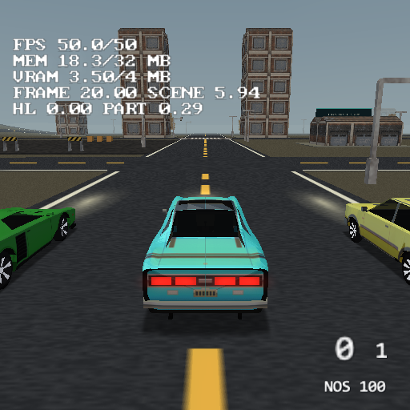
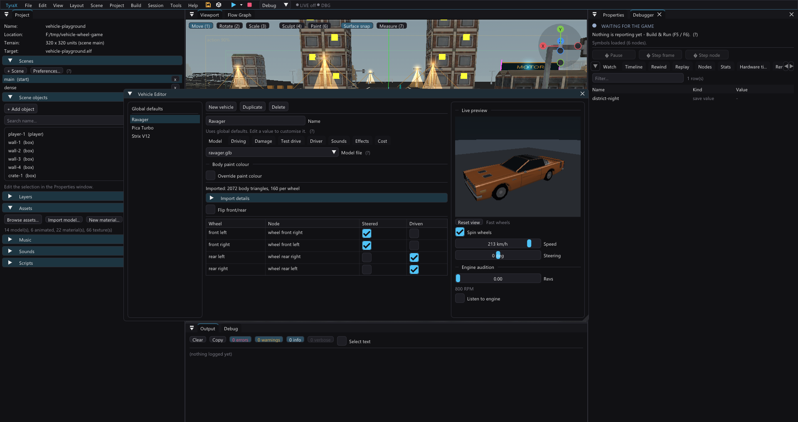
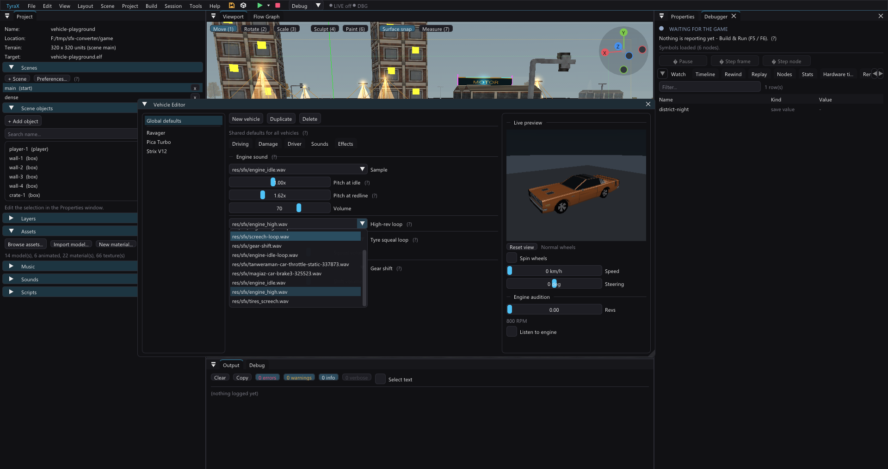
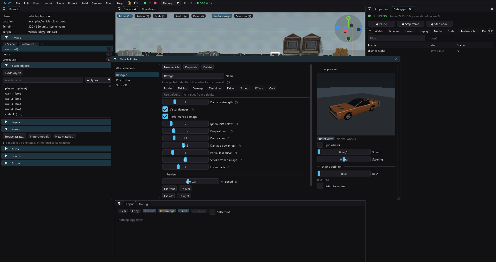
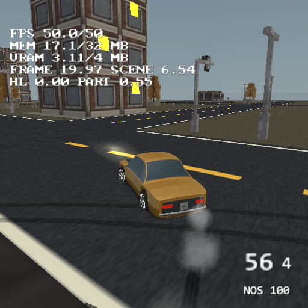

# Vehicles

Create a vehicle definition in **Tools > Vehicle Editor**, assign an imported
model, then place instances in scenes. Walk up to a driveable vehicle, look at
it and press **Use** to enter; press it again to exit. The same definition can serve many
placed cars. [The Blender tutorial](blender-vehicle-modeling.md) covers making
and exporting a model from scratch. [Motor District](../examples/vehicle-playground/README.md)
is a playable example with three editable Blender cars.

## Importing a model

Import a `.glb` into `res/models/`, then select it on the Vehicle Editor's
**Model** tab. Keep four separate, similarly sized wheel mesh objects with
their origins at the hubs. The importer detects them by shape and position;
the wheel table lets you mark each one **Steered** and **Driven**. Check the
measured wheelbase, track and radius. Use **Flip front/rear** if it guessed the
nose incorrectly. Re-export from Blender when geometry or UVs are wrong.

Give lamps materials named `headlights` and `rear lights`; use `glass` or
`window` for glazing. A single compact body atlas and few materials reduce
PS2 draw submissions. The default body budget is 2400 triangles; roughly 160
per wheel is a useful target. The **Cost** tab reports the actual baked
triangles and submissions. Models with an interior can use translucent glass.

For traffic and distant cars, assign a **Far model** on the Cost tab. Export it
in the same coordinates and with the same atlas as the full model. The Cost tab
also sets the full-to-far distance and the separate distance for parked and AI
cars. An optional fast-wheel model replaces all four wheels above the authored
spin threshold. The full model remains the source of wheel positions and
handling geometry.

### Changing body paint colour

For a textured body, make a grayscale PNG with exactly the same dimensions as
its atlas: white where paint should change, black on glass, lamps, wheels and
trim. Select it as **Paint mask** in the Vehicle Editor. The mask is applied
during baking and can be overridden per placed vehicle. An untextured model
can instead use a material whose name contains `paint`.

## The Vehicle Editor

Choose **Global defaults** for settings shared by new vehicles, or choose a
vehicle to edit it. Changing one inherited control creates a local override
for that field. **Use defaults** resets the current section. Model, wheel
geometry, paint, LOD and exit offset stay local to each definition.

| Tab | Main controls |
|---|---|
| Model | Model, wheel roles, front direction, paint and glass |
| Driving | Acceleration, speed, steering, grip, suspension, gearbox and nitrous |
| Damage | Visual and performance damage, dents, loose parts and power loss |
| Driver | Cameras, HUD and exit position |
| Sounds | Engine loops, pitch curves, tyre squeal and gear shift |
| Effects | Headlights, lamp glow, skid marks and tyre smoke |
| Cost | Triangle budgets, submissions, fast wheels and far model |

The **Live preview** uses the baked body and wheels. Drag to orbit, scroll to
zoom, move **Steering**, or enable **Spin wheels**. The Damage tab can apply
test hits and repair the preview. **Listen to engine** and **Revs** audition
the current sound tuning without driving the game.

## Driving and handling

The drive model uses wheelbase, steering, grip, suspension and weight transfer.
**Acceleration** sets low-speed pull; **Power fade** reduces pull toward top
speed, so the final-gear redline takes a long straight to reach. Nitrous adds
power and allows speed above the ordinary cap. **Has nitrous** enables a tank;
**Nitrous seconds** and refill control its use. Off-road acceleration and grip
can be set separately from road handling, while road materials and painted
terrain layers supply their own grip multipliers.

The gearbox derives engine RPM from driven-wheel speed and gear ratios.
**Shift up at**, **Shift down at**, **Shift time** and **Gear torque character**
control its presentation and power interruption. Wheelspin raises RPM without
raising road speed. Vehicles can drift under handbrake grip and slide against
walls rather than stopping on a glancing contact.

### Rev limiter

**Rev limiter** (Engine and gears, 0 = off, the default) makes a flat-out
engine bounce off the redline: the note dips and climbs back
**Limiter bounces** times a second, quieter in the dip, like a fuel cut. It
engages with the throttle above half, the engine past 96.5% of the idle to
redline range, not mid-shift and not on nitrous (nitrous over-revs the final
gear on purpose). The 96.5% is there because drag and the power fade hold a car
on the level at about 98% of its top speed, never 100%. The box changes up
before the redline in every other gear, so in practice that is the final
gear near top speed. The depth is the dip: 1 takes off
15% of the rev range. It changes only the sound and the RPM readouts, never
the car's speed. **Listen to engine** with **Revs** at the top of the slider
plays it. `vehiclesim::revLimiterStep` and the runtime's
`vehRevLimiterStep` are twins.

A held handbrake locks the driven wheels: the throttle drives nothing while
it is held, and the car slides against its whole ground velocity at 0.4x
*Brake decel*. From top speed on the default tuning it rests in about 20
units, gas or no gas. A flick (pull, steer, release, throttle) still throws
the rear out into a drift. Before 1.162.2 gas plus handbrake out-accelerated
the handbrake and the car skated on for hundreds of units (`--vehicle-check`
now pins this).

| Default control | Action |
|---|---|
| Square / Use | Enter or exit |
| R2 | Accelerate; brake when rolling backwards |
| L2 | Brake, then reverse once stopped |
| Left stick X | Steer |
| Circle | Handbrake |
| Cross | Nitrous |
| D-pad up | Headlights |
| Triangle | Cycle chase, bumper and far cameras |
| Right stick | Glance around and raise or lower the camera |
| R3 | Hold for rear view |

Throttle and brake read DualShock 2 pressure; digital sources use full input.
Actions can be rebound in the [Input Map](input-bindings.md). The Driver tab
sets the camera rig and door-side exit offset. Exit placement automatically
keeps the player's capsule clear of the car's side even when the authored
offset is too close; both Use and the Exit Vehicle flow node use it. When the
door opens into another car or a wall, the player is placed further out, on
the other side, behind or in front - the first spot clear of every collision
box (a walker that starts inside a box cannot move until it jumps out). The
log line `VEH exit spot N` names the spot taken (0 = the door, -1 = none was
clear, so the door spot stands). Chase and far cameras shorten their boom
against terrain and obstacles.

Use enters the car you are **looking at**, not just the nearest one: it must
be in reach (1.2x wheelbase + 2 units from the player) and under the camera's
aim - a car whose footprint the aim crosses wins, otherwise the car closest to
the aim within 45 degrees. The prompt follows the same choice, so with two
cars side by side it shows only for the one Use would enter.
`TerrainGame::vehicleUseTarget` is that one decision.

### AI drivers and flow graphs

Assign a vehicle a waypoint route to make it drive itself. AI uses the same
handling, surface grip and collision model as the player, with steering and
speed planning for bends and other cars.

The Player flow nodes **Enter Vehicle**, **Exit Vehicle** and **Repair Vehicle**
seat, release or repair the player without a pad press. Enter Vehicle can seat
the player from anywhere, including at scene start. Repair Vehicle restores
the body and performance. These nodes are handled in the generated game.

## Sounds

Choose an imported WAV for **Idle loop**. Its pitch moves from **Pitch at idle**
to **Pitch at redline** as RPM rises, including the first pull away. The
optional **High-rev loop** fades in from **High-rev starts at** and has its own
start and end pitch. Uncheck **Enable high-rev loop** to play only the idle
recording across the whole range without losing the selected high-rev sample
or its settings. The Sounds tab also sets volumes, tyre squeal and gear shift.

Use short, clean, steady-RPM loops; the build encodes continuous roles as
looping PS2 audio. **Listen to engine** in Live preview follows the same pitch
and crossfade controls. The preview uses host audio, while the game plays the
encoded samples on SPU2.

## Damage

**Damage strength** sets how much a qualifying collision hurts; zero disables
damage. **Visual damage** independently controls dents, loose parts, broken
lamps, impact dust and engine smoke. **Performance damage** independently
controls lost acceleration and top speed, nitrous lockout and immobilisation
at a full wreck. If both are off, impacts do not increase the damage meter.

**Ignore hits below** filters small speed changes. **Deepest dent** and
**Dent radius** shape body deformation; **Loose parts** allows authored
bonnets, doors, boot and glass pieces to break away. **Damage power loss** sets
the maximum partial loss, and **Partial loss curve** decides when it arrives:
1 is linear, below 1 hurts sooner, above 1 preserves power until later damage.
With performance damage enabled, a fully wrecked car cannot drive until
repaired. The HUD shows damage when relevant.

## Effects and display

Headlights project pools onto the ground; lamp glow follows the authored lamp
materials. Skid marks and tyre smoke respond to slip. The Effects tab accepts
built-in effects, materials, or a particle-library smoke effect. **Body shine**
uses a reflection texture or the sky (with the city as boxes when *Reflect static
scenery as boxes* is on, and a flat-colour ground that costs ~2 ms less a turning
frame on the open road with *Reflect the ground as flat colour* -
docs/reflective-materials.md); translucent glass needs a useful
interior. **Speed feel** adds authored shake, blur, camera widening and nitrous
flames as speed rises. The Driver tab controls the speedometer and HUD scale.

### Exhaust pipes

The nitrous flame, the blue-orange pop on every upshift and a thin, constant
exhaust smoke come out of the model's **exhaust markers**: geometry-free nodes
(Blender empties) whose name starts with `exhaust` - `exhaust`, `exhaust.001`,
`Exhaust_L` all count, up to six per car. Put each at a pipe's opening; the
flame and smoke leave along the empty's arrow (Blender's *Single Arrow*, local
+Z), so rotate it to point out of the pipe. An empty left unrotated points
straight up, which the import reads as "out of the back"; tilt a real upright
stack a degree off vertical. Both `.glb` and `.fbx` work - the two exporters
store that arrow on different node axes and the bake reads each correctly. The
[Blender tutorial](blender-vehicle-modeling.md#4-mark-the-exhaust-pipes) shows
the steps.

A model with no markers keeps the old behaviour: two pipes guessed a quarter of
the track apart under the rear bumper, and one centred pop per upshift. The
Effects tab says which one a car has. **Exhaust smoke** (Effects > Exhaust)
scales the smoke, 0 switches it off; it puffs only from cars that are driven
(by the player or an AI route) within about 35 units of the camera, thicker on
the throttle, and shares the tyre-smoke pool, so it costs no draw submission.

## Build and verify

The editor bakes the imported model, paint, wheels and optional far tier, then
generates the vehicle definitions and runtime for the PS2 project. Build the
project and inspect the car from behind, beside the wheels, at night and at a
distance. Drive it over roads and terrain, test entry and exit, then audition
engine pitch across the RPM range. The Vehicle Editor's preview catches many
geometry issues before a game build; the generated game is the final check.

For the example's source assets and build steps, see [Motor District](../examples/vehicle-playground/README.md).
